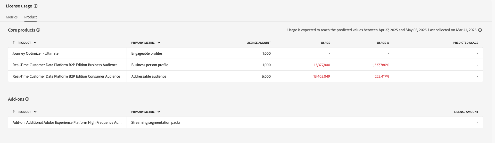

# 라이선스 사용 대시보드 {#license-usage-dashboard}

>[!CONTEXTUALHELP]
>id="testy-mctestface"
>title="표시되면 안 되는 테스트 대화 상자"
>abstract="{date}에서 {name} 오브젝트를 조회 중입니다."

>[!CONTEXTUALHELP]
>id="platform_dashboards_licenseusage_core"
>title="핵심 제품 테이블"
>abstract="테이블에 나열된 핵심 제품에는 샌드박스 수준의 자체 지표, 사용 추적 및 드릴스루 보기가 있습니다. 이러한 핵심 제품은 추적에 대한 주요 지표를 제공하며, 모든 추가 기능은 이러한 지표에 포함됩니다."

>[!CONTEXTUALHELP]
>id="platform_dashboards_licenseusage_addons"
>title="추가 기능 테이블"
>abstract="추가 기능 테이블에는 라이선스 금액이 핵심 제품에서 지원하는 지표와 결합된 제품이 나열되어 있습니다. 이러한 추가 기능에는 별도의 지표가 없지만 연결된 핵심 제품의 사용 추적을 향상시킵니다."

>[!CONTEXTUALHELP]
>id="platform_dashboards_licenseUsage"
>title="라이선스 사용 대시보드"
>abstract="라이선스 사용 대시보드는 구매한 Adobe Experience Platform 제품에 대한 인사이트를 제공합니다. 대시보드 개요에는 각 기본 지표에 대한 사용량과 계약된 라이선스 금액 등 제품에 대한 기본 지표가 표시됩니다. 세부 정보 작업 영역에는 특정 샌드박스 내에 있는 각 제품에 대한 지표의 분류가 표시됩니다."
>additional-url="https://experienceleague.adobe.com/docs/experience-platform/data-lifecycle/ui/dataset-expiration.html?lang=ko" text="자동화된 데이터 세트 만료 일정"
>additional-url="https://experienceleague.adobe.com/docs/experience-platform/profile/pseudonymous-profiles.html?lang=ko" text="익명 프로필 데이터 만료"

>[!CONTEXTUALHELP]
>id="platform_licenseusage"
>title="라이선스 사용 대시보드"
>abstract="라이선스 사용 대시보드는 구매한 Adobe Experience Platform 제품에 대한 인사이트를 제공합니다. 대시보드 개요에는 각 기본 지표에 대한 사용량과 계약된 라이선스 금액 등 제품에 대한 기본 지표가 표시됩니다. 세부 정보 작업 영역에는 특정 샌드박스 내에 있는 각 제품에 대한 지표의 분류가 표시됩니다."
>additional-url="https://experienceleague.adobe.com/docs/experience-platform/data-lifecycle/ui/dataset-expiration.html?lang=ko" text="자동화된 데이터 세트 만료 일정"
>additional-url="https://experienceleague.adobe.com/docs/experience-platform/profile/pseudonymous-profiles.html?lang=ko" text="익명 프로필 데이터 만료"

>[!CONTEXTUALHELP]
>id="platform_dashboards_licenseusage_predictedusage_computehours"
>title="예상 컴퓨팅 시간"
>abstract="컴퓨팅 시간은 배치 쿼리를 실행할 때 쿼리 서비스 엔진이 데이터를 읽고, 처리하고, 쓰는 데 소요되는 시간을 측정합니다. 사용량이 사용 허가된 양에 도달했을 수 있습니다. 사용량을 측정하거나 줄이려면 쿼리 > 로그로 이동하여 쿼리 기록을 검토하십시오. 쿼리 작업 영역에 액세스할 수 있는 권한이 없다면 귀사의 관리자에게 문의하십시오."
>additional-url="https://experience.adobe.com/#/platform/query/log.html" text="로그 작업 영역 쿼리"

>[!CONTEXTUALHELP]
>id="platform_dashboards_licenseusage_predictedusage_addressableaudience"
>title="주소 지정 가능한 예상 대상자"
>abstract="주소 지정 가능한 예상 대상자란 조직에서 실시간 고객 프로필을 통해 참여시킬 수 있는 개인 프로필 집합입니다. 이 지표에는 직접 식별 가능한 프로필과 익명 프로필이 모두 포함됩니다. 사용량이 사용 허가된 양에 도달했을 수 있습니다. 사용량을 줄이려면 데이터 세트 또는 가명 프로필의 데이터 만료 설정을 구성하십시오."
>additional-url="https://experienceleague.adobe.com/docs/experience-platform/profile/event-expirations.html?lang=ko" text="경험 이벤트 만료"
>additional-url="https://experienceleague.adobe.com/docs/experience-platform/profile/pseudonymous-profiles.html?lang=ko" text="익명 프로필 데이터 만료"

>[!CONTEXTUALHELP]
>id="platform_dashboards_licenseusage_predictedusage_engageableprofiles"
>title="예측된 참여 가능한 프로필"
>abstract="참여 가능한 프로필은 조직에서 지난 12개월 동안 Journey Optimizer를 통해 참여를 시도한 실시간 고객 프로필의 개인 프로필입니다. 사용량이 사용 허가된 양에 도달했을 수 있습니다. 사용량을 줄이려면 데이터 세트 또는 가명 프로필의 데이터 만료 설정을 구성하십시오."
>additional-url="https://experienceleague.adobe.com/docs/experience-platform/profile/event-expirations.html?lang=ko" text="경험 이벤트 만료"
>additional-url="https://experienceleague.adobe.com/docs/experience-platform/profile/pseudonymous-profiles.html?lang=ko" text="익명 프로필 데이터 만료"

>[!CONTEXTUALHELP]
>id="platform_dashboards_licenseusage_predictedusage_businesspersonprofile"
>title="예측된 비즈니스 개인 프로필"
>abstract="비즈니스 개인 프로필은 B2B 컨텍스트에서 개인을 나타내는 실시간 고객 프로필 내의 기록입니다. 사용량이 사용 허가된 양에 도달했을 수 있습니다. 사용량을 줄이려면 데이터 세트 또는 가명 프로필의 데이터 만료 설정을 구성하십시오."
>additional-url="https://experienceleague.adobe.com/docs/experience-platform/profile/event-expirations.html?lang=ko" text="경험 이벤트 만료"
>additional-url="https://experienceleague.adobe.com/docs/experience-platform/profile/pseudonymous-profiles.html?lang=ko" text="익명 프로필 데이터 만료"

>[!CONTEXTUALHELP]
>id="platform_dashboards_licenseusage_predictedusage_corehours"
>title="예상 코어 시간"
>abstract="코어 시간은 Experience Platform 서비스에서 소모된 처리 시간을 나타냅니다. 사용량이 사용 허가된 양에 도달했을 수 있습니다. 사용량을 줄이려면 데이터 세트 또는 가명 프로필의 데이터 만료 설정을 구성하십시오."
>additional-url="https://experienceleague.adobe.com/docs/experience-platform/profile/event-expirations.html?lang=ko" text="경험 이벤트 만료"
>additional-url="https://experienceleague.adobe.com/docs/experience-platform/profile/pseudonymous-profiles.html?lang=ko" text="익명 프로필 데이터 만료"

>[!CONTEXTUALHELP]
>id="platform_dashboards_licenseusage_predictedusage_totaldatavolume"
>title="예측된 총 데이터 양"
>abstract="데이터 양은 참여 및 개인화 워크플로에 실시간 고객 프로필을 사용하여 사용되는 데이터의 총량을 나타냅니다. 사용량이 사용 허가된 양에 도달했을 수 있습니다. 사용량을 줄이려면 데이터 세트 또는 가명 프로필의 데이터 만료 설정을 구성하십시오."
>additional-url="https://experienceleague.adobe.com/docs/experience-platform/profile/event-expirations.html?lang=ko" text="경험 이벤트 만료"
>additional-url="https://experienceleague.adobe.com/docs/experience-platform/profile/pseudonymous-profiles.html?lang=ko" text="익명 프로필 데이터 만료"

>[!CONTEXTUALHELP]
>id="platform_dashboards_licenseusage_predictedusage_cjaRowsAvailable"
>title="예측된 사용 가능한 CJA 행"
>abstract="CJA 행은 Customer Journey Analytics 내에서 분석에 사용할 수 있는 데이터의 일일 평균 행을 의미합니다. 사용량이 사용 허가된 양에 도달했을 수 있습니다. 사용량을 줄이려면 데이터 세트 또는 가명 프로필의 데이터 만료 설정을 구성하십시오."
>additional-url="https://experienceleague.adobe.com/docs/experience-platform/profile/event-expirations.html?lang=ko" text="경험 이벤트 만료"
>additional-url="https://experienceleague.adobe.com/docs/experience-platform/profile/pseudonymous-profiles.html?lang=ko" text="익명 프로필 데이터 만료"

>[!CONTEXTUALHELP]
>id="platform_dashboards_licenseusage_exceededusage_addressableaudience"
>title="주소 지정 가능한 예상 대상자"
>abstract="주소 지정 가능한 예상 대상자란 조직에서 실시간 고객 프로필을 통해 참여시킬 수 있는 개인 프로필 집합입니다. 여기에는 직접 식별 가능한 프로필과 익명 프로필이 모두 포함됩니다. 사용량이 사용 허가된 양을 초과했습니다. 사용량을 줄이려면 데이터 세트 또는 가명 프로필의 데이터 만료 설정을 구성하십시오."
>additional-url="https://experienceleague.adobe.com/docs/experience-platform/profile/event-expirations.html?lang=ko" text="경험 이벤트 만료"
>additional-url="https://experienceleague.adobe.com/docs/experience-platform/profile/pseudonymous-profiles.html?lang=ko" text="익명 프로필 데이터 만료"

>[!CONTEXTUALHELP]
>id="platform_dashboards_licenseusage_exceededusage_engageableprofiles"
>title="예측된 참여 가능한 프로필"
>abstract="참여 가능한 프로필은 조직에서 지난 12개월 동안 Journey Optimizer를 통해 참여를 시도한 실시간 고객 프로필의 개인 프로필입니다. 사용량이 사용 허가된 양을 초과했습니다. 사용량을 줄이려면 데이터 세트 또는 가명 프로필의 데이터 만료 설정을 구성하십시오."
>additional-url="https://experienceleague.adobe.com/docs/experience-platform/profile/event-expirations.html?lang=ko" text="경험 이벤트 만료"
>additional-url="https://experienceleague.adobe.com/docs/experience-platform/profile/pseudonymous-profiles.html?lang=ko" text="익명 프로필 데이터 만료"

>[!CONTEXTUALHELP]
>id="platform_dashboards_licenseusage_exceededusage_businesspersonprofile"
>title="예측된 비즈니스 개인 프로필"
>abstract="비즈니스 개인 프로필은 B2B 컨텍스트에서 개인을 나타내는 실시간 고객 프로필 내의 기록입니다. 사용량이 사용 허가된 양을 초과했습니다. 사용량을 줄이려면 데이터 세트 또는 가명 프로필의 데이터 만료 설정을 구성하십시오."
>additional-url="https://experienceleague.adobe.com/docs/experience-platform/profile/event-expirations.html?lang=ko" text="경험 이벤트 만료"
>additional-url="https://experienceleague.adobe.com/docs/experience-platform/profile/pseudonymous-profiles.html?lang=ko" text="익명 프로필 데이터 만료"

>[!CONTEXTUALHELP]
>id="platform_dashboards_licenseusage_exceededusage_corehours"
>title="예상 코어 시간"
>abstract="코어 시간은 Experience Platform 서비스에서 소모된 처리 시간을 나타냅니다. 사용량이 사용 허가된 양을 초과했습니다. 사용량을 줄이려면 데이터 세트 또는 가명 프로필의 데이터 만료 설정을 구성하십시오."
>additional-url="https://experienceleague.adobe.com/docs/experience-platform/profile/event-expirations.html?lang=ko" text="경험 이벤트 만료"
>additional-url="https://experienceleague.adobe.com/docs/experience-platform/profile/pseudonymous-profiles.html?lang=ko" text="익명 프로필 데이터 만료"

>[!CONTEXTUALHELP]
>id="platform_dashboards_licenseusage_exceededusage_totaldatavolume"
>title="예측된 총 데이터 양"
>abstract="데이터 양은 참여 및 개인화 워크플로에 실시간 고객 프로필을 사용하여 사용되는 데이터의 총량을 나타냅니다. 사용량이 사용 허가된 양을 초과했습니다. 사용량을 줄이려면 데이터 세트 또는 가명 프로필의 데이터 만료 설정을 구성하십시오."
>additional-url="https://experienceleague.adobe.com/docs/experience-platform/profile/event-expirations.html?lang=ko" text="경험 이벤트 만료"
>additional-url="https://experienceleague.adobe.com/docs/experience-platform/profile/pseudonymous-profiles.html?lang=ko" text="익명 프로필 데이터 만료"

>[!CONTEXTUALHELP]
>id="platform_dashboards_licenseusage_exceededusage_cjaRowsAvailable"
>title="예측된 사용 가능한 CJA 행"
>abstract="CJA 행은 Customer Journey Analytics 내에서 분석에 사용할 수 있는 데이터의 일일 평균 행을 의미합니다. 사용량이 사용 허가된 양을 초과했습니다. 사용량을 줄이려면 데이터 세트 또는 가명 프로필의 데이터 만료 설정을 구성하십시오."
>additional-url="https://experienceleague.adobe.com/docs/experience-platform/profile/event-expirations.html?lang=ko" text="경험 이벤트 만료"
>additional-url="https://experienceleague.adobe.com/docs/experience-platform/profile/pseudonymous-profiles.html?lang=ko" text="익명 프로필 데이터 만료"

Adobe Experience Platform [!UICONTROL 라이선스 사용] 대시보드를 통해 조직의 라이선스 사용에 대한 중요한 정보를 볼 수 있습니다. 여기에 표시되는 정보는 Experience Platform 인스턴스의 일별 스냅샷 중에 캡처됩니다.

라이선스 사용 보고서는 높은 수준의 세부기간을 제공합니다. 대부분의 지표는 여러 제품에서 공유되며 제품당 합계가 아닌 해당 지표를 사용하는 모든 제품에서 집계된 사용을 반영합니다. 대시보드는 모든 프로덕션 또는 개발 샌드박스에서 이러한 지표의 통합 사용과 특정 샌드박스의 사용 지표를 제공합니다. 사용 지표를 사용하여 Real-Time Customer Data Platform, Adobe Journey Optimizer 및 Customer Journey Analytics Experience Platform 애플리케이션을 추적할 수 있습니다.

이 안내서에서는 UI에서 라이선스 사용 대시보드에 액세스하고 작업하는 방법에 대해 간략하게 설명하고 대시보드에 표시된 시각화에 대한 자세한 정보를 제공합니다.

Experience Platform UI에 대한 일반적인 개요는 [Experience Platform UI 안내서](../../landing/ui-guide.md)를 참조하십시오.

## [!UICONTROL 라이선스 사용량] 대시보드 데이터

[!UICONTROL 라이선스 사용량] 대시보드에는 구입한 모든 Experience Platform 제품 목록과 해당 제품에 대한 추가 기능이 표시됩니다. 이 대시보드에서 연결된 모든 샌드박스에서 Experience Platform에 대한 조직의 라이선스 관련 데이터의 스냅샷을 찾을 수 있습니다.

이 대시보드의 데이터는 스냅샷이 생성된 특정 시점에 표시된 것과 동일하게 표시됩니다. 근사치나 샘플이 아니라 대시보드가 실시간으로 업데이트되지 않는다.

>[!NOTE]
>
>대시보드의 지표 대부분은 Experience Platform 인스턴스의 스냅샷을 기반으로 매일 업데이트됩니다. [!UICONTROL 사용 가능한 CJA 행]은(는) 예외이며 매월 업데이트됩니다. [!UICONTROL Adhoc Query Service 사용자 팩], [!UICONTROL Profile Richness No of Packs], [!UICONTROL Streaming Segmentation No of Packs]와 같이 &quot;팩&quot;으로 레이블이 지정된 지표는 추가 기능 오퍼에 대한 라이선스 권한을 반영하며 지속적인 사용을 추적하지 않습니다. 스냅샷 이후에 변경한 내용은 다음 스냅샷을 생성할 때까지 표시되지 않습니다.

## 라이선스 사용 대시보드 살펴보기 {#explore}

Experience Platform UI 내의 라이선스 사용 대시보드로 이동하려면 왼쪽 레일에서 **[!UICONTROL 라이선스 사용]**&#x200B;을 선택합니다. 대시보드에는 **[!UICONTROL 지표]** 및 **[!UICONTROL 제품]**&#x200B;의 두 탭이 있습니다.

>[!NOTE]
>
>라이선스 사용 대시보드는 기본적으로 활성화되어 있지 않습니다. 대시보드를 보려면 사용자에게 &quot;라이선스 사용 대시보드 보기&quot; 권한이 부여되어야 합니다. 액세스 권한을 부여하는 단계는 [대시보드 권한 안내서](../permissions.md)를 참조하십시오.

## [!UICONTROL 지표] 탭 {#metrics-tab}

**[!UICONTROL 지표]** 탭에서는 조직의 모든 라이선스 사용 지표를 중앙에서 볼 수 있습니다. 대부분의 지표는 제품에서 공유되므로 이러한 지표에 대한 제품별 분류는 별도로 없습니다.

지표 테이블에는 다음 열이 포함되어 있습니다.

| 열 이름 | 설명 |
|---|---|
| **[!UICONTROL 지표 이름]** | 라이선스 사용 지표의 이름입니다. 각 항목에는 설명 및 관련 제품 목록을 표시하는 정보 아이콘(`ⓘ`)이 포함되어 있습니다. |
| **[!UICONTROL 라이선스]** | 계약에 정의된 대로 조직에서 사용할 수 있는 단위 수. 이 지표는 제품 탭의 **라이선스 양**&#x200B;과 같은 값입니다. |
| **[!UICONTROL 측정됨]** | 조직에서 현재 사용하고 있는 지표의 양입니다. |
| **[!UICONTROL 사용량 %]** | 현재 사용 중인 라이선스 값의 백분율입니다. |
| **[!UICONTROL 예측된 사용량 %]** | 향후 6주 동안 예상되는 지표 사용량 범위. |

**[!UICONTROL 프로덕션]** 또는 **[!UICONTROL 개발]** 샌드박스 전환을 사용하여 샌드박스로 표시되는 지표를 필터링합니다.

>[!NOTE]
>
>소비 보고는 샌드박스 유형별로 누적됩니다. [!UICONTROL 프로덕션] 또는 [!UICONTROL 개발]을 선택하면 해당 형식의 모든 샌드박스에서 결합된 사용량이 표시됩니다.

>[!WARNING]
>
>라이선스 사용 대시보드를 볼 수 있는 권한은 샌드박스 수준에서 지정해야 합니다. 각 개별 샌드박스에 권한을 추가하여 대시보드 내에서 볼 수 있습니다. 이 제한은 향후 릴리스에서 해결될 예정입니다. 당분간은 다음 해결 방법을 사용할 수 있습니다.
>
>1. Adobe Admin Console에서 제품 프로필을 만듭니다.
>2. 샌드박스 범주의 권한 아래에 라이선스 사용 대시보드에서 보려는 모든 샌드박스를 추가합니다.
>3. 사용자 대시보드 권한 범주 아래에 &quot;라이선스 사용량 대시보드 보기&quot; 권한을 추가합니다.

### 지표 세부 사항 보기 {#view-metric-details}

특정 지표에 대한 사용 세부 정보를 보려면 목록에서 지표 이름을 선택합니다. 다음을 포함하여 지표에 대한 세부 보기가 표시됩니다.

- 시간 경과에 따른 사용량을 보여 주는 기록 선 그래프
- 라이선스 값과 측정값 비교
- 개별 샌드박스별 사용
- 데이터를 필터링할 샌드박스 선택기
- CSV 다운로드를 위한 내보내기 옵션

이 시각화를 사용하면 트렌드를 추적하고, 각 샌드박스가 전체 사용에 어떻게 기여하는지 이해하고, 오프라인 분석을 위해 데이터를 내보낼 수 있습니다.

각 차트에는 데이터를 필터링할 드롭다운 메뉴가 포함되어 있습니다. 날짜 범위 드롭다운을 사용하여 전환 확인 기간(기본값: 최근 30일)을 조정하거나 샌드박스 드롭다운을 사용하여 특정 프로덕션 또는 개발 샌드박스에 대한 사용량을 봅니다.

**[!UICONTROL 사용자 지정 날짜]**&#x200B;를 선택하여 표시되는 기간을 선택할 수도 있습니다.

### CSV 내보내기 {#export-metric-usage-data}

지표 세부 사항 보기에서 선택한 지표 및 샌드박스에 대한 사용 내역 데이터를 CSV 파일로 직접 내보낼 수 있습니다. 차트 데이터를 표 형식으로 다운로드하려면 **[!UICONTROL 내보내기]** 아이콘을 선택하십시오. 내보낸 CSV를 통해 오프라인에서 트렌드를 쉽게 분석하거나 팀 간에 사용 인사이트를 공유할 수 있습니다.

## [!UICONTROL 제품] 탭 {#products-tab}

**[!UICONTROL 제품]** 탭에는 구입한 제품 및 연결된 추가 기능별로 그룹화된 라이선스 사용 데이터가 표시됩니다. [!UICONTROL 제품] 탭에는 다음 두 개의 테이블이 있습니다.

- **[!UICONTROL 핵심 제품] 표**: 이 표에는 조직에서 라이선스를 부여한 기본 Adobe Experience Platform 제품이 나열됩니다. 각 제품은 기본 지표, 사용 추적 및 예측된 사용을 나열합니다.
- **[!UICONTROL 추가 기능] 테이블**: 라이선스 금액이 핵심 제품 지표에 기여하는 보조 항목을 나열합니다. 추가 기능에는 별도의 지표가 없지만 연결된 핵심 제품의 사용 추적을 개선합니다.

| 열 이름 | 설명 |
|---|---|
| **[!UICONTROL 제품]** | 조직에서 라이선스를 부여한 Adobe 솔루션. |
| **[!UICONTROL 기본 지표]** | 해당 제품 내에서 추적하는 데 사용되는 기본 지표입니다. |
| **[!UICONTROL 라이선스 금액]** | 기본 지표의 최대 양에 대한 계약된 값입니다. |
| **[!UICONTROL 사용]** | 사용된 기본 지표의 양입니다. |
| **[!UICONTROL 사용량 %]** | 라이선스 금액에 따라 사용되는 기본 지표의 비율입니다. |
| **[!UICONTROL 예측된 사용량]** | 기본 지표의 예상 사용 백분율입니다. |

>[!NOTE]
>
>추가 기능에 대한 [!UICONTROL 라이선스 금액]은(는) 핵심 제품의 총 라이선스 금액에 포함됩니다. 추가 기능은 별도로 추적되지 않지만 관련 제품의 기능을 향상시킵니다. 예를 들어, 추가 기능으로 샌드박스 5개 팩 1개를 구매하면 기본 제품 금액에 금액이 추가됩니다. 추가 기능 테이블에는 추가 기능에 해당하는 [!UICONTROL 라이선스 양]이 표시되지만 실제 사용량은 기본 제품을 통해 추적됩니다.

### 예상 사용량 {#predicted-usage}

>[!CONTEXTUALHELP]
>id="platform_dashboards_licenseUsage_prediction"
>title="예상 사용량"
>abstract="예측은 지난 6~7개월 동안의 사용량을 기반으로 하며 매주 금요일에 생성됩니다. 라이선스 사용량 예측은 과거 사용량을 기반으로 한 추정치입니다. 귀하는 조직의 실제 사용량을 파악하고 사용량이 Adobe와 조직의 라이선스 범위를 벗어나지 않도록 할 책임이 있습니다. 사용량을 줄이려면 샌드박스 및 데이터 세트에 대한 데이터 세트 또는 익명 프로필 데이터 만료를 구성하십시오."
>additional-url="https://experienceleague.adobe.com/docs/experience-platform/data-lifecycle/ui/dataset-expiration.html?lang=ko" text="자동화된 데이터 세트 만료 일정"
>additional-url="https://experienceleague.adobe.com/docs/experience-platform/profile/pseudonymous-profiles.html?lang=ko" text="익명 프로필 데이터 만료"

>[!CONTEXTUALHELP]
>id="platform_licenseusage_prediction"
>title="예상 사용량"
>abstract="예측은 지난 6~7개월 동안의 사용량을 기반으로 하며 매월 15일에 생성됩니다. 라이선스 사용량 예측은 과거 사용량을 기반으로 한 추정치입니다. 귀하는 조직의 실제 사용량을 파악하고 사용량이 Adobe와 조직의 라이선스 범위를 벗어나지 않도록 할 책임이 있습니다. 사용량을 줄이려면 샌드박스 및 데이터 세트에 대한 데이터 세트 또는 익명 프로필 데이터 만료를 구성하십시오."
>additional-url="https://experienceleague.adobe.com/docs/experience-platform/data-lifecycle/ui/dataset-expiration.html?lang=ko" text="자동화된 데이터 세트 만료 일정"
>additional-url="https://experienceleague.adobe.com/docs/experience-platform/profile/pseudonymous-profiles.html?lang=ko" text="익명 프로필 데이터 만료"

정확한 최신 사용 예측을 통해 라이센스 리소스를 사전 예방적으로 관리하고 최적화할 수 있습니다. [!UICONTROL 예상 사용량] 열은 구입한 모든 제품에 대한 모든 프로덕션 및 개발 샌드박스에서 샌드박스 수준에서 향후 라이선스 사용량을 예측합니다. 이제 예측은 매주 업데이트되며, 최신 사용 데이터를 기반으로 6주 간의 예측을 제공합니다. 각 예측은 정보에 입각한 계획을 지원하기 위한 하한 및 상한을 모두 포함한다.

>[!IMPORTANT]
>
>예측은 매주 금요일에 갱신된다. 새로 고침 날짜가 정보 아이콘() 있습니다.

[!UICONTROL 핵심 제품] 테이블의 [!UICONTROL 제품] 탭에서 제품의 권한 사용 요약을 봅니다.

![제품 및 예상 사용 열이 강조 표시된 [!UICONTROL 라이선스 사용량] [!UICONTROL 제품] 탭입니다.](../images/license-usage/product-predicted-usage.png)

>[!NOTE]
>
>라이선스 사용량 예측은 과거 사용량을 기반으로 한 추정치입니다. 조직의 실제 사용을 이해하고 사용이 Adobe을 사용한 조직의 라이선스 범위를 벗어나지 않도록 해야 합니다.

예측된 사용의 비율은 다음과 같이 결정됩니다.

- 하한과 상한이 크게 다른 경우 범위로 표시됩니다(예: 32% - 35%).
- 하한과 상한이 거의 동일하고 0이 아닌 경우 근사값(예: ~34%)으로 표시됩니다.
- 하한과 상한이 거의 동일하고 0이면 정확히 0%로 표시됩니다.

>[!NOTE]
>
>이 컨텍스트에서 &quot;거의 같음&quot;은 값이 소수점 이하 두 자리로 통계적으로 중요함을 의미합니다(예: 하한 0.342와 상한 0.344는 모두 34%로 반올림됨).

예측된 사용 기능은 다음 지표를 지원합니다.

- [!UICONTROL 대응 가능 대상]
- [!UICONTROL 사업가 프로필]
- [!UICONTROL 시간 계산]
- [!UICONTROL 고객 여정 대상 행 수]
- [!UICONTROL 참여 가능한 프로필]
- [!UICONTROL 총 데이터 볼륨]

## 사용 가능한 지표 {#available-metrics}

>[!IMPORTANT]
>
>8월 20일부터 &#39;[!UICONTROL 평균 프로필 풍부도]&#39; 및 &#39;[!UICONTROL 총 저장소]&#39;에 대한 사용 권한이 있는 고객은 라이선스 사용 대시보드에서 &#39;[!UICONTROL 총 데이터 볼륨]&#39;을(를) 대신 보았습니다. 고객 권한은 변경되지 않았으며 추적 지표의 단순화만 있었습니다. [!UICONTROL 총 데이터 볼륨]은(는) 참여 및 개인화 워크플로에 대한 실시간 고객 프로필에서 사용할 수 있는 데이터를 나타냅니다. 이 간소화된 지표는 실시간 고객 프로필 사용에 대한 관리 및 측정을 개선했습니다. 고객은 이 변경에 대한 자세한 내용을 확인하기 위해 Adobe 담당자에게 문의하는 것이 좋습니다.

라이선스 사용 대시보드는 조직의 여러 제품에 적용할 수 있는 몇 가지 고유한 지표에 대해 보고합니다. 사용 가능한 지표는 다음과 같습니다.

| 지표 | 설명 |
|---|---|
| [!UICONTROL Audience Activation 크기] | 1년 동안 파일 기반 대상에 대해 활성화된 프로필의 총 크기입니다. 참고: 여기에는 스트리밍 대상을 통해 전송된 프로필이 포함되지 않습니다. |
| [!UICONTROL 대응 가능 대상] | 직접 식별 가능한 프로필과 익명 프로필을 포함하여 조직에서 참여할 수 있는 실시간 고객 프로필의 개인 프로필 집합입니다. 이러한 프로필에는 속성, 동작 및 세그먼트 멤버십 데이터가 포함될 수 있습니다. 프로필 볼륨은 Adobe Experience Platform의 기본 결정론적 ID 그래프를 사용하여 계산되며 공유 기능으로 간주됩니다. |
| [!UICONTROL 임시 쿼리 서비스 사용자 팩] | 허가된 동시 쿼리 서비스 사용자 권한을 5명의 추가 동시 쿼리 서비스 사용자와 팩당 하나의 추가 동시 실행 임시 쿼리로 늘리는 추가 기능입니다. 여러 개의 추가 임시 쿼리 사용자 팩에 라이선스가 부여될 수 있습니다. |
| [!UICONTROL 평균 프로필 풍부도] | **사용되지 않음** - 특정 시점에 Hub Profile Service에 저장된 모든 프로덕션 데이터의 합계를 인증된 비즈니스 사용자 프로필의 5배로 나눈 값입니다. [!UICONTROL 평균 프로필 풍부도]은(는) 공유 기능입니다. |
| [!UICONTROL 사용 가능한 CJA 행] | Customer Journey Analytics에서 분석에 사용할 수 있는 일일 평균 데이터 행의 수입니다. |
| [!UICONTROL 계산된 특성] | 프로필 속성으로 변환되고 개인 프로필에 포함될 수 있는 경험 이벤트를 기반으로 집계된 프로필 행동 데이터입니다. |
| [!UICONTROL 소비자 대상] | 판매 주문에서 &quot;소비자 대상&quot;으로 식별된 개인 프로필 수입니다. |
| [!UICONTROL 데이터 내보내기 크기] | 1년 동안 데이터 세트 활성화를 통해 전송된 데이터의 양입니다. |
| [!UICONTROL 데이터 내보내기] | 1년 동안 비 Adobe 솔루션으로 (직접 또는 간접적으로) 내보낼 수 있는 데이터 세트의 총 크기입니다. |
| [!UICONTROL 데이터 레이크 저장소] | Adobe Experience Platform 내 분석 데이터 저장소에 사용된 수량입니다. |
| [!UICONTROL 참여 가능한 대상] | Journey Optimizer의 작성, 의사 결정, 게재, 실험 또는 오케스트레이션 기능을 사용하여 지난 12개월 내에 참여하려고 한 실시간 고객 프로필의 사용자 프로필 그룹입니다. |
| [!UICONTROL 유사 대상] | 유사 소비자 대상은 기존 소비자 대상을 모델링하여 유사한 속성이나 행동이 있는 사용자 프로필을 식별하여 생성된 대상입니다. |
| [!UICONTROL AMM 모델 수] | 귀하의 투자에 따라 지정된 결과를 측정 및/또는 예측하는 데 사용되는 머신 러닝 모델(Adobe Mix Modeler에서 기본 제공)의 수입니다. |
| [!UICONTROL 샌드박스 수] | Adobe Experience Platform에 액세스하여 데이터와 운영을 분리하는 모든 Adobe 온디맨드 서비스 인스턴스 내 논리적 분리의 수입니다. |
| [!UICONTROL Pack의 프로필 풍부성 아니요] | 추가 프로필 풍부도 팩당 프로필당 승인된 총 데이터 용량이 25KB씩 증가합니다. |
| [!UICONTROL 쿼리 서비스 계산 시간] | 배치 쿼리 실행 시 쿼리 서비스 엔진이 데이터를 읽고, 처리하고, 데이터 레이크로 다시 쓰는 데 걸리는 시간을 측정한 값입니다. |
| [!UICONTROL 팩 중 스트리밍 세분화 없음] | 팩은 스트리밍 흐름을 통해 새 데이터가 세분화 서비스에 입력됨에 따라 사용자 프로필에 대한 세그먼트 멤버십을 업데이트해 줍니다. 세그먼트 멤버십은 이전 행동을 고려하지 않으면서 현재 사용자 프로필 속성과 현재의 이벤트의 값을 기준으로 평가됩니다. 스트리밍 세분화는 공유 기능입니다. |
| [!UICONTROL 총 데이터 볼륨] | 실시간 고객 프로필이 참여 워크플로우에서 사용할 수 있는 총 데이터 양입니다. 총 데이터 볼륨은 **총 데이터 볼륨 = 대응 가능 대상 × 평균 프로필 풍부도** 공식을 사용하여 계산됩니다. 이 지표는 프로필 저장소에만 저장된 데이터를 반영하며 데이터 레이크 저장소는 제외합니다. 프로필 기반 참여와 관련된 데이터에 대해 보다 집중적인 보기를 제공합니다. 자세한 내용은 총 데이터 볼륨에 대한 [자주 묻는 질문](../../landing/license-usage-and-guardrails/total-data-volume.md)을 참조하세요. |
| [!UICONTROL 총 데이터 이그레스 볼륨] | Adobe Experience Platform에서 서드파티 데이터 웨어하우스로 내보낸 연간 누적 데이터 양입니다. |

<!-- |  [!UICONTROL Sandbox No of Packs] |  A logical separation within your instance of any Adobe On-demand Service that accesses Adobe Experience Platform isolating data and operations | -->

>[!TIP]
>
>판매 주문에서 라이선스 권한을 확인하여 &#39;스토리지 허용량&#39;과 같은 지표를 계산할 수 있습니다. 예:<ul><li>저장 허용 = 계약에 포함된 &quot;승인된 프로필&quot; 수 X 평균 프로필 풍부도</li></ul>

이러한 지표의 사용 가능 여부 및 이러한 각 지표의 특정 정의는 조직이 구입한 라이선스에 따라 다릅니다. 각 지표에 대한 자세한 정의는 해당 제품 설명 설명서를 참조하십시오.

| 라이선스 | 제품 설명 |
| --- | --- |
| <ul><li>ADOBE EXPERIENCE PLATFORM:OD LITE</li><li>ADOBE EXPERIENCE PLATFORM:OD 표준</li><li>ADOBE EXPERIENCE PLATFORM:OD HEAVY</li></ul> | [Adobe Experience Platform](https://helpx.adobe.com/kr/legal/product-descriptions/adobe-experience-platform.html) |
| <ul><li>ADOBE EXPERIENCE PLATFORM:OD</li></ul> | [Experience Platform, 앱 서비스 및 Intelligent Services](https://helpx.adobe.com/kr/legal/product-descriptions/exp-platform-app-svcs.html) |
| <ul><li>RT CUSTOMER DATA PLATFORM:OD</li><li>RT 고객 데이터 플랫폼: PRFL에서 10M로 업그레이드</li><li>RT CUSTOMER DATA PLATFORM: PRFL ~ 50M</li></ul> | [Adobe Real-Time Customer Data Platform](https://helpx.adobe.com/kr/legal/product-descriptions/real-time-customer-data-platform.html) |
| <ul><li>AEP:OD 활성화</li><li>AEP:OD 활성화 PRFL ~ 10M</li><li>AEP:OD 활성화 PRFL 최대 50M</li></ul> | [Adobe Experience Platform 활성화](https://helpx.adobe.com/kr/legal/product-descriptions/adobe-experience-platform0.html) |
| <ul><li>AEP:OD INTELLIGENCE</li></ul> | [Adobe Experience Platform 인텔리전스](https://helpx.adobe.com/kr/legal/product-descriptions/adobe-experience-platform-intelligence---product-description.html) |
| <ul><li>JOURNEY OPTIMIZER SELECT:OD</li><li>JOURNEY OPTIMIZER PRIME:OD</li><li>JOURNEY OPTIMIZER ULTIMATE:OD</li><li>AJO PRIME STARTER:OD 펼치기</li><li>AJO ULTIMATE STARTER:OD 펼치기</li><li>Real-Time CDP 실행:OD 프로필 오케스트레이션</li></ul> | [Adobe Journey Optimizer](https://helpx.adobe.com/kr/legal/product-descriptions/adobe-journey-optimizer.html) |

>[!WARNING]
>
>라이선스 사용 대시보드는 조직에 대해 프로비저닝된 최신 라이선스에 대해서만 보고합니다. 조직에 대해 프로비저닝된 최신 라이센스가 위의 표에 표시되지 않으면 라이센스 사용 대시보드가 제대로 표시되지 않을 수 있습니다. 향후 릴리스를 위해 단일 조직에서 추가 라이선스 및 여러 라이선스를 지원할 예정입니다.

## 다음 단계

이 문서를 읽고 나면 구입한 각 제품, 모든 프로덕션 또는 개발 샌드박스 및 특정 샌드박스에 대한 라이선스 사용량 대시보드를 찾고 사용량 지표를 볼 수 있습니다. 조직에서 구입한 라이선스에 따라 조직에서 사용 가능한 지표에 대한 자세한 내용을 찾을 수 있습니다.

Experience Platform UI에서 사용할 수 있는 다른 기능에 대한 자세한 내용은 [Experience Platform UI 안내서](../../landing/ui-guide.md)를 참조하세요.
