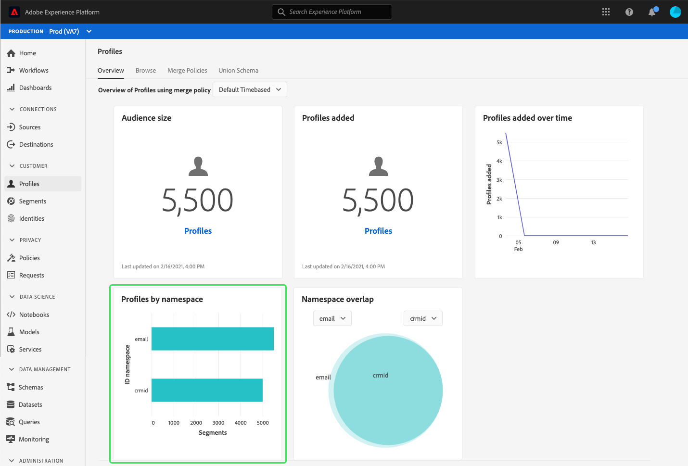

# (베타) [!UICONTROL 프로필] 대시보드

>[!IMPORTANT]
>
>이 문서에 설명된 대시보드 기능은 현재 베타에 있으며 일부 사용자는 사용할 수 없습니다. 설명서 및 기능은 변경될 수 있습니다.

Adobe Experience Platform UI(사용자 인터페이스)는 일별 스냅샷 중에 캡처된 대로 [!DNL Real-time Customer Profile] 데이터에 대한 중요한 정보를 볼 수 있는 대시보드를 제공합니다. 이 안내서에서는 UI에서 [!UICONTROL 프로필] 대시보드에 액세스하고 사용하는 방법을 간략하게 설명하고 대시보드에 표시된 지표에 대한 정보를 제공합니다.

Experience Platform 사용자 인터페이스 내의 모든 프로필 기능에 대한 개요는 [실시간 고객 프로필 UI 안내서](../../profile/ui/user-guide.md)를 참조하십시오.

## 프로필 대시보드 데이터

[!UICONTROL Profiles] 대시보드는 Experience Platform의 프로필 저장소 내에 조직에 있는 속성(레코드) 데이터의 스냅숏을 표시합니다. 스냅샷에는 이벤트(시계열) 데이터가 포함되지 않습니다.

스냅샷의 속성 데이터는 스냅샷을 가져온 특정 시점의 데이터와 동일하게 표시됩니다. 즉, 스냅샷은 근사 또는 데이터 샘플이 아니며, 프로필 대시보드가 실시간으로 업데이트되지 않습니다.

>[!NOTE]
>
>스냅샷을 생성하기 때문에 데이터가 변경된 사항이나 업데이트는 다음 스냅샷을 가져올 때까지 대시보드에 반영되지 않습니다.

## [!UICONTROL 프로필] 대시보드 탐색

플랫폼 UI 내의 [!UICONTROL 프로필] 대시보드로 이동하려면 왼쪽 레일에서 **[!UICONTROL 프로필]**&#x200B;을 선택한 다음 **[!UICONTROL 개요]** 탭을 선택하여 대시보드를 표시합니다.

### 병합 정책 선택

[!UICONTROL 프로필] 대시보드에 표시되는 지표는 실시간 고객 프로필 데이터에 적용되는 병합 정책을 기반으로 합니다. 여러 소스에서 데이터를 함께 가져오는 경우 데이터에 충돌하는 값이 포함될 수 있습니다. 예를 들어, 한 데이터 세트에 고객이 &quot;단일&quot;로 나열될 수 있고 다른 데이터 세트에 고객이 &quot;기혼&quot; 고객으로 나열될 수 있습니다. 그리고 이 데이터는 프로필의 일부로 우선 순위를 지정하고 표시할 데이터를 결정하는 병합 정책의 작업입니다.

대시보드는 표시할 병합 정책을 자동으로 선택하지만 드롭다운 메뉴를 사용하여 선택한 병합 정책을 변경할 수 있습니다. 다른 병합 정책을 선택하려면 병합 정책 이름 옆에 있는 드롭다운을 선택한 다음 보려는 병합 정책을 선택합니다.

>[!NOTE]
>
>드롭다운 메뉴에는 XDM 개별 프로필 클래스와 관련된 병합 정책만 표시되지만, 조직에서 여러 개의 병합 정책을 만든 경우 사용 가능한 병합 정책의 전체 목록을 보려면 스크롤해야 할 수도 있습니다.

조직의 기본 병합 정책을 만들기, 편집 및 선언하는 방법 등 병합 정책에 대한 자세한 내용은 [병합 정책 개요](../../profile/merge-policies/overview.md)를 읽어서 시작하십시오.

### 위젯 및 지표

대시보드는 프로필 데이터와 관련된 중요한 정보를 제공하는 읽기 전용 지표인 위젯으로 구성됩니다. 위젯의 &quot;최근 업데이트&quot; 날짜 및 시간은 데이터의 마지막 스냅숏을 만든 시기를 보여줍니다.

## 사용 가능한 위젯

Experience Platform은 프로필 데이터와 관련된 다양한 지표를 시각화하는 데 사용할 수 있는 여러 위젯을 제공합니다. 자세한 내용을 보려면 아래 위젯의 이름을 선택하십시오.

* [[!UICONTROL 대상 크기]](#audience-size)
* [[!UICONTROL 추가된 프로필]](#profiles-added)
* [[!UICONTROL 시간이 지남에 따라 추가된 프로필]](#profiles-added-over-time)
* [[!UICONTROL 네임스페이스별 프로필]](#profiles-by-namespace)
* [[!UICONTROL 네임스페이스 겹치기]](#namespace-overlap)

### [!UICONTROL 대상 크기] {#audience-size}

**[!UICONTROL 대상 크기]** 위젯은 스냅숏을 만들 때 프로필 데이터 저장소 내에 병합된 총 프로필 수를 표시합니다. 이 숫자는 프로필 조각을 함께 병합하여 각 개인을 위한 단일 프로필을 구성하기 위해 선택한 병합 정책이 프로필 데이터에 적용되는 결과입니다.

조각 및 병합된 프로필에 대한 자세한 내용은 [실시간 고객 프로필 개요](../../profile/home.md)의 *프로필 조각과 병합된 프로필* 섹션을 읽어서 시작하십시오.

>[!NOTE]
>
>이 지표를 계산하는 데 사용되는 병합 정책은 [!UICONTROL 라이선스 사용] 대시보드에서 [!UICONTROL 대응 가능 대상]을 계산하는 데 사용되는 시스템에서 생성한 병합 정책과 같지 않으므로 [!UICONTROL 프로필] 및 [!UICONTROL 라이선스 사용] 대시보드의 대상 수가 정확히 같을 것 같지 않습니다.

### [!UICONTROL 추가된 프로필] {#profiles-added}

**[!UICONTROL 추가된 프로필]** 위젯은 마지막 스냅숏을 만든 이후 프로필 데이터 저장소에 추가된 병합된 프로필의 총 수를 표시합니다. 이 숫자는 프로필 조각을 함께 병합하여 각 개인을 위한 단일 프로필을 구성하기 위해 선택한 병합 정책이 프로필 데이터에 적용되는 결과입니다.

### [!UICONTROL 시간이 지남에 따라 추가된 프로필] {#profiles-added-over-time}

시간 경과에 따라 추가된 프로필&#x200B;]**위젯은 지난 30일 동안 매일 프로필 데이터 저장소에 추가된 병합된 프로필의 총 수를 표시합니다.**[!UICONTROL  이 숫자는 스냅샷을 가져올 때마다 매일 업데이트되므로 프로필을 플랫폼으로 수집하려는 경우 다음 스냅샷을 가져올 때까지 프로필 수가 반영되지 않습니다.

추가된 프로필 수는 프로필 조각을 함께 병합하여 각 개인을 위한 단일 프로필을 구성하기 위해 선택한 병합 정책이 프로필 데이터에 적용되어 있는 결과입니다.

### [!UICONTROL 네임스페이스별 프로필] {#profiles-by-namespace}

**[!UICONTROL 네임스페이스별 프로필]** 위젯은 프로필 저장소의 병합된 모든 프로필에서 ID 네임스페이스의 분류를 표시합니다. 한 프로필에는 여러 네임스페이스가 연결되어 있을 수 있으므로 [!UICONTROL ID 네임스페이스](즉, 각 네임스페이스에 대해 표시된 값을 함께 추가)의 총 프로필 수가 총 병합 프로필 수보다 높을 수 있습니다. 예를 들어 고객이 둘 이상의 채널에서 브랜드와 상호 작용하는 경우 여러 네임스페이스가 해당 개별 고객과 연결됩니다.

ID 네임스페이스에 대한 자세한 내용은 [Adobe Experience Platform Identity 서비스 설명서](../../identity-service/home.md)를 참조하십시오.

### [!UICONTROL 네임스페이스 겹치기] {#namespace-overlap}

**[!UICONTROL 네임스페이스 겹치기]** 위젯에는 여러 ID 네임스페이스가 포함된 프로필 저장소에 프로필의 겹침을 보여주는 벤 다이어그램 또는 세트 다이어그램이 표시됩니다.

위젯의 드롭다운 메뉴를 사용하여 비교하려는 ID 네임스페이스를 선택하면 원이 각 네임스페이스의 상대적 크기를 표시하는 반면 두 네임스페이스가 포함된 프로필의 수는 원 간 겹침 크기로 표시됩니다.

고객이 둘 이상의 채널에서 브랜드와 상호 작용하는 경우 여러 네임스페이스가 해당 개별 고객과 연결되므로 조직에서 두 개 이상의 ID 네임스페이스의 조각을 포함하는 여러 프로필을 가질 수 있습니다.

ID 네임스페이스에 대한 자세한 내용은 [Adobe Experience Platform Identity 서비스 설명서](../../identity-service/home.md)를 참조하십시오.

## 다음 단계

이제 이 문서를 따라 프로필 대시보드를 찾고 사용 가능한 위젯에 표시되는 지표를 이해할 수 있습니다. Experience Platform UI에서 [!DNL Profile] 데이터 작업에 대한 자세한 내용은 [실시간 고객 프로필 UI 안내서](../../profile/ui/user-guide.md)를 참조하십시오.
