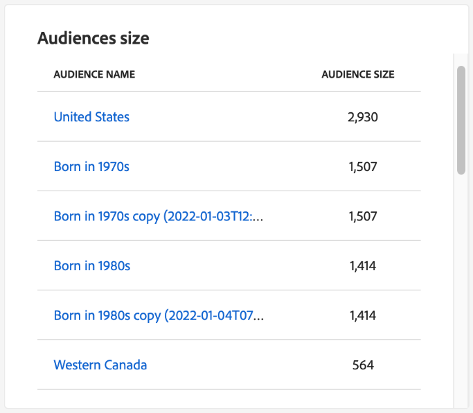

# [!UICONTROL 프로필] 대시보드

Adobe Experience Platform UI(사용자 인터페이스)는 일일 스냅숏 중에 캡처한 대로 [!DNL Real-Time Customer Profile] 데이터에 대한 중요한 정보를 볼 수 있는 대시보드를 제공합니다. 이 안내서에서는 UI에서 프로필 대시보드에 액세스하고 작업하는 방법을 간략하게 설명하고 대시보드에 표시된 지표에 대한 정보를 제공합니다.

Experience Platform 사용자 인터페이스의 프로필 기능에 대한 개요는 [실시간 고객 프로필 UI 안내서](../../profile/ui/user-guide.md)를 참조하십시오.

## 프로필 대시보드 데이터

Experience Platform 대시보드에는 조직이 Profile Store in Profile 내에 가지고 있는 속성(레코드) 데이터의 스냅샷이 표시됩니다. 스냅샷에는 이벤트(시계열) 데이터가 포함되지 않습니다.

스냅샷의 속성 데이터는 스냅샷이 생성된 특정 시점에 나타나는 데이터를 정확하게 표시합니다. 즉, 스냅샷은 데이터의 근사값이나 샘플이 아니며 프로필 대시보드가 실시간으로 업데이트되지 않습니다.

>[!NOTE]
>
>스냅숏을 만든 이후 데이터에 대한 변경 또는 업데이트는 다음 스냅숏을 만들 때까지 대시보드에 반영되지 않습니다.

## 프로필 대시보드 탐색 {#explore-dashboard}

Platform UI 내에서 프로필 대시보드로 이동하려면 왼쪽 레일에서 **[!UICONTROL 프로필]**&#x200B;을 선택한 다음 **[!UICONTROL 개요]** 탭을 선택하여 대시보드를 표시합니다.

>[!NOTE]
>
>Platform을 처음 사용하는 조직에 아직 활성 프로필 데이터 세트 또는 병합 정책을 만들지 않은 경우 프로필 대시보드가 표시되지 않습니다. 대신 [!UICONTROL 개요] 탭에 실시간 고객 프로필을 시작하는 데 도움이 되는 링크와 설명서가 표시됩니다.

### 프로필 대시보드 수정 {#modify-dashboard}

**[!UICONTROL 대시보드 수정]**&#x200B;을 선택하여 프로필 대시보드의 모양을 수정할 수 있습니다. 대시보드에서 위젯을 이동, 추가, 크기 조정 및 제거할 수 있을 뿐만 아니라 **[!UICONTROL 위젯 라이브러리]**&#x200B;에 액세스하여 사용 가능한 위젯을 탐색하고 조직에 대한 사용자 정의 위젯을 만들 수 있습니다.

자세한 내용은 [대시보드 수정](../customize/modify.md) 및 [위젯 라이브러리 개요](../customize/widget-library.md) 설명서를 참조하세요.

### 위젯 추가 {#add-widget}

**[!UICONTROL 위젯 추가]**&#x200B;를 선택하여 위젯 라이브러리로 이동하고 대시보드에 추가할 사용 가능한 위젯 목록을 확인합니다.

위젯 라이브러리에서 표준 및 사용자 정의 대상 위젯의 선택을 검색할 수 있습니다. 위젯을 추가하는 방법에 대한 자세한 내용은 [위젯을 추가](../customize/widget-library.md#add-widgets)하는 방법에 대한 위젯 라이브러리 설명서를 참조하십시오.

### SQL 보기 {#view-sql}

[!UICONTROL 개요] 작업 영역에서 토글을 사용하여 대시보드에 시각화된 인사이트를 생성하는 SQL을 볼 수 있습니다. 기존 인사이트의 SQL에서 영감을 얻어 비즈니스 요구 사항에 따라 플랫폼 데이터에서 고유한 인사이트를 도출하는 새 쿼리를 만들 수 있습니다. 이 기능에 대한 자세한 내용은 [SQL UI 보기 가이드](../view-sql.md)를 참조하세요.

<!-- ## (Beta) Profile efficacy insights {#profile-efficacy-insights}

>[!IMPORTANT]
>
>The profile efficacy insight functionality is currently in beta and are not available to all users. The documentation and the functionality are subject to change.

The [!UICONTROL Efficacy] tab provides metrics on the quality and completeness of your profile data through the use of profile efficacy widgets. These widgets illustrate at a glance the composition of your profiles, trends in completeness over time, and assessments on the quality of your profile data.

See the [profile efficacy widgets section](#profile-efficacy-widgets) for more information on the widgets currently available.

The layout of this dashboard is also customizable by selecting [**[!UICONTROL Modify dashboard]**](../customize/modify.md) from the [!UICONTROL Overview] tab. -->

## 프로필 찾아보기 {#browse-profiles}

[!UICONTROL 찾아보기] 탭에서는 조직에 수집된 읽기 전용 프로필을 검색하고 볼 수 있습니다. 여기에서 환경 설정, 이전 이벤트, 상호 작용 및 대상과 관련하여 프로필에 속하는 중요한 정보를 볼 수 있습니다.

## 프로필 세부 정보 {#profile-details}

[!UICONTROL 프로필] [!UICONTROL 세부 정보] 작업 영역을 열려면 목록에서 [!UICONTROL 프로필 ID]를 선택하십시오.

[!UICONTROL 프로필] [!UICONTROL 세부 정보] 작업 공간에는 해당 프로필과 관련된 정보를 전달하는 사전 구성된 위젯이 여러 개 표시됩니다. 이 정보를 통해 프로필의 주요 속성을 한눈에 파악할 수 있습니다. 나만의 위젯을 만들어 [!UICONTROL 프로필] [!UICONTROL 세부 정보] 작업 영역을 사용자 지정할 수도 있습니다. 자세한 내용은 [위젯을 추가하는 방법](#add-widgets)의 섹션을 참조하십시오.

![[!UICONTROL 세부 정보] 탭이 강조 표시된 [!UICONTROL 프로필] [!UICONTROL 세부 정보] 작업 영역입니다.](../images/profiles/profile-details-workspace.png)

### 프로필 세부 정보 위젯 {#widgets}

사전 구성된 프로필 세부 정보 위젯은 다음과 같습니다.

#### 고객 프로필 {#customer-profile}

[!UICONTROL 고객 프로필] 위젯에는 프로필과 연결된 사용자의 이름과 성 및 [!UICONTROL 프로필 ID]가 표시됩니다. 프로필 ID는 ID 유형과 연관된 자동 생성된 식별자이며 프로필을 나타냅니다. ID 및 ID 네임스페이스에 대한 자세한 내용은 [ID 개요](../../rtcdp/profile/identities-overview.md)를 참조하세요.

#### 기본 속성 {#basic-attributes}

[!UICONTROL 기본 특성] 위젯은 개별 프로필을 정의하는 데 사용되는 가장 일반적으로 사용되는 특성을 표시합니다.

#### 연결된 ID {#linked-identities}

[!UICONTROL 연결된 ID] 위젯은 프로필과 연결된 다른 ID를 표시합니다.

프로필의 ID 세부 정보를 자세히 보고 [!UICONTROL ID] 작업 영역으로 이동하려면 **[!UICONTROL ID 그래프 보기]**&#x200B;를 선택합니다.

#### 채널 환경 설정 {#channel-preferences}

[!UICONTROL 채널 환경 설정] 위젯은 사용자가 통신 수신에 동의한 통신 채널을 표시합니다. 체크 표시는 사용자가 통신수신에 동의한 각 채널을 나타낸다.

<!-- image needs a blue tick added below -->

고객 동의 및 연락처 환경 설정은 복잡한 주제입니다. 동의 및 컨텍스트 환경 설정을 Experience Platform에서 수집, 처리 및 필터링하는 방법에 대해 알아보려면 다음 문서를 읽는 것이 좋습니다.

* [Adobe 표준에 따라 동의 데이터를 수집](../../landing/governance-privacy-security/consent/adobe/overview.md)하는 데 필요한 스키마 필드 그룹에 대한 자세한 내용은 해당 프로필 사용 스키마 필드 그룹에 대한 설명서를 참조하십시오.
   * [[!UICONTROL 동의 및 환경 설정 세부 정보]](../../xdm/field-groups/profile/consents.md)
   * [[!UICONTROL IdentityMap]](../../xdm/field-groups/profile/identitymap.md)(Platform 웹 또는 Mobile SDK를 사용하여 동의 신호를 보내는 경우 필요)
* Adobe 표준을 사용하여 고객 동의 및 환경 설정 데이터를 처리하는 방법에 대해 알아보려면 [Experience Platform의 동의 처리에 대한 개요](../../landing/governance-privacy-security/consent/adobe/overview.md)를 참조하십시오.
* 결합된 데이터 거버넌스 및 동의 정책을 사용하여 동의 환경 설정 및 설정한 조직 규칙을 기반으로 세분화를 위한 프로필을 필터링할 수 있습니다. 이러한 결합된 정책을 만들고 사용하는 방법에 대해 알아보려면 [데이터 사용 정책 관리](../../data-governance/policies/user-guide.md#combine-policies)에 대한 사용 안내서를 참조하십시오.

### 위젯 추가 {#add-widgets}

사용자 지정 위젯을 [!UICONTROL 프로필] [!UICONTROL 세부 정보] 작업 영역에 추가하려면 **[!UICONTROL 프로필 세부 정보 사용자 지정]**&#x200B;을 선택하세요.

![프로필 세부 정보 작업 영역 [!UICONTROL 프로필 세부 정보 사용자 지정]이 강조 표시되었습니다.](../images/profiles/customize-profile-details.png)

이제 위젯의 크기를 조정하거나 재배치하여 작업 영역을 편집할 수 있습니다. 사용자 지정 특성이 있는 위젯을 만들려면 **[!UICONTROL 위젯 추가]**&#x200B;를 선택하십시오.

![프로필 [!UICONTROL 세부 정보] 작업 영역([!UICONTROL 위젯 추가] 강조 표시됨)](../images/profiles/add-widget.png)

위젯 작성기가 나타납니다. [!UICONTROL 카드 제목] 텍스트 필드에 위젯의 수사적 이름을 입력하고 **[!UICONTROL 특성 추가]**&#x200B;를 선택합니다.

![필드 [!UICONTROL 카드 제목] 및 [!UICONTROL 특성 추가]가 강조 표시된 위젯 제작자 캔버스.](../images/profiles/widget-creator.png)

프로필의 유니온 스키마 시각화가 포함된 대화 상자가 나타납니다. 검색 필드 또는 스크롤을 사용하여 위젯에 보고할 속성을 찾습니다. 포함할 속성에 대한 확인란을 선택합니다. 만들기 워크플로를 계속하려면 **[!UICONTROL 선택]**&#x200B;을(를) 선택하십시오.

>[!TIP]
>
>최상위 확인란을 선택하면 모든 하위 요소가 포함됩니다.

![충성도 특성 확인란과 [!UICONTROL 선택]이 강조 표시된 유니온 스키마 다이어그램입니다.](../images/profiles/union-schema-attributes.png)

완료된 위젯의 미리보기가 캔버스에 표시됩니다. 선택한 특성에 만족하면 **[!UICONTROL 저장]**&#x200B;을 선택하여 선택 항목을 확인하고 [!UICONTROL 프로필] [!UICONTROL 세부 정보] 작업 영역으로 돌아갑니다. 이제 새로 만든 위젯이 작업 영역에 표시됩니다.

## 병합 정책 {#merge-policies}

프로필 대시보드에 표시되는 지표는 실시간 고객 프로필 데이터에 적용되는 병합 정책을 기반으로 합니다. 고객 프로필을 만들기 위해 여러 소스에서 데이터를 가져올 때 데이터에 충돌하는 값이 포함될 수 있습니다. 예를 들어 한 데이터 세트는 고객을 &quot;단일&quot;로 나열할 수 있고 다른 데이터 세트는 고객을 &quot;기혼&quot;으로 나열할 수 있습니다. 우선 순위를 지정하고 프로필의 일부로 표시할 데이터를 결정하는 것은 병합 정책의 작업입니다.

조직의 기본 병합 정책을 만들고 편집하고 선언하는 방법을 포함한 병합 정책에 대한 자세한 내용은 [병합 정책 개요](../../profile/merge-policies/overview.md)를 참조하십시오.

대시보드에서 사용할 병합 정책을 자동으로 선택합니다. 적용된 병합 정책은 병합 정책 이름 옆에 있는 드롭다운 메뉴를 사용하여 변경할 수 있습니다.

>[!NOTE]
>
>드롭다운 메뉴에 `_xdm.context.profile` 스키마를 사용하는 병합 정책만 표시됩니다. 그러나 조직에서 여러 병합 정책을 만든 경우 사용 가능한 병합 정책의 전체 목록을 보려면 스크롤해야 할 수 있습니다.

## 유니온 스키마

[!UICONTROL 유니온 스키마] 대시보드에는 특정 XDM 클래스의 유니온 스키마가 표시됩니다. **[!UICONTROL 클래스]** 드롭다운을 선택하면 다른 XDM 클래스의 유니온 스키마를 볼 수 있습니다.

결합 스키마는 동일한 클래스를 공유하고 프로필에 대해 활성화된 여러 스키마로 구성됩니다. 단일 보기에서 동일한 클래스를 공유하는 각 스키마 내에 포함된 모든 필드의 합계를 볼 수 있습니다.

[Platform UI에서 유니온 스키마를 보는 중](../../profile/ui/union-schema.md#view-union-schemas)에 대한 자세한 내용은 유니온 스키마 UI 안내서를 참조하십시오.

## 위젯 및 지표

대시보드는 프로필 데이터와 관련된 중요한 정보를 제공하는 읽기 전용 지표인 위젯으로 구성됩니다.

병합 정책 드롭다운 옆의 [!UICONTROL 개요] 탭 맨 위에 가장 최근 스냅숏의 날짜와 시간이 표시됩니다. 모든 위젯 데이터는 해당 날짜 및 시간을 기준으로 정확합니다. 스냅샷의 타임스탬프는 UTC로 제공되며 개별 사용자 또는 조직의 시간대에 있지 않습니다.

## 기본 위젯 {#default-widgets}

데이터에서 사용 가능한 최신 인사이트를 강조 표시하는 Adobe Experience Platform의 모든 새 인스턴스에 대해 기본 위젯 로드 아웃이 제공됩니다. 다음 위젯은 처음부터 세그먼트 보기에 사전 구성되어 있습니다. 위젯의 목적 및 기능에 대한 전체 세부 정보는 아래에서 찾을 수 있습니다.

* [[!UICONTROL 프로필 개수]](#profile-count)
* [[!UICONTROL 프로필 개수 변경]](#profile-count-change)
* [[!UICONTROL 프로필 개수 변경 트렌드]](#profiles-count-change-trend)
* [[!UICONTROL ID별 프로필]](#profiles-by-identity)
* [[!UICONTROL ID 중첩]](#identity-overlap)

>[!NOTE]
>
>2023년 7월 26일부터 [!UICONTROL 프로필], [!UICONTROL 대상] 및 [!UICONTROL 대상] 개요 대시보드는 이전 6개월 동안 보기를 수정하지 않은 모든 사용자에 대한 새 기본 위젯 로드 아웃으로 재설정되었습니다. 기본 위젯 로드 아웃의 일부로 포함된 위젯에 대한 자세한 내용은 [대상](./destinations.md#default-widgets) 및 [대상](./audiences.md#default-widgets) 기본 위젯 섹션의 설명서를 참조하십시오. 이전과 같이 대시보드 위젯을 계속 사용자 정의할 수 있습니다.

## 고객 AI 위젯 {#customer-ai-profiles-widgets}

고객 AI는 규모에 따라 개별 프로필에 대한 이탈 및 전환과 같은 사용자 정의 성향 점수를 생성하는 데 사용됩니다. 고객 AI는 기존 고객 경험 이벤트 데이터를 분석하여 **이탈 또는 전환 성향 점수**&#x200B;를 예측하여 이를 수행합니다. 이러한 정확도가 높은 고객 성향 모델을 통해 보다 정확한 세분화 및 타기팅을 수행할 수 있습니다. [점수 배포](#customer-ai-distribution-of-scores) 및 [점수 요약](#customer-ai-scoring-summary) 인사이트는 대상의 분할을 보여 줍니다. 이 섹션에서는 높음/낮음/중간 성향인 프로필과 이러한 프로필이 프로필 수에 걸쳐 배포되는 방법을 강조합니다.

* [[!UICONTROL 고객 AI 채점 요약]](#customer-ai-scoring-summary)
* [[!UICONTROL 고객 AI 점수 분포]](#customer-ai-distribution-of-scores)

### [!UICONTROL 고객 AI 점수 분포] {#customer-ai-distribution-of-scores}

>[!CONTEXTUALHELP]
>id="platform_dashboards_profiles_distributionOfScores"
>title="점수 분배"
>abstract="이 위젯은 성향 점수별로 총 프로필 수의 분포를 5% 단위로 시각화합니다. 프로필 수의 분포는 AI 모델과 선택한 병합 정책에 따라 결정됩니다. 위젯 제목 아래의 드롭다운 메뉴에서 AI 모델을 변경할 수 있습니다."

[!UICONTROL 고객 AI 점수 분포] 위젯은 성향 점수로 총 프로필 수를 분류합니다. 프로필 수의 분포는 AI 모델과 선택한 병합 정책에 의해 결정된 다음 성향을 나타내는 5퍼센트 증분으로 시각화됩니다. 프로필의 카운트는 Y축을 따라 제공되고, 성향 점수는 X축을 따라 제공된다.

>[!NOTE]
>
>시각화가 전환 성향 점수인 경우, 높은 점수는 녹색으로 표시되고 낮은 점수는 빨간색으로 표시됩니다. 이탈 성향을 예측하는 경우 이것이 뒤집히면, 높은 점수는 빨간색이고 낮은 점수는 녹색이다. 중간 버킷은 선택한 성향 유형에 관계없이 노란색으로 유지됩니다.

성향 점수를 결정하는 AI 모델은 위젯 제목 아래의 드롭다운 선택기에서 선택됩니다. 드롭다운에는 구성된 모든 Customer AI 모델 목록이 포함되어 있습니다. 사용 가능한 모델 목록에서 분석에 적합한 AI 모델을 선택합니다. 사용 가능한 고객 AI 모델이 없는 경우 위젯 내의 메시지를 통해 하나 이상의 고객 AI 모델을 구성하도록 안내하고 고객 AI 모델 구성 페이지에 하이퍼링크를 제공합니다. [고객 AI 인스턴스를 구성하는 방법](../../intelligent-services/customer-ai/user-guide/configure.md)에 대한 지침은 설명서를 참조하세요.

>[!NOTE]
>
>개요 탭 바로 아래에 있는 드롭다운을 선택하여 분석에 포함된 프로필을 결정하는 병합 정책을 변경합니다. 자세한 내용은 [병합 정책](#merge-policies)의 섹션을 참조하십시오. 자세한 설명은 [병합 정책 개요](../../profile/merge-policies/overview.md)를 참조하십시오.

선택한 Customer AI 모델에 대한 자세한 인사이트 페이지로 이동하려면 **[!UICONTROL 모델 세부 정보 보기]**&#x200B;를 선택합니다.

![점수가 [!UICONTROL 고객 AI 배포] 위젯이고 [!UICONTROL 모델 세부 정보를 보기]가 강조 표시된 Experience Platform 대상 대시보드입니다.](../images/segments/customer-ai-distribution-of-scores.png)

자세한 모델 인사이트 페이지가 표시됩니다.

고객 AI에 대한 자세한 내용은 [인사이트 찾기 UI 안내서](../../intelligent-services/customer-ai/user-guide/discover-insights.md)를 참조하세요.

### [!UICONTROL 고객 AI 채점 요약] {#customer-ai-scoring-summary}

>[!CONTEXTUALHELP]
>id="platform_dashboards_profiles_scoringSummary"
>title="채점 요약"
>abstract="이 위젯은 채점된 총 프로필 수를 표시하고 높은, 중간 및 낮은 성향을 포함하는 버킷으로 분류합니다. 도넛 차트는 높은, 중간 및 낮은 성향에 걸쳐 전체 프로필의 비례 컴포지션을 보여 줍니다."

이 위젯은 채점된 총 프로필 수를 표시하고 높은 성향, 중간 성향 및 낮은 성향을 각각 녹색, 노란색 및 빨간색으로 포함하는 버킷으로 분류합니다. 도넛 차트는 높은 성향, 중간 성향 및 낮은 성향 사이의 프로필 비율 구성을 보여줍니다. 프로필은 75세 이상의 높은 성향, 25세에서 74세 사이의 중간 성향 및 24세 미만의 낮은 성향이 적합합니다. 범례는 색상 코드 및 성향의 임계값을 나타냅니다. 커서가 도넛 차트의 각 섹션 위로 마우스를 가져가면 높은, 중간 및 낮은 성향에 대한 프로필 수가 대화 상자에 표시됩니다.

>[!NOTE]
>
>시각화가 전환 성향 점수인 경우, 높은 점수는 녹색으로 표시되고 낮은 점수는 빨간색으로 표시됩니다. 이탈 성향을 예측하는 경우 이것이 뒤집히면, 높은 점수는 빨간색이고 낮은 점수는 녹색이다. 중간 버킷은 선택한 성향 유형에 관계없이 노란색으로 유지됩니다.

위젯 제목 아래의 드롭다운 메뉴는 구성된 모든 Customer AI 모델의 목록을 제공합니다. 사용 가능한 모델 목록에서 분석에 적합한 AI 모델을 선택합니다. 사용 가능한 고객 AI 모델이 없는 경우 위젯 내의 메시지를 통해 하나 이상의 고객 AI 모델을 구성하도록 안내하고 고객 AI 모델 구성 페이지에 하이퍼링크를 제공합니다. 자세한 지침은 [Customer AI 인스턴스를 구성하는 방법](../../intelligent-services/customer-ai/user-guide/configure.md)에 대한 설명서를 참조하십시오.

>[!NOTE]
>
>계산된 총 프로필 수는 선택한 병합 정책에 따라 다릅니다. 사용된 병합 정책을 변경하려면 개요 탭 바로 아래에 있는 드롭다운을 선택합니다. 자세한 내용은 [병합 정책](#merge-policies)의 섹션을 참조하십시오. 자세한 설명은 [병합 정책 개요](../../profile/merge-policies/overview.md)를 참조하십시오.

선택한 Customer AI 모델에 대한 자세한 인사이트 페이지로 이동하려면 **[!UICONTROL 모델 세부 정보 보기]**&#x200B;를 선택합니다. 고객 AI에 대한 자세한 내용은 [인사이트 찾기 UI 안내서](../../intelligent-services/customer-ai/user-guide/discover-insights.md)를 참조하세요.

## 표준 위젯 {#standard-widgets}

Adobe은 프로필 데이터와 관련된 다양한 지표를 시각화하는 데 사용할 수 있는 여러 표준 위젯을 제공합니다. [!UICONTROL 위젯 라이브러리]를 사용하여 조직과 공유할 사용자 정의 위젯을 만들 수도 있습니다. 사용자 지정 위젯을 만드는 방법에 대해 자세히 알아보려면 [위젯 라이브러리 개요](../customize/widget-library.md)를 읽어 보십시오.

사용 가능한 각 표준 위젯에 대해 자세히 알아보려면 다음 목록에서 위젯의 이름을 선택합니다.

* [[!UICONTROL 프로필 개수]](#profile-count)
* [[!UICONTROL 프로필 개수 트렌드]](#profile-count-trend)
* [[!UICONTROL 프로필 개수 변경]](#profile-count-change)
* [[!UICONTROL 프로필 개수 변경 트렌드]](#profiles-count-change-trend)
* [ID별 [!UICONTROL 프로필 개수 변경 트렌드]](#profiles-count-change-trend-by-identity)
* [[!UICONTROL ID별 프로필]](#profiles-by-identity)
* [[!UICONTROL ID 중첩]](#identity-overlap)
* [[!UICONTROL 단일 ID 프로필]](#single-identity-profiles)
* [[!UICONTROL ID별 단일 ID 프로필]](#single-identity-profiles-by-identity)
* [[!UICONTROL 분할되지 않은 프로필]](#unsegmented-profiles)
* [[!UICONTROL 세분화되지 않은 프로필 변경 트렌드]](#unsegmented-profiles-change-trend)
* [[!UICONTROL ID별로 분할되지 않은 프로필]](#unsegmented-profiles-by-identity)
* [[!UICONTROL 대상자]](#audiences)
* [[!UICONTROL 대상 상태에 매핑된 대상자]](#audiences-mapped-to-destination-status)
* [[!UICONTROL 대상 크기]](#audiences-size)
* [[!UICONTROL 병합 정책별 대상 중복]](#audience-overlap-by-merge-policy)
* [[!UICONTROL 대상 중복 보고서]](#audience-overlap-report)

### [!UICONTROL 프로필 개수] {#profile-count}

>[!CONTEXTUALHELP]
>id="platform_dashboards_profiles_profilecount"
>title="프로필 개수"
>abstract="이 위젯은 스냅샷이 생성된 시간에 프로필 스토어 내에서 병합된 총 프로필 수를 표시합니다. 숫자는 프로필 데이터에 적용되는 선택한 병합 정책에 따라 다릅니다."

**[!UICONTROL 프로필 개수]** 위젯은 스냅숏을 만들 때 프로필 저장소 내에 병합된 총 프로필 수를 표시합니다. 이 숫자는 프로필 조각을 함께 병합하여 각 개인에 대한 단일 프로필을 형성하기 위해 선택한 병합 정책이 프로필 데이터에 적용된 결과입니다.

자세한 내용은 이 문서의 앞부분에서 병합 정책에 대한 [섹션을 참조하십시오](#merge-policies).

>[!NOTE]
>
>[!UICONTROL 프로필 개수] 위젯은 여러 가지 이유로 UI의 [!UICONTROL 프로필] 섹션에서 [!UICONTROL 찾아보기] 탭에 표시되는 프로필 개수와 다른 개수를 표시할 수 있습니다. 이 차이가 발생하는 가장 일반적인 이유는 [!UICONTROL 찾아보기] 탭은 조직의 기본 병합 정책을 기반으로 병합된 총 프로필 수를 참조하고 [!UICONTROL 프로필 개수] 위젯은 대시보드에서 보기 위해 선택한 병합 정책을 기반으로 병합된 총 프로필 수를 참조하기 때문입니다.
>
>또 다른 일반적인 이유는 [!UICONTROL 찾아보기] 탭에 대해 대시보드 스냅숏을 만드는 시간과 샘플 작업을 실행하는 시간 사이의 차이점 때문입니다. 위젯의 타임스탬프를 보고 [!UICONTROL 프로필 개수] 위젯이 마지막으로 업데이트된 시기를 확인할 수 있습니다. [!UICONTROL 찾아보기] 탭에서 샘플 작업이 트리거되는 방법에 대한 자세한 내용은 실시간 고객 프로필 UI 안내서](../../profile/ui/user-guide.md#profile-count)의 [프로필 개수 섹션을 참조하십시오.

### [!UICONTROL 프로필 개수 트렌드] {#profile-count-trend}

[!UICONTROL 프로필 개수 트렌드] 위젯은 선 그래프를 사용하여 시간에 따라 시스템에 포함된 총 프로필 수의 트렌드를 표시합니다. 이 총 수에는 마지막 일별 스냅샷 이후 시스템으로 가져온 모든 프로필이 포함됩니다. 데이터는 30일, 90일, 12개월 기간에 시각화할 수 있습니다. 위젯의 드롭다운 메뉴에서 기간이 선택됩니다.

### [!UICONTROL 프로필 개수 변경] {#profile-count-change}

>[!CONTEXTUALHELP]
>id="platform_dashboards_profiles_profilescountchange"
>title="프로필 개수 변경"
>abstract="이 위젯은 마지막 스냅샷이 생성된 시간에 프로필 스토어에 **추가된** 병합 프로필의 총 개수를 표시합니다. 숫자는 프로필 데이터에 적용되는 선택한 병합 정책에 따라 다릅니다."

**[!UICONTROL 프로필 개수 변경]** 위젯은 이전 스냅숏 이후 프로필 저장소에 추가된 병합된 프로필 수를 표시합니다. 이 숫자는 프로필 조각을 함께 병합하여 각 개인에 대한 단일 프로필을 형성하기 위해 선택한 병합 정책이 프로필 데이터에 적용된 결과입니다. 드롭다운 선택기를 사용하여 지난 30일, 90일 또는 12개월 동안 추가된 프로필 수를 볼 수 있습니다.

>[!NOTE]
>
>[!UICONTROL 프로필 개수 변경] 위젯은 초기 프로필 수집 및 프로필 스토어 설정 **이후**&#x200B;에 추가된 프로필 수를 반영합니다. 즉, 조직에서 프로필 스토어를 설정하고 1일에 4,000,000을 수집한 경우 24시간 이내에 대시보드를 사용할 수 있지만 [!UICONTROL 프로필 개수 변경] 위젯은 0으로 설정됩니다. 이 계산 방법은 프로필의 초기 시스템 수집과 관련된 급증을 방지하기 위해 수행됩니다. 이후 30일 동안 조직은 프로필 스토어에 추가 1,000,000개의 프로필을 수집합니다. 다음 스냅숏이 만들어지면 [!UICONTROL 프로필 개수 변경] 위젯에 추가된 총 1,000,000개의 프로필이 표시되고 [!UICONTROL 프로필 개수] 위젯에 총 5,000,000개의 프로필이 표시됩니다.

### [!UICONTROL 프로필 개수 변경 트렌드] {#profiles-count-change-trend}

>[!CONTEXTUALHELP]
>id="platform_dashboards_profiles_profilesaddedtrend"
>title="프로필 개수 변경 트렌드"
>abstract="이 위젯은 지난 30일, 90일 또는 12개월 동안 매일 프로필 스토어에 추가된 병합된 프로필 개수를 표시합니다. 또한 숫자는 프로필 데이터에 적용되는 선택한 병합 정책에 따라 다릅니다."

**[!UICONTROL 프로필 개수 변경 트렌드]** 위젯은 지난 30일, 90일 또는 12개월 동안 매일 프로필 저장소에 추가된 병합된 프로필의 총 수를 표시합니다. 이 숫자는 스냅숏을 만들 때 매일 업데이트되므로, 프로필을 플랫폼으로 수집하려는 경우 다음 스냅숏을 만들 때까지 프로필 수가 반영되지 않습니다. 추가된 프로필 수는 프로필 조각을 함께 병합하여 각 개인에 대한 단일 프로필을 형성하기 위해 선택한 병합 정책이 프로필 데이터에 적용된 결과입니다.

자세한 내용은 이 문서의 앞부분에 있는 병합 정책에 대한 [섹션](#merge-policies)을 참조하세요.

**[!UICONTROL 프로필 개수 변경 트렌드]** 위젯의 오른쪽 상단에 &#39;캡션&#39; 단추가 표시됩니다. 자동 캡션 대화 상자를 열려면 **[!UICONTROL 캡션]**&#x200B;을 선택합니다.

머신 러닝 모델은 차트와 데이터를 분석하여 주요 트렌드 및 중요 이벤트를 설명하는 캡션을 자동으로 생성합니다. 주석은 캡션을 기반으로 차트에 추가됩니다. 캡션을 선택하여 해당 주석에 초점을 맞춥니다.

### ID별 [!UICONTROL 프로필 개수 변경 트렌드] {#profiles-count-change-trend-by-identity}

<!-- This widget uses a line graph to illustrate the change in number of profiles filtered by a chosen source identity and merge policy. -->

이 위젯은 선택한 소스 ID를 기반으로 프로필 수를 필터링하고 정책을 병합한 다음 선 그래프를 사용하여 다양한 기간에 대한 숫자 변경을 보여 줍니다. 병합 정책은 페이지 상단의 개요 드롭다운에서 선택되고 위젯 드롭다운 메뉴에서 소스 ID 및 기간이 선택됩니다. 30일, 90일, 12개월 기간에 걸쳐 추세를 시각화할 수 있다.

이 위젯은 필요한 ID로 필터링된 프로필의 증가 패턴을 보여줌으로써 대상 활성화 요구 사항을 관리하는 데 도움이 됩니다.

### [!UICONTROL ID별 프로필] {#profiles-by-identity}

>[!CONTEXTUALHELP]
>id="platform_dashboards_profiles_profilesbyidentity"
>title="ID별 프로필"
>abstract="이 위젯은 프로필 스토어에 있는 모든 병합된 프로필의 분석을 ID별로 표시합니다."

**[!UICONTROL ID별 프로필]** 위젯은 프로필 스토어에 있는 병합된 모든 프로필의 ID 분류를 표시합니다. ID별 총 프로필 수(즉, 각 네임스페이스에 대해 표시된 값을 함께 추가)는 하나의 프로필에 연결된 여러 네임스페이스가 있을 수 있으므로 병합된 프로필의 총 수보다 높을 수 있습니다. 예를 들어 고객이 둘 이상의 채널에서 브랜드와 상호 작용하는 경우 여러 네임스페이스가 해당 개별 고객과 연결됩니다.

자세한 내용은 이 문서의 앞부분에 있는 병합 정책에 대한 [섹션](#merge-policies)을 참조하세요.

자동 캡션 대화 상자를 열려면 **[!UICONTROL 캡션]**&#x200B;을 선택합니다.

머신 러닝 모델은 데이터의 전체 분포 및 주요 차원을 분석하여 데이터 인사이트를 자동으로 생성합니다.

ID에 대한 자세한 내용은 [Adobe Experience Platform ID 서비스 설명서](../../identity-service/home.md)를 참조하세요.

### [!UICONTROL ID 중첩] {#identity-overlap}

>[!CONTEXTUALHELP]
>id="platform_dashboards_profiles_identityoverlap"
>title="ID 중첩"
>abstract="이 위젯은 벤 다이어그램을 사용하여 선택한 두 ID를 포함하는 프로필 스토어의 프로필 중첩을 표시합니다."

**[!UICONTROL Identity overlap]** 위젯은 벤 다이어그램 또는 설정 다이어그램을 사용하여 두 개의 선택한 ID가 포함된 프로필 저장소의 프로필 겹침을 표시합니다.

위젯 드롭다운 메뉴를 사용하여 비교할 ID를 선택합니다. 원은 각 ID를 포함하는 프로필의 상대적 총 수를 표시합니다. 두 ID를 모두 포함하는 프로필의 수는 원 사이의 겹침 크기로 표시됩니다. 고객이 둘 이상의 채널에서 브랜드와 상호 작용하는 경우 여러 ID가 해당 개별 고객과 연결됩니다. 이 경우 조직에는 둘 이상의 ID의 조각이 포함된 프로필이 여러 개 있을 수 있습니다.

프로필 조각에 대한 자세한 내용은 실시간 고객 프로필 개요에서 [프로필 조각과 병합된 프로필](../../profile/home.md#profile-fragments-vs-merged-profiles)에 대한 섹션을 참조하십시오.

ID에 대한 자세한 내용은 [Adobe Experience Platform ID 서비스 설명서](../../identity-service/home.md)를 참조하세요.

### [!UICONTROL 단일 ID 프로필] {#single-identity-profiles}

>[!CONTEXTUALHELP]
>id="platform_dashboards_profiles_singleidentityprofiles"
>title="단일 ID 프로필"
>abstract="이 위젯은 ID를 생성하는 한 가지 유형의 ID 유형만 있는 조직의 프로필 개수를 제공합니다. 이 ID 유형은 이메일 또는 ECID일 수 있습니다."

[!UICONTROL 단일 ID 프로필] 위젯에서는 ID를 만드는 한 가지 유형의 ID만 있는 조직의 프로필 수를 제공합니다. 이 ID 유형은 이메일 또는 ECID일 수 있습니다. 프로필 수는 가장 최근 스냅샷에 포함된 데이터에서 생성됩니다.

### [!UICONTROL ID별 단일 ID 프로필] {#single-identity-profiles-by-identity}

이 위젯은 막대 차트를 사용하여 하나의 고유 식별자로만 식별되는 총 프로필 수를 보여줍니다. 위젯은 가장 일반적으로 발생하는 ID 중 최대 5개를 지원합니다.

ID에 대한 총 프로필 수를 자세히 설명하는 대화 상자를 보려면 커서를 사용하여 개별 막대 위로 마우스를 가져갑니다.

### [!UICONTROL 분할되지 않은 프로필] {#unsegmented-profiles}

>[!CONTEXTUALHELP]
>id="platform_dashboards_profiles_unsegmentedprofiles"
>title="분할되지 않은 프로필"
>abstract="이 위젯은 대상자에 연결되지 않은 모든 프로필의 총 개수를 제공하고 조직 전체의 프로필 활성화 기회를 나타냅니다."

[!UICONTROL 세분화되지 않은 프로필] 위젯은 대상자에 첨부되지 않은 모든 프로필의 총 수를 제공합니다. 생성된 숫자는 마지막 스냅샷을 기준으로 정확하며 조직 전체에서 프로필 활성화 기회를 나타냅니다. 또한 적절한 ROI를 제공하지 않는 프로필을 삭제할 수 있는 기회를 나타냅니다.

### [!UICONTROL 세분화되지 않은 프로필 변경 트렌드] {#unsegmented-profiles-change-trend}

>[!CONTEXTUALHELP]
>id="platform_dashboards_profiles_unsegmentedprofilestrend"
>title="분할되지 않은 프로필 추세"
>abstract="이 위젯은 지정된 기간 동안 대상자에 연결되지 않은 프로필 개수에 대한 선 그래프 그림을 제공합니다. 대상자에 연결되지 않은 프로필 추세는 30일, 90일 및 12개월 기간 동안 시각화할 수 있습니다."

[!UICONTROL 세분화되지 않은 프로필 변경 트렌드] 위젯은 선 그래프를 사용하여 대상자에 첨부되지 않은 마지막 일별 스냅숏 이후에 추가된 프로필 수를 보여줍니다. 대상자에 첨부되지 않은 프로필의 변경 트렌드를 30일, 90일 및 12개월 기간에 시각화할 수 있습니다. 위젯의 드롭다운 메뉴에서 기간이 선택됩니다. 프로필 카운트는 y축에 반영되고 시간은 x축에 반영됩니다.

### [!UICONTROL ID별로 분할되지 않은 프로필] {#unsegmented-profiles-by-identity}

>[!NOTE]
>
>ID 위젯별로 세분화되지 않은 프로필은 2022년 10월부터 더 이상 사용되지 않으며 더 이상 사용할 수 없습니다.

<!-- 

>[!CONTEXTUALHELP]
>id="platform_dashboards_profiles_unsegmentedprofilesbyidentity"
>title="Unsegmented profiles by identity"
>abstract="This widget categorizes the total number of unsegmented profiles by their unique identifier."

The [!UICONTROL Unsegmented Profiles by Identity] widget categorizes the total number of unsegmented profiles by their unique identifier. The data is visualized in a bar chart for ease of comparison. 

 -->

### [!UICONTROL 대상자] {#audiences}

이 위젯은 프로필 데이터에 적용된 선택한 병합 정책에 따라 활성화할 준비가 된 총 대상 수를 제공합니다.

**[!UICONTROL 대상자]**&#x200B;를 선택하여 [!UICONTROL 대상자] 대시보드 [!UICONTROL 찾아보기] 탭으로 이동합니다. 여기에서 조직의 모든 세그먼트 정의 목록을 볼 수 있습니다.

<!-- https://jira.corp.adobe.com/browse/PLAT-115291 -->

<!-- * [[!UICONTROL Audiences change trend]](#audiences-change-trend) -->
<!-- ### [!UICONTROL Audiences change trend] {#audiences-change-trend}

This line graph widget visualizes the change in the total number of audiences each day, trending over time. The change in the number of audiences is dependent on the selected merge policy being applied to your profile data. The period of analysis is selected from the widget dropdown menu. The bar chart can be visualized over 30 days, 90 days, and 12-month periods.

The visualization allows you to monitor the overall health of audiences within Adobe Experience Platform by understanding trends in the growth or decline of the total number of audiences. -->

<!--  -->

### [!UICONTROL 대상 중복 보고서] {#audience-overlap-report}

이 위젯은 병합 정책으로 필터링된 사용 가능한 모든 대상의 데이터 겹침을 표로 표시합니다. 화면 상단의 드롭다운 메뉴에서 선택한 병합 정책에 대해 가장 높은 오버랩 백분율부터 가장 낮은 오버랩 백분율까지 5개의 대상 목록이 제공됩니다. 분석된 두 대상이 [!UICONTROL 대상 A 이름] 및 [!UICONTROL 대상 B 이름] 열에 나열됩니다. 백분율 겹침은 소수점 이하 12자리까지 정확한 세 번째 열에 제공됩니다.

대상 중복 보고서는 새로운 고성능 대상을 구축하는 데 도움이 됩니다. 높은 비율의 겹침을 관찰하면 대상을 표시하지 않고 동일한 대상을 다른 대상으로 보내지 않을 수 있습니다. 또한 더 나은 세그멘테이션에 도움이 될 수 있는 숨겨진 인사이트를 식별하는 데 도움이 됩니다. 겹치는 비율이 낮으면 추적할 고유 프로필을 찾는 데 도움이 됩니다.

**[!UICONTROL 자세히 보기]**&#x200B;를 선택하여 더 많은 대상 중복 데이터가 포함된 전체 화면 대화 상자를 엽니다.

[!UICONTROL 대상 중복 보고서] 대화 상자가 나타납니다. 이 대화 상자에는 최대 50개의 대상 중복 분석 행이 6개의 열로 분류되어 포함될 수 있습니다. 테이블에서 열을 제거하거나 추가하려면 설정 아이콘()을 선택합니다.

>[!NOTE]
>
>결과의 순위를 가장 높은 항목에서 가장 낮은 항목이나 가장 낮은 항목에서 가장 높은 항목순으로 변경하려면 **[!UICONTROL 겹치기]** 열 머리글을 선택합니다.

전체 보고서를 PDF 형식으로 다운로드하려면 옵션 메뉴(**`...`**) 다음에 **[!UICONTROL 다운로드]**&#x200B;를 선택합니다.

중복 분석의 벤 다이어그램을 열려면 보고서에서 행을 선택합니다. 대화 상자에서 프로필 수를 보려면 벤 다이어그램의 섹션 위로 마우스를 가져갑니다.

[!UICONTROL 프로필] 대시보드로 돌아가려면 **[!UICONTROL 닫기]**&#x200B;를 선택하십시오.

### [!UICONTROL 대상 상태에 매핑된 대상자] {#audiences-mapped-to-destination-status}

대상 상태에 매핑된 [!UICONTROL 대상] 위젯은 매핑된 대상자와 매핑되지 않은 대상자의 총 수를 단일 지표로 표시하며 도넛 차트를 사용하여 합계의 비례 차이를 나타냅니다. 계산된 숫자는 선택한 병합 정책에 따라 다릅니다.

커서가 도넛 차트의 각 섹션을 가리키면 매핑된 대상자나 매핑되지 않은 대상자의 개별 카운트가 대화 상자에 표시됩니다.

### [!UICONTROL 대상 크기] {#audiences-size}

[!UICONTROL 대상 크기] 위젯은 최대 20명의 대상 이름과 각 대상에 포함된 총 프로필 수를 나열하는 2열 테이블을 제공합니다. 대상자 내에 포함된 총 프로필 수에 따라 목록의 순서는 높음에서 낮음 사이입니다. 총 대상자 크기 카운트는 적용된 병합 정책에 따라 다릅니다.

대상에 대한 포괄적인 정보를 보려면 제공된 목록에서 대상 이름을 선택하여 [!UICONTROL 대상] [!UICONTROL 세부 정보] 페이지로 이동하십시오. 또한 위젯의 끝에서 **[!UICONTROL 모든 대상 보기]**&#x200B;를 선택하여 [!UICONTROL 대상] [!UICONTROL 찾아보기] 탭으로 이동하여 기존 대상을 찾을 수 있습니다.

대상자 세부 정보에 대한 자세한 내용은 [대상자 포털 설명서](../../segmentation/ui/audience-portal.md)를 참조하세요.

### [!UICONTROL 병합 정책별 대상 중복] {#audience-overlap-by-merge-policy}

이 위젯은 벤 다이어그램을 사용하여 선택한 두 대상의 겹침을 표시합니다. 병합 정책은 페이지 상단의 개요 드롭다운에서 선택하고 분석 대상은 위젯 내에서 두 개의 드롭다운 메뉴에서 선택합니다. 해당 세그먼트 정의 내에 포함된 총 프로필 수는 원 또는 교차 위를 마우스로 가리키면 확인할 수 있습니다.

위젯에 세그먼트 정의의 시각적 크로스오버가 표시되므로 세그먼트 정의 간의 유사성을 연구하여 세그먼테이션 전략을 최적화할 수 있습니다.

<!-- ## (Beta) Profile efficacy widgets {#profile-efficacy-widgets}

>[!IMPORTANT]
>
>The profile efficacy widgets are currently in Beta and are not available to all users. The documentation and the functionality are subject to change.

Adobe provides multiple widgets to assess the completeness of the ingested profiles available for your data analysis. Each of the profile efficacy widgets can be filtered by the merge policy. To change the merge policy filter, select the[!UICONTROL Profiles using merge policy] dropdown and choose the appropriate policy from the available list.

To learn more about each of the profile efficacy widgets, select the name of a widget from the following list:

* [[!UICONTROL Attribute quality assessment]](#attributes-quality-assessment)
* [[!UICONTROL Profiles by completeness]](#profiles-by-completeness)
* [[!UICONTROL Profiles completeness trend]](#profiles-completeness-trend)

### (Beta) [!UICONTROL Attributes quality assessment] {#attributes-quality-assessment}

>[!CONTEXTUALHELP]
>id="platform_dashboards_profiles_attributesqualityassessment"
>title="Attributes quality assessment"
>abstract="This widget shows the completeness and cardinality of all profiles according to their attributes. Each row describes one attribute. The **Profiles** column provides the number of profiles that have this attribute and are filled with non-null values. The **Completeness** percentage is determined by the total number of profiles that have this attribute and are filled with non-null values divided by the total number of non-empty values in the profiles for that attribute. **Cardinality** provides the total number of unique non-null values of this attribute across all attributes."

The [!UICONTROL Attribute quality assessment] widget shows the completeness and cardinality of all profiles according to their attributes. The data is accurate to the last processing date. This information is presented as a table with four columns where each row in the table represents a single attribute.

| Column  | Description  |
|---|---|
| Attribute  | The name of the attribute.  |
| Profiles  | The number of profiles that have this attribute and are filled with non-null values.  |
| Completeness  | This percentage is determined by the total number of profiles that have this attribute and are filled with non-null values. The number is calculated by dividing the total number of profiles by the total number of non-empty values in the profiles for that attribute.  |
| Cardinality  | The total number of **unique** non-null values of this attribute. It is measured across all profiles. |

### (Beta) [!UICONTROL Profiles by completeness] {#profiles-by-completeness}

>[!CONTEXTUALHELP]
>id="platform_dashboards_profiles_profilesbycompleteness"
>title="Profiles by completeness"
>abstract="The donut chart displays the percentage of profile attributes that are filled with non-null values among all observed attributes. It illustrates the proportion of profiles that are of high, medium, or low completeness. High completeness profiles have more than 70% of their attributes filled. Medium completeness profiles have between 30% and 70% of their attributes filled. Low completeness profiles have less than 30% of their attributes filled."

The [!UICONTROL Profiles by completeness] widget creates a donut chart of profile completeness since the last processing date. The completeness of a profile is measured by the percentage of attributes that are filled with non-null values among all observed attributes.

This widget shows the proportion of profiles that are of high, medium, or low completeness. By default, there are three levels of completeness configured: 

* High completeness: Profiles have more than 70% of their attributes filled. 
* Medium completeness: Profiles have between 30% and 70% of their attributes filled. 
* Low completeness: Profiles have less than 30% of their attributes filled. 

### (Beta) [!UICONTROL Profiles completeness trend] {#profiles-completeness-trend}

>[!CONTEXTUALHELP]
>id="platform_dashboards_profiles_profilescompletenesstrend"
>title="Profiles completeness trend"
>abstract="This widget creates a stacked area chart to depict the trend of profile completeness over time. Completeness is measured by the percentage of attributes that are filled with non-null values among all observed attributes."

This widget creates a stacked area chart to depict the trend of profile completeness over time. Completeness is measured by the percentage of attributes filled with non-null values among all observed attributes. It categorizes the profile completeness as high, medium, or low completeness since the last processing date.

The x-axis represents time, the y-axis represents the number of profiles, and the colors represent the three levels of profile completeness. 

The three levels of completeness are:

* High completeness: Profiles have more than 70% of attributes filled. 
* Medium completeness: Profiles have less than 70% and more than 30% of attributes filled. 
* Low completeness: Profiles have less than 30% of attributes filled.

 -->

## 다음 단계

이 문서를 따르면 이제 프로필 대시보드를 찾고 사용 가능한 위젯에 표시되는 지표를 이해할 수 있습니다. Experience Platform UI에서 [!DNL Profile] 데이터를 사용하여 작업하는 방법에 대한 자세한 내용은 [실시간 고객 프로필 UI 안내서](../../profile/ui/user-guide.md)를 참조하십시오.
