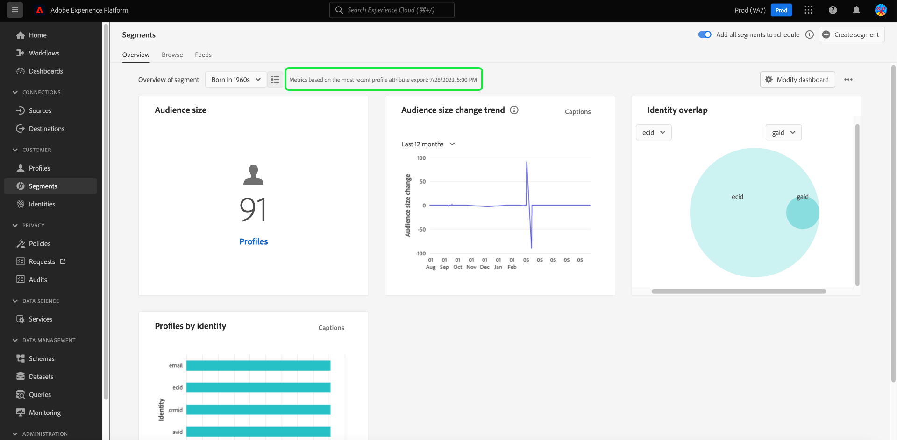
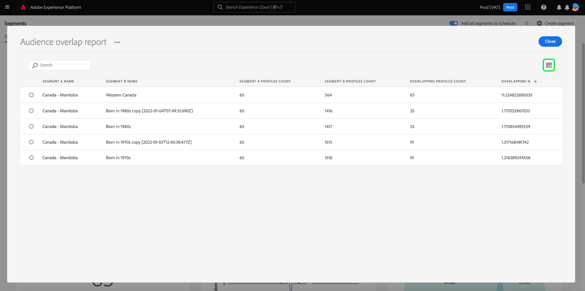

# [!UICONTROL 세그먼트] 대시보드 {#segment-dashboard}

Adobe Experience Platform UI(사용자 인터페이스)는 일별 스냅샷 중에 캡처된 세그먼트에 대한 중요한 정보를 볼 수 있는 대시보드를 제공합니다. 이 안내서에서는 UI에서 세그먼트 대시보드에 액세스하고 작업하는 방법에 대해 간략하게 설명하고 대시보드에 표시된 시각화에 대한 자세한 정보를 제공합니다.

Platform 사용자 인터페이스 내의 모든 Adobe Experience Platform 세그멘테이션 서비스 기능에 대한 개요는 다음을 참조하십시오. [세그먼테이션 서비스 UI 안내서](../../segmentation/ui/overview.md).

## [!UICONTROL 세그먼트] 대시보드 데이터

Experience Platform 대시보드에는 조직이 Profile Store in Segment 내에 가지고 있는 속성(레코드) 데이터의 스냅샷이 표시됩니다. 스냅샷에는 이벤트(시계열) 데이터가 포함되지 않습니다.

스냅샷의 속성 데이터는 스냅샷이 생성된 특정 시점에 나타나는 데이터를 정확하게 표시합니다. 즉, 스냅샷은 데이터의 근사치나 샘플이 아니며 세그먼트 대시보드가 실시간으로 업데이트되지 않습니다.

>[!NOTE]
>
>스냅숏을 만든 이후 데이터에 대한 변경 또는 업데이트는 다음 스냅숏을 만들 때까지 대시보드에 반영되지 않습니다.

## 탐색 [!UICONTROL 세그먼트] 대시보드 {#explore}

로 이동하려면 [!UICONTROL 세그먼트] Platform UI에서 대시보드를 선택한 다음 **[!UICONTROL 세그먼트]** 왼쪽 레일에서 **[!UICONTROL 개요]** 탭을 클릭하여 대시보드를 표시합니다.

>[!NOTE]
>
>Platform을 처음 사용하는 조직에 아직 활성 프로필 데이터 세트 또는 병합 정책을 만들지 않은 경우 [!UICONTROL 세그먼트] 대시보드가 표시되지 않습니다. 대신, [!UICONTROL 개요] 탭에는 세그먼테이션을 시작하는 데 도움이 되는 링크 및 설명서가 표시됩니다.

### 수정 [!UICONTROL 세그먼트] 대시보드 {#modify}

다음과 같은 모양을 수정할 수 있습니다 [!UICONTROL 세그먼트] 을 선택하여 대시보드 **[!UICONTROL 대시보드 수정]**. 대시보드에서 위젯을 이동, 추가 및 제거하고 **[!UICONTROL 위젯 라이브러리]** 를 사용하여 사용 가능한 위젯을 탐색하고 조직에 대한 사용자 정의 위젯을 만들 수 있습니다.

다음을 참조하십시오. [대시보드 수정](../customize/modify.md) 및 [위젯 라이브러리 개요](../customize/widget-library.md) 설명서에서 자세히 알아보십시오.

### 위젯 추가 {#add-widget}

선택 **[!UICONTROL 위젯 추가]** 을 클릭하여 위젯 라이브러리로 이동하고 대시보드에 추가할 수 있는 위젯 목록을 확인합니다.

위젯 라이브러리에서 표준 및 사용자 정의 세그먼트 위젯의 선택을 찾아볼 수 있습니다.위젯을 추가하는 방법에 대한 자세한 내용은 위젯 라이브러리 설명서 를 참조하십시오. [위젯 추가](../customize/widget-library.md#add-widgets).

## 세그먼트 선택

대시보드는 표시할 세그먼트를 자동으로 선택하지만 드롭다운 메뉴 또는 세그먼트 선택기를 사용하여 세그먼트를 변경할 수 있습니다.

다른 세그먼트를 선택하려면 세그먼트 이름 옆에 있는 드롭다운을 선택하거나 세그먼트 선택기를 사용하여 세그먼트 선택 대화 상자를 엽니다.

>[!IMPORTANT]
>
>프로필 카운트가 0보다 큰 세그먼트만 선택 가능한 세그먼트 목록에 표시됩니다.

## 위젯 및 지표

세그먼트 대시보드는 선택한 세그먼트와 관련된 중요한 정보를 제공하는 읽기 전용 지표인 위젯으로 구성됩니다.

가장 최근 스냅숏의 날짜와 시간이 [!UICONTROL 개요] 세그먼트 드롭다운 옆에 있는 탭입니다. 모든 위젯 데이터는 해당 날짜 및 시간을 기준으로 정확합니다. 스냅샷의 타임스탬프는 UTC로 제공되며 개별 사용자 또는 조직의 시간대에 있지 않습니다.

## 표준 위젯 {#standard-widgets}

Adobe은 세그먼트와 관련된 다양한 지표를 시각화하는 데 사용할 수 있는 여러 표준 위젯을 제공합니다. 를 사용하여 조직과 공유할 사용자 정의 위젯을 만들 수도 있습니다. [!UICONTROL 위젯 라이브러리]. 사용자 정의 위젯 만들기에 대한 자세한 내용은 [위젯 라이브러리 개요](../customize/widget-library.md).

사용 가능한 각 표준 위젯에 대해 자세히 알아보려면 다음 목록에서 위젯의 이름을 선택합니다.

* [[!UICONTROL 대상자 크기]](#audience-size)
* [[!UICONTROL 대상자 활성화 순서]](#audience-activation-order)
* [[!UICONTROL 대상자 크기 트렌드]](#audience-size-trend)
* [[!UICONTROL 대상자 크기 변경 트렌드]](#audience-size-change-trend)
* [[!UICONTROL ID별 대상자 크기 트렌드]](#audience-size-trend-by-identity)
* [[!UICONTROL 대상자 오버랩]](#audience-overlap)
* [[!UICONTROL 대상 중복 보고서]](#audience-overlap-report)
* [[!UICONTROL ID 중첩]](#identity-overlap)
* [[!UICONTROL ID별 프로필]](#profiles-by-identity)
* [[!UICONTROL 예약된 활성화]](#scheduled-activations)

### [!UICONTROL 대상자 크기] {#audience-size}

>[!CONTEXTUALHELP]
>id="platform_dashboards_segments_audiencesize"
>title="대상자 크기"
>abstract="이 위젯은 선택한 세그먼트 내 병합 프로필의 총 개수를 표시합니다. 이 숫자는 데이터에 적용된 병합 정책에 따라 다르고 최근 스냅샷이 생성된 시점에서 정확합니다."

다음 **[!UICONTROL 대상 크기]** 위젯은 스냅숏을 만들 때 선택한 세그먼트 내에 있는 병합된 프로필의 총 수를 표시합니다. 이 숫자는 프로필 조각을 함께 병합하여 세그먼트의 각 개인에 대한 단일 프로필을 형성하기 위해 프로필 데이터에 세그먼트 병합 정책을 적용한 결과입니다.

조각 및 병합된 프로필에 대한 자세한 내용은 [실시간 고객 프로필 개요](../../profile/home.md).

### [!UICONTROL 대상자 크기 트렌드] {#audience-size-trend}

>[!CONTEXTUALHELP]
>id="platform_dashboards_segments_audiencesizetrend"
>title="대상자 크기 트렌드"
>abstract="이 위젯은 지난 30일, 90일 또는 12개월 동안 매일 스냅샷을 생성하는 도중 캡처된 **임의의** 세그먼트 정의 기준을 충족하는 총 프로필 개수 관련 정보를 제공합니다."

다음 **[!UICONTROL 대상자 크기 트렌드]** 위젯은 의 기준을 충족하는 총 프로필 수에 대한 선 그래프 일러스트레이션을 제공합니다. **임의** 지정된 기간 동안의 세그먼트 정의. 대상자 크기 트렌드는 30일, 90일, 12개월 기간에 걸쳐 시각화할 수 있습니다. 위젯의 드롭다운 메뉴에서 기간이 선택됩니다. 대상자 크기는 y축에 반영되고 시간은 x축에 반영됩니다.

이 위젯에는 자동도 포함되어 있습니다 [!UICONTROL 캡션] 기계 학습 모델이 차트 및 세그먼트 데이터를 분석하고 자동으로 캡션을 생성하여 주요 트렌드와 중요한 이벤트를 설명하는 기능입니다. 선택 **[!UICONTROL 캡션]** 자동 캡션 대화 상자를 엽니다.

데이터에 대한 통찰력을 제공하는 자동 캡션 대화 상자가 열립니다.

세그먼트 평가 및 프로필이 세그먼트를 충족하는 방법 및 세그먼트에서 종료하는 방법에 대한 자세한 내용은 [세그먼테이션 서비스 설명서](../../segmentation/home.md).

### [!UICONTROL 대상자 크기 변경 트렌드] {#audience-size-change-trend}

이 위젯에서는 가장 최근의 일별 스냅샷 간 주어진 세그먼트에 적합한 총 프로필 수 차이를 선 그래프로 보여 줍니다. 분석을 위해 선택한 세그먼트는 개요 드롭다운에서 선택됩니다. 추세 분석 기간은 30일, 90일, 12개월 기간으로 시각화할 수 있다. 위젯의 드롭다운 메뉴에서 기간이 선택됩니다. 대상자 크기는 y축에 반영되고 시간은 x축에 반영됩니다.

### [!UICONTROL ID별 대상자 크기 트렌드] {#audience-size-trend-by-identity}

이 위젯은 위젯 드롭다운 메뉴에서 선택한 ID 유형을 기반으로 특정 세그먼트에 대한 대상 크기 트렌드를 보여 줍니다. 분석에 사용되는 세그먼트는 개요 드롭다운에서 선택합니다. 추세 분석 기간은 30일, 90일, 12개월 기간으로 시각화할 수 있다. 위젯의 드롭다운 메뉴에서 기간이 선택됩니다.

### [!UICONTROL 대상자 활성화 순서] {#audience-activation-order}

다음 [!UICONTROL 대상자 활성화 순서] 위젯은 다음을 나열하는 3열 테이블을 제공합니다. [!UICONTROL 대상 이름], [!UICONTROL platform]및 활성화 [!UICONTROL 날짜] 대상. 목록은 최신성에 따라 높음에서 낮음 순으로 정렬되며 최대 10개의 행을 수용할 수 있습니다.

### [!UICONTROL 대상자 오버랩] {#audience-overlap}

이 위젯은 두 세그먼트 정의의 기준을 모두 충족하는 두 세그먼트의 프로필 수를 나타냅니다. 비교에 사용되는 세그먼트는 위젯 드롭다운 메뉴에서 선택됩니다. 해당 세그먼트 정의 내에 포함된 총 프로필 수는 원 위 또는 벤 다이어그램의 교차 지점을 마우스로 가리키면 확인할 수 있습니다.

이 위젯을 사용하면 세그먼트 정의 결과의 유사성을 시각화하여 세분화 전략을 최적화할 수 있습니다.

### [!UICONTROL 대상 중복 보고서] {#audience-overlap-report}

이 위젯은 특정 세그먼트에 대한 대상 중복 데이터를 표로 표시합니다. 화면 상단의 드롭다운 메뉴에서 선택한 세그먼트에 대해 가장 높은 오버랩 백분율부터 가장 낮은 오버랩 백분율까지 순위가 매겨진 5명의 대상자 목록이 제공됩니다. 명확하게 하기 위해 선택한 세그먼트는 [!UICONTROL 세그먼트 A 이름] 열. 다음에 나열된 두 번째 세그먼트에 대해 대상 중복 분석이 제공됩니다. [!UICONTROL 세그먼트 B 이름] 열. 백분율 겹침은 소수점 이하 12자리까지 정확한 세 번째 열에 제공됩니다.

대상 중복 보고서는 새로운 고성능 세그먼트를 만드는 데 도움이 됩니다. 높은 비율의 겹침을 관찰하면 대상을 표시하지 않고 동일한 대상을 다른 대상으로 보내지 않을 수 있습니다. 또한 더 나은 세그멘테이션에 도움이 될 수 있는 숨겨진 인사이트를 식별하는 데 도움이 됩니다. 겹치는 비율이 낮으면 추적할 고유 프로필을 찾는 데 도움이 됩니다.

선택 **[!UICONTROL 더 보기]** 더 많은 세그먼트 중복 데이터가 포함된 전체 화면 대화 상자를 엽니다.

다음 [!UICONTROL 대상 중복 보고서] 대화 상자가 나타납니다. 이 대화 상자에는 최대 50개의 대상 중복 분석 행이 6개의 열로 분류되어 포함될 수 있습니다. 설정 아이콘()을 클릭하여 테이블에서 열을 제거하거나 추가합니다.

>[!NOTE]
>
>다음 항목 선택 **[!UICONTROL 겹침]** 열 머리글을 사용하여 결과의 순위를 가장 높은 항목에서 가장 낮은 항목순으로 변경하거나 가장 낮은 항목에서 가장 높은 항목순으로 변경합니다.

전체 보고서를 PDF 형식으로 다운로드하려면 옵션 메뉴(**`...`**) 다음에 오는 **[!UICONTROL 다운로드]**.

보고서에서 행을 선택하여 중복 분석의 벤 다이어그램을 엽니다. 벤 다이어그램의 섹션을 마우스로 가리키면 대화 상자에서 프로필 카운트가 표시됩니다.

선택 **[!UICONTROL 닫기]** (으)로 돌아가기 [!UICONTROL 세그먼트] 대시보드입니다.

### [!UICONTROL ID 중첩] {#identity-overlap}

>[!CONTEXTUALHELP]
>id="platform_dashboards_segments_identityoverlap"
>title="ID 중첩"
>abstract="이 위젯은 선택한 두 ID가 포함된 세그먼트의 프로필 중첩을 표시합니다. 원은 각 ID에 대한 상대적 크기를 표시합니다. 두 네임스페이스가 포함된 프로필 개수는 원 사이의 겹침으로 표시됩니다."

다음 **[!UICONTROL ID 중복]** 위젯은 여러 id를 포함하는 세그먼트의 프로필이 겹치는 것을 보여 주는 벤 다이어그램 또는 세트 다이어그램을 표시합니다.

위젯의 드롭다운 메뉴를 사용하여 비교할 ID를 선택합니다. 원은 선택한 각 ID의 상대적 크기를 표시하며 두 네임스페이스가 모두 포함된 프로필 수는 원 간의 겹침 크기로 표시됩니다.

고객이 둘 이상의 채널에서 브랜드와 상호 작용하는 경우 여러 ID가 해당 개별 고객과 연결되므로 조직에 둘 이상의 ID에서 파생된 조각을 포함하는 프로필이 여러 개 있을 수 있습니다.

ID에 대한 자세한 내용은 [Adobe Experience Platform Identity Service 설명서](../../identity-service/home.md).

### [!UICONTROL ID별 프로필] {#profiles-by-identity}

>[!CONTEXTUALHELP]
>id="platform_dashboards_segments_profilesbyidentity"
>title="ID별 프로필"
>abstract="이 위젯은 선택한 세그먼트에 병합된 모든 프로필에 있는 ID의 분석을 표시합니다."

다음 **[!UICONTROL ID별 프로필]** 위젯은 선택한 세그먼트에 있는 모든 병합된 프로필에 대한 id 분류를 표시합니다. 한 프로필에 여러 ID가 연결되어 있을 수 있으므로 ID별 총 프로필 수는 세그먼트의 총 프로필 수보다 많을 수 있습니다. 즉, 고객이 둘 이상의 채널에서 브랜드와 상호 작용하는 경우 여러 ID가 해당 개별 고객과 연결될 수 있으므로 각 ID에 대해 표시된 값을 함께 추가하면 세그먼트의 총 대상 크기보다 합계가 클 수 있습니다.

선택 **[!UICONTROL 캡션]** 자동 캡션 대화 상자를 엽니다.

머신 러닝 모델은 데이터의 전체 분포 및 주요 차원을 분석하여 데이터 인사이트를 자동으로 생성합니다.

ID에 대한 자세한 내용은 [Adobe Experience Platform Identity Service 설명서](../../identity-service/home.md).

### 예약된 활성화 {#scheduled-activations}

다음 [!UICONTROL 예약된 활성화] 위젯은 가장 최근에 활성화된 대상을 표로 정리한 보기를 제공합니다. 이 표에는 대상 플랫폼, 이 대상에 대한 활성화 흐름의 이름 및 선택한 세그먼트에 대한 활성화 시작 및 종료 날짜가 포함됩니다. 활성화에 대해 제공된 종료 날짜가 없는 경우 다음과 같이 표시됩니다. [!UICONTROL 진행 중]. 페이지 상단의 드롭다운에서 분석할 세그먼트를 선택합니다.

위젯을 사용하면 대상이 활성화되는 위치와 시기를 한 눈에 파악할 수 있으며 중복되거나 불필요한 활성화를 더 투명하게 만듭니다. 이렇게 축적된 정보에서는 활성화가 제외된 위치도 강조합니다.

## 다음 단계

이제 이 문서를 따라 세그먼트 대시보드를 찾고 볼 세그먼트를 선택할 수 있습니다. 사용 가능한 위젯에 표시되는 지표도 이해해야 합니다. Experience Platform UI에서 세그먼트 작업에 대한 자세한 내용은 [세그먼테이션 서비스 UI 안내서](../../segmentation/ui/overview.md).
