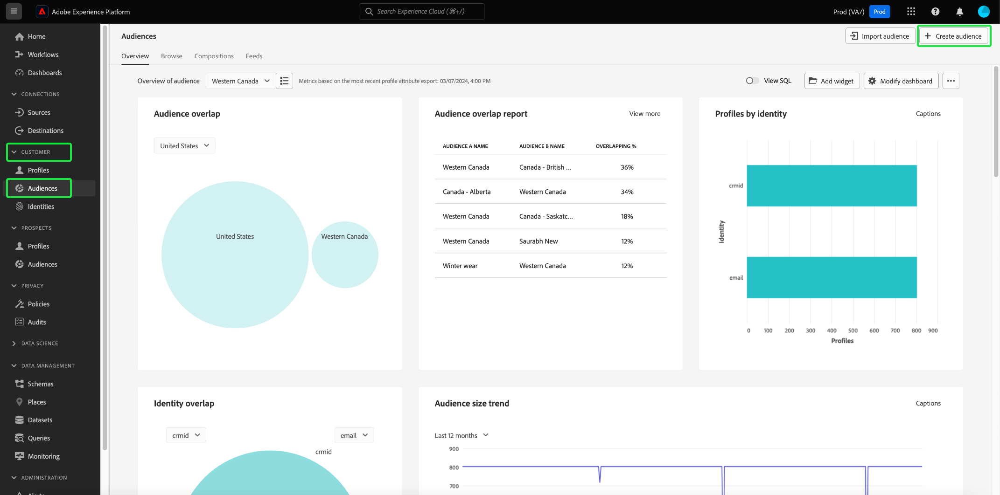

# 동의 분석 및 추적

오늘날의 마케팅 환경에서는 고객 동의 환경 설정을 이해하고 존중해야 합니다. Adobe Real-Time Customer Data Platform은 마케터가 고객 동의를 분석하여 신뢰를 구축하고, 개인 정보 보호 규정을 준수하며, 보다 개인화된 경험을 제공할 수 있는 기능을 제공합니다.

이 문서에서는 Real-Time CDP 데이터에 대한 다양한 마케팅 사용 사례에 대한 동의 대시보드를 작성하는 방법에 대해 자세히 설명합니다. 특히 비즈니스 요구에 적합한 속성으로 대상자를 만든 다음 Adobe Experience Platform UI에서 사전 구성된 위젯을 사용하여 인사이트를 소비하는 방법에 중점을 둡니다. 사용자 정의 대시보드 기능을 사용하여 사용자 정의 위젯을 빌드하는 다른 방법도 제공됩니다.

## 사용 사례 {#use-cases}

이 안내서에서 다루는 사용 사례는 동의 트렌드와 동의 중복입니다.

- **동의 트렌드**&#x200B;은(는) 사용자 동의가 시간 경과에 따라 트렌드되는 방식을 추적합니다. 동의 환경 설정 변경 분석을 사용하면 마케터가 이러한 사용자 환경 설정 변경에 맞는 캠페인을 계획하고 실행할 수 있습니다. 예를 들어 동의 선택을 유도하기 위해 타기팅된 교육 캠페인, 투명성 및 신뢰 캠페인 또는 인센티브 캠페인을 실행할 수 있습니다. 캠페인의 빈도를 사전 예방적으로 줄이기 위해 동의에 부정적인 영향을 미칠 수 있는 캠페인을 상호 연관시킬 수도 있습니다.
- **동의 겹침**&#x200B;은(는) 동의 채널 간의 겹침을 사용하여 여러 채널에 동의한 고객을 위해 여러 채널에서 일관되게 개인화된 메시지를 전달합니다. 마케터는 높은 수준의 동의 및 개인화된 메시징이 고객에게 공감을 주고 더 높은 응답률을 생성할 수 있는 특정 채널에 리소스를 우선 지정하고 할당할 수 있습니다.

## 동의한 대상자 만들기 {#create-consent-audiences}

동의 대시보드를 작성하려면 먼저 연락하는 데 동의한 모든 프로필의 대상자를 만들어야 합니다. Real-Time Customer Data Platform 세그먼트 빌더로 이동하려면 Experience Platform UI의 왼쪽 탐색에서 **[!UICONTROL 대상]**&#x200B;을 선택합니다. [!UICONTROL 대상] 대시보드의 [!UICONTROL 고객] 탭에서 보기의 오른쪽 상단에 있는 **[!UICONTROL 대상 만들기]**&#x200B;를 선택한 다음 **[!UICONTROL 규칙 작성]**&#x200B;을 선택합니다.

[!UICONTROL 고객], [!UICONTROL 대상자] 및 [!UICONTROL 세그먼트 만들기]가 강조 표시된 [!UICONTROL 대상자] 대시보드.

세그먼트 빌더 가 나타납니다. 사용 가능한 옵션에서 **[!UICONTROL XDM 개별 프로필]**&#x200B;을(를) 선택하십시오. [규칙 빌더 캔버스](../../segmentation/ui/segment-builder.md#rule-builder-canvas)에 대한 자세한 내용은 설명서를 참조하세요.

![강조 표시된 [!UICONTROL XDM 개별 프로필] 특성 폴더의 세그먼트 빌더입니다.](../images/insights-use-cases/consent-analysis/xdm-individual-profile.png)

사용 가능한 옵션에서 동의 속성을 찾습니다. **[!UICONTROL 동의 및 환경 설정]**&#x200B;을 선택하세요.

>[!NOTE]
>
>Adobe 권장 필드 그룹과 다른 속성에서 사용자 동의를 유지 관리한 경우 아래에 표시된 속성 대신 해당 속성을 선택해야 합니다.

자세한 내용은 [세그먼테이션의 동의 처리](../../segmentation/tutorials/consents.md#handling-consent-in-segmentation) 문서에서 확인할 수 있습니다.

![[!UICONTROL 동의 및 환경 설정] 특성 폴더가 강조 표시된 세그먼트 빌더입니다.](../images/insights-use-cases/consent-analysis/consent-and-preferences.png)

다양한 동의 및 환경 설정 옵션이 표시됩니다. 이 데모는 다양한 마케팅 채널을 통한 문의에 중점을 두므로 **[!UICONTROL 마케팅 환경 설정]**&#x200B;을 선택하세요.

![강조 표시된 [!UICONTROL 마케팅 환경 설정] 폴더의 세그먼트 빌더입니다.](../images/insights-use-cases/consent-analysis/marketing-preferences.png)

마케팅 환경 설정 목록이 표시됩니다. 이 사용 사례는 이메일, SMS 및 호출에 중점을 두고 있지만 다른 조합 또는 옵션 전체에 대한 인사이트를 구축할 수 있습니다. 각 채널에 대해 아래 단계를 수행하여 대상자를 만듭니다.

대상자 구성을 시작하려면 **[!UICONTROL SMS 수신]** / **[!UICONTROL 이메일 수신]** / **[!UICONTROL 통화 수신]**&#x200B;을 선택하세요.

[!UICONTROL 구독] 폴더가 표시됩니다. 사용 가능한 옵션에서 **[!UICONTROL 선택 값]** 특성을 선택하고 가운데 창으로 드래그한 다음 드롭다운에서 원하는 값을 선택합니다. 이 경우 **예(옵트인)**&#x200B;을(를) 선택합니다. 그런 다음 비즈니스 요구 사항에 따라 대상자의 이름을 지정하고 사용자에게 친숙한 설명을 제공합니다.

>[!NOTE]
>
>권장되는 대상자 수에는 소프트 제한이 있습니다. 자세한 내용은 [세그먼테이션 보호 설명서](../../profile/guardrails.md#segmentation-guardrails)에서 확인할 수 있습니다.

![세그먼트 빌더에서 강조 표시된 [!UICONTROL 예(옵트인)] 값이 있는 [!UICONTROL 선택 값] 특성. 대상자의 이름과 설명도 강조 표시됩니다.](../images/insights-use-cases/consent-analysis/choice-value.png)

필요한 대상을 만든 후에는 [!UICONTROL 대상] [!UICONTROL 찾아보기] 탭에 나열됩니다.

>[!NOTE]
>
>대상자를 만들 때 데이터를 사용하여 동의 대시보드를 작성하려면 먼저 배치 세분화 작업이 완료될 때까지 기다려야 합니다. 배치 세그먼테이션은 세그먼트 정의를 통해 모든 프로필 데이터를 한 번에 이동하여 해당 대상자를 생성하는 프로세스를 설명합니다. 대상자가 만들어지면 이 대상자는 내보내고 사용할 수 있도록 저장되고 저장됩니다. 배치 세그먼트는 24시간마다 자동으로 평가됩니다.

## 인사이트 사용 {#consume-insights}

Adobe은 프로필, 대상 및 대상 대시보드에서 자동으로 사용할 수 있는 다양한 인사이트를 만들었습니다. 그러면 만든 모든 대상자는 사전 구성된 이러한 통찰력과 함께 자동으로 사용할 수 있습니다. [프로필](../guides/profiles.md#standard-widgets), [대상](../guides/audiences.md#standard-widgets) 및 [대상](../guides/destinations.md) 대시보드에서 사용할 수 있는 인사이트 목록은 표준 위젯 설명서를 참조하십시오.

## 대상자 중복 {#audience-overlap}

두 동의 대상 간의 겹침을 검토하려면 [!UICONTROL 병합 정책별 대상 겹치기]를 프로필 대시보드에 추가하고 드롭다운 메뉴에서 원하는 대상을 선택하십시오. insight에 대한 자세한 내용은 대시보드에 위젯을 추가하는 방법에 대한 지침을 [*병합 정책별 대상 중복*](../guides/profiles.md#audience-overlap-by-merge-policy)&#x200B;을 참조하십시오.

<!-- Image needs updating to night mode -->

대상 대시보드의 대상 겹치기 보고서를 사용하여 다른 모든 대상 간에 사용자가 호출을 받는 데 동의한 모든 대상의 겹침을 볼 수 있습니다. 동의 대상자의 겹침을 보려면 먼저 [!UICONTROL 대상자] [!UICONTROL 개요] 탭으로 이동하십시오. 여기에서 [!UICONTROL 대상 중복 보고서] 위젯을 대상 대시보드에 추가할 수 있습니다. 위젯이 만들어지면 페이지 상단의 대상자 개요 드롭다운 메뉴에서 **[!UICONTROL 통화에 동의한 사용자]** 대상자를 선택합니다. 그런 다음 대상 겹침 보고서 위젯에서 **[!UICONTROL 자세히 보기]**&#x200B;를 선택하여 상위 겹침 중 최대 50개를 확인하고 선택한 세그먼트와 관련하여 최소 겹침 중 최대 50개를 확인합니다.

<!-- Image needs updating to night mode -->

![대상 겹치기 보고서 위젯이 표시된 대상 대시보드입니다. 사용자가 대상자를 비교 대상자로 호출하는 데 동의했으며 [더 보기] 링크가 모두 강조 표시됩니다.](../images/insights-use-cases/consent-analysis/audience-overlap-report-user-consent-to-calls.png)

대상 중복 보고서 대화 상자가 확장되어 추가 대상 중복 데이터를 표시합니다.

<!-- Image needs updating to night mode -->

## 대상자 크기 추세 {#audience-size-trends}

동의 기반 대상자를 만들면 대상자를 만든 날짜로부터 최대 12개월 동안 자동으로 트렌드가 표시됩니다. 고객 동의의 완전한 기능 트렌드를 보려면 다음 위젯을 [!UICONTROL 세그먼트] [!UICONTROL 개요] 페이지에 추가하십시오. 이러한 통찰력은 시간이 지남에 따라 동의가 어떻게 변경되는지 추적하는 강력한 수단을 제공합니다. 심지어 동의에 긍정적 또는 부정적인 영향을 줄 수 있는 동시에 실행하는 모든 캠페인과도 상호 연관됩니다. 이러한 위젯에 대해 제공되는 설명은 동의 사용 사례에 적용됩니다.

- [대상 크기 트렌드](../guides/audiences.md#audience-size-trend): 이 위젯은 각 동의의 시간 경과를 추적하는 방법을 제공합니다.
- [대상 크기 변경 트렌드](../guides/audiences.md#audience-size-change-trend): 이 위젯은 매일 고객 동의가 변경되는 방식을 추적합니다. 예를 들어 고객 동의 수가 100,000개 감소한 경우 매일 해당 변경 사항이 어떻게 발생했는지 확인할 수 있습니다.
- [ID별 대상 크기 트렌드](../guides/audiences.md#audience-size-trend-by-identity): 이 위젯을 사용하여 각 동의가 시간에 따라 어떻게 변경되었는지 추적할 수 있지만 전자 메일과 같은 특정 ID로 추가로 필터링됩니다.

<!-- Image needs updating to night mode -->

## 대상 개요 대시보드 {#audiences-overview-dashboard}

&quot;SMS에 동의한 사용자&quot;와 같은 동의 관련 대상을 만든 후 대상 개요 대시보드에 적절한 위젯을 추가하여 대상에 대한 주요 개인화된 동의 정보를 볼 수 있습니다. [!UICONTROL 대상] [!UICONTROL 개요]&#x200B;(으)로 이동하고 위젯 라이브러리에서 선택한 위젯을 추가합니다. 대시보드 보기에 추가된 모든 위젯의 크기를 조정하고 [!UICONTROL 대시보드 수정] 기능을 사용하여 이동할 수 있습니다. 개인화된 보기에는 시간 경과에 따른 트렌드(최대 12개월), 다른 대상과의 겹침, 대상자의 ID 구성과 같은 인사이트가 포함될 수 있습니다. 예제 보기가 아래에 표시되어 있습니다.

## 사용자 정의 대시보드 {#usr-defined-dashboards}

사용자 정의 대시보드를 사용하여 나만의 위젯을 빌드할 수도 있습니다. 고유한 위젯을 빌드하면 Adobe Real-Time CDP 내에서 직접 필터 등을 추가할 수 있는 유연성과 함께 위젯 유형을 완벽하게 제어할 수 있습니다.

예를 들어 시간이 지남에 따라 각 동의 환경 설정이 어떻게 변경되었는지 확인할 수 있도록 동일한 차트에서 여러 동의 대상자의 트렌드를 추적하려는 경우. 이러한 유형의 시각화는 최소 단계 및 1회 설정에서 사용자 정의 대시보드를 사용하여 가능합니다. 먼저 왼쪽 탐색에서 **[!UICONTROL 대시보드]**&#x200B;를 선택합니다. [!UICONTROL 대시보드] 작업 영역이 나타납니다. **[!UICONTROL 대시보드 만들기]**&#x200B;를 선택합니다. [대시보드 및 사용자 지정 위젯을 만드는 방법](../standard-dashboards.md)에 대한 전체 지침은 사용자 정의 대시보드 안내서에서 확인할 수 있습니다.

위젯 작성기에서 [데이터 모델을 선택](../standard-dashboards.md#select-data-model)하면 `CDPInsights`을(를) 선택한 후 **[!UICONTROL 다음]**&#x200B;을(를) 선택하십시오. [!UICONTROL 테이블 선택] 대화 상자가 나타납니다.

다음 보기는 왼쪽 레일에 사용 가능한 테이블 목록을 표시합니다. `adwh_fact_profile_by_segment_and_namespace_trendlines`을(를) 선택합니다.

위젯 작성기가 선택한 테이블의 데이터로 채워지면 아래 단계를 수행합니다.

- [`[!UICONTROL date]`에 대해 [!UICONTROL 특성]](../standard-dashboards.md#add-filter-attributes)을(를) 검색한 다음 + 아이콘을 사용하여 드롭다운 메뉴에서 X축에 `[!UICONTROL date]` 특성을 추가하십시오.
  
- [!UICONTROL 특성]에서 `[!UICONTROL count_of_profiles]`을(를) 검색한 다음 + 아이콘을 사용하여 드롭다운 메뉴에서 Y축에 `[!UICONTROL count_of_profiles]` 특성을 추가합니다.
- [!UICONTROL Y축] 필드에서 `...`(줄임표) 아이콘을 선택한 다음 드롭다운 메뉴에서 [!UICONTROL SUM] 집계 함수를 선택합니다.
  
- [!UICONTROL 표시] 드롭다운 메뉴를 선택하고 차트 종류를 [!UICONTROL 줄]&#x200B;(으)로 변경하십시오.
- [!UICONTROL 특성]에서 `[!UICONTROL segment_name]`을(를) 검색한 다음 + 아이콘을 사용하여 드롭다운 메뉴에서 `segment_name`을(를) [!UICONTROL 필터]&#x200B;(으)로 추가합니다. [!UICONTROL 필터: Segment_name] 대화 상자가 나타납니다. 동의와 관련하여 이전에 만든 대상자를 선택합니다. 이 예제에서는 **[!UICONTROL 통화에 동의한 사용자]**, **[!UICONTROL SMS에 동의한 사용자]**, **[!UICONTROL 전자 메일에 동의한 사용자]**, **[!UICONTROL 적용]**&#x200B;을 선택합니다.
- `[!UICONTROL segment_name]`에 대해 [!UICONTROL 특성]을(를) 검색한 다음 + 아이콘을 선택하여 드롭다운 메뉴에서 `segment_name`을(를) [!UICONTROL 색상]&#x200B;(으)로 추가합니다.
- [[!UICONTROL 속성] 패널](../standard-dashboards.md#widget-properties)을 열고 적절한 [!UICONTROL 위젯 제목] 및 [!UICONTROL 축 레이블]을(를) 제공하세요.
  
- 설정을 확인하려면 **[!UICONTROL 저장 후 닫기]**&#x200B;를 선택하세요.

>[!TIP]
>
>이제 대시보드를 저장하기 전에 위젯의 크기를 원하는 크기와 위치로 조정하거나 이동할 수 있습니다.

아래 이미지는 완성된 위젯이 표시되는 방식과 기타 잠재적인 사용자 정의 인사이트를 보여 줍니다. 만들 수 있는 위젯 유형에 대한 자세한 내용은 [데이터 모델 설명서](../data-models/cdp-insights-data-model-b2c.md)를 참조하세요.

<!-- The diagram shows straight lines due to a lack of data, however in your environment the trends will reflect the actual changes over time. -->

## 동의 정책 추적 {#consent-policies}

만든 동의 대시보드는 **동의 및 환경 설정 특성 분포를 캡처합니다**.

>[!NOTE]
>
>**Adobe Healthcare Shield** 또는 **Adobe Privacy &amp; Security Shield**&#x200B;의 고객의 경우 이 대시보드가 **동의 정책의 추적을 반영하지 않습니다**. 사용 가능한 추적에는 생성 및 활성화된 정책의 수와 대상 멤버십에 미치는 영향이 포함됩니다.

## 다음 단계

이 문서를 읽고 Real-Time CDP Insights를 사용하여 고객 동의 환경 설정을 종합적으로 볼 수 있도록 대시보드를 작성하는 방법을 배웠습니다. 이 문서에서는 Real-Time CDP이 동의 데이터를 기반으로 한 수집, 세분화, 분석 및 개인화된 마케팅 캠페인이 마케터에게 중요한 오늘날의 개인 정보 중심 환경에 대한 강력한 솔루션을 제공하는 방법을 보여 줍니다.
