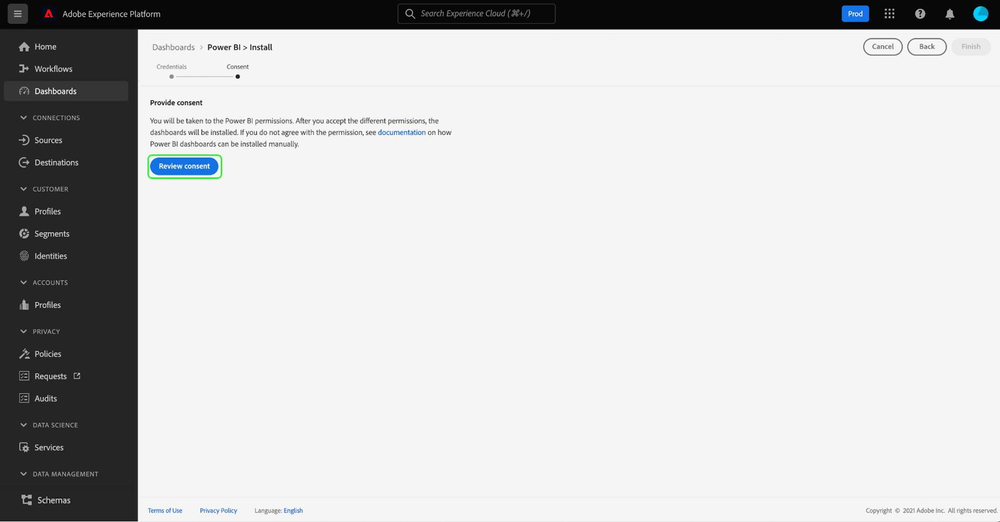

# 대시보드에 대한 Power BI 보고서 템플릿

Power BI 보고서 템플릿 기능을 사용하면 Adobe Experience Platform의 데이터로 채워진 매력적인 보고서를 만들 수 있습니다. 간소화된 설치 프로세스는 실시간 고객 프로필, 세그멘테이션 및 대상에 대한 표준 위젯을 자동으로 설치합니다. 또한, 설치는 Power BI을 데이터 모델에 연결하여 보고서 템플릿을 쉽게 사용자 지정하고 확장할 수 있습니다. 이러한 보고서는 Platform의 IMS 조직에 대한 자격 증명을 필요로 하는 수신자 없이 전체 조직에서 공유할 수 있습니다.

이 문서에서는 Adobe Experience Platform과 Power BI 애플리케이션을 연결하고 보고서 템플릿을 사용하여 외부 사용자와 주요 플랫폼 데이터 통찰력을 공유하는 방법에 대한 지침을 제공합니다.

## 시작하기

이 자습서를 계속하기 전에 을(를) 잘 이해하는 것이 좋습니다 [스키마 구성](../../xdm/schema/composition.md) 및 를 통해 속성이 실시간 고객 프로필에 포함되는 방법 [조합 스키마](../../xdm/schema/composition.md#union).

Power BI 애플리케이션 통합을 설치하려면 사용자가 먼저 다음 플랫폼 권한을 획득해야 합니다.

- 쿼리 관리
- 샌드박스 관리

이러한 권한을 할당하는 방법을 알아보려면 [액세스 제어](../../access-control/home.md) 설명서.

이 자습서를 따르려면 Power BI 계정이 있어야 합니다. 계정을 만들려면 [Power BI 홈페이지](https://powerbi.microsoft.com/en-us/) 등록 프로세스를 따릅니다. 이 Power BI 계정의 사용자는 **작업 공간 만들기** Power BI 설정 내에서 를 설정하는 중입니다. 이 설정은 Power BI 관리 포털의 테넌트 설정 내에 있습니다. 계정이 테넌트 또는 고용주에 의해 제공되는 경우 각 관리자에게 문의하여 이 설정을 활성화하십시오.

>[!NOTE]
>
>대시보드 탭이 플랫폼 UI의 왼쪽 탐색에 표시되고 대시보드 인벤토리 보기를 표시하려면 플랫폼 라이센스의 일부로 프로필, 세그먼트 또는 대상 대시보드 중 하나에 액세스할 수 있어야 합니다.

## Power BI 애플리케이션 통합 설치

Platform UI에서 **[!UICONTROL 대시보드]** 왼쪽 탐색에서 를 클릭하여 [!UICONTROL 대시보드] 작업 공간. 다음 [!UICONTROL 찾아보기] 탭에는 현재 사용 가능한 대시보드 보기 목록이 표시됩니다. 사용 가능한 대시보드 보기에 대한 자세한 내용은 [인벤토리 설명서](../inventory.md).

다음으로, **[!UICONTROL 통합]** 탭. Power BI 애플리케이션 통합 페이지가 나타납니다. 여기에서 을 선택합니다. **[!UICONTROL 설치]** 설치를 시작하려면 다음을 수행하십시오.

>[!NOTE]
>
>다음 [!UICONTROL 설치] Query Service Manage 및 Sandboxes 관리 권한이 모두 없으면 버튼이 비활성화됩니다.

### 자격 증명 제공

설치 프로세스의 첫 번째 단계는 Power BI 애플리케이션 통합을 위해 만료되지 않은 자격 증명을 제공하는 것입니다. 다음 두 가지 옵션을 사용할 수 있습니다. [[!UICONTROL 새 자격 증명 만들기]](#create-new-credentials) 또는 [[!UICONTROL 기존 자격 증명 사용]](#use-existing-credentials). 계속하려면 적절한 토글을 선택하십시오.

#### 새 자격 증명 만들기 {#create-new-credentials}

새 자격 증명을 생성할 때 두 개의 필수 필드가 있습니다. [!UICONTROL 이름] 및 [!UICONTROL 지정 대상]. 다음 [!UICONTROL 지정 대상] 필드는 Power BI 계정과 연결된 이메일 주소와 관련이 있습니다.

>[!IMPORTANT]
>
>만료되지 않은 자격 증명을 만들려면 특정 권한 및 역할이 할당되어야 합니다. 필요한 권한은 샌드박스 관리 및 Query Service 통합 관리입니다. 필요한 역할은 Adobe Experience Platform 관리자 및 개발자 역할입니다. 이러한 권한을 할당하는 방법을 알아보려면 [액세스 제어](../../access-control/home.md) 설명서.

만료되지 않은 쿼리 서비스 자격 증명을 생성하는 방법에 대한 자세한 내용은 [만료되지 않은 자격 증명 안내서](../../query-service/ui/credentials.md#non-expiring-credentials).

처음 만료되지 않은 자격 증명을 생성한 후 JSON 파일이 해당 시스템에 다운로드됩니다. 그런 다음 설치 프로세스를 완료하기 위해 이 JSON 파일을 다른 사용자와 공유할 수 있습니다.

#### 기존 자격 증명 사용 {#use-existing-credentials}

유효성 검사를 통과하기 위해 JSON 자격 증명 파일을 업로드할 수도 있습니다. 만료되지 않은 자격 증명 값을 포함하는 이러한 JSON 파일은 만료되지 않은 자격 증명을 만들 때 사용되는 로컬 컴퓨터에 다운로드됩니다.

>[!IMPORTANT]
>
>기존의 만료 전 자격 증명을 사용하려면 사용자에게 자격 증명이 이미 할당되어 있어야 합니다. 사용자에게 자격 증명이 할당되지 않고 Adobe Admin Console을 사용하여 새 자격 증명을 만들 수 없는 경우 설치 프로세스를 진행할 수 없습니다.

선택 **[!UICONTROL 자격 증명 파일 업로드]**&#x200B;를 선택한 다음 나타나는 대화 상자에서 업로드할 적절한 JSON 파일을 선택합니다.

만료되지 않은 자격 증명을 제공하면 Platform에서 자동으로 자격 증명이 검증됩니다. 유효성 검사가 성공하면 확인 메시지가 나타납니다. 선택 **[!UICONTROL 다음]** Power BI 애플리케이션에 대한 동의 계약서를 검토하기 위해.

### 동의 제공

동의 표시가 나타납니다. 선택 **[!UICONTROL 동의 검토]** 서비스 약관 및 개인 정보 보호 정책에 따라 Power BI이 데이터에 액세스하고 데이터를 사용하는 데 필요한 권한을 자세히 설명하는 새 창을 열려면 다음을 수행하십시오.

선택 **[!UICONTROL 수락]** 플랫폼 데이터에 액세스하고 사용할 수 있는 Power BI 권한을 부여합니다.

>[!NOTE]
>
>동의를 제공하기 전에 언제든지 설치 프로세스를 종료하면 Power BI 애플리케이션 통합이 대시보드 인벤토리에 설치되지 않습니다.

동의를 제공한 후 보고서 템플릿은 설치 프로세스의 일부로 Power BI 환경에 자동으로 설치됩니다. 그런 다음 Power BI은 만료되지 않은 자격 증명을 사용하여 플랫폼에 액세스하고, 모든 SQL 쿼리를 순차적으로 실행하고, 보고서 템플릿을 반환된 데이터로 채웁니다.

선택 **[!UICONTROL 완료]** 대시보드 인벤토리로 돌아갑니다.

이제 Power BI 보고서 템플릿이 설치되면 [!UICONTROL 찾아보기] 탭. 선택 **[!UICONTROL Power BI]** 목록에서 Power BI 환경으로 이동합니다.

>[!IMPORTANT]
>
>Power BI 관리자는 사용자가 Power BI 환경에서 이러한 대시보드를 볼 수 있는 적절한 액세스 권한이 있는지 확인해야 합니다.

## Power BI 작업 공간

로그인한 후 [Power BI 작업 공간](https://dxt.powerbi.com), 보고서 템플릿은 액세스 권한이 있는 각 서비스에 대해 사용할 수 있습니다. 보고서 템플릿에는 프로필, 세그먼트 및 대상 대시보드가 포함됩니다 **전용** 해당 보기 권한이 있는 경우

프로필, 세그먼트 및 대상의 표준 위젯은 기본적으로 Power BI 템플릿 보고서에서 사용할 수 있습니다.

>[!NOTE]
>
>해당 대시보드를 Power BI 환경에 설치할 수 있도록 해당 대시보드에 대한 편집 권한이 활성화되어 있어야 합니다.

대시보드가 Power BI에 설치되면 기본적으로 보고서 템플릿이 모든 사용자에게 표시됩니다. 보고서 템플릿에 대한 액세스를 제한하려면 Power BI 환경 내에서 해당 사용자에 대한 액세스를 비활성화해야 합니다.

## Power BI 보고서 템플릿 사용자 지정

사용자 지정 위젯을 사용하면 사용자 지정 특성을 데이터 모델에 추가하여 Power BI에서 제공하는 보고서 템플릿을 보강할 수 있습니다.

>[!NOTE]
>
>사용자 지정 위젯에 사용할 수 있는 속성은 결합 스키마에서 사용할 수 있는 속성에 따라 다릅니다. 사용자 지정 위젯의 이점을 위해 결합 스키마를 보고 탐색하는 방법에 대해 알아보려면 [결합 스키마 UI 안내서](../../profile/ui/union-schema.md).

### 사용자 지정 위젯 만들기

사용자 지정 위젯은 위젯 라이브러리를 통해 만들어집니다. 자세한 내용은 [위젯 라이브러리 개요](../customize/widget-library.md) 기능 및 [사용자 지정 위젯 만들기를 위한 자습서](../customize/custom-widgets.md) 자세한 내용은

>[!IMPORTANT]
>
>새로 만든 사용자 지정 위젯은 **not** Adobe Experience Platform 대시보드와 Power BI 보고서 템플릿 간에 자동으로 동기화됩니다. 플랫폼 UI에서 만든 모든 사용자 지정 위젯은 Power BI 환경 내에서 수동으로 다시 만들어야 합니다.

### Power BI 환경에서 사용자 지정 위젯을 다시 만듭니다

사용자 지정 위젯에 포함된 적절한 지표와 속성이 대시보드에 있으면 Power BI 환경 내에서 표시되는 보고서 템플릿을 수정할 수 있습니다. 자세한 내용은 [Power BI 설명서](https://docs.microsoft.com/ko-ko/power-bi/) 사용자 인터페이스를 통해 보고서를 편집하는 방법에 대한 정보를 제공합니다.

## Power BI 애플리케이션 통합 삭제

대시보드를 삭제하려면 대시보드 인벤토리로 이동하고 삭제 아이콘() 내의 아무 곳에나 삽입할 수 있습니다.

>[!NOTE]
>
>Power BI 대시보드를 설치한 사용자만 Platform UI에서 통합을 삭제할 수 있습니다.

확인 팝오버가 나타납니다. 선택 **[!UICONTROL 삭제]** 프로세스를 확인합니다.

>[!IMPORTANT]
>
>플랫폼 UI에서 Power BI 대시보드를 삭제하면 다음이 수행됩니다 **not** Power BI 환경에서 사용할 수 있는 보고서 템플릿을 삭제합니다. Power BI 보고서 템플릿에 있는 정보를 완전히 삭제하려면 Power BI 계정에 로그인하여 해당 환경에서 보고서 템플릿을 삭제해야 합니다. 삭제되면 사용자는 위에 설명된 것과 동일한 설치 지침에 따라 Power BI 대시보드를 다시 설치할 수 있습니다.

## 다음 단계

이 문서를 읽은 후에는 Power BI 보고서 템플릿을 플랫폼에 통합하여 프로필, 세그먼트 또는 대상 대시보드에서 매력적인 데이터 통찰력을 공유하는 방법을 이해할 수 있습니다. 자세한 내용은 [대시보드 사용자 지정 개요](../customize/overview.md) 대시보드 사용자 지정에 대해 자세히 알아보십시오.
