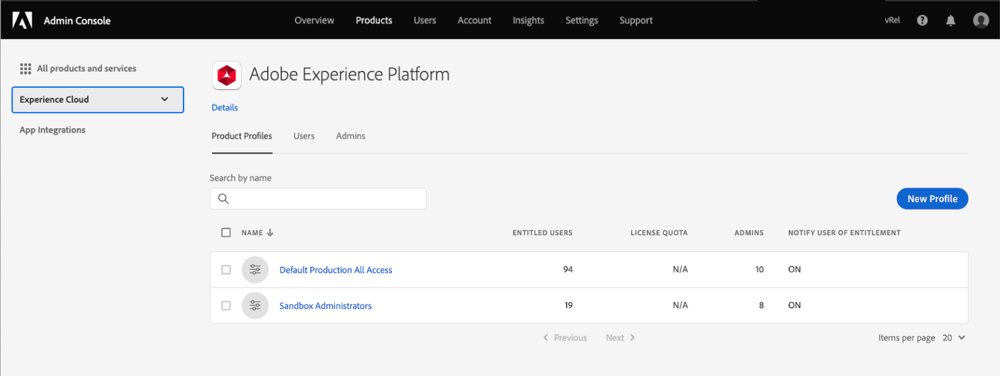

# 대시보드에 대한 액세스 권한

사용자에게 대시보드를 보고 편집하고 업데이트할 수 있는 기능을 부여하려면 먼저 권한을 활성화해야 합니다. Adobe Experience Platform에서 액세스 제어는 Adobe Admin Console을 통해 제공됩니다. 이 기능은 [!DNL Admin Console]의 제품 프로필을 활용하여 사용 권한 및 샌드박스를 사용자와 연결합니다.

이 문서에서는 Admin Console 내의 특정 대시보드 권한에 대한 액세스를 제공하는 방법에 대한 요약을 제공합니다. 액세스 권한 획득 및 할당에 대한 자세한 내용은 [액세스 제어 개요](../access-control/home.md)를 읽어 보십시오.

>[!NOTE]
>
>[!DNL Experience Platform]에 대한 액세스 제어를 구성하려면 [!DNL Experience Platform] 제품 통합이 있는 조직에 대한 관리자 권한이 있어야 합니다. 자세한 내용은 [관리 역할](https://helpx.adobe.com/enterprise/using/admin-roles.html)의 Adobe Help Center 문서를 참조하십시오.

## 사용 가능한 권한 {#available-permissions}

Experience Platform 내에서 대시보드에 액세스하는 데 필요한 두 가지 기본 권한이 있습니다. 권한은 다음과 같습니다.

* **라이선스 사용 대시보드 보기**:이 권한을 통해 사용자는 Experience Platform UI 내의 라이선스 사용 대시보드에 읽기 전용 액세스 권한을 얻을 수 있습니다.
* **표준 대시보드 관리**:이 권한을 사용하면 사용자가 아직 Data Warehouse에 없는 사용자 지정 속성을 추가할 수 있습니다.

다음 단계는 Admin Console을 사용하여 이러한 권한을 추가하는 방법을 보여줍니다.

## 제품 프로필 선택

사용자에게 Experience Platform의 대시보드에 대한 액세스 권한을 부여하려면 [Adobe Admin Console](https://adminconsole.adobe.com)에 로그인하고 위쪽 탐색에서 **Products**&#x200B;를 선택하여 시작하십시오.

왼쪽 탐색 메뉴의 Experience Cloud 드롭다운 또는 *모든 제품 및 서비스*&#x200B;에 나열된 카드에서 **Adobe Experience Platform**&#x200B;을 선택합니다. Adobe Experience Platform 제품 페이지에서 대시보드 권한을 추가할 제품 프로필을 선택하거나 **새 프로필**&#x200B;을 선택하여 새 제품 프로필을 만듭니다.

선택한 제품 프로필이 열리고, 해당 제품 프로필과 연결된 사용자가 표시됩니다. 제품 프로필에 대한 권한을 관리하려면 **권한**&#x200B;을 선택합니다.

## 권한 추가/편집

**권한** 탭에는 제품 프로필에 사용할 수 있는 모든 권한이 표시됩니다. **대시보드** 행을 찾아 현재 &quot;2개 중 0개가 포함됨&quot;이라고 표시되어 있음을 알 수 있습니다. 이는 제품 프로필에 대해 사용할 수 있는 대시보드 권한이 없음을 의미합니다.

대시보드 권한을 편집하려면 대시보드 행에서 **편집**&#x200B;을 선택합니다.

사용 가능한 권한 항목 및 포함된 권한 항목을 보여주는 **권한 편집** 대화 상자가 열립니다. 권한 옆에 있는 더하기 기호(`+`)를 선택하여 추가하거나 **+ 모두 추가**&#x200B;를 선택하여 모든 권한을 한 번에 추가할 수 있습니다.

사용 권한에 대한 설명은 이 문서의 앞부분에서 [사용 가능한 권한](#available-permissions) 섹션을 참조하십시오.

>[!NOTE]
>
>모든 사용자에 대해 모든 권한을 활성화할 필요는 없습니다. 조직의 구조에 따라 특정 사용자에 대해 별도의 제품 프로필을 만들고 제한된 액세스(예: 읽기 전용)를 부여할 수 있습니다.

권한이 추가되면 **저장**&#x200B;을 선택하여 제품 프로필로 돌아갑니다.

제품 프로필로 돌아가면 **대시보드** 행에 &quot;2 of 2 included&quot;가 표시되는지 확인하여 권한이 추가되었는지 확인할 수 있습니다.

## 다음 단계

이제 대시보드에 액세스 권한을 추가했으므로 조직 내의 사용자는 Experience Platform UI 내에서 대시보드를 보고 지정된 권한에 따라 다른 작업을 수행할 수 있습니다.