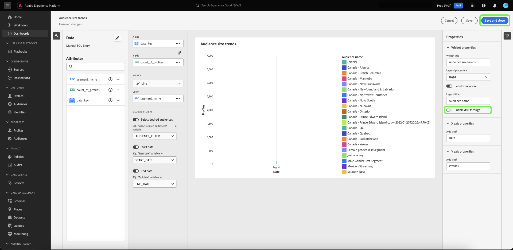

# 드릴스루 {#drill-through}

드릴스루를 사용하면 차트에서 새 대시보드로 간편하게 이동할 수 있으므로 다중 계층 데이터 분석을 용이하게 할 수 있습니다. 이 기능을 사용하면 트렌드, 고객 행동, 운영 지표 등을 학습할 때 높은 수준의 개요에서 심층적인 보고서로 쉽게 전환하여 필요한 컨텍스트를 항상 확보할 수 있습니다.

시스템은 소스 대시보드에서 대상 대시보드로 글로벌 필터 및 날짜 범위 필터를 자동으로 전달하여 전체 드릴스루 경험 전체에서 시작한 분석을 원활하게 계속할 수 있도록 합니다. 연구의 다양한 층 사이의 탐색의 용이성을 위해, 시스템은 다중-레벨 드릴스루를 허용한다.

## 드릴스루 만들기 {#create-drill-through}

드릴스루를 만들려면 먼저 대시보드 보기에서 **[!UICONTROL 편집]**&#x200B;을 선택합니다.

드릴스루할 차트의 줄임표를 선택한 다음 **[!UICONTROL 편집]**&#x200B;을 선택합니다.

[!UICONTROL 속성] 패널에서 토글을 사용하여 **[!UICONTROL 드릴스루 사용]**&#x200B;을 사용하도록 설정한 다음 드롭다운을 사용하여 **[!UICONTROL Target 대시보드]**&#x200B;를 선택합니다. **[!UICONTROL 통과 필터링]**&#x200B;에 대한 토글이 활성화되어 있는지 확인한 다음 **[!UICONTROL 저장 및 닫기]**&#x200B;를 선택합니다.

>[!INFO]
>
>대상 대시보드에 대해 위에 강조 표시된 단계를 반복하여 다중 레벨 드릴스루를 설정합니다.

## 드릴스루 보기 {#view-drill-through}

드릴스루를 보려면 대시보드 보기에서 차트의 줄임표를 선택한 다음 **[!UICONTROL 드릴스루]**&#x200B;를 선택합니다.

드릴스루 대상 대시보드가 표시됩니다. 다중 레벨 드릴스루가 있는 경우 이 단계를 반복할 수 있습니다.

>[!NOTE]
>
>소스 대시보드에 적용된 모든 필터는 대상 대시보드로 전달됩니다. 하지만 하위 대시보드에서는 날짜 필터 및 글로벌 필터가 비활성화됩니다.

## 드릴스루 제거 {#remove-drill-through}

드릴스루를 제거하려면 먼저 대시보드 보기에서 **[!UICONTROL 편집]**&#x200B;을 선택합니다.

드릴스루를 제거할 차트의 줄임표를 선택한 다음 **[!UICONTROL 편집]**&#x200B;을 선택합니다.

[!UICONTROL 속성] 패널에서 토글을 선택하여 **[!UICONTROL 드릴스루 사용]**&#x200B;을 비활성화한 다음 **[!UICONTROL 저장 및 닫기]**&#x200B;를 선택합니다.

[!UICONTROL 드릴스루 사용]에 대해 토글이 비활성화된 

## 다음 단계

이제 이 문서를 읽고 대시보드용 드릴스루를 만드는 방법을 알 수 있습니다. [안내 디자인 모드 가이드](../standard-dashboards.md)를 사용하여 Adobe Experience Platform UI에서 기존 데이터 모델에서 차트를 생성하는 방법을 배울 수도 있습니다.
