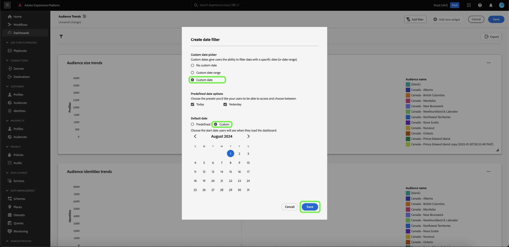

# 날짜 필터 만들기 {#create-date-filter}

날짜별로 인사이트를 필터링하려면 날짜 제한을 수락할 수 있는 매개 변수를 SQL 쿼리에 추가해야 합니다. 이 작업은 query pro 모드 인사이트 생성 워크플로우의 일부로 수행됩니다. 통찰력을 위해 SQL을 입력하는 방법에 대한 자세한 내용은 [query pro mode 설명서](../overview.md#query-pro-mode)를 참조하세요.

쿼리 매개 변수를 사용하면 동적 데이터가 실행 시 추가하는 값에 대한 자리 표시자 역할을 하므로 동적 데이터로 작업할 수 있습니다. 이러한 자리 표시자 값은 UI를 통해 업데이트할 수 있으며 기술 수준이 낮은 사용자가 날짜 범위를 기반으로 인사이트를 업데이트할 수 있습니다.

쿼리 매개 변수에 익숙하지 않은 경우 [매개 변수가 있는 쿼리를 구현하는 방법에 대한 지침](../../../query-service/ui/parameterized-queries.md)에 대한 설명서를 참조하세요.

## 대시보드에 날짜 필터 적용 {#apply-date-filter}

날짜 필터를 적용하려면 대시보드 보기의 드롭다운 메뉴에서 **[!UICONTROL 필터 추가]**&#x200B;를 선택한 다음 **[!UICONTROL 날짜 필터]**&#x200B;를 선택하십시오.


다음과 같은 날짜 필터링 옵션이 표시됩니다.

| 필터 | 설명 |
| --- | --- |
| 사용자 정의 날짜 없음 | 여러 사전 설정 값에서 하나 이상의 사용자 정의 날짜를 선택합니다. |
| 사용자 정의 날짜 범위 | 여러 사전 설정 값에서 하나 이상의 사용자 지정 날짜를 선택하거나 사용자 지정 날짜 범위를 지정합니다. |
| 사용자 정의 날짜 | 사전 설정 값에서 선택하거나 대시보드의 시작 날짜를 지정합니다. |


### 사용자 지정 날짜 필터 없음 만들기

미리 정의된 날짜 필터를 적용하려면 **[!UICONTROL 사용자 지정 날짜 없음]**&#x200B;을 선택한 다음 포함할 미리 정의된 날짜 옵션을 선택하십시오. 마지막으로 드롭다운을 사용하여 기본 날짜 범위를 선택한 다음 **[!UICONTROL 저장]**&#x200B;을 선택합니다.


이전에 선택한 기본 날짜 범위를 표시하는 대시보드로 돌아갑니다. 드롭다운 메뉴를 사용하여 다른 사전 설정된 날짜 범위를 선택합니다.


### 사용자 지정 날짜 범위 필터 만들기

사용자 지정 날짜 범위 필터를 적용하려면 **[!UICONTROL 사용자 지정 날짜 범위]**&#x200B;를 선택한 다음 포함할 미리 정의된 날짜 옵션을 선택합니다. 마지막으로 **[!UICONTROL 사용자 지정]**&#x200B;을 선택하여 기본 날짜 범위를 설정합니다. 달력을 사용하여 날짜 범위를 지정한 다음 **[!UICONTROL 저장]**&#x200B;을 선택합니다.

>[!NOTE]
>
>사전 정의된 날짜 옵션을 선택할 필요는 없습니다.


이전에 지정한 사용자 지정 데이터 범위를 표시하는 대시보드로 돌아갑니다. 드롭다운 메뉴를 사용하여 다른 사전 설정된 날짜 범위를 선택합니다.


### 사용자 지정 날짜 필터 만들기

사용자 지정 날짜 필터를 적용하려면 **[!UICONTROL 사용자 지정 날짜]**&#x200B;를 선택하고 포함할 미리 정의된 날짜 옵션을 선택하십시오. 마지막으로 **[!UICONTROL 사용자 지정]**&#x200B;을 선택한 다음 달력을 사용하여 시작 날짜를 선택하십시오. 마지막으로 **[!UICONTROL 저장]**&#x200B;을 선택합니다.

>[!NOTE]
>
>사전 정의된 날짜 옵션을 선택할 필요는 없습니다.



이전에 지정한 사용자 지정 데이터를 표시하는 대시보드로 돌아갑니다. 드롭다운 메뉴를 사용하여 다른 날짜를 선택합니다.


## 날짜 필터 삭제 {#delete-date-filter}

날짜 필터를 제거하려면 필터 삭제 아이콘()을 선택합니다.


## 날짜 쿼리 매개 변수를 포함하도록 SQL 편집 {#include-date-parameters}

그런 다음 SQL에 날짜 범위를 허용하는 쿼리 매개변수가 포함되어 있는지 확인합니다. SQL에 쿼리 매개 변수를 아직 통합하지 않은 경우 이러한 매개 변수를 포함하도록 인사이트를 편집합니다. [인사이트를 편집](../overview.md#edit)하는 방법에 대한 지침은 설명서를 참조하세요.

>[!TIP]
>
>날짜 필터를 활성화할 각 차트의 SQL 문에 `$START_DATE` 및 `$END_DATE` 매개 변수를 추가하는 것이 좋습니다.

>[!NOTE]
>
>날짜 필터는 시간 제한을 지원하지 않습니다. 필터는 날짜 범위에만 적용됩니다. 즉, 24시간 내에 여러 보고서가 있는 경우 동일한 날 내에서 서로 다른 시간을 구별할 수 없습니다. 이러한 이유로 시간 구성 요소를 날짜로 캐스팅하는 것이 좋습니다.

분석 중인 데이터 모델이나 테이블에 시간 구성 요소가 있는 경우 날짜별로 데이터를 그룹화한 다음 이 날짜 필터를 적용할 수 있습니다.

아래의 예제 SQL 문은 `$START_DATE` 및 `$END_DATE` 매개 변수를 통합하고 `cast`을(를) 사용하여 시간 구성 요소를 날짜로 프레임을 지정하는 방법을 보여 줍니다.

```sql
SELECT Sum(personalization_consent_count) AS Personalization,
       Sum(datacollection_consent_count)  AS Datacollection,
       Sum(datasharing_consent_count)     AS Datasharing
FROM   fact_daily_consent_aggregates f
       INNER JOIN dim_consent_valued
               ON f.consent_value_id = d.consent_value_id
WHERE  f.date BETWEEN Upper(Coalesce(Cast('$START_DATE' AS date), '')) AND Upper
                      (
                             Coalesce(Cast('$END_DATE' AS date), ''))
       AND ( ( Upper(Coalesce($consent_value_filter, '')) IN ( '', 'NULL' ) )
              OR ( f.consent_value_id IN ( $consent_value_filter ) ) )
LIMIT  0; 
```

아래 스크린샷에서는 SQL 문과 쿼리 매개 변수 키 값 쌍에 통합된 날짜 제약 조건이 강조 표시됩니다.

>[!NOTE]
>
>Query pro 모드에서 명령문을 작성할 때 SQL 문을 실행하고 차트를 작성하려면 각 매개 변수에 대한 샘플 값을 제공해야 합니다. 문을 작성할 때 제공하는 샘플 값은 런타임 시 날짜(또는 글로벌) 필터에 대해 선택하는 실제 값으로 대체됩니다.

![SQL에서 날짜 매개 변수가 강조 표시된 [!UICONTROL SQL 입력] 대화 상자입니다.](../../images/sql-insights-query-pro-mode/sql-date-parameters.png)

## 각 인사이트에서 날짜 매개 변수 활성화 {#enable-date-parameters}

인사이트의 SQL에 적절한 매개 변수를 통합하면 이제 `Start_date` 및 `End_date` 변수를 위젯 작성기에서 전환으로 사용할 수 있습니다. 인사이트를 편집하는 방법에 대한 자세한 내용은 [query pro 모드 위젯 채우기 섹션](../overview.md#populate-widget)을 참조하세요.

위젯 작성기에서 `Start_date` 및 `End_date` 매개 변수를 사용하도록 설정/변경을 선택합니다.


그런 다음 드롭다운 메뉴에서 적절한 쿼리 매개 변수를 선택합니다.


마지막으로 **[!UICONTROL 저장 후 닫기]**&#x200B;를 선택하여 대시보드로 돌아갑니다. 이제 날짜 필터가 시작 및 종료 날짜 매개 변수가 있는 모든 인사이트에 대해 활성화됩니다.
