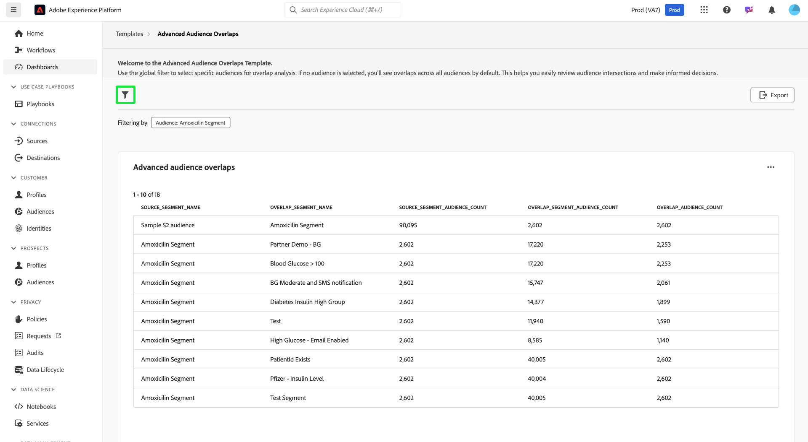

# 고급 대상자 오버랩

서로 다른 대상 세그먼트가 [!UICONTROL 고급 대상 겹침] 대시보드와 어떻게 교차하는지 분석하여 대상 세분화 및 타깃팅 전략을 최적화하는 유용한 통찰력을 얻으십시오. 표 지표를 검토하여 중복을 식별하고 세분화를 세분화하고 중복 메시지를 줄입니다. 궁극적으로 이러한 통찰력을 사용하여 보다 타겟팅된 캠페인과 효율적인 마케팅 활동을 만들 수 있습니다. 이 대시보드에서 대상 교차를 검토하고, 필터를 적용하고, 세부 중복 분석을 수행하여 데이터 기반 결정을 내리고 참여 결과를 향상시킬 수 있습니다.

## 대상자 필터링 {#filter-audiences}

중복 분석을 위해 특정 대상을 필터링하려면 필터 아이콘() [!UICONTROL 필터] 대화 상자를 엽니다. 여기에서 겹치기 템플릿에 대상을 추가하거나 제거하여 분석을 구체화할 수 있습니다.

[!UICONTROL 필터] 대화 상자가 나타납니다. 중복 분석의 대상을 선택하려면 **[!UICONTROL 대상]** 드롭다운에서 대상 이름을 선택하십시오. 추가하는 대상자의 이름이 드롭다운 아래에 태그와 함께 표시됩니다. 추가한 후에는 해당 이름별로 &#39;X&#39;를 선택하여 제거할 수 있습니다. 적용된 필터를 모두 제거하려면 **[!UICONTROL 모두 지우기]**&#x200B;를 선택하십시오.

## 적용된 필터 {#applied-filters}

필터가 적용되면(스크린샷 예제의 경우 [!UICONTROL 아목시실린 세그먼트]) 표시되는 대상 데이터가 좁혀집니다. 추가하도록 선택한 추가 대상은 [!UICONTROL 고급 대상 겹침] 차트 위의 [!UICONTROL 필터링 기준] 태그 옆에 표시됩니다.

## 고급 대상 겹침 표 {#advanced-audience-overlaps-table}

대시보드의 기본 섹션에는 서로 다른 세그먼트 간의 대상 겹침을 자세히 비교하는 [!UICONTROL 고급 대상 겹침] 표가 표시됩니다. 테이블 열은 다음과 같습니다.

| 열 이름 | 설명 |
|------------------------------------|----------------------------------------------------------------------------------------------|
| **[!UICONTROL Source_Segment_Name]** | 분석 중인 원래 대상(예: &quot;아목시실린 세그먼트&quot;). |
| **[!UICONTROL Overlap_Segment_Name]** | 겹치는 대상을 비교하는 대상(예: &quot;혈당 > 100&quot;). |
| **[!UICONTROL Source_Segment_Audience_Count]** | 소스 대상의 총 프로필 수입니다. |
| **[!UICONTROL Overlap_Segment_Audience_Count]** | 겹치는 대상자의 크기는 겹치는 내용에 따라 차이가 있다. |
| **[!UICONTROL Overlap_Audience_Count]** | 소스와 겹치는 대상 간의 실제 겹치는 대상 크기입니다. |

{style="table-layout:auto"}

## 인사이트 내보내기 {#export-insights}

대상자를 필터링하고 분석한 후 추가적인 오프라인 분석 또는 보고 목적으로 데이터를 내보낼 수 있습니다. 인사이트를 내보내려면 표의 오른쪽 상단에서 **[!UICONTROL 내보내기]**&#x200B;를 선택합니다. 데이터를 PDF으로 저장하거나 인쇄할 수 있는 PDF 인쇄 대화 상자가 나타납니다.

[!UICONTROL 템플릿] 개요로 돌아가려면 **[!UICONTROL 템플릿]**&#x200B;을 선택합니다.

## 다음 단계

이 문서를 읽고 나면 **[!UICONTROL 고급 대상 겹치기]** 대시보드를 사용하여 대상 교차를 분석하고 데이터 중심의 결정을 내리는 방법에 대해 알아보았습니다. 대상자 세분화 및 타기팅 전략을 보다 효율적으로 최적화하려면 중요한 통찰력을 제공하는 다른 데이터 Distiller 템플릿을 살펴보십시오. 대상 참여 및 세분화 노력을 계속 향상하려면 [대상 트렌드](./trends.md), [대상 비교](./comparison.md) 및 [대상 ID 중복](./identity-overlaps.md) UI 안내서를 참조하십시오.

