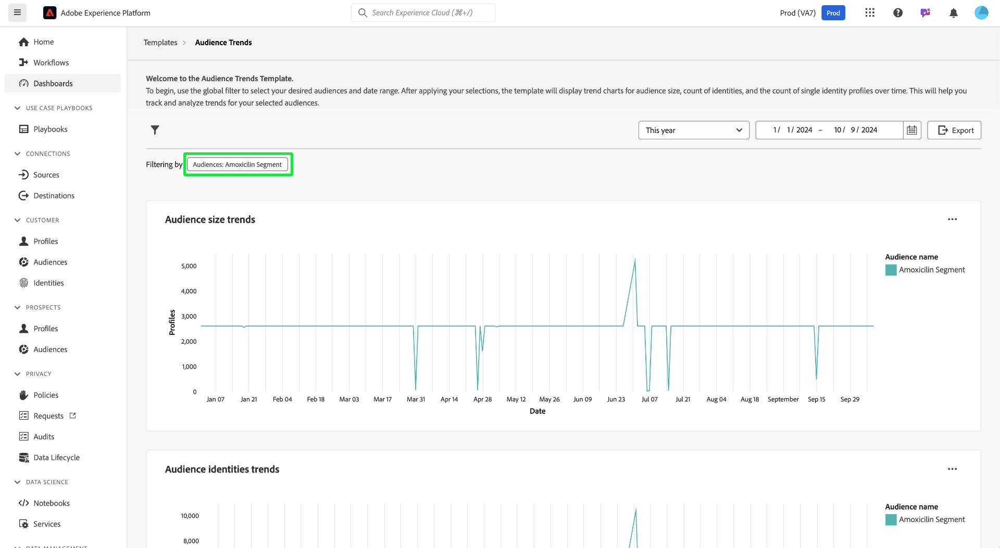

# 대상자 추세

[!UICONTROL 대상 트렌드] 대시보드에서 주요 대상 지표의 시각화를 사용하여 시간이 지남에 따라 대상이 어떻게 변경되는지 분석합니다. 이 대시보드는 대상자 증가, ID 수 및 단일 ID 프로필 수와 같은 트렌드를 추적하는 데 도움이 되며 데이터 중심의 의사 결정을 내릴 수 있도록 해 줍니다. 마케터는 이러한 지표를 분석함으로써 타겟팅 전략을 최적화하고, 대상자 참여를 개선하고, 보다 효과적인 캠페인을 위해 세분화 노력을 강화할 수 있습니다.

## 대상자 필터링 {#filter-audiences}

분석을 시작하려면 전역 필터를 사용하여 분석할 특정 대상과 날짜 범위를 선택합니다. 필터 아이콘()에서 **[!UICONTROL 필터]** 대화 상자를 열어 다음과 같은 작업을 수행할 수 있습니다.

1. **대상 선택**: 분석할 대상을 선택합니다(예제 스크린샷에서는 **Amoxicillin** 대상이 선택됨).
1. **날짜 범위 설정**: 드롭다운 메뉴에서 미리 정의된 범위를 선택하거나 달력 필드를 사용하여 시작 날짜와 종료 날짜를 수동으로 선택합니다.

필터를 설정한 후 **[!UICONTROL 적용]**&#x200B;을 선택하여 대시보드를 업데이트합니다. 선택한 필터가 적용되며 특정 기간 동안 선택한 대상자에 대한 집중 인사이트가 표시됩니다. 맞춤형 필터를 사용하면 데이터가 분석 목표와 관련이 있는지 확인할 수 있습니다.

## 사용 가능한 대상 트렌드 차트 {#available-charts}

시간 경과에 따른 대상 지표를 이해하는 데 도움이 되는 세 가지 기본 차트가 있습니다. 각 차트에 대해 오른쪽 상단의 타원(`...`)을 선택한 다음 [!UICONTROL 자세히 보기]를 선택하여 표 형식의 결과를 보거나 데이터를 CSV 파일로 다운로드하여 스프레드시트에서 볼 수 있습니다. 자세한 내용은 [자세한 정보 보기](../view-more.md)를 참조하세요.

>[!TIP]
>
>차트에서 특정 날짜 위로 마우스를 가져가 대화 상자에 개별 프로필 수를 표시할 수 있습니다.

### 대상자 크기 트렌드 {#audience-size-trends}

**[!UICONTROL 대상 크기 트렌드]** 차트는 시간 경과에 따라 선택한 대상 내의 프로필 수를 보여줍니다. 대상자의 증가 또는 감소를 추적하는 데 도움이 됩니다. 이 차트를 사용하여 참여 효과를 모니터링하고 대상 크기의 변화를 이해할 수 있습니다.

### 대상자 Id 트렌드 {#audience-identities-trends}

**[!UICONTROL 대상 ID 트렌드]** 차트는 대상 세그먼트 내의 총 ID 수에 대한 통찰력을 제공합니다. 이 차트를 사용하여 고유한 ID가 대상자의 전체 크기에 어떻게 기여하는지 이해합니다. 대상자의 안정성과 참여를 나타냅니다.

### 단일 ID 대상자 크기 트렌드 {#single-identity-audience-size-trends}

**[!UICONTROL 단일 ID 대상자 크기 트렌드]** 차트는 단일 ID만 있는 대상자 구성원 수를 보여 줍니다. 이 지표는 특히 ID 고유성 측면에서 대상자의 구성을 이해하는 데 유용하며 ID 결합 노력의 효과를 측정하는 데 도움이 됩니다.

## 인사이트 내보내기 {#export-insights}

지표를 분석하고 관련 필터를 적용한 후 추가적인 오프라인 분석 또는 보고 목적으로 데이터를 내보낼 수 있습니다. 이렇게 하려면 표의 오른쪽 상단에서 **[!UICONTROL 내보내기]**&#x200B;를 선택합니다. [PDF 인쇄] 대화 상자가 나타납니다. 이 대화 상자에서 시각화된 데이터를 PDF으로 저장하거나 인쇄할 수 있습니다.

## 다음 단계

이 문서를 읽고 나면 **대상 트렌드** 대시보드에서 시간 경과에 따른 대상 동작에 대한 중요한 통찰력을 얻는 방법에 대해 배웠습니다. 정보에 입각한 결정을 내리고, 세분화를 최적화하고, 참여 전략을 개선하는 데 도움이 되는 다른 데이터 Distiller 템플릿에 대해 알아보려면 [대상 비교](./comparison.md), [대상 ID 중복](./identity-overlaps.md) 및 [고급 대상 중복](./overlaps.md) UI 안내서를 참조하십시오.
