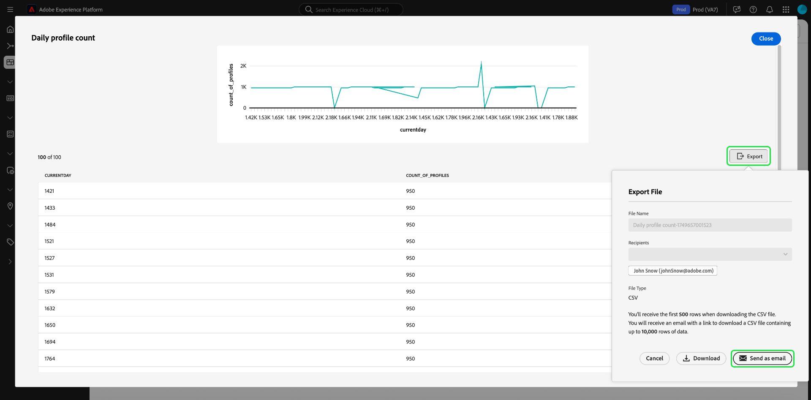
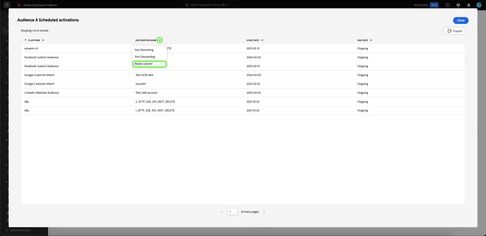

# 더 보기 {#view-more}

[쿼리 프로 모드](./overview.md#query-pro-mode)를 사용하여 [사용자 지정 insight](./overview.md)을 만든 후 여러 형식으로 차트 데이터를 볼 수 있습니다. 표 형식의 결과를 보거나 CSV 형식 또는 이메일을 통해 데이터를 내보낼 수 있습니다.

## 표로 정리된 결과 {#tabulated-results}

SQL을 통해 쿼리 프로 모드를 사용하여 작성된 모든 차트의 경우 Experience Platform UI 내에서 분석 결과를 표로 표시할 수 있습니다.

사용자 지정 대시보드에서 위젯의 줄임표(`...`)를 선택하여 [!UICONTROL 자세히 보기] 및 [!UICONTROL SQL 보기] 옵션에 액세스합니다.

## 내보내기 {#export}

**[!UICONTROL 자세히 보기]** 대화 상자에서 CSV 파일을 직접 다운로드하거나 나중에 안전한 다운로드를 위해 전자 메일에 링크를 보내 표 데이터를 내보냅니다.

>[!IMPORTANT]
>
>내보내기 옵션에 액세스하려면 관리자가 **[!UICONTROL 대시보드 데이터 내보내기]** 권한을 부여해야 합니다. [!UICONTROL 내보내기] 단추가 회색으로 표시되면 관리자에게 문의하십시오. 대시보드 권한에 대한 자세한 내용은 [액세스 제어 개요](../../access-control/home.md)를 참조하세요.

>[!NOTE]
>
>시각화 전용 내보내기에는 [!UICONTROL 대시보드 데이터 내보내기] 권한이 필요하지 않습니다. 예를 들어 처리된 데이터를 [PDF 형식의 사용자 지정 대시보드 인사이트](./export-pdf.md) 또는 [Platform UI 대시보드 인사이트](../download.md)에서 내보낼 수 있습니다.

### CSV 다운로드 {#download-csv}

[!UICONTROL 자세히 보기] 대화 상자에서 **[!UICONTROL 내보내기]**&#x200B;를 선택한 다음 **[!UICONTROL CSV 다운로드]**&#x200B;를 선택하여 차트 데이터를 CSV 형식으로 다운로드합니다.

>[!NOTE]
>
>CSV 다운로드는 처음 500개의 레코드로 제한됩니다.

### 이메일로 보내기 {#send-as-email}

500개가 넘는 레코드를 내보내려면 **[!UICONTROL 내보내기]**&#x200B;를 선택하고 [!UICONTROL 파일 내보내기] 대화 상자에서 **[!UICONTROL 이메일로 보내기]**&#x200B;를 선택합니다. 이 옵션은 Adobe 관련 이메일 주소에 대한 다운로드 링크를 안전하게 전송합니다. 받는 사람의 이름과 등록된 Adobe 전자 메일 주소가 대화 상자의 [!UICONTROL 받는 사람] 섹션에 표시됩니다.

[!UICONTROL 전자 메일로 보내기]를 선택하면 Adobe에서 보고서를 생성하고 등록된 Adobe 주소로 전자 메일을 보냅니다. 이메일에는 Experience Platform을 통한 인증이 필요한 보안 다운로드 링크가 포함되어 있습니다.

>[!NOTE]
>
>링크 생성 후 24시간 이내에 보고서를 다운로드해야 합니다. 그 후에는 파일이 만료됩니다.

Adobe은 데이터를 보호하기 위해 내보낸 파일을 첨부 파일로 보내는 대신 안전하게 호스팅합니다. 액세스하려면 Experience Platform UI를 통한 인증이 필요하며 Adobe은 의도한 수신자만 파일을 다운로드했는지 확인합니다.

이 방법을 사용하면 **최대 10,000개의 레코드**&#x200B;를 내보낼 수 있으며 중요한 데이터에 안전하게 액세스할 수 있습니다.

## 열별 정렬 {#sort-column}

테이블화된 결과를 볼 때 정렬 기능을 사용하여 오름차순 또는 내림차순으로 열을 정렬할 수 있습니다. 사용자 지정 대시보드에서 테이블의 줄임표(`...`)를 선택하여 [!UICONTROL 자세히 보기] 옵션에 액세스합니다.

![테이블의 줄임표 드롭다운 메뉴와 [자세히 보기] 옵션이 강조 표시된 사용자 지정 대시보드입니다.](../images/sql-insights-query-pro-mode/advanced-ellipses-dropdown.png)

열 이름 옆에 있는 드롭다운 메뉴를 선택한 다음 **[!UICONTROL 오름차순 정렬]** 또는 **[!UICONTROL 내림차순 정렬]**&#x200B;을 선택하여 열을 정렬할 수 있습니다.

>[!NOTE]
>
>[!UICONTROL 오름차순 정렬] 및 [!UICONTROL 내림차순 정렬] 옵션은 [정렬 기능](./overview.md#advanced-attributes)(으)로 구성된 열에 대해서만 표시됩니다.

## 열 크기 조정 {#resize-column}

표 형식의 결과에서 열 크기를 조정하여 데이터 가독성을 향상시킬 수 있습니다. 사용자 지정 대시보드에서 테이블의 줄임표(`...`)를 선택하여 [!UICONTROL 자세히 보기] 옵션에 액세스합니다. 열 이름 옆에 있는 드롭다운 메뉴를 사용하여 크기를 조정한 다음 **[!UICONTROL 열 크기 조정]**&#x200B;을 선택합니다.

슬라이더를 선택하고 왼쪽 또는 오른쪽으로 드래그하여 필요에 따라 열 크기를 조정합니다.

## 표 페이지 매김 {#table-pagination}

페이지 매김은 [!UICONTROL 자세히 보기] 기능의 테이블에 자동으로 적용되므로 SQL 쿼리를 수동으로 수정할 필요가 없습니다. 이 기능을 사용하면 데이터가 보다 관리하기 쉬운 형식으로 표시되므로 큰 데이터 세트를 탐색하는 프로세스를 쉽게 수행할 수 있습니다.

페이지당 최대 500개의 레코드를 볼 수 있습니다. 레코드를 탐색하려면 페이지 아래쪽에 있는 **[!UICONTROL >]**&#x200B;을(를) 사용합니다.

## 다음 단계

이제 이 문서를 읽고 사용자 지정 차트의 SQL 분석에서 정리된 결과를 보고 해당 데이터를 안전하게 내보내는 방법을 이해할 수 있습니다. SQL 보기 문서를 참조하여 [사용자 지정 인사이트 뒤에 있는 SQL을 보는 방법](./view-sql.md)을 알아보십시오.

[안내 디자인 모드 가이드](../standard-dashboards.md)를 사용하여 Adobe Experience Platform UI에서 기존 데이터 모델에서 차트를 생성하는 방법을 배울 수도 있습니다.
