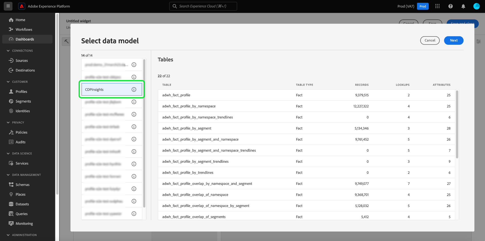

# 표준 대시보드

Adobe Experience Platform 대시보드를 사용하여 대시보드 기능을 통해 신속하게 통찰력을 얻고 시각화를 사용자 정의할 수 있습니다. 이 기능을 사용하여 맞춤형 위젯을 만들고, 추가하고, 편집하여 조직과 관련된 주요 지표를 시각화할 수 있는 사용자 정의 대시보드를 작성하고 관리합니다.

<!-- Getting started / permissions section commented out for Beta. This will be necessary after GA only

## Getting started

To view dashboards in Adobe Experience Platform you must have the appropriate permissions enabled. Please read the [dashboards permissions documentation](./permissions.md#available-permissions) to learn how to grant users the ability to view, edit, and update Experience Platform dashboards using Adobe Admin Console. If you do not have administrator privileges for your organization, contact your product administrator to obtain the required permissions. -->

## 사용자 지정 대시보드 만들기

사용자 지정 대시보드를 만들려면 먼저 대시보드 인벤토리로 이동합니다. Experience Platform UI의 왼쪽 탐색에서 **[!UICONTROL 대시보드]**&#x200B;를 선택한 다음 **[!UICONTROL 대시보드 만들기]**&#x200B;를 선택합니다.

사용자 정의 대시보드를 추가하기 전에 대시보드 인벤토리가 비어 있고 &quot;대시보드를 찾을 수 없음&quot;이 표시됩니다. 메시지. 대시보드가 생성되면 모든 대시보드가 대시보드 인벤토리에 나열됩니다.

<!-- >[!NOTE]
>
>To edit an existing dashboard, select the dashboard name from the inventory list followed by the pencil icon ()
>{width="100" zoomable="yes"} -->

[!UICONTROL 대시보드 만들기] 대화 상자가 나타납니다. 만들려는 위젯 컬렉션에 대해 사용자에게 친숙한 설명 이름을 입력하고 **[!UICONTROL 저장]**&#x200B;을 선택합니다.

Data Distiller SKU를 구매한 사용자에게는 사용자 지정 SQL 쿼리를 사용하여 인사이트를 만들 수 있는 옵션이 있습니다. 이 워크플로우에 대한 지침은 [query pro 모드 개요](./sql-insights-query-pro-mode/overview.md)를 참조하십시오.

새로 생성된 빈 대시보드가 뷰의 왼쪽 상단 모서리에 선택한 이름과 함께 나타납니다.

## 위젯 만들기 {#create-widget}

>[!CONTEXTUALHELP]
>id="platform_dashboards_udd_maxwidgets"
>title="최대 위젯 수"
>abstract="대시보드 서비스는 최대 10개의 위젯을 지원합니다. 10개의 위젯을 대시보드에 추가하면 [!UICONTROL 새 위젯 추가] 옵션이 비활성화되어 회색으로 표시됩니다."

새 대시보드 보기에서 **[!UICONTROL 새 위젯 추가]**&#x200B;를 선택하여 위젯 만들기 프로세스를 시작합니다.

>[!IMPORTANT]
>
>각 대시보드는 최대 10개의 위젯을 지원합니다. 10개의 위젯을 대시보드에 추가하면 [!UICONTROL 새 위젯 추가] 옵션이 비활성화되어 회색으로 표시됩니다.

### 위젯 작성기

위젯 작성기 작업 영역이 나타납니다. 그런 다음 **[!UICONTROL 데이터 선택]**&#x200B;을 선택하여 위젯에 특성을 추가할 데이터 모델을 선택합니다.

#### 데이터 모델 선택 {#select-data-model}

[!UICONTROL 데이터 모델 선택] 대화 상자가 나타납니다. 사용 가능한 모든 테이블의 미리보기 목록을 표시하려면 왼쪽 열에서 데이터 모델을 선택합니다. Real-Time Customer Data Platform에 대해 미리 구성된 데이터 모델의 이름은 [!UICONTROL CDPInsights]입니다.

>[!TIP]
>
>정보 아이콘() 데이터 레일에 표시할 시간이 너무 긴 경우 전체 데이터 모델 이름을 볼 수 있습니다.

미리보기 목록은 데이터 모델에 포함된 테이블에 대한 세부 정보를 제공합니다. 아래 표에는 열 필드와 해당 잠재적 값에 대한 설명이 나와 있습니다.

| 열 필드 | 설명 |
|---|---|
| [!UICONTROL Title] | 테이블 이름. |
| [!UICONTROL 테이블 형식] | 테이블 유형. 가능한 형식은 `fact`, `dimension` 및 `none`입니다. |
| [!UICONTROL 레코드] | 선택한 테이블과 연결된 레코드 수입니다. |
| [!UICONTROL 조회] | 선택한 테이블에 연결된 테이블 수입니다. |
| [!UICONTROL 특성] | 선택한 테이블에 대한 속성의 수입니다. |

**[!UICONTROL 다음]**&#x200B;을(를) 선택하여 데이터 모델 선택을 확인합니다. 다음 보기는 왼쪽 레일에 사용 가능한 테이블 목록을 표시합니다. 선택한 테이블에 포함된 데이터에 대한 포괄적인 분류를 보려면 테이블을 선택합니다.

### 위젯 채우기 {#populate-widget}

[!UICONTROL 미리 보기] 패널에 [!UICONTROL 샘플 레코드] 및 [!UICONTROL 특성]에 대한 탭이 있습니다. [!UICONTROL 샘플 레코드] 탭은 테이블 보기에서 선택한 테이블의 레코드 하위 집합을 제공합니다. [!UICONTROL 특성] 탭은 선택한 테이블과 연결된 모든 특성에 대한 특성 이름, 데이터 형식 및 원본 테이블을 제공합니다.

왼쪽 레일에서 사용할 수 있는 목록에서 테이블을 선택하여 위젯에 데이터를 제공하고 **[!UICONTROL 선택]**&#x200B;을 선택하여 위젯 작성기로 돌아갑니다.

이제 위젯 작성기가 선택한 테이블의 데이터로 채워집니다.

데이터 모델과 현재 선택한 테이블이 왼쪽 레일의 맨 위에 표시되고 위젯을 만드는 데 사용할 수 있는 특성이 [!UICONTROL 특성] 열에 나열됩니다. 목록을 스크롤하는 대신 검색 창을 사용하여 특성을 찾거나 연필 아이콘()을(를) 왼쪽 레일에 둡니다.

#### 속성 추가 및 필터링 {#add-and-filter-attributes}

추가 아이콘() 속성 이름 옆의 위젯에 속성을 추가합니다. 표시되는 드롭다운 메뉴를 사용하여 속성을 위젯의 X축, Y축, 색상 또는 필터 중 하나로 추가할 수 있습니다. [!UICONTROL Color] 특성을 사용하면 색상을 기준으로 X축 및 Y축 표시 결과를 구분할 수 있습니다. 이렇게 하려면 세 번째 속성의 구성에 따라 결과를 다른 색상으로 분할합니다.

>[!TIP]
>
>X축과 Y축의 배열을 전환하려면 위쪽 및 아래쪽 화살표 아이콘()을(를) 사용하여 배열을 전환합니다.

위젯의 그래프 또는 차트 유형을 변경하려면 [!UICONTROL 표시] 드롭다운을 선택하고 사용 가능한 옵션 중에서 선택합니다. 옵션에는 막대, 점, 틱, 선 또는 영역이 포함됩니다. 선택하면 위젯의 현재 설정에 대한 미리보기 시각화가 생성됩니다.

속성을 필터로 추가하여 위젯에서 포함하거나 제외할 값을 선택할 수 있습니다. 특성 목록에서 필터를 추가하면 해당 확인란을 사용하여 값을 선택하거나 선택 취소할 수 있는 [!UICONTROL 필터] 대화 상자가 나타납니다.

#### 내역 데이터 필터링 {#filter-historical-data}

위젯에서 생성된 인사이트에서 내역 데이터를 필터링하려면 `date_key` 특성을 필터로 추가하고 **[!UICONTROL 최근 날짜]**, **[!UICONTROL 적용]**&#x200B;을 선택합니다. 이 필터는 인사이트를 도출하는 데 사용되는 데이터를 최신 시스템 스냅샷에서 가져옵니다.

![필터: date_key] 대화 상자에 [!UICONTROL 최근 날짜] 및 [!UICONTROL 적용]이 강조 표시되어 있습니다.(./images/standard-dashboards/recent-date.png)

또는 사용자 지정 기간을 만들어 데이터를 필터링 기준으로 사용할 수 있습니다. 사용 가능한 날짜 목록으로 대화 상자를 확장하려면 **[!UICONTROL 날짜 선택]**&#x200B;을 선택하세요. **[!UICONTROL 모두 선택]** 확인란을 사용하여 사용 가능한 모든 옵션을 활성화하거나 비활성화하거나 각 날짜의 확인란을 개별적으로 선택하십시오. 마지막으로 **[!UICONTROL 적용]**&#x200B;을 선택하여 선택 항목을 확인합니다.

>[!NOTE]
>
>`date_key` 특성이 이미 필터로 추가된 경우 생략 부호를 선택한 후 드롭다운 옵션에서 **[!UICONTROL 편집]**&#x200B;을(를) 선택하여 필터 기간을 변경합니다.

![일별 확인란이 있는 [!UICONTROL 필터: date_key] 대화 상자를 선택하고 선택하지 않습니다.](./images/standard-dashboards/select-dates.png)

### 위젯 속성

속성 아이콘()을(를) 오른쪽 레일에서 클릭하여 속성 패널을 엽니다. [!UICONTROL 속성] 패널에서 [!UICONTROL 위젯 제목] 텍스트 필드에 위젯 이름을 입력합니다.

위젯 속성 패널에서 위젯의 여러 측면을 편집할 수 있습니다. 위젯 범례의 위치를 편집할 수 있는 완전한 제어 권한이 있습니다. 범례를 이동하려면 [!UICONTROL 범례 배치] 드롭다운을 선택하고 사용 가능한 옵션 목록에서 원하는 위치를 선택합니다. [!UICONTROL 범례 제목] 텍스트 필드 또는 [!UICONTROL 축 레이블] 텍스트 필드에 각각 새 이름을 입력하여 범례와 연결된 레이블 이름을 X축 또는 Y축으로 바꿀 수도 있습니다.

#### 위젯 저장 {#save-widget}

위젯 작성기에 저장하면 위젯이 대시보드에 로컬로 저장됩니다. 작업을 저장하고 나중에 다시 시작하려면 **[!UICONTROL 저장]**&#x200B;을 선택하세요. 위젯 이름 아래에 있는 확인 표시 아이콘은 위젯이 저장되었음을 나타냅니다. 또는 위젯에 만족하면 **[!UICONTROL 저장 및 닫기]**&#x200B;를 선택하여 대시보드에 액세스할 수 있는 다른 모든 사용자가 위젯을 사용할 수 있도록 합니다. 작업을 포기하고 사용자 지정 대시보드로 돌아가려면 **[!UICONTROL 취소]**&#x200B;를 선택하십시오.

>[!TIP]
>
>속성 아이콘()을(를) 만들 때 자세히 확인할 수 있습니다. 표시되는 대화 상자에서 대시보드 이름을 변경할 수 있습니다.

이 작업 영역에 있는 동안 위젯을 다시 정렬하고 크기를 조정할 수 있습니다. 대시보드 이름과 구성된 레이아웃을 유지하려면 **[!UICONTROL 저장]**&#x200B;을(를) 선택하십시오.

Adobe Real-Time Customer Data Platform 인사이트 대시보드에 대한 각 쿼리에 효율적으로 실행할 수 있는 리소스가 충분히 있는지 확인하기 위해 API는 각 쿼리에 동시 슬롯을 할당하여 리소스 사용을 추적합니다. 시스템은 최대 4개의 동시 쿼리를 처리할 수 있으므로 주어진 시간에 4개의 동시 쿼리 슬롯을 사용할 수 있습니다. 쿼리는 동시성 슬롯을 기반으로 대기열에 추가된 다음 충분한 동시성 슬롯을 사용할 수 있을 때까지 대기합니다.

### 위젯 편집, 복제 또는 삭제 {#duplicate}

위젯을 만들면 사용자 정의 대시보드에서 전체 위젯을 편집, 복제 또는 삭제할 수 있습니다.

>[!TIP]
>
>기존 사용자 정의 대시보드 간에 전환하려면 왼쪽 탐색 막대에서 대시보드 를 선택한 다음 인벤토리 목록에서 대시보드 이름을 선택합니다.

연필 아이콘()을(를) 클릭하여 편집 모드로 전환합니다.

그런 다음 편집, 복사 또는 삭제하려는 위젯의 오른쪽 상단에 있는 줄임표를 선택합니다. 드롭다운 메뉴에서 적절한 작업을 선택합니다.

>[!NOTE]
>
>복제를 통해 처음부터 시작하지 않고도 insight의 속성을 사용자 정의하여 고유한 위젯을 만들 수 있습니다. 위젯을 복제하면 사용자 정의 대시보드에 표시됩니다. 그런 다음 새 위젯의 생략 부호를 선택한 다음 **[!UICONTROL 편집]**&#x200B;을 선택하여 insight을 사용자 지정할 수 있습니다.

## 다음 단계 및 추가 리소스

이 문서를 읽으면 사용자 정의 대시보드를 만드는 방법과 해당 대시보드에 대한 사용자 정의 위젯을 만들고, 편집하고, 업데이트하는 방법을 더 잘 이해할 수 있습니다.

[프로필](./guides/profiles.md#standard-widgets), [세그먼트](./guides/audiences.md#standard-widgets) 및 [대상](./guides/destinations.md#standard-widgets) 대시보드에 대해 사용 가능한 사전 구성된 지표 및 시각화를 검색하려면 해당 설명서에서 표준 위젯 목록을 참조하십시오.

Experience Platform의 대시보드에 대한 이해를 강화하려면 다음 비디오를 시청하십시오.

>[!VIDEO](https://video.tv.adobe.com/v/3409637?quality=12&learn=on)
