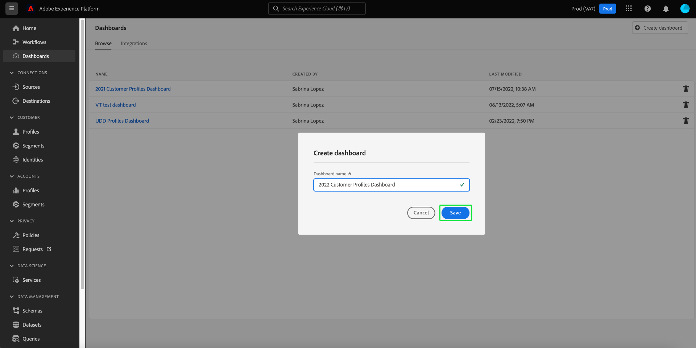
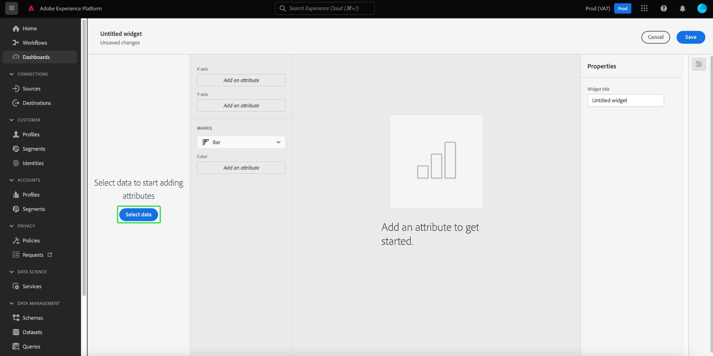

# 사용자 정의 대시보드

Adobe Experience Platform 대시보드는 사용자 정의 대시보드 기능을 통해 통찰력을 제공하고 시각화를 사용자 지정하는 데 도움이 됩니다. 이 기능을 사용하면 맞춤형 위젯을 만들고, 추가하고, 편집하여 조직과 관련된 주요 지표를 시각화할 수 있는 사용자 지정 대시보드를 만들고 관리할 수 있습니다.

<!-- Getting started / permissions section commented out for Beta. This will be necessary after GA only

## Getting started

To view dashboards in Adobe Experience Platform you must have the appropriate permissions enabled. Please read the [dashboards permissions documentation](./permissions.md#available-permissions) to learn how to grant users the ability to view, edit, and update Experience Platform dashboards using Adobe Admin Console. If you do not have administrator privileges for your organization, contact your product administrator to obtain the required permissions. -->

## 사용자 지정 대시보드 만들기

사용자 지정 대시보드를 만들려면 먼저 대시보드 인벤토리로 이동합니다. 선택 **[!UICONTROL 대시보드]** 플랫폼 UI의 왼쪽 탐색 영역에서 다음을 수행합니다 **[!UICONTROL 대시보드 만들기]**.

사용자 지정 대시보드를 추가하기 전에 대시보드 인벤토리가 비어 있고 &quot;대시보드를 찾을 수 없음&quot;을 표시합니다. 메시지를 표시합니다. 만들어지면 사용자 정의 대시보드가 모두 대시보드 인벤토리에 나열됩니다.

다음 [!UICONTROL 대시보드 만들기] 대화 상자가 나타납니다. 만들려는 위젯 컬렉션에 대해 사용하기 쉽고 설명적인 이름을 입력하고 을 선택합니다 **[!UICONTROL 저장]**.

새로 만든 빈 대시보드가 보기의 왼쪽 상단 모서리에 선택한 이름과 함께 나타납니다.

## 위젯 만들기 {#create-widget}

>[!CONTEXTUALHELP]
>id="platform_dashboards_udd_maxwidgets"
>title="최대 위젯 수"
>abstract="사용자 정의 대시보드는 최대 10개의 위젯을 지원합니다. 10개의 위젯을 대시보드에 추가한 후에는 [!UICONTROL 새 위젯 추가] 옵션이 비활성화되어 회색으로 표시됩니다."

새 대시보드 보기에서 를 선택합니다 **[!UICONTROL 새 위젯 추가]** 위젯 생성 프로세스를 시작합니다.

>[!IMPORTANT]
>
>사용자 정의 대시보드는 최대 10개의 위젯을 지원합니다. 10개의 위젯을 대시보드에 추가한 후에는 [!UICONTROL 새 위젯 추가] 옵션이 비활성화되어 회색으로 표시됩니다.

### 위젯 작성기

위젯 작성기 작업 영역이 나타납니다. 다음 을 선택합니다. **[!UICONTROL 데이터 선택]** 위젯에 속성을 추가할 데이터 모델을 선택합니다.

다음 [!UICONTROL 데이터 선택] 대화 상자가 나타납니다. 사용 가능한 모든 테이블의 미리 보기 목록을 표시하려면 왼쪽 열에서 데이터 모델을 선택합니다.

>[!NOTE]
>
>사용자 정의 대시보드는 현재 프로필 데이터 모델만 지원합니다. 더 많은 옵션이 지원됩니다.

미리 보기 목록에서는 데이터 모델에 포함된 테이블에 대한 세부 정보를 제공합니다. 아래 표는 열 필드와 열 필드의 잠재적 값에 대한 설명을 제공합니다.

| 열 필드 | 설명 |
|---|---|
| [!UICONTROL Title] | 테이블의 이름입니다. |
| [!UICONTROL 테이블 유형] | 표의 유형입니다. 가능한 유형은 다음과 같습니다. `fact`, `dimension`, 및 `none`. |
| [!UICONTROL 조회] | 선택한 테이블에 연결된 테이블 수입니다. |

선택 **[!UICONTROL 다음]** 데이터 모델 선택을 확인합니다. 다음 보기는 왼쪽 레일에 있는 사용 가능한 테이블 목록을 표시합니다. 선택한 테이블에 포함된 데이터의 포괄적인 분류를 보려면 표를 선택합니다.

다음 [!UICONTROL 미리 보기] 패널에 탭 포함 [!UICONTROL 샘플 레코드] 및 [!UICONTROL 속성]. 다음 [!UICONTROL 샘플 레코드] 탭에서는 테이블 보기에서 선택한 테이블의 레코드 하위 집합을 제공합니다. 다음 [!UICONTROL 속성] 탭에는 선택한 테이블과 연관된 모든 속성에 대한 속성 이름, 데이터 유형 및 소스 테이블이 제공됩니다.

왼쪽 레일에서 사용할 수 있는 목록에서 표를 선택하여 위젯에 대한 데이터를 제공하고 을 선택합니다 **[!UICONTROL 선택]** 위젯 작성기로 돌아갑니다.

이제 위젯 작성기가 선택한 테이블의 데이터로 채워집니다.

데이터 모델 및 현재 선택한 테이블이 왼쪽 레일 상단에 표시되고 위젯을 만드는 데 사용할 수 있는 속성이 속성 열에 나열됩니다.

>[!TIP]
>
>연필 아이콘()을 클릭하여 제품에서 사용할 수 있습니다.

추가 아이콘()을 선택합니다./images/user-defined-dashboards/add-icon.png) 속성 이름 옆에 속성을 추가하여 X 또는 Y 축에 속성을 추가합니다.

다음으로, [!UICONTROL 표시] 드롭다운을 사용하여 위젯의 현재 설정에 대한 미리 보기 시각화를 생성합니다. 에서 [!UICONTROL 속성] 화면 오른쪽의 레일에서 위젯의 이름을 [!UICONTROL 위젯 제목] 텍스트 필드.

위젯에 만족하면 을 선택합니다 **[!UICONTROL 저장]**. 위젯 이름 아래에 있는 확인 표시 아이콘은 위젯이 저장되었음을 나타냅니다.

>[!NOTE]
>
>위젯 작성기에 저장하면 위젯이 대시보드에 로컬로 저장됩니다. 대시보드를 저장하지 않고 대시보드 편집기를 종료하면 위젯이 대시보드에 저장되지 않습니다.

선택 **[!UICONTROL 취소]** 을 클릭하여 사용자 지정 대시보드로 돌아갑니다.

>[!TIP]
>
>대시보드 이름 옆에 있는 설정 아이콘을 선택하여 만든 내용에 대한 세부 사항을 확인합니다. 표시되는 대화 상자에서 대시보드 이름을 변경할 수 있습니다.

이 작업 공간에서 위젯을 다시 정렬하고 크기를 조정할 수 있습니다. 선택 **[!UICONTROL 저장]** 대시보드 이름 및 구성된 레이아웃을 보존하기 위해 을 선택합니다.

## 다음 단계

이 문서를 읽은 후에는 사용자 지정 대시보드를 만드는 방법과 해당 대시보드에 대한 사용자 지정 위젯을 만들고, 편집하고 업데이트하는 방법을 더 잘 이해할 수 있습니다.

에 대해 사용 가능한 사전 구성된 지표 및 시각화를 검색하려면 [프로필](./guides/profiles.md#standard-widgets), [세그먼트](./guides/segments.md#standard-widgets), 및 [대상](./guides/destinations.md#standard-widgets) 대시보드 각각의 설명서에서 표준 위젯 목록을 참조하십시오.
