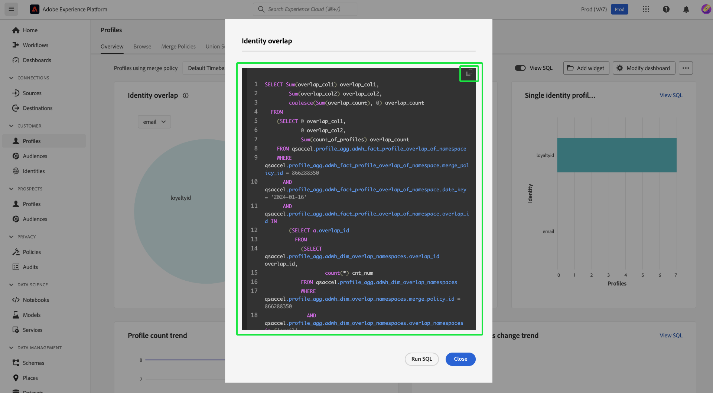

# 인사이트 SQL 보기

사용 [!UICONTROL SQL 보기] 프로필, 대상자, 대상 및 맞춤화된 인사이트 뒤에 있는 SQL을 보고 쿼리 편집기를 통해 요청 시 쿼리를 실행하는 기능입니다. 40개 이상의 기존 인사이트의 SQL에서 영감을 얻어 비즈니스 요구 사항에 따라 플랫폼 데이터에서 고유한 인사이트를 도출하는 새로운 쿼리를 만들 수 있습니다.

## 대시보드 개요로 이동합니다. {#navigate-to-overview}

선택한 대시보드를 열려면 다음 중 하나를 선택합니다 **[!UICONTROL 프로필]**, **[!UICONTROL 대상]**, 또는 **[!UICONTROL 대상]** 왼쪽 탐색에서. 다음 선택 **[!UICONTROL 개요]** 작업공간이 자동으로 표시되지 않는 경우 탭 옵션에서 선택합니다.

또는 을 선택합니다. **[!UICONTROL 대시보드]** 왼쪽 탐색 뒤에 사용자 지정 대시보드의 이름이 옵니다. 사용자 정의 대시보드의 개요가 나타납니다.

![을 사용하는 Experience Platform UI [!UICONTROL 프로필], [!UICONTROL 대상], [!UICONTROL 대상], 및 [!UICONTROL 대시보드] 강조 표시됨.](./images/view-sql/dashboard-navigation.png)

## SQL 보기 토글 {#toggle}

프로필, 대상, 대상 및 사용자 정의 대시보드의 개요에서 토글을 사용하여 기능을 활성화하거나 비활성화할 수 있습니다.

>[!NOTE]
>
>을(를) 활성화하면 [!UICONTROL SQL 보기] 전환 기능을 사용하지 않도록 설정할 때까지 글로벌 및 위젯 수준 필터를 변경할 수 없습니다.

![다음 [!UICONTROL SQL 보기] 강조 표시된 토글.](./images/view-sql/view-sql-toggle.png)

표시할 토글 활성화 [!UICONTROL SQL 보기] 각 개별 인사이트에 대한 텍스트입니다.

![을 통한 통찰력 [!UICONTROL SQL 보기] 강조 표시됨.](./images/view-sql/insight-view-sql.png)

선택 **[!UICONTROL SQL 보기]** 위젯의 SQL이 포함된 대화 상자를 엽니다.

## SQL 대화 상자 {#sql-dialog}

통찰력의 제목과 이를 생성하는 SQL을 포함하는 대화 상자가 나타납니다.

>[!TIP]
>
>복사 아이콘( )을 선택하여 전체 SQL 문을 클립보드에 복사할 수 있습니다.)을 클릭하여 제품에서 사용할 수 있습니다.

선택 **[!UICONTROL SQL 실행]** 쿼리로 쿼리 편집기를 열려면 미리 채워집니다.

![을 사용한 인사이트 대화 상자 [!UICONTROL SQL 실행] 강조 표시됨.](./images/view-sql/run-sql.png)

## 기존 SQL 편집 {#edit-sql}

쿼리 편집기가 나타납니다. 이제 보고 요구 사항에 더 적합한 방식으로 명령문을 편집하고 플랫폼 데이터를 쿼리할 수 있습니다. 새 쿼리 템플릿을 적절한 이름으로 저장합니다.

## 다음 단계

이 문서를 읽고 나면 이제 표준 대시보드 또는 사용자 정의 대시보드 내의 통찰력을 위해 SQL에 액세스하는 방법을 이해할 수 있습니다. 아직 읽지 않았다면 다음을 읽는 것이 좋습니다. [Real-time Customer Data Platform 통찰력 데이터 모델 문서](./cdp-insights-data-model.md). 이 문서에는 마케팅 및 KPI 요구 사항에 맞게 Real-Time CDP 보고서의 SQL 템플릿을 사용자 지정하는 방법에 대한 통찰력이 포함되어 있습니다.
