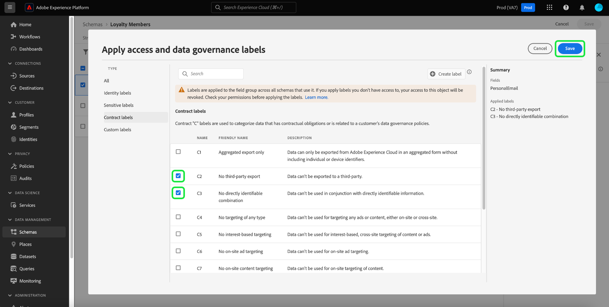

# 데이터 거버넌스 전체 안내서

Adobe Experience Platform의 특정 데이터 세트 및 필드에서 수행할 수 있는 마케팅 작업을 제어하려면 다음을 설정해야 합니다.

1. 사용을 제한할 스키마 필드 또는 전체 데이터 세트에 [레이블을 적용](#labels)합니다.
1. 특정 마케팅 작업에 사용할 수 있는 레이블이 지정된 데이터의 종류를 결정하는 [데이터 거버넌스 정책을 구성하고 사용](#policy)합니다.
1. [대상에 마케팅 액션을 적용](#destinations)하여 해당 대상에 전송된 데이터에 적용되는 정책을 지정합니다.

레이블, 거버넌스 정책 및 마케팅 작업 구성을 마치면 [정책 시행을 테스트하고](#test)예상대로 작동하는지 확인할 수 있습니다.

이 안내서에서는 Experience Platform UI에서 데이터 거버넌스 정책을 구성하고 적용하는 전체 프로세스를 안내합니다. 이 안내서에서 사용되는 기능에 대한 자세한 내용은 다음 항목의 개요 설명서를 참조하십시오.

* [Adobe Experience Platform 데이터 거버넌스](./home.md)
* [데이터 사용 레이블](./labels/overview.md)
* [데이터 사용 정책](./policies/overview.md)
* [정책 시행](./enforcement/overview.md)

>[!NOTE]
>
>이 안내서는 Experience Platform에서 데이터가 사용되거나 활성화되는 방법에 대한 정책을 설정하고 적용하는 방법에 중점을 둡니다. 조직 내의 특정 Experience Platform 사용자에 대해 데이터 자체로 **액세스**&#x200B;을(를) 제한하려는 경우 대신 [특성 기반 액세스 제어](../access-control/abac/end-to-end-guide.md)에 대한 전체 안내서를 참조하십시오. 속성 기반 액세스 제어도 레이블과 정책을 사용하지만, 데이터 거버넌스와는 다른 사용 사례에 사용됩니다.

## 레이블 적용 {#labels}

>[!IMPORTANT]
>
>더 이상 데이터 세트 수준의 개별 필드에 레이블을 적용할 수 없습니다. 이 워크플로우는 더 이상 사용되지 않으며, 대신 스키마 수준에서 레이블을 적용합니다. 그러나 전체 데이터 세트에 레이블을 지정할 수는 있습니다. 개별 데이터 세트 필드에 이전에 적용된 모든 레이블은 2024년 5월 31일까지 Experience Platform UI를 통해 계속 지원됩니다. 모든 스키마에서 레이블이 일관되도록 하려면 데이터 세트 수준의 필드에 이전에 첨부된 모든 레이블을 향후 연도에 따라 스키마 수준으로 마이그레이션해야 합니다. 이 작업을 수행하는 방법에 대한 지침은 [이전에 적용된 레이블 마이그레이션](#migrate-labels)에 대한 섹션을 참조하십시오.

[스키마에 레이블을 적용](#schema-labels)하여 해당 스키마를 기반으로 하는 모든 데이터 세트가 동일한 레이블을 상속하도록 할 수 있습니다. 이를 통해 데이터 거버넌스, 동의 및 액세스 제어에 대한 레이블을 한 곳에서 관리할 수 있습니다. 스키마 수준에서 데이터 사용 제한을 적용하여 이 효과는 해당 스키마를 기반으로 하는 모든 데이터 세트로 다운스트림을 전파합니다. 스키마 필드 수준에서 적용된 레이블은 데이터 거버넌스 사용 사례를 지원하며, [!UICONTROL 필드 이름] 열 아래의 데이터 세트 작업 영역 [!UICONTROL 데이터 거버넌스] 탭에서 읽기 전용 레이블로 검색할 수 있습니다.

데이터 사용 제한을 적용할 특정 데이터 세트가 있는 경우 [레이블을 해당 데이터 세트 또는 해당 데이터 세트 내의 특정 필드에 직접 적용](#dataset-labels)할 수 있습니다.

또는 [스키마에 레이블을 적용](#schema-labels)하여 해당 스키마를 기반으로 하는 모든 데이터 세트가 동일한 레이블을 상속하도록 할 수 있습니다.

>[!NOTE]
>
>다양한 데이터 사용 레이블 및 해당 용도에 대한 자세한 내용은 [데이터 사용 레이블 참조](./labels/reference.md)를 참조하십시오. 사용 가능한 핵심 레이블이 원하는 사용 사례를 모두 다루지 않는 경우 [사용자 지정 레이블을 정의](./labels/user-guide.md#manage-custom-labels)할 수도 있습니다.

### 전체 데이터 세트에 레이블 적용 {#dataset-labels}

왼쪽 탐색에서 **[!UICONTROL 데이터 세트]**&#x200B;를 선택한 다음 레이블을 적용할 데이터 세트의 이름을 선택합니다. 선택적으로 검색 필드를 사용하여 표시된 데이터 세트 목록의 범위를 좁힐 수 있습니다.

데이터 세트에 대한 세부 사항 보기가 나타납니다. 데이터 집합의 필드 목록과 이미 적용된 레이블을 보려면 **[!UICONTROL 데이터 거버넌스]** 탭을 선택하십시오. 연필 아이콘을 선택하여 데이터 세트 레이블을 편집합니다.

[!UICONTROL 거버넌스 레이블 편집] 대화 상자가 나타납니다. 적절한 거버넌스 레이블을 선택하고 **[!UICONTROL 저장]**&#x200B;을(를) 선택합니다.

![레이블 확인란과 [저장]이 강조 표시된 거버넌스 레이블 편집 대화 상자.](./images/e2e/edit-dataset-governance-labels.png)

### 스키마에 레이블 적용 {#schema-labels}

왼쪽 탐색에서 **[!UICONTROL 스키마]**&#x200B;을(를) 선택한 다음 목록에서 레이블을 추가할 스키마를 선택합니다.

>[!TIP]
>
>특정 데이터 세트에 적용되는 스키마를 모를 경우 왼쪽 탐색에서 **[!UICONTROL 데이터 세트]**&#x200B;를 선택한 다음 원하는 데이터 세트에 대한 **[!UICONTROL 스키마]** 열 아래의 링크를 선택하십시오. 스키마 편집기에서 스키마를 열 수 있도록 표시되는 팝오버에서 스키마 이름을 선택합니다.
>
>

스키마 구조가 스키마 편집기에 나타납니다. 여기에서 **[!UICONTROL 레이블]** 탭을 선택하여 스키마 필드와 여기에 이미 적용된 레이블의 목록 보기를 표시합니다. 레이블을 추가할 필드 옆의 확인란을 선택한 다음 오른쪽 레일에서 **[!UICONTROL 액세스 및 데이터 거버넌스 레이블 적용]**&#x200B;을 선택합니다.

>[!NOTE]
>
>스키마의 모든 필드에 레이블을 추가하려면 맨 위 행에서 연필 아이콘을 선택합니다.
>
>

[!UICONTROL 액세스 및 데이터 거버넌스 레이블 적용] 대화 상자가 나타납니다. 선택한 스키마 필드에 적용할 레이블을 선택합니다. 완료되면 **[!UICONTROL 저장]**&#x200B;을 선택합니다.

위의 단계를 계속 수행하여 필요에 따라 다른 필드(또는 다른 스키마)에 레이블을 적용합니다. 완료되면 [데이터 거버넌스 정책 사용](#policy)의 다음 단계를 계속할 수 있습니다.

### 이전에 데이터 세트 수준에서 적용된 레이블 마이그레이션 {#migrate-labels}

왼쪽 탐색에서 **[!UICONTROL 데이터 집합]**&#x200B;을(를) 선택한 다음 레이블을 마이그레이션할 데이터 집합의 이름을 선택하십시오. 선택적으로 검색 필드를 사용하여 표시된 데이터 세트 목록의 범위를 좁힐 수 있습니다.

데이터 세트에 대한 세부 사항 보기가 나타납니다. 데이터 집합의 필드 목록과 이미 적용된 레이블을 보려면 **[!UICONTROL 데이터 거버넌스]** 탭을 선택하십시오. 필드에서 제거할 레이블 옆에 있는 취소 아이콘을 선택합니다. 확인 대화 상자가 나타나면 [!UICONTROL 레이블 제거]를 선택하여 선택 항목을 확인하십시오.

데이터 세트 필드에서 레이블을 제거한 후 스키마 편집기로 이동하여 스키마에 레이블을 추가합니다. 이 작업을 수행하는 방법에 대한 지침은 [스키마에 레이블 적용 섹션](#schema-labels)에서 확인할 수 있습니다.

>[!TIP]
>
>오른쪽 레일에서 스키마 이름을 선택한 다음 대화 상자에서 해당 스키마로 이동하는 링크를 선택할 수 있습니다.
>

필요한 레이블을 마이그레이션한 후 올바른 [데이터 거버넌스 정책을 사용](#policy)했는지 확인하십시오.

## 데이터 거버넌스 정책 활성화 {#policy}

스키마 및/또는 데이터 세트에 레이블을 적용한 후에는 특정 레이블을 사용할 수 있는 마케팅 작업을 제한하는 데이터 거버넌스 정책을 만들 수 있습니다.

왼쪽 탐색에서 **[!UICONTROL 정책]**&#x200B;을(를) 선택하여 Adobe에서 정의한 핵심 정책과 조직에서 이전에 만든 사용자 지정 정책 목록을 확인합니다.

각 코어 레이블에는 연결된 코어 정책이 있으며, 이 정책을 활성화하면 해당 레이블이 포함된 모든 데이터에 적절한 활성화 제한을 적용합니다. 핵심 정책을 사용하려면 목록에서 해당 정책을 선택한 다음 **[!UICONTROL 정책 상태]** 전환을 선택하여 **[!UICONTROL 활성화됨]**(으)로 전환하십시오.

사용 가능한 핵심 정책이 모든 사용 사례를 다루지 않는 경우(예: 조직에서 정의한 사용자 정의 레이블을 사용하는 경우) 대신 사용자 정의 정책을 정의할 수 있습니다. **[!UICONTROL 정책]** 작업 영역에서 **[!UICONTROL 정책 만들기]**&#x200B;를 선택합니다.

![UI에서 [!UICONTROL 정책 만들기] 단추를 표시하는 이미지](./images/e2e/create-policy.png)

만들려는 정책 유형을 선택하라는 팝오버가 나타납니다. **[!UICONTROL 데이터 거버넌스 정책]**&#x200B;을 선택한 다음 **[!UICONTROL 계속]**&#x200B;을 선택합니다.

![선택한 [!UICONTROL 데이터 거버넌스 정책] 옵션을 보여 주는 이미지](./images/e2e/governance-policy.png)

다음 화면에서는 정책에 대해 **[!UICONTROL 이름]** 및 선택적 **[!UICONTROL 설명]**&#x200B;을 제공합니다. 아래 표에서 이 정책에서 확인할 레이블을 선택합니다. 즉, 다음 단계에서 지정하는 마케팅 작업에 정책이 사용되지 않도록 하는 레이블입니다.

여러 레이블을 선택하는 경우 오른쪽 레일의 옵션을 사용하여 정책이 사용 제한을 적용하기 위해 모든 레이블이 있어야 하는지 또는 레이블 중 하나만 있어야 하는지 여부를 결정할 수 있습니다. 완료되면 **[!UICONTROL 다음]**&#x200B;을 선택합니다.

다음 화면에서는 이 정책이 이전에 선택한 레이블의 사용을 제한하는 마케팅 작업을 선택합니다. 계속하려면 **[!UICONTROL 다음]**&#x200B;을 선택합니다.

마지막 화면에는 정책의 세부 사항과 해당 레이블을 제한하는 작업에 대한 요약이 표시됩니다. **[!UICONTROL 완료]**&#x200B;를 선택하여 정책을 만듭니다.

정책이 만들어졌지만 기본적으로 [!UICONTROL 사용 안 함]&#x200B;(으)로 설정되어 있습니다. 목록에서 정책을 선택하고 **[!UICONTROL 정책 상태]** 전환을 **[!UICONTROL 활성화됨]**(으)로 설정하여 정책을 사용하도록 설정합니다.

다음 단계로 이동하기 전에 위의 단계를 계속 수행하여 필요한 정책을 만들고 활성화하십시오.

## 대상에 대한 마케팅 작업 관리 {#destinations}

활성화된 정책이 대상에 활성화할 수 있는 데이터를 정확하게 결정하려면 해당 대상에 특정 마케팅 작업을 할당해야 합니다.

예를 들어 마케팅 작업 &quot;[!UICONTROL 서드파티로 내보내기]&quot;에 `C2` 레이블이 포함된 데이터를 사용할 수 없도록 하는 활성화된 정책을 고려해 보십시오. 대상으로 데이터를 활성화할 때 정책에서 대상에 있는 마케팅 작업이 무엇인지 확인합니다. &quot;[!UICONTROL 서드파티로 내보내기]&quot;가 있는 경우 `C2` 레이블이 있는 데이터를 활성화하려고 하면 정책 위반이 발생합니다. &quot;[!UICONTROL 서드파티로 내보내기]&quot;가 없으면 대상에 대해 정책이 적용되지 않으며 `C2` 레이블이 있는 데이터를 자유롭게 활성화할 수 있습니다.

[UI에서 대상을 연결](../destinations/ui/connect-destination.md)할 때 워크플로의 **[!UICONTROL 거버넌스]** 단계를 통해 이 대상에 적용되는 마케팅 작업을 선택할 수 있습니다. 그러면 궁극적으로 대상에 대해 적용되는 데이터 거버넌스 정책이 결정됩니다.

## 정책 적용 테스트 {#test}

데이터에 레이블을 지정하고, 데이터 거버넌스 정책을 활성화하고, 대상에 마케팅 작업을 할당하면 정책이 예상대로 적용되는지 여부를 테스트할 수 있습니다.

설정이 올바르게 설정된 경우 정책에 의해 제한된 데이터를 활성화하려고 하면 활성화가 자동으로 거부되고 위반 원인에 대한 자세한 데이터 계보 정보가 요약된 정책 위반 메시지가 나타납니다.

정책 위반 메시지를 해석하는 방법에 대한 자세한 내용은 [자동 정책 적용](./enforcement/auto-enforcement.md)에 대한 문서를 참조하십시오.

## 다음 단계

이 안내서에서는 활성화 워크플로에서 데이터 거버넌스 정책을 구성하고 적용하는 데 필요한 단계를 다룹니다. 이 안내서와 관련된 데이터 거버넌스 구성 요소에 대한 자세한 내용은 다음 설명서를 참조하십시오.

* [데이터 사용 레이블](./labels/overview.md)
* [데이터 사용 정책](./policies/overview.md)
* [정책 시행](./enforcement/overview.md)
