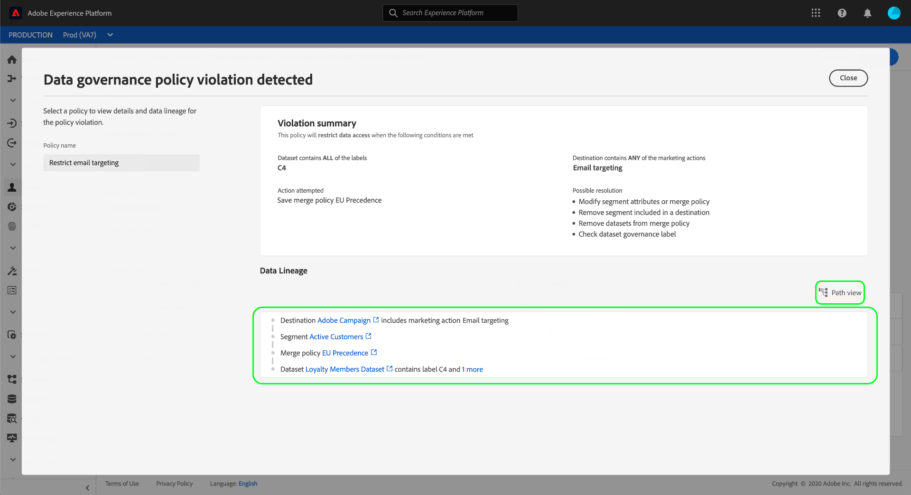

# 자동 정책 적용

데이터가 레이블이 지정되고 사용 정책이 정의되면 정책에 따라 데이터 사용 규정을 적용할 수 있습니다. 대상 세그먼트를 대상으로 활성화할 때, Adobe Experience Platform에서는 위반이 발생하면 사용 정책을 자동으로 적용합니다.

## 전제 조건

이 안내서에서는 자동 구현과 관련된 플랫폼 서비스를 제대로 이해하고 있어야 합니다. 이 안내서를 계속하기 전에 자세한 내용을 알아보려면 다음 설명서를 참조하십시오.

* [Adobe Experience Platform 데이터 거버넌스](../home.md):플랫폼이 레이블 및 정책을 사용하여 데이터 사용 규정을 적용하는 프레임워크입니다.
* [실시간 고객 프로필](../../profile/home.md):여러 소스에서 집계된 데이터를 기반으로 통합된 실시간 소비자 프로필을 제공합니다.
* [Adobe Experience Platform 세그멘테이션 서비스](../../segmentation/home.md):고객 행동 및 속성을  [!DNL Platform] 기반으로 고객 프로필에서 대상 세그먼트를 만드는 데 사용되는 내의 세그먼테이션 엔진입니다.
* [대상](../../destinations/home.md):대상은 크로스채널 마케팅 캠페인, 이메일 캠페인, 타겟팅 광고 등을 위해 플랫폼에서 데이터를 원활하게 활성화할 수 있도록 일반적으로 사용되는 애플리케이션과의 사전 구축된 통합입니다.

## 적용 흐름 {#flow}

다음 다이어그램은 정책 적용이 세그먼트 활성화의 데이터 흐름에 어떻게 통합되는지를 보여줍니다.

세그먼트가 처음 활성화되면 [!DNL Policy Service] 은 다음 요소를 기반으로 정책 위반을 확인합니다.

* 활성화할 세그먼트 내의 필드 및 데이터 세트에 적용된 데이터 사용 레이블입니다.
* 대상의 마케팅 목적입니다.

>[!NOTE]
>
>데이터 세트 내의 특정 필드에만 적용된 데이터 사용 레이블이 있는 경우(전체 데이터 세트가 아니라) 활성화 시 이러한 필드 수준 레이블의 적용은 다음 조건에서만 발생합니다.
>
>* 필드는 세그먼트 정의에 사용됩니다.
>* 필드는 대상 대상에 대한 예상 속성으로 구성됩니다.

## 데이터 계보 {#lineage}

데이터 연결은 플랫폼에서 정책을 실행하는 데 중요한 역할을 합니다. 일반적으로 데이터 계보는 데이터 집합의 원점과 시간이 지남에 따라 데이터 집합에 발생하는(또는 이동하는 위치)를 의미합니다.

[!DNL Data Governance] 컨텍스트에서 리니지를 사용하면 데이터 사용 레이블을 데이터 세트에서 데이터를 사용하는 다운스트림 서비스(예: 실시간 고객 프로필 및 대상)로 전달할 수 있습니다. 따라서 Platform을 통해 데이터 여정의 몇 가지 주요 지점에서 정책을 평가하고 적용할 수 있으며, 정책 위반이 발생한 이유에 대한 컨텍스트를 데이터 소비자에게 제공합니다.

Experience Platform에서 정책집행은 다음과 같은 계보를 염려한다.

1. 데이터는 플랫폼으로 수집되고 **데이터 세트**&#x200B;에 저장됩니다.
1. 고객 프로필은 **병합 정책**&#x200B;에 따라 데이터 조각을 병합하여 해당 데이터 세트에서 식별 및 구성됩니다.
1. 프로필 그룹은 공통 속성을 기반으로 **세그먼트**&#x200B;로 분할됩니다.
1. 세그먼트는 다운스트림 **대상**&#x200B;에 활성화됩니다.

위의 타임라인에 있는 각 스테이지는 아래 표에 요약된 대로 위반 중인 정책에 기여할 수 있는 엔터티를 나타냅니다.

| 데이터 계보 단계 | 정책 집행에서의 역할 |
| --- | --- |
| 데이터 세트 | 데이터 세트에는 전체 데이터 세트 또는 특정 필드에 사용할 수 있는 사용 사례를 정의하는 데이터 사용 레이블(데이터 세트 또는 필드 수준에서 적용됨)이 포함되어 있습니다. 정책이 제한하는 용도로 특정 레이블이 포함된 데이터 세트 또는 필드를 사용하는 경우 정책 위반이 발생합니다. |
| 병합 정책 | 병합 정책은 플랫폼이 여러 데이터 세트의 조각을 병합할 때 데이터에 우선 순위가 지정되는 방식을 결정하는 데 사용하는 규칙입니다. 레이블이 제한된 데이터 세트가 대상으로 활성화되도록 병합 정책이 구성된 경우 정책 위반이 발생합니다. 자세한 내용은 [병합 정책 개요](../../profile/merge-policies/overview.md)를 참조하십시오. |
| 세그먼트 | 세그먼트 규칙은 고객 프로필에서 포함해야 하는 속성을 정의합니다. 세그먼트 정의에 포함되는 필드에 따라 세그먼트는 해당 필드에 대해 적용된 사용 레이블을 상속합니다. 마케팅 사용 사례를 기반으로 대상 대상의 적용 가능한 정책에 의해 상속된 레이블이 제한된 세그먼트를 활성화하는 경우 정책 위반이 발생합니다. |
| 대상 | 대상을 설정할 때 마케팅 작업(경우에 따라 마케팅 사용 사례라고 함)을 정의할 수 있습니다. 이 사용 사례는 데이터 사용 정책에 정의된 마케팅 작업과 관련이 있습니다. 즉, 대상에 대해 정의하는 마케팅 사용 사례는 해당 대상에 적용할 수 있는 데이터 사용 정책을 결정합니다. 대상 대상의 적용 가능한 정책에 의해 사용 레이블이 제한된 세그먼트를 활성화하는 경우 정책 위반이 발생합니다. |

>[!IMPORTANT]
>
>일부 데이터 사용 정책은 AND 관계가 있는 두 개 이상의 레이블을 지정할 수 있습니다. 예를 들어, 레이블 `C1` AND `C2` 가 모두 있는 경우 정책이 마케팅 작업을 제한할 수 있지만, 이러한 레이블 중 하나만 있는 경우에는 동일한 작업을 제한하지 않습니다.
>
>자동 적용과 관련하여 데이터 거버넌스 프레임워크에서는 별도의 세그먼트를 대상에 활성화하는 것을 데이터 조합으로 간주하지 않습니다. 따라서 이러한 레이블이 별도의 세그먼트에 포함된 경우 `C1 AND C2` 정책 예는 **NOT**&#x200B;입니다. 대신, 이 정책은 활성화 시 두 레이블이 동일한 세그먼트에 있을 경우에만 적용됩니다.

정책 위반이 발생하면 UI에 표시되는 결과 메시지는 위반의 기여 데이터 계열을 탐색하여 문제를 해결하는 데 유용한 도구를 제공합니다. 자세한 내용은 다음 섹션에서 제공됩니다.

## 정책 위반 메시지 {#enforcement}

세그먼트를 활성화하려고 시도하는 동안 정책 위반이 발생하면(또는 [이미 활성화된 세그먼트](#policy-enforcement-for-activated-segments)에 대한 편집 작업을 수행할 수 없으며 하나 이상의 정책이 위반되었음을 나타내는 팝오버가 나타납니다. 위반이 트리거되면 데이터 사용 정책을 준수하도록 해당 구성 요소가 업데이트될 때까지 수정할 엔티티에 대해 **[!UICONTROL 저장]** 단추가 비활성화됩니다.

팝업 왼쪽 열에서 정책 위반을 선택하여 해당 위반에 대한 세부 정보를 표시합니다.

위반 메시지에 해당 정책을 위반하는 정책의 요약, 즉 해당 정책을 트리거한 특정 작업, 해당 문제에 대한 가능한 해결 방법 목록 등이 제공됩니다.

데이터 계보 그래프가 위반 요약 아래에 표시되어 정책 위반에 포함된 데이터 세트, 병합 정책, 세그먼트 및 대상을 시각화할 수 있습니다. 현재 변경 중인 엔티티는 그래프에 강조 표시되어 플로우의 어느 지점에서 위반이 발생하는지 나타냅니다. 그래프 내에서 엔티티 이름을 선택하여 해당 엔티티에 대한 세부 정보 페이지를 열 수 있습니다.

**[!UICONTROL 필터]** 아이콘()을 사용하여 표시된 엔티티를 카테고리별로 필터링할 수도 있습니다. 데이터를 표시하려면 두 개 이상의 카테고리를 선택해야 합니다.

데이터 계열을 목록으로 표시하려면 **[!UICONTROL 목록 보기]**&#x200B;를 선택합니다. 다시 시각적 그래프로 전환하려면 **[!UICONTROL 경로 보기]**&#x200B;를 선택합니다.

## 활성화된 세그먼트에 대한 정책 적용 {#policy-enforcement-for-activated-segments}

정책 적용은 세그먼트가 활성화된 후에도 세그먼트에 적용되므로 정책 위반을 초래할 세그먼트 또는 대상의 변경 사항을 제한합니다. [데이터 계보](#lineage)가 정책 집행에서 작동하는 방식으로 인해 다음 작업 중 하나가 잠재적으로 위반을 트리거할 수 있습니다.

* 데이터 사용 레이블 업데이트
* 세그먼트의 데이터 세트 변경
* 세그먼트 설명 변경
* 대상 구성 변경

위의 작업 중 하나가 위반을 트리거하는 경우 해당 작업이 저장되지 않고 정책 위반 메시지가 표시되므로 활성화된 세그먼트가 수정 시 데이터 사용 정책을 계속 준수하도록 합니다.

## 다음 단계

이 문서에서는 Experience Platform에서 자동 정책 적용 작동 방식을 다룹니다. API 호출을 사용하여 정책 적용을 애플리케이션에 프로그래밍 방식으로 통합하는 방법에 대한 단계는 [API 기반 적용](./api-enforcement.md)에 대한 안내서를 참조하십시오.
