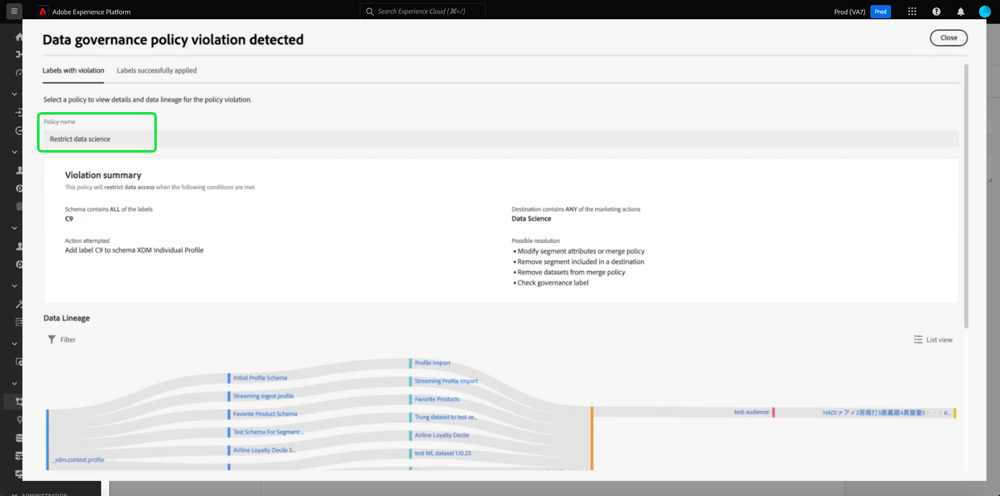
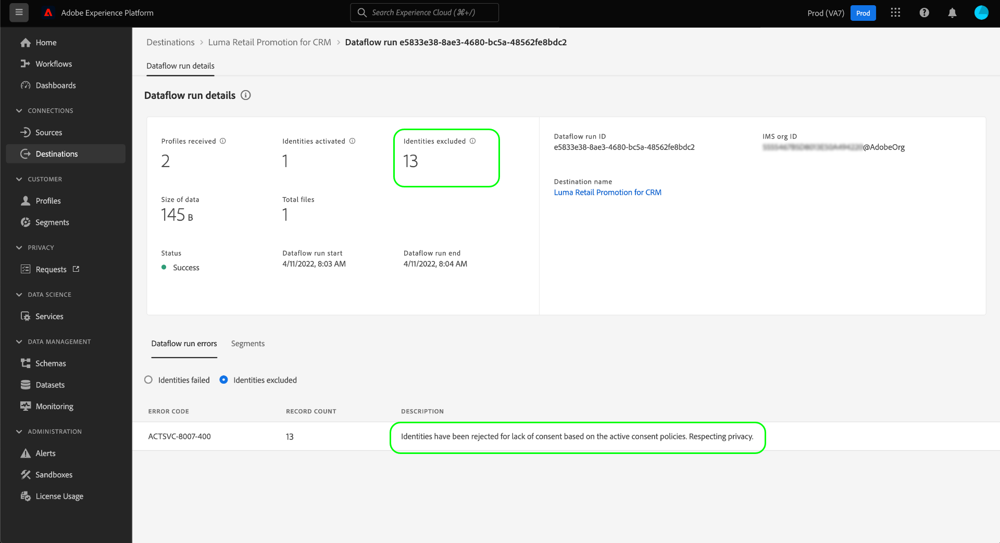

# 자동 정책 시행

>[!IMPORTANT]
>
>자동 정책 적용은 구입한 조직에 대해서만 사용할 수 있습니다. **Adobe 헬스케어 실드** 또는 **Adobe 개인정보 보호 및 보안 실드**.

데이터에 레이블이 지정되고 데이터 사용 정책이 정의되면 데이터 사용을 정책에 따라 적용할 수 있습니다. 대상을 대상으로 활성화할 때 Adobe Experience Platform에서 위반이 발생하면 사용 정책을 자동으로 적용합니다.

>[!NOTE]
>
>이 문서는 데이터 거버넌스 및 동의 정책 시행에 중점을 두고 있습니다. 액세스 제어 정책에 대한 자세한 내용은 [속성 기반 액세스 제어](../../access-control/abac/overview.md).

## 사전 요구 사항

이 안내서를 사용하려면 자동 적용과 관련된 Platform 서비스에 대한 작업 이해가 필요합니다. 이 안내서를 계속하기 전에 다음 설명서를 참조하여 자세한 내용을 알아보십시오.

* [Adobe Experience Platform 데이터 거버넌스](../home.md): 플랫폼이 레이블과 정책을 사용하여 데이터 사용 규정 준수를 적용하는 프레임워크입니다.
* [실시간 고객 프로필](../../profile/home.md): 여러 소스의 집계 데이터를 기반으로 통합 실시간 소비자 프로필을 제공합니다.
* [Adobe Experience Platform 세그멘테이션 서비스](../../segmentation/home.md): 내의 세그먼테이션 엔진 [!DNL Platform] 고객 행동 및 속성을 기반으로 고객 프로필에서 대상자를 만드는 데 사용됩니다.
* [대상](../../destinations/home.md): 대상은 크로스 채널 마케팅 캠페인, 이메일 캠페인, 타겟팅 광고 등을 위해 플랫폼에서 데이터를 원활하게 활성화할 수 있도록 일반적으로 사용되는 애플리케이션과의 사전 빌드된 통합입니다.

## 시행 흐름 {#flow}

다음 다이어그램은 정책 시행이 대상 활성화의 데이터 흐름에 어떻게 통합되는지를 보여 줍니다.

대상이 처음 활성화될 때 [!DNL Policy Service] 다음 요소를 기반으로 적용 가능한 정책을 확인합니다.

* 활성화할 대상 내의 필드 및 데이터 세트에 적용되는 데이터 사용 레이블.
* 대상의 마케팅 목적입니다.
* 구성된 동의 정책에 따라 대상자 활성화에 포함하도록 동의한 프로필입니다.

>[!NOTE]
>
>전체 데이터 세트가 아닌 데이터 세트 내의 특정 필드에만 적용된 데이터 사용 레이블이 있는 경우 활성화에 대해 이러한 필드 수준 레이블은 다음 조건에서만 적용됩니다.
>
>* 필드는 대상자에서 사용됩니다.
>* 필드는 대상 대상에 대한 예상 속성으로 구성됩니다.

## 데이터 계보 {#lineage}

데이터 계보는 플랫폼에서 정책이 어떻게 적용되는지에 중요한 역할을 합니다. 일반적으로 데이터 계보란 데이터 세트의 기원과 시간이 지남에 따라 발생하는(또는 이동하는 위치) 데이터를 나타냅니다.

데이터 거버넌스의 맥락에서 계보를 사용하면 데이터 사용 레이블이 스키마에서 실시간 고객 프로필 및 대상과 같이 데이터를 사용하는 다운스트림 서비스로 전파됩니다. 이를 통해 플랫폼을 통한 데이터 여정의 여러 핵심 지점에서 정책을 평가하고 적용할 수 있으며, 정책 위반이 발생한 이유에 대한 컨텍스트를 데이터 소비자에게 제공합니다.

Experience Platform에서 정책 집행은 다음 계보와 관련이 있습니다.

1. 데이터가 플랫폼에 수집되고 저장됩니다. **데이터 세트**.
1. 고객 프로필은 다음에 따라 데이터 조각을 병합하여 해당 데이터 세트에서 식별되고 구성됩니다. **병합 정책**.
1. 프로필 그룹은 다음과 같이 나뉩니다. **대상** 공통 속성을 기반으로 합니다.
1. 대상자가 다운스트림으로 활성화됨 **대상**.

위 타임라인의 각 단계는 아래 표에 요약된 대로 정책 시행에 기여할 수 있는 엔티티를 나타냅니다.

| 데이터 계보 단계 | 정책 집행에서의 역할 |
| --- | --- |
| 데이터 세트 | 데이터 세트에는 전체 데이터 세트 또는 특정 필드를 사용할 수 있는 사용 사례를 정의하는 데이터 사용 레이블(스키마 필드 수준 또는 전체 데이터 세트 수준에서 적용)이 포함되어 있습니다. 특정 레이블이 포함된 데이터 세트 또는 필드를 정책이 제한하는 용도로 사용하는 경우 정책 위반이 발생합니다.  고객으로부터 수집된 모든 동의 속성은 데이터 세트에도 저장됩니다. 동의 정책에 액세스할 수 있는 경우 정책의 동의 속성 요구 사항을 충족하지 않는 프로필은 대상에 대해 활성화된 대상에서 제외됩니다. |
| 병합 정책 | 병합 정책은 플랫폼이 여러 데이터 세트의 조각을 병합할 때 데이터 우선 순위를 결정하는 데 사용하는 규칙입니다. 제한된 레이블이 있는 데이터 세트가 대상에 활성화되도록 병합 정책이 구성된 경우 정책 위반이 발생합니다. 다음을 참조하십시오. [병합 정책 개요](../../profile/merge-policies/overview.md) 추가 정보. |
| Audience | 세분화 규칙은 고객 프로필에서 포함해야 하는 속성을 정의합니다. 세그먼트 정의에 포함된 필드에 따라 대상자는 해당 필드에 적용된 사용 레이블을 상속합니다. 상속된 레이블이 타겟의 적용 가능한 정책에 의해 제한된 대상을 마케팅 사용 사례에 따라 활성화하면 정책 위반이 발생합니다. |
| 대상 | 대상을 설정할 때 마케팅 작업(마케팅 사용 사례라고도 함)을 정의할 수 있습니다. 이 사용 사례는 정책에 정의된 마케팅 작업과 관련이 있습니다. 즉, 대상에 대해 정의하는 마케팅 액션에 따라 해당 대상에 적용할 수 있는 데이터 사용 정책 및 동의 정책이 결정됩니다.  데이터 사용 정책 위반은 대상 대상의 마케팅 작업에 대해 사용 레이블이 제한된 대상을 활성화하면 발생합니다.  (베타) 대상자가 활성화되면 마케팅 작업에 필요한 동의 속성(동의 정책에 정의된 대로)이 포함되지 않은 프로필은 활성화된 대상자에서 제외됩니다. |

>[!IMPORTANT]
>
>일부 데이터 사용 정책은 AND 관계가 있는 두 개 이상의 레이블을 지정할 수 있습니다. 예를 들어, 레이블인 경우 정책은 마케팅 작업을 제한할 수 있습니다 `C1` 및 `C2` 둘 다 존재하지만, 그러한 레이블 중 하나만 존재하는 경우 동일한 작업을 제한하지는 않습니다.
>
>자동 적용과 관련하여 데이터 거버넌스 프레임워크는 대상에 대한 별도의 대상을 데이터의 조합으로 활성화하지 않습니다. 따라서 예제를 참조하십시오 `C1 AND C2` 정책: **아님** 이러한 레이블이 별도의 대상에 포함된 경우 적용됩니다. 대신 이 정책은 활성화 시 두 레이블이 동일한 대상에 있는 경우에만 적용됩니다.

정책 위반이 발생하면 UI에 표시되는 결과 메시지가 위반의 기여 데이터 계보를 탐색하여 문제를 해결하는 데 유용한 도구를 제공합니다. 자세한 내용은 다음 섹션에서 확인할 수 있습니다.

## 정책 시행 메시지 {#enforcement}

아래 섹션에서는 Platform UI에 표시되는 다양한 정책 시행 메시지에 대해 간략히 설명합니다.

* [데이터 사용 정책 위반](#data-usage-violation)
* [동의 정책 평가](#consent-policy-evaluation)

### 데이터 사용 정책 위반 {#data-usage-violation}

대상을 활성화하려고 할 때 정책 위반이 발생하는 경우(또는 [이미 활성화된 대상을 편집하는 중](#policy-enforcement-for-activated-audiences)) 작업이 금지되고 하나 이상의 정책이 위반되었음을 나타내는 팝오버가 표시됩니다. 위반이 트리거되면 **[!UICONTROL 저장]** 해당 구성 요소가 데이터 사용 정책을 준수하도록 업데이트될 때까지 수정하는 엔티티에 대해 버튼이 비활성화됩니다.

팝오버의 왼쪽 열에서 정책 위반을 선택하여 해당 위반에 대한 세부 정보를 표시합니다.

위반 메시지는 정책이 확인하도록 구성된 조건, 위반을 트리거한 특정 작업, 문제에 대해 가능한 해결 방법 목록을 포함하여 위반된 정책의 요약을 제공합니다.

위반 요약 아래에 데이터 계보 그래프가 표시되어 정책 위반과 관련된 데이터 세트, 병합 정책, 대상 및 대상을 시각화할 수 있습니다. 현재 변경하고 있는 엔티티는 그래프에서 강조 표시되어 위반이 발생하는 흐름의 어느 지점을 나타냅니다. 그래프 내에서 엔티티 이름을 선택하여 해당 엔티티에 대한 세부 정보 페이지를 열 수 있습니다.

다음을 사용할 수도 있습니다 **[!UICONTROL 필터]** 아이콘()을 클릭하여 표시된 엔티티를 카테고리별로 필터링합니다. 데이터를 표시하려면 적어도 두 개의 카테고리를 선택해야 합니다.

선택 **[!UICONTROL 목록 보기]** 데이터 계보를 목록으로 표시합니다. 시각적 그래프로 다시 전환하려면 **[!UICONTROL 경로 보기]**.

### 동의 정책 평가 {#consent-policy-evaluation}

다음을 보유한 경우: [동의 정책 생성됨](../policies/user-guide.md#consent-policy) 대상자에 대한 대상자를 활성화할 때 동의 정책이 활성화에 포함된 프로필의 비율에 어떤 영향을 미치는지 확인할 수 있습니다.

#### 유료 미디어에 대한 동의 정책 개선 {#consent-policy-enhancement}

에 대한 동의 정책 시행 개선 사항 [일괄 처리](../../destinations/destination-types.md#file-based) 및 [스트리밍](../../destinations/destination-types.md#streaming-destinations) 유료 미디어 활성화를 포함한 대상이 생성되었습니다. 이 개선 사항은 Privacy and Security Shield 또는 Healthcare Shield 고객이 사용할 수 있으며 동의 상태 변경에 따라 배치 및 스트리밍 대상에서 프로필을 사전에 제거합니다. 또한 동의 변경 사항이 즉시 전파되어 항상 적합한 대상을 타기팅하도록 합니다.

이러한 개선 사항을 통해 마케터가 세그먼트 표현식에 동의 속성을 수동으로 추가할 필요가 없기 때문에 마케팅 전략에 대한 신뢰도가 높아집니다. 이렇게 하면 동의를 철회하거나 더 이상 동의 정책에 대한 자격이 없는 경우 의도치 않게 어떤 마케팅 경험에도 프로필이 타겟팅되지 않습니다. 이제 다양한 마케팅 워크플로우에서 동의 또는 환경 설정 데이터를 관리하는 방법에 대한 규칙을 설정하는 마케팅 동의 정책이 다운스트림 솔루션의 활성화 워크플로우에서 자동으로 시행됩니다.

>[!NOTE]
>
>이 개선 사항의 결과로 UI가 변경되지 않습니다.

#### 사전 활성화 평가

다음에 도달하면 **[!UICONTROL 리뷰]** 단계 조건 [대상 활성화](../../destinations/ui/activation-overview.md), 선택 **[!UICONTROL 적용된 정책 보기]**.

동의 정책이 활성화된 대상자의 동의 대상자에게 미치는 영향을 미리 보는 정책 확인 대화 상자가 나타납니다.

대화에는 한 번에 한 명의 청중에게 동의된 청중이 표시됩니다. 다른 대상에 대한 정책 평가를 보려면 다이어그램 위의 드롭다운 메뉴를 사용하여 목록에서 하나를 선택하십시오.

왼쪽 레일을 사용하여 선택한 대상자에 대해 적용 가능한 동의 정책 간을 전환합니다. 선택되지 않은 정책은 &quot;에 표시됩니다.[!UICONTROL 기타 정책]&quot;다이어그램의 섹션.

다이어그램에는 세 그룹의 프로필 간 겹침이 표시됩니다.

1. 선택한 대상에 적합한 프로필
1. 선택한 동의 정책에 적합한 프로필
1. 대상자에 대해 적용 가능한 다른 동의 정책의 자격이 되는 프로필(이하 &quot;[!UICONTROL 기타 정책]다이어그램의 &quot;)

위의 세 그룹 모두에 대한 자격이 있는 프로필은 동의된 대상을 나타내며, 오른쪽 레일에 요약됩니다.

다이어그램의 대상자 중 하나를 마우스로 가리키면 그 대상자에 포함된 프로필의 수가 표시됩니다.

동의한 대상자는 다이어그램의 중앙 중첩으로 표시되며, 다른 섹션처럼 강조 표시될 수 있다.

#### 플로우 실행 적용

데이터가 대상에 활성화되면 활성 동의 정책으로 인해 제외된 ID의 수가 흐름 실행 세부 정보에 표시됩니다.

## 활성화된 대상에 대한 정책 시행 {#policy-enforcement-for-activated-audiences}

정책 적용은 활성화된 후에도 대상에 적용되며, 정책 위반을 초래할 수 있는 대상이나 대상의 모든 변경을 제한합니다. 다음 방법으로 인해 [데이터 계보](#lineage) 정책 시행 시 다음 작업 중 하나가 위반을 트리거할 수 있습니다.

* 데이터 사용 레이블 업데이트
* 대상의 데이터 세트 변경
* 대상자 술어 변경
* 대상 구성 변경

위의 작업 중 하나가 위반을 트리거하는 경우 해당 작업이 저장되지 않고 정책 위반 메시지가 표시되므로 활성화된 대상이 수정 시 데이터 사용 정책을 계속 준수할 수 있습니다.

## 다음 단계

이 문서에서는 Experience Platform에서 자동 정책 시행이 작동하는 방식을 다룹니다. API 호출을 사용하여 정책 적용을 애플리케이션에 프로그래밍 방식으로 통합하는 방법에 대한 단계는 다음 안내서를 참조하십시오 [API 기반 적용](./api-enforcement.md).
