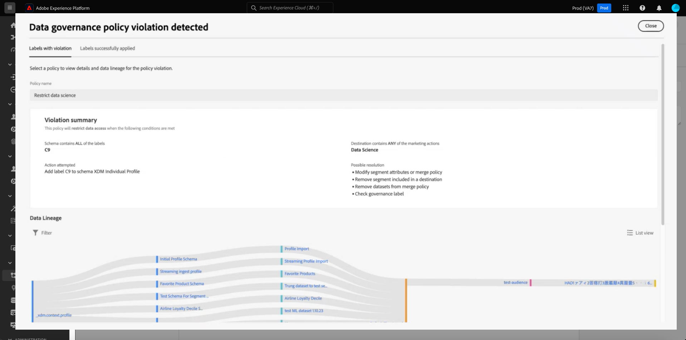
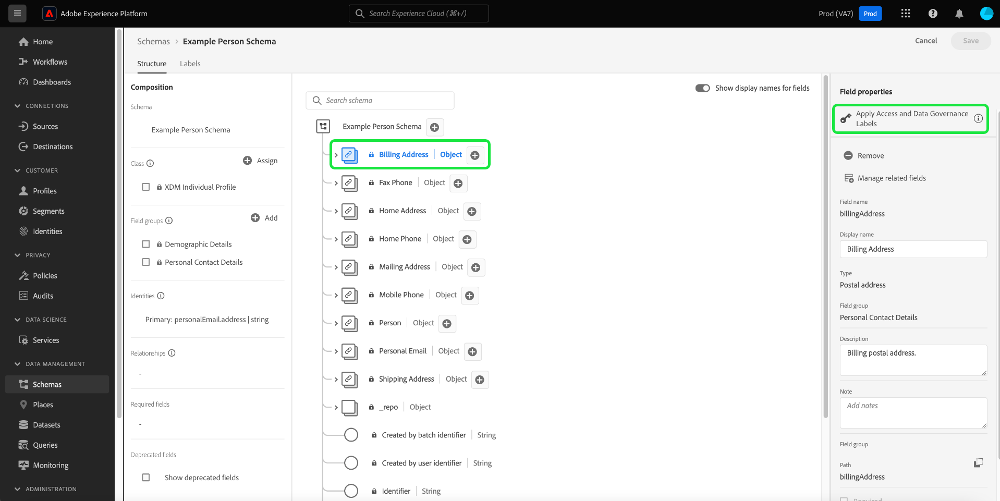
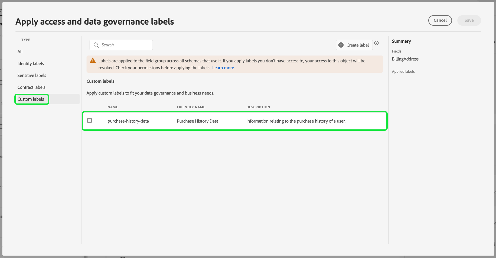

# UI에서 데이터 사용 레이블 관리 {#user-guide}

>[!CONTEXTUALHELP]
>id="platform_privacyConsole_dataGovernance_description"
>title="플랫폼에서 데이터 사용 관리"
>abstract="<h2>설명</h2>
Experience Platform의 데이터 거버넌스 프레임워크를 사용하면 데이터 사용 제한에 따라 속성 및 스키마에 레이블을 지정하고 특정 마케팅 활동에 대한 이러한 제한을 식별하고 이행하는 정책을 설정할 수 있습니다.
"

이 사용자 안내서에서는 [!DNL Experience Platform] 사용자 인터페이스 내에서 데이터 사용 레이블을 사용하는 작업을 수행하는 단계를 다룹니다.

## 레이블 관리 {#manage-labels}

데이터에 레이블을 적용하려면 &quot;prod&quot;라는 기본 프로덕션 샌드박스에서 사용할 **[!UICONTROL 사용 레이블 관리]** 권한이 필요합니다. 사용자 지정 레이블을 만들려면 제품 프로필에 대한 관리 권한도 있어야 합니다. 각 조직에는 적용 가능한 레이블 목록이 하나만 있습니다. 레이블을 **삭제할 수 없습니다**. 대신 데이터 세트가 적용되는 데이터 세트 또는 필드에서 제거할 수 있습니다.

권한을 할당하는 방법에 대한 자세한 내용은 [권한을 구성하는 방법](https://experienceleague.adobe.com/docs/platform-learn/getting-started-for-data-architects-and-data-engineers/configure-permissions.html) 또는 [액세스 제어 개요](../../access-control/home.md)에 대한 안내서를 참조하십시오. 조직의 Admin Console에 대한 액세스 권한이 없는 경우 조직 관리자에게 문의하십시오.

## 스키마 수준에서 레이블 관리

해당 스키마 내의 스키마 또는 필드에 직접 레이블을 추가할 수 있습니다. 스키마 수준에서 적용된 모든 필드는 해당 스키마를 기반으로 하는 모든 데이터 세트로 전파됩니다.

>[!NOTE]
>
>필드에 레이블을 지정하기 전에 데이터 사용 정책이 생성된 경우 새 스키마에 레이블을 적용할 때 거버넌스 정책 위반 대화 상자가 나타날 수 있습니다. 이 대화 상자는 이 레이블을 적용하면 기존 사용 정책을 위반함을 나타냅니다. 데이터 계보 다이어그램을 사용하여 스키마 필드에 레이블을 추가하기 전에 다른 구성 변경이 필요한지 이해합니다.
>
>
>
>부분 정책 위반에 대한 자세한 내용은 [데이터 사용 정책 위반 설명서](../enforcement/auto-enforcement.md#data-usage-violation)를 참조하십시오.

스키마 수준에서 데이터 사용 레이블을 관리하려면 기존 스키마를 선택하거나 새 스키마를 만들어야 합니다. Adobe Experience Platform에 로그인한 후 왼쪽 탐색에서 **[!UICONTROL 스키마]**&#x200B;를 선택하여 **[!UICONTROL 스키마]** 작업 영역을 엽니다. 이 페이지에는 각 스키마와 관련된 유용한 세부 정보와 함께 조직에 속하는 생성된 모든 스키마가 나열됩니다.

다음 섹션에서는 레이블을 적용할 새 스키마를 만드는 단계를 제공합니다. 기존 스키마의 레이블을 편집하려면 목록에서 스키마를 선택하고 [스키마에 데이터 사용 레이블 추가](#add-labels)(으)로 이동하십시오.

### 새 스키마 만들기

새 스키마를 만들려면 **[!UICONTROL 스키마]** 작업 영역의 오른쪽 상단 모서리에서 **[!UICONTROL 스키마 만들기]**&#x200B;를 선택하십시오. 자세한 지침은 [스키마 편집기를 사용하여 스키마를 만드는 방법](../../xdm/tutorials/create-schema-ui.md#create)에 대한 안내서를 참조하십시오. 또는 필요한 경우 [스키마 레지스트리 API를 사용하여 스키마를 만들](../../xdm/tutorials/create-schema-api.md)수 있습니다.

### 스키마에 데이터 사용 레이블 추가 {#add-labels-to-schema}

새 스키마를 만들거나 [!UICONTROL 스키마] 작업 영역의 [!UICONTROL 찾아보기] 탭에 있는 목록에서 기존 스키마를 선택한 후 스키마 편집기의 스키마에서 필드를 선택하십시오. [!UICONTROL 필드 속성] 사이드바에서 **[!UICONTROL 액세스 및 데이터 거버넌스 레이블 적용]**&#x200B;을 선택합니다.

스키마 수준 및 필드 수준에서 데이터 사용 레이블을 적용하고 관리할 수 있는 대화 상자가 나타납니다. [XDM 스키마에 대한 데이터 사용 레이블을 추가하거나 편집하는 방법](../../xdm/tutorials/labels.md#select-schema-field)에 대한 전체 지침은 XDM 자습서를 참조하십시오.

### 특정 데이터 세트에 데이터 사용 레이블 추가 {#add-labels-to-dataset}

>[!CONTEXTUALHELP]
>id="platform_privacyConsole_dataGovernance_instructions"
>title="지침"
>abstract="<ol><li>왼쪽 탐색 메뉴에서 <a href="https://experienceleague.adobe.com/docs/experience-platform/data-governance/labels/user-guide.html?lang=ko">데이터 세트</a> 를 선택한 다음 데이터를 제한하려는 데이터 세트를 선택합니다.</li><li>데이터 세트 세부 정보 보기에서 <b>데이터 거버넌스</b> 탭을 선택합니다.</li><li>제한할 데이터 세트 필드를 선택한 다음 <b>거버넌스 레이블 편집</b>을 선택하여 사용 제한에 따라 데이터에 레이블을 지정합니다.</li><li>데이터에 레이블을 지정한 후 왼쪽 탐색 메뉴에서 <a href="https://experienceleague.adobe.com/docs/experience-platform/data-governance/policies/overview.html?lang=ko">정책</a> 을 선택한 다음 <b>정책 만들기</b>를 선택합니다.</li><li><a href="https://experienceleague.adobe.com/docs/experience-platform/data-governance/policies/user-guide.html?lang=ko-KR#create-governance-policy">데이터 거버넌스 정책</a> 만들기를 선택한 다음 정책이 해당 정책에 적용할 데이터 사용 레이블을 선택합니다.</li><li>해당 레이블이 포함된 모든 데이터에 대해 정책이 거부할 마케팅 작업을 선택하십시오. 정책이 생성되면 목록에서 해당 정책을 선택하고 오른쪽 레일의 토글을 사용하여 활성화합니다.</li><li>활성화된 각 정책에 대해 Platform은 지정된 레이블이 포함된 모든 데이터가 정의된 마케팅 작업에 사용되는 것을 방지합니다. 이 적용은 관련 마케팅 작업(사용 사례)이 있는 대상에 대해 레이블이 지정된 데이터를 활성화하려고 시도할 때 자동으로 수행됩니다.</li></ol>"

>[!IMPORTANT]
>
>더 이상 데이터 세트 수준의 필드에 레이블을 적용할 수 없습니다. 이 워크플로우는 더 이상 사용되지 않으며, 대신 스키마 수준에서 레이블을 적용합니다. 데이터 세트 개체 수준에서 이전에 적용된 모든 레이블은 2024년 5월 31일까지 Platform UI를 통해 계속 지원됩니다. 모든 스키마에서 레이블이 일관되도록 하려면 데이터 세트 수준의 필드에 이전에 첨부된 모든 레이블을 향후 연도에 따라 스키마 수준으로 마이그레이션해야 합니다. [이전에 적용된 레이블을 데이터 집합에서 스키마 수준으로 마이그레이션하는 방법](../e2e.md#migrate-labels)에 대한 지침은 설명서를 참조하세요.

레이블은 **[!UICONTROL 데이터 세트]** 작업 영역의 **[!UICONTROL 데이터 거버넌스]** 탭에서 전체 데이터 세트에 적용할 수 있습니다. 작업 공간에서는 데이터 세트 수준에서 데이터 사용 레이블을 관리할 수 있습니다.

![데이터 거버넌스가 강조 표시된 [!UICONTROL 데이터 집합] 작업 영역의 [!UICONTROL 데이터 거버넌스] 탭.](../images/labels/dataset-governance.png)

데이터 집합 수준에서 데이터 사용 레이블을 편집하려면 먼저 연필 아이콘()을(를) 데이터 집합 이름의 행에 포함합니다.

![연필 편집 아이콘이 강조 표시된 [!UICONTROL 데이터 집합] 작업 영역의 [!UICONTROL 데이터 거버넌스] 탭.](../images/labels/dataset-level-edit.png)

**[!UICONTROL 거버넌스 레이블 편집]** 대화 상자가 열립니다. 대화 상자에서 데이터 세트에 적용할 레이블 옆의 상자를 선택합니다. 이러한 레이블은 데이터 세트 내의 모든 필드에 상속됩니다. **[!UICONTROL 적용된 레이블]** 헤더는 각 상자를 선택하면 업데이트되며 선택한 레이블을 표시합니다. 원하는 레이블을 선택하면 **[!UICONTROL 변경 내용 저장]**&#x200B;을 선택합니다.

**[!UICONTROL 데이터 거버넌스]** 작업 영역이 다시 표시되어 테이블의 초기 행에 데이터 집합 수준에서 적용한 레이블을 표시합니다. 또한 데이터 세트 내의 각 필드로 상속되는 개별 카드로 표시된 레이블을 볼 수 있습니다.

![데이터 세트 수준 레이블이 적용되고 상속된 데이터 세트 파일 레이블이 강조 표시된 [!UICONTROL 데이터 세트] 작업 영역의 [!UICONTROL 데이터 거버넌스] 탭.](../images/labels/applied-dataset-labels.png)

### 데이터 세트에서 레이블 제거 {#remove-labels-from-a-dataset}

데이터 세트 수준에서 추가된 레이블의 카드 옆에는 &quot;x&quot;가 있습니다. 이렇게 하면 전체 데이터 세트에서 레이블을 제거할 수 있습니다. 각 필드 옆에 상속된 레이블은 그 옆에 &quot;x&quot;가 없고 &quot;회색으로&quot; 표시됩니다. 상속된 이러한 **레이블은 읽기 전용**&#x200B;입니다. 즉, 필드 수준에서 제거하거나 편집할 수 없습니다.

<!-- ## View labels at the dataset field level {#view-labels-at-dataset-field-level} -->

<!-- To view labels inherited by the dataset from the schema level, select **[!UICONTROL Datasets]** to navigate to the datasets workspace and select the relevant dataset from the list. 

Next, select the **[!UICONTROL Data Governance]** tab to show the labels that have been applied to the dataset. You can also see that the labels are inherited down to each of the fields within the dataset.

The inherited labels beside each field do not have an "x" next to them and appear "greyed out" with no ability to remove or edit. This is because **inherited fields are read-only**, meaning they cannot be removed at the field level. -->

<!--Beleive can cut above here  -->

**[!UICONTROL 상속된 레이블 표시]** 토글이 기본적으로 설정되어 스키마에서 해당 필드로 상속된 레이블을 볼 수 있습니다. 토글을 끄면 데이터 세트 내에 상속된 모든 레이블이 숨겨집니다.

<!-- Labels applied to the dataset appear in read-only form within the **[!UICONTROL Data Governance]** view for that dataset. 

 -->

>[!NOTE]
>
>데이터 세트 레이블 지정 기능이 더 이상 사용되지 않기 전에 적용된 레이블은 관련 데이터 세트를 찾고 레이블에서 취소 아이콘을 선택하여 데이터 세트에서 제거할 수 있습니다.
>
>[이전에 적용된 레이블을 데이터 집합에서 스키마 수준으로 마이그레이션하는 방법](../e2e.md#migrate-labels)에 대한 지침은 설명서를 참조하세요.

## 사용자 정의 레이블 관리 {#manage-custom-labels}

>[!CONTEXTUALHELP]
>id="platform_governance_createlabels"
>title="레이블 만들기"
>abstract="레이블을 사용하면 해당 데이터에 적용되는 사용 정책에 따라 데이터 세트 및 필드를 분류할 수 있습니다. Platform은 사용할 수 있는 표준 레이블 집합을 제공하지만 조직에 특정한 사용자 정의 레이블을 만들 수도 있습니다."

[!DNL Experience Platform] UI의 **[!UICONTROL 정책]** 작업 영역에서 사용자 지정 사용 레이블을 만들 수 있습니다. 왼쪽 탐색에서 **[!UICONTROL 정책]**&#x200B;을 선택한 다음 **[!UICONTROL 레이블]**&#x200B;을 선택하여 기존 레이블 목록을 봅니다. 여기에서 **[!UICONTROL 레이블 만들기]**&#x200B;를 선택합니다.

**[!UICONTROL 레이블 만들기]** 대화 상자가 나타납니다. 여기에서 새 레이블에 대한 다음 정보를 제공합니다.

* **[!UICONTROL 이름]**: 레이블의 고유 식별자입니다. 이 값은 조회 목적으로 사용되므로 짧고 간결해야 합니다.
* **[!UICONTROL 알기 쉬운 이름]**: 레이블의 알기 쉬운 표시 이름입니다.
* **[!UICONTROL 설명]**: (선택 사항) 추가 컨텍스트를 제공하기 위한 레이블에 대한 설명입니다.

완료되면 **[!UICONTROL 만들기]**&#x200B;를 선택합니다.

![[만들기]가 강조 표시된 [정책 작업 영역 레이블 만들기] 대화 상자입니다.](../images/labels/create-label-dialog.png)

대화 상자가 닫히고 새로 만든 사용자 지정 레이블이 **[!UICONTROL 레이블]** 탭 아래의 목록에 나타납니다.

이제 데이터 세트 및 필드의 사용 레이블을 편집하거나 데이터 사용 정책을 만들 때 **[!UICONTROL 사용자 지정 레이블]**&#x200B;에서 레이블을 선택할 수 있습니다.

## 다음 단계

데이터 집합 및 필드 수준에서 데이터 사용 레이블을 추가했으므로 데이터를 [!DNL Experience Platform](으)로 수집할 수 있습니다. 자세한 내용을 보려면 먼저 [데이터 수집 설명서](../../ingestion/home.md)를 읽어 보세요.

이제 적용한 레이블을 기반으로 데이터 사용 정책을 정의할 수도 있습니다. 자세한 내용은 [데이터 사용 정책 개요](../policies/overview.md)를 참조하세요.

<!-- The workflow of this video is now outdated. This can be enabled once the video has been updated

## Additional resources

The following video is intended to support your understanding of Data Governance, and outlines how to apply labels to a dataset and individual fields.

>[!VIDEO](https://video.tv.adobe.com/v/29709?quality=12&enable10seconds=on&speedcontrol=on) -->
