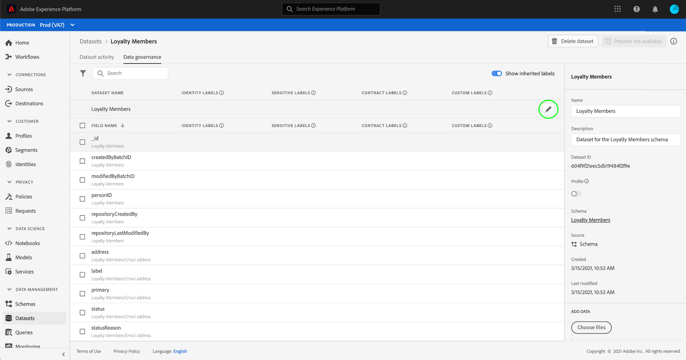

# UI에서 데이터 사용 레이블 관리 {#user-guide}

>[!CONTEXTUALHELP]
>id="platform_privacyConsole_dataGovernance_description"
>title="설명"
>abstract=""

이 사용 안내서에서는 내에서 데이터 사용 레이블 작업을 수행하는 단계를 다룹니다. [!DNL Experience Platform] 사용자 인터페이스.

## 데이터 세트 수준에서 레이블 관리

>[!IMPORTANT]
>
>데이터 세트 수준에서 레이블을 적용하는 것은 데이터 거버넌스 사용 사례에 대해서만 지원됩니다. 데이터에 대한 액세스 정책을 만들려면 다음을 수행해야 합니다 [스키마에 레이블 적용](../../xdm/tutorials/labels.md) 을 참조하십시오. 의 개요 보기 [속성 기반 액세스 제어](../../access-control/abac/overview.md) 추가 정보.

데이터 세트 수준에서 데이터 사용 레이블을 관리하려면 기존 데이터 세트를 선택하거나 새 데이터 세트를 만들어야 합니다. Adobe Experience Platform에 로그인한 후 다음을 선택합니다 **[!UICONTROL 데이터 세트]** 을(를) 왼쪽 탐색에서 열어 **[!UICONTROL 데이터 세트]** 작업 영역. 이 페이지에는 각 데이터 세트와 관련된 유용한 세부 정보와 함께 조직에 속하는 만들어진 모든 데이터 세트가 나열됩니다.

다음 섹션에서는 레이블을 적용할 새 데이터 세트를 만드는 단계를 제공합니다. 기존 데이터 세트에 대한 레이블을 편집하려면 목록에서 데이터 세트를 선택한 다음 로 건너뜁니다. [데이터 세트에 데이터 사용 레이블 추가](#add-labels).

### 새 데이터 세트 만들기

>[!NOTE]
>
>이 예제에서는 사전 구성된 을 사용하여 데이터 세트를 만듭니다 [!DNL Experience Data Model] (XDM) 스키마. XDM 스키마에 대한 자세한 내용은 [XDM 시스템 개요](../../xdm/home.md) 및 [스키마 컴포지션 기본 사항](../../xdm/schema/composition.md).

새 데이터 세트를 만들려면 다음을 선택하십시오. **[!UICONTROL 데이터 세트 만들기]** 의 오른쪽 위 모서리 **[!UICONTROL 데이터 세트]** 작업 영역.

다음 **[!UICONTROL 데이터 세트 만들기]** 화면이 나타납니다. 여기에서 다음을 선택합니다. **[!UICONTROL 스키마에서 데이터 세트 만들기]**.

다음 **[!UICONTROL 스키마 선택]** 데이터 세트를 만드는 데 사용할 수 있는 모든 사용 가능한 스키마를 나열하는 화면이 나타납니다. 스키마 옆에 있는 라디오 버튼을 선택하여 선택합니다. 다음 **[!UICONTROL 스키마]** 오른쪽의 섹션에는 선택한 스키마에 대한 추가 세부 정보가 표시됩니다. 스키마를 선택하면 를 선택합니다. **[!UICONTROL 다음]**.

다음 **[!UICONTROL 데이터 세트 구성]** 화면이 나타납니다. 새 데이터 세트의 이름(필수) 및 설명(선택 사항이지만 권장됨)을 입력한 다음 을 선택합니다 **[!UICONTROL 완료]**.

다음 **[!UICONTROL 데이터 세트 활동]** 새로 만든 데이터 세트에 대한 정보를 표시하는 페이지가 나타납니다. 이 예에서 데이터 세트의 이름은 &quot;충성도 멤버&quot;이므로 위쪽 탐색에 다음이 표시됩니다 **데이터 세트 > 충성도 멤버**.

### 데이터 세트에 데이터 사용 레이블 추가 {#add-labels}

새 데이터 세트를 만들거나 의 목록에서 기존 데이터 세트를 선택한 후 **[!UICONTROL 데이터 세트]** 작업 영역, 선택 **[!UICONTROL 데이터 거버넌스]** 을(를) 열려면 **[!UICONTROL 데이터 거버넌스]** 작업 영역. 작업 영역에서는 데이터 세트 수준 및 필드 수준에서 데이터 사용 레이블을 관리할 수 있습니다.

데이터 세트 수준에서 데이터 사용 레이블을 편집하려면 먼저 데이터 세트 이름 옆에 있는 연필 아이콘을 선택합니다.

다음 **[!UICONTROL 거버넌스 레이블 편집]** 대화 상자가 열립니다. 대화 상자에서 데이터 세트에 적용할 레이블 옆의 상자를 선택합니다. 이러한 레이블은 데이터 세트 내의 모든 필드에 상속됩니다. 다음 **[!UICONTROL 적용된 레이블]** 각 상자를 선택하면 헤더가 업데이트되어 선택한 레이블이 표시됩니다. 원하는 레이블을 선택하면 을(를) 선택합니다. **[!UICONTROL 변경 내용 저장]**.

다음 **[!UICONTROL 데이터 거버넌스]** 데이터 세트 수준에서 적용한 레이블을 보여 주는 작업 영역이 다시 나타납니다. 레이블이 데이터 세트 내의 각 필드로 상속되는 것도 볼 수 있습니다.

데이터 세트 수준의 레이블 옆에 &quot;x&quot;가 표시되어 레이블을 제거할 수 있습니다. 각 필드 옆에 있는 상속된 레이블은 그 옆에 &quot;x&quot;가 없으며 제거하거나 편집할 수 없는 &quot;회색으로&quot; 표시됩니다. 이유는 다음과 같습니다. **상속된 필드는 읽기 전용입니다.**&#x200B;즉, 필드 수준에서 제거할 수 없습니다.

다음 **[!UICONTROL 상속된 레이블 표시]** 전환은 기본적으로 설정되어 있으며, 이를 사용하면 데이터 세트에서 해당 필드로 상속된 레이블을 볼 수 있습니다. 토글을 끄면 데이터 세트 내에 상속된 모든 레이블이 숨겨집니다.

## 데이터 세트 필드 수준에서 레이블 관리 {#manage-labels-at-dataset-field-level}

>[!CONTEXTUALHELP]
>id="platform_privacyConsole_dataGovernance_instructions"
>title="지침"
>abstract=""

>[!IMPORTANT]
>
>데이터 세트 필드 수준에서 레이블을 적용하는 것은 데이터 거버넌스 사용 사례에 대해서만 지원됩니다. 데이터에 대한 액세스 정책을 만들려면 다음을 수행해야 합니다 [스키마에 레이블 적용](../../xdm/tutorials/labels.md) 을 참조하십시오. 의 개요 보기 [속성 기반 액세스 제어](../../access-control/abac/overview.md) 추가 정보.

워크플로 계속 [데이터 세트 수준에서 데이터 사용 레이블 추가 및 편집](#add-labels), 내에서 필드 수준 레이블을 관리할 수도 있습니다. **[!UICONTROL 데이터 거버넌스]** 해당 데이터 세트에 대한 작업 영역.

개별 필드에 데이터 사용 레이블을 적용하려면 필드 이름 옆에 있는 확인란을 선택한 다음 을 선택합니다 **[!UICONTROL 거버넌스 레이블 편집]**.

다음 **[!UICONTROL 거버넌스 레이블 편집]** 대화 상자가 나타납니다. 이 대화 상자에는 선택한 필드, 적용된 레이블 및 상속된 레이블을 표시하는 헤더가 표시됩니다. 상속된 레이블(C2 및 C5)이 대화 상자에서 회색으로 표시됩니다. 이 레이블은 데이터 세트 수준에서 상속된 읽기 전용 레이블이므로 데이터 세트 수준에서만 편집할 수 있습니다.

사용하려는 각 레이블 옆에 있는 확인란을 선택하여 필드 수준 레이블을 선택합니다. 레이블을 선택하면 **[!UICONTROL 적용된 레이블]** 에 표시된 필드에 적용된 레이블을 표시하는 헤더 업데이트 **[!UICONTROL 선택된 필드]** 머리글입니다. 필드 수준 레이블 선택을 마쳤으면 다음을 선택합니다. **[!UICONTROL 변경 내용 저장]**.

다음 **[!UICONTROL 데이터 거버넌스]** 이제 필드 이름 옆의 행에 선택한 필드 수준 레이블이 표시되는 작업 공간이 다시 나타납니다. 필드 수준 레이블 옆에 &quot;x&quot;가 있어 레이블을 제거할 수 있습니다.

필드 수준 레이블을 동시에 적용할 여러 필드를 선택하는 것을 포함하여 추가 필드에 대한 필드 수준 레이블을 계속 추가 및 편집하려면 이 단계를 반복할 수 있습니다.

상속이 최상위 수준(데이터 세트 → 필드)에서만 아래로 이동한다는 것을 기억해야 합니다. 즉, 필드 수준에서 적용된 레이블은 다른 필드 또는 데이터 세트로 전파되지 않습니다.

## 스키마 수준에서 레이블 관리

해당 스키마 내의 스키마 또는 필드에 직접 레이블을 추가할 수 있습니다. 스키마 수준에서 적용된 모든 필드는 해당 스키마를 기반으로 하는 모든 데이터 세트로 전파됩니다.

다음 튜토리얼 참조: [스키마 수준 레이블 관리](../../xdm/tutorials/labels.md) 추가 정보.

## 사용자 정의 레이블 관리 {#manage-custom-labels}

>[!CONTEXTUALHELP]
>id="platform_governance_createlabels"
>title="레이블 만들기"
>abstract="레이블을 사용하면 해당 데이터에 적용되는 사용 정책에 따라 데이터 세트와 필드를 분류할 수 있습니다. Platform은 사용할 표준 레이블 세트를 제공하지만 조직에 고유한 사용자 지정 레이블을 만들 수도 있습니다."

내에서 자신만의 사용자 지정 사용 레이블을 만들 수 있습니다. **[!UICONTROL 정책]** 의 작업 공간 [!DNL Experience Platform] UI. 선택 **[!UICONTROL 정책]** 왼쪽 탐색에서 을 선택합니다. **[!UICONTROL 레이블]** 기존 레이블 목록을 봅니다. 여기에서 다음을 선택합니다. **[!UICONTROL 레이블 만들기]**.

다음 **[!UICONTROL 레이블 만들기]** 대화 상자가 나타납니다. 여기에서 새 레이블에 대한 다음 정보를 제공합니다.

* **[!UICONTROL 식별자]**: 레이블에 대한 고유 식별자. 이 값은 조회 목적으로 사용되므로 짧고 간결해야 합니다.
* **[!UICONTROL 이름]**: 레이블에 대한 친숙한 표시 이름입니다.
* **[!UICONTROL 설명]**: (선택 사항) 추가 컨텍스트를 제공하기 위한 레이블에 대한 설명입니다.

완료되면 다음을 선택합니다. **[!UICONTROL 만들기]**.

대화 상자가 닫히고 새로 만든 사용자 지정 레이블이 **[!UICONTROL 레이블]** 탭.

이제 다음 위치에서 레이블을 선택할 수 있습니다. **[!UICONTROL 사용자 정의 레이블]** 데이터 세트 및 필드의 사용 레이블을 편집하거나 데이터 사용 정책을 만들 때.

 

## 다음 단계

데이터 세트 및 필드 수준에서 데이터 사용 레이블을 추가했으므로 이제 데이터 수집을 시작할 수 있습니다. [!DNL Experience Platform]. 자세한 내용은 [데이터 수집 설명서](../../ingestion/home.md).

이제 적용한 레이블을 기반으로 데이터 사용 정책을 정의할 수도 있습니다. 자세한 내용은 [데이터 사용 정책 개요](../policies/overview.md).

## 추가 리소스

다음 비디오는 데이터 거버넌스에 대한 이해를 지원하기 위해 작성되었으며 데이터 세트 및 개별 필드에 레이블을 적용하는 방법에 대해 간략하게 설명합니다.

>[!VIDEO](https://video.tv.adobe.com/v/29709?quality=12&enable10seconds=on&speedcontrol=on)
