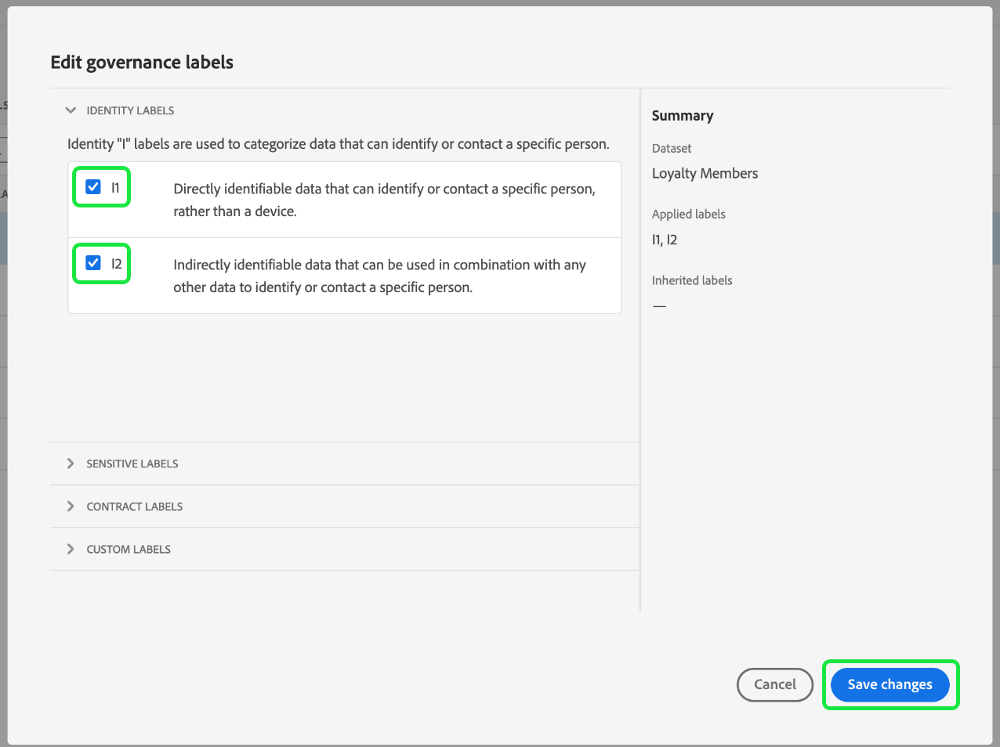

# 데이터 사용 레이블 사용 안내서

이 사용자 안내서에서는 [!DNL Experience Platform] 사용자 인터페이스 내에서 데이터 사용 레이블 작업을 위한 단계를 설명합니다. 가이드를 사용하기 전에 [[!DNL Data Governance] 개요를](../home.md) 참조하여 [!DNL Data Governance] 프레임워크에 대한 보다 강력한 소개를 확인하십시오.

## 데이터 세트 수준에서 데이터 사용 레이블 관리

데이터 세트 수준에서 데이터 사용 레이블을 관리하려면 기존 데이터 세트를 선택하거나 새 데이터 세트를 만들어야 합니다. Adobe Experience Platform에 로그인한 후 왼쪽 탐색 **[!UICONTROL 에서 데이터]** 세트를 선택하여 **[!UICONTROL 데이터 집합]** 작업 영역을 엽니다. 이 페이지에는 각 데이터 세트에 관련된 유용한 세부 사항과 함께 조직에 속하는 모든 데이터 집합이 나열됩니다.

다음 섹션에서는 레이블을 적용할 새 데이터 세트를 만드는 단계를 제공합니다. 기존 데이터 세트에 대한 레이블을 편집하려면 목록에서 데이터 세트를 선택하고 건너뛰어 데이터 데이터 세트에 데이터 사용 레이블을 [추가합니다](#add-labels).

### 새 데이터 집합 만들기

>[!NOTE]
>
>이 예에서는 XDM(사전 구성된) 스키마를 사용하여 데이터 세트 [!DNL Experience Data Model] 를 만듭니다. XDM 스키마에 대한 자세한 내용은 [XDM 시스템 개요](../../xdm/home.md) 및 스키마 [작성에 대한 기본 사항을 참조하십시오](../../xdm/schema/composition.md).

새 데이터 세트를 만들려면 데이터 집합 **[!UICONTROL 작업 영역의 오른쪽 위 모서리에 있는]** 데이터 집합 **[!UICONTROL 만들기를]** 클릭합니다.

데이터 세트 **[!UICONTROL 만들기]** 화면이 나타납니다. 여기에서 스키마에서 데이터 **[!UICONTROL 세트 만들기를 클릭합니다]**.

데이터 세트 **[!UICONTROL 를]** 만드는 데 사용할 수 있는 모든 스키마를 나열하는 스키마 선택 화면이 나타납니다. 스키마 옆에 있는 라디오 단추를 클릭하여 선택합니다. 오른쪽의 **[!UICONTROL 스키마]** 섹션에는 선택한 스키마에 대한 추가 세부 정보가 표시됩니다. 스키마를 선택하고 나면 [다음]을 **[!UICONTROL 클릭합니다]**.

데이터 세트 **[!UICONTROL 구성]** 화면이 나타납니다. 새 데이터 세트에 대한 이름(필수) 및 설명(선택 사항이지만 권장)을 제공한 다음 **[!UICONTROL 마침을 클릭합니다]**.

데이터 **[!UICONTROL 집합 활동]** 페이지가 나타나고 새로 만든 데이터 집합에 대한 정보가 표시됩니다. 이 예에서 데이터 세트의 이름은 &quot;충성도 구성원&quot;이므로 맨 위 탐색은 데이터 집합 > 충성도 **구성원을 보여줍니다**.

### 데이터 세트에 데이터 사용 레이블 추가 {#add-labels}

데이터 세트 작업 공간의 목록에서 새 데이터 세트를 만들거나 **[!UICONTROL 데이터 세트]** 를 선택한 후 **[!UICONTROL 데이터 거버넌스]** 를 클릭하여 **[!UICONTROL 데이터 거버넌스]** 작업공간을엽니다. 작업 공간에서는 데이터 세트 수준 및 필드 수준에서 데이터 사용 레이블을 관리할 수 있습니다.

데이터 세트 수준에서 데이터 사용 레이블을 편집하려면 먼저 데이터 세트 이름 옆에 있는 연필 아이콘을 클릭합니다.

관리 **[!UICONTROL 레이블 편집]** 대화 상자가 열립니다. 대화 상자에서 데이터 세트에 적용할 레이블 옆에 있는 상자를 선택합니다. 이러한 레이블은 데이터 세트 내의 모든 필드에 의해 상속됩니다. 각 **[!UICONTROL 확인란을 선택하면 적용된 레이블]** 헤더가 업데이트되며 선택한 레이블이 표시됩니다. 원하는 레이블을 선택한 후 변경 내용 **[!UICONTROL 저장을 클릭합니다]**.

 

데이터 **[!UICONTROL 집합]** 수준에서 적용한 레이블을 보여주는 데이터 거버넌스 작업 영역이 다시 나타납니다. 또한 레이블이 데이터 세트 내의 각 필드에 상속됨을 확인할 수 있습니다.

데이터 세트 수준의 레이블 옆에 &quot;x&quot;가 표시되어 레이블을 제거할 수 있습니다. 각 필드 옆에 있는 상속된 레이블에 &quot;x&quot;가 없으며 제거 또는 편집 기능이 없는 &quot;회색으로 표시 이는 **상속된 필드가 읽기 전용이므로**&#x200B;필드 수준에서 제거할 수 없습니다.

기본적으로 **[!UICONTROL 상속된 레이블]** 표시 전환은 활성화되어 있으므로 데이터 세트에서 해당 필드로 상속된 레이블을 볼 수 있습니다. 전환으로 전환하면 데이터 세트 내의 상속된 레이블이 숨겨집니다.

## 데이터 세트 필드 수준에서 데이터 사용 레이블 관리

데이터 세트 수준에서 [데이터 사용 레이블을](#add-labels)추가하고 편집하는 워크플로우를 계속 진행할 수 있고 해당 데이터 세트에 대한 **[!UICONTROL 데이터 거버넌스 작업]** 공간 내에서 필드 수준 레이블을 관리할 수도 있습니다.

개별 필드에 데이터 사용 레이블을 적용하려면 필드 이름 옆에 있는 확인란을 선택한 다음 관리 레이블 **[!UICONTROL 편집을 클릭합니다]**.

관리 **[!UICONTROL 레이블 편집 대화 상자가]** 나타납니다. 대화 상자에는 선택한 필드, 적용된 레이블 및 상속된 레이블이 표시된 머리글이 표시됩니다. 대화 상자에서 상속된 레이블(C2 및 C5)이 회색으로 표시됩니다. 데이터 세트 수준에서 상속되는 읽기 전용 레이블이므로 데이터 세트 수준에서만 편집할 수 있습니다.

 

사용할 각 레이블 옆의 확인란을 클릭하여 필드 수준 레이블을 선택합니다. 레이블을 선택하면 **[!UICONTROL 적용된 레이블]** 머리글이 업데이트되어 선택한 필드 **[!UICONTROL 머리글에 표시된 필드에 적용된 레이블을]** 표시합니다. 필드 수준 레이블 선택이 끝나면 변경 내용 **[!UICONTROL 저장을 클릭합니다]**.

 

이제 **[!UICONTROL 데이터 거버넌스]** 작업 영역이 다시 나타나며 필드 이름 옆의 행에 선택한 필드 수준 레이블을 표시합니다. 필드 수준 레이블 옆에 레이블을 제거할 수 있는 &quot;x&quot;가 있습니다.

필드 수준 레이블을 동시에 적용할 여러 필드를 선택하는 등 추가 필드에 대해 필드 수준 레이블을 계속 추가하고 편집하려면 이 단계를 반복할 수 있습니다.

상속은 최상위 수준 아래쪽에서만(데이터 세트→필드) 이동되므로 필드 수준에서 적용된 레이블이 다른 필드나 데이터 세트에 전파되지 않습니다.

## 사용자 지정 레이블 관리

UI의 [정책] 작업 공간 내에서 사용자 지정 **[!UICONTROL 사용]** 레이블을 직접 만들 수 [!DNL Experience Platform] 있습니다. 왼쪽 탐색 **[!UICONTROL 에서 정책]** 을 클릭한 다음 **[!UICONTROL 레이블을]** 클릭하여 기존 레이블 목록을 봅니다. 여기에서 레이블 **[!UICONTROL 만들기를 클릭합니다]**.

레이블 **[!UICONTROL 만들기]** 대화 상자가 나타납니다. 여기에서 새 레이블에 대한 다음 정보를 제공합니다.

* **[!UICONTROL 식별자]**:레이블의 고유 식별자입니다. 이 값은 조회 목적으로 사용되므로 짧고 간결해야 합니다.
* **[!UICONTROL 이름]**:레이블의 친숙한 표시 이름입니다.
* **[!UICONTROL 설명]**:(선택 사항) 추가적인 컨텍스트를 제공하는 레이블에 대한 설명입니다.

When finished, click **[!UICONTROL Create]**.

대화 상자가 닫히고 새로 만든 사용자 지정 레이블이 레이블 탭 아래의 목록에 **[!UICONTROL 나타납니다]** .

이제 데이터 세트 및 필드에 대한 사용 레이블을 **[!UICONTROL 편집할]** 때 또는 데이터 사용 정책을 만들 때 사용자 지정 레이블 아래에서 레이블을 선택할 수 있습니다.

 

## 다음 단계

이제 데이터 세트 및 필드 수준에서 데이터 사용 레이블을 추가했으므로 데이터를 인제스트할 수 있습니다 [!DNL Experience Platform]. 자세한 내용은 [데이터 수집 설명서를 참조하십시오](../../ingestion/home.md).

적용된 레이블을 기반으로 데이터 사용 정책을 정의할 수도 있습니다. 자세한 내용은 [데이터 사용 정책 개요를 참조하십시오](../policies/overview.md).

## Journey Orchestration용

다음 비디오는 데이터 세트 및 개별 필드에 레이블을 적용하는 방법에 대한 이해를 [!DNL Data Governance]지원하고 요약해 놓은 것입니다.

>[!VIDEO](https://video.tv.adobe.com/v/29709?quality=12&enable10seconds=on&speedcontrol=on)
