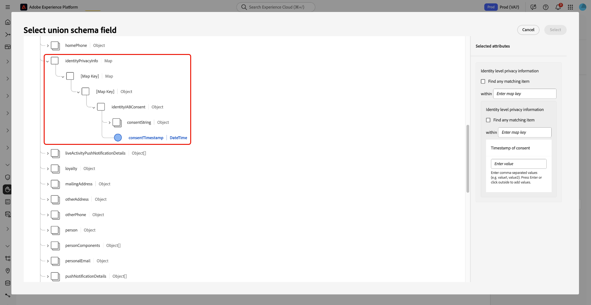

# 동의 정책 규칙 작성 참조

고급 규칙 논리에 대한 이 참조를 사용하여 Adobe Experience Platform에 있는 동의 정책 빌더의 **[!UICONTROL Then]** 절에 정확하고 법적으로 유효한 규칙을 설정합니다.

![사용자가 규칙 조건을 정의하는 [!UICONTROL Then] 절 섹션을 강조 표시하는 동의 정책 빌더 인터페이스입니다.](../images/policies/multiple-rules.png)

정책 규칙이 동의 데이터의 구조 및 유형에 적용되어 고객 동의 환경 설정을 정확하게 적용하는 방법에 대해 알아봅니다.

XDM 스키마의 컨테이너 필드로 이동하여 기본 필드를 선택하여 동의를 기반으로 프로필을 필터링하는 방법을 알아보려면 이 문서 를 참조하십시오. 그런 다음 적절한 연산자를 사용하여 프로필이 일치해야 하는 정확한 값을 정의합니다.

## 전제 조건

이 참조를 사용하기 전에 동의 정책 설정이 완료되었고 Adobe Experience Platform 데이터 아키텍처 및 거버넌스 프레임워크의 기본 개념을 이해했는지 확인하십시오.

다음 전제 조건을 충족하는지 확인하십시오.

* **정책 설정 완료**: Adobe Experience Platform UI에서 동의 정책을 만들거나 시작했습니다. 자세한 단계는 [데이터 사용 정책 사용 안내서](user-guide.md#consent-policy)를 참조하세요.

* **데이터 구조에 익숙함**: 이 참조를 사용하려면 다음 핵심 개념에 대한 작업 지식이 필요합니다.
   * **XDM 및 유니온 스키마**: Experience Data Model 구조가 데이터 관계를 정의하는 방법과 유니온 스키마가 통합 고객 프로필을 나타내는 방법을 이해합니다. 자세한 내용은 [XDM 시스템 개요](../../xdm/home.md)를 참조하십시오.
   * **데이터 거버넌스 프레임워크**: Adobe Experience Platform에서 데이터 사용 정책 및 거버넌스 규칙을 적용하는 방법을 알아봅니다. 자세한 내용은 [데이터 거버넌스 개요](../home.md)를 참조하십시오.
   * **고객 동의 처리**: 고객 경험 워크플로 내에서 동의 데이터를 수집, 저장 및 적용하는 방법을 이해합니다. [동의 처리 개요](../../landing/governance-privacy-security/consent/adobe/overview.md)를 참조하세요.

## 핵심 개념: 기본 및 컨테이너 필드

동의 정책 규칙이 XDM 스키마에서 다양한 필드 유형을 사용하는 방법을 알아보려면 이 섹션을 참조하십시오. 컨테이너 필드와 원시 필드의 구분을 이해하면 정책 조건을 정의할 때 올바른 필드와 연산자를 선택하는 데 도움이 됩니다.

### 지원되는 필드 유형 및 규칙 논리

동의 정책은 규칙 조건을 작성하는 특정 연산자와 함께 여러 필드 유형을 지원합니다. 필드 형식은 **컨테이너 형식** 및 **기본 형식**&#x200B;의 두 가지 범주로 그룹화됩니다.

### 컨테이너 유형(스키마 탐색)

컨테이너 유형은 동의 데이터를 구성하지만 정책 조건에서 직접 사용할 수 없습니다. 실제 값을 포함하는 원시 필드에 도달하기 위해 탐색 경로 역할을 합니다.

| 컨테이너 유형 | 설명 |
|----------------|-------------|
| **개체** | 유형이 다른 여러 필드를 보유하는 고정 스키마가 있는 컨테이너입니다. |
| **배열** | 동일한 유형의 여러 값이 들어 있는 컨테이너입니다. |
| **맵** | 개체나 기타 필드 유형을 담을 수 있는 동적 키가 있는 컨테이너입니다. |

>[!IMPORTANT]
>
>동의 정책 조건에서 컨테이너 필드를 직접 선택할 수 없습니다. 규칙 빌드를 위해 **기본 필드**(예: 문자열, 숫자 또는 부울)을 선택하려면 컨테이너로 이동해야 합니다. 컨테이너 연산자는 정책 조건을 설정하는 데 사용되지 않고 스키마 탐색에만 사용됩니다.

### 기본 유형(규칙 조건)

기본 필드에는 실제 동의 데이터 값(예: `true` 또는 `"weekly"`)이 있으며 정책 조건을 정의하는 데 사용할 수 있는 유일한 필드 형식입니다.

아래 표에서는 지원되는 각 기본 유형 및 사용 가능한 연산자에 대해 설명합니다.

| 기본 유형 | 지원되는 연산자 | 설명 |
|----------------|---------------------|-------------|
| **문자열** | `is equal to`, `is not equal to`, `exists`, `does not exist` | 텍스트 기반 동의 속성. |
| **숫자** | `is equal to`, `is not equal to`, `is greater than`, `is less than`, `exists`, `does not exist` | 숫자 동의 속성입니다. |
| **부울** | `is equal to`, `is not equal to` | True 또는 False 동의 값입니다. |
| **날짜** | `is equal to`, `is not equal to`, `exists`, `does not exist` | 날짜 기반 동의 속성. |


## 복잡한 데이터 구조 작업

이 섹션을 읽고 동의 스키마의 중첩된 컨테이너를 탐색하여 원시 필드에 도달하는 방법을 알아보십시오. 일반적인 스키마 패턴을 소개하고 더 깊은 구조를 통해 더욱 세분화된 동의 논리를 구현하는 방법을 설명합니다.

### 중첩 및 복잡한 스키마 구조 처리

복잡한 동의 스키마에는 유연하고 확장 가능한 데이터 관리를 지원하는 중첩된 컨테이너 구조가 포함된 경우가 많습니다. 정책 규칙은 기본 필드만 참조할 수 있으므로 동의 정책 조건에서 사용할 수 있는 필드에 도달하려면 컨테이너 계층을 통해 탐색해야 합니다. 더 깊은 중첩을 사용하면 더 세분화되고 특정 규칙 타깃팅을 사용할 수 있습니다.

일반적인 중첩 컨테이너 패턴은 다음과 같습니다.

* **맵 맵** - 다른 맵이 포함된 동적 키입니다.
* **개체 맵** - 스키마가 고정된 개체가 포함된 동적 키입니다.
* **맵 배열** - 동적 키가 있는 맵이 포함된 배열입니다.
* **개체의 배열** - 스키마가 고정된 개체가 포함된 배열입니다.
* **맵 또는 배열 속성이 있는 개체** - 맵 또는 배열 필드가 포함된 개체.

### 필드 구조 예

다음 구조는 이 안내서 전체의 규칙 예제에 대한 시각적 참조 역할을 합니다.

```
consent.marketing (Object)
├── email (Boolean)
├── sms (Boolean)
├── preferences (Map with dynamic keys)
│   ├── "email_preferences" (Object)
│   │   ├── frequency (String)
│   │   └── channels (Array of Strings)
│   ├── "sms_preferences" (Object)
│   │   ├── frequency (String)
│   │   └── opt_in_time (Date)
│   └── "push_preferences" (Object)
│       ├── frequency (String)
│       └── categories (Array of Strings)
└── lastUpdated (Date)
```

## 필드 유형별 고급 규칙 작성

필드 유형을 기반으로 동의 정책 규칙을 만드는 방법에 대한 자세한 지침은 이 섹션을 참조하십시오. 정확한 동의 조건을 캡처하기 위해 부울, 맵, 개체 및 배열에 대한 규칙 논리를 구성하는 방법에 대해 알아봅니다.

### 규칙 작성 구성 요소 및 단계

효과적인 동의 정책 규칙을 작성하려면 스키마 구조를 탐색하고 각 필드 유형에 올바른 연산자를 적용하는 방법을 이해해야 합니다. 각 규칙은 동일한 기본 접근 방식을 따릅니다. 즉, 원시 필드로 이동하고 적절한 연산자를 선택한 다음 충족해야 하는 조건을 정의합니다.

규칙을 작성하려면 다음 단계를 따르십시오.

1. **필드 선택** - 컨테이너 필드를 탐색하여 기본 필드에 도달합니다.
2. **연산자 선택** - 필드 형식에서 지원하는 연산자를 선택합니다.
   
3. **값 설정** - 일치시킬 값 또는 조건을 정의합니다.
4. **맵 키 일치** - 특정 키를 대상으로 할지 또는 맵의 모든 키를 대상으로 할지 여부를 선택합니다.
5. **조건 추가** - 필요에 따라 AND 또는 OR 논리를 사용하여 여러 규칙을 결합합니다.

### 부울 필드 작업(암시적 동의 논리)

부울 필드는 true 또는 false 동의 값을 저장하고 가장 일반적인 동의 속성을 나타냅니다. `is not equal to` 연산자를 사용하면 명시적으로 옵트아웃하지 않은 프로필을 포함하여 암시적 동의 시나리오를 지원할 수 있습니다.

**부울 연산자 및 결과**

| 연산자 | 값 | 결과 |
|----------|-------|--------|
| `is equal to` | `true` | 명시적 동의(`true`)가 있는 프로필을 포함합니다. |
| `is equal to` | `false` | 명시적 옵트아웃(`false`)이 있는 프로필을 포함합니다. |
| `is not equal to` | `true` | 명시적 동의 없이 프로필을 포함합니다(`false` 또는 누락). |
| `is not equal to` | `false` | 명시적으로 옵트아웃하지 않은 프로필(`true` 또는 누락)을 포함합니다. |

**예: 암시적 전자 메일 동의**

```
Field: consent.marketing.email (boolean)
Operator: is not equal to
Value: false
Result: Includes profiles who have not explicitly opted out of email marketing (includes both true and missing/null values).
```

### 맵 필드 작업(동적 환경 설정)

맵 필드는 스키마가 고정된 오브젝트와 달리 동적 키가 있는 키-값 쌍을 저장합니다. 맵은 스키마 업데이트 없이 새 카테고리를 추가할 수 있는 환경 설정 센터에서 자주 사용됩니다. 특정 키를 대상으로 하거나 모든 키에 일치하는 와일드카드를 사용할 수 있습니다.

**특정 키 일치**

이 접근 방식을 사용하여 특정 환경 설정 범주를 타깃팅합니다.

```
Field: consent.preferences["email_preferences"].frequency (string) - navigated to from the map container
Operator: is equal to
Value: "weekly"
Result: Includes profiles who set the email frequency to weekly (for the "email_preferences" key)
```

**일치하는 모든 키**

맵의 모든 동적 키를 일치시키려면 &quot;**[!UICONTROL find any matching item]**&quot; 확인란 옵션을 사용하십시오.


```
Field: consent.preferences.*.frequency (string)
Operator: is equal to
Value: "weekly"
Result: Includes profiles who set frequency to weekly in ANY preference category (for example, email_preferences, sms_preferences, or push_preferences)
```

### 오브젝트 필드 작업(고정 탐색)

오브젝트 필드는 스키마가 고정된 컨테이너 역할을 합니다. 탐색에만 사용되며 정책 조건에서 직접 참조할 수 없습니다.

**탐색 예제**

```
consent.marketing (object) → consent.marketing.email (boolean)
```

**사용 사례 예:**

```
Field: consent.marketing.email (Boolean) - navigated to from the object
Operator: is equal to
Value: true
Result: Include profiles who have explicitly consented to marketing emails
```


### 배열 필드 작업(여러 값)

배열 필드에는 동일한 유형의 여러 값이 포함되어 있으며 기본 값을 저장하는지 아니면 개체를 저장하는지에 따라 다른 처리가 필요합니다. 탐색 및 연산자 옵션은 배열 유형에 따라 다릅니다.

**기본 형식 배열 예**

`contains` 연산자를 사용하여 배열 내의 특정 값을 기준으로 프로필을 식별합니다.

```
Field: consent.communication_channels (array of strings)
Operator: contains
Value: "email"
Result: Include profiles who have consented to email communication
```

**개체 배열 예**

배열로 이동하여 중첩된 오브젝트 내의 기본 필드에 액세스합니다.

```
Field: consent.preferences["email_preferences"].categories[].type - navigated to from the array
Operator: is equal to
Value: "promotional"
Result: Include profiles where any email category is "promotional"
```

## 복잡한 논리와 규칙 결합

이 섹션에서는 AND 또는 OR 논리를 사용하여 여러 규칙 조건을 결합하는 방법을 설명합니다. 논리 연산자가 함께 작동하여 고급 다중 조건 동의 정책을 정의하는 방법을 알아봅니다.

### 여러 조건 결합(AND 또는 OR 논리)

AND 또는 OR 논리를 사용하여 여러 규칙 조건을 결합하여 특정 프로필 세그먼트를 대상으로 하는 보다 정교한 동의 정책을 작성할 수 있습니다.\
**AND 논리**&#x200B;를 사용하려면 모든 조건이 true여야 하므로 대상 일치가 좁아지게 됩니다.\
**OR 논리**&#x200B;를 사용하면 모든 조건이 true가 되어 대상 범위를 확장할 수 있습니다.

동의 정책 인터페이스에서 규칙 조건 사이에 표시되는 논리 선택기를 사용하여 AND와 OR 논리 간에 전환합니다.

### 일반 복합 규칙 예

다음 예제에서는 기본 동의 상태와 기본 설정 빈도를 결합하여 타깃팅된 세그먼트를 만듭니다.

```
Field: consent.marketing.email
Operator: is equal to true
AND
Field: consent.preferences.frequency
Operator: is not equal to "daily"
Result: Include profiles who consent to email marketing but not to a daily frequency
```

### 개체 배열에 대한 고급 논리

개체 배열 내에서 조건을 결합할 때 동작은 조건 간에 AND 또는 OR 논리를 사용하는지 여부에 따라 달라집니다.

**예: AND 조건을 가진 개체 배열**

모든 조건이 *same* 배열 요소에 적용되어야 하는 경우 AND 논리를 사용합니다.

```
Field: consent.preferences["email_preferences"].categories[].enabled (boolean)
Operator: is equal to
Value: true
AND
Field: consent.preferences["email_preferences"].categories[].type (string)
Operator: is equal to
Value: "promotional"
Result: Includes profiles where the same category entry has both enabled=true and type="promotional".
Note: AND conditions apply to the same array entry. Using OR logic would include profiles if any array entry matches any of the conditions.
```

>[!TIP]
>
>**AND 논리에 대한 모범 사례**
>
>AND 기반 스토리지 조건을 구축할 때는 다음 주요 동작을 염두에 두십시오.
>
>* 모든 조건이 **동일한 배열 요소**&#x200B;에 적용되어야 하는 경우 AND 논리를 사용합니다.
>* AND는 제한적인 타겟팅을 만듭니다(일치하는 프로필이 더 적음).
>* AND 논리는 여러 배열 항목 간에 일치하지 않습니다. 각 항목 내에 적용됩니다.
>* 항목 간에 유연하게 일치해야 하는 경우 AND 논리를 사용하지 마십시오.

>[!IMPORTANT]
>
>AND 논리를 사용하면 각 배열 항목이 지정된 모든 조건을 한 번에 충족해야 합니다. 이 동작은 활성화된 카테고리와 프로모션 카테고리와 같은 결합된 속성을 일치시켜야 할 때 이상적입니다.

>[!NOTE]
>
>AND 논리는 개체 배열에만 동일한 배열 항목 **에 적용됩니다.**\
>프리미티브 배열의 경우, AND 로직은 전체 배열에 걸쳐 필드 레벨에서 평가됩니다.

**예: OR 조건을 가진 개체 배열**

OR 논리를 사용하여 배열 항목 간에 모든 조건이 true가 되도록 허용함으로써 포괄적인 대상 일치를 만듭니다.

```
Field: consent.preferences["email_preferences"].categories[].enabled (boolean)
Operator: is equal to
Value: true
OR
Field: consent.preferences["email_preferences"].categories[].type (string)
Operator: is equal to
Value: "newsletter"
Result: Includes profiles where any category entry has enabled=true or any entry has type="newsletter".
Note: OR logic allows matching across different array entries. One entry can meet the first condition while another meets the second.
```

### 다음 단계

동의 정책 규칙을 작성하고 세분화한 후 다음 리소스를 사용하여 구성을 완료하고 정책 적용을 확인하고 기본 데이터 모델을 검토합니다.

* **정책 만들기 워크플로**: [동의 정책 UI 안내서](user-guide.md#consent-policy.md)를 사용하여 정책 빌더 UI에서 정의한 규칙을 구현합니다.
* **동의 정책 평가 및 적용**: 활성화된 정책이 대상 활성화 및 프로필 데이터 사용에 어떻게 영향을 주는지 확인하십시오. 자세한 내용은 [자동 정책 시행 가이드](../enforcement/auto-enforcement.md)를 참조하세요.
* **XDM 동의 데이터 형식**: 정책 규칙에 사용된 동의 특성에 대한 특정 스키마 구조 및 필드 정의를 참조하십시오. [XDM 동의 및 환경 설정 데이터 형식](../../xdm/data-types/consents.md) 안내서를 참조하세요.
