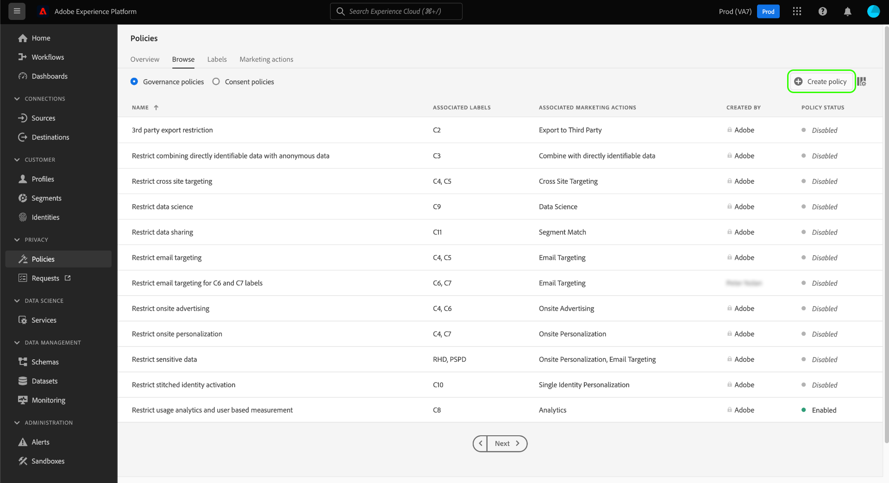
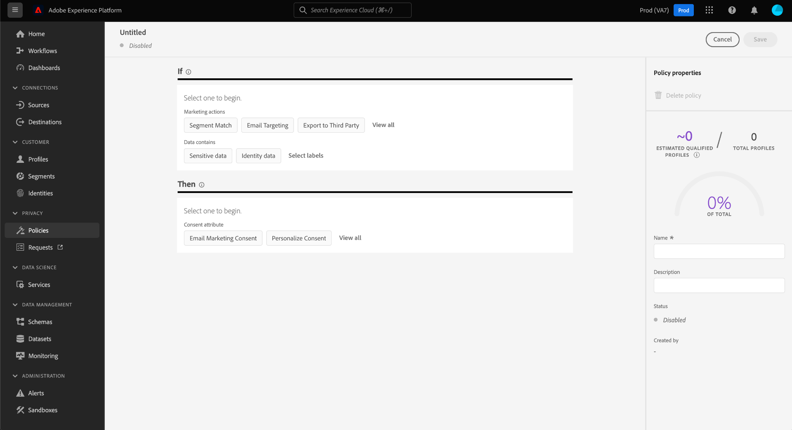
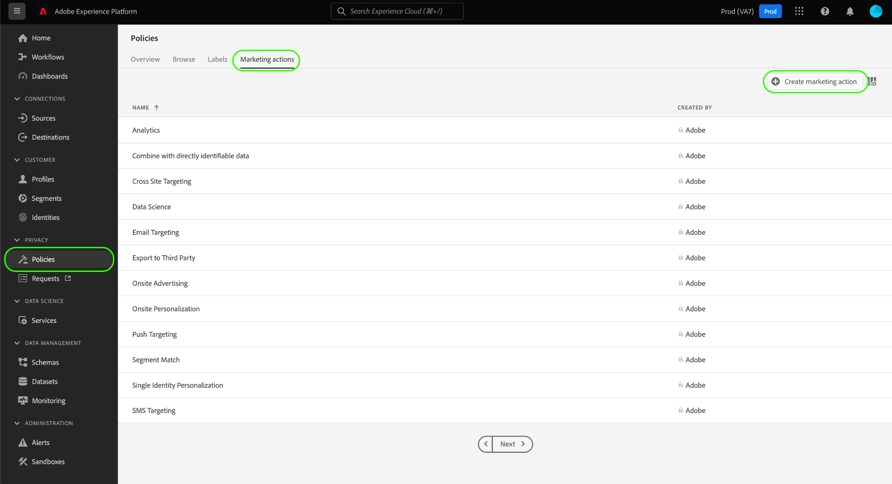
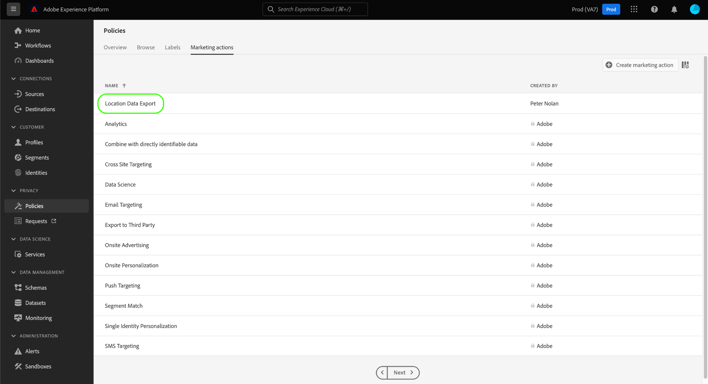

# UI에서 데이터 사용 정책 관리 {#user-guide}

>[!CONTEXTUALHELP]
>id="platform_privacyConsole_dataUsagePolicies_description"
>title="프로필 데이터에 고객 동의 통합 및 적용"
>abstract="<h2>설명</h2>
플랫폼을 사용하면 고객으로부터 수집한 동의 데이터를 해당 프로필에 통합할 수 있습니다. 그런 다음 동의 정책을 설정하여 이 데이터가 특정 대상에 대해 활성화된 세그먼트에 포함될 수 있는지 여부를 결정할 수 있습니다.
"

이 문서에서는 **[!UICONTROL 정책]** 데이터 사용 정책을 만들고 관리할 수 있는 Adobe Experience Platform UI의 작업 영역

>[!NOTE]
>
>UI에서 액세스 제어 정책을 관리하는 방법에 대한 자세한 내용은 [속성 기반 액세스 제어 UI 안내서](../../access-control/abac/ui/policies.md) 대신,

>[!IMPORTANT]
>
>모든 데이터 사용 정책(Adobe에서 제공하는 핵심 정책 포함)은 기본적으로 비활성화되어 있습니다. 개별 정책을 적용하여 시행하려면 해당 정책을 수동으로 활성화해야 합니다. 의 섹션을 참조하십시오. [정책 활성화](#enable) UI에서 이 작업을 수행하는 방법에 대한 절차.

## 전제 조건

이 안내서에서는 다음 사항을 잘 이해하고 있어야 합니다 [!DNL Experience Platform] 개념:

* [데이터 거버넌스](../home.md)
* [데이터 사용 정책](./overview.md)

## 기존 정책 보기 {#view-policies}

다음에서 [!DNL Experience Platform] UI, 선택 **[!UICONTROL 정책]** 을(를) 열려면 **[!UICONTROL 정책]** 작업 영역. 다음에서 **[!UICONTROL 찾아보기]** 탭에는 관련 레이블, 마케팅 작업 및 상태를 포함하여 사용 가능한 정책 목록이 표시됩니다.

동의 정책에 대한 액세스 권한이 있는 경우 다음을 선택합니다. **[!UICONTROL 동의 정책]** 에서 보려면 전환하십시오. [!UICONTROL 찾아보기] 탭.

설명 및 유형을 보려면 나열된 정책을 선택합니다. 사용자 지정 정책을 선택하면 추가 컨트롤이 표시되어 편집, 삭제 또는 [정책 활성화/비활성화](#enable).

## 사용자 지정 정책 만들기 {#create-policy}

새 사용자 지정 데이터 사용 정책을 만들려면 다음을 선택하십시오. **[!UICONTROL 정책 만들기]** 의 오른쪽 위 모서리 **[!UICONTROL 찾아보기]** 의 탭 **[!UICONTROL 정책]** 작업 영역.

동의 정책에 대한 Beta에 속하는지 여부에 따라 다음 중 하나가 발생합니다.

* Beta에 속하지 않으면 즉시 의 워크플로우로 이동합니다. [데이터 거버넌스 정책 만들기](#create-governance-policy).
* Beta의 일부인 경우 대화 상자에서 다음에 대한 추가 옵션을 제공합니다. [동의 정책 만들기](#consent-policy).
  

### 데이터 거버넌스 및 동의 정책을 함께 사용 {#combine-policies}

>[!NOTE]
>
>동의 정책은 현재 Adobe Healthcare Shield 또는 Adobe Privacy &amp; Security Shield를 구입한 조직에서만 사용할 수 있습니다.

거버넌스 및 동의 정책을 함께 사용하여 대상에 매핑된 대상을 제어하는 강력한 규칙을 만들 수 있습니다. 동의 정책은 기본적으로 포함되며, 이는 각 마케팅 경험에 포함될 수 있는 프로필을 지시함을 의미합니다. 반대로 거버넌스 정책은 레이블이 지정된 특정 속성의 사용을 활성화를 위해 구성되지 않도록 제외합니다.

이 비헤이비어를 사용하면 올바른 프로필을 포함하는 정책 및 동의 규칙의 조합을 설정할 수 있지만, 설정된 조직 규칙과 어긋나는 데이터를 포함하지 못합니다. 예를 들어 중요한 데이터를 포함하지 않으려 하지만, 여전히 소셜 미디어를 통해 마케팅을 위해 동의한 사용자를 타겟팅할 수 있는 시나리오가 있습니다. 이 시나리오에 필요한 단계는 아래 인포그래픽에 설명되어 있습니다.

### 데이터 거버넌스 정책 만들기 {#create-governance-policy}

다음 **[!UICONTROL 정책 만들기]** 워크플로가 나타납니다. 새 정책의 이름과 설명을 입력하여 시작합니다.

그런 다음 정책이 기준으로 사용할 데이터 사용 레이블을 선택합니다. 여러 레이블을 선택할 때 정책을 적용하기 위해 데이터에 모든 레이블을 포함할지 또는 한 개 레이블을 포함할지 선택하는 옵션이 제공됩니다. 선택 **[!UICONTROL 다음]** 완료 시.

다음 **[!UICONTROL 마케팅 액션 선택]** 단계가 나타납니다. 제공된 목록에서 적절한 마케팅 작업을 선택한 다음 을 선택합니다 **[!UICONTROL 다음]** 계속합니다.

>[!NOTE]
>
>여러 마케팅 작업을 선택할 때 정책은 이를 &quot;OR&quot; 규칙으로 해석합니다. 즉, 이 정책은 다음과 같은 경우에 적용됩니다. **임의** 선택한 마케팅 작업 중 하나가 수행됩니다.

다음 **[!UICONTROL 리뷰]** 새 정책을 만들기 전에 세부 사항을 검토할 수 있는 단계가 나타납니다. 만족스러우면 다음을 선택합니다 **[!UICONTROL 완료]** 을 클릭하여 정책을 생성합니다.

다음 **[!UICONTROL 찾아보기]** 이제 &quot;초안&quot; 상태에서 새로 생성된 정책이 나열된 탭이 다시 나타납니다. 정책을 활성화하려면 다음 섹션을 참조하십시오.

### 동의 정책 만들기 {#consent-policy}

>[!CONTEXTUALHELP]
>id="platform_privacyConsole_dataUsagePolicies_instructions"
>title="지침"
>abstract="<ul><li>동의를 위해 OneTrust 소스 커넥터 또는 표준 XDM 스키마를 통해 기본 설정 데이터를 유니온 스키마로 수집하는지 확인합니다.</li><li>선택 <a href="https://experienceleague.adobe.com/docs/experience-platform/data-governance/policies/overview.html?lang=ko">정책</a> 왼쪽 탐색에서 을(를) 선택합니다. <a href="https://experienceleague.adobe.com/docs/experience-platform/data-governance/policies/user-guide.html#create-governance-policy">정책 만들기</a>.</li><li>아래 <b>If</b> 섹션에서 정책 검사를 트리거할 조건 또는 작업을 설명합니다.</li><li>아래 <b>그러면</b> 섹션에서 정책을 트리거한 작업에 포함할 프로필에 대해 존재해야 하는 동의 속성을 입력합니다.</li><li>선택 <b>저장</b> 을 클릭하여 정책을 생성합니다. 정책을 사용하려면 다음을 선택합니다. <b>상태</b> 오른쪽 레일에서 전환합니다.</li><li>Experience Platform은 대상에 대한 세그먼트를 활성화할 때 활성화된 동의 정책을 자동으로 시행하며 각 정책이 대상 크기에 미치는 영향에 대한 세부 정보를 제공합니다.</li><li>이 기능에 대한 자세한 내용은 의 안내서를 참조하십시오. <a href="https://experienceleague.adobe.com/docs/experience-platform/data-governance/policies/user-guide.html?lang=ko#consent-policy">동의 정책 만들기</a> Experience League.</li></ul>"

>[!IMPORTANT]
>
>동의 정책은 구입한 조직에서만 사용할 수 있습니다. **Adobe 헬스케어 실드** 또는 **Adobe 개인정보 보호 및 보안 실드**.

동의 정책을 만들도록 선택한 경우 새 정책을 구성할 수 있는 새 화면이 나타납니다.

동의 정책을 사용하려면 프로필 데이터에 동의 속성이 있어야 합니다. 다음 안내서를 참조하십시오 [Experience Platform에서 동의 처리](../../landing/governance-privacy-security/consent/adobe/overview.md) 유니온 스키마에 필수 속성을 포함하는 방법에 대한 자세한 단계입니다.

동의 정책은 다음 두 가지 논리적 구성 요소로 구성됩니다.

* **[!UICONTROL If]**: 정책 검사를 트리거할 조건입니다. 이는 수행되는 특정 마케팅 작업, 특정 데이터 사용 레이블의 존재 또는 두 가지의 조합을 기반으로 할 수 있습니다.
* **[!UICONTROL 그러면]**: 정책을 트리거한 작업에 포함할 프로필에 대해 존재해야 하는 동의 속성입니다.

#### 조건 구성 {#consent-conditions}

>[!CONTEXTUALHELP]
>id="platform_governance_policies_consentif"
>title="If 조건"
>abstract="먼저 정책 검사를 트리거할 조건을 정의합니다. 조건에는 수행되는 특정 마케팅 작업, 제공되는 특정 데이터 거버넌스 레이블 또는 두 가지의 조합이 포함될 수 있습니다."

아래 **[!UICONTROL If]** 섹션에서 이 정책을 트리거해야 하는 마케팅 작업 및/또는 데이터 사용 레이블을 선택합니다. 선택 **[!UICONTROL 모두 보기]** 및 **[!UICONTROL 레이블 선택]** 사용 가능한 마케팅 작업과 레이블의 전체 목록을 각각 보려면

조건을 하나 이상 추가하면 다음을 선택할 수 있습니다. **[!UICONTROL 조건 추가]** 필요에 따라 조건을 계속 추가하려면 드롭다운에서 적절한 조건 유형을 선택합니다.

두 개 이상의 조건을 선택하는 경우 조건 사이에 나타나는 아이콘을 사용하여 &quot;AND&quot;와 &quot;OR&quot; 사이의 조건부 관계를 전환할 수 있습니다.

#### 동의 속성 선택 {#consent-attributes}

>[!CONTEXTUALHELP]
>id="platform_governance_policies_consentthen"
>title="Then 조건"
>abstract="&#39;If&#39; 조건이 정의되면 &#39;Then&#39; 섹션을 사용하여 유니온 스키마에서 하나 이상의 동의 속성을 선택합니다. 프로필이 이 정책이 제어하는 작업에 포함되려면 이 속성이 있어야 합니다."

아래 **[!UICONTROL 그러면]** 섹션에서 유니온 스키마에서 하나 이상의 동의 속성을 선택합니다. 프로필이 이 정책이 제어하는 작업에 포함되려면 이 속성이 있어야 합니다. 목록에서 제공된 옵션 중 하나를 선택하거나 **[!UICONTROL 모두 보기]** 유니온 스키마에서 속성을 직접 선택합니다.

동의 속성을 선택할 때 이 정책에서 확인할 속성의 값을 선택합니다.

하나 이상의 동의 속성을 선택한 후 **[!UICONTROL 정책 속성]** 전체 프로필 스토어의 비율을 포함하여 이 정책에서 허용되는 예상 프로필 수를 보여주는 패널 업데이트입니다. 이 추정은 정책 구성을 조정할 때 자동으로 업데이트됩니다.

정책에 동의 속성을 더 추가하려면 다음을 선택합니다. **[!UICONTROL 결과 추가]**.

필요에 따라 정책에 조건 및 동의 속성을 계속 추가 및 조정할 수 있습니다. 구성에 만족하면 선택하기 전에 정책의 이름과 선택적 설명을 입력합니다 **[!UICONTROL 저장]**.

이제 동의 정책이 만들어지고 상태가 로 설정됩니다. [!UICONTROL 비활성화됨] 기본적으로. 정책을 즉시 활성화하려면 다음을 선택합니다. **[!UICONTROL 상태]** 오른쪽 레일에서 전환합니다.

#### 정책 적용 확인

동의 정책을 만들고 활성화한 후 대상에 대한 세그먼트를 활성화할 때 동의한 대상자에 어떤 영향을 미치는지 미리 볼 수 있습니다. 의 섹션을 참조하십시오. [동의 정책 평가](../enforcement/auto-enforcement.md#consent-policy-evaluation) 추가 정보.

## 정책 활성화 또는 비활성화 {#enable}

모든 데이터 사용 정책(Adobe에서 제공하는 핵심 정책 포함)은 기본적으로 비활성화되어 있습니다. 개별 정책을 적용하여 시행하려면 API 또는 UI를 통해 해당 정책을 수동으로 활성화해야 합니다.

에서 정책을 활성화하거나 비활성화할 수 있습니다. **[!UICONTROL 찾아보기]** 의 탭 **[!UICONTROL 정책]** 작업 영역. 목록에서 사용자 지정 정책을 선택하여 오른쪽에 세부 정보를 표시합니다. 아래 **[!UICONTROL 상태]**, 토글 버튼을 선택하여 정책을 활성화하거나 비활성화합니다.

## 마케팅 액션 보기 {#view-marketing-actions}

다음에서 **[!UICONTROL 정책]** 작업 영역에서 **[!UICONTROL 마케팅 액션]** 탭으로 이동하여 Adobe 및 자체 조직에서 정의한 사용 가능한 마케팅 작업 목록을 볼 수 있습니다.

## 마케팅 액션 만들기 {#create-marketing-action}

새 사용자 지정 마케팅 작업을 만들려면 다음을 선택합니다. **[!UICONTROL 마케팅 액션 만들기]** 의 오른쪽 위 모서리 **[!UICONTROL 마케팅 액션]** 의 탭 **[!UICONTROL 정책]** 작업 영역.

다음 **[!UICONTROL 마케팅 액션 만들기]** 대화 상자가 나타납니다. 마케팅 액션의 이름과 설명을 입력한 다음 을 선택합니다 **[!UICONTROL 만들기]**.

새로 만든 작업이에 나타납니다. **[!UICONTROL 마케팅 액션]** 탭. 이제 다음과 같은 경우에 마케팅 작업을 사용할 수 있습니다. [새 데이터 사용 정책 만들기](#create-policy).

## 마케팅 액션 편집 또는 삭제 {#edit-delete-marketing-action}

>[!NOTE]
>
>조직에서 정의한 사용자 지정 마케팅 작업만 편집할 수 있습니다. Adobe이 정의한 마케팅 액션은 변경하거나 삭제할 수 없습니다.

다음에서 **[!UICONTROL 정책]** 작업 영역에서 **[!UICONTROL 마케팅 액션]** 탭으로 이동하여 Adobe 및 자체 조직에서 정의한 사용 가능한 마케팅 작업 목록을 볼 수 있습니다. 목록에서 사용자 지정 마케팅 작업을 선택한 다음 오른쪽 섹션에 제공된 필드를 사용하여 마케팅 작업의 세부 정보를 편집합니다.

마케팅 작업이 기존 사용 정책에서 사용되고 있지 않으면 을 선택하여 삭제할 수 있습니다. **[!UICONTROL 마케팅 액션 삭제]**.

>[!NOTE]
>
>기존 정책에서 사용 중인 마케팅 액션을 삭제하려고 하면 삭제 시도가 실패했음을 나타내는 오류 메시지가 표시됩니다.

## 다음 단계

이 문서는에서 데이터 사용 정책을 관리하는 방법에 대한 개요를 제공했습니다 [!DNL Experience Platform] UI. 을 사용하여 정책을 관리하는 방법에 대한 절차를 알아보려면 [!DNL Policy Service API], 다음을 참조하십시오. [개발자 안내서](../api/getting-started.md). 데이터 사용 정책을 적용하는 방법에 대한 자세한 내용은 [정책 시행 개요](../enforcement/overview.md).

다음 비디오는에서 사용 정책으로 작업하는 방법에 대해 보여 줍니다. [!DNL Experience Platform] UI:

>[!VIDEO](https://video.tv.adobe.com/v/32977?quality=12&learn=on)
