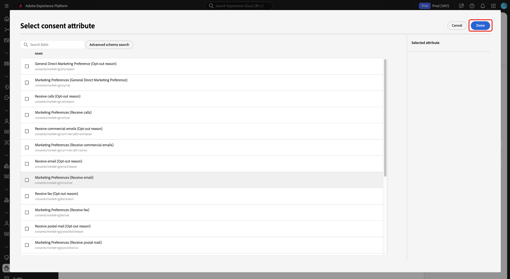
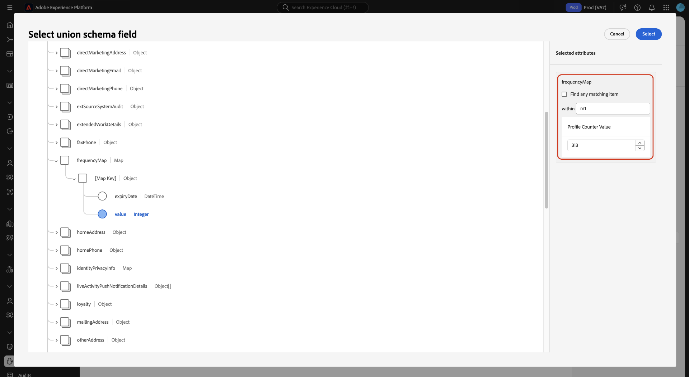
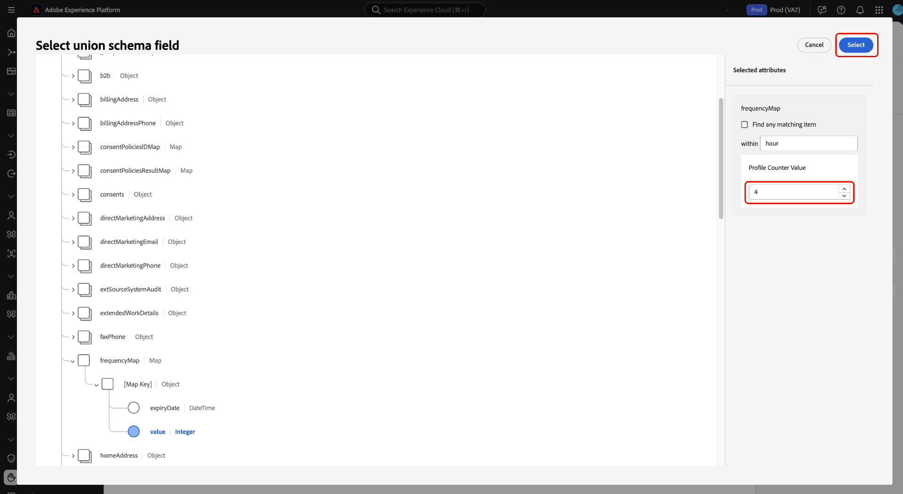

# UI에서 데이터 사용 정책 관리 {#user-guide}

>[!CONTEXTUALHELP]
>id="platform_privacyConsole_dataUsagePolicies_description"
>title="프로필 데이터에 고객 동의 통합 및 시행"
>abstract="<h2>설명</h2>
Experience Platform을 사용하면 고객으로부터 수집한 동의 데이터를 해당 프로필에 통합할 수 있습니다. 그런 다음 동의 정책을 설정하여 특정 대상에 대해 활성화된 세그먼트에 이 데이터를 포함할 수 있는지 여부를 결정할 수 있습니다.
"

이 문서에서는 Adobe Experience Platform UI에서 **[!UICONTROL Policies]** 작업 영역을 사용하여 데이터 사용 정책을 만들고 관리하는 방법을 다룹니다.

>[!NOTE]
>
>UI에서 액세스 제어 정책을 관리하는 방법에 대한 자세한 내용은 대신 [특성 기반 액세스 제어 UI 안내서](../../access-control/abac/ui/policies.md)를 참조하십시오.

>[!IMPORTANT]
>
>모든 데이터 사용 정책(Adobe에서 제공하는 핵심 정책 포함)은 기본적으로 비활성화되어 있습니다. 개별 정책을 적용하여 시행하려면 해당 정책을 수동으로 활성화해야 합니다. UI에서 이 작업을 수행하는 방법에 대한 단계는 [정책 활성화](#enable)의 섹션을 참조하십시오.

## 전제 조건

이 안내서를 사용하려면 다음 [!DNL Experience Platform] 개념을 이해하고 있어야 합니다.

* [데이터 거버넌스](../home.md)
* [데이터 사용 정책](./overview.md)

## 기존 정책 보기 {#view-policies}

[!DNL Experience Platform] UI에서 **[!UICONTROL Policies]**&#x200B;을(를) 선택하여 **[!UICONTROL Policies]** 작업 영역을 엽니다. **[!UICONTROL Browse]** 탭에서는 연결된 레이블, 마케팅 작업 및 상태를 포함하여 사용 가능한 정책 목록을 볼 수 있습니다.

동의 정책에 대한 액세스 권한이 있는 경우 **[!UICONTROL Consent policies]** 전환을 선택하여 [!UICONTROL Browse] 탭에서 확인하십시오.

설명 및 유형을 보려면 나열된 정책을 선택합니다. 사용자 지정 정책을 선택하면 정책을 편집, 삭제 또는 [활성화/비활성화](#enable)하기 위한 추가 컨트롤이 표시됩니다.

## 사용자 지정 정책 만들기 {#create-policy}

새 사용자 지정 데이터 사용 정책을 만들려면 **[!UICONTROL Create policy]** 작업 영역에서 **[!UICONTROL Browse]** 탭의 오른쪽 상단 모서리에서 **[!UICONTROL Policies]**&#x200B;을(를) 선택합니다.

[!UICONTROL Choose type of policy] 대화 상자가 나타납니다. [동의 정책](#consent-policy) 또는 [데이터 거버넌스 정책](#create-governance-policy)을 선택하십시오.

### 데이터 거버넌스 및 동의 정책을 함께 사용 {#combine-policies}

>[!NOTE]
>
>동의 정책은 현재 Adobe Healthcare Shield 또는 Adobe Privacy &amp; Security Shield를 구입한 조직에서만 사용할 수 있습니다.

거버넌스 및 동의 정책을 함께 사용하여 대상에 매핑된 대상을 제어하는 강력한 규칙을 만들 수 있습니다. 동의 정책은 기본적으로 포함되며, 이는 각 마케팅 경험에 포함될 수 있는 프로필을 지시함을 의미합니다. 반대로 거버넌스 정책은 레이블이 지정된 특정 속성의 사용을 활성화를 위해 구성되지 않도록 제외합니다.

이 비헤이비어를 사용하면 올바른 프로필을 포함하는 정책 및 동의 규칙의 조합을 설정할 수 있지만, 설정된 조직 규칙과 어긋나는 데이터를 포함하지 못합니다. 예를 들어 중요한 데이터를 포함하지 않으려 하지만, 여전히 소셜 미디어를 통해 마케팅을 위해 동의한 사용자를 타겟팅할 수 있는 시나리오가 있습니다. 이 시나리오에 필요한 단계는 아래 인포그래픽에 설명되어 있습니다.

### 데이터 거버넌스 정책 만들기 {#create-governance-policy}

**[!UICONTROL Create policy]** 워크플로가 나타납니다. 새 정책의 이름과 설명을 입력하여 시작합니다.

그런 다음 정책이 기준으로 사용할 데이터 사용 레이블을 선택합니다. 여러 레이블을 선택할 때 정책을 적용하기 위해 데이터에 모든 레이블을 포함할지 또는 한 개 레이블을 포함할지 선택하는 옵션이 제공됩니다. 완료되면 **[!UICONTROL Next]**&#x200B;을 선택합니다.

**[!UICONTROL Select marketing actions]** 단계가 나타납니다. 제공된 목록에서 적절한 마케팅 작업을 선택한 다음 **[!UICONTROL Next]**&#x200B;을(를) 선택하여 계속합니다.

>[!NOTE]
>
>여러 마케팅 작업을 선택할 때 정책은 이를 &quot;OR&quot; 규칙으로 해석합니다. 즉, 선택한 마케팅 작업 중 **any**&#x200B;을(를) 수행하면 정책이 적용됩니다.

**[!UICONTROL Review]** 단계가 표시되어 새 정책을 만들기 전에 자세한 내용을 검토할 수 있습니다. 만족하면 **[!UICONTROL Finish]**&#x200B;을(를) 선택하여 정책을 만듭니다.

이제 새로 만든 정책이 &quot;초안&quot; 상태로 나열되는 **[!UICONTROL Browse]** 탭이 다시 나타납니다. 정책을 활성화하려면 다음 섹션을 참조하십시오.

### 동의 정책 만들기 {#consent-policy}

>[!CONTEXTUALHELP]
>id="platform_privacyConsole_dataUsagePolicies_instructions"
>title="지침"
>abstract="<ul><li>동의를 위해 OneTrust 소스 커넥터 또는 표준 XDM 스키마를 통해 환경 설정 데이터를 통합 스키마로 수집하고 있는지 확인하십시오.</li><li>왼쪽 탐색 메뉴에서 <a href="https://experienceleague.adobe.com/docs/experience-platform/data-governance/policies/overview.html?lang=ko">정책</a>을 선택한 다음 <a href="https://experienceleague.adobe.com/docs/experience-platform/data-governance/policies/user-guide.html#create-governance-policy">정책 만들기</a>를 선택합니다.</li><li><b>If</b> 섹션에서 정책 확인을 트리거할 조건 또는 작업을 설명합니다.</li><li><b>Then</b> 섹션에서 프로필이 정책을 트리거한 작업에 포함되기 위해 있어야 하는 동의 속성을 입력합니다.</li><li><b>저장</b>을 선택하여 정책을 생성합니다. 정책을 활성화하려면 오른쪽 레일에서 <b>상태</b> 토글을 선택합니다.</li><li>Experience Platform은 대상에 대한 세그먼트를 활성화할 때 활성화된 동의 정책을 자동으로 적용하고 각 정책이 대상자 크기에 미치는 영향에 대한 세부 정보를 제공합니다.</li><li>이 기능에 대한 자세한 내용은 Experience League의 <a href="https://experienceleague.adobe.com/docs/experience-platform/data-governance/policies/user-guide.html?lang=ko#consent-policy">동의 정책 생성</a> 안내서를 참조하십시오.</li></ul>"

>[!IMPORTANT]
>
>동의 정책은 **Adobe Healthcare Shield** 또는 **Adobe Privacy &amp; Security Shield**&#x200B;를 구입한 조직에서만 사용할 수 있습니다.

동의 정책을 만들도록 선택한 경우 새 정책을 구성할 수 있는 새 화면이 나타납니다.

동의 정책을 사용하려면 프로필 데이터에 동의 속성이 있어야 합니다. 유니온 스키마에 필수 특성을 포함하는 방법에 대한 자세한 단계는 [Experience Platform의 동의 처리](../../landing/governance-privacy-security/consent/adobe/overview.md)에 대한 안내서를 참조하십시오.

동의 정책은 다음 두 가지 논리적 구성 요소로 구성됩니다.

* **[!UICONTROL If]**: 정책 검사를 트리거할 조건입니다. 이는 수행되는 특정 마케팅 작업, 특정 데이터 사용 레이블의 존재 또는 두 가지의 조합을 기반으로 할 수 있습니다.
* **[!UICONTROL Then]**: 정책을 트리거한 작업에 포함할 프로필에 대한 동의 특성입니다.

>[!NOTE]
>
>동의 정책은 다양한 필드 유형 및 연산자와 함께 고급 규칙 빌드를 지원합니다. 지원되는 필드 형식, 연산자 및 규칙 작성 예제에 대한 전체 참조는 [동의 정책 규칙 참조](./consent-policy-rule-building-reference.md)를 참조하십시오.

#### 조건 구성 {#consent-conditions}

>[!CONTEXTUALHELP]
>id="platform_governance_policies_consentif"
>title="If 조건"
>abstract="정책 확인을 트리거할 조건을 정의하여 시작하십시오. 조건에는 수행되는 특정 마케팅 작업, 제공되는 특정 데이터 거버넌스 레이블 또는 두 가지의 조합이 포함될 수 있습니다. AND/OR 논리를 사용하여 여러 조건 간에 복잡한 조건부 관계를 만듭니다."

**[!UICONTROL If]** 섹션에서 이 정책을 트리거해야 하는 마케팅 작업 및/또는 데이터 사용 레이블을 선택합니다. 사용 가능한 마케팅 작업과 레이블의 전체 목록을 보려면 각각 **[!UICONTROL View all]** 및 **[!UICONTROL Select labels]**&#x200B;을(를) 선택하십시오.

조건을 하나 이상 추가한 후에는 **[!UICONTROL Add condition]**&#x200B;을(를) 선택하여 필요에 따라 조건을 계속 추가하고 드롭다운에서 적절한 조건 유형을 선택할 수 있습니다.

두 개 이상의 조건을 선택하는 경우 조건 사이에 나타나는 아이콘을 사용하여 &quot;AND&quot;와 &quot;OR&quot; 사이의 조건부 관계를 전환할 수 있습니다.

#### 동의 속성 선택 {#consent-attributes}

>[!CONTEXTUALHELP]
>id="platform_governance_policies_consentthen"
>title="Then 조건"
>abstract="&#39;If&#39; 조건이 정의되면 &#39;Then&#39; 섹션을 사용하여 통합 스키마에서 하나 이상의 동의 속성을 선택합니다. 규칙 빌드를 위한 기본 필드(문자열, 숫자, 부울 등)에 도달하려면 컨테이너 필드(객체, 맵, 배열)를 탐색해야 합니다. 이 기본 필드는 프로필이 이 정책이 제어하는 작업에 포함되기 위해 존재해야 하는 속성입니다."

**[!UICONTROL Then]** 섹션 아래에서 유니온 스키마에서 동의 특성을 하나 이상 선택합니다. 프로필이 이 정책이 제어하는 작업에 포함되려면 이 속성이 있어야 합니다. 제안된 옵션 중 하나를 선택하거나 **[!UICONTROL View all]**&#x200B;을(를) 선택하여 공용 구조체 스키마에서 직접 특성을 선택할 수 있습니다.

>[!NOTE]
>
>동의 정책은 기본 필드 유형(문자열, 숫자, 부울, 날짜)과 컨테이너 유형(개체, 맵, 배열)을 지원합니다. 컨테이너로 이동하여 특정 속성을 선택하고 AND/OR 논리를 적용하여 규칙을 결합할 수 있습니다. 지원되는 필드 형식, 연산자 및 규칙 작성 예제에 대한 전체 참조는 [동의 정책 규칙 작성 참조](./consent-policy-rule-building-reference.md)를 참조하십시오.

**[!UICONTROL View all]**&#x200B;을(를) 선택하면 **[!UICONTROL Select consent attribute]** 대화 상자가 나타납니다. 이 정책에서 확인할 동의 속성을 선택합니다. 또는 이 대화 상자에서 **[!UICONTROL Advanced Schema search]**&#x200B;을(를) 선택하여 정책의 일부로 평가할 중첩된 기본 필드를 선택할 수 있습니다. 설정을 확인하려면 **[!UICONTROL Done]**&#x200B;을(를) 선택하세요.

### 고급 스키마 검색 {#advanced-schema-search}

**[!UICONTROL Select consent attribute]** 대화 상자에서 **[!UICONTROL Advanced Schema search]**&#x200B;을(를) 선택하여 **[!UICONTROL Select union schema field]** 대화 상자를 엽니다. 이 보기에서 문자열, 숫자, 부울 및 날짜와 같은 기본 필드 유형과 객체, 맵 및 배열과 같은 컨테이너 유형의 루트 레벨 또는 중첩된 속성을 선택합니다.

#### 정책 조건에 대한 고정 값 필드 {#fixed-value-fields}

고정 값 필드를 정책 조건으로 선택하면 [!UICONTROL Selected attributes] 패널에 데이터 스키마에 정의된 사전 정의된 값이 표시됩니다.

>[!NOTE]
>
>필드가 고정된 값 세트(예: 열거형 또는 기타 제어된 어휘형)로 구성된 경우, 정책 빌더는 조건이 유효하고 표준화된 데이터에 대해서만 평가되도록 해당 제한을 적용합니다.

데이터 품질과 일관성을 유지하기 위해 UI는 이러한 값을 자유 텍스트 필드가 아닌 선택 가능한 확인란으로 렌더링합니다. 이 접근 방식은 수동 유효성 검사를 줄이고 동의 정책이 데이터를 안정적으로 평가하는 데 도움이 됩니다.

조건을 정의하려면 정책을 평가할 값의 확인란을 선택합니다.

#### 정책 조건에 대한 데이터 유형 필드 매핑 {#map-data-type-fields}

맵 데이터 형식에 포함된 기본 필드를 선택하면 **[!UICONTROL Selected attributes]** 패널에 추가 구성 옵션이 나타납니다. 이러한 옵션을 사용하여 각 키에 대해 별도의 정책을 사용하지 않고도 여러 키에 대해 동의 검사를 구성할 수 있습니다. 이 구성 방법은 만들어야 하는 정책의 수를 줄여 정책 관리를 단순화합니다.

##### 맵 데이터 유형 속성 구성 {#configure-map-attributes}

맵 유형 속성을 구성하려면 아래 단계를 수행합니다.

유니온 스키마 다이어그램에서 맵 데이터 유형에 포함된 원시 필드(예: 문자열 또는 숫자)를 선택합니다. **[!UICONTROL Selected attributes]** 패널이 업데이트되어 해당 필드에 대한 추가 구성 옵션이 표시됩니다.

**[!UICONTROL Selected attributes]** 패널에서 **[!UICONTROL Find any matching item]** 확인란을 선택하거나 선택을 취소하여 정책이 맵 키를 평가하는 방법을 구성합니다.

| 옵션 | 작업 | 정책 동작 |
| --- | --- | --- |
| **[!UICONTROL Find any matching item]** 확인란은 **선택됨**&#x200B;입니다. | **[!UICONTROL within]** 텍스트 필드를 사용할 수 없습니다. | 정책에서 맵 내의 **모든 키**&#x200B;를 확인합니다. 중첩된 필드가 값 조건을 충족하는 모든 키는 정책의 일치로 간주됩니다. 이 기능은 동적으로 입력된 속성 간에 글로벌 규정 준수를 적용하는 데 유용합니다. |
| **[!UICONTROL Find any matching item]** 확인란은 **선택되지 않음**&#x200B;입니다. | **[!UICONTROL within]** 텍스트 필드에 특정 키 이름을 입력해야 합니다. | 정책은 **[!UICONTROL within]** 필드에 지정된 맵 키만 확인합니다. 특정 키의 중첩된 필드가 정의된 값을 충족하는 프로필만 일치합니다. 특정 프로그램 또는 빈도 키(예: `frequencyMap.m1`)를 대상으로 하는 정책에 유용합니다. |

정책이 평가해야 하는 선택한 원시 필드의 값을 입력합니다. 예를들어 필드 형식이 `Integer`이면 숫자 값을 입력하십시오.

구성을 확인하고 정책 빌더로 돌아가려면 **[!UICONTROL Select]**&#x200B;을(를) 선택하십시오.

하나 이상의 동의 속성을 선택하면 **[!UICONTROL Policy properties]** 패널이 업데이트되어 프로필 스토어에서 영향을 받는 프로필의 비율과 함께 이 정책에 포함된 예상 프로필 수를 표시합니다. 예상 프로필 수는 정책 구성을 변경할 때 자동으로 업데이트됩니다.

동의 특성을 추가하려면 **[!UICONTROL Add result]**&#x200B;을(를) 선택하십시오. 이렇게 하면 해당 속성을 기반으로 프로필을 포함하기 위한 다른 규칙이 만들어집니다.

>[!NOTE]
>
>기존 특성을 편집하려면 특성 이름을 선택한 다음 연필 아이콘(). 변경할 수 있는 **[!UICONTROL Select union schema field]** 대화 상자가 열립니다.
>
>

정책이 요구 사항과 일치할 때까지 조건 및 동의 속성을 계속 추가하거나 조정합니다. 완료되면 이름과 (선택 사항) 설명을 입력한 다음 **[!UICONTROL Save]**&#x200B;을(를) 선택하여 정책을 만듭니다.

이제 동의 정책이 만들어졌으며 해당 상태는 기본적으로 [!UICONTROL Disabled]&#x200B;(으)로 설정됩니다. 정책을 즉시 활성화하려면 오른쪽 레일에서 **[!UICONTROL Status]** 토글을 선택합니다.

#### 정책 적용 확인

동의 정책을 만들고 활성화한 후 대상에 대한 세그먼트를 활성화할 때 동의한 대상자에 어떤 영향을 미치는지 미리 볼 수 있습니다. 자세한 내용은 [동의 정책 평가](../enforcement/auto-enforcement.md#consent-policy-evaluation)의 섹션을 참조하십시오.

## 정책 활성화 또는 비활성화 {#enable}

모든 데이터 사용 정책(Adobe에서 제공하는 핵심 정책 포함)은 기본적으로 비활성화되어 있습니다. 개별 정책을 적용하여 시행하려면 API 또는 UI를 통해 해당 정책을 수동으로 활성화해야 합니다.

**[!UICONTROL Browse]** 작업 영역의 **[!UICONTROL Policies]** 탭에서 정책을 활성화하거나 비활성화할 수 있습니다. 목록에서 사용자 지정 정책을 선택하여 오른쪽에 세부 정보를 표시합니다. **[!UICONTROL Status]**&#x200B;에서 정책을 활성화하거나 비활성화하려면 전환 단추를 선택하십시오.

## 마케팅 액션 보기 {#view-marketing-actions}

**[!UICONTROL Policies]** 작업 영역에서 **[!UICONTROL Marketing actions]** 탭을 선택하여 Adobe 및 조직에서 정의한 사용 가능한 마케팅 작업 목록을 확인합니다.

## 마케팅 액션 만들기 {#create-marketing-action}

새 사용자 지정 마케팅 작업을 만들려면 **[!UICONTROL Create marketing action]** 작업 영역에서 **[!UICONTROL Marketing actions]** 탭의 오른쪽 상단 모서리에서 **[!UICONTROL Policies]**&#x200B;을(를) 선택합니다.

**[!UICONTROL Create marketing action]** 대화 상자가 나타납니다. 마케팅 액션의 이름과 설명을 입력한 다음 **[!UICONTROL Create]**&#x200B;을(를) 선택합니다.

새로 만든 작업이 **[!UICONTROL Marketing actions]** 탭에 나타납니다. 이제 [새 데이터 사용 정책을 만드는 중](#create-policy)에 마케팅 작업을 사용할 수 있습니다.

## 마케팅 액션 편집 또는 삭제 {#edit-delete-marketing-action}

>[!NOTE]
>
>조직에서 정의한 사용자 지정 마케팅 작업만 편집할 수 있습니다. Adobe에서 정의한 마케팅 액션은 변경하거나 삭제할 수 없습니다.

**[!UICONTROL Policies]** 작업 영역에서 **[!UICONTROL Marketing actions]** 탭을 선택하여 Adobe 및 조직에서 정의한 사용 가능한 마케팅 작업 목록을 확인합니다. 목록에서 사용자 지정 마케팅 작업을 선택한 다음 오른쪽 섹션에 제공된 필드를 사용하여 마케팅 작업의 세부 정보를 편집합니다.

마케팅 작업이 기존 사용 정책에서 사용되지 않는 경우 **[!UICONTROL Delete marketing action]**&#x200B;을(를) 선택하여 삭제할 수 있습니다.

>[!NOTE]
>
>기존 정책에서 사용 중인 마케팅 액션을 삭제하려고 하면 삭제 시도가 실패했음을 나타내는 오류 메시지가 표시됩니다.

## 다음 단계

이 문서에서는 [!DNL Experience Platform] UI의 데이터 사용 정책을 관리하는 방법에 대한 개요를 제공했습니다. [!DNL Policy Service API]을(를) 사용하여 정책을 관리하는 방법에 대한 단계는 [개발자 안내서](../api/getting-started.md)를 참조하십시오. 데이터 사용 정책을 적용하는 방법에 대한 자세한 내용은 [정책 적용 개요](../enforcement/overview.md)를 참조하세요.

다음 비디오에서는 [!DNL Experience Platform] UI에서 사용 정책으로 작업하는 방법에 대해 보여 줍니다.

>[!VIDEO](https://video.tv.adobe.com/v/32977?quality=12&learn=on)
