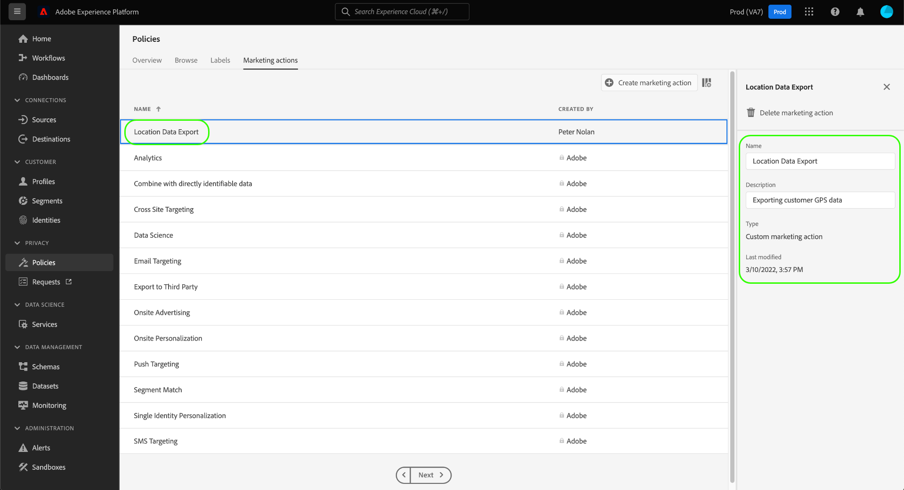

# UI에서 데이터 사용 정책 관리 {#user-guide}

>[!CONTEXTUALHELP]
>id="platform_privacyConsole_dataUsagePolicies_description"
>title="설명"
>abstract=""

이 문서에서는 **[!UICONTROL 정책]** 작업 공간 을 사용하여 데이터 사용 정책을 만들고 관리합니다.

>[!NOTE]
>
>UI에서 액세스 제어 정책을 관리하는 방법에 대한 자세한 내용은 [특성 기반 액세스 제어 UI 안내서](../../access-control/abac/ui/policies.md) 을 가리키도록 업데이트하는 것이 좋습니다.

>[!IMPORTANT]
>
>모든 데이터 사용 정책(Adobe에서 제공하는 핵심 정책 포함)은 기본적으로 비활성화됩니다. 개별 정책을 적용 대상으로 고려하려면 해당 정책을 수동으로 활성화해야 합니다. 의 섹션을 참조하십시오. [정책 활성화](#enable) ui에서 이 작업을 수행하는 방법에 대한 절차를 설명합니다.

## 사전 요구 사항

이 안내서에서는 다음을 이해하기 위해 작업해야 합니다 [!DNL Experience Platform] 개념:

* [데이터 거버넌스](../home.md)
* [데이터 사용 정책](./overview.md)

## 기존 정책 보기 {#view-policies}

에서 [!DNL Experience Platform] UI, 선택 **[!UICONTROL 정책]** 열다 **[!UICONTROL 정책]** 작업 공간. 에서 **[!UICONTROL 찾아보기]** 탭에서는 관련 레이블, 마케팅 작업 및 상태 등 사용 가능한 정책 목록을 볼 수 있습니다.

동의 정책에 액세스할 수 있는 경우 **[!UICONTROL 동의 정책]** 에서 보려는 전환 [!UICONTROL 찾아보기] 탭.

나열된 정책을 선택하여 설명 및 유형을 확인합니다. 사용자 지정 정책을 선택하면 편집, 삭제 또는 삭제할 추가 컨트롤이 표시됩니다 [정책 활성화/비활성화](#enable).

## 사용자 지정 정책 만들기 {#create-policy}

새 사용자 지정 데이터 사용 정책을 만들려면 **[!UICONTROL 정책 만들기]** 의 오른쪽 상단 모서리에서 **[!UICONTROL 찾아보기]** 탭에서 다음을 수행합니다. **[!UICONTROL 정책]** 작업 공간.

동의 정책을 위해 베타 버전에 포함되는지 여부에 따라 다음 중 하나가 발생합니다.

* 베타에 속하지 않으면에 대해 즉시 워크플로우로 이동합니다 [데이터 거버넌스 정책 만들기](#create-governance-policy).
* 베타 버전인 경우 대화 상자에서 다음과 같은 추가 옵션을 제공합니다 [동의 정책 만들기](#consent-policy).
   

### 데이터 거버넌스 정책 만들기 {#create-governance-policy}

다음 **[!UICONTROL 정책 만들기]** 워크플로우가 나타납니다. 먼저 새 정책의 이름과 설명을 입력합니다.

그런 다음 정책이 기반으로 할 데이터 사용 레이블을 선택합니다. 여러 레이블을 선택할 때 정책을 적용하려면 데이터에 모든 레이블을 포함해야 하는지 아니면 레이블 중 하나만 포함해야 하는지를 선택하는 옵션이 제공됩니다. 선택 **[!UICONTROL 다음]** 완료됨.

다음 **[!UICONTROL 마케팅 작업 선택]** 단계가 나타납니다. 제공된 목록에서 적절한 마케팅 작업을 선택한 다음 을 선택합니다 **[!UICONTROL 다음]** 계속하십시오.

>[!NOTE]
>
>여러 마케팅 작업을 선택하면 정책이 해당 작업을 &quot;OR&quot; 규칙으로 해석합니다. 즉, 이 정책은 **임의** 선택한 마케팅 작업이 수행됩니다.

다음 **[!UICONTROL 검토]** 새 정책을 만들기 전에 세부 사항을 검토할 수 있는 단계가 나타납니다. 만족하면 을 선택합니다 **[!UICONTROL 완료]** 정책을 만들려면

다음 **[!UICONTROL 찾아보기]** 탭이 다시 나타납니다. 그러면 새로 생성된 정책이 &quot;초안&quot; 상태로 나열됩니다. 정책을 활성화하려면 다음 섹션을 참조하십시오.

### 동의 정책 만들기 {#consent-policy}

>[!CONTEXTUALHELP]
>id="platform_privacyConsole_dataUsagePolicies_instructions"
>title="지침"
>abstract=""

>[!IMPORTANT]
>
>동의 정책은 구입한 조직에만 사용할 수 있습니다 **Adobe 의료 보호** 또는 **Adobe 개인 정보 보호 및 보안 차단**.

동의 정책을 만들도록 선택한 경우 새 정책을 구성할 수 있는 새 화면이 나타납니다.

동의 정책을 사용하려면 프로필 데이터에 동의 속성이 있어야 합니다. 다음 안내서를 참조하십시오. [Experience Platform의 동의 처리](../../landing/governance-privacy-security/consent/adobe/overview.md) 를 참조하십시오.

동의 정책은 두 개의 논리 구성 요소로 구성됩니다.

* **[!UICONTROL If]**: 정책 확인을 트리거할 조건입니다. 이는 수행되는 특정 마케팅 작업, 특정 데이터 사용 레이블 존재 여부 또는 두 가지 조합을 기반으로 할 수 있습니다.
* **[!UICONTROL Then]**: 정책을 트리거한 작업에 프로필을 포함하기 위해 존재해야 하는 동의 속성입니다.

#### 조건 구성 {#consent-conditions}

>[!CONTEXTUALHELP]
>id="platform_governance_policies_consentif"
>title="If 조건"
>abstract="정책 확인을 트리거할 조건을 정의하여 시작하십시오. 조건에는 수행 중인 특정 마케팅 조치, 존재하는 특정 데이터 거버넌스 레이블 또는 이 둘의 조합이 포함될 수 있습니다."

아래에 **[!UICONTROL If]** 섹션에서 이 정책을 트리거해야 하는 마케팅 작업 및/또는 데이터 사용 레이블을 선택합니다. 선택 **[!UICONTROL 모두 보기]** 및 **[!UICONTROL 레이블 선택]** 사용 가능한 마케팅 작업 및 레이블의 전체 목록을 각각 보려면

조건을 한 개 이상 추가하면 **[!UICONTROL 조건 추가]** 필요에 따라 추가 조건을 계속 추가하려면 드롭다운에서 해당 조건 유형을 선택합니다.

두 개 이상의 조건을 선택하는 경우 두 조건 사이에 표시되는 아이콘을 사용하여 &quot;AND&quot;와 &quot;OR&quot; 사이의 조건부 관계를 전환할 수 있습니다.

#### 동의 속성 선택 {#consent-attributes}

>[!CONTEXTUALHELP]
>id="platform_governance_policies_consentthen"
>title="Then 조건"
>abstract="&#39;If&#39; 조건이 정의되면 &#39;Then&#39; 섹션을 사용하여 통합 스키마에서 하나 이상의 동의 속성을 선택합니다. 이 정책이 적용되는 작업에 프로필을 포함하려면 이 속성이 있어야 합니다."

아래에 **[!UICONTROL Then]** 섹션에서 결합 스키마에서 하나 이상의 동의 속성을 선택합니다. 이 정책이 적용되는 작업에 프로필을 포함하려면 이 속성이 있어야 합니다. 목록에서 제공된 옵션 중 하나를 선택하거나 을(를) 선택할 수 있습니다 **[!UICONTROL 모두 보기]** 를 눌러 결합 스키마에서 직접 속성을 선택합니다.

동의 속성을 선택할 때 이 정책을 확인할 속성 값을 선택합니다.

하나 이상의 동의 속성을 선택한 후에는 **[!UICONTROL 정책 속성]** 패널 업데이트: 전체 프로필 저장소의 백분율을 포함하여 이 정책에 따라 허용되는 예상 프로필 수를 표시합니다. 이 추정은 정책 구성을 조정할 때 자동으로 업데이트됩니다.

정책에 동의 속성을 추가하려면 **[!UICONTROL 결과 추가]**.

필요에 따라 정책에 조건 및 동의 속성을 계속 추가하고 조정할 수 있습니다. 구성에 만족하면 선택하기 전에 정책에 대한 이름과 선택적 설명을 제공합니다 **[!UICONTROL 저장]**.

이제 동의 정책이 생성되고 상태는 [!UICONTROL 비활성화됨] 기본적으로 제공됩니다. 정책을 바로 사용하려면 **[!UICONTROL 상태]** 오른쪽 레일에서 전환합니다.

#### 정책 적용 확인

동의 정책을 만들고 활성화한 후 세그먼트를 대상으로 활성화할 때 동의한 대상에 미치는 영향을 미리 볼 수 있습니다. 의 섹션을 참조하십시오. [동의 정책 평가](../enforcement/auto-enforcement.md#consent-policy-evaluation) 추가 정보.

## 정책 활성화 또는 비활성화 {#enable}

모든 데이터 사용 정책(Adobe에서 제공하는 핵심 정책 포함)은 기본적으로 비활성화됩니다. 개별 정책이 적용을 위해 고려되도록 하려면 API 또는 UI를 통해 해당 정책을 수동으로 활성화해야 합니다.

에서 정책을 활성화하거나 비활성화할 수 있습니다 **[!UICONTROL 찾아보기]** 탭에서 다음을 수행합니다. **[!UICONTROL 정책]** 작업 공간. 목록에서 사용자 지정 정책을 선택하여 오른쪽에 해당 세부 사항을 표시합니다. 아래 **[!UICONTROL 상태]**&#x200B;을(를) 선택하고 전환 버튼을 선택하여 정책을 활성화하거나 비활성화합니다.

## 마케팅 작업 보기 {#view-marketing-actions}

에서 **[!UICONTROL 정책]** 작업 영역에서 **[!UICONTROL 마케팅 작업]** 탭하여 Adobe 및 자체 조직에 의해 정의된 사용 가능한 마케팅 작업 목록을 볼 수 있습니다.

## 마케팅 작업 만들기 {#create-marketing-action}

새 사용자 지정 마케팅 작업을 만들려면 **[!UICONTROL 마케팅 작업 만들기]** 의 오른쪽 상단 모서리에서 **[!UICONTROL 마케팅 작업]** 탭에서 다음을 수행합니다. **[!UICONTROL 정책]** 작업 공간.

다음 **[!UICONTROL 마케팅 작업 만들기]** 대화 상자가 나타납니다. 마케팅 작업의 이름과 설명을 입력한 다음 **[!UICONTROL 만들기]**.

새로 만든 작업이 **[!UICONTROL 마케팅 작업]** 탭. 이제 다음의 경우에 마케팅 작업을 사용할 수 있습니다 [새 데이터 사용 정책 만들기](#create-policy).

## 마케팅 작업 편집 또는 삭제 {#edit-delete-marketing-action}

>[!NOTE]
>
>조직에서 정의한 사용자 지정 마케팅 작업만 편집할 수 있습니다. Adobe이 정의한 마케팅 작업은 변경하거나 삭제할 수 없습니다.

에서 **[!UICONTROL 정책]** 작업 영역에서 **[!UICONTROL 마케팅 작업]** 탭하여 Adobe 및 자체 조직에 의해 정의된 사용 가능한 마케팅 작업 목록을 볼 수 있습니다. 목록에서 사용자 지정 마케팅 작업을 선택한 다음 오른쪽 섹션에서 제공된 필드를 사용하여 마케팅 작업의 세부 사항을 편집합니다.

마케팅 작업을 기존 사용 정책에서 사용하지 않는 경우 을 선택하여 삭제할 수 있습니다 **[!UICONTROL 마케팅 작업 삭제]**.

>[!NOTE]
>
>기존 정책에서 사용 중인 마케팅 작업을 삭제하려고 하면 삭제 시도가 실패했음을 나타내는 오류 메시지가 표시됩니다.

## 다음 단계

이 문서에서는 [!DNL Experience Platform] UI. 를 사용하여 정책을 관리하는 방법에 대한 절차 [!DNL Policy Service API]를 참조하고 [개발자 안내서](../api/getting-started.md). 데이터 사용 정책을 적용하는 방법에 대한 자세한 내용은 [정책 적용 개요](../enforcement/overview.md).

다음 비디오에서는 의 사용 정책을 사용하는 방법에 대한 데모를 제공합니다 [!DNL Experience Platform] UI:

>[!VIDEO](https://video.tv.adobe.com/v/32977?quality=12&learn=on)
