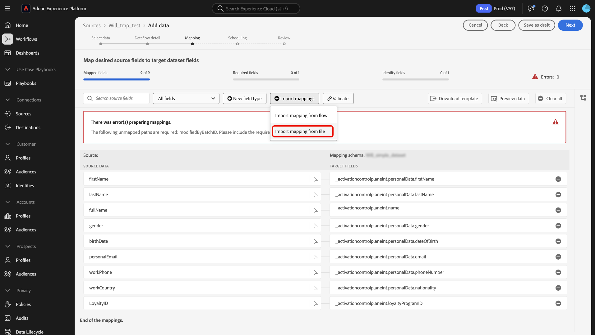

# 데이터 준비 UI 안내서

Adobe Experience Platform 사용자 인터페이스에서 [데이터 준비](../home.md) 매핑 함수를 사용하여 CSV 파일을 [XDM(Experience Data Model) 스키마](../../xdm/home.md)에 매핑하는 방법에 대해 알아보려면 이 안내서를 참조하십시오.

## 시작하기

이 자습서에서는 다음 플랫폼 구성 요소를 이해하고 있어야 합니다.

* [[!DNL Experience Data Model (XDM)] 시스템](../../xdm/home.md): 플랫폼에서 고객 경험 데이터를 구성하는 표준화된 프레임워크입니다.
   * [스키마 컴포지션의 기본 사항](../../xdm/schema/composition.md): 스키마 컴포지션의 주요 원칙 및 모범 사례를 포함하여 XDM 스키마의 기본 구성 요소에 대해 알아봅니다.
   * [스키마 편집기 튜토리얼](../../xdm/tutorials/create-schema-ui.md): 스키마 편집기 UI를 사용하여 사용자 지정 스키마를 만드는 방법을 알아봅니다.
* [ID 서비스](../../identity-service/home.md): 장치 및 시스템 간에 ID를 연결하여 개별 고객 및 개별 고객의 행동을 더 잘 볼 수 있습니다.
* [[!DNL Real-Time Customer Profile]](../../profile/home.md): 여러 원본의 집계된 데이터를 기반으로 통합된 실시간 소비자 프로필을 제공합니다.
* [소스](../../sources/home.md): Experience Platform을 사용하면 Platform 서비스를 사용하여 들어오는 데이터를 구조화하고 레이블을 지정하고 개선하는 기능을 제공하는 동시에 다양한 소스에서 데이터를 수집할 수 있습니다.

## UI에서 매핑 인터페이스에 액세스

두 가지 서로 다른 경로를 통해 UI의 매핑 인터페이스에 액세스할 수 있습니다.

1. Experience Platform UI의 왼쪽 탐색에서 **[!UICONTROL 워크플로]**&#x200B;를 선택한 다음 **[!UICONTROL XDM 스키마에 CSV 매핑]**&#x200B;을 선택합니다. 그런 다음 데이터 흐름 세부 정보를 입력하고 수집할 데이터를 선택합니다. 완료되면 소스 데이터와 XDM 스키마 간의 매핑을 구성할 수 있는 매핑 인터페이스로 이동합니다.
2. 소스 작업 영역을 통해 매핑 인터페이스에 액세스할 수도 있습니다.

## CSV 파일을 XDM 스키마에 매핑

매핑 인터페이스와 이 인터페이스에서 제공하는 포괄적인 도구 세트를 사용하여 소스 스키마의 데이터 필드를 대상 스키마의 해당 대상 XDM 필드에 성공적으로 매핑하십시오.

### 매핑 인터페이스 이해 {#mapping-interface}

수집 워크플로우의 컨텍스트 내에서 매핑 필드의 상태에 대한 자세한 내용은 인터페이스 상단의 대시보드를 참조하십시오. 대시보드에는 매핑 필드와 관련된 다음 세부 정보가 표시됩니다.

| 속성 | 설명 |
| --- | --- |
| [!UICONTROL 매핑된 필드] | 오류에 관계없이 대상 XDM 필드에 매핑된 총 소스 필드 수를 표시합니다. |
| [!UICONTROL 필수 필드] | 필수 매핑 필드의 수를 표시합니다. |
| [!UICONTROL ID 필드] | ID로 정의된 총 매핑 필드 수를 표시합니다. 이러한 매핑 필드는 지문 아이콘으로 표시됩니다. |
| [!UICONTROL 오류] | 잘못된 매핑 필드의 수를 표시합니다. |

{style="table-layout:auto"}

다음으로, 헤더에 나열된 옵션을 사용하여 매핑 필드를 통해 보다 효과적으로 상호 작용하거나 필터링할 수 있습니다.

| 옵션 | 설명 |
| --- | --- |
| [!UICONTROL 소스 필드 검색] | 검색 창을 사용하여 특정 소스 필드로 이동합니다. |
| [!UICONTROL 모든 필드] | 매핑을 필터링할 옵션의 드롭다운 메뉴를 보려면 **[!UICONTROL 모든 필드]**&#x200B;를 선택하십시오. 사용 가능한 필터링 옵션은 다음과 같습니다.<ul><li>**[!UICONTROL 필수 필드]**: 인터페이스를 필터링하여 워크플로를 완료하는 데 필요한 필드만 표시합니다.</li><li> **[!UICONTROL ID 필드]**: ID로 표시된 필드만 표시하도록 인터페이스를 필터링합니다.</li><li>**[!UICONTROL 매핑된 필드]**: 이미 매핑된 필드만 표시하도록 인터페이스를 필터링합니다.</li><li>**[!UICONTROL 매핑되지 않은 필드]**: 아직 매핑되지 않은 필드만 표시하도록 인터페이스를 필터링합니다.</li><li>**[!UICONTROL 오류가 있는 필드]**: 오류가 있는 필드만 표시하도록 인터페이스를 필터링합니다.</li></ul> |
| [!UICONTROL 새 필드 형식] | 새 필드 또는 계산된 필드를 추가하려면 **[!UICONTROL 새 필드 형식]**&#x200B;을(를) 선택하십시오. 자세한 내용은 [새 필드 형식 추가](#add-a-new-field-type)에 대한 섹션을 참조하십시오. |
| [!UICONTROL 매핑 가져오기] | 기존 파일 또는 데이터 흐름에서 매핑을 가져오려면 **[!UICONTROL 매핑 가져오기]**&#x200B;를 선택하십시오. 자세한 내용은 [매핑을 가져오는 중](#import-mapping) 섹션을 참조하십시오. |
| [!UICONTROL 유효성 검사] | 매핑에서 오류를 확인하려면 **[!UICONTROL 유효성 검사]**&#x200B;를 선택하십시오. |
| [!UICONTROL 템플릿 다운로드] | **[!UICONTROL 템플릿 다운로드]**&#x200B;를 선택하여 매핑의 CSV 파일을 내보내고 다운로드합니다. |
| [!UICONTROL 데이터 미리 보기] | 미리 보기 패널을 사용하고 소스 데이터 집합의 구조 및 내용을 검사하려면 **[!UICONTROL 데이터 미리 보기]**&#x200B;를 선택하십시오. |
| [!UICONTROL 모두 지우기] | 인터페이스에서 모든 매핑을 삭제하려면 **[!UICONTROL 모두 지우기]**&#x200B;를 선택하십시오. |

{style="table-layout:auto"}

### 새 필드 유형 추가 {#add-a-new-field-type}

**[!UICONTROL 새 필드 유형]**&#x200B;을 선택하여 새 매핑 필드 또는 계산된 필드를 추가할 수 있습니다.

#### 새 매핑 필드

새 매핑 필드를 추가하려면 **[!UICONTROL 새 필드 유형]**&#x200B;을 선택한 다음 표시되는 드롭다운 메뉴에서 **[!UICONTROL 새 필드 추가]**&#x200B;를 선택하십시오.

그런 다음 표시되는 소스 스키마 트리에서 추가할 소스 필드를 선택한 다음 **[!UICONTROL 선택]**&#x200B;을 선택합니다.

매핑 인터페이스는 선택한 소스 필드와 빈 대상 필드로 업데이트됩니다. 새 소스 필드를 적절한 대상 XDM 필드에 매핑하려면 **[!UICONTROL 대상 필드 매핑]**&#x200B;을(를) 선택하십시오.

대화형 대상 스키마 트리가 나타나므로 대상 스키마를 수동으로 통과하고 소스 필드에 대한 적절한 대상 XDM 필드를 찾을 수 있습니다.

#### 계산된 필드 {#calculated-fields}

계산된 필드를 사용하면 입력 스키마의 속성을 기반으로 값을 만들 수 있습니다. 그런 다음 대상 스키마의 속성에 이러한 값을 할당하고 더 쉽게 참조할 수 있도록 이름과 설명을 제공할 수 있습니다. 계산된 필드의 최대 길이는 4096자입니다.

계산된 필드를 만들려면 **[!UICONTROL 새 필드 유형]**&#x200B;을 선택한 다음 **[!UICONTROL 계산된 필드 추가]**&#x200B;를 선택하십시오.

**[!UICONTROL 계산된 필드 만들기]** 창이 나타납니다. 인터페이스를 사용하여 계산된 필드를 입력하고 왼쪽의 대화 상자에서 지원되는 필드, 함수 및 연산자를 참조하십시오.

| 탭 | 설명 |
| --- | ----------- |
| [!UICONTROL 함수] | 함수 탭에는 데이터를 변환하는 데 사용할 수 있는 함수가 나열되어 있습니다. 계산된 필드 내에서 사용할 수 있는 함수에 대한 자세한 내용은 [데이터 준비(매퍼) 함수 사용](../functions.md)에 대한 안내서를 참조하십시오. |
| [!UICONTROL 필드] | 필드 탭에는 소스 스키마에서 사용할 수 있는 필드와 특성이 나열됩니다. |
| [!UICONTROL 연산자] | 연산자 탭에는 데이터를 변환하는 데 사용할 수 있는 연산자가 나열됩니다. |

중앙에 표현식 편집기를 사용하여 필드, 함수 및 연산자를 수동으로 추가할 수 있습니다. 편집기를 선택하여 표현식 만들기를 시작합니다. 완료되면 **[!UICONTROL 저장]**&#x200B;을 선택하여 계속 진행하십시오.

### 매핑 가져오기 {#import-mapping}

데이터 준비의 가져오기 매핑 기능을 사용하여 데이터 수집 프로세스의 수동 구성 시간을 줄이고 실수를 제한할 수 있습니다. 기존 플로우 또는 내보낸 파일에서 매핑을 가져올 수 있습니다.

>[!BEGINTABS]

>[!TAB 흐름에서 매핑 가져오기]

유사한 소스 파일 및 대상 스키마를 기반으로 하는 데이터 흐름이 여러 개 있는 경우 기존 매핑을 가져오고 새 데이터 흐름에 재사용할 수 있습니다.

기존 데이터 흐름에서 매핑을 가져오려면 **[!UICONTROL 매핑 가져오기]**&#x200B;를 선택한 다음 **[!UICONTROL 흐름에서 매핑 가져오기]**&#x200B;를 선택하십시오.

그런 다음 팝업 창을 사용하여 가져오려는 매핑의 데이터 흐름을 찾습니다. 이 단계에서 검색 기능을 사용하여 특정 데이터 흐름을 격리하고 매핑을 검색할 수도 있습니다. 완료되면 **[!UICONTROL 선택]**&#x200B;을 선택합니다.

>[!TAB 파일에서 매핑 가져오기]

경우에 따라 데이터에 대해 많은 수의 매핑을 구현해야 할 수 있습니다. 매핑 인터페이스를 사용하여 수동으로 이 작업을 수행할 수도 있지만, 매핑 템플릿을 내보내고 오프라인 스프레드시트에서 매핑을 구성하여 시간을 절약하고 Experience Platform에서 사용자 시간 초과를 방지할 수도 있습니다.

내보낸 파일에서 매핑을 가져오려면 **[!UICONTROL 매핑 가져오기]**&#x200B;를 선택한 다음 **[!UICONTROL 파일에서 매핑 가져오기]**&#x200B;를 선택합니다.

그런 다음 [!UICONTROL 템플릿 업로드] 창을 사용하여 매핑의 CSV 복사본을 다운로드합니다. 그런 다음 CSV 파일 유형 편집을 지원하는 소프트웨어를 사용하여 매핑을 장치에서 로컬로 구성할 수 있습니다. 이 단계에서는 소스 파일 및 대상 스키마에 제공된 필드만 사용하고 있는지 확인해야 합니다.

+++내보낸 매핑 파일의 예를 보려면 선택

+++

완료되면 **[!UICONTROL 파일 업로드]**&#x200B;를 선택하고 업데이트된 매핑 csv 파일을 선택하십시오. 시스템이 처리할 수 있도록 잠시 기다린 후 **[!UICONTROL 완료]**&#x200B;를 선택하세요.

>[!ENDTABS]

이제 매핑이 완료되면 **[!UICONTROL 완료]**&#x200B;를 선택하고 다음 단계로 진행하여 데이터 흐름을 완료할 수 있습니다.

## 다음 단계

이제 Experience Platform UI의 매핑 인터페이스를 사용하여 CSV 파일을 대상 XDM 스키마에 성공적으로 매핑할 수 있습니다. 자세한 내용은 다음 문서를 참조하십시오.

* [데이터 준비 개요](../home.md)
* [소스 개요](../../sources/home.md)
* [UI에서 소스 데이터 흐름 모니터링](../../dataflows/ui/monitor-sources.md)
