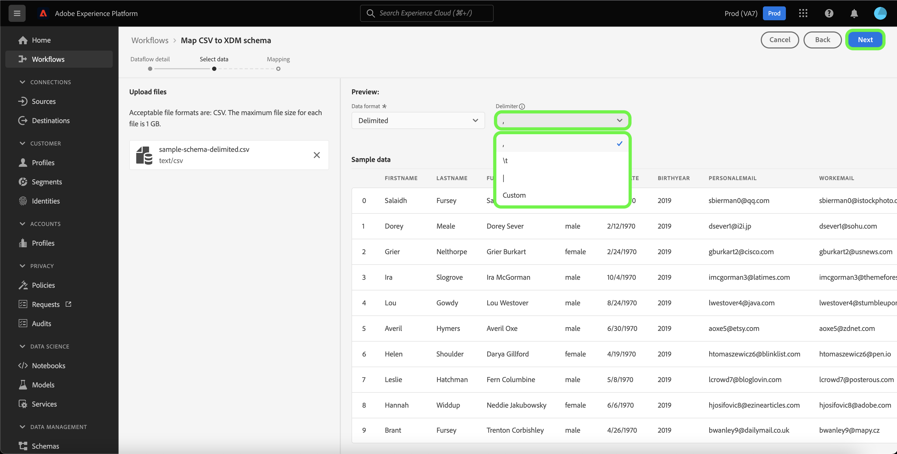
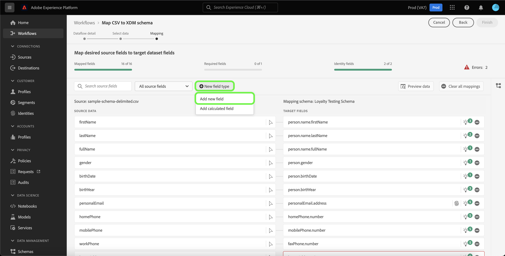
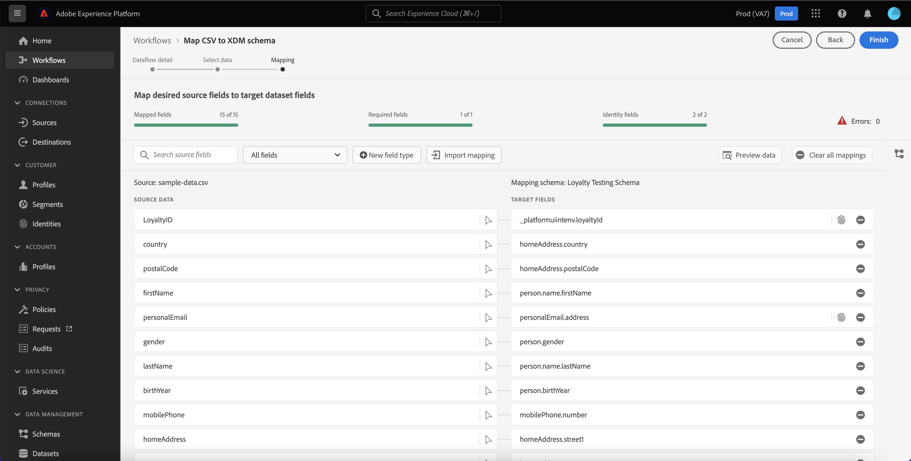
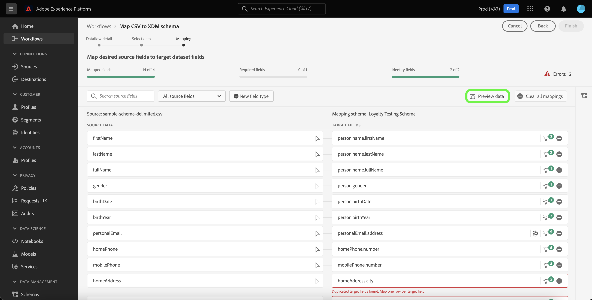
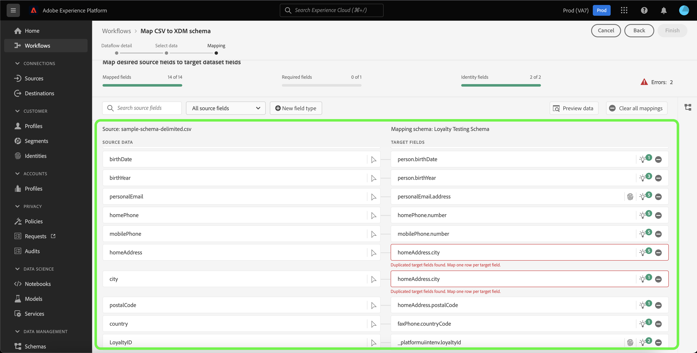

# 데이터 준비 UI 안내서

이 문서에서는 Adobe Experience Platform 사용자 인터페이스에서 데이터 준비 함수를 사용하여 CSV 파일을 XDM 스키마에 매핑하는 방법에 대한 지침을 제공합니다.

## 시작하기

이 자습서에서는 다음 플랫폼 구성 요소를 이해하고 있어야 합니다.

* [[!DNL Experience Data Model (XDM)] 시스템](../../xdm/home.md): 플랫폼이 고객 경험 데이터를 구성하는 표준화된 프레임워크입니다.
   * [스키마 작성 기본 사항](../../xdm/schema/composition.md): 스키마 컴포지션의 주요 원칙 및 모범 사례를 포함하여 XDM 스키마의 기본 빌딩 블록에 대해 알아봅니다.
   * [스키마 편집기 자습서](../../xdm/tutorials/create-schema-ui.md): 스키마 편집기 UI를 사용하여 사용자 지정 스키마를 만드는 방법을 알아보십시오.
* [ID 서비스](../../identity-service/home.md): 여러 장치와 시스템에서 ID를 브리징하여 개별 고객과 고객의 행동을 더 잘 파악할 수 있습니다.
* [[!DNL Real-time Customer Profile]](../../profile/home.md): 여러 소스에서 집계된 데이터를 기반으로 통합된 실시간 소비자 프로필을 제공합니다.
* [소스](../../sources/home.md): Experience Platform을 사용하면 Platform 서비스를 사용하여 들어오는 데이터를 구조화, 레이블 지정 및 향상시키는 기능을 제공하면서 다양한 소스에서 데이터를 수집할 수 있습니다.

## 데이터 흐름 세부 정보

>[!TIP]
>
>소스 카탈로그에서 소스를 선택하여 데이터 흐름 세부 정보에 액세스할 수 있습니다. 자세한 내용은 [소스 개요](../../sources/home.md).

XDM 스키마에 CSV 데이터를 매핑하려면 먼저 데이터 흐름의 세부 사항을 설정해야 합니다.

다음 [!UICONTROL 데이터 흐름 세부 정보] 페이지를 사용하여 CSV 데이터를 기존 target 데이터 세트에 수집할지 또는 새 타겟 데이터 세트에 수집할지를 선택할 수 있습니다. 기존 데이터 세트에는 데이터를 매핑하기 위해 미리 빌드된 대상 스키마가 포함되어 있지만 새 데이터 세트를 사용하려면 데이터를 매핑할 기존 스키마를 선택하거나 새 스키마를 만들어야 합니다.

### 기존 타겟 데이터 세트 사용

CSV 데이터를 기존 데이터 세트에 수집하려면 을 선택합니다 **[!UICONTROL 기존 데이터 세트]**. 를 사용하여 기존 데이터 세트를 검색할 수 있습니다 [!UICONTROL 고급 검색] 옵션을 선택하거나 드롭다운 메뉴에서 기존 데이터 세트 목록을 스크롤하여 선택합니다.

데이터 세트를 선택하고 데이터 흐름의 이름과 선택적 설명을 제공합니다.

이 프로세스 중에 [!UICONTROL 오류 진단] 및 [!UICONTROL 부분 수집]. [!UICONTROL 오류 진단] 에서는 데이터 플로우에서 발생하는 모든 잘못된 레코드에 대해 자세한 오류 메시지를 생성하는 반면, [!UICONTROL 부분 수집] 수동으로 정의하는 특정 임계값까지 오류가 포함된 데이터를 수집할 수 있습니다. 자세한 내용은 [부분 배치 수집 개요](../../ingestion/batch-ingestion/partial.md) 추가 정보.

### 새 대상 데이터 세트 사용

CSV 데이터를 새 데이터 세트에 수집하려면 을 선택합니다 **[!UICONTROL 새 데이터 세트]** 그런 다음 출력 데이터 세트 이름과 선택적 설명을 제공합니다. 다음으로 를 사용하여 매핑할 스키마를 선택합니다 [!UICONTROL 고급 검색] 옵션을 선택하거나 드롭다운 메뉴에서 기존 스키마 목록을 스크롤하여 선택합니다.

스키마를 선택하고 데이터 흐름의 이름과 선택적 설명을 제공한 다음 [!UICONTROL 오류 진단] 및 [!UICONTROL 부분 수집] 데이터 플로우에 대한 설정 완료되면 을 선택합니다 **[!UICONTROL 다음]**.

## 데이터 선택

다음 [!UICONTROL 데이터 선택] 로컬 파일을 업로드하고 해당 구조 및 컨텐츠를 미리 볼 수 있는 인터페이스를 제공하는 단계가 나타납니다. 선택 **[!UICONTROL 파일 선택]** 를 눌러 로컬 시스템에서 CSV 파일을 업로드합니다. 또는 업로드할 CSV 파일을 [!UICONTROL 파일 드래그 앤 드롭] 패널.

>[!TIP]
>
>로컬 파일 업로드에서는 현재 CSV 파일만 지원합니다. 각 파일의 최대 파일 크기는 1GB입니다.

파일을 업로드하면 미리 보기 인터페이스가 업데이트되어 파일의 컨텐츠와 구조를 표시합니다.

파일에 따라, 소스 데이터에 대한 탭, 쉼표, 파이프 또는 사용자 지정 열 구분 기호와 같은 열 구분 기호를 선택할 수 있습니다. 을(를) 선택합니다 **[!UICONTROL 구분 기호]** 드롭다운 화살표를 클릭한 다음 메뉴에서 적절한 구분 기호를 선택합니다.

완료되면 을 선택합니다 **[!UICONTROL 다음]**.

## 매핑

다음 **[!UICONTROL 매핑]** 인터페이스는 소스 스키마의 소스 필드를 대상 스키마의 적절한 대상 XDM 필드에 매핑하는 포괄적인 도구를 제공합니다.

### 매핑 인터페이스 이해

매핑 인터페이스에는 수집 워크플로우 컨텍스트 내의 매핑 필드 상태에 대한 정보를 제공하는 대시보드가 포함되어 있습니다. 대시보드는 매핑 필드에 대한 다음 세부 정보를 표시합니다.

| 속성 | 설명 |
| --- | --- |
| [!UICONTROL 매핑된 필드] | 오류에 관계없이 대상 XDM 필드에 매핑된 총 소스 필드 수를 표시합니다. |
| [!UICONTROL 필수 필드] | 필요한 매핑 필드 수를 표시합니다. |
| [!UICONTROL ID 필드] | ID로 정의된 총 매핑 필드 수를 표시합니다. 이러한 매핑 필드는 지문 아이콘으로 표시됩니다. |
| [!UICONTROL 오류] | 잘못된 매핑 필드 수를 표시합니다. |

매핑 인터페이스에서는 매핑 필드를 통해 보다 효과적으로 상호 작용하거나 필터링할 수 있는 옵션 패널도 제공합니다.

특정 매핑 세트를 검색하려면 **[!UICONTROL 검색 소스 필드]** 분리할 소스 데이터의 이름을 입력합니다.

선택 **[!UICONTROL 모든 소스 필드]** 매핑 인터페이스의 보기 범위를 더 좁히기 위해 필터링 선택 사항의 드롭다운 메뉴를 보려면 다음을 수행하십시오.

필터링 옵션은 다음과 같습니다.

| 소스 필드 | 설명 |
| --- | --- |
| [!UICONTROL 모든 소스 필드] | 이 옵션은 소스 스키마의 모든 소스 필드를 표시합니다. 이 옵션은 기본적으로 표시됩니다. |
| [!UICONTROL 필수 필드] | 이 옵션은 매핑을 완료하는 데 필요한 필드만 표시하도록 소스 스키마를 필터링합니다. |
| [!UICONTROL ID 필드] | 이 옵션은 ID로 표시된 필드만 표시하도록 소스 스키마를 필터링합니다. |
| [!UICONTROL 매핑된 필드] | 이 옵션은 이미 매핑된 필드만 표시하도록 소스 스키마를 필터링합니다. |
| [!UICONTROL 매핑되지 않은 필드] | 이 옵션은 매핑되지 않은 필드만 표시하도록 소스 스키마를 필터링합니다. |
| [!UICONTROL 권장 사항이 있는 필드] | 이 옵션은 소스 스키마를 필터링하여 매핑 권장 사항이 포함된 필드만 표시합니다. |

선택 **[!UICONTROL 오류가 있는 필드]** 오류가 있는 모든 매핑 필드를 보려면 다음을 수행하십시오.

지능형 매핑 권장 사항을 통해 또는 수동 매핑 트리를 통해 오류를 처리할 수 있도록 잘못된 매핑 필드에 대한 분리된 보기가 나타납니다.

### 새 필드 유형 추가

을(를) 선택하여 새 매핑 필드 또는 계산된 필드를 추가할 수 있습니다 **[!UICONTROL 새 필드 유형]**.

#### 새 매핑 필드

새 매핑 필드를 추가하려면 **[!UICONTROL 새 필드 유형]** 그런 다음 **[!UICONTROL 새 필드 추가]** 표시되는 드롭다운 메뉴에서 을 클릭합니다.

다음으로 나타나는 소스 스키마 트리에서 추가할 소스 필드를 선택한 다음 선택합니다 **[!UICONTROL 선택]**.

매핑 인터페이스는 선택한 소스 필드 및 빈 대상 필드로 업데이트됩니다. 선택 **[!UICONTROL 대상 필드 매핑]** 새 소스 필드를 적절한 대상 XDM 필드에 매핑하기 시작합니다.

대상 스키마를 수동으로 트래버스하고 소스 필드에 적합한 대상 XDM 필드를 찾을 수 있는 대화형 대상 스키마 트리가 나타납니다.

완료되면 스키마 아이콘을 선택하여 대상 스키마 인터페이스를 닫습니다.

#### 계산된 필드 {#calculated-fields}

계산된 필드를 사용하면 입력 스키마의 속성을 기반으로 값을 만들 수 있습니다. 그런 다음 이러한 값을 대상 스키마의 속성에 지정하고 쉽게 참조할 수 있도록 이름 및 설명을 제공할 수 있습니다. 계산된 필드의 길이는 최대 4096자입니다.

계산된 필드를 만들려면 **[!UICONTROL 새 필드 유형]** 그런 다음 **[!UICONTROL 계산된 필드 추가]**

다음 **[!UICONTROL 계산된 필드 만들기]** 패널이 나타납니다. 왼쪽 대화 상자에는 계산된 필드에서 지원되는 필드, 함수 및 연산자가 포함되어 있습니다. 탭 중 하나를 선택하여 표현식 편집기에 함수, 필드 또는 연산자를 추가합니다.

| 탭 | 설명 |
| --- | ----------- |
| [!UICONTROL 함수] | 함수 탭에는 데이터를 변형하는 데 사용할 수 있는 함수가 나열됩니다. 계산된 필드 내에서 사용할 수 있는 기능에 대한 자세한 내용은 다음 안내서를 참조하십시오 [데이터 준비(매퍼) 함수 사용](../functions.md). |
| [!UICONTROL 필드] | 필드 탭에는 소스 스키마에서 사용할 수 있는 필드와 속성이 나열됩니다. |
| [!UICONTROL 연산자] | 연산자 탭에는 데이터를 변형하는 데 사용할 수 있는 연산자가 나열됩니다. |

가운데 표현식 편집기를 사용하여 필드, 함수 및 연산자를 수동으로 추가할 수 있습니다. 편집기를 선택하여 표현식 만들기를 시작합니다. 완료되면 을 선택합니다 **[!UICONTROL 저장]** 계속 진행합니다.

### 가져오기 매핑 {#import}

기존 데이터 흐름의 매핑을 다시 사용하여 데이터 수집의 수동 구성 시간을 줄이고 실수를 제한할 수 있습니다. 선택 **[!UICONTROL 가져오기 매핑]** 기존 매핑을 재사용하려면

다음 [!UICONTROL 가져오기 매핑] 선택할 데이터 흐름 목록을 제공하는 창이 나타납니다.

미리 보기 아이콘을 선택하여 선택한 데이터 흐름의 매핑을 미리 봅니다.

미리 보기 창을 사용하면 데이터 흐름으로 가져오기 전에 기존 매핑을 검사할 수 있습니다. 매핑을 확인하면 다음을 선택할 수 있습니다 **[!UICONTROL 뒤로]** 데이터 흐름 목록으로 돌아가서 다른 매핑 세트를 검사하거나 **[!UICONTROL 선택]** 계속 진행합니다.

또는 데이터 흐름 목록에서 가져올 매핑을 선택할 수 있습니다. 가져올 매핑이 포함된 데이터 흐름을 선택하고 선택합니다 **[!UICONTROL 선택]** 계속 진행합니다.

인터페이스는 가져온 매핑으로 업데이트됩니다.

>[!NOTE]
>
>기존 데이터 플로우에서 가져온 매핑으로 또는 ML 매핑 권장 사항을 설정하는 기존 매핑 세트가 대체됩니다.

선택 **[!UICONTROL 데이터 미리 보기]** 선택한 데이터 세트에서 최대 100개의 샘플 데이터 행의 매핑 결과를 확인하십시오.

미리 보기 중에 ID 열은 매핑 결과를 확인할 때 필요한 주요 정보이므로 첫 번째 필드로 우선 순위가 지정됩니다. 완료되면 을 선택합니다 **[!UICONTROL 닫기]**.

모든 매핑 필드를 제거하려면 **[!UICONTROL 모든 매핑 지우기]**.

### 매핑 인터페이스 사용

Platform은 선택한 대상 스키마나 데이터 세트를 기반으로 자동 매핑 필드에 대한 지능형 권장 사항을 자동으로 제공합니다. 매핑 규칙을 수동으로 조정하여 사용 사례에 맞게 조정하거나 중복된 매핑 필드를 수정하여 오류를 지울 수 있습니다.

조정할 대상 필드에서 전구 아이콘을 선택합니다.

다음 [!UICONTROL 권장 사항 매핑] 특정 소스 필드에 매핑할 수 있는 권장 대상 필드 목록을 표시하는 팝업 패널이 나타납니다. 기본적으로 첫 번째 권장 사항이 자동으로 적용됩니다.

경우에 따라 소스 스키마에 대해 두 개 이상의 권장 사항을 사용할 수 있습니다. 이렇게 되면 매핑 카드에 가장 중요한 권장 사항이 표시되며 사용 가능한 추가 권장 사항의 수가 포함된 아이콘이 표시됩니다. 전구 아이콘을 선택하면 추가 권장 사항 목록이 표시됩니다. 대신 매핑할 권장 사항 옆에 있는 확인란을 선택하여 대체 권장 사항 중 하나를 선택할 수 있습니다.

여기에서 선택한 타겟 필드를 변경하여 오류를 수정하거나 사용 사례를 일치시킬 수 있습니다.

또는 다음을 선택할 수 있습니다 **[!UICONTROL 수동으로 선택]** 대화식 대상 스키마 매핑 트리를 수동으로 사용하려면 다음을 수행하십시오.

대상 스키마 매핑 인터페이스가 매핑 필드와 동일한 보기에 표시되어 동일한 화면 내에서 매핑 쌍을 수정할 수 있습니다. 사용 사례에 맞는 타겟 필드를 선택하거나 오류를 수정합니다.

완료되면 을 선택합니다 **[!UICONTROL 완료]** 계속 진행합니다.

## 다음 단계

이 문서를 읽은 후 Platform UI의 매핑 인터페이스를 사용하여 대상 XDM 스키마에 CSV 파일을 매핑했습니다. 자세한 내용은 다음 문서를 참조하십시오.

* [데이터 준비 개요](../home.md)
* [소스 개요](../../sources/home.md)
* [UI에서 소스 데이터 흐름 모니터링](../../dataflows/ui/monitor-sources.md)
