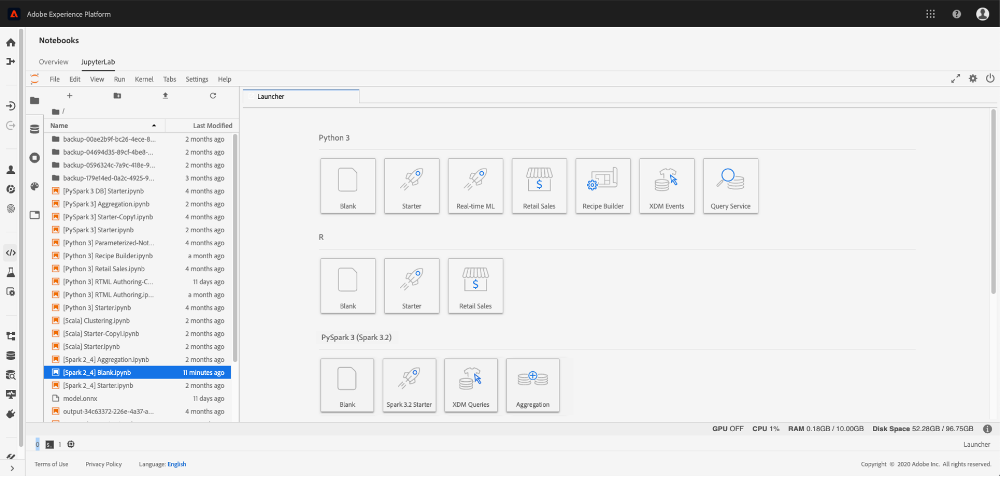

# 데이터 과학 작업 영역 개요

>[!NOTE]
>
>Experience League에 기능에 대한 설명서가 있다고 해서 모든 고객에게 그 기능이 제공된다고 보장되지는 않습니다. 이 기능은 Adobe Experience Platform 또는 Adobe Experience Platform Intelligence 라이선스를 구입한 기존 고객만 사용할 수 있습니다. 구매한 SKU/제품과 관련된 기능 및 기타 세부 사항을 이해하려면 공식 제품 설명을 참조하십시오.

Adobe Experience Platform [!DNL Data Science Workspace] 는 머신 러닝 및 인공 지능을 사용하여 데이터에서 통찰력을 생성합니다. Adobe Experience Platform에 통합, [!DNL Data Science Workspace] 은 Adobe 솔루션 전반에서 컨텐츠 및 데이터 자산을 사용하여 예측을 수행하는 데 도움이 됩니다.

모든 기술 수준의 데이터 과학자는 복잡성 없이 AI 기술의 모든 이점을 비롯하여 머신 러닝 레시피의 신속한 개발, 교육 및 튜닝을 지원하는 정교하고 사용하기 쉬운 도구를 찾을 수 있습니다.

포함 [!DNL Data Science Workspace], 데이터 과학자는 머신 러닝으로 구동되는 지능형 서비스 API를 쉽게 만들 수 있습니다. 이러한 서비스는 Adobe Target 및 Adobe Analytics Cloud을 포함한 다른 Adobe 서비스와 함께 작동하여 웹, 데스크탑 및 모바일 앱에서 개인화되고 타겟팅된 디지털 경험을 자동화할 수 있도록 지원합니다.

이 안내서에서는 와 관련된 주요 개념에 대한 개요를 제공합니다 [!DNL Data Science Workspace].

## 소개

오늘날의 기업은 고객 경험을 개인화하고 고객 및 비즈니스에 더 많은 가치를 제공하는 데 도움이 되는 예측 및 통찰력을 위해 빅 데이터를 마이닝하는 데 높은 우선 순위를 둡니다.
데이터에서부터 통찰력까지 가져오는 것은 많은 비용을 들여야 합니다. 일반적으로 지능적인 서비스를 제공하는 머신 러닝 모델 또는 레시피를 개발하기 위해 집중적이고 시간이 많이 소요되는 데이터 연구를 수행하는 숙련된 데이터 과학자가 필요합니다. 그 과정은 길고, 기술은 복잡하며, 숙련된 데이터 과학자는 찾기 어려울 수 있다.

포함 [!DNL Data Science Workspace], Adobe Experience Platform을 사용하면 다음 기능을 통해 경험 중심의 AI를 전사적으로 제공하여 데이터를 인사이트 코드로 간소화하고 가속화할 수 있습니다.
- 머신 러닝 프레임워크 및 런타임
- Adobe Experience Platform에 저장된 데이터에 대한 통합 액세스
- 통합 데이터 스키마 기본 [!DNL Experience Data Model] (XDM)
- 머신 러닝/AI 및 빅 데이터 세트 관리에 필수적인 컴퓨팅 능력
- AI 기반 경험으로의 도약을 가속화하기 위한 사전 구축된 머신 러닝 레시피
- 다양한 기술 수준의 데이터 과학자를 위한 레서피 작성, 재사용 및 수정 간소화
- 개발자 없이 몇 번의 클릭만으로 지능형 서비스 게시 및 공유, 개인화된 고객 경험의 지속적인 최적화를 위한 모니터링 및 재교육

모든 기술 수준의 데이터 과학자는 더 빠르고 효과적인 디지털 경험을 더 빨리 통찰력을 얻을 것입니다.

## 시작하기

의 세부 사항으로 이동하기 전에 [!DNL Data Science Workspace]주요 용어에 대한 간략한 요약은 다음과 같습니다.

| 용어 | 정의 |
|---------------------|------------------------------------------------------------------------------------------------------------------------------------------------------------------------------------------------------------------------------------------------------------------------------------------------------------------------------------------------------------------------------------------------------------------------------------------------------------------|
| [!DNL Data Science Workspace] | [!DNL Data Science Workspace] 다음 범위 내 [!DNL Experience Platform] 를 통해 고객은 의 데이터를 활용하는 머신 러닝 모델을 만들 수 있습니다. [!DNL Experience Platform] 및 Adobe 솔루션을 통해 지능형 통찰력과 예측을 생성하여 유쾌한 최종 사용자 디지털 경험을 제공할 수 있습니다. |
| 인공 지능 | 인공지능은 시각 지각, 음성 인식, 의사결정, 언어 간 번역 등 인간의 지능이 통상적으로 요구되는 업무를 수행할 수 있는 컴퓨터 시스템의 이론과 개발이다. |
| 머신 러닝 | 머신 러닝은 컴퓨터가 명시적으로 프로그래밍되지 않고 학습할 수 있도록 하는 학문의 분야이다. |
| [!DNL Sensei] ML 프레임워크 | [!DNL Sensei] ML 프레임워크는 의 데이터를 활용하는 Adobe 전반의 통합 머신 러닝 프레임워크입니다. [!DNL Experience Platform] 데이터 과학자가 머신 러닝 기반의 인텔리전스 서비스를 보다 빠르고 확장 가능하며 재사용 가능한 방식으로 개발할 수 있도록 지원합니다. |
| [!DNL Experience Data Model] | [!DNL Experience Data Model] (XDM)은 표준 스키마(예: )를 정의하기 위한 Adobe의 표준화 작업입니다 [!DNL Profile] 및 [!DNL ExperienceEvent]고객 경험 관리용입니다. |
| [!DNL JupyterLab] | [!DNL JupyterLab] 는 Project Jupyter용 오픈 소스 웹 기반 인터페이스이며 와 긴밀하게 통합되어 있습니다. [!DNL Experience Platform]. |
| 레서피 | 레시피는 Adobe의 모델 사양 용어이며 훈련된 모델을 구축하고 실행하여 특정 비즈니스 문제를 해결하는 데 필요한 특정 머신 러닝, AI 알고리즘 또는 알고리즘, 처리 논리 및 구성의 앙상블을 나타내는 최상위 컨테이너입니다. |
| 모델 | 모델은 비즈니스 사용 사례를 해결하기 위해 내역 데이터 및 구성을 사용하여 교육되는 머신 러닝 레시피의 인스턴스입니다. |
| 교육 | 교육은 레이블이 지정된 데이터에서 패턴과 통찰력을 배우는 프로세스입니다. |
| 교육된 모델 | 트레이닝된 모델은 모델 트레이닝 프로세스의 실행 가능한 출력을 나타내며, 여기서 트레이닝 데이터의 세트가 모델 인스턴스에 적용되었다. 훈련된 모델은 이 모델에서 생성된 모든 지능형 웹 서비스에 대한 참조를 유지 관리합니다. 훈련된 모델은 채점을 하고 지능형 웹 서비스를 만드는 데 적합합니다. 훈련된 모델에 대한 수정 사항은 새 버전으로 추적할 수 있습니다. |
| 채점 | 채점은 훈련된 모델을 사용하여 데이터에서 통찰력을 생성하는 프로세스입니다. |
| 서비스 | 배포된 서비스는 API를 통해 인공 지능, 머신 러닝 모델 또는 고급 알고리즘의 기능을 노출하므로 다른 서비스나 애플리케이션에서 지능형 앱을 만드는 데 사용할 수 있습니다. |

다음 차트는 레서피, 모델, 교육 실행 및 채점 실행 간의 계층 관계를 간략하게 설명합니다.

## [!DNL Data Science Workspace] 이해 

포함 [!DNL Data Science Workspace], 데이터 과학자는 대규모 데이터 세트에서 통찰력을 발견하는 번거로운 프로세스를 간소화할 수 있습니다. 일반적인 머신 러닝 프레임워크 및 런타임을 기반으로 구축, [!DNL Data Science Workspace] 고급 워크플로우 관리, 모델 관리 및 확장성을 제공합니다. 지능형 서비스는 머신 러닝 레서피 재사용을 지원하여 Adobe 제품 및 솔루션을 사용하여 생성된 다양한 애플리케이션을 지원합니다.

### 원스톱 데이터 액세스

데이터는 AI와 머신 러닝의 초석입니다.

[!DNL Data Science Workspace] 는 데이터 레이크 를 포함하여 Adobe Experience Platform과 완전히 통합됩니다. [!DNL Real-Time Customer Profile], 및 [!DNL Unified Edge]. 다음과 같은 일반적인 빅 데이터 및 딥 러닝 라이브러리와 함께 Adobe Experience Platform에 저장된 모든 조직 데이터를 한 번에 탐색합니다. [!DNL Spark] ML 및 [!DNL TensorFlow]. 필요한 항목을 찾지 못한 경우 XDM 표준화된 스키마를 사용하여 자신의 데이터 세트를 섭취합니다.

### 사전 빌드된 머신 러닝 레시피

[!DNL Data Science Workspace] 에는 소매 판매 예측 및 예외 항목 탐지 등 일반적인 비즈니스 요구 사항을 위해 사전 구축된 머신 러닝 레시피가 포함되어 있으므로 데이터 과학자와 개발자는 처음부터 시작할 필요가 없습니다. 현재 3가지 요리법이 제공되고 있습니다 [제품 구매 예측](./pre-built-recipes/product-purchase-prediction.md), [제품 추천](./pre-built-recipes/product-recommendations.md), 및 [소매 판매](./pre-built-recipes/retail-sales.md).

[//]: # (The built-in recipe gallery offers recommendations for prebuilt recipes based on your business needs.)

원하는 경우 미리 만들어진 레시피를 사용자의 요구 사항에 맞게 조정하거나, 레시피를 가져오거나, 처음부터 시작하여 사용자 지정 레시피를 만들 수 있습니다. 그러나 일단 레시피를 교육하고 하이퍼튜닝을 하면 몇 번의 클릭만으로 맞춤형 지능형 서비스를 만들 수 있으므로 개발자가 필요로 하지 않으며 타기팅된 개인화된 디지털 경험을 구축할 준비가 된 것입니다.

### 데이터 과학자에 초점을 맞춘 워크플로우

귀하의 데이터 과학 전문 지식이 무엇이든, [!DNL Data Science Workspace] 는 데이터에서 통찰력을 찾고 디지털 경험에 적용하는 프로세스를 단순화하고 가속화하는 데 도움이 됩니다.

### 데이터 탐색

올바른 데이터를 찾아서 준비하는 것은 효과적인 레시피를 구축하는 데 가장 많은 노동력이 필요한 부분이다. [!DNL Data Science Workspace] 및 Adobe Experience Platform을 사용하면 데이터에서 통찰력을 보다 신속하게 얻을 수 있습니다.

Adobe Experience Platform에서는 크로스 채널 데이터가 중앙 집중화되고 XDM 표준화된 스키마에 저장되므로 데이터를 더 쉽게 찾고, 이해하고, 정리할 수 있습니다. 일반적인 스키마를 기반으로 하는 단일 데이터 저장소로 수많은 시간을 데이터 탐색 및 준비를 절약할 수 있습니다.

탐색할 때 R을 사용하고, [!DNL Python]또는 통합, 호스팅된 Scala [!DNL Jupyter Notebook] 데이터 카탈로그를 찾아보려면 [!DNL Platform]. 이러한 언어 중 하나를 사용하면 [!DNL Spark] ML 및 TensorFlow. 처음부터 새로 시작하거나 특정 비즈니스 문제에 대해 제공된 노트북 템플릿 중 하나를 사용하십시오.

데이터 탐색 워크플로우의 일부로 새 데이터를 수집하거나 기존 기능을 사용하여 데이터 준비를 지원할 수도 있습니다.

### 작성

포함 [!DNL Data Science Workspace], 레시피를 작성하는 방법을 결정합니다.

- 비즈니스 요구 사항을 해결하는 사전 작성된 레시피를 탐색하여 시간을 절약하십시오. 레시피는 그대로 사용하거나 특정 요구 사항을 충족하도록 구성할 수 있습니다.
- Jupyter Notebook의 작성 런타임을 사용하여 레시피를 개발하고 등록하여 레시피를 처음부터 만듭니다.
- Adobe Experience Platform 외부에서 작성된 레시피를 업로드하십시오. [!DNL Data Science Workspace] 또는 다음과 같은 저장소에서 레시피 코드를 가져옵니다. [!DNL Git], 다음 기간 동안 사용 가능한 인증 및 통합 사용 [!DNL Git] 및 [!DNL Data Science Workspace].

### 실험

Data Science Workspace 는 실험 프로세스에 엄청난 유연성을 제공합니다. 레시피부터 시작하세요. 그런 다음 하이퍼-튜닝 매개 변수와 같은 고유한 특성과 쌍을 이루는 동일한 코어 알고리즘을 사용하여 별도의 인스턴스를 생성합니다. 필요한 만큼 인스턴스를 생성하고, 각 인스턴스를 원하는 만큼 교육하고 점수를 매길 수 있습니다. 훈련시킬 때 [!DNL Data Science Workspace] 평가 지표와 함께 레서피, 레시피 인스턴스 및 교육된 인스턴스를 추적하므로, 그렇게 하지 않아도 됩니다.

### 운영화

레시피가 마음에 들면 몇 번의 클릭만으로 지능형 서비스를 만들 수 있습니다. 코딩이 필요하지 않습니다. 개발자 또는 엔지니어를 등록하지 않고도 직접 코딩을 수행할 수 있습니다. 마지막으로, 지능형 서비스를 Adobe IO에 게시하면 디지털 경험 팀이 사용할 수 있습니다.

<!--You can also publish your intelligent service to the Service Gallery, where it's available to specific people, specific organizations, or everyone who develops data solutions on Adobe Experience Platform. You can even share it with your external partners, and they can share their intelligent service with you. And the next time you're starting a new recipe, you can check the Service Gallery to see if there's a similar intelligent service you can use to get started. -->

### 지속적인 개선

[!DNL Data Science Workspace] 인텔리전트 서비스가 호출되는 위치와 수행 방법을 추적합니다. 데이터가 업로드되면 지능적인 서비스 정확도를 평가하여 루프를 닫고 필요에 따라 레시피를 다시 교육하여 성능을 향상시킬 수 있습니다. 그 결과 고객 개인화의 정밀도가 지속적으로 개선됩니다.

### 새로운 기능 및 데이터 세트에 대한 액세스

데이터 과학자는 Adobe 서비스를 통해 새로운 기술 및 데이터 세트를 사용할 수 있는 즉시 활용할 수 있습니다. 빈번한 업데이트를 통해 데이터 세트와 기술을 플랫폼에 통합하는 작업을 하므로 따로 작업을 할 필요가 없습니다.

### 안전과 마음의 평화

Adobe의 최우선 과제는 데이터 보안을 유지하는 것입니다. Adobe은 업계에서 인정하는 표준, 규정 및 인증을 준수하도록 개발된 보안 프로세스 및 제어를 통해 데이터를 보호합니다.

보안은 Adobe 보안 제품 수명 주기의 일부로 소프트웨어 및 서비스에 내장되어 있습니다.
Adobe 데이터 및 소프트웨어 보안, 규정 준수 등에 대해 알아보려면 https://www.adobe.com/security.html의 보안 페이지를 방문하십시오.

## [!DNL Data Science Workspace] 실행 중

예측 및 인사이트는 웹 사이트를 방문하거나, 콜센터에 문의하거나, 기타 디지털 경험을 사용하는 각 고객에게 고도로 개인화된 경험을 제공하는 데 필요한 정보를 제공합니다. 일상적인 작업이 다음과 같이 진행됩니다. [!DNL Data Science Workspace].

### 문제 정의

그것은 모두 비즈니스 문제로 시작합니다. 예를 들어 온라인 콜센터는 부정적인 고객 감정을 긍정적으로 바꾸는 데 도움이 되는 컨텍스트가 필요합니다.

고객에 대한 자료는 충분히 있습니다. 사이트를 탐색하고 장바구니에 항목을 담았으며 주문까지 했습니다. 이메일을 받았거나 쿠폰을 사용했거나 이전에 콜센터에 문의했을 수 있습니다. 그런 다음 레시피는 고객 및 해당 활동에 대해 사용 가능한 데이터를 사용하여 구매 성향을 파악하고 고객이 인식하고 사용할 가능성이 있는 오퍼를 추천해야 합니다.

콜센터 접촉 당시 고객은 아직 장바구니에 신발 두 켤레가 있지만 셔츠를 벗었다. 이 정보를 이용하면 지능형 서비스는 콜센터 상담원이 통화 중 신발 20% 할인 쿠폰을 제공하는 것을 권장할 수 있다. 고객이 쿠폰을 사용하는 경우 해당 정보가 데이터 세트에 추가되고 다음에 고객이 방문할 때 예측이 훨씬 개선됩니다.

### 데이터 탐색 및 준비

정의된 비즈니스 문제를 기반으로, 레시피는 사이트 방문, 검색, 페이지 보기, 클릭한 링크, 장바구니 작업, 받은 오퍼, 받은 이메일, 콜 센터 상호 작용 등을 포함하여 고객의 모든 웹 트랜잭션을 확인해야 합니다.

데이터 과학자는 일반적으로 데이터를 탐색하고 변환하는 레시피를 만드는 데 필요한 시간의 최대 75%를 소비합니다. 데이터는 종종 여러 저장소에서 가져오고 다른 스키마에 저장됩니다. 레시피를 만드는 데 사용하려면 먼저 데이터를 결합하고 매핑해야 합니다.

[//]: # (Your first step is to check the recipe gallery to see if an existing recipe meets your needs, or comes close. An alternative is to import a recipe you created outside of Adobe Experience Platform. Starting with an existing recipe often streamlines the data exploration phase and makes it easier for a data scientist.)

처음부터 시작하거나 기존 레시피를 구성하는 경우, 조직을 위해 중앙 집중식으로 표준화된 데이터 카탈로그에서 데이터 검색을 시작하여 헌트를 상당히 단순화합니다. 조직의 다른 데이터 과학자가 이미 유사한 데이터 세트를 식별했으며 처음부터 시작하지 않고 해당 데이터 세트를 미세 조정하도록 선택할 수도 있습니다.
Adobe Experience Platform의 모든 데이터는 표준화된 XDM 스키마를 준수하므로 데이터 참여를 위한 복잡한 모델을 만들거나 데이터 엔지니어의 도움을 받을 필요가 없습니다.

필요한 데이터를 즉시 찾지 않지만 Adobe Experience Platform 외부에 존재하는 경우 추가 데이터 세트를 수집하는 것이 비교적 간단한 작업이며, 이 작업은 표준화된 XDM 스키마로도 변환됩니다.\
다음을 사용할 수 있습니다. [!DNL Jupyter Notebook] 데이터 사전 처리를 단순화하기 위해 이전에 구매 성향에 사용한 노트북 템플릿이나 노트북으로 시작할 수 있습니다.

### 레시피 작성

모든 요구 사항을 충족하는 레시피를 이미 찾았다면 실험으로 넘어갈 수 있습니다. 또는 레시피를 약간 수정하거나 처음부터 만들 수 있습니다. [!DNL Data Science Workspace] 제작 런타임 [!DNL Jupyter Notebook]. 작성 런타임을 사용하면 [!DNL Data Science Workspace] 교육 및 채점 워크플로우를 만들고 나중에 레시피를 변환하여 조직의 다른 사용자가 저장하고 재사용할 수 있도록 합니다.

에서 레시피를 가져올 수도 있습니다. [!DNL Data Science Workspace] 인텔리전트 서비스를 만들 때 실험 워크플로를 활용할 수 있습니다.

### 레시피 실험

핵심 머신 러닝 알고리즘을 통합하는 레시피를 통해 하나의 레시피로 많은 레시피 인스턴스를 만들 수 있습니다. 이러한 레시피 인스턴스를 모델이라고 합니다. 모델은 작동 효율성과 효능을 최적화하기 위해 교육 및 평가를 필요로 하며, 이 프로세스는 일반적으로 시행착오로 구성된다.

모델을 교육하면 교육 실행 및 평가가 생성됩니다. [!DNL Data Science Workspace] 는 각 고유 모델 및 해당 교육 실행에 대한 평가 지표를 추적합니다. 실험을 통해 생성된 평가 지표를 통해 가장 성과가 좋은 교육 실행을 결정할 수 있습니다.

다음 중 하나를 방문하십시오. [API](./models-recipes/train-evaluate-model-api.md) 또는 [UI](./models-recipes/train-evaluate-model-ui.md) 에서 모델을 교육하고 평가하는 방법에 대한 튜토리얼 [!DNL Data Science Workspace].

### 모델 작업

비즈니스 요구 사항을 해결하기 위해 가장 숙련된 레시피를 선택하면에 지능형 서비스를 만들 수 있습니다. [!DNL Data Science Workspace] 개발자 지원 없이. 몇 번의 클릭만으로 코딩이 필요하지 않습니다. 게시된 지능형 서비스는 모델을 다시 만들 필요 없이 조직의 다른 구성원이 액세스할 수 있습니다.

게시된 지능형 서비스는 새로운 데이터를 사용할 수 있을 때 수시로 자동으로 교육하도록 구성할 수 있습니다. 이렇게 하면 시간이 지남에 따라 서비스가 효율성과 효과를 유지할 수 있습니다.

## 다음 단계

[!DNL Data Science Workspace] 는 데이터 수집에서 알고리즘, 모든 기술 수준의 데이터 과학자를 위한 지능형 서비스에 이르기까지 데이터 과학 워크플로를 간소화하고 단순화하는 데 도움이 됩니다. 정교한 도구 사용 [!DNL Data Science Workspace] 는 데이터에서 통찰력을 얻는 시간을 크게 단축할 수 있도록 해줍니다.

더 중요한 것은, [!DNL Data Science Workspace] 는 Adobe의 주요 마케팅 플랫폼의 데이터 과학 및 알고리즘 최적화 기능을 엔터프라이즈 데이터 과학자에게 제공합니다. 처음으로 기업은 Adobe의 강력한 머신 러닝 및 AI 기능을 활용하여 대규모로 고도로 개인화된 고객 경험을 제공함으로써 독점 알고리즘을 플랫폼에 도입할 수 있습니다.

브랜드 전문성과 Adobe의 머신 러닝 및 AI 능력이 결합되면서 기업은 고객이 요구하기 전에 원하는 것을 제공함으로써 더 많은 비즈니스 가치와 브랜드 충성도를 추진할 수 있는 힘을 가지게 되었습니다.

전체 일상적인 워크플로우와 같은 추가 정보는 다음을 읽는 것부터 시작하십시오. [데이터 과학 작업 영역 둘러보기](./walkthrough.md) 설명서를 참조하십시오.

## 추가 리소스

다음 비디오는 다음에 대한 이해를 돕기 위해 설계되었습니다. [!DNL Data Science Workspace].

>[!VIDEO](https://video.tv.adobe.com/v/30567?quality=12&amp;enable10seconds=on&amp;speedcontrol=on)