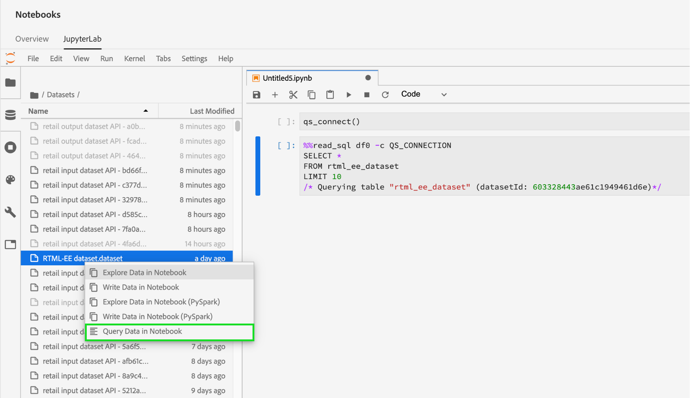
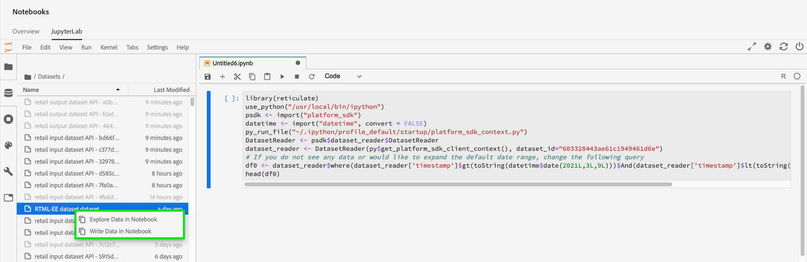

# [!DNL Jupyterlab] 전자 필기장의 데이터 액세스

지원되는 각 커널은 노트북 내의 데이터 세트에서 플랫폼 데이터를 읽을 수 있도록 하는 내장 기능을 제공합니다. 현재 Adobe Experience Platform Data Science Workspace의 JupiterLab은 [!DNL Python], R, PySpark 및 Scala용 노트북을 지원합니다. 그러나 데이터 페이지 매김 지원은 [!DNL Python] 및 R 노트북으로 제한됩니다. 이 안내서에서는 JupiterLab 전자 필기장을 사용하여 데이터에 액세스하는 방법에 중점을 둡니다.

## 시작하기

이 안내서를 읽기 전에 [!DNL JupyterLab] 및 데이터 과학 작업 공간 내의 역할에 대한 자세한 내용은 [[!DNL JupyterLab] 사용자 안내서](./overview.md)를 참조하십시오.

## 전자 필기장 데이터 제한: {#notebook-data-limits}

>[!IMPORTANT]
>
>&quot;원격 RPC 클라이언트가 연결되지 않은&quot; 이유로 오류가 표시되는 경우 PySpark 및 Scala 전자 필기장의 경우 이것은 일반적으로 드라이버나 실행자의 메모리가 부족함을 의미합니다. 이 오류를 해결하려면 [&quot;일괄 처리&quot; 모드](#mode)로 전환해 보십시오.

다음 정보는 읽을 수 있는 최대 데이터 양, 사용된 데이터 유형 및 데이터를 읽는 예상 기간을 정의합니다.

[!DNL Python] 및 R의 경우 40GB RAM으로 구성된 노트북 서버가 벤치마크에 사용되었습니다. PySpark 및 Scala의 경우 64GB RAM, 8코어, 2DBU로 구성된 데이터베이스 클러스터는 아래 나와 있는 벤치마크에 최대 4명의 작업자를 사용했습니다.

사용된 ExperienceEvent 스키마 데이터는 최대 10억(1B) 행에 이르는 1,000개(1K) 행에서 시작하여 다양한 크기로 사용됩니다. PySpark 및 [!DNL Spark] 지표의 경우 XDM 데이터에 대해 10일의 날짜 범위가 사용되었습니다.

임시 스키마 데이터가 [!DNL Query Service] CTAS(Create Table as Select)를 사용하여 사전 처리되었습니다. 또한 이 데이터는 최대 10억(1B) 행에 이르는 1,000개(1K) 행에서 시작하여 크기가 다양했습니다.

### 일괄 처리 모드와 대화형 모드 {#mode}를 사용하는 경우

PySpark 및 Scala 전자 필기장으로 데이터 세트를 읽을 때 대화형 모드 또는 일괄 처리 모드를 사용하여 데이터 세트를 읽을 수 있습니다. 일괄 처리 모드는 대용량의 데이터 세트에 사용되는 반면, 대화형 작업은 빠른 결과를 위해 수행됩니다.

- PySpark 및 Scala 노트북의 경우 500만 개 이상의 데이터 행을 읽고 있을 때 일괄 처리 모드를 사용해야 합니다. 각 모드의 효율성에 대한 자세한 내용은 아래 [PySpark](#pyspark-data-limits) 또는 [Scala](#scala-data-limits) 데이터 제한 표를 참조하십시오.

### [!DNL Python] 노트북 데이터 제한

**XDM ExperienceEvent 스키마:** 최대 2백만 개의 XDM 데이터 행(~6.1GB 디스크 데이터)을 22분 이내에 읽을 수 있어야 합니다. 행을 더 추가하면 오류가 발생할 수 있습니다.

| 행 수 | 1K | 10K | 100K | 1M | 2M |
| ----------------------- | ------ | ------ | ----- | ----- | ----- |
| 디스크의 크기(MB) | 18.73 | 187.5 | 308년 | 3000년 | 6050년 |
| SDK(초) | 20.3 | 86.8 | 63 | 659년 | 1315년 |

**임시 스키마:** 임시 XDM(ad-hoc) 데이터가 아닌 데이터의 최대 5백만 행(~5.6GB 디스크의 데이터)을 14분 이내에 읽을 수 있어야 합니다. 행을 더 추가하면 오류가 발생할 수 있습니다.

| 행 수 | 1K | 10K | 100K | 1M | 2M | 3M | 5M |
| ----------------------- | ------- | ------- | ----- | ----- | ----- | ----- | ------ |
| 디스크의 크기(MB) | 1.21 | 11.72 | 115년 | 1120년 | 2250년 | 3380년 | 5630년 |
| SDK(초) | 7.27 | 9.04 | 27.3 | 180 | 346년 | 487년 | 819년 |

### R 노트북 데이터 제한

**XDM ExperienceEvent 스키마:** 최대 100만 개의 XDM 데이터 행(디스크에 3GB 데이터)을 13분 이내에 읽을 수 있어야 합니다.

| 행 수 | 1K | 10K | 100K | 1M |
| ----------------------- | ------ | ------ | ----- | ----- |
| 디스크의 크기(MB) | 18.73 | 187.5 | 308년 | 3000년 |
| R 커널(초) | 14.03 | 69.6 | 86.8 | 775년 |

**임시 스키마:** 최대 300만 개의 임시 데이터 행(디스크의 293MB 데이터)을 10분 이내에 읽을 수 있어야 합니다.

| 행 수 | 1K | 10K | 100K | 1M | 2M | 3M |
| ----------------------- | ------- | ------- | ----- | ----- | ----- | ----- |
| 디스크의 크기(MB) | 0.082 | 0.612 | 9.0 | 91 | 188년 | 293년 |
| R SDK(초) | 7.7 | 4.58 | 35.9 | 233년 | 470.5 | 603년 |

### PySpark([!DNL Python] 커널) 노트북 데이터 제한:{#pyspark-data-limits}

**XDM ExperienceEvent 스키마:** 인터랙티브한 모드에서 XDM 데이터의 최대 5백만 행(~13.42GB 디스크 데이터)을 20분 이내에 읽을 수 있어야 합니다. 대화형 모드는 최대 5백만 개의 행만 지원합니다. 큰 데이터 세트를 읽으려면 일괄 처리 모드로 전환하는 것이 좋습니다. 일괄 처리 모드에서는 약 14시간 내에 최대 5억개의 XDM 데이터 행(~1.31TB 디스크의 데이터)을 읽을 수 있어야 합니다.

| 행 수 | 1K | 10K | 100K | 1M | 2M | 3M | 5M | 10M | 50M | 100M | 500M |
|-------------------------|--------|--------|-------|-------|-------|-------|---------|---------|----------|--------|--------|
| 디스크의 크기 | 2.93MB | 4.38MB | 29.02 | 2.69GB | 5.39GB | 8.09GB | 13.42GB | 26.82GB | 134.24GB | 268.39GB | 1.31TB |
| SDK(대화형 모드) | 33년대 | 32.4s | 55.1s | 253.5s | 489.2s | 729.6s | 1206.8s | - | - | - | - |
| SDK(일괄 처리 모드) | 815.8s | 492.8s | 379.1s | 637.4s | 624.5s | 869.2s | 1104.1s | 1786년대 | 5387.2s | 1062.6s | 50547s |

**임시 스키마:** 대화형 모드에서 XDM이 아닌 데이터의 최대 5백만 행(~5.36GB 디스크 데이터)의 데이터를 3분 이내에 읽을 수 있어야 합니다. 일괄 처리 모드에서는 18분 내에 XDM 외의 데이터를 최대 10억 개의 행(~1.05TB 디스크의 데이터) 을 읽을 수 있어야 합니다.

| 행 수 | 1K | 10K | 100K | 1M | 2M | 3M | 5M | 10M | 50M | 100M | 500M | 1B |
|--------------|--------|---------|---------|-------|-------|-------|--------|--------|---------|--------|---------|-------|
| 디스크의 크기 | 1.12MB | 11.24MB | 109.48MB | 2.69GB | 2.14GB | 3.21GB | 5.36GB | 10.71GB | 53.58GB | 107.52GB | 535.88GB | 1.05TB |
| SDK 대화형 모드(초 단위) | 28.2s | 18.6s | 20.8s | 20.9s | 23.8s | 21.7s | 24.7s | - | - | - | - | - |
| SDK 배치 모드(초) | 428.8s | 578.8s | 641.4s | 538.5s | 630.9s | 467.3s | 411s | 675s | 702s | 719.2s | 1022.1s | 112.3s |

### [!DNL Spark] (스칼라 커널) 노트북 데이터 제한:  {#scala-data-limits}

**XDM ExperienceEvent 스키마:** 인터랙티브한 모드에서 XDM 데이터의 최대 5백만 행(~13.42GB 디스크 데이터)을 18분 이내에 읽을 수 있어야 합니다. 대화형 모드는 최대 5백만 개의 행만 지원합니다. 큰 데이터 세트를 읽으려면 일괄 처리 모드로 전환하는 것이 좋습니다. 일괄 처리 모드에서는 약 14시간 내에 최대 5억개의 XDM 데이터 행(~1.31TB 디스크의 데이터)을 읽을 수 있어야 합니다.

| 행 수 | 1K | 10K | 100K | 1M | 2M | 3M | 5M | 10M | 50M | 100M | 500M |
|---------------|--------|--------|-------|-------|-------|-------|---------|---------|----------|--------|--------|
| 디스크의 크기 | 2.93MB | 4.38MB | 29.02 | 2.69GB | 5.39GB | 8.09GB | 13.42GB | 26.82GB | 134.24GB | 268.39GB | 1.31TB |
| SDK 대화형 모드(초 단위) | 37.9s | 22.7s | 45.6s | 231.7s | 444.7s | 660.6s | 1100년대 | - | - | - | - |
| SDK 배치 모드(초) | 374.4s | 398.5s | 527s | 487.9s | 588.9s | 829s | 939.1s | 1441년대 | 54,73.2s | 1018.8 | 49,207.6 |

**임시 스키마:** 대화형 모드에서 XDM 외의 데이터의 최대 5백만 행(~5.36GB 데이터 for disk)의 데이터를 3분 이내에 읽을 수 있어야 합니다. 일괄 처리 모드에서는 16분 내에 XDM 외의 데이터를 최대 10억 개의 행(~1.05TB 디스크의 데이터) 을 읽을 수 있어야 합니다.

| 행 수 | 1K | 10K | 100K | 1M | 2M | 3M | 5M | 10M | 50M | 100M | 500M | 1B |
|--------------|--------|---------|---------|-------|-------|-------|---------|---------|---------|--------|---------|-------|
| 디스크의 크기 | 1.12MB | 11.24MB | 109.48MB | 2.69GB | 2.14GB | 3.21GB | 5.36GB | 10.71GB | 53.58GB | 107.52GB | 535.88GB | 1.05TB |
| SDK 대화형 모드(초 단위) | 35.7s | 31s | 19.5s | 25.3s | 23년대 | 33.2s | 25.5s | - | - | - | - | - |
| SDK 배치 모드(초) | 448.8s | 459.7s | 519년대 | 475.8s | 599.9s | 347.6s | 407.8s | 397년대 | 518.8s | 487.9s | 760.2s | 975.4s |

## Python 노트북 {#python-notebook}

[!DNL Python] 전자 필기장을 사용하면 데이터 집합에 액세스할 때 데이터를 게시할 수 있습니다. 페이지를 매기거나 페이지 매김을 하지 않고 데이터를 읽을 수 있는 샘플 코드는 아래에 나와 있습니다. 사용 가능한 스타터 Python 노트북에 대한 자세한 내용은 JupiterLab 사용자 안내서의 [[!DNL JupyterLab] Launcher](./overview.md#launcher) 섹션을 참조하십시오.

아래의 Python 설명서에서 설명하는 내용은 다음과 같습니다.

- [데이터 세트에서 읽기](#python-read-dataset)
- [데이터 세트에 쓰기](#write-python)
- [쿼리 데이터](#query-data-python)
- [ExperienceEvent 데이터 필터링](#python-filter)

### Python {#python-read-dataset}의 데이터 세트에서 읽기

**페이지 매김 없이:**

다음 코드를 실행하면 전체 데이터 세트를 읽습니다. 실행이 성공하면 데이터가 `df` 변수가 참조하는 판다 데이터 프레임으로 저장됩니다.

```python
# Python

from platform_sdk.dataset_reader import DatasetReader
dataset_reader = DatasetReader(get_platform_sdk_client_context(), dataset_id="{DATASET_ID}")
df = dataset_reader.read()
df.head()
```

**페이지 매김 사용:**

다음 코드를 실행하면 지정된 데이터 세트의 데이터를 읽습니다. 페이지 매김은 각각 `limit()` 및 `offset()` 함수를 통해 데이터를 제한 및 오프셋하여 수행됩니다. 데이터 제한은 읽을 최대 데이터 포인트 수를 참조하고, 오프셋은 데이터를 읽기 전에 건너뛸 데이터 포인트 수를 나타냅니다. 읽기 작업이 성공적으로 실행되면 데이터는 변수 `df`에서 참조하는 Pendas 데이터 프레임으로 저장됩니다.

```python
# Python

from platform_sdk.dataset_reader import DatasetReader

dataset_reader = DatasetReader(get_platform_sdk_client_context(), dataset_id="{DATASET_ID}")
df = dataset_reader.limit(100).offset(10).read()
```

### Python {#write-python}의 데이터 세트에 쓰기

JupiterLab 전자 필기장의 데이터 세트에 기록하려면 JupiterLab의 왼쪽 탐색 창에서 데이터 아이콘 탭(아래 강조 표시)을 선택합니다. **[!UICONTROL Datasets]** 및 **[!UICONTROL Schemas]** 디렉토리가 표시됩니다. **[!UICONTROL Datasets]**&#x200B;을 선택하고 마우스 오른쪽 단추를 클릭한 다음 사용할 데이터 집합의 드롭다운 메뉴에서 **[!UICONTROL Write Data in Notebook]** 옵션을 선택합니다. 실행 가능한 코드 항목이 전자 필기장 하단에 표시됩니다.


- **[!UICONTROL Write Data in Notebook]**&#x200B;을(를) 사용하여 선택한 데이터 집합으로 쓰기 셀을 생성합니다.
- **[!UICONTROL Explore Data in Notebook]**&#x200B;을(를) 사용하여 선택한 데이터 세트에 대한 읽기 셀을 생성합니다.
- **[!UICONTROL Query Data in Notebook]**&#x200B;을(를) 사용하여 선택한 데이터 세트에 대한 기본 쿼리 셀을 생성합니다.

또는 다음 코드 셀을 복사하여 붙여넣을 수 있습니다. `{DATASET_ID}` 및 `{PANDA_DATAFRAME}` 모두 교체합니다.

```python
from platform_sdk.models import Dataset
from platform_sdk.dataset_writer import DatasetWriter

dataset = Dataset(get_platform_sdk_client_context()).get_by_id(dataset_id="{DATASET_ID}")
dataset_writer = DatasetWriter(get_platform_sdk_client_context(), dataset)
write_tracker = dataset_writer.write({PANDA_DATAFRAME}, file_format='json')
```

### [!DNL Python] {#query-data-python}에서 [!DNL Query Service]을 사용하여 데이터 쿼리

[!DNL JupyterLab] 을  [!DNL Platform] 사용하면  [!DNL Python] Adobe Experience Platform 쿼리 서비스를 통해  [전자 필기장의 SQL을 사용하여 데이터에 액세스할 수 있습니다](https://www.adobe.com/go/query-service-home-en). [!DNL Query Service]을 통해 데이터에 액세스하는 것은 실행 시간이 매우 많기 때문에 큰 데이터 세트를 처리하는 데 유용합니다. [!DNL Query Service]을(를) 사용하여 데이터를 쿼리하는 데 처리 시간 제한이 10분입니다.

[!DNL JupyterLab]에서 [!DNL Query Service]을(를) 사용하기 전에 [[!DNL Query Service] SQL 구문](https://www.adobe.com/go/query-service-sql-syntax-en)에 대한 작업 이해가 있는지 확인하십시오.

[!DNL Query Service]을(를) 사용하여 데이터를 쿼리하려면 대상 데이터 집합의 이름을 제공해야 합니다. **[!UICONTROL Data explorer]**&#x200B;을 사용하여 원하는 데이터 세트를 찾아 필요한 코드 셀을 생성할 수 있습니다. 데이터 세트 목록을 마우스 오른쪽 단추로 클릭하고 **[!UICONTROL Query Data in Notebook]**&#x200B;을 클릭하여 노트북에 2개의 코드 셀을 생성합니다. 이 두 개의 셀은 아래에 자세히 나와 있습니다.



[!DNL JupyterLab]에서 [!DNL Query Service]을 활용하려면 먼저 작업 중인 [!DNL Python] 노트북과 [!DNL Query Service] 사이에 연결을 만들어야 합니다. 이렇게 하려면 첫 번째로 생성된 셀을 실행하여 할 수 있습니다.

```python
qs_connect()
```

두 번째 생성된 셀에서 첫 번째 행을 SQL 쿼리 앞에 정의해야 합니다. 기본적으로 생성된 셀은 쿼리 결과를 판다 데이터 프레임으로 저장하는 선택적 변수(`df0`)를 정의합니다. <br>인수 `-c QS_CONNECTION` 는 필수이며 커널에 대해 SQL 쿼리를 실행하도록 지시합니다 [!DNL Query Service]. 추가 인수 목록은 [부록](#optional-sql-flags-for-query-service)을 참조하십시오.

```python
%%read_sql df0 -c QS_CONNECTION
SELECT *
FROM name_of_the_dataset
LIMIT 10
/* Querying table "name_of_the_dataset" (datasetId: {DATASET_ID})*/
```

다음 예제와 같이 문자열 형식의 구문을 사용하고 중괄호(`{}`)로 변수를 줄바꿈하여 Python 변수는 SQL 쿼리 내에서 직접 참조할 수 있습니다.

```python
table_name = 'name_of_the_dataset'
table_columns = ','.join(['col_1','col_2','col_3'])
```

```python
%%read_sql demo -c QS_CONNECTION
SELECT {table_columns}
FROM {table_name}
```

### [!DNL ExperienceEvent] 데이터 {#python-filter} 필터링

[!DNL Python] 전자 필기장에서 [!DNL ExperienceEvent] 데이터 세트에 액세스하고 필터링하려면 논리 연산자를 사용하여 특정 시간 범위를 정의하는 필터 규칙과 함께 데이터 세트(`{DATASET_ID}`)의 ID를 제공해야 합니다. 시간 범위를 정의하면 지정된 모든 페이지 매김이 무시되고 전체 데이터 세트가 고려됩니다.

필터링 연산자 목록은 아래에 설명되어 있습니다.

- `eq()`: 같음
- `gt()`: 보다 큼
- `ge()`: 크거나 같음
- `lt()`: 보다 작음
- `le()`: 작거나 같음
- `And()`:논리 AND 연산자
- `Or()`:논리 OR 연산자

다음 셀에서는 [!DNL ExperienceEvent] 데이터 세트를 2019년 1월 1일부터 2019년 12월 31일 말까지 독점적으로 존재하는 데이터로 필터링합니다.

```python
# Python

from platform_sdk.dataset_reader import DatasetReader

dataset_reader = DatasetReader(get_platform_sdk_client_context(), dataset_id="{DATASET_ID}")
df = dataset_reader.\
    where(dataset_reader["timestamp"].gt("2019-01-01 00:00:00").\
    And(dataset_reader["timestamp"].lt("2019-12-31 23:59:59"))\
).read()
```

## R 전자 필기장 {#r-notebooks}

R 전자 필기장을 사용하면 데이터 집합에 액세스할 때 데이터를 게시할 수 있습니다. 페이지를 매기거나 페이지 매김을 하지 않고 데이터를 읽을 수 있는 샘플 코드는 아래에 나와 있습니다. 사용 가능한 시작 R 노트북에 대한 자세한 내용은 JupiterLab 사용자 안내서의 [[!DNL JupyterLab] Launcher](./overview.md#launcher) 섹션을 참조하십시오.

아래의 R 설명서에는 다음 개념이 요약되어 있습니다.

- [데이터 세트에서 읽기](#r-read-dataset)
- [데이터 세트에 쓰기](#write-r)
- [ExperienceEvent 데이터 필터링](#r-filter)

### R {#r-read-dataset}의 데이터 세트에서 읽기

**페이지 매김 없이:**

다음 코드를 실행하면 전체 데이터 세트를 읽습니다. 실행이 성공하면 데이터가 `df0` 변수가 참조하는 판다 데이터 프레임으로 저장됩니다.

```R
# R

library(reticulate)
use_python("/usr/local/bin/ipython")
psdk <- import("platform_sdk")
datetime <- import("datetime", convert = FALSE)
py_run_file("~/.ipython/profile_default/startup/platform_sdk_context.py")
DatasetReader <- psdk$dataset_reader$DatasetReader
dataset_reader <- DatasetReader(py$get_platform_sdk_client_context(), dataset_id="{DATASET_ID}")
df0 <- dataset_reader$read()
head(df0)
```

**페이지 매김 사용:**

다음 코드를 실행하면 지정된 데이터 세트의 데이터를 읽습니다. 페이지 매김은 각각 `limit()` 및 `offset()` 함수를 통해 데이터를 제한 및 오프셋하여 수행됩니다. 데이터 제한은 읽을 최대 데이터 포인트 수를 참조하고, 오프셋은 데이터를 읽기 전에 건너뛸 데이터 포인트 수를 나타냅니다. 읽기 작업이 성공적으로 실행되면 데이터는 변수 `df0`에서 참조하는 Pendas 데이터 프레임으로 저장됩니다.

```R
# R

library(reticulate)
use_python("/usr/local/bin/ipython")
psdk <- import("platform_sdk")
datetime <- import("datetime", convert = FALSE)
py_run_file("~/.ipython/profile_default/startup/platform_sdk_context.py")

DatasetReader <- psdk$dataset_reader$DatasetReader
dataset_reader <- DatasetReader(py$get_platform_sdk_client_context(), dataset_id="{DATASET_ID}") 
df0 <- dataset_reader$limit(100L)$offset(10L)$read()
```

### R {#write-r}의 데이터 세트에 쓰기

JupiterLab 전자 필기장의 데이터 세트에 기록하려면 JupiterLab의 왼쪽 탐색 창에서 데이터 아이콘 탭(아래 강조 표시)을 선택합니다. **[!UICONTROL Datasets]** 및 **[!UICONTROL Schemas]** 디렉토리가 표시됩니다. **[!UICONTROL Datasets]**&#x200B;을 선택하고 마우스 오른쪽 단추를 클릭한 다음 사용할 데이터 집합의 드롭다운 메뉴에서 **[!UICONTROL Write Data in Notebook]** 옵션을 선택합니다. 실행 가능한 코드 항목이 전자 필기장 하단에 표시됩니다.



- **[!UICONTROL Write Data in Notebook]**&#x200B;을(를) 사용하여 선택한 데이터 집합으로 쓰기 셀을 생성합니다.
- **[!UICONTROL Explore Data in Notebook]**&#x200B;을(를) 사용하여 선택한 데이터 세트에 대한 읽기 셀을 생성합니다.

또는 다음 코드 셀을 복사하여 붙여넣을 수 있습니다.

```R
psdk <- import("platform_sdk")
dataset <- psdk$models$Dataset(py$get_platform_sdk_client_context())$get_by_id(dataset_id="{DATASET_ID}")
dataset_writer <- psdk$dataset_writer$DatasetWriter(py$get_platform_sdk_client_context(), dataset)
write_tracker <- dataset_writer$write(df, file_format='json')
```

### [!DNL ExperienceEvent] 데이터 {#r-filter} 필터링

R 전자 필기장에서 [!DNL ExperienceEvent] 데이터 세트에 액세스하고 필터링하려면 논리 연산자를 사용하여 특정 시간 범위를 정의하는 필터 규칙과 함께 데이터 세트(`{DATASET_ID}`)의 ID를 제공해야 합니다. 시간 범위를 정의하면 지정된 모든 페이지 매김이 무시되고 전체 데이터 세트가 고려됩니다.

필터링 연산자 목록은 아래에 설명되어 있습니다.

- `eq()`: 같음
- `gt()`: 보다 큼
- `ge()`: 크거나 같음
- `lt()`: 보다 작음
- `le()`: 작거나 같음
- `And()`:논리 AND 연산자
- `Or()`:논리 OR 연산자

다음 셀에서는 [!DNL ExperienceEvent] 데이터 세트를 2019년 1월 1일부터 2019년 12월 31일 말까지 독점적으로 존재하는 데이터로 필터링합니다.

```R
# R

library(reticulate)
use_python("/usr/local/bin/ipython")
psdk <- import("platform_sdk")
datetime <- import("datetime", convert = FALSE)
py_run_file("~/.ipython/profile_default/startup/platform_sdk_context.py")

client_context <- py$PLATFORM_SDK_CLIENT_CONTEXT
DatasetReader <- psdk$dataset_reader$DatasetReader
dataset_reader <- DatasetReader(py$get_platform_sdk_client_context(), dataset_id="{DATASET_ID}") 

df0 <- dataset_reader$
    where(dataset_reader["timestamp"]$gt("2019-01-01 00:00:00")$
    And(dataset_reader["timestamp"]$lt("2019-12-31 23:59:59"))
)$read()
```

## PySpark 3 노트북 {#pyspark-notebook}

아래의 PySpark 설명서에는 다음 개념이 요약되어 있습니다.

- [sparkSession 초기화](#spark-initialize)
- [데이터 읽기 및 쓰기](#magic)
- [로컬 데이터 프레임 만들기](#pyspark-create-dataframe)
- [ExperienceEvent 데이터 필터링](#pyspark-filter-experienceevent)

### sparkSession {#spark-initialize} 초기화

모든 [!DNL Spark] 2.4 노트북에는 다음 상용구 코드로 세션을 초기화해야 합니다.

```scala
from pyspark.sql import SparkSession
spark = SparkSession.builder.getOrCreate()
```

### %dataset을 사용하여 PySpark 3 노트북 {#magic} 읽기 및 쓰기

[!DNL Spark] 2.4가 도입됨에 따라 PySpark 3([!DNL Spark] 2.4) 노트북에서 사용할 수 있는 `%dataset` 사용자 정의 마술이 제공됩니다. IPython 커널에서 사용할 수 있는 매직 명령에 대한 자세한 내용은 [IPython 매직 설명서](https://ipython.readthedocs.io/en/stable/interactive/magics.html)를 참조하십시오.


**사용**

```scala
%dataset {action} --datasetId {id} --dataFrame {df}`
```

**설명**

[!DNL PySpark] 전자 필기장([!DNL Python] 3 커널)에서 데이터 세트를 읽거나 쓰는 사용자 정의 [!DNL Data Science Workspace] 매직 명령입니다.

| 이름 | 설명 | 필수 여부 |
| --- | --- | --- |
| `{action}` | 데이터 세트에 대해 수행할 작업 유형입니다. 두 가지 작업을 &quot;읽기&quot; 또는 &quot;쓰기&quot;로 사용할 수 있습니다. | 예 |
| `--datasetId {id}` | 읽기 또는 쓰기에 데이터 세트의 ID를 제공하는 데 사용됩니다. | 예 |
| `--dataFrame {df}` | 판다들의 데이터 프레임 <ul><li> 작업이 &quot;읽기&quot;인 경우 {df}는 데이터 세트 읽기 작업의 결과를 사용할 수 있는 변수입니다. </li><li> 작업이 &quot;write&quot;이면 이 데이터 프레임 {df}이(가) 데이터 세트에 기록됩니다. </li></ul> | 예 |
| `--mode` | 데이터를 읽는 방법을 변경하는 추가 매개 변수입니다. 허용되는 매개 변수는 &quot;batch&quot; 및 &quot;interactive&quot;입니다. 기본적으로 모드는 &quot;interactive&quot;로 설정됩니다. 대량의 데이터를 읽을 때는 &quot;일괄 처리&quot; 모드를 사용하는 것이 좋습니다. | 아니요 |

>[!TIP]
>
>`mode`을(를) `interactive` 또는 `batch`로 설정해야 하는지 확인하려면 [노트북 데이터 제한](#notebook-data-limits) 섹션 내에서 PySpark 테이블을 검토하십시오.

**예**

- **예제** 보기:  `%dataset read --datasetId 5e68141134492718af974841 --dataFrame pd0`
- **쓰기 예**:  `%dataset write --datasetId 5e68141134492718af974842 --dataFrame pd0`

다음 방법을 사용하여 JupiterLab buy에서 위의 예를 자동으로 생성할 수 있습니다.

JupiterLab의 왼쪽 탐색 메뉴에서 데이터 아이콘 탭(아래 강조 표시)을 선택합니다. **[!UICONTROL Datasets]** 및 **[!UICONTROL Schemas]** 디렉토리가 표시됩니다. **[!UICONTROL Datasets]**&#x200B;을 선택하고 마우스 오른쪽 단추를 클릭한 다음 사용할 데이터 집합의 드롭다운 메뉴에서 **[!UICONTROL Write Data in Notebook]** 옵션을 선택합니다. 실행 가능한 코드 항목이 전자 필기장 하단에 표시됩니다.

- 읽기 셀을 생성하려면 **[!UICONTROL Explore Data in Notebook]**&#x200B;을 사용합니다.
- **[!UICONTROL Write Data in Notebook]**&#x200B;을 사용하여 쓰기 셀을 생성합니다.


### 로컬 데이터 프레임 {#pyspark-create-dataframe} 만들기

PySpark 3를 사용하여 로컬 데이터 프레임을 만들려면 SQL 쿼리를 사용합니다. 예:

```scala
date_aggregation.createOrReplaceTempView("temp_df")

df = spark.sql('''
  SELECT *
  FROM sparkdf
''')

local_df
```

```scala
df = spark.sql('''
  SELECT *
  FROM sparkdf
  LIMIT limit
''')
```

```scala
sample_df = df.sample(fraction)
```

>[!TIP]
>
>[대체], [이중 분수] 또는 [긴 시드]가 있는 부울 값과 같은 선택적 시드 샘플을 지정할 수도 있습니다.

### [!DNL ExperienceEvent] 데이터 {#pyspark-filter-experienceevent} 필터링

PySpark 전자 필기장에서 [!DNL ExperienceEvent] 데이터 세트에 액세스하고 필터링하려면 데이터 세트 ID(`{DATASET_ID}`), 조직의 IMS ID 및 특정 시간 범위를 정의하는 필터 규칙을 제공해야 합니다. 필터링 시간 범위는 함수 매개 변수가 SQL 쿼리 문자열인 `spark.sql()` 함수를 사용하여 정의됩니다.

다음 셀에서는 [!DNL ExperienceEvent] 데이터 세트를 2019년 1월 1일부터 2019년 12월 31일 말까지 독점적으로 존재하는 데이터로 필터링합니다.

```python
# PySpark 3 (Spark 2.4)

from pyspark.sql import SparkSession
spark = SparkSession.builder.getOrCreate()

%dataset read --datasetId {DATASET_ID} --dataFrame df

df.createOrReplaceTempView("event")
timepd = spark.sql("""
    SELECT *
    FROM event
    WHERE timestamp > CAST('2019-01-01 00:00:00.0' AS TIMESTAMP)
    AND timestamp < CAST('2019-12-31 23:59:59.9' AS TIMESTAMP)
""")
timepd.show()
```

## 스칼라 노트북 {#scala-notebook}

아래 설명서에는 다음 개념에 대한 예가 포함되어 있습니다.

- [sparkSession 초기화](#scala-initialize)
- [데이터 세트 읽기](#read-scala-dataset)
- [데이터 세트에 쓰기](#scala-write-dataset)
- [로컬 데이터 프레임 만들기](#scala-create-dataframe)
- [ExperienceEvent 데이터 필터링](#scala-experienceevent)

### SparkSession {#scala-initialize} 초기화

모든 Scala 전자 필기장은 다음과 같은 상용구 코드로 세션을 초기화해야 합니다.

```scala
import org.apache.spark.sql.{ SparkSession }
val spark = SparkSession
  .builder()
  .master("local")
  .getOrCreate()
```

### 데이터 세트 {#read-scala-dataset} 읽기

Scala에서는 `clientContext`을 가져와 플랫폼 값을 가져오고 반환할 수 있으므로 `var userToken` 등의 변수를 정의할 필요가 없습니다. 아래의 스칼라 예에서 `clientContext`은 데이터 집합을 읽는 데 필요한 모든 값을 가져오고 반환하는 데 사용됩니다.

```scala
import org.apache.spark.sql.{Dataset, SparkSession}
import com.adobe.platform.token.ClientContext
val spark = SparkSession.builder().master("local").config("spark.sql.warehouse.dir", "/").getOrCreate()

val clientContext = ClientContext.getClientContext()
val df1 = spark.read.format("com.adobe.platform.query")
  .option("user-token", clientContext.getUserToken())
  .option("ims-org", clientContext.getOrgId())
  .option("api-key", clientContext.getApiKey())
  .option("service-token", clientContext.getServiceToken())
  .option("sandbox-name", clientContext.getSandboxName())
  .option("mode", "interactive")
  .option("dataset-id", "5e68141134492718af974844")
  .load()

df1.printSchema()
df1.show(10)
```

| 요소 | 설명 |
| ------- | ----------- |
| df1 | 데이터를 읽고 쓰는 데 사용되는 판다 데이터 프레임을 나타내는 변수입니다. |
| 사용자 토큰 | `clientContext.getUserToken()`을(를) 사용하여 자동으로 반입되는 사용자 토큰입니다. |
| 서비스 토큰 | `clientContext.getServiceToken()`을(를) 사용하여 자동으로 반입되는 서비스 토큰입니다. |
| ims-org | `clientContext.getOrgId()`을(를) 사용하여 자동으로 가져오는 IMS 조직 ID. |
| api-key | `clientContext.getApiKey()`을(를) 사용하여 자동으로 가져오는 API 키. |

>[!TIP]
>
>`mode`을(를) `interactive` 또는 `batch`로 설정해야 하는지 확인하려면 [전자 필기장 데이터 제한](#notebook-data-limits) 섹션 내에서 스칼라 테이블을 검토하십시오.

다음 방법을 사용하여 JupiterLab buy에서 위의 예를 자동으로 생성할 수 있습니다.

JupiterLab의 왼쪽 탐색 메뉴에서 데이터 아이콘 탭(아래 강조 표시)을 선택합니다. **[!UICONTROL Datasets]** 및 **[!UICONTROL Schemas]** 디렉토리가 표시됩니다. **[!UICONTROL Datasets]**&#x200B;을 선택하고 마우스 오른쪽 단추를 클릭한 다음 사용할 데이터 집합의 드롭다운 메뉴에서 **[!UICONTROL Explore Data in Notebook]** 옵션을 선택합니다. 실행 가능한 코드 항목이 전자 필기장 하단에 표시됩니다.
그리고
- 읽기 셀을 생성하려면 **[!UICONTROL Explore Data in Notebook]**&#x200B;을 사용합니다.
- **[!UICONTROL Write Data in Notebook]**&#x200B;을 사용하여 쓰기 셀을 생성합니다.


### 데이터 세트 {#scala-write-dataset}에 쓰기

Scala에서는 `clientContext`을 가져와 플랫폼 값을 가져오고 반환할 수 있으므로 `var userToken` 등의 변수를 정의할 필요가 없습니다. 아래의 스칼라 예에서 `clientContext`은 데이터 세트에 쓰는 데 필요한 모든 값을 정의하고 반환하는 데 사용됩니다.

```scala
import org.apache.spark.sql.{Dataset, SparkSession}
import com.adobe.platform.token.ClientContext
val spark = SparkSession.builder().master("local").config("spark.sql.warehouse.dir", "/").getOrCreate()

val clientContext = ClientContext.getClientContext()
df1.write.format("com.adobe.platform.query")
  .option("user-token", clientContext.getUserToken())
  .option("service-token", clientContext.getServiceToken())
  .option("ims-org", clientContext.getOrgId())
  .option("api-key", clientContext.getApiKey())
  .option("sandbox-name", clientContext.getSandboxName())
  .option("mode", "interactive")
  .option("dataset-id", "5e68141134492718af974844")
  .save()
```

| 요소를 생성하지 않습니다 | description |
| ------- | ----------- |
| df1 | 데이터를 읽고 쓰는 데 사용되는 판다 데이터 프레임을 나타내는 변수입니다. |
| 사용자 토큰 | `clientContext.getUserToken()`을(를) 사용하여 자동으로 반입되는 사용자 토큰입니다. |
| 서비스 토큰 | `clientContext.getServiceToken()`을(를) 사용하여 자동으로 반입되는 서비스 토큰입니다. |
| ims-org | `clientContext.getOrgId()`을(를) 사용하여 자동으로 가져오는 IMS 조직 ID. |
| api-key | `clientContext.getApiKey()`을(를) 사용하여 자동으로 가져오는 API 키. |

>[!TIP]
>
>`mode`을(를) `interactive` 또는 `batch`로 설정해야 하는지 확인하려면 [전자 필기장 데이터 제한](#notebook-data-limits) 섹션 내에서 스칼라 테이블을 검토하십시오.

### 로컬 데이터 프레임 {#scala-create-dataframe} 만들기

Scala를 사용하여 로컬 데이터 프레임을 만들려면 SQL 쿼리가 필요합니다. 예:

```scala
sparkdf.createOrReplaceTempView("sparkdf")

val localdf = spark.sql("SELECT * FROM sparkdf LIMIT 1)
```

### [!DNL ExperienceEvent] 데이터 {#scala-experienceevent} 필터링

Scala 전자 필기장에서 [!DNL ExperienceEvent] 데이터 세트에 액세스하고 필터링하려면 데이터 세트 ID(`{DATASET_ID}`), 조직의 IMS ID 및 특정 시간 범위를 정의하는 필터 규칙을 제공해야 합니다. 필터링 시간 범위는 함수 매개 변수가 SQL 쿼리 문자열인 `spark.sql()` 함수를 사용하여 정의됩니다.

다음 셀에서는 [!DNL ExperienceEvent] 데이터 세트를 2019년 1월 1일부터 2019년 12월 31일 말까지 독점적으로 존재하는 데이터로 필터링합니다.

```scala
// Spark (Spark 2.4)

// Turn off extra logging
import org.apache.log4j.{Level, Logger}
Logger.getLogger("org").setLevel(Level.OFF)
Logger.getLogger("com").setLevel(Level.OFF)

import org.apache.spark.sql.{Dataset, SparkSession}
val spark = org.apache.spark.sql.SparkSession.builder().appName("Notebook")
  .master("local")
  .getOrCreate()

// Stage Exploratory
val dataSetId: String = "{DATASET_ID}"
val orgId: String = sys.env("IMS_ORG_ID")
val clientId: String = sys.env("PYDASDK_IMS_CLIENT_ID")
val userToken: String = sys.env("PYDASDK_IMS_USER_TOKEN")
val serviceToken: String = sys.env("PYDASDK_IMS_SERVICE_TOKEN")
val mode: String = "batch"

var df = spark.read.format("com.adobe.platform.query")
  .option("user-token", userToken)
  .option("ims-org", orgId)
  .option("api-key", clientId)
  .option("mode", mode)
  .option("dataset-id", dataSetId)
  .option("service-token", serviceToken)
  .load()
df.createOrReplaceTempView("event")
val timedf = spark.sql("""
    SELECT * 
    FROM event 
    WHERE timestamp > CAST('2019-01-01 00:00:00.0' AS TIMESTAMP)
    AND timestamp < CAST('2019-12-31 23:59:59.9' AS TIMESTAMP)
""")
timedf.show()
```

## 다음 단계

이 문서에서는 JupiterLab 노트북을 사용하여 데이터 세트에 액세스하는 일반적인 지침을 다룹니다. 데이터 집합 쿼리에 대한 자세한 예를 보려면 JupiterLab 전자 필기장의 [쿼리 서비스](./query-service.md) 설명서를 참조하십시오. 데이터 세트를 탐색하고 시각화하는 방법에 대한 자세한 내용은 [전자 필기장](./analyze-your-data.md)을 사용하여 데이터를 분석하는 문서를 참조하십시오.

## [!DNL Query Service] {#optional-sql-flags-for-query-service}에 대한 선택적 SQL 플래그

이 표에서는 [!DNL Query Service]에 사용할 수 있는 선택적 SQL 플래그를 대략적으로 설명합니다.

| **플래그** | **설명** |
| --- | --- |
| `-h`, `--help` | 도움말 메시지를 표시하고 종료합니다. |
| `-n`,  `--notify` | 쿼리 결과를 알리는 토글 옵션. |
| `-a`,  `--async` | 이 플래그를 사용하면 쿼리를 비동기적으로 실행하고 쿼리를 실행하는 동안 커널을 해제할 수 있습니다. 쿼리가 완료되지 않은 경우 정의되지 않을 수도 있으므로 쿼리 결과를 변수에 지정할 때는 주의하십시오. |
| `-d`,  `--display` | 이 플래그를 사용하면 결과가 표시되지 않습니다. |
