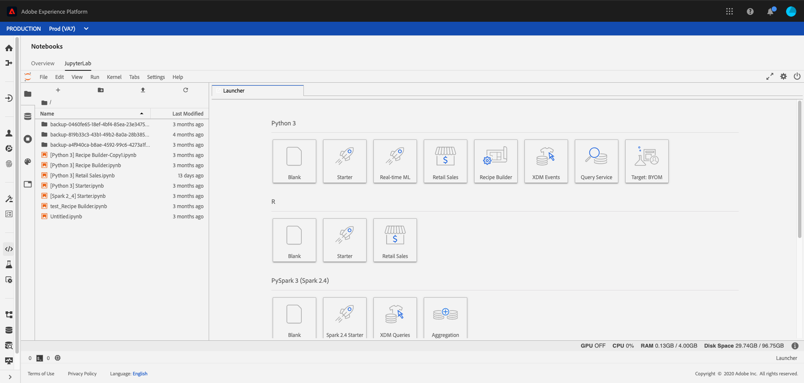

# 노트북으로 데이터 분석

이 자습서에서는 데이터 과학 작업 공간에 내장된 Jupiter 노트북을 사용하여 데이터를 액세스, 탐색 및 시각화하는 방법에 중점을 둡니다. 이 튜토리얼이 끝나면 데이터를 보다 잘 이해하기 위해 Jupiter Notebook이 제공하는 일부 기능을 이해해야 합니다.

다음 개념이 도입되었습니다.

- **[!DNL JupyterLab]: 프로젝트** [[!DNL JupyterLab]](https://blog.jupyter.org/jupyterlab-is-ready-for-users-5a6f039b8906) 주피터를 위한 차세대 웹 기반 인터페이스로, 와 긴밀하게 통합되어  [!DNL Adobe Experience Platform]있습니다.
- **배치:** 데이터 세트는 배치로 구성됩니다. 배치란 일정 기간 동안 수집되어 하나의 단위로 함께 처리되는 데이터 세트입니다. 데이터를 데이터 세트에 추가하면 새 일괄 처리가 만들어집니다.
- **데이터 액세스 SDK(더 이상 사용되지 않음):** 이제 데이터 액세스 SDK가 더 이상 사용되지 않습니다. [[!DNL Platform SDK]](../authoring/platform-sdk.md) 안내서를 사용하십시오.

## 데이터 과학 작업 공간에서 노트북 탐색

이 섹션에서는 소매 판매 스키마에 이전에 인제스트된 데이터를 조사합니다.

데이터 과학 작업 공간을 사용하면 시스템 학습 워크플로우를 만들고 편집할 수 있는 [!DNL JupyterLab] 플랫폼을 통해 [!DNL Jupyter Notebooks]을(를) 만들 수 있습니다. [!DNL JupyterLab] 은 사용자가 웹 브라우저를 통해 전자 필기장 문서를 편집할 수 있도록 하는 서버-클라이언트 공동 작업 도구입니다. 이러한 전자 필기장에는 실행 가능한 코드와 리치 텍스트 요소가 모두 포함될 수 있습니다. Macromedia는 Markdown을 사용하여 분석 설명 및 실행 [!DNL Python] 코드를 사용하여 데이터 탐색 및 분석을 수행할 것입니다.

### 작업 영역 선택

[!DNL JupyterLab]을(를) 시작할 때 Jupiter 노트북에 대한 웹 기반 인터페이스가 제공됩니다. 선택한 노트북 유형에 따라 해당 커널이 실행됩니다.

사용할 환경을 비교할 때 각 서비스의 제한 사항을 고려해야 합니다. 예를 들어, 일반 사용자가 [!DNL Python]인 [팬더](https://pandas.pydata.org/) 라이브러리를 사용하는 경우 RAM 제한은 2GB입니다. 고급 사용자라 하더라도 20GB RAM으로 제한됩니다. 더 많은 계산을 처리하는 경우 모든 노트북 인스턴스와 공유되는 1.5TB를 제공하는 [!DNL Spark]을 사용하는 것이 적절합니다.

기본적으로 GPU 클러스터의 Tensorflow 레서피 작업과 Python은 CPU 클러스터 내에서 실행됩니다.

### 새 전자 필기장 만들기

[!DNL Adobe Experience Platform] UI에서 상단 메뉴의 데이터 과학 탭을 클릭하여 데이터 과학 작업 영역으로 이동합니다. 이 페이지에서 [!DNL JupyterLab] 런처를 열 [!DNL JupyterLab] 탭을 클릭합니다. 이와 유사한 페이지가 표시됩니다.



이 튜토리얼에서는 Jupiter 노트북에서 [!DNL Python] 3을 사용하여 데이터에 액세스하고 탐색을 하는 방법을 보여 줍니다. 시작 관리자 페이지에는 제공된 샘플 전자 필기장이 있습니다. [!DNL Python] 3에 소매 판매 레서피를 사용할 것입니다.


소매 판매 레서피는 동일한 소매 판매 데이터 세트를 사용하여 Jupiter Notebook에서 데이터를 검색하고 시각화할 수 있는 방법을 보여주는 단일 예입니다. 또한, 노트북은 교육과 검증과 함께 더 심층적으로 나아갑니다. 이 특정 전자 필기장에 대한 자세한 내용은 이 [연습](../walkthrough.md)에서 확인할 수 있습니다.

### 데이터 액세스

>[!NOTE]
>
>`data_access_sdk_python`은(는) 더 이상 사용되지 않으며 더 이상 권장되지 않습니다. 코드를 변환하려면 [데이터 액세스 SDK를 플랫폼 SDK](../authoring/platform-sdk.md) 자습서로 변환을 참조하십시오. 이 튜토리얼에는 아래 단계와 동일한 단계가 적용됩니다.

[!DNL Adobe Experience Platform]에서 내부적으로 데이터 및 외부에서 데이터에 액세스하는 과정을 살펴봅니다. `data_access_sdk_python` 라이브러리를 사용하여 데이터 집합 및 XDM 스키마와 같은 내부 데이터에 액세스합니다. 외부 데이터를 위해, 우리는 판더 [!DNL Python] 라이브러리를 사용할 것입니다.

#### 외부 데이터

소매 판매 전자 필기장이 열리면 &quot;데이터 로드&quot; 헤더를 찾습니다. 다음 [!DNL Python] 코드는 팬더 &#39; `DataFrame` 데이터 구조와 [read_csv()](https://pandas.pydata.org/pandas-docs/stable/generated/pandas.read_csv.html#pandas.read_csv) 함수를 사용하여 [!DNL Github]에 호스팅된 CSV를 DataFrame으로 읽습니다.


팬더의 DataFrame 데이터 구조는 2차원 레이블이 지정된 데이터 구조입니다. 데이터 크기를 빠르게 보려면 `df.shape`을 사용할 수 있습니다. DataFrame의 크기를 나타내는 튜플을 반환합니다.


마지막으로 데이터가 어떻게 표시되는지 살펴볼 수 있습니다. `df.head(n)`을 사용하여 DataFrame의 첫 번째 `n` 행을 볼 수 있습니다.


#### [!DNL Experience Platform] 데이터

이제 [!DNL Experience Platform] 데이터에 대한 액세스를 계속합니다.

##### 데이터 세트 ID별

이 섹션의 경우 소매 판매 샘플 노트북에 사용된 것과 동일한 데이터 세트를 사용하는 소매 판매 데이터 세트를 사용합니다.

Jupiter Notebook에서 왼쪽의 **데이터** 탭 에서 데이터에 액세스할 수 있습니다. 탭을 선택하면 2개의 폴더가 제공됩니다. **[!UICONTROL 데이터 집합]** 폴더를 선택합니다.


이제 데이터 집합 디렉토리에서 인제스트된 데이터 집합을 모두 볼 수 있습니다. 디렉토리가 데이터 세트로 많이 채워지는 경우 모든 항목을 로드하는 데 1분이 걸릴 수 있습니다.

데이터 세트가 동일하므로 외부 데이터를 사용하는 이전 섹션의 로드 데이터를 대체하려고 합니다. **데이터 로드** 아래의 코드 블록을 선택하고 키보드에서 **&#39;d&#39;** 키를 두 번 누릅니다. 포커스가 텍스트가 아니라 블록에 있는지 확인합니다. **&#39;d&#39;**&#x200B;을 두 번 누르기 전에 텍스트 포커스를 이스케이프 처리하려면 **&#39;esc&#39;**&#x200B;을 누릅니다.

이제 데이터 세트를 마우스 오른쪽 단추로 클릭하고 드롭다운에서 &quot;노트북의 데이터 탐색&quot; 옵션을 선택합니다. `Retail-Training-<your-alias>` 실행 가능한 코드 항목이 전자 필기장에 나타납니다.

>[!TIP]
>
>코드를 변환하려면 [[!DNL Platform SDK]](../authoring/platform-sdk.md) 안내서를 참조하십시오.

```PYTHON
from data_access_sdk_python.reader import DataSetReader
from datetime import date
reader = DataSetReader()
df = reader.load(data_set_id="xxxxxxxx", ims_org="xxxxxxxx@AdobeOrg")
df.head()
```

[!DNL Python] 이외의 다른 커널에서 작업하는 경우 [이 페이지](https://github.com/adobe/acp-data-services-dsw-reference/wiki/Accessing-Data-on-the-Platform)를 참조하여 [!DNL Adobe Experience Platform]의 데이터에 액세스하십시오.

실행 파일을 선택한 다음 도구 모음에서 재생 단추를 누르면 실행 코드가 실행됩니다. `head()`에 대한 출력은 데이터 세트 키가 열 및 데이터 세트에 처음 n개 행이 있는 표가 됩니다. `head()` 정수 인수를 사용하여 출력할 줄 수를 지정합니다. 기본적으로 5입니다.


커널을 다시 시작하고 모든 셀을 다시 실행하는 경우 전과 동일한 출력을 받아야 합니다.


### 데이터 살펴보기

이제 데이터에 액세스할 수 있으므로 통계 및 시각화를 사용하여 데이터 자체에 집중할 수 있습니다. 우리가 사용하고 있는 데이터 집합은 정해진 날에 45개의 다른 스토어에 대한 기타 정보를 제공하는 소매 데이터 집합입니다. 지정된 `date` 및 `store`에 대한 일부 특성에는 다음이 포함됩니다.
- `storeType`
- `weeklySales`
- `storeSize`
- `temperature`
- `regionalFuelPrice`
- `markDown`
- `cpi`
- `unemployment`
- `isHoliday`

#### 통계 요약

[!DNL Python's] 팬더 라이브러리를 활용하여 각 속성의 데이터 유형을 가져올 수 있습니다. 다음 호출의 결과에는 각 열에 대한 항목 수와 데이터 유형에 대한 정보가 제공됩니다.

```PYTHON
df.info()
```


이 정보는 각 열의 데이터 유형을 알면 데이터를 처리하는 방법을 알 수 있으므로 유용합니다.

이제 통계 요약을 살펴보죠. 숫자 데이터 유형만 표시되므로 `date`, `storeType` 및 `isHoliday`는 출력되지 않습니다.

```PYTHON
df.describe()
```


이를 통해 각 특성에 대해 6435개의 인스턴스가 있음을 확인할 수 있습니다. 또한 평균, 표준 편차(표준), 최소, 최대 및 사분간 타일과 같은 통계 정보가 제공됩니다. 이는 데이터의 편차에 대한 정보를 제공합니다. 다음 섹션에서는 데이터를 잘 이해할 수 있도록 이 정보와 함께 작동하는 시각화를 살펴봅니다.

`store`에 대한 최소 및 최대 값을 보면 데이터가 나타내는 고유 저장소가 45개 있음을 알 수 있습니다. 스토어가 무엇인지 구별하는 `storeTypes`도 있습니다. 다음을 수행하여 `storeTypes`의 분포를 볼 수 있습니다.


즉, 22개 스토어는 `storeType` `A`이고 17은 `storeType` `B`이고 6은 `storeType` `C`입니다.

#### 데이터 시각화

데이터 프레임 값을 알고 있으므로 시각화를 통해 패턴을 보다 명확하고 손쉽게 식별할 수 있도록 보완하고자 합니다. 그래프는 결과를 대상자에게 전달하는 데에도 유용합니다. 시각화에 유용한 일부 [!DNL Python] 라이브러리는 다음과 같습니다.
- [Matplotlib](https://matplotlib.org/)
- [판다](https://pandas.pydata.org/)
- [seaborn](https://seaborn.pydata.org/)
- [플롯](https://ggplot2.tidyverse.org/)

이 섹션에서는 각 라이브러리를 사용할 때 몇 가지 이점을 살펴보겠습니다.

[가장 ](https://matplotlib.org/) 오래된  [!DNL Python] 시각화 패키지인 Matplotlibis 쉽고 어려운 일을 가능하게 만드는 것이 이들의 목표다. 패키지가 매우 강력하지만 복잡성이 있으므로 이러한 내용이 사실인 경향이 있습니다. 상당한 시간과 노력을 들이지 않고 합리적인 모양의 그래프를 만드는 것이 항상 쉬운 것은 아니다.

[통합된 ](https://pandas.pydata.org/) 인덱싱을 통해 데이터를 조작할 수 있는 DataFrame 객체에 주로 사용됩니다. 하지만 판다들은 또한 마트플로립을 기반으로 하는 내장된 플롯 기능도 포함하고 있다.

[matplotlib ](https://seaborn.pydata.org/) 위에 패키지 빌드를 배포합니다. 기본 그래프는 시각적으로 더 매력적인 기본 그래프를 만들고 복잡한 그래프 생성을 단순화하는 것입니다.

[또한 ](https://ggplot2.tidyverse.org/) matplotlib의 맨 위에 패키지를 배치합니다. 그러나 주요 차이점은 이 도구가 R용 ggplot2 포트라는 것입니다. 탐색과 유사하게, 목표는 matplotlib에 맞게 개선하는 것입니다. R용 glot2에 익숙한 사용자는 이 라이브러리를 고려해야 합니다.


##### 다변량 그래프

다변량 그래프는 개별 변수의 그래프입니다. 일반적인 다변량 그래프는 데이터를 상자 및 거품형 플롯으로 시각화하는 데 사용됩니다.

이전에는 리테일 데이터 세트를 사용하여 45개 매장과 매주 영업을 위한 상자를 만들 수 있었습니다. 플롯은 `seaborn.boxplot` 함수를 사용하여 생성됩니다.


상자 하나와 거품형 줄거리는 데이터의 분포를 보여주는 데 사용된다. 플롯의 외부 선은 위쪽 및 아래쪽 사분위수를 보여주며 상자는 사분위수 범위에 걸쳐 있습니다. 상자에 있는 줄은 중간값을 표시합니다. 1.5배 이상의 데이터 포인트는 상위 또는 하위 사분위의 모든 점으로 원으로 표시됩니다. 이러한 사항들은 이상치라고 간주된다.

##### 다변량 그래프

다변수 플롯은 변수 간의 상호 작용을 보는 데 사용됩니다. 시각화를 통해 데이터 과학자들은 변수 간에 상관 관계나 패턴이 있는지 확인할 수 있습니다. 일반적인 다변량 그래프는 상관 관계 행렬입니다. 상관 관계 행렬에서는 여러 변수 간의 종속성을 상관 계수와 함께 수량화합니다.

동일한 소매 데이터 세트를 사용하여 상관 관계 매트릭스를 생성할 수 있습니다.


1의 대각선이 중앙을 따라 내려가는 것을 보세요. 이것은 변수를 자신과 비교할 때 완전한 긍정적인 상관관계가 있음을 보여줍니다. 긍정적인 상관관계는 1에 가까울수록 약하지만 상관관계는 0에 가깝다는 것이다. 음수 상관관계는 역트렌드를 나타내는 음수 계수와 함께 표시됩니다.


## 다음 단계

이 자습서에서는 데이터 과학 작업 공간에서 새 Jupiter 전자 필기장을 만드는 방법 및 외부뿐만 아니라 [!DNL Adobe Experience Platform]에서 데이터에 액세스하는 방법을 살펴봅니다. 특히 다음 단계를 살펴보았습니다.
- 새 Jupiter 노트북 만들기
- 데이터 집합 및 스키마 액세스
- 데이터 세트 탐색

이제 [다음 섹션](../models-recipes/package-source-files-recipe.md)에서 레서피를 패키지하고 데이터 과학 작업 영역으로 가져올 준비가 되었습니다.