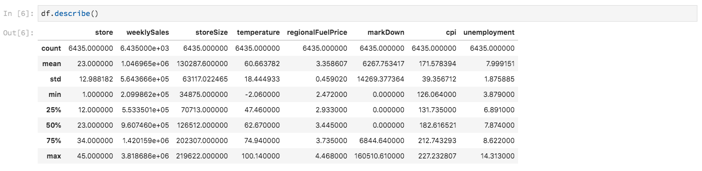

# 전자 필기장을 사용하여 데이터 분석

이 자습서에서는 Data Science Workspace 내에 구축된 Jupiter Notebook을 사용하여 데이터에 액세스하고 탐색 및 시각화하는 방법에 중점을 둡니다. 이 자습서를 마치면 Jupiter Notebook에서 제공하는 몇 가지 기능을 이해하여 데이터를 보다 잘 이해할 수 있습니다.

다음 개념이 도입되었습니다.

- **[!DNL JupyterLab]:** [[!DNL JupyterLab]](https://blog.jupyter.org/jupyterlab-is-ready-for-users-5a6f039b8906) 는 Project Jupiter의 차세대 웹 기반 인터페이스로서 [!DNL Adobe Experience Platform].
- **배치:** 데이터 세트는 배치로 구성됩니다. 배치는 일정 기간 동안 수집된 데이터 집합이며 하나의 단위로 함께 처리됩니다. 데이터가 데이터 세트에 추가되면 새 배치가 만들어집니다.
- **Data Access SDK(더 이상 사용되지 않음):** 이제 데이터 액세스 SDK는 더 이상 사용되지 않습니다. 다음 코드를 사용하십시오 [[!DNL Platform SDK]](../authoring/platform-sdk.md) 안내서.

## 데이터 과학 작업 공간에서 노트북 탐색

이 섹션에서는 이전에 소매 판매 스키마로 수집한 데이터를 탐색합니다.

Data Science Workspace를 사용하여 사용자가 [!DNL Jupyter Notebooks] 사용 [!DNL JupyterLab] 머신 러닝 워크플로우를 만들고 편집할 수 있는 플랫폼 [!DNL JupyterLab] 는 사용자가 웹 브라우저를 통해 전자 필기장 문서를 편집할 수 있도록 해주는 서버-클라이언트 공동 작업 도구입니다. 이러한 전자 필기장에는 실행 가능한 코드와 리치 텍스트 요소가 모두 포함될 수 있습니다. 목적을 위해 Markdown을 분석 설명 및 실행 파일에 사용할 것입니다 [!DNL Python] 데이터 탐색 및 분석을 수행하는 코드입니다.

### 작업 공간 선택

시작 시 [!DNL JupyterLab]과 같은 경우에는 Jupiter Notebook용 웹 기반 인터페이스가 제공됩니다. 선택한 노트북 유형에 따라 해당 커널이 실행됩니다.

사용할 환경을 비교할 때에는 각 서비스의 제한 사항을 고려해야 합니다. 예를 들어 [판다](https://pandas.pydata.org/) 라이브러리 포함 [!DNL Python]일반 사용자라면 RAM 제한은 2GB입니다. 전력 사용자로서 20GB의 RAM으로 제한됩니다. 더 많은 계산을 처리한다면, [!DNL Spark] 모든 노트북 인스턴스와 공유되는 1.5TB를 제공합니다.

기본적으로 GPU 클러스터에서 Tensorflow 레서피 작업이 수행되고 Python은 CPU 클러스터 내에서 실행됩니다.

### 새 전자 필기장 만들기

에서 [!DNL Adobe Experience Platform] UI, 선택 [!UICONTROL 데이터 과학] 를 클릭하여 데이터 과학 작업 공간으로 이동합니다. 이 페이지에서 [!DNL JupyterLab] 열다 [!DNL JupyterLab] 시작 관리자 이와 유사한 페이지가 표시됩니다.


이 자습서에서는 [!DNL Python] 3 데이터를 액세스하여 탐색하는 방법을 보여 주기 위해 Jupiter Notebook에서 시작 관리자 페이지에는 샘플 전자 필기장이 제공됩니다. Dell은 [!DNL Python] 3.


소매 판매 레서피는 동일한 소매 판매 데이터 세트를 사용하여 Jupiter Notebook에서 데이터를 검색하고 시각화하는 방법을 보여주는 독립형 예입니다. 또한, 노트는 교육과 검증과 함께 더 깊이 있게 진행한다. 이 특정 전자 필기장에 대한 자세한 내용은 [연습](../walkthrough.md).

### 데이터 액세스

>[!NOTE]
>
>다음 `data_access_sdk_python` 는 더 이상 사용되지 않으며 더 이상 권장되지 않습니다. 자세한 내용은 [데이터 액세스 SDK를 Platform SDK로 변환](../authoring/platform-sdk.md) 코드를 변환하는 자습서입니다. 이 자습서에는 아래 나와 동일한 단계가 적용됩니다.

에서 내부적으로 데이터에 액세스하는 작업을 살펴보겠습니다 [!DNL Adobe Experience Platform] 외부에서 데이터를 생성합니다. Adobe에서는 `data_access_sdk_python` 라이브러리 를 사용하여 데이터 세트 및 XDM 스키마와 같은 내부 데이터에 액세스합니다. 외부 자료를 위해, 우리는 판다를 사용할 것입니다 [!DNL Python] 라이브러리.

#### 외부 데이터

소매 판매 전자 필기장이 열리면 &quot;데이터 로드&quot; 헤더를 찾습니다. 다음 [!DNL Python] 코드가 판다를 사용함 `DataFrame` 데이터 구조 및 [read_csv()](https://pandas.pydata.org/pandas-docs/stable/generated/pandas.read_csv.html#pandas.read_csv) 에 호스팅된 CSV를 읽는 기능 [!DNL Github] 를 DataFrame으로 변환:


판다의 DataFrame 데이터 구조는 2차원적 데이터 구조입니다. 데이터 차원을 빠르게 보기 위해 `df.shape`. DataFrame의 차원을 나타내는 튜플을 반환합니다.


마지막으로 데이터가 어떻게 표시되는지 확인할 수 있습니다. 사용할 수 있습니다 `df.head(n)` 첫 번째 `n` DataFrame 행:


#### [!DNL Experience Platform] 데이터

이제, 우리는 [!DNL Experience Platform] 데이터.

##### 데이터 세트 ID별

이 섹션에서는 소매 판매 샘플 노트북에서 사용되는 것과 동일한 데이터 세트인 소매 판매 데이터 세트를 사용합니다.

Jupiter Notebook에서는 **데이터** 탭  왼쪽에 있습니다. 탭을 선택하면 두 개의 폴더가 제공됩니다. 을(를) 선택합니다 **[!UICONTROL 데이터 세트]** 폴더를 입력합니다.


이제 데이터 세트 디렉토리에서 수집된 모든 데이터 세트를 볼 수 있습니다. 디렉토리가 데이터 세트로 많이 채워지는 경우 모든 항목을 로드하는 데 1분이 걸릴 수 있습니다.

데이터 세트가 동일하므로 외부 데이터를 사용하는 이전 섹션의 로드 데이터를 바꾸려고 합니다. 아래에서 코드 블록을 선택합니다. **데이터 로드** 그리고 **&#39;d&#39;** 키를 두 번 클릭합니다. 포커스가 텍스트가 아닌 블록에 있는지 확인합니다. 누르기 **&#39;esc&#39;** 누르기 전에 텍스트 포커스를 이스케이프 처리하려면 **&#39;d&#39;** 두 번

이제 마우스 오른쪽 단추를 클릭하면 됩니다. `Retail-Training-<your-alias>` 데이터 세트를 설정하고 드롭다운에서 &quot;노트북에서 데이터 탐색&quot; 옵션을 선택합니다. 전자 필기장에 실행 가능한 코드 항목이 나타납니다.

>[!TIP]
>
>자세한 내용은 [[!DNL Platform SDK]](../authoring/platform-sdk.md) 코드 변환 안내서입니다.

```PYTHON
from data_access_sdk_python.reader import DataSetReader
from datetime import date
reader = DataSetReader()
df = reader.load(data_set_id="xxxxxxxx", ims_org="xxxxxxxx@AdobeOrg")
df.head()
```

다른 커널에서 작업 중인 경우 [!DNL Python]을(를) 참조하십시오. [이 페이지](https://github.com/adobe/acp-data-services-dsw-reference/wiki/Accessing-Data-on-the-Platform) 의 데이터에 액세스하려면 [!DNL Adobe Experience Platform].

실행 파일을 선택한 다음 도구 모음에서 재생 단추를 누르면 실행 코드가 실행됩니다. 다음에 대한 출력 `head()` 는 데이터 세트의 키를 열로 사용하고 데이터 세트에 있는 첫 번째 n 행이 있는 표가 됩니다. `head()` 에서는 정수 인수를 사용하여 출력할 줄 수를 지정합니다. 기본적으로 5입니다.


커널을 다시 시작하고 모든 셀을 다시 실행하면 이전과 동일한 출력을 얻을 수 있습니다.


### 데이터 탐색

이제 데이터에 액세스할 수 있으므로 통계 및 시각화를 사용하여 데이터 자체에 집중하겠습니다. 우리가 사용하는 데이터 세트는 지정된 날에 45개의 다른 저장소에 대한 기타 정보를 제공하는 소매 데이터 세트입니다. 특정 `date` 및 `store` 다음을 포함합니다.
- `storeType`
- `weeklySales`
- `storeSize`
- `temperature`
- `regionalFuelPrice`
- `markDown`
- `cpi`
- `unemployment`
- `isHoliday`

#### 통계 요약

활용할 수 있습니다 [!DNL Python's] 팬더 라이브러리로 각 특성의 데이터 유형을 가져올 수 있습니다. 다음 호출의 결과에서는 각 열의 항목 수 및 데이터 유형에 대한 정보를 제공합니다.

```PYTHON
df.info()
```


이 정보는 각 열의 데이터 유형을 알면 데이터를 처리하는 방법을 알 수 있으므로 유용합니다.

이제 통계 요약을 살펴보겠습니다. 숫자 데이터 유형만 표시되므로 `date`, `storeType`, 및 `isHoliday` 이(가) 출력되지 않습니다.

```PYTHON
df.describe()
```



이를 통해 각 특성에 대해 6435개의 인스턴스가 있음을 알 수 있습니다. 또한 평균, 표준 편차(표준 편차), 최소, 최대 및 사분간 등의 통계적 정보가 제공됩니다. 이는 데이터의 편차에 대한 정보를 제공합니다. 다음 섹션에서는 데이터에 대해 잘 이해할 수 있도록 이 정보와 함께 작동하는 시각화를 살펴봅니다.

에 대한 최소 및 최대 값 보기 `store`, 데이터가 나타내는 45개의 고유한 저장소가 있음을 알 수 있습니다. 또한 `storeTypes` 그게 바로 가게의 의미입니다 우리는 `storeTypes` 다음을 수행하십시오.


이것은 22개의 상점이 `storeType` `A`, 17 `storeType` `B`, 6 및 `storeType` `C`.

#### 데이터 시각화

이제 데이터 프레임 값을 알고 있으므로 패턴을 더 명확하고 쉽게 식별할 수 있도록 시각화를 통해 이를 보완하고자 합니다. 그래프는 결과를 대상자에게 전송할 때도 유용합니다. 일부 [!DNL Python] 시각화에 유용한 라이브러리는 다음과 같습니다.
- [Matplotlib](https://matplotlib.org/)
- [판다](https://pandas.pydata.org/)
- [seabort](https://seaborn.pydata.org/)
- [플롯](https://ggplot2.tidyverse.org/)

이 섹션에서는 각 라이브러리를 사용할 때 몇 가지 이점을 빠르게 살펴봅니다.

[Matplotlib](https://matplotlib.org/) 가장 오래됨 [!DNL Python] 시각화 패키지 이들의 목표는 &quot;쉽고 어려운 것들을 가능하게 만드는 것이다.&quot; 이 기능은 패키지가 매우 강력하지만 복잡성이 있으므로 거의 모두 충족되는 경향이 있습니다. 상당한 시간과 노력을 들이지 않고 합리적으로 보이는 그래프를 얻는 것이 항상 쉬운 것은 아니다.

[판다](https://pandas.pydata.org/) 는 주로 통합 색인을 사용하여 데이터 조작을 허용하는 DataFrame 개체에 사용됩니다. 그러나 판다는 또한 마트플로립을 기반으로 하는 내장된 플로팅 기능도 포함한다.

[seabort](https://seaborn.pydata.org/) 은 matplolib 위에 있는 패키지 빌드입니다. 이 그래프의 주요 목표는 기본 그래프를 시각적으로 호소력 있게 만들고 복잡한 그래프를 쉽게 만드는 것입니다.

[플롯](https://ggplot2.tidyverse.org/) 은 matplolib 위에 빌드된 패키지입니다. 그러나 주요 차이점은 공구가 R용 gplot2의 포트라는 점이다. 탐색과 유사하게, 목표는 matplotlib에 따라 개선하는 것이다. R용 gplot2에 익숙한 사용자는 이 라이브러리를 고려해야 합니다.


##### 다변량 그래프

다변량 그래프는 개별 변수의 그래프입니다. 일반적인 다변량 그래프는 데이터를 상자 및 거품기 플롯으로 시각화하는 데 사용됩니다.

이전부터 소매 데이터 세트를 사용하여 45개 매장과 매주 판매될 매장에 대한 박스 및 거품기 플롯을 생성할 수 있습니다. 플롯은 `seaborn.boxplot` 함수 위에 있어야 합니다.


상자나 휘스커 플롯은 데이터의 분포를 보여주는 데 사용됩니다. 플롯의 바깥쪽 선은 위쪽 및 아래쪽 사분위수를 보여주며 상자는 사분위수 범위에 걸쳐 있습니다. 상자의 선은 중간값을 표시합니다. 상위 또는 하위 사분위의 1.5배 이상의 데이터 포인트는 원으로 표시됩니다. 이 요점들은 이상치로 간주된다.

##### 다변량 그래프

변수 간의 상호 작용을 보는 데 다변량 플롯이 사용됩니다. 데이터 과학자들은 시각화를 통해 변수 간에 상관 관계 또는 패턴이 있는지 확인할 수 있습니다. 사용되는 일반적인 다변량 그래프는 상관 관계 매트릭스입니다. 상관 관계 매트릭스를 사용하면 여러 변수 간의 종속성이 상관 계수로 수량화됩니다.

동일한 소매 데이터 세트를 사용하여 상관 관계 매트릭스를 생성할 수 있습니다.


가운데 아래에 있는 대각선을 보세요. 이는 변수를 자신과 비교할 때 완전한 긍정적인 상관관계가 있음을 보여줍니다. 긍정적인 상관관계가 1에 가깝고 상관관계가 약하면 0에 가깝다는 것이다. 역 트렌드를 나타내는 음수 계수와 함께 음수 상관 관계가 표시됩니다.


## 다음 단계

이 자습서에서는 데이터 과학 작업 공간에서 새 Jupiter 노트북을 만드는 방법과 외부 뿐만 아니라 [!DNL Adobe Experience Platform]. 특히 다음 단계를 살펴보았습니다.
- 새 Jupiter 전자 필기장 만들기
- 데이터 세트 및 스키마 액세스
- 데이터 세트 탐색

이제 다음을 수행할 준비가 되었습니다. [다음 섹션](../models-recipes/package-source-files-recipe.md) 를 사용하여 레서피를 패키징하고 Data Science Workspace로 가져옵니다.
