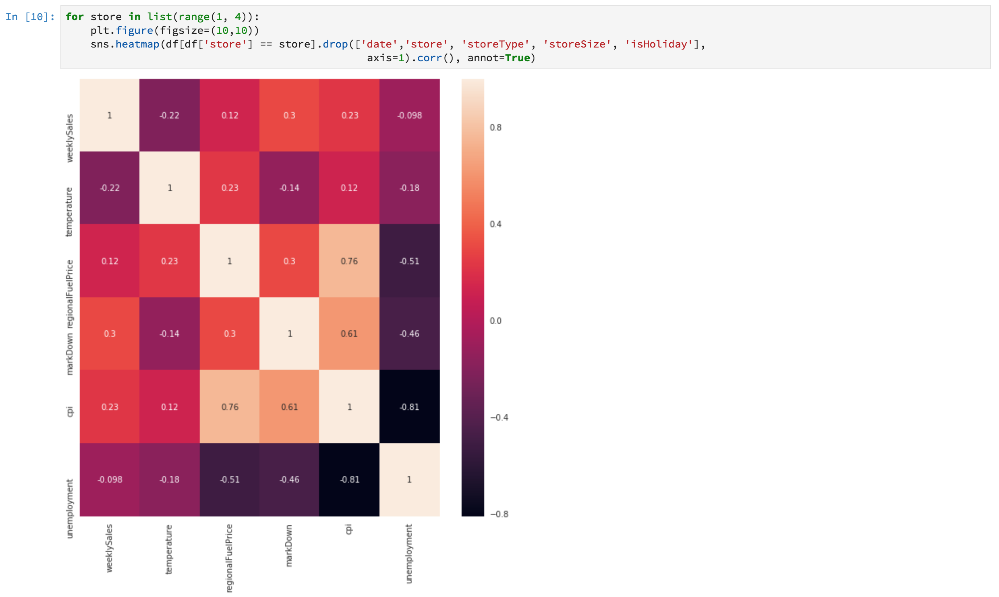

# Notebooks를 사용하여 데이터 분석

>[!NOTE]
>
>Data Science Workspace은 더 이상 구입할 수 없습니다.
>
>이 설명서는 Data Science Workspace에 대한 이전 권한이 있는 기존 고객을 대상으로 합니다.

이 자습서에서는 Data Science Workspace 내에 구축된 Jupyter Notebooks를 사용하여 데이터에 액세스하고 이를 탐색하고 시각화하는 방법에 중점을 둡니다. 이 자습서를 마칠 때까지는 Jupyter Notebooks가 제공하는 몇 가지 기능을 이해하여 데이터를 더 잘 이해할 수 있어야 합니다.

다음과 같은 개념이 도입되었습니다.

- **[!DNL JupyterLab]:** [[!DNL JupyterLab]](https://blog.jupyter.org/jupyterlab-is-ready-for-users-5a6f039b8906)은(는) Project Jupyter의 차세대 웹 기반 인터페이스이며 [!DNL Adobe Experience Platform]에 긴밀하게 통합됩니다.
- **배치:** 데이터 세트는 배치로 구성됩니다. 배치는 일정 기간 동안 수집된 데이터 집합으로, 단일 단위로 함께 처리됩니다. 데이터가 데이터 세트에 추가되면 새 배치가 생성됩니다.
- **Data Access SDK(더 이상 사용되지 않음):** 이제 Data Access SDK이 더 이상 사용되지 않습니다. [[!DNL Experience Platform SDK]](../authoring/platform-sdk.md) 가이드를 사용하십시오.

## 데이터 과학 Workspace에서 노트북 살펴보기

이 섹션에서는 이전에 소매 판매 스키마로 수집되었던 데이터를 살펴봅니다.

Data Science Workspace을 사용하면 사용자가 [!DNL JupyterLab] 플랫폼을 통해 기계 학습 워크플로를 만들고 편집할 수 있는 [!DNL Jupyter Notebooks]을(를) 만들 수 있습니다. [!DNL JupyterLab]은(는) 사용자가 웹 브라우저를 통해 전자 필기장 문서를 편집할 수 있는 서버-클라이언트 공동 작업 도구입니다. 이러한 전자 필기장에는 실행 코드와 서식 있는 텍스트 요소가 모두 포함될 수 있습니다. 분석 설명 및 실행 가능한 [!DNL Python] 코드에 Markdown을 사용하여 데이터 탐색 및 분석을 수행합니다.

### 작업 영역 선택

[!DNL JupyterLab]을(를) 실행하면 Jupyter Notebooks용 웹 기반 인터페이스가 표시됩니다. 어떤 유형의 노트북을 선택하느냐에 따라 해당 커널이 시작됩니다.

사용할 환경을 비교할 때는 각 서비스의 제한 사항을 고려해야 합니다. 예를 들어 [!DNL Python]과(와) 함께 [pandas](https://pandas.pydata.org/) 라이브러리를 일반 사용자로 사용하는 경우 RAM 제한은 2GB입니다. 파워 유저로서도 우리는 20GB의 RAM으로 제한됩니다. 더 큰 계산을 처리하는 경우 모든 노트북 인스턴스와 공유하는 1.5TB를 제공하는 [!DNL Spark]을(를) 사용하는 것이 적절합니다.

기본적으로 Tensorflow 레시피는 GPU 클러스터에서 작동하고 Python은 CPU 클러스터 내에서 실행됩니다.

### 새 전자 필기장 만들기

[!DNL Adobe Experience Platform] UI의 상단 메뉴에서 [!UICONTROL Data Science]을(를) 선택하여 Data Science Workspace으로 이동합니다. 이 페이지에서 [!DNL JupyterLab]을(를) 선택하여 [!DNL JupyterLab] 런처를 엽니다. 다음과 유사한 페이지가 표시됩니다.


자습서에서는 Jupyter Notebook에서 [!DNL Python] 3을 사용하여 데이터에 액세스하고 탐색하는 방법을 보여줍니다. 런처 페이지에는 제공되는 샘플 노트북이 있습니다. [!DNL Python] 3에 대한 소매 판매 레시피를 사용합니다.


소매 판매 레시피는 동일한 소매 판매 데이터 세트를 사용하여 Jupyter Notebook에서 데이터를 탐색하고 시각화할 수 있는 방법을 보여 주는 독립 실행형 예입니다. 또한 이 노트북은 교육 및 검증을 통해 더욱 심층적으로 제공됩니다. 이 전자 필기장에 대한 자세한 내용은 이 [연습](../walkthrough.md)에서 확인할 수 있습니다.

### 데이터 액세스

>[!NOTE]
>
>`data_access_sdk_python`은(는) 더 이상 사용되지 않으며 더 이상 권장되지 않습니다. 코드를 변환하려면 [SDK에서 Experience Platform SDK으로 데이터 액세스 변환](../authoring/platform-sdk.md) 자습서를 참조하십시오. 아래 동일한 단계가 이 자습서에 계속 적용됩니다.

[!DNL Adobe Experience Platform]의 데이터를 내부적으로 액세스하고 외부의 데이터를 다시 액세스하겠습니다. `data_access_sdk_python` 라이브러리를 사용하여 데이터 세트 및 XDM 스키마와 같은 내부 데이터에 액세스합니다. 외부 데이터의 경우 pandas [!DNL Python] 라이브러리를 사용합니다.

#### 외부 데이터

Retail Sales 노트북이 열린 상태에서 &quot;Load Data&quot; 헤더를 찾습니다. 다음 [!DNL Python] 코드는 pandas의 `DataFrame` 데이터 구조와 [read_csv()](https://pandas.pydata.org/pandas-docs/stable/generated/pandas.read_csv.html#pandas.read_csv) 함수를 사용하여 [!DNL Github]에 호스팅된 CSV를 DataFrame으로 읽습니다.


Pandas의 DataFrame 데이터 구조는 2차원 레이블이 지정된 데이터 구조입니다. 데이터 차원을 빠르게 보려면 `df.shape`을(를) 사용합니다. DataFrame의 차원을 나타내는 튜플을 반환합니다.


마지막으로 데이터가 어떻게 생겼는지 엿볼 수 있습니다. `df.head(n)`을(를) 사용하여 DataFrame의 첫 번째 `n` 행을 볼 수 있습니다.


#### [!DNL Experience Platform] 데이터

이제 [!DNL Experience Platform] 데이터 액세스를 다시 살펴보겠습니다.

##### 데이터 세트 ID별

이 섹션에서는 소매 판매 샘플 노트북에서 사용되는 것과 동일한 소매 판매 데이터 세트를 사용합니다.

Jupyter Notebook에서 왼쪽의 **데이터** 탭 에서 데이터에 액세스할 수 있습니다. 탭을 선택하면 두 개의 폴더가 제공됩니다. **[!UICONTROL 데이터 세트]** 폴더를 선택하십시오.


이제 데이터 세트 디렉터리에서 수집된 모든 데이터 세트를 볼 수 있습니다. 디렉터리가 데이터 세트로 많이 채워진 경우 모든 항목을 로드하는 데 1분이 걸릴 수 있습니다.

데이터 세트가 동일하기 때문에 외부 데이터를 사용하는 이전 섹션의 로드 데이터를 교체하려고 합니다. **데이터 로드**&#x200B;에서 코드 블록을 선택하고 키보드에서 **d&#39;** 키를 두 번 누릅니다. 포커스가 텍스트가 아닌 블록에 있는지 확인합니다. **d&#39;**&#x200B;을(를) 두 번 누르기 전에 **&#39;esc&#39;**&#x200B;을(를) 눌러 텍스트 포커스를 벗어날 수 있습니다.

이제 `Retail-Training-<your-alias>` 데이터 세트를 마우스 오른쪽 단추로 클릭하고 드롭다운에서 &quot;Notebook에서 데이터 탐색&quot; 옵션을 선택할 수 있습니다. 전자 필기장에 실행 코드 항목이 나타납니다.

>[!TIP]
>
>코드를 변환하려면 [[!DNL Experience Platform SDK]](../authoring/platform-sdk.md) 안내서를 참조하세요.

```PYTHON
from data_access_sdk_python.reader import DataSetReader
from datetime import date
reader = DataSetReader()
df = reader.load(data_set_id="xxxxxxxx", ims_org="xxxxxxxx@AdobeOrg")
df.head()
```

[!DNL Python] 이외의 다른 커널에서 작업하는 경우 [이 페이지](https://github.com/adobe/acp-data-services-dsw-reference/wiki/Accessing-Data-on-the-Platform)를 참조하여 [!DNL Adobe Experience Platform]의 데이터에 액세스하십시오.

실행 셀을 선택한 다음 도구 모음에서 재생 단추를 누르면 실행 코드가 실행됩니다. `head()`에 대한 출력은 데이터 집합의 키가 열로 있고 데이터 집합에 첫 번째 n개 행이 있는 테이블입니다. `head()`은(는) 정수 인수를 수락하여 출력할 줄 수를 지정합니다. 기본적으로 5입니다.


커널을 다시 시작하고 모든 셀을 다시 실행하면 이전과 동일한 출력을 얻을 수 있습니다.


### 데이터 탐색

이제 데이터에 액세스할 수 있으므로 통계와 시각화를 사용하여 데이터 자체에 집중해 보겠습니다. 우리가 사용하고 있는 데이터 세트는 주어진 날에 45개의 다른 상점에 대한 기타 정보를 제공하는 소매 데이터 세트입니다. 지정된 `date` 및 `store`의 일부 특성에는 다음이 포함됩니다.
- `storeType`
- `weeklySales`
- `storeSize`
- `temperature`
- `regionalFuelPrice`
- `markDown`
- `cpi`
- `unemployment`
- `isHoliday`

#### 통계 요약

[!DNL Python's] pandas 라이브러리를 활용하여 각 특성의 데이터 형식을 가져올 수 있습니다. 다음 호출의 출력은 각 열의 항목 수와 데이터 유형에 대한 정보를 제공합니다.

```PYTHON
df.info()
```


이 정보는 각 열의 데이터 유형을 알면 데이터를 처리하는 방법을 알 수 있으므로 유용합니다.

이제 통계적 요약을 살펴보자. 숫자 데이터 형식만 표시되므로 `date`, `storeType` 및 `isHoliday`이(가) 출력되지 않습니다.

```PYTHON
df.describe()
```


이를 통해 각 특성에 대해 6435개의 인스턴스가 있음을 알 수 있다. 또한 평균, 표준편차(std), 최소, 최대, 사분위간 등의 통계 정보가 주어진다. 이것은 우리에게 자료에 대한 편차에 대한 정보를 준다. 다음 섹션에서는 데이터를 잘 이해할 수 있도록 이 정보와 함께 작동하는 시각화에 대해 살펴봅니다.

`store`의 최소값과 최대값을 살펴보면 데이터가 나타내는 45개의 고유한 저장소가 있음을 알 수 있습니다. 스토어를 구별하는 `storeTypes`도 있습니다. 다음을 수행하여 `storeTypes`의 분포를 확인할 수 있습니다.


즉, 22개의 저장소가 `storeType` `A`이고, 17개는 `storeType` `B`이고, 6개는 `storeType` `C`입니다.

#### 데이터 시각화

이제 데이터 프레임 값을 알았으므로 이 내용을 시각화로 보완하여 패턴을 더 명확하고 쉽게 식별할 수 있도록 하려고 합니다. 그래프는 결과를 대상자에게 전달할 때도 유용합니다. 시각화에 유용한 일부 [!DNL Python] 라이브러리는 다음과 같습니다.
- [Matplotlib](https://matplotlib.org/)
- [pandas](https://pandas.pydata.org/)
- [설정](https://seaborn.pydata.org/)
- [그림](https://ggplot2.tidyverse.org/)

이 섹션에서는 각 라이브러리를 사용할 때 얻을 수 있는 몇 가지 장점에 대해 빠르게 살펴보겠습니다.

[Matplotlib](https://matplotlib.org/)은(는) 가장 오래된 [!DNL Python] 시각화 패키지입니다. 그들의 목표는 &quot;쉬운 것들을 쉽고 힘든 것들이 가능하게&quot; 만드는 것이다. 패키지는 매우 강력하지만 복잡하기 때문에 이는 사실인 경향이 있습니다. 상당한 시간과 노력을 들이지 않고서는 타당한 모양의 그래프를 얻는 것이 항상 쉬운 것은 아니다.

[Pandas](https://pandas.pydata.org/)은(는) 주로 통합 인덱싱으로 데이터를 조작할 수 있는 DataFrame 개체에 사용됩니다. 그러나 판다에는 matplotlib을 기반으로 하는 플로팅 기능이 내장되어 있습니다.

[seaborn](https://seaborn.pydata.org/)은(는) matplotlib 위에 빌드된 패키지입니다. 기본 그래프는 시각적으로 더 매력적이고 복잡한 그래프를 간단하게 만드는 것이 주요 목표입니다.

[ggplot](https://ggplot2.tidyverse.org/)은 matplotlib 위에 빌드된 패키지입니다. 그러나 주요 차이점은 도구가 R용 ggplot2 포트라는 것입니다. seaborn과 마찬가지로 matplotlib를 개선하는 것이 목표입니다. R용 ggplot2에 익숙한 사용자는 이 라이브러리를 고려해야 합니다.


##### 일변량 그래프

일변량 그래프는 개별 변수의 그래프입니다. 일반적인 일변량 그래프는 상자 및 위스커 플롯이라는 데이터를 시각화하는 데 사용됩니다.

이전에 판매된 소매 데이터 세트를 사용하여 45개 매장과 주간 매출에 대한 박스 및 위스커 플롯을 생성할 수 있습니다. 플롯은 `seaborn.boxplot` 함수를 사용하여 생성됩니다.


상자 및 위스커 플롯을 사용하여 데이터 분포를 표시합니다. 플롯의 바깥쪽 선은 위 사분위수와 아래 사분위수를 나타내고, 상자는 사분위수 범위에 걸쳐 있다. 상자에 있는 선은 중앙값을 표시합니다. 상위 또는 하위 분위의 1.5배 이상의 자료 점은 원으로 표시하였다. 이러한 포인트는 이상치로 간주됩니다.

##### 다변량 그래프

다변량 도표는 변수 간의 상호 작용을 보는 데 사용됩니다. 시각화를 통해 데이터 과학자는 변수 간에 상관관계나 패턴이 있는지 확인할 수 있다. 사용된 일반적인 다변량 그래프는 상관 관계 행렬입니다. 상관 행렬을 이용하여 여러 변수 간의 종속성을 상관 계수로 정량화한다.

동일한 소매 데이터 세트를 사용하여 상관 관계 행렬을 생성할 수 있습니다.



가운데 1의 대각선을 보세요. 이는 변수와 자신을 비교할 때 완전한 양의 상관관계를 가지고 있음을 보여준다. 강한 양의 상관관계는 1에 가까운 크기를 가질 것이고 약한 상관관계는 0에 가까울 것이다. 음의 상관관계는 음의 계수로 나타나 역의 추세를 보이고 있다.


## 다음 단계

이 튜토리얼에서는 데이터 과학 Workspace에서 새 Jupyter 전자 필기장을 만드는 방법과 외부에서 그리고 [!DNL Adobe Experience Platform]에서 데이터에 액세스하는 방법에 대해 살펴보았습니다. 특히 다음 단계를 살펴보았습니다.
- 새 Jupyter Notebook 만들기
- 데이터 세트 및 스키마 액세스
- 데이터 세트 탐색

이제 [다음 섹션](../models-recipes/package-source-files-recipe.md)으로 이동하여 레시피를 패키징하고 Data Science Workspace으로 가져올 준비가 되었습니다.
