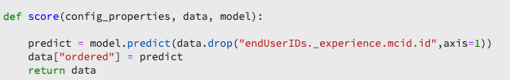
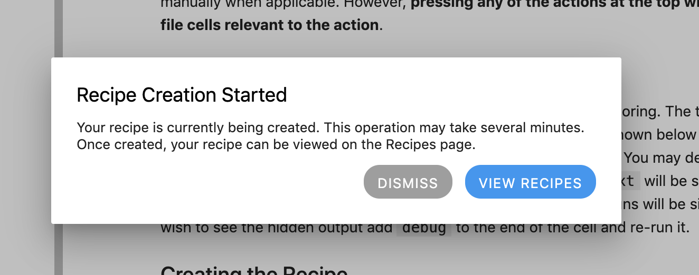

# JupyterLab Notebooks를 사용하여 모델 만들기

>[!NOTE]
>
>Data Science Workspace은 더 이상 구입할 수 없습니다.
>
>이 설명서는 Data Science Workspace에 대한 이전 권한이 있는 기존 고객을 대상으로 합니다.

이 튜토리얼에서는 JupyterLab notebooks 레시피 빌더 템플릿을 사용하여 모델을 만드는 데 필요한 단계를 안내합니다.

## 소개된 개념:

- **레서피:** 레서피는 Adobe의 모델 사양 용어로, 훈련된 모델을 만들고 실행하는 데 필요한 특정 기계 학습, AI 알고리즘 또는 알고리즘, 처리 논리 및 구성의 앙상블을 나타내는 최상위 컨테이너입니다.
- **모델:** 모델은 비즈니스 사용 사례에 대해 해결하기 위해 이전 데이터와 구성을 사용하여 교육되는 머신 러닝 레시피의 인스턴스입니다.
- **교육:** 교육은 레이블이 지정된 데이터의 패턴과 통찰력을 학습하는 프로세스입니다.
- **채점:** 채점은 훈련된 모델을 사용하여 데이터에서 통찰력을 생성하는 프로세스입니다.

## 필요한 에셋 다운로드 {#assets}

이 자습서를 진행하기 전에 필요한 스키마 및 데이터 세트를 만들어야 합니다. [Luma 성향 모델 스키마 및 데이터 세트 만들기](../models-recipes/create-luma-data.md)에 대한 자습서를 방문하여 필요한 자산을 다운로드하고 사전 요구 사항을 설정합니다.

## [!DNL JupyterLab] 전자 필기장 환경 시작

레시피를 처음부터 만드는 작업은 [!DNL Data Science Workspace] 내에 수행할 수 있습니다. 시작하려면 [Adobe Experience Platform](https://platform.adobe.com)&#x200B;(으)로 이동하여 왼쪽의 **[!UICONTROL 전자 필기장]** 탭을 선택하십시오. 새 전자 필기장을 만들려면 [!DNL JupyterLab Launcher]에서 Recipe Builder 템플릿을 선택하십시오.

[!UICONTROL 레시피 빌더] 전자 필기장을 사용하면 전자 필기장 내에서 교육 및 채점 실행을 실행할 수 있습니다. 이렇게 하면 교육 및 채점 데이터에 대한 실험 실행 사이에서 `train()` 및 `score()` 메서드를 유연하게 변경할 수 있습니다. 교육 및 채점의 결과가 만족스러우면 레시피를 만들고 레시피를 사용하여 모델 기능을 모델링하여 모델로 게시할 수 있습니다.

>[!NOTE]
>
>[!UICONTROL 레시피 빌더] 전자 필기장은 모든 파일 형식 작업을 지원하지만 현재 레시피 만들기 기능은 [!DNL Python]만 지원합니다.


런처에서 [!UICONTROL 레시피 빌더] 전자 필기장을 선택하면 전자 필기장이 새 탭에서 열립니다.

맨 위에 있는 새 전자 필기장 탭에는 **[!UICONTROL 교육]**, **[!UICONTROL 점수]** 및 **[!UICONTROL 레시피 만들기]**&#x200B;와 같은 세 가지 추가 작업이 포함된 도구 모음이 로드됩니다. 이 아이콘은 [!UICONTROL 레시피 빌더] 전자 필기장에만 표시됩니다. 이러한 작업에 대한 자세한 정보는 전자 필기장에서 레시피를 작성한 후 [교육 및 채점 섹션](#training-and-scoring)에서 제공됩니다.


## [!UICONTROL 레시피 빌더] 전자 필기장 시작

제공된 에셋 폴더에는 Luma 성향 모델 `propensity_model.ipynb`이(가) 있습니다. JupyterLab의 노트북 업로드 옵션을 사용하여 제공된 모델을 업로드하고 노트북을 엽니다.


이 자습서의 나머지 부분에서는 성향 모델 전자 필기장에 미리 정의된 다음 파일을 다룹니다.

- [요구 사항 파일](#requirements-file)
- [구성 파일](#configuration-files)
- [교육 데이터 로더](#training-data-loader)
- [채점 데이터 로더](#scoring-data-loader)
- [파이프라인 파일](#pipeline-file)
- [평가기 파일](#evaluator-file)
- [데이터 보호기 파일](#data-saver-file)

다음 비디오 튜토리얼에서는 Luma 성향 모델 전자 필기장을 설명합니다.

>[!VIDEO](https://video.tv.adobe.com/v/333570)

### 요구 사항 파일 {#requirements-file}

요구 사항 파일은 모델에서 사용할 추가 라이브러리를 선언하는 데 사용됩니다. 종속성이 있는 경우 버전 번호를 지정할 수 있습니다. 추가 라이브러리를 찾으려면 [anaconda.org](https://anaconda.org)을(를) 방문하세요. 요구 사항 파일의 형식을 지정하는 방법을 알아보려면 [Conda](https://docs.conda.io/projects/conda/en/latest/user-guide/tasks/manage-environments.html#creating-an-environment-file-manually)을(를) 방문하세요. 이미 사용 중인 기본 라이브러리 목록은 다음과 같습니다.

```JSON
python=3.6.7
scikit-learn
pandas
numpy
data_access_sdk_python
```

>[!NOTE]
>
>추가하는 라이브러리 또는 특정 버전이 위의 라이브러리와 호환되지 않을 수 있습니다. 또한 환경 파일을 수동으로 만들도록 선택하면 `name` 필드를 재정의할 수 없습니다.

Luma 성향 모델 노트북의 경우 요구 사항을 업데이트할 필요가 없습니다.

### 구성 파일 {#configuration-files}

구성 파일 `training.conf` 및 `scoring.conf`은(는) 하이퍼매개 변수를 추가하고 교육 및 채점에 사용할 데이터 세트를 지정하는 데 사용됩니다. 교육 및 채점에 대한 별도의 구성이 있습니다.

모델이 교육을 실행하려면 `trainingDataSetId`, `ACP_DSW_TRAINING_XDM_SCHEMA` 및 `tenantId`을(를) 제공해야 합니다. 또한 채점을 위해 `scoringDataSetId`, `tenantId` 및 `scoringResultsDataSetId `을(를) 제공해야 합니다.

데이터 집합과 스키마 ID를 찾으려면 왼쪽 탐색 막대의 전자 필기장(폴더 아이콘 아래)에 있는 데이터 탭 (으)로 이동합니다. 세 개의 다른 데이터 세트 ID를 제공해야 합니다. `scoringResultsDataSetId`은(는) 모델 채점 결과를 저장하는 데 사용되며 빈 데이터 집합이어야 합니다. 이러한 데이터 세트는 이전에 [필수 자산](#assets) 단계에서 만들어졌습니다.


**[스키마](https://platform.adobe.com/schema)** 및 **[데이터 세트](https://platform.adobe.com/dataset/overview)** 탭의 [Adobe Experience Platform](https://platform.adobe.com/)에서 동일한 정보를 찾을 수 있습니다.

일단 경쟁하면 교육 및 채점 구성은 다음 스크린샷과 유사해야 합니다.


데이터를 교육하고 평가할 때 기본적으로 다음 구성 매개 변수가 설정됩니다.

- `ML_FRAMEWORK_IMS_USER_CLIENT_ID`
- `ML_FRAMEWORK_IMS_TOKEN`
- `ML_FRAMEWORK_IMS_ML_TOKEN`
- `ML_FRAMEWORK_IMS_TENANT_ID`

## 교육 데이터 로더 이해 {#training-data-loader}

교육 데이터 로더의 목적은 머신 러닝 모델을 생성하는 데 사용되는 데이터를 인스턴스화하는 것입니다. 일반적으로 교육 데이터 로더가 수행하는 두 가지 작업이 있습니다.

- [!DNL Experience Platform]에서 데이터 로드 중
- 데이터 준비 및 기능 엔지니어링

다음 두 섹션에서는 데이터 로드 및 데이터 준비에 대해 설명합니다.

### 데이터 로드 중 {#loading-data}

이 단계에서는 [pandas 데이터 프레임](https://pandas.pydata.org/pandas-docs/stable/generated/pandas.DataFrame.html)을 사용합니다. [!DNL Experience Platform] SDK(`platform_sdk`)를 사용하여 [!DNL Adobe Experience Platform]의 파일에서 데이터를 로드하거나 pandas의 `read_csv()` 또는 `read_json()` 함수를 사용하여 외부 소스에서 데이터를 로드할 수 있습니다.

- [[!DNL Experience Platform SDK]](#platform-sdk)
- [외부 소스](#external-sources)

>[!NOTE]
>
>Recipe Builder 전자 필기장에서 데이터는 `platform_sdk` 데이터 로더를 통해 로드됩니다.

### [!DNL Experience Platform] SDK {#platform-sdk}

`platform_sdk` 데이터 로더 사용에 대한 자세한 자습서는 [Experience Platform SDK 안내서](../authoring/platform-sdk.md)를 참조하십시오. 이 자습서에서는 빌드 인증, 기본 데이터 읽기 및 기본 데이터 쓰기에 대한 정보를 제공합니다.

### 외부 소스 {#external-sources}

이 섹션에서는 JSON 또는 CSV 파일을 pandas 객체로 가져오는 방법을 보여줍니다. 판다 라이브러리의 공식 문서는 여기에서 찾을 수 있습니다 :
- [read_csv](https://pandas.pydata.org/pandas-docs/stable/generated/pandas.read_csv.html)
- [read_json](https://pandas.pydata.org/pandas-docs/stable/generated/pandas.read_json.html)

먼저 CSV 파일을 가져오는 예를 살펴보겠습니다. `data` 인수는 CSV 파일의 경로입니다. 이 변수는 [이전 섹션](#configuration-files)의 `configProperties`에서 가져왔습니다.

```PYTHON
df = pd.read_csv(data)
```

JSON 파일에서 가져올 수도 있습니다. `data` 인수는 CSV 파일의 경로입니다. 이 변수는 [이전 섹션](#configuration-files)의 `configProperties`에서 가져왔습니다.

```PYTHON
df = pd.read_json(data)
```

이제 데이터가 데이터 프레임 개체에 있으며 [다음 섹션](#data-preparation-and-feature-engineering)에서 분석 및 조작할 수 있습니다.

## 교육 데이터 로더 파일

이 예에서 데이터는 Experience Platform SDK을 사용하여 로드됩니다. 다음 줄을 포함하여 페이지 맨 위에 라이브러리를 가져올 수 있습니다.

`from platform_sdk.dataset_reader import DatasetReader`

그런 다음 `load()` 메서드를 사용하여 구성(`recipe.conf`) 파일에 설정된 대로 `trainingDataSetId`에서 교육 데이터 세트를 가져올 수 있습니다.

```PYTHON
def load(config_properties):
    print("Training Data Load Start")

    #########################################
    # Load Data
    #########################################    
    client_context = get_client_context(config_properties)
    dataset_reader = DatasetReader(client_context, dataset_id=config_properties['trainingDataSetId'])
```

>[!NOTE]
>
>[구성 파일 섹션](#configuration-files)에서 언급한 대로 `client_context = get_client_context(config_properties)`을(를) 사용하여 Experience Platform의 데이터에 액세스할 때 다음 구성 매개 변수가 설정됩니다.
> - `ML_FRAMEWORK_IMS_USER_CLIENT_ID`
> - `ML_FRAMEWORK_IMS_TOKEN`
> - `ML_FRAMEWORK_IMS_ML_TOKEN`
> - `ML_FRAMEWORK_IMS_TENANT_ID`

이제 데이터가 준비되었으므로 데이터 준비 및 기능 엔지니어링부터 시작할 수 있습니다.

### 데이터 준비 및 기능 엔지니어링 {#data-preparation-and-feature-engineering}

데이터가 로드된 후에는 데이터를 정리하고 데이터 준비를 거쳐야 합니다. 이 예에서 모델의 목표는 고객이 제품을 주문할지 여부를 예측하는 것입니다. 모델이 특정 제품을 보고 있지 않으므로 `productListItems`이(가) 필요하지 않으므로 열이 삭제됩니다. 그런 다음 단일 값 또는 단일 열에 두 개의 값만 포함하는 추가 열이 삭제됩니다. 모델을 교육할 때는 목표를 예측하는 데 도움이 되는 유용한 데이터만 유지하는 것이 중요합니다.


불필요한 데이터를 삭제한 후에는 기능 엔지니어링을 시작할 수 있습니다. 이 예제에 사용된 데모 데이터에는 세션 정보가 포함되어 있지 않습니다. 일반적으로 특정 고객의 현재 및 과거 세션에 대한 데이터를 보유해야 합니다. 세션 정보의 부족으로 인해 이 예는 대신 여정 경계를 통해 현재 및 과거 세션을 모방합니다.


구분이 완료되면 데이터에 레이블이 지정되고 여정이 생성됩니다.


다음으로 피쳐가 생성되고 과거와 현재로 나뉩니다. 그런 다음 불필요한 열이 삭제되어 Luma 고객의 과거 및 현재 여정이 모두 표시됩니다. 이러한 여정은 고객이 항목을 구매했는지 여부, 구매까지 소요한 여정 등과 같은 정보를 포함합니다.


## 채점 데이터 로더 {#scoring-data-loader}

채점을 위해 데이터를 로드하는 절차는 교육 데이터 로드와 유사합니다. 코드를 자세히 보면 `dataset_reader`의 `scoringDataSetId`을(를) 제외하고 모든 내용이 동일함을 알 수 있습니다. 이는 동일한 Luma 데이터 소스가 교육 및 채점 모두에 사용되기 때문입니다.

교육 및 채점에 다른 데이터 파일을 사용하려는 경우 교육 및 채점 데이터 로더는 별개입니다. 이를 통해 필요한 경우 교육 데이터를 채점 데이터에 매핑하는 것과 같은 추가 사전 처리를 수행할 수 있습니다.

## 파이프라인 파일 {#pipeline-file}

`pipeline.py` 파일에 교육 및 채점에 대한 논리가 포함되어 있습니다.

교육의 목적은 교육 데이터 세트의 기능 및 레이블을 사용하여 모델을 만드는 것입니다. 교육 모델을 선택한 후 x 및 y 교육 데이터 세트를 모델에 적합해야 하며 함수는 교육된 모델을 반환합니다.

>[!NOTE]
> 
>특징은 라벨을 예측하기 위해 기계학습 모형에서 사용하는 입력 변수를 의미한다.


`score()` 함수는 채점 알고리즘을 포함하고 모델이 얼마나 성공적으로 수행되는지 나타내는 측정을 반환해야 합니다. `score()` 함수는 채점 데이터 세트 레이블과 학습된 모델을 사용하여 예측된 기능 집합을 생성합니다. 그런 다음 이러한 예측된 값을 채점 데이터 세트의 실제 기능과 비교합니다. 이 예에서 `score()` 함수는 학습된 모델을 사용하여 채점 데이터 세트의 레이블을 사용하여 기능을 예측합니다. 예측된 피쳐가 반환됩니다.



## 평가기 파일 {#evaluator-file}

`evaluator.py` 파일에는 훈련된 레시피를 평가하는 방법뿐만 아니라 교육 데이터를 분할하는 방법에 대한 논리가 포함되어 있습니다.

### 데이터 세트 분할 {#split-the-dataset}

교육을 위한 데이터 준비 단계에서는 교육 및 테스트에 사용할 데이터 세트를 분할해야 합니다. 이 `val` 데이터는 모델이 학습된 후 모델을 평가하는 데 암묵적으로 사용됩니다. 이 프로세스는 채점과는 별개입니다.

이 단원에서는 전자 필기장에 데이터를 로드한 다음 데이터 집합에서 관련 없는 열을 제거하여 데이터를 정리하는 `split()` 함수를 보여 줍니다. 여기에서 데이터 내의 기존 원시 피쳐에서 추가적인 관련 피쳐를 생성하는 프로세스인 피쳐 엔지니어링을 수행할 수 있습니다.


### 훈련된 모델 평가 {#evaluate-the-trained-model}

`evaluate()` 함수는 모델을 학습한 후 모델이 얼마나 성공적으로 수행되는지 나타내는 지표를 반환합니다. `evaluate()` 함수는 테스트 데이터 세트 레이블과 학습된 모델을 사용하여 기능 집합을 예측합니다. 그런 다음 이러한 예측된 값을 테스트 데이터 세트의 실제 기능과 비교합니다. 이 예제에서 사용된 지표는 `precision`, `recall`, `f1` 및 `accuracy`입니다. 이 함수는 평가 지표의 배열을 포함하는 `metric` 개체를 반환합니다. 이러한 지표는 훈련된 모델이 얼마나 성과가 좋은지 평가하는 데 사용됩니다.


`print(metric)`을(를) 추가하면 지표 결과를 볼 수 있습니다.


## 데이터 보호기 파일 {#data-saver-file}

`datasaver.py` 파일에는 `save()` 함수가 포함되어 있으며 채점을 테스트하는 동안 예측을 저장하는 데 사용됩니다. `save()` 함수는 예측을 사용하여 [!DNL Experience Platform Catalog]개의 API를 사용하여 `scoring.conf` 파일에 지정한 `scoringResultsDataSetId`에 데이터를 씁니다. 다음을 수행할 수 있습니다.


## 교육 및 채점 {#training-and-scoring}

수첩에 대한 변경을 완료하고 레시피를 교육하려는 경우 막대의 맨 위에서 관련 버튼을 선택하여 셀에서 교육 실행을 만들 수 있습니다. 단추를 선택하면 교육 스크립트의 명령 및 출력 로그가 전자 필기장(`evaluator.py` 셀 아래)에 나타납니다. Conda가 먼저 모든 종속성을 설치한 다음 교육이 시작됩니다.

채점을 실행하기 전에 교육을 한 번 이상 실행해야 합니다. **[!UICONTROL 채점 실행]** 단추를 선택하면 교육 중에 생성된 학습된 모델에서 채점이 매겨집니다. 채점 스크립트가 `datasaver.py` 아래에 나타납니다.

디버깅을 위해 숨겨진 출력을 보려면 출력 셀의 끝에 `debug`을(를) 추가하고 다시 실행하십시오.


## 레시피 만들기 {#create-recipe}

레시피 편집이 완료되고 교육/채점 결과에 만족하면 오른쪽 상단에서 **[!UICONTROL 레시피 만들기]**&#x200B;를 선택하여 전자 필기장에서 레시피를 만들 수 있습니다.


**[!UICONTROL 레시피 만들기]**&#x200B;를 선택하면 레시피 이름을 입력하라는 메시지가 표시됩니다. 이 이름은 [!DNL Experience Platform]에서 만든 실제 레시피를 나타냅니다.


**[!UICONTROL 확인]**&#x200B;을 선택하면 레시피 만들기 프로세스가 시작됩니다. 이 작업에는 시간이 걸릴 수 있으며 레시피 만들기 단추 대신 진행률 표시줄이 표시됩니다. 완료되면 **[!UICONTROL 레시피 보기]** 단추를 선택하여 **[!UICONTROL ML 모델]** 아래의 **[!UICONTROL 레시피]** 탭으로 이동할 수 있습니다.



>[!CAUTION]
>
> - 파일 셀을 삭제하지 마십시오
> - 파일 셀의 맨 위에 있는 `%%writefile` 줄을 편집하지 마십시오.
> - 다른 전자 필기장에 레시피를 동시에 만들지 마십시오.

## 다음 단계 {#next-steps}

이 자습서를 완료하면 [!UICONTROL 레시피 빌더] 전자 필기장에서 기계 학습 모델을 만드는 방법을 배웠습니다. 또한 조리법 워크플로우에 대한 수첩의 연습 방법을 배웠습니다.

[!DNL Data Science Workspace] 내의 리소스로 작업하는 방법을 계속 배우려면 [!DNL Data Science Workspace] 레시피 및 모델 드롭다운을 방문하십시오.