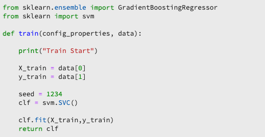

# JupiterLab 노트북을 사용하여 모델 만들기

이 자습서에서는 JupiterLab 노트북 레서피 빌더 템플릿을 사용하여 모델을 만드는 데 필요한 단계를 안내합니다.

## 도입된 개념:

- **레서피:** 레서피는 모델 사양에 대한 Adobe의 용어이며, 특정 기계 학습, AI 알고리즘 또는 알고리즘 앙상블, 처리 논리 및 숙련된 모델을 만들고 실행하는 데 필요한 구성을 나타내는 최상위 컨테이너입니다.
- **모델:** 모델은 비즈니스 사용 사례를 해결하기 위해 이전 데이터 및 구성을 사용하여 교육되는 기계 학습 레서피의 예입니다.
- **교육:** 교육은 레이블이 지정된 데이터를 통해 학습 패턴과 인사이트를 얻는 프로세스입니다.
- **점수:** 점수는 숙련된 모델을 사용하여 데이터에서 통찰력을 생성하는 프로세스입니다.

## 필요한 자산을 다운로드합니다 {#assets}

이 자습서를 계속 진행하려면 필요한 스키마 및 데이터 세트를 만들어야 합니다. 다음 기간 동안 자습서를 확인하십시오 [luma 성향 모델 스키마 및 데이터 세트 만들기](../models-recipes/create-luma-data.md) 필요한 자산을 다운로드하고 사전 요구 사항을 설정하려면 다음을 수행하십시오.

## 시작하기 [!DNL JupyterLab] 노트북 환경

레서피를 처음부터 만드는 것은 내면에서 수행할 수 있습니다 [!DNL Data Science Workspace]. 시작하려면 다음으로 이동합니다. [Adobe Experience Platform](https://platform.adobe.com) 을(를) 선택하고 을(를) 선택합니다. **[!UICONTROL 노트북]** 왼쪽의 탭합니다. 새 전자 필기장을 생성하려면 [!DNL JupyterLab Launcher].

다음 [!UICONTROL 레서피 빌더] 노트북에서는 노트북 내에서 트레이닝 및 점수 책정 실행을 실행할 수 있습니다. 이를 통해 변경 사항을 적용할 수 있습니다 `train()` 및 `score()` 교육 실험 실행 및 점수 데이터 간 방법. 교육 및 점수 결과가 만족스러우면 레서피를 생성하고 레서피-모델 기능을 사용하여 모델로 게시할 수 있습니다.

>[!NOTE]
>
>다음 [!UICONTROL 레서피 빌더] 전자 필기장은 모든 파일 형식을 사용하여 작업할 수 있지만 현재 레서피 만들기 기능은 [!DNL Python].


을(를) 선택하는 경우 [!UICONTROL 레서피 빌더] 시작 장치의 전자 필기장이 새 탭에 열립니다.

맨 위에 있는 새 전자 필기장 탭에서 도구 모음에는 세 가지 추가 작업이 포함됩니다. **[!UICONTROL 트레인]**, **[!UICONTROL 점수]**, 및 **[!UICONTROL 레서피 만들기]**. 이러한 아이콘은 [!UICONTROL 레서피 빌더] 전자 필기장. 이러한 작업에 대한 자세한 정보가 제공됩니다 [교육 및 점수 섹션](#training-and-scoring) 수첩에 레서피 작성 후


## 시작하기 [!UICONTROL 레서피 빌더] 노트북

제공된 자산 폴더에서 Luma 성향 모델이 표시됩니다 `propensity_model.ipynb`. JupiterLab에서 전자 필기장 업로드 옵션을 사용하여 제공된 모델을 업로드하고 전자 필기장을 엽니다.


이 자습서의 나머지 부분에서는 성향 모델 수첩에 미리 정의된 다음 파일을 다룹니다.

- [요구 사항 파일](#requirements-file)
- [구성 파일](#configuration-files)
- [교육 데이터 로더](#training-data-loader)
- [점수 데이터 로더](#scoring-data-loader)
- [파이프라인 파일](#pipeline-file)
- [평가기 파일](#evaluator-file)
- [데이터 절약 파일](#data-saver-file)

다음 비디오 자습서에서는 Luma 성향 모델 노트북을 설명합니다.

>[!VIDEO](https://video.tv.adobe.com/v/333570)

### 요구 사항 파일 {#requirements-file}

요구 사항 파일은 모델에 사용할 추가 라이브러리를 선언하는 데 사용됩니다. 종속성이 있는 경우 버전 번호를 지정할 수 있습니다. 추가 라이브러리를 찾으려면 를 방문하십시오. [anchonda.org](https://anaconda.org). 요구 사항 파일의 형식을 지정하는 방법에 대해 알아보려면 [콘다](https://docs.conda.io/projects/conda/en/latest/user-guide/tasks/manage-environments.html#creating-an-environment-file-manually). 이미 사용 중인 기본 라이브러리 목록은 다음과 같습니다.

```JSON
python=3.6.7
scikit-learn
pandas
numpy
data_access_sdk_python
```

>[!NOTE]
>
>추가한 라이브러리 또는 특정 버전은 위의 라이브러리와 호환되지 않을 수 있습니다. 또한 환경 파일을 수동으로 만들도록 선택하는 경우, `name` 필드를 재정의할 수 없습니다.

Luma 성향 모델 수첩의 경우 요구 사항을 업데이트할 필요가 없습니다.

### 구성 파일 {#configuration-files}

구성 파일, `training.conf` 및 `scoring.conf`은 훈련 및 점수에 사용할 데이터 세트를 지정하고 하이퍼매개 변수를 추가하는 데 사용됩니다. 교육과 채점에는 별도의 구성이 있습니다.

모델이 교육을 실행하려면 `trainingDataSetId`, `ACP_DSW_TRAINING_XDM_SCHEMA`, 및 `tenantId`. 또한 점수의 경우 다음을 제공해야 합니다 `scoringDataSetId`, `tenantId`, 및 `scoringResultsDataSetId `.

데이터 세트 및 스키마 ID를 찾으려면 데이터 탭으로 이동합니다  왼쪽 탐색 막대의 전자 필기장 내(폴더 아이콘 아래). 세 개의 다른 데이터 세트 ID를 제공해야 합니다. 다음 `scoringResultsDataSetId` 는 모델 점수 결과를 저장하는 데 사용되며 빈 데이터 세트여야 합니다. 이러한 데이터 세트는 이전에 [필수 자산](#assets) 단계.


같은 정보를 찾을 수 있습니다 [Adobe Experience Platform](https://platform.adobe.com/) 아래에 **[스키마](https://platform.adobe.com/schema)** 및 **[데이터 세트](https://platform.adobe.com/dataset/overview)** 탭.

완료되면 교육 및 점수 구성은 다음 스크린샷과 유사해야 합니다.


기본적으로 교육 및 점수 데이터를 교육할 때 다음 구성 매개 변수가 설정됩니다.

- `ML_FRAMEWORK_IMS_USER_CLIENT_ID`
- `ML_FRAMEWORK_IMS_TOKEN`
- `ML_FRAMEWORK_IMS_ML_TOKEN`
- `ML_FRAMEWORK_IMS_TENANT_ID`

## 교육 데이터 로더 이해 {#training-data-loader}

교육 데이터 로더의 목적은 시스템 학습 모델을 만드는 데 사용되는 데이터를 인스턴스화하는 것입니다. 일반적으로 교육 데이터 로더에서 수행하는 작업은 두 가지가 있습니다.

- 데이터 로드 위치 [!DNL Platform]
- 데이터 준비 및 기능 엔지니어링

다음 두 섹션에서는 데이터 로드 및 데이터 준비를 설명합니다.

### 데이터 로드 {#loading-data}

이 단계에서는 [판다들](https://pandas.pydata.org/pandas-docs/stable/generated/pandas.DataFrame.html). 데이터는 의 파일에서 로드될 수 있습니다 [!DNL Adobe Experience Platform] 다음 중 하나를 사용하여 [!DNL Platform] SDK (`platform_sdk`) 또는 판다를 사용하여 외부 소스에서 `read_csv()` 또는 `read_json()` 함수 위에 있어야 합니다.

- [[!DNL Platform SDK]](#platform-sdk)
- [외부 소스](#external-sources)

>[!NOTE]
>
>레서피 빌더 수첩에서 데이터는 `platform_sdk` 데이터 로더.

### [!DNL Platform] SDK {#platform-sdk}

를 사용하는 방법에 대한 심도 있는 자습서입니다. `platform_sdk` 데이터 로더입니다. [Platform SDK 안내서](../authoring/platform-sdk.md). 이 자습서에서는 빌드 인증, 기본 데이터 읽기 및 기본 데이터 작성에 대한 정보를 제공합니다.

### 외부 소스 {#external-sources}

이 섹션에서는 JSON 또는 CSV 파일을 판다 객체로 가져오는 방법을 보여줍니다. 판다 라이브러리의 공식 설명서는 여기에서 찾을 수 있다.
- [read_csv](https://pandas.pydata.org/pandas-docs/stable/generated/pandas.read_csv.html)
- [read_json](https://pandas.pydata.org/pandas-docs/stable/generated/pandas.read_json.html)

먼저, 다음은 CSV 파일을 가져오는 예입니다. 다음 `data` 인수는 CSV 파일의 경로입니다. 이 변수는 `configProperties` 에서 [이전 섹션](#configuration-files).

```PYTHON
df = pd.read_csv(data)
```

JSON 파일에서도 가져올 수 있습니다. 다음 `data` 인수는 CSV 파일의 경로입니다. 이 변수는 `configProperties` 에서 [이전 섹션](#configuration-files).

```PYTHON
df = pd.read_json(data)
```

이제 데이터가 데이터 프레임 개체에 있으며, [다음 섹션](#data-preparation-and-feature-engineering).

## 교육 데이터 로더 파일

이 예제에서 데이터는 Platform SDK를 사용하여 로드됩니다. 다음 줄을 포함하여 페이지 맨 위에 라이브러리를 가져올 수 있습니다.

`from platform_sdk.dataset_reader import DatasetReader`

그런 다음 `load()` 교육 데이터 세트를 가져오는 방법 `trainingDataSetId` 구성에 설정된 대로(`recipe.conf`) 파일로 내보낼 때 시간별 세부기간이 작동하지 않는 문제를 해결했습니다.

```PYTHON
def load(config_properties):
    print("Training Data Load Start")

    #########################################
    # Load Data
    #########################################    
    client_context = get_client_context(config_properties)
    dataset_reader = DatasetReader(client_context, dataset_id=config_properties['trainingDataSetId'])
```

>[!NOTE]
>
>다음에서 언급했듯이 [구성 파일 섹션](#configuration-files)를 사용하여 Experience Platform에서 데이터에 액세스할 때 다음 구성 매개 변수가 설정됩니다 `client_context = get_client_context(config_properties)`:
> - `ML_FRAMEWORK_IMS_USER_CLIENT_ID`
> - `ML_FRAMEWORK_IMS_TOKEN`
> - `ML_FRAMEWORK_IMS_ML_TOKEN`
> - `ML_FRAMEWORK_IMS_TENANT_ID`


이제 데이터가 있으므로 데이터 준비 및 기능 엔지니어링으로 시작할 수 있습니다.

### 데이터 준비 및 기능 엔지니어링 {#data-preparation-and-feature-engineering}

데이터가 로드되면 데이터를 정리하여 데이터 준비를 수행해야 합니다. 이 예에서 모델의 목표는 고객이 제품을 주문할지 여부를 예측하는 것입니다. 모델은 특정 제품을 보지 않으므로 필요하지 않습니다 `productListItems` 따라서 열이 삭제됩니다. 그런 다음 단일 열에 단일 값 또는 두 값만 포함하는 추가 열이 삭제됩니다. 모델을 교육할 때는 목표 예측에 도움이 되는 유용한 데이터만 유지하는 것이 중요합니다.


불필요한 데이터를 삭제한 후 기능 엔지니어링 작업을 시작할 수 있습니다. 이 예제에 사용된 데모 데이터에는 세션 정보가 포함되어 있지 않습니다. 일반적으로 특정 고객에 대한 현재 및 과거 세션에 대한 데이터를 보유해야 합니다. 세션 정보가 부족하기 때문에 이 예제는 대신 여정 분리를 통해 현재 및 과거 세션을 모방합니다.


분산이 완료되면 데이터에 레이블이 지정되고 여정이 만들어집니다.


그런 다음 피쳐가 생성되고 과거와 현재로 분할됩니다. 그런 다음 불필요한 열이 삭제되어 Luma 고객을 위한 이전 및 현재 여정이 모두 표시됩니다. 이러한 여정에는 고객이 항목을 구매했는지 여부 및 구매로 유도한 여정과 같은 정보가 포함되어 있습니다.


## 점수 데이터 로더 {#scoring-data-loader}

점수를 위해 데이터를 로드하는 절차는 교육 데이터 로드와 유사합니다. 코드를 자세히 보면 를 제외하고 모든 것이 동일함을 알 수 있습니다 `scoringDataSetId` 에서 `dataset_reader`. 이것은 동일한 Luma 데이터 소스가 교육 및 점수 모두에 사용되기 때문입니다.

교육 및 점수에 서로 다른 데이터 파일을 사용하려는 경우 교육 및 점수 데이터 로더는 별도로 구분됩니다. 이를 통해 필요한 경우 교육 데이터를 점수 데이터에 매핑하는 등의 추가 사전 처리를 수행할 수 있습니다.

## 파이프라인 파일 {#pipeline-file}

다음 `pipeline.py` 파일에는 교육 및 점수 책정 로직이 포함되어 있습니다.

교육 목적은 교육 데이터 세트에 있는 기능과 레이블을 사용하여 모델을 만드는 것입니다. 교육 모델을 선택한 후 x 및 y 교육 데이터 세트를 모델에 적합해야 하며 이 기능은 숙련된 모델을 반환합니다.

>[!NOTE]
> 
>기능은 기계 학습 모델에서 레이블을 예측할 때 사용하는 입력 변수를 의미합니다.



다음 `score()` 함수에는 점수 알고리즘이 포함되어야 하며 모델이 얼마나 성공적으로 수행되는지를 나타내는 측정이 반환됩니다. 다음 `score()` 함수는 점수 데이터 세트 레이블과 훈련된 모델을 사용하여 일련의 예측된 기능을 생성합니다. 그런 다음 이러한 예측된 값을 점수 데이터 세트에 있는 실제 기능과 비교합니다. 이 예에서 `score()` 함수는 교육된 모델을 사용하여 점수 데이터 세트의 레이블을 사용하여 기능을 예측합니다. 예측된 기능이 반환됩니다.


## 평가기 파일 {#evaluator-file}

다음 `evaluator.py` 파일에는 교육된 레서피를 평가하는 방법과 교육 데이터를 분할하는 방법에 대한 논리가 포함되어 있습니다.

### 데이터 세트 분할 {#split-the-dataset}

교육을 위한 데이터 준비 단계에서는 데이터 세트를 분할하여 교육 및 테스트를 위해 사용해야 합니다. 이 `val` 데이터는 훈련 후에 모델을 평가하는 데 암묵적으로 사용됩니다. 이 프로세스는 점수와 별개입니다.

이 섹션에서는 `split()` 데이터 세트를 전자 필기장에 로드한 다음 데이터 집합에 있는 관련 열을 제거하여 데이터를 정리합니다. 여기에서 기존 원시 피쳐에서 추가 관련 기능을 생성하는 프로세스인 기능 엔지니어링을 수행할 수 있습니다.


### 숙련된 모델 평가 {#evaluate-the-trained-model}

다음 `evaluate()` 함수는 모델이 훈련된 후에 수행되고 모델이 성공적으로 수행되는 방식을 나타내는 지표를 반환합니다. 다음 `evaluate()` 함수는 테스트 데이터 세트 레이블과 숙련된 모델을 사용하여 기능 세트를 예측합니다. 그런 다음 이러한 예측된 값을 테스트 데이터 세트의 실제 기능과 비교합니다. 이 예에서는 사용된 지표가 다음과 같습니다 `precision`, `recall`, `f1`, 및 `accuracy`. 함수는 `metric` 평가 지표 배열을 포함하는 객체입니다. 이러한 지표는 숙련된 모델이 얼마나 잘 작동하는지 평가하는 데 사용됩니다.


추가 중 `print(metric)` 지표 결과를 볼 수 있습니다.


## 데이터 절약 파일 {#data-saver-file}

다음 `datasaver.py` 파일에 가 있습니다. `save()` 함수 및 을 사용하여 점수를 테스트하는 동안 예측을 저장할 수 있습니다. 다음 `save()` 함수는 예측 및 를 사용합니다 [!DNL Experience Platform Catalog] API는 데이터를 `scoringResultsDataSetId` 에 `scoring.conf` 파일. 다음을 수행할 수 있습니다


## 교육 및 점수 책정 {#training-and-scoring}

전자 필기장을 변경하고 레서피 교육을 수행하려면 막대 상단에 있는 관련 버튼을 선택하여 셀에서 교육 실행을 생성할 수 있습니다. 버튼을 선택하면 교육 스크립트에서 출력된 명령 및 명령 로그가 전자 필기장 아래 `evaluator.py` 셀)만 로드하는 것입니다. Conda는 먼저 모든 종속성을 설치한 후 교육을 시작합니다.

점수를 실행하기 전에 적어도 한 번 훈련을 실행해야 합니다. 선택 **[!UICONTROL 점수 실행]** 버튼은 교육 중에 생성된 훈련 모델에 대해 점수를 매깁니다. 점수 스크립트는 아래에 나타납니다 `datasaver.py`.

디버깅을 위해 숨겨진 출력을 보려면 `debug` 출력 셀의 끝까지 다시 실행하고


## 레서피 만들기 {#create-recipe}

배합식 편집을 완료하고 교육/점수 결과에 만족하면 공책에서 배합식을 선택하여 생성할 수 있습니다 **[!UICONTROL 레서피 만들기]** 오른쪽 위에 있습니다.


선택 후 **[!UICONTROL 레서피 만들기]**&#x200B;를 입력하면 배합식 이름을 입력하라는 메시지가 표시됩니다. 이 이름은에 생성된 실제 레서피를 나타냅니다 [!DNL Platform].


선택하면 **[!UICONTROL 확인]**: 레서피 만들기 프로세스가 시작됩니다. 시간이 좀 걸릴 수 있으며 레서피 만들기 단추 대신 진행률 표시줄이 표시됩니다. 완료되면 을(를) 선택할 수 있습니다 **[!UICONTROL 레서피 보기]** 버튼을 눌러 **[!UICONTROL 레서피]** 아래의 탭 **[!UICONTROL ML 모델]**


>[!CAUTION]
>
> - 파일 셀을 삭제하지 마십시오
> - 편집 안 함 `%%writefile` 파일 셀 상단에 있는 줄
> - 서로 다른 전자 필기장에서 동시에 레시피를 만들지 마십시오


## 다음 단계 {#next-steps}

이 자습서를 완료하여에서 기계 학습 모델을 만드는 방법을 알아보았습니다 [!UICONTROL 레서피 빌더] 전자 필기장. 또한 레서피 워크플로우에 노트북을 실행하는 방법도 배웠습니다.

내에서 리소스를 사용하여 작업하는 방법을 계속 배우려면 [!DNL Data Science Workspace]를 방문하시기 바랍니다 [!DNL Data Science Workspace] 레서피 및 모델 드롭다운.