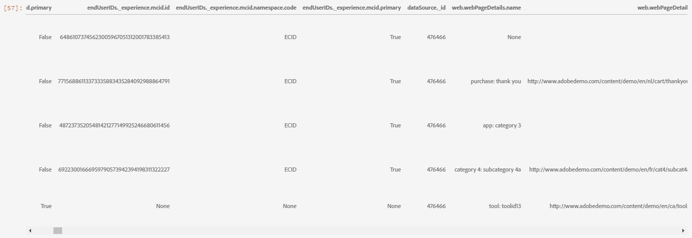
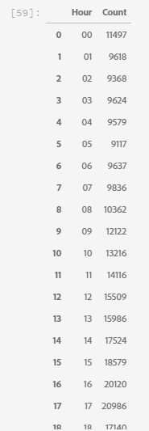
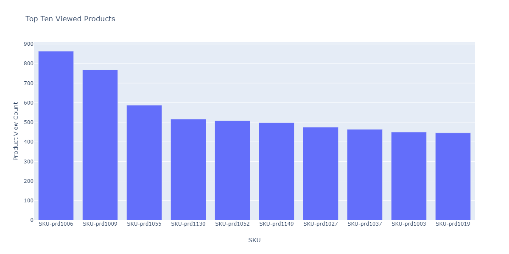
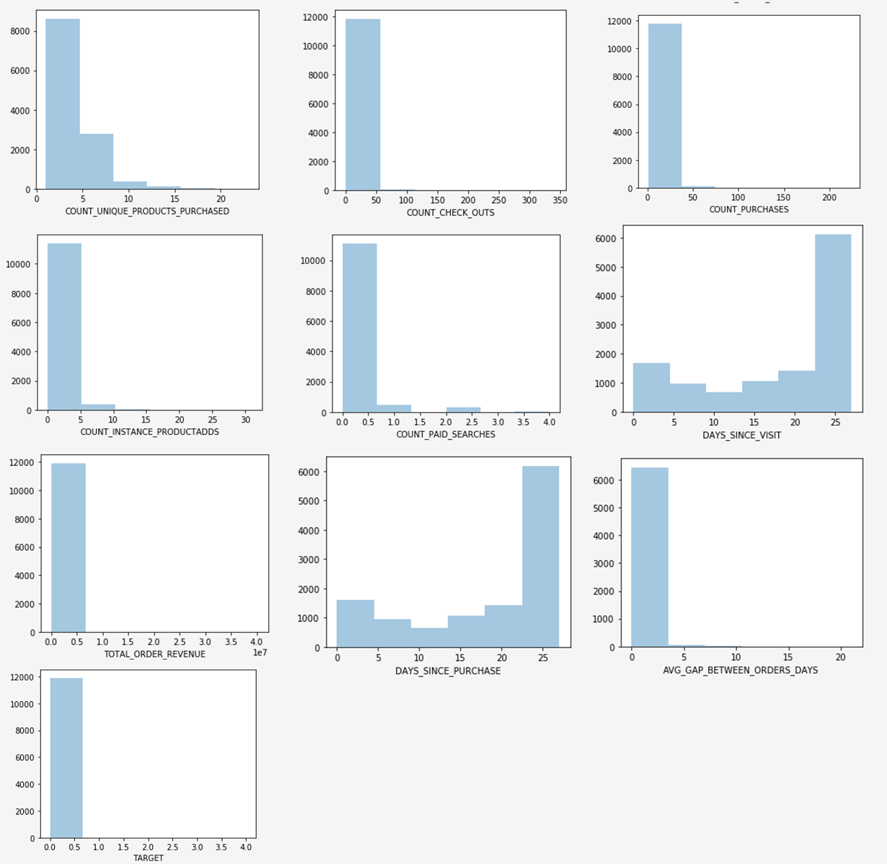
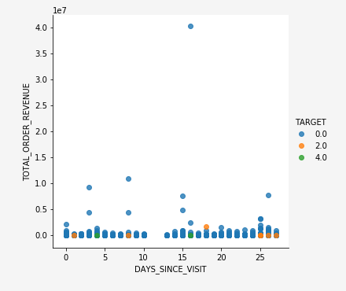

# EDA(Exploratory Data Analysis) 노트북을 사용하여 예측 모델에 대한 웹 기반 데이터 탐색

EDA(Exploratory Data Analysis) 노트북은 데이터의 패턴을 찾고, 데이터의 온전성을 확인하고, 예측 모델에 대한 관련 데이터를 요약하는 데 도움이 되도록 설계되었습니다.

EDA 노트북 예제는 웹 기반 데이터를 염두에 두고 최적화되었으며 두 부분으로 구성됩니다. 1부는 Query Service를 사용하여 트렌드 및 데이터 스냅샷을 보는 것으로 시작합니다. 다음으로, 탐색적 데이터 분석을 염두에 두고, 데이터는 프로필 및 방문자 수준에서 집계됩니다.

2부는 Python 라이브러리를 사용하여 집계된 데이터에 대해 설명 분석을 수행하는 것으로 시작한다. 이 전자 필기장은 히스토그램, 산포도, 상자 그림 및 상관 관계 매트릭스와 같은 시각화를 보여 주어 목표 예측에 가장 도움이 될 수 있는 기능을 결정하는 데 사용되는 실행 가능한 통찰력을 도출합니다.

## 시작하기

이 안내서를 읽기 전에 [[!DNL JupyterLab] 사용 안내서](./overview.md)를 검토하여 [!DNL JupyterLab]에 대한 자세한 소개와 Data Science Workspace에서의 역할에 대해 알아보십시오. 또한 사용자의 데이터를 사용하는 경우 [notebooks](./access-notebook-data.md)의 데이터 액세스에 대한 설명서를 검토하십시오.  [!DNL Jupyterlab]  이 안내서에는 노트북 데이터 제한에 대한 중요한 정보가 포함되어 있습니다.

이 전자 필기장은 Analytics Analysis Workspace에 있는 Adobe Analytics Experience Events 데이터 형식의 중간값 데이터 세트를 사용합니다. EDA 전자 필기장을 사용하려면 다음 값 `target_table` 및 `target_table_id`을(를) 사용하여 데이터 테이블을 정의해야 합니다. 모든 중간값 데이터 세트를 사용할 수 있습니다.

이러한 값을 찾으려면 JupyterLab 데이터 액세스 가이드의 [python에 있는 데이터 집합에 쓰기](./access-notebook-data.md#write-python) 섹션에 설명된 단계를 따릅니다. 데이터 집합 이름(`target_table`)이 데이터 집합 디렉터리에 있습니다. 데이터 집합을 마우스 오른쪽 단추로 클릭하여 전자 필기장의 데이터를 탐색하거나 쓰면 실행 코드 항목에 데이터 집합 ID(`target_table_id`)가 제공됩니다.

## 데이터 검색

이 섹션에는 &quot;사용자 활동별 상위 10개 도시&quot; 또는 &quot;상위 10개 제품&quot;과 같은 트렌드를 보는 데 사용되는 구성 단계 및 예제 쿼리가 포함되어 있습니다.

### 라이브러리 구성

JupyterLab은 여러 라이브러리를 지원합니다. 다음 코드를 붙여넣은 후 코드 셀에서 실행하여 이 예제에 사용된 모든 필수 패키지를 수집하고 설치할 수 있습니다. 이 예제 이외의 추가 또는 대체 패키지를 사용하여 자신의 데이터 분석을 수행할 수 있습니다. 지원되는 패키지 목록을 보려면 새 셀에 `!pip list --format=columns`을(를) 복사하여 붙여 넣으십시오.

```python
!pip install colorama
import chart_studio.plotly as py
import plotly.graph_objs as go
from plotly.offline import iplot
from scipy import stats
import numpy as np
import warnings
warnings.filterwarnings('ignore')
from scipy.stats import pearsonr
import matplotlib.pyplot as plt
from scipy.stats import pearsonr
import pandas as pd
import math
import re
import seaborn as sns
from datetime import datetime
import colorama
from colorama import Fore, Style
pd.set_option('display.max_columns', None)
pd.set_option('display.max_rows', None)
pd.set_option('display.width', 1000)
pd.set_option('display.expand_frame_repr', False)
pd.set_option('display.max_colwidth', -1)
```

### Adobe Experience Platform [!DNL Query Service]에 연결

플랫폼의 [!DNL JupyterLab]을(를) 사용하면 [!DNL Python] 전자 필기장의 SQL을 사용하여 [쿼리 서비스](https://www.adobe.com/go/query-service-home-en)를 통해 데이터에 액세스할 수 있습니다. [!DNL Query Service]을(를) 통해 데이터에 액세스하면 실행 시간이 길어 대용량 데이터 세트를 처리하는 데 유용할 수 있습니다. [!DNL Query Service]을(를) 사용하여 데이터를 쿼리하는 데 10분의 처리 시간 제한이 있습니다.

[!DNL JupyterLab]에서 [!DNL Query Service]을(를) 사용하기 전에 [[!DNL Query Service] SQL 구문](https://www.adobe.com/go/query-service-sql-syntax-en)을(를) 이해하고 있는지 확인하십시오.

JupyterLab에서 쿼리 서비스를 활용하려면 먼저 작업 중인 Python 노트북과 쿼리 서비스 간에 연결을 만들어야 합니다. 이 작업은 다음 셀을 실행하여 수행할 수 있습니다.

```python
qs_connect()
```

### 탐색할 중간값 데이터 세트 정의

데이터 쿼리 및 탐색을 시작하려면 midvalues 데이터 세트 테이블을 제공해야 합니다. `table_name` 및 `table_id` 값을 복사하여 고유한 데이터 테이블 값으로 바꾸십시오.

```python
target_table = "table_name"
target_table_id = "table_id"
```

완료되면 이 셀은 다음 예와 유사해야 합니다.

```python
target_table = "cross_industry_demo_midvalues"
target_table_id = "5f7c40ef488de5194ba0157a"
```

### 사용 가능한 날짜에 대한 데이터 세트 탐색

아래 제공된 셀을 사용하면 표에 나와 있는 날짜 범위를 볼 수 있습니다. 일 수, 첫 번째 날짜 및 마지막 날짜를 탐색하는 목적은 추가 분석을 위해 날짜 범위를 선택하는 데 도움이 됩니다.

```python
%%read_sql -c QS_CONNECTION
SELECT distinct Year(timestamp) as Year, Month(timestamp) as Month, count(distinct DAY(timestamp)) as Count_days, min(DAY(timestamp)) as First_date, max(DAY(timestamp)) as Last_date, count(timestamp) as Count_hits
from {target_table}
group by Month(timestamp), Year(timestamp)
order by Year, Month;
```

셀을 실행하면 다음과 같은 출력이 생성됩니다.


### 데이터 세트 검색 날짜 구성

데이터 세트를 검색할 수 있는 날짜를 결정한 후 아래 매개 변수를 업데이트해야 합니다. 이 셀에 구성된 날짜는 쿼리 형식의 데이터 검색에만 사용됩니다. 이 날짜는 이 안내서의 뒷부분에 나오는 탐색적 데이터 분석에 적합한 범위로 다시 업데이트됩니다.

```python
target_year = "2020" ## The target year
target_month = "02" ## The target month
target_day = "(01,02,03)" ## The target days
```

### 데이터 세트 검색

모든 매개 변수를 구성하고 [!DNL Query Service]을(를) 시작했으며 날짜 범위가 있으면 데이터 행을 읽을 준비가 된 것입니다. 읽는 행의 수를 제한해야 합니다.

```python
from platform_sdk.dataset_reader import DatasetReader
from datetime import date
dataset_reader = DatasetReader(PLATFORM_SDK_CLIENT_CONTEXT, dataset_id=target_table_id)
# If you do not see any data or would like to expand the default date range, change the following query
Table = dataset_reader.limit(5).read()
```

데이터 집합에서 사용할 수 있는 열 수를 보려면 다음 셀을 사용하십시오.

```python
print("\nNumber of columns:",len(Table.columns))
```

데이터 세트의 행을 보려면 다음 셀을 사용하십시오. 이 예제에서 행의 수는 5개로 제한됩니다.

```python
Table.head(5)
```



데이터 세트에 포함된 데이터에 대해 알고 있으면 데이터 세트를 더 세부적으로 분석하는 것이 유용할 수 있습니다. 이 예제에서는 각 열의 열 이름과 데이터 형식이 나열되며, 출력은 데이터 형식이 올바른지 확인하는 데 사용됩니다.

```python
ColumnNames_Types = pd.DataFrame(Table.dtypes)
ColumnNames_Types = ColumnNames_Types.reset_index()
ColumnNames_Types.columns = ["Column_Name", "Data_Type"]
ColumnNames_Types
```


### 데이터 세트 트렌드 탐색

다음 섹션에는 데이터의 트렌드와 패턴을 탐색하는 데 사용되는 네 가지 예제 쿼리가 포함되어 있습니다. 아래에 제공된 예들은 완전하지는 않지만, 보다 일반적으로 살펴지는 특징들 중 일부를 포함한다.

**지정된 날의 시간별 활동 개수**

이 쿼리는 하루 동안의 작업 및 클릭 수를 분석합니다. 출력은 그날의 각 시간에 대한 활동 카운트에 대한 지표를 포함하는 표 형태로 표시됩니다.

```sql
%%read_sql query_2_df -c QS_CONNECTION

SELECT Substring(timestamp, 12, 2)                        AS Hour, 
       Count(enduserids._experience.aaid.id) AS Count 
FROM   {target_table}
WHERE  Year(timestamp) = {target_year} 
       AND Month(timestamp) = {target_month}  
       AND Day(timestamp) in {target_day}
GROUP  BY Hour
ORDER  BY Hour;
```



쿼리 작동 확인 후 데이터가 시각적 명료성을 위해 일변량 그래프 히스토그램으로 표시될 수 있습니다.

```python
trace = go.Bar(
    x = query_2_df['Hour'],
    y = query_2_df['Count'],
    name = "Activity Count"
)

layout = go.Layout(
    title = 'Activity Count by Hour of Day',
    width = 1200,
    height = 600,
    xaxis = dict(title = 'Hour of Day'),
    yaxis = dict(title = 'Count')
)

fig = go.Figure(data = [trace], layout = layout)
iplot(fig)
```

쿼리 1에 대한 

**특정 날짜에 가장 많이 본 페이지 10개**

이 쿼리는 주어진 날 동안 가장 많이 본 페이지를 분석합니다. 출력은 페이지 이름 및 페이지 보기 수에 대한 지표를 포함하는 표 형태로 표시됩니다.

```sql
%%read_sql query_4_df -c QS_CONNECTION

SELECT web.webpagedetails.name                 AS Page_Name, 
       Sum(web.webpagedetails.pageviews.value) AS Page_Views 
FROM   {target_table}
WHERE  Year(timestamp) = {target_year}
       AND Month(timestamp) = {target_month}
       AND Day(timestamp) in {target_day}
GROUP  BY web.webpagedetails.name 
ORDER  BY page_views DESC 
LIMIT  10;
```

쿼리 작동 확인 후 데이터가 시각적 명료성을 위해 일변량 그래프 히스토그램으로 표시될 수 있습니다.

```python
trace = go.Bar(
    x = query_4_df['Page_Name'],
    y = query_4_df['Page_Views'],
    name = "Page Views"
)

layout = go.Layout(
    title = 'Top Ten Viewed Pages For a Given Day',
    width = 1000,
    height = 600,
    xaxis = dict(title = 'Page_Name'),
    yaxis = dict(title = 'Page_Views')
)

fig = go.Figure(data = [trace], layout = layout)
iplot(fig)
```


**사용자 활동별로 그룹화된 상위 10개 도시**

이 쿼리는 데이터가 시작되는 도시를 분석합니다.

```sql
%%read_sql query_6_df -c QS_CONNECTION

SELECT concat(placeContext.geo.stateProvince, ' - ', placeContext.geo.city) AS state_city, 
       Count(timestamp)                                                     AS Count
FROM   {target_table}
WHERE  Year(timestamp) = {target_year}
       AND Month(timestamp) = {target_month}
       AND Day(timestamp) in {target_day}
GROUP  BY state_city
ORDER  BY Count DESC
LIMIT  10;
```

쿼리 작동 확인 후 데이터가 시각적 명료성을 위해 일변량 그래프 히스토그램으로 표시될 수 있습니다.

```python
trace = go.Bar(
    x = query_6_df['state_city'],
    y = query_6_df['Count'],
    name = "Activity by City"
)

layout = go.Layout(
    title = 'Top Ten Cities by User Activity',
    width = 1200,
    height = 600,
    xaxis = dict(title = 'City'),
    yaxis = dict(title = 'Count')
)

fig = go.Figure(data = [trace], layout = layout)
iplot(fig)
```


**가장 많이 본 제품 10개**

이 쿼리는 가장 많이 본 10개 제품 목록을 제공합니다. 아래 예제에서는 `Explode()` 함수를 사용하여 `productlistitems` 개체의 각 제품을 고유한 행으로 반환합니다. 이를 통해 중첩된 쿼리를 수행하여 다양한 SKU에 대한 제품 보기를 집계할 수 있습니다.

```sql
%%read_sql query_7_df -c QS_CONNECTION

SELECT Product_List_Items.sku AS Product_SKU,
       Sum(Product_Views) AS Total_Product_Views
FROM  (SELECT Explode(productlistitems) AS Product_List_Items, 
              commerce.productviews.value   AS Product_Views 
       FROM   {target_table}
       WHERE  Year(timestamp) = {target_year}
              AND Month(timestamp) = {target_month}
              AND Day(timestamp) in {target_day}
              AND commerce.productviews.value IS NOT NULL) 
GROUP BY Product_SKU 
ORDER BY Total_Product_Views DESC
LIMIT  10;
```

쿼리 작동 확인 후 데이터가 시각적 명료성을 위해 일변량 그래프 히스토그램으로 표시될 수 있습니다.

```python
trace = go.Bar(
    x = "SKU-" + query_7_df['Product_SKU'],
    y = query_7_df['Total_Product_Views'],
    name = "Product View"
)

layout = go.Layout(
    title = 'Top Ten Viewed Products',
    width = 1200,
    height = 600,
    xaxis = dict(title = 'SKU'),
    yaxis = dict(title = 'Product View Count')
)

fig = go.Figure(data = [trace], layout = layout)
iplot(fig)
```



데이터의 트렌드와 패턴을 탐색한 후 목표를 예측하기 위해 어떤 기능을 구축할지 잘 알고 있어야 합니다. 테이블을 자세히 살펴봄으로써 값의 각 데이터 속성, 명백한 오판 및 큰 이상값을 빠르게 강조 표시하고 속성 간에 탐색할 후보 관계를 제안할 수 있습니다.

## 탐색적 데이터 분석

탐색적 데이터 분석은 데이터에 대한 이해를 세분화하고 모델링의 기반으로 사용할 수 있는 매력적인 질문에 대한 직관을 구축하는 데 사용됩니다.

데이터 검색 단계를 완료한 후 이벤트, 도시 또는 사용자 ID 수준에서 일부 집계로 이벤트 수준 데이터를 탐색하여 하루 동안의 트렌드를 확인합니다. 이 자료가 중요하긴 하지만, 전체적인 상황을 파악하지는 못한다. 여전히 웹 사이트에서 구매를 유도하는 이유를 이해하지 못합니다.

이를 이해하려면 프로필/방문자 수준에서 데이터를 집계하고, 구매 목표를 정의하고, 상관 관계, 상자 그림 및 산포도와 같은 통계 개념을 적용해야 합니다. 이러한 방법은 사용자가 정의하는 예측 창에서 구매자와 비구매자의 활동 패턴을 비교하는 데 사용됩니다.

이 섹션에서는 다음 기능이 생성되고 탐색됩니다.

- `COUNT_UNIQUE_PRODUCTS_PURCHASED`: 구매한 고유 제품의 수입니다.
- `COUNT_CHECK_OUTS`: 체크 아웃 수입니다.
- `COUNT_PURCHASES`: 구매 횟수입니다.
- `COUNT_INSTANCE_PRODUCTADDS`: 제품 추가 인스턴스 수입니다.
- `NUMBER_VISITS`: 방문 횟수입니다.
- `COUNT_PAID_SEARCHES`: 유료 검색 수입니다.
- `DAYS_SINCE_VISIT`: 마지막 방문 이후의 일 수입니다.
- `TOTAL_ORDER_REVENUE`: 총 주문 매출액.
- `DAYS_SINCE_PURCHASE`: 이전 구매 이후 일 수입니다.
- `AVG_GAP_BETWEEN_ORDERS_DAYS`: 일 단위 평균 구매 간격.
- `STATE_CITY`: 시/도 및 구/군/시를 포함합니다.

데이터 집계를 계속하기 전에 탐색적 데이터 분석에 사용되는 예측 변수에 대한 매개 변수를 정의해야 합니다. 즉, 데이터 과학 모델에서 원하는 것은 무엇입니까? 일반적인 매개변수에는 목표, 예측 기간 및 분석 기간이 포함됩니다.

EDA 전자 필기장을 사용하는 경우 계속하기 전에 아래 값을 바꾸어야 합니다.

```python
goal = "commerce.`order`.purchaseID" #### prediction variable
goal_column_type = "numerical" #### choose either "categorical" or "numerical"
prediction_window_day_start = "2020-01-01" #### YYYY-MM-DD
prediction_window_day_end = "2020-01-31" #### YYYY-MM-DD
analysis_period_day_start = "2020-02-01" #### YYYY-MM-DD
analysis_period_day_end = "2020-02-28" #### YYYY-MM-DD

### If the goal is a categorical goal then select threshold for the defining category and creating bins. 0 is no order placed, and 1 is at least one order placed:
threshold = 1
```

### 기능 및 목표 생성을 위한 데이터 집계

탐색적 분석을 시작하려면 프로필 수준에서 목표를 만든 다음 데이터 세트를 집계해야 합니다. 이 예에서는 두 개의 쿼리가 제공됩니다. 첫 번째 쿼리에는 목표 생성이 포함됩니다. 두 번째 쿼리는 첫 번째 쿼리에 포함되지 않은 변수를 포함하도록 업데이트해야 합니다. 쿼리에 대해 `limit`을(를) 업데이트할 수 있습니다. 다음 쿼리를 수행하면 이제 집계된 데이터를 탐색할 수 있습니다.

```sql
%%read_sql target_df -d -c QS_CONNECTION

SELECT DISTINCT endUserIDs._experience.aaid.id                  AS ID,
       Count({goal})                                            AS TARGET
FROM   {target_table}
WHERE DATE(TIMESTAMP) BETWEEN '{prediction_window_day_start}' AND '{prediction_window_day_end}'
GROUP BY endUserIDs._experience.aaid.id;
```

```sql
%%read_sql agg_data -d -c QS_CONNECTION

SELECT z.*, z1.state_city as STATE_CITY
from
((SELECT y.*,a2.AVG_GAP_BETWEEN_ORDERS_DAYS as AVG_GAP_BETWEEN_ORDERS_DAYS
from
(select a1.*, f.DAYS_SINCE_PURCHASE as DAYS_SINCE_PURCHASE
from
(SELECT DISTINCT a.ID  AS ID,
COUNT(DISTINCT Product_Items.SKU) as COUNT_UNIQUE_PRODUCTS_PURCHASED,
COUNT(a.check_out) as COUNT_CHECK_OUTS,
COUNT(a.purchases) as COUNT_PURCHASES, 
COUNT(a.product_list_adds) as COUNT_INSTANCE_PRODUCTADDS,
sum(CASE WHEN a.search_paid = 'TRUE' THEN 1 ELSE 0 END) as COUNT_PAID_SEARCHES,
DATEDIFF('{analysis_period_day_end}', MAX(a.date_a)) as DAYS_SINCE_VISIT,
ROUND(SUM(Product_Items.priceTotal * Product_Items.quantity), 2) AS TOTAL_ORDER_REVENUE
from 
(SELECT endUserIDs._experience.aaid.id as ID,
commerce.`checkouts`.value as check_out,
commerce.`order`.purchaseID as purchases, 
commerce.`productListAdds`.value as product_list_adds,
search.isPaid as search_paid,
DATE(TIMESTAMP) as date_a,
Explode(productlistitems) AS Product_Items
from {target_table}
Where DATE(TIMESTAMP) BETWEEN '{analysis_period_day_start}' AND '{analysis_period_day_end}') as a
group by a.ID) as a1
left join 
(SELECT DISTINCT endUserIDs._experience.aaid.id as ID,
DATEDIFF('{analysis_period_day_end}', max(DATE(TIMESTAMP))) as DAYS_SINCE_PURCHASE
from {target_table}
where DATE(TIMESTAMP) BETWEEN '{analysis_period_day_start}' AND '{analysis_period_day_end}'
and commerce.`order`.purchaseid is not null
GROUP BY endUserIDs._experience.aaid.id) as f
on f.ID = a1.ID
where a1.COUNT_PURCHASES>0) as y
left join
(select ab.ID, avg(DATEDIFF(ab.ORDER_DATES, ab.PriorDate)) as AVG_GAP_BETWEEN_ORDERS_DAYS
from
(SELECT distinct endUserIDs._experience.aaid.id as ID, TO_DATE(DATE(TIMESTAMP)) as ORDER_DATES, 
TO_DATE(LAG(DATE(TIMESTAMP),1) OVER (PARTITION BY endUserIDs._experience.aaid.id ORDER BY DATE(TIMESTAMP))) as PriorDate
FROM {target_table}
where DATE(TIMESTAMP) BETWEEN '{analysis_period_day_start}' AND '{analysis_period_day_end}'
AND commerce.`order`.purchaseid is not null) AS ab
where ab.PriorDate is not null
GROUP BY ab.ID) as a2
on a2.ID = y.ID) z    
left join
(select t.ID, t.state_city from
(
SELECT DISTINCT endUserIDs._experience.aaid.id as ID,
concat(placeContext.geo.stateProvince, ' - ', placeContext.geo.city) as state_city, 
ROW_NUMBER() OVER(PARTITION BY endUserIDs._experience.aaid.id ORDER BY DATE(TIMESTAMP) DESC) AS ROWNUMBER
FROM   {target_table}
WHERE  DATE(TIMESTAMP) BETWEEN '{analysis_period_day_start}' AND '{analysis_period_day_end}') as t
where t.ROWNUMBER = 1) z1
on z.ID = z1.ID)
limit 500000;
```

### 집계된 데이터 세트의 기능을 목표와 병합

다음 셀은 이전 예제에 요약된 집계된 데이터 세트의 기능을 예측 목표와 병합하는 데 사용됩니다.

```python
Data = pd.merge(agg_data,target_df, on='ID',how='left')
Data['TARGET'].fillna(0, inplace=True)
```

다음 세 개의 예제 셀은 병합이 성공했는지 확인하는 데 사용됩니다.

`Data.shape`은(는) 열 수 다음에 행 수를 반환합니다(예: 11913, 12).

```python
Data.shape
```

`Data.head(5)`은(는) 5개의 데이터 행이 있는 테이블을 반환합니다. 반환된 테이블에는 프로필 ID에 매핑된 집계된 데이터의 12개 열이 모두 포함되어 있습니다.

```python
Data.head(5)
```


이 셀에서는 고유한 프로필 수를 인쇄합니다.

```python
print("Count of unique profiles:", (len(Data)))
```

### 누락 값 및 이상값 감지

데이터 합계를 완료하고 목표와 병합한 후에는 데이터 상태 확인이라고도 하는 데이터를 검토해야 합니다.

이 프로세스에는 누락 값과 이상값 식별이 포함됩니다. 문제가 파악되면 이를 처리하기 위한 구체적인 전략을 마련하는 것이 다음 과제다.

>[!NOTE]
>
>이 단계에서 데이터 로깅 프로세스에서 오류를 알릴 수 있는 값이 손상될 수 있습니다.

```python
Missing = pd.DataFrame(round(Data.isnull().sum()*100/len(Data),2))
Missing.columns =['Percentage_missing_values'] 
Missing['Features'] = Missing.index
```

다음 셀은 누락된 값을 시각화하는 데 사용됩니다.

```python
trace = go.Bar(
    x = Missing['Features'],
    y = Missing['Percentage_missing_values'],
    name = "Percentage_missing_values")

layout = go.Layout(
    title = 'Missing values',
    width = 1200,
    height = 600,
    xaxis = dict(title = 'Features'),
    yaxis = dict(title = 'Percentage of missing values')
)

fig = go.Figure(data = [trace], layout = layout)
iplot(fig)
```


누락된 값을 검색한 후에는 이상치를 식별하는 것이 중요합니다. 평균, 표준편차, 상관관계와 같은 모수적 통계는 이상치에 매우 민감하다. 또한 선형 회귀와 같은 일반적인 통계 절차의 가정도 이러한 통계에 기반한다. 이것은 이상치가 분석을 정말 엉망으로 만들 수 있다는 것을 의미합니다.

이상치를 식별하기 위해 이 예제에서는 사분위간 범위를 사용합니다. 사분위간 범위(IQR)는 1분위와 3분위(25번째 및 75번째 백분위수) 사이의 범위입니다. 이 예에서는 25번째 백분위수 아래의 IQR의 1.5배 또는 75번째 백분위수 위의 IQR의 1.5배에 해당하는 모든 데이터 포인트를 수집합니다. 다음 셀에서는 이러한 값 중 하나에 해당하는 값을 이상치로 정의합니다.

>[!TIP]
>
>이상치를 수정하려면 작업 중인 비즈니스와 산업에 대한 이해가 필요합니다. 이상형이라는 이유만으로 관측을 포기할 수 없는 경우도 있다. 이상치는 합법적인 관찰이 될 수 있으며 종종 가장 흥미로운 관찰입니다. 이상값 삭제에 대한 자세한 내용은 [선택적 데이터 정리 단계](#optional-data-clean)를 참조하세요.

```python
TARGET = Data.TARGET

Data_numerical = Data.select_dtypes(include=['float64', 'int64'])
Data_numerical.drop(['TARGET'],axis = 1,inplace = True)
Data_numerical1 = Data_numerical

for i in range(0,len(Data_numerical1.columns)):
    Q1 = Data_numerical1.iloc[:,i].quantile(0.25)
    Q3 = Data_numerical1.iloc[:,i].quantile(0.75)
    IQR = Q3 - Q1
    Data_numerical1.iloc[:,i] = np.where(Data_numerical1.iloc[:,i]<(Q1 - 1.5 * IQR),np.nan, np.where(Data_numerical1.iloc[:,i]>(Q3 + 1.5 * IQR),
                                                                                                    np.nan,Data_numerical1.iloc[:,i]))
    
Outlier = pd.DataFrame(round(Data_numerical1.isnull().sum()*100/len(Data),2))
Outlier.columns =['Percentage_outliers'] 
Outlier['Features'] = Outlier.index   
```

항상 그렇듯이 결과를 시각화하는 것이 중요합니다.

```python
trace = go.Bar(
    x = Outlier['Features'],
    y = Outlier['Percentage_outliers'],
    name = "Percentage_outlier")

layout = go.Layout(
    title = 'Outliers',
    width = 1200,
    height = 600,
    xaxis = dict(title = 'Features'),
    yaxis = dict(title = 'Percentage of outliers')
)

fig = go.Figure(data = [trace], layout = layout)
iplot(fig)
```


### 일변량 분석

누락 값 및 이상치에 대한 데이터가 수정되면 분석을 시작할 수 있습니다. 분석에는 일변량, 이변량, 다변량 분석의 세 가지 유형이 있다. 일변량 분석은 단일 변수 관계를 사용하여 데이터를 가져오고, 요약하고, 데이터의 패턴을 찾습니다. 이변량 분석은 한 번에 두 개 이상의 변수를 보는 반면, 다변량 분석은 한 번에 세 개 이상의 변수를 봅니다.

다음 예에서는 피쳐의 분포를 시각화하는 테이블을 생성합니다.

```python
Data_numerical = Data.select_dtypes(include=['float64', 'int64'])
distribution = pd.DataFrame([Data_numerical.count(),Data_numerical.mean(),Data_numerical.quantile(0), Data_numerical.quantile(0.01),
                             Data_numerical.quantile(0.05),Data_numerical.quantile(0.25), Data_numerical.quantile(0.5),
                        Data_numerical.quantile(0.75),  Data_numerical.quantile(0.95),Data_numerical.quantile(0.99), Data_numerical.max()])
distribution = distribution.T
distribution.columns = ['Count', 'Mean', 'Min', '1st_perc','5th_perc','25th_perc', '50th_perc','75th_perc','95th_perc','99th_perc','Max']
distribution
```


기능이 배포되면 배열을 사용하여 시각화된 데이터 차트를 만들 수 있습니다. 다음 셀은 숫자 데이터로 위 표를 시각화하는 데 사용됩니다.

```python
A = sns.palplot(sns.color_palette("Blues"))
```

```python
for column in Data_numerical.columns[0:]:
    plt.figure(figsize=(5, 4))
    plt.ticklabel_format(style='plain', axis='y')
    sns.distplot(Data_numerical[column], color = A, kde=False, bins=6, hist_kws={'alpha': 0.4});
```



### 범주형 데이터

범주별 데이터 그룹화는 집계된 데이터의 각 열에 포함된 값과 그 분포를 이해하는 데 사용됩니다. 이 예제에서는 상위 10개 범주를 사용하여 분포를 그립니다. 열에 수천 개의 고유 값이 포함될 수 있습니다. 어수선한 플롯을 렌더링하여 읽을 수 없게 만들고 싶지 않습니다. 비즈니스 목표를 고려하여 데이터를 그룹화하면 더 의미 있는 결과를 얻을 수 있습니다.

```python
Data_categorical = Data.select_dtypes(include='object')
Data_categorical.drop(['ID'], axis = 1, inplace = True, errors = 'ignore')
```

```python
for column in Data_categorical.columns[0:]:
    if (len(Data_categorical[column].value_counts())>10):
        plt.figure(figsize=(12, 8))
        sns.countplot(x=column, data = Data_categorical, order = Data_categorical[column].value_counts().iloc[:10].index, palette="Set2");
    else:
        plt.figure(figsize=(12, 8))
        sns.countplot(x=column, data = Data_categorical, palette="Set2");
```


### 단일 고유 값만 있는 열 제거

값이 하나만 있는 열은 분석에 정보를 추가하지 않으며 제거할 수 있습니다.

```python
for col in Data.columns:
    if len(Data[col].unique()) == 1:
        if col == 'TARGET':
            print(Fore.RED + '\033[1m' + 'WARNING: TARGET HAS A SINGLE UNIQUE VALUE, ANY BIVARIATE ANALYSIS (NEXT STEP IN THIS NOTEBOOK) OR PREDICTION WILL BE MEANINGLESS' + Fore.RESET + '\x1b[21m')
        elif col == 'ID':
            print(Fore.RED + '\033[1m' + 'WARNING: THERE IS ONLY ONE PROFILE IN THE DATA, ANY BIVARIATE ANALYSIS (NEXT STEP IN THIS NOTEBOOK) OR PREDICTION WILL BE MEANINGLESS' + Fore.RESET + '\x1b[21m')
        else:
            print('Dropped column:',col)
            Data.drop(col,inplace=True,axis=1)
```

단일 값 열을 제거했으면 새 셀에서 `Data.columns` 명령을 사용하여 나머지 열에 오류가 있는지 확인합니다.

### 누락된 값에 대해 수정

다음 섹션에서는 누락된 값을 수정하는 방법에 대한 몇 가지 샘플 접근 방식을 다룹니다. 이벤트 위의 데이터에서 하나의 열에만 누락 값이 있지만 아래의 예제 셀은 모든 데이터 유형에 대한 값을 수정합니다. 여기에는 다음이 포함됩니다.

- 숫자 데이터 유형: 입력 0 또는 가능한 경우 최대
- 범주별 데이터 유형: 입력 모달 값

```python
#### Select only numerical data
Data_numerical = Data.select_dtypes(include=['float64', 'int64'])

#### For columns that contain days we impute max days of history for null values, for rest all we impute 0

# Imputing days with max days of history
Days_cols = [col for col in Data_numerical.columns if 'DAYS_' in col]
d1 = datetime.strptime(analysis_period_day_start, "%Y-%m-%d")
d2 = datetime.strptime(analysis_period_day_end, "%Y-%m-%d")
A = abs((d2 - d1).days)

for column in Days_cols:
    Data[column].fillna(A, inplace=True)

# Imputing 0
Data_numerical = Data.select_dtypes(include=['float64', 'int64'])
Missing_numerical = Data_numerical.columns[Data_numerical.isnull().any()].tolist()

for column in Missing_numerical:
    Data[column].fillna(0, inplace=True)
```

```python
#### Correct for missing values in categorical columns (Replace with mode)
Data_categorical = Data.select_dtypes(include='object')
Missing_cat = Data_categorical.columns[Data_categorical.isnull().any()].tolist() 
for column in Missing_cat:
    Data[column].fillna(Data[column].mode()[0], inplace=True)
```

완료되면 깨끗한 데이터가 이변량 분석을 수행할 수 있습니다.

### 이변량 분석

이변량 분석은 피쳐와 대상 변수와 같은 두 값 세트 간의 관계를 이해하는 데 도움이 됩니다. 서로 다른 플롯은 범주형 및 수치 데이터 유형에 적합하므로 이 분석은 각 데이터 유형에 대해 별도로 수행해야 합니다. 다음 차트는 이변량 분석에 권장됩니다.

- **상관 관계**: 상관 계수는 두 기능 간의 관계의 강도를 측정한 것입니다. 상관관계는 -1과 1 사이의 값을 가지며, 여기서 1은 강한 양의 관계를 나타내고, -1은 강한 음의 관계를 나타내며, 0의 결과는 전혀 관계가 없음을 나타낸다.
- **쌍 플롯**: 쌍 플롯은 각 변수 간의 관계를 시각화하는 간단한 방법입니다. 데이터의 각 변수 간의 관계 매트릭스를 생성합니다.
- **Heatmap**: Heatmap은 데이터 집합에 있는 모든 변수의 상관 계수입니다.
- **상자 그림**: 상자 그림은 5개의 숫자 요약(최소, 1분위(Q1), 중간값, 3분위(Q3) 및 최대)을 기반으로 데이터 분포를 표시하는 표준화된 방법입니다.
- **계산 도표**: 계산 도표는 막대 그래프나 일부 범주형 기능의 막대 그래프와 같습니다. 특정 범주 유형에 따라 항목의 발생 횟수를 보여줍니다.

&#39;목표&#39; 변수와 예측 변수/기능 간의 관계를 이해하기 위해 데이터 형식을 기반으로 차트가 사용됩니다. 숫자 피쳐의 경우 &#39;goal&#39; 변수가 범주형 변수이면 상자 플롯을 사용하고, &#39;goal&#39; 변수가 숫자이면 쌍 플롯과 히트맵을 사용해야 합니다.

범주형 기능의 경우 &#39;goal&#39; 변수가 범주형 변수인 경우 카운트 플롯을 사용하고, &#39;goal&#39; 변수가 수치인 경우 상자 플롯을 사용해야 합니다. 이러한 방법을 사용하는 것은 관계를 이해하는 데 도움이 됩니다. 이러한 관계는 기능 또는 예측 변수와 목표의 형태일 수 있습니다.

**숫자 예측 변수**

```python
if len(Data) == 1:
    print(Fore.RED + '\033[1m' + 'THERE IS ONLY ONE PROFILE IN THE DATA, BIVARIATE ANALYSIS IS NOT APPLICABLE, PLEASE INCLUDE AT LEAST ONE MORE PROFILE TO DO BIVARIATE ANALYSIS')
elif len(Data['TARGET'].unique()) == 1:
    print(Fore.RED + '\033[1m' + 'TARGET HAS A SINGLE UNIQUE VALUE, BIVARIATE ANALYSIS IS NOT APPLICABLE, PLEASE INCLUDE PROFILES WITH ATLEAST ONE DIFFERENT VALUE OF TARGET TO DO BIVARIATE ANALYSIS')
else:
    if (goal_column_type == "categorical"):
        TARGET_categorical = pd.DataFrame(np.where(TARGET>=threshold,"1","0"))
        TARGET_categorical.rename(columns={TARGET_categorical.columns[0]: "TARGET_categorical" }, inplace = True)
        Data_numerical = Data.select_dtypes(include=['float64', 'int64'])
        Data_numerical.drop(['TARGET'],inplace=True,axis=1)
        Data_numerical = pd.concat([Data_numerical, TARGET_categorical.astype(int)], axis = 1)
        ncols_for_charts = len(Data_numerical.columns)-1
        nrows_for_charts = math.ceil(ncols_for_charts/4)
        fig, axes = plt.subplots(nrows=nrows_for_charts, ncols=4, figsize=(18, 15))
        for idx, feat in enumerate(Data_numerical.columns[:-1]):
            ax = axes[int(idx // 4), idx % 4]
            sns.boxplot(x='TARGET_categorical', y=feat, data=Data_numerical, ax=ax)
            ax.set_xlabel('')
            ax.set_ylabel(feat)
            fig.tight_layout();
    else:
        Data_numerical = Data.select_dtypes(include=['float64', 'int64'])
        TARGET = pd.DataFrame(Data_numerical.TARGET)
        Data_numerical = Data.select_dtypes(include=['float64', 'int64'])
        Data_numerical.drop(['TARGET'],inplace=True,axis=1)
        Data_numerical = pd.concat([Data_numerical, TARGET.astype(int)], axis = 1)
        for i in Data_numerical.columns[:-1]:
            sns.pairplot(x_vars=i, y_vars=['TARGET'], data=Data_numerical, height = 4)
        f, ax = plt.subplots(figsize = (10,8))
        corr = Data_numerical.corr()
```

셀을 실행하면 다음과 같은 출력이 생성됩니다.


**범주 예측 변수**

다음 예제를 사용하여 각 범주형 변수의 상위 10개 범주에 대한 빈도 플롯을 플롯하고 볼 수 있습니다.

```python
if len(Data) == 1:
    print(Fore.RED + '\033[1m' + 'THERE IS ONLY ONE PROFILE IN THE DATA, BIVARIATE ANALYSIS IS NOT APPLICABLE, PLEASE INCLUDE AT LEAST ONE MORE PROFILE TO DO BIVARIATE ANALYSIS')
elif len(Data['TARGET'].unique()) == 1:
    print(Fore.RED + '\033[1m' + 'TARGET HAS A SINGLE UNIQUE VALUE, BIVARIATE ANALYSIS IS NOT APPLICABLE, PLEASE INCLUDE PROFILES WITH ATLEAST ONE DIFFERENT VALUE OF TARGET TO DO BIVARIATE ANALYSIS')
else:
    if (goal_column_type == "categorical"):
        TARGET_categorical = pd.DataFrame(np.where(TARGET>=threshold,"1","0"))
        TARGET_categorical.rename(columns={TARGET_categorical.columns[0]: "TARGET_categorical" }, inplace = True)
        Data_categorical = Data.select_dtypes(include='object')
        Data_categorical.drop(["ID"], axis =1, inplace = True)
        Cat_columns = Data_categorical
        Data_categorical = pd.concat([TARGET_categorical,Data_categorical], axis =1)
        for column in Cat_columns.columns:
            A = Data_categorical[column].value_counts().iloc[:10].index
            Data_categorical1 = Data_categorical[Data_categorical[column].isin(A)]
            plt.figure(figsize=(12, 8))
            sns.countplot(x="TARGET_categorical",hue=column, data = Data_categorical1, palette = 'Blues')
            plt.xlabel("GOAL")
            plt.ylabel("COUNT")
            plt.show();
    else:
        Data_categorical = Data.select_dtypes(include='object')
        Data_categorical.drop(["ID"], axis =1, inplace = True)
        Target = Data.TARGET
        Data_categorical = pd.concat([Data_categorical,Target], axis =1)
        for column in Data_categorical.columns[:-1]:
            A = Data_categorical[column].value_counts().iloc[:10].index
            Data_categorical1 = Data_categorical[Data_categorical[column].isin(A)]
            sns.catplot(x=column, y="TARGET", kind = "boxen", data =Data_categorical1, height=5, aspect=13/5);
```

셀을 실행하면 다음과 같은 출력이 생성됩니다.


### 중요한 수치 특성

상관 관계 분석을 사용하여 상위 10개의 중요한 수치 피쳐의 목록을 생성할 수 있습니다. 이러한 기능은 모두 &#39;목표&#39; 기능을 예측하는 데 사용할 수 있습니다. 이 목록은 모델 빌드를 시작할 때의 피쳐 목록으로 사용할 수 있습니다.

```python
if len(Data) == 1:
    print(Fore.RED + '\033[1m' + 'THERE IS ONLY ONE PROFILE IN THE DATA, BIVARIATE ANALYSIS IS NOT APPLICABLE, PLEASE INCLUDE AT LEAST ONE MORE PROFILE TO FIND IMPORTANT VARIABLES')
elif len(Data['TARGET'].unique()) == 1:
    print(Fore.RED + '\033[1m' + 'TARGET HAS A SINGLE UNIQUE VALUE, BIVARIATE ANALYSIS IS NOT APPLICABLE, PLEASE INCLUDE PROFILES WITH ATLEAST ONE DIFFERENT VALUE OF TARGET TO FIND IMPORTANT VARIABLES')
else:
    Data_numerical = Data.select_dtypes(include=['float64', 'int64'])
    Correlation = pd.DataFrame(Data_numerical.drop("TARGET", axis=1).apply(lambda x: x.corr(Data_numerical.TARGET)))
    Correlation['Corr_abs'] = abs(Correlation)
    Correlation = Correlation.sort_values(by = 'Corr_abs', ascending = False)
    Imp_features = pd.DataFrame(Correlation.index[0:10])
    Imp_features.rename(columns={0:'Important Feature'}, inplace=True)
    print(Imp_features)
```


### 인사이트 예

데이터를 분석하는 동안 인사이트를 발견하는 것은 드문 일이 아닙니다. 다음 예제는 대상 이벤트에 대한 최신성과 통화 값을 매핑하는 통찰력입니다.

```python
# Proxy for monetary value is TOTAL_ORDER_REVENUE and proxy for frequency is NUMBER_VISITS
if len(Data) == 1:
    print(Fore.RED + '\033[1m' + 'THERE IS ONLY ONE PROFILE IN THE DATA, INSIGHTS ANALYSIS IS NOT APPLICABLE, PLEASE INCLUDE AT LEAST ONE MORE PROFILE TO FIND IMPORTANT VARIABLES')
elif len(Data['TARGET'].unique()) == 1:
    print(Fore.RED + '\033[1m' + 'TARGET HAS A SINGLE UNIQUE VALUE, INSIGHTS ANALYSIS IS NOT APPLICABLE, PLEASE INCLUDE PROFILES WITH ATLEAST ONE DIFFERENT VALUE OF TARGET TO FIND IMPORTANT VARIABLES')
else:
    sns.lmplot("DAYS_SINCE_VISIT", "TOTAL_ORDER_REVENUE", Data, hue="TARGET", fit_reg=False);
```



## 선택적 데이터 정리 단계 {#optional-data-clean}

이상치를 수정하려면 작업 중인 비즈니스와 산업에 대한 이해가 필요합니다. 이상형이라는 이유만으로 관측을 포기할 수 없는 경우도 있다. 이상치는 합법적인 관찰이 될 수 있으며 종종 가장 흥미로운 관찰입니다.

이상값과 삭제 여부에 대한 자세한 내용은 [분석 요소](https://www.theanalysisfactor.com/outliers-to-drop-or-not-to-drop/)에서 이 항목을 참조하십시오.

다음 예제에서는 [사분위수 범위](https://www.thoughtco.com/what-is-the-interquartile-range-rule-3126244)를 사용하는 이상값의 셀 상한 및 단계 데이터 포인트를 보여 줍니다.

```python
TARGET = Data.TARGET

Data_numerical = Data.select_dtypes(include=['float64', 'int64'])
Data_numerical.drop(['TARGET'],axis = 1,inplace = True)

for i in range(0,len(Data_numerical.columns)):
    Q1 = Data_numerical.iloc[:,i].quantile(0.25)
    Q3 = Data_numerical.iloc[:,i].quantile(0.75)
    IQR = Q3 - Q1
    Data_numerical.iloc[:,i] = np.where(Data_numerical.iloc[:,i]<(Q1 - 1.5 * IQR), (Q1 - 1.5 * IQR), np.where(Data_numerical.iloc[:,i]>(Q3 + 1.5 * IQR),
                                                                                                     (Q3 + 1.5 * IQR),Data_numerical.iloc[:,i]))
Data_categorical = Data.select_dtypes(include='object')
Data = pd.concat([Data_categorical, Data_numerical, TARGET], axis = 1)
```

## 다음 단계

탐색적 데이터 분석을 완료한 후 모델을 만들 준비가 되었습니다. 또는 파생한 데이터 및 인사이트를 사용하여 Power BI과 같은 도구를 사용하여 대시보드를 만들 수 있습니다.

Adobe Experience Platform은 모델 생성 프로세스를 레서피(모델 인스턴스)와 모델, 이렇게 두 단계로 구분합니다. 레시피 만들기 프로세스를 시작하려면 [JupyerLab Notebooks에서 레시피 만들기](./create-a-model.md)에 대한 설명서를 참조하십시오. 이 문서에는 [!DNL JupyterLab] Notebooks에서 레시피를 만들고, 교육하고, 채점하기 위한 정보와 예제가 포함되어 있습니다.
