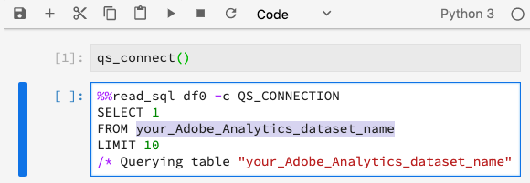
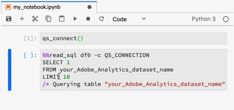

# Jupyter Notebook의 쿼리 서비스

[!DNL Adobe Experience Platform] 에서 SQL(Structured Query Language)을 사용할 수 있습니다. [!DNL Data Science Workspace] 를 통합함으로써 [!DNL Query Service] 대상 [!DNL JupyterLab] 를 표준 기능으로 사용하십시오.

이 자습서에서는 탐색, 변환 및 분석을 위한 일반적인 사용 사례에 대한 샘플 SQL 쿼리를 보여 줍니다 [!DNL Adobe Analytics] 데이터.

## 시작하기

이 자습서를 시작하기 전에 다음 사전 요구 사항이 있어야 합니다.

- 액세스 대상: [!DNL Adobe Experience Platform]. 에서 조직에 대한 액세스 권한이 없는 경우 [!DNL Experience Platform]계속하려면 시스템 관리자에게 문의하십시오.

- An [!DNL Adobe Analytics] 데이터 세트

- 이 자습서에서 사용되는 다음 주요 개념에 대한 작업 이해:
   - [[!DNL Experience Data Model (XDM) and XDM System]](../../xdm/home.md)
   - [[!DNL Query Service]](../../query-service/home.md)
   - [[!DNL Query Service SQL Syntax]](../../query-service/sql/overview.md)
   - Adobe Analytics

## 액세스 [!DNL JupyterLab] 및 [!DNL Query Service] {#access-jupyterlab-and-query-service}

1. 위치 [[!DNL Experience Platform]](https://platform.adobe.com), 다음으로 이동 **[!UICONTROL 노트북]** 왼쪽 탐색 열에서 참조할 수 있습니다. JupyterLab이 로드될 때까지 잠시 기다려 주십시오.

   

   >[!NOTE]
   >
   >새 Launcher 탭이 자동으로 나타나지 않으면 클릭하여 새 Launcher 탭을 엽니다. **[!UICONTROL 파일]** 그런 다음 선택 **[!UICONTROL 새 런처]**.

2. 런처 탭에서 **[!UICONTROL 비어 있음]** 아이콘을 클릭하여 Python 3 환경에서 빈 전자 필기장을 엽니다.

   

   >[!NOTE]
   >
   >Python 3은 현재 Notebooks에서 쿼리 서비스에 대해 유일하게 지원되는 환경입니다.

3. 왼쪽 선택 레일에서 **[!UICONTROL 데이터]** 아이콘을 클릭하고 **[!UICONTROL 데이터 세트]** 모든 데이터 세트를 나열할 디렉터리입니다.

   

4. 찾기 [!DNL Adobe Analytics] 탐색할 데이터 세트 및 목록을 마우스 오른쪽 단추로 클릭하고 **[!UICONTROL Notebook의 데이터 쿼리]** 빈 전자 필기장에 SQL 쿼리를 생성합니다.

5. 함수가 들어 있는 처음 생성된 셀을 클릭합니다 `qs_connect()` 재생 버튼을 클릭하여 실행합니다. 이 기능은 노트북 인스턴스와 [!DNL Query Service].

   

6. 아래로 복사 [!DNL Adobe Analytics] 두 번째로 생성된 SQL 쿼리의 데이터 세트 이름이며 다음 값 이후입니다. `FROM`.

   

7. 다음을 클릭하여 새 전자 필기장 셀을 삽입합니다. **+** 단추를 클릭합니다.

   

8. 새 셀에서 다음 가져오기 구문을 복사, 붙여넣기 및 실행합니다. 다음 문은 데이터를 시각화하는 데 사용됩니다.

   ```python
   import plotly.plotly as py
   import plotly.graph_objs as go
   from plotly.offline import iplot
   ```

9. 그런 다음 다음 다음 변수를 복사하여 새 셀에 붙여넣습니다. 필요에 따라 값을 수정한 다음 실행합니다.

   ```python
   target_table = "your Adobe Analytics dataset name"
   target_year = "2019"
   target_month = "04"
   target_day = "01"
   ```

   - `target_table`: 의 이름 [!DNL Adobe Analytics] 데이터 세트.
   - `target_year`: 대상 데이터의 출처 연도 지정.
   - `target_month`: 타겟이 속한 특정 월입니다.
   - `target_day`: 대상 데이터의 출처가 지정되는 날짜입니다.

   >[!NOTE]
   >
   >언제든지 이러한 값을 변경할 수 있습니다. 그렇게 할 때는 변경 사항을 적용할 변수 셀을 실행해야 합니다.

## 데이터 쿼리 {#query-your-data}

개별 전자 필기장 셀에 다음 SQL 쿼리를 입력합니다. 셀에서 을 선택한 다음 을 선택하여 쿼리를 실행합니다. **[!UICONTROL play]** 단추를 클릭합니다. 성공한 쿼리 결과 또는 오류 로그는 실행된 셀 아래에 표시됩니다.

노트북이 오랫동안 비활성 상태인 경우 노트북과 [!DNL Query Service] 깨질지도 몰라 이 경우 다시 시작합니다. [!DNL JupyterLab] 을(를) 선택하여 **다시 시작** 단추  전원 단추 옆에 있는 오른쪽 상단 모서리에 있습니다.

노트북 커널은 재설정되지만 셀은 남아 있다가 모든 셀을 다시 실행하여 중지된 위치에서 계속 진행합니다.

### 시간별 방문자 수 {#hourly-visitor-count}

다음 쿼리는 지정된 날짜에 대한 시간별 방문자 수를 반환합니다.

#### 쿼리

```sql
%%read_sql hourly_visitor -c QS_CONNECTION
SELECT Substring(timestamp, 1, 10)                               AS Day,
       Substring(timestamp, 12, 2)                               AS Hour, 
       Count(DISTINCT concat(enduserids._experience.aaid.id, 
                             _experience.analytics.session.num)) AS Visit_Count 
FROM   {target_table}
WHERE TIMESTAMP = to_timestamp('{target_year}-{target_month}-{target_day}')
GROUP  BY Day, Hour
ORDER  BY Hour;
```

위의 쿼리에서 `WHERE` 절이 값으로 설정되어 있습니다. `target_year`. 중괄호( )에 변수를 포함하여 SQL 쿼리에 변수를 포함합니다.`{}`).

쿼리의 첫 번째 줄에는 선택적 변수가 포함되어 있습니다 `hourly_visitor`. 쿼리 결과는 이 변수에 Pandas 데이터 프레임으로 저장됩니다. 결과를 데이터 프레임에 저장하면 나중에 원하는 항목을 사용하여 쿼리 결과를 시각화할 수 있습니다 [!DNL Python] 패키지. 다음을 실행합니다 [!DNL Python] 새 셀에 코드를 추가하여 막대 그래프를 생성합니다.

```python
trace = go.Bar(
    x = hourly_visitor['Hour'],
    y = hourly_visitor['Visit_Count'],
    name = "Visitor Count"
)
layout = go.Layout(
    title = 'Visit Count by Hour of Day',
    width = 1200,
    height = 600,
    xaxis = dict(title = 'Hour of Day'),
    yaxis = dict(title = 'Count')
)
fig = go.Figure(data = [trace], layout = layout)
iplot(fig)
```

### 시간별 활동 수 {#hourly-activity-count}

다음 쿼리는 지정된 날짜에 대한 시간별 작업 수를 반환합니다.

#### 쿼리 <!-- omit in toc -->

```sql
%%read_sql hourly_actions -d -c QS_CONNECTION
SELECT Substring(timestamp, 1, 10)                        AS Day,
       Substring(timestamp, 12, 2)                        AS Hour, 
       Count(concat(enduserids._experience.aaid.id, 
                    _experience.analytics.session.num,
                    _experience.analytics.session.depth)) AS Count 
FROM   {target_table}
WHERE TIMESTAMP = to_timestamp('{target_year}-{target_month}-{target_day}')
GROUP  BY Day, Hour
ORDER  BY Hour;
```

위의 쿼리를 실행하면 결과가 다음에 저장됩니다. `hourly_actions` 데이터 프레임입니다. 새 셀에서 다음 함수를 실행하여 결과를 미리 봅니다.

```python
hourly_actions.head()
```

위의 쿼리는 의 논리 연산자를 사용하여 지정된 날짜 범위에 대한 시간별 작업 수를 반환하도록 수정할 수 있습니다. **위치** 절:

#### 쿼리 <!-- omit in toc -->

```sql
%%read_sql hourly_actions_date_range -d -c QS_CONNECTION
SELECT Substring(timestamp, 1, 10)                        AS Day,
       Substring(timestamp, 12, 2)                        AS Hour, 
       Count(concat(enduserids._experience.aaid.id, 
                    _experience.analytics.session.num,
                    _experience.analytics.session.depth)) AS Count 
FROM   {target_table}
WHERE  timestamp >= TO_TIMESTAMP('2019-06-01 00', 'YYYY-MM-DD HH')
       AND timestamp <= TO_TIMESTAMP('2019-06-02 23', 'YYYY-MM-DD HH')
GROUP  BY Day, Hour
ORDER  BY Hour;
```

수정된 쿼리를 실행하면에서 결과가 저장됩니다. `hourly_actions_date_range` 데이터 프레임입니다. 새 셀에서 다음 함수를 실행하여 결과를 미리 봅니다.

```python
hourly_actions_date_rage.head()
```

### 방문자 세션당 이벤트 수 {#number-of-events-per-visitor-session}

다음 쿼리는 지정된 날짜에 대한 방문자 세션당 이벤트 수를 반환합니다.

#### 쿼리 <!-- omit in toc -->

```sql
%%read_sql events_per_session -c QS_CONNECTION
SELECT concat(enduserids._experience.aaid.id, 
              '-#', 
              _experience.analytics.session.num) AS aaid_sess_key, 
       Count(timestamp)                          AS Count 
FROM   {target_table}
WHERE TIMESTAMP = to_timestamp('{target_year}-{target_month}-{target_day}')
GROUP BY aaid_sess_key
ORDER BY Count DESC;
```

다음을 실행합니다 [!DNL Python] 방문 세션당 이벤트 수에 대한 히스토그램을 생성하는 코드:

```python
data = [go.Histogram(x = events_per_session['Count'])]

layout = go.Layout(
    title = 'Histogram of Number of Events per Visit Session',
    xaxis = dict(title = 'Number of Events'),
    yaxis = dict(title = 'Count')
)

fig = go.Figure(data = data, layout = layout)
iplot(fig)
```

### 주어진 날의 인기 페이지 {#popular-pages-for-a-given-day}

다음 쿼리는 지정된 날짜에 대해 가장 방문 빈도가 높은 10개의 페이지를 반환합니다.

#### 쿼리 <!-- omit in toc -->

```sql
%%read_sql popular_pages -c QS_CONNECTION
SELECT web.webpagedetails.name                 AS Page_Name, 
       Sum(web.webpagedetails.pageviews.value) AS Page_Views 
FROM   {target_table}
WHERE TIMESTAMP = to_timestamp('{target_year}-{target_month}-{target_day}')
GROUP  BY web.webpagedetails.name 
ORDER  BY page_views DESC 
LIMIT  10;
```

### 지정된 날의 활성 사용자 {#active-users-for-a-given-day}

다음 쿼리는 지정된 날짜 동안 가장 활동적인 사용자 10명을 반환합니다.

#### 쿼리 <!-- omit in toc -->

```sql
%%read_sql active_users -c QS_CONNECTION
SELECT enduserids._experience.aaid.id AS aaid, 
       Count(timestamp)               AS Count
FROM   {target_table}
WHERE TIMESTAMP = to_timestamp('{target_year}-{target_month}-{target_day}')
GROUP  BY aaid
ORDER  BY Count DESC
LIMIT  10;
```

### 사용자 활동별 활성 도시 {#active-cities-by-user-activity}

다음 쿼리는 지정된 날짜에 대한 사용자 활동의 대부분을 생성하는 10개 도시를 반환합니다.

#### 쿼리 <!-- omit in toc -->

```sql
%%read_sql active_cities -c QS_CONNECTION
SELECT concat(placeContext.geo.stateProvince, ' - ', placeContext.geo.city) AS state_city, 
       Count(timestamp)                                                     AS Count
FROM   {target_table}
WHERE TIMESTAMP = to_timestamp('{target_year}-{target_month}-{target_day}')
GROUP  BY state_city
ORDER  BY Count DESC
LIMIT  10;
```

## 다음 단계

이 튜토리얼에서는 을 활용하는 몇 가지 샘플 사용 사례를 보여 주었습니다 [!DNL Query Service] 위치: [!DNL Jupyter] 전자 필기장. 다음 [Jupyter Notebooks를 사용하여 데이터 분석](./analyze-your-data.md) 데이터 액세스 SDK를 사용하여 유사한 작업을 수행하는 방법을 알아보는 자습서입니다.
