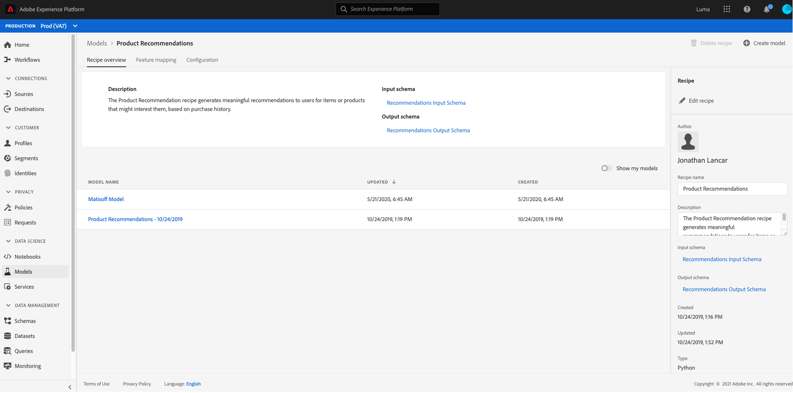
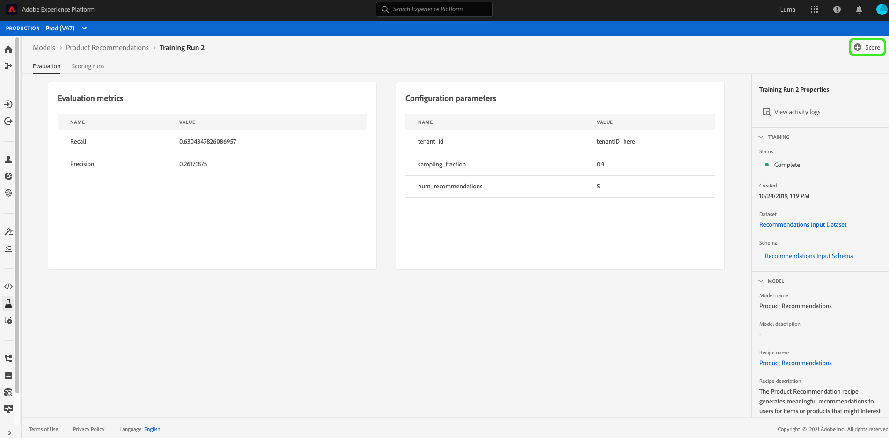

# 기계 학습 모델 만들기 및 게시

온라인 소매 웹 사이트를 소유하고 있다고 가정해 보십시오. 고객이 소매 웹 사이트에서 쇼핑할 때 비즈니스에 제공하는 다양한 기타 제품을 소개하는 맞춤형 제품 추천을 제공해야 합니다. 웹 사이트가 존재하는 동안 고객 데이터를 지속적으로 수집하여 이 데이터를 통해 맞춤형 제품 추천을 생성하고자 합니다.

[!DNL Adobe Experience Platform] [!DNL Data Science Workspace] 사전 제작된  [제품 Recommendations 레서피를 사용하여 목표를 달성할 수 있는 방법을 제공합니다](../pre-built-recipes/product-recommendations.md). 이 튜토리얼을 따라 소매 데이터에 액세스하고, 이해하고, 기계 학습 모델을 만들고, 최적화하고, [!DNL Data Science Workspace]에서 통찰력을 생성하는 방법을 확인하십시오.

이 자습서는 [!DNL Data Science Workspace]의 작업 과정을 반영하고, 기계 학습 모델을 만들기 위한 다음 단계를 설명합니다.

1. [데이터 준비](#prepare-your-data)
2. [모델 작성](#author-your-model)
3. [모델 트레이닝 및 평가](#train-and-evaluate-your-model)
4. [모델 운영](#operationalize-your-model)

## 시작하기

이 자습서를 시작하기 전에 다음 사전 요구 사항을 충족해야 합니다.

- [!DNL Adobe Experience Platform]에 액세스합니다. [!DNL Experience Platform]에서 IMS 조직에 액세스할 수 없는 경우 계속하기 전에 시스템 관리자에게 문의하십시오.

- 활성 에셋. 다음 항목을 프로비저닝하려면 계정 담당자에게 문의하십시오.
   - Recommendations 레서피
   - Recommendations 입력 데이터 세트
   - Recommendations 입력 스키마
   - Recommendations 출력 데이터 세트
   - Recommendations 출력 스키마
   - 골든 데이터 세트 postValues
   - 골든 데이터 집합 스키마

- [Adobe public [!DNL Git] repository](https://github.com/adobe/experience-platform-dsw-reference/tree/master/Summit/2019/resources/Notebooks-Thurs)에서 필요한 3개의 [!DNL Jupyter Notebook] 파일을 다운로드합니다. 이 파일을 사용하여 [!DNL Data Science Workspace]에서 [!DNL JupyterLab] 작업 과정을 보여 줍니다.

이 자습서에 사용된 다음 주요 개념에 대한 작업 이해입니다.
- [[!DNL Experience Data Model]](../../xdm/home.md):Adobe이 고객 경험 관리를 위해  [!DNL Profile] 및 ExperienceEvent와 같은 표준 스키마를 정의하기 위해 수행한 표준화 활동입니다.
- 데이터 세트:실제 데이터에 대한 저장 및 관리 구성 [XDM 스키마](../../xdm/schema/field-dictionary.md)의 실제 인스턴스화된 인스턴스입니다.
- 배치:데이터 세트는 배치로 구성됩니다. 배치란 일정 기간 동안 수집되어 하나의 단위로 함께 처리되는 데이터 세트입니다.
- [!DNL JupyterLab]: [[!DNL JupyterLab]](https://blog.jupyter.org/jupyterlab-is-ready-for-users-5a6f039b8906) 는 프로젝트를 위한 오픈 소스 웹 기반 인터페이스로  [!DNL Jupyter] 긴밀하게 통합되어  [!DNL Experience Platform]있습니다.

## 데이터 {#prepare-your-data} 준비

고객에게 개인화된 제품을 추천할 수 있는 기계 학습 모델을 만들려면 웹 사이트에서 구매한 이전 고객을 분석해야 합니다. 이 섹션에서는 이 데이터를 [!DNL Platform]에서 [!DNL Adobe Analytics]으로 인제스트하는 방법과 이 데이터를 기계 학습 모델에서 사용할 기능 데이터 세트로 변환하는 방법을 설명합니다.

### 데이터 탐색 및 스키마 이해

[Adobe Experience Platform](https://platform.adobe.com/)에 로그인하고 **[!UICONTROL Datasets]**&#x200B;를 선택하여 기존 데이터 세트를 모두 나열하고 탐색할 데이터 세트를 선택합니다. 이 경우 [!DNL Analytics] 데이터 세트 **골든 데이터 세트 postValues**&#x200B;입니다.

데이터 집합 활동 페이지가 열리고 데이터 집합에 대한 정보가 나열됩니다. 샘플 레코드를 검사하려면 오른쪽 위 근처에 있는 **[!UICONTROL Preview Dataset]**&#x200B;을 선택할 수 있습니다. 선택한 데이터 세트에 대한 스키마를 볼 수도 있습니다. 오른쪽 레일에서 스키마 링크를 선택합니다. 팝업 창이 나타나고 **[!UICONTROL schema name]** 아래의 링크를 선택하면 새 탭에 스키마가 열립니다.

다른 데이터 세트는 미리 보기 목적으로 배치로 미리 채워집니다. 위 단계를 반복하여 이러한 데이터 세트를 볼 수 있습니다.

| 데이터 세트 이름 | 스키마 | 설명 |
| ----- | ----- | ----- |
| 골든 데이터 세트 postValues | 골든 데이터 집합 스키마 | [!DNL Analytics] 웹 사이트의 소스 데이터 |
| Recommendations 입력 데이터 세트 | Recommendations 입력 스키마 | [!DNL Analytics] 데이터는 기능 파이프라인을 사용하여 교육 데이터 세트로 변환됩니다. 이 데이터는 제품 Recommendations 기계 학습 모델을 교육하는 데 사용됩니다. `itemid` 그리고 해당 고객이 구매한 제품에  `userid` 해당합니다. |
| Recommendations 출력 데이터 세트 | Recommendations 출력 스키마 | 점수 지정 결과가 저장되는 데이터 세트에 각 고객에 대해 권장되는 제품 목록이 포함됩니다. |

## 모델 {#author-your-model} 작성

[!DNL Data Science Workspace] 라이프사이클의 두 번째 구성 요소에는 레서피 및 모델 작성이 포함됩니다. 제품 Recommendations 레서피는 이전 구매 데이터 및 머신 러닝을 활용하여 제품 추천을 규모에 맞게 생성하도록 설계되었습니다.

레서피는 특정 문제를 해결하기 위해 설계된 기계 학습 알고리즘과 논리를 포함하므로 모델의 기반이 됩니다. 더욱 중요한 것은 레서피를 통해 조직 전체에서 머신 러닝을 민주화할 수 있으므로 다른 사용자가 코드를 작성하지 않고도 서로 다른 사용 사례에 대한 모델을 이용할 수 있습니다.

### 제품 Recommendations 레서피 살펴보기

Experience Platform에서 왼쪽 탐색 열의 **[!UICONTROL Models]**&#x200B;으로 이동한 다음 위쪽 탐색에서 **[!UICONTROL Recipes]**&#x200B;을 선택하여 조직에 대해 사용 가능한 레서피 목록을 봅니다.

그런 다음 해당 이름을 선택하여 제공된 **[!UICONTROL Recommendations Recipe]**&#x200B;을 찾아 엽니다. 레서피 개요 페이지가 나타납니다.

그런 다음 오른쪽 레일에서 **[!UICONTROL Recommendations Input Schema]**&#x200B;을 선택하여 레서피를 향상시키는 스키마를 봅니다. 스키마 필드 &quot;[!UICONTROL itemId]&quot; 및 &quot;[!UICONTROL userId]&quot;은 특정 시간([!UICONTROL timestamp])에 해당 고객이 구매한 제품([!UICONTROL interactionType])에 해당합니다. 동일한 단계에 따라 **[!UICONTROL Recommendations Output Schema]** 필드를 검토하십시오.

이제 제품 Recommendations 레서피에 필요한 입력 및 출력 스키마를 검토했습니다. 제품 Recommendations 모델을 만들고, 교육하고, 평가하는 방법에 대해 알아보려면 다음 섹션을 계속하십시오.

## 모델 {#train-and-evaluate-your-model} 트레이닝 및 평가

이제 데이터가 준비되고 레서피가 준비되었으니 기계 학습 모델을 생성, 교육 및 평가할 수 있습니다.

### 모델 만들기

모델은 레서피 인스턴스로, 규모에 따라 데이터를 트레이닝하고 점수를 매길 수 있습니다.

Experience Platform의 왼쪽 탐색 열에서 **[!UICONTROL Models]**&#x200B;으로 이동한 다음 위쪽 탐색에서 **[!UICONTROL Recipes]**&#x200B;을 선택합니다. 조직에 사용할 수 있는 레서피 목록이 표시됩니다.제품 권장 레서피를 선택합니다.

레서피 페이지에서 **[!UICONTROL Create Model]**&#x200B;을 선택합니다.

모델 생성 워크플로우는 레서피를 선택하여 시작합니다. **[!UICONTROL Recommendations Recipe]** 을 선택하고 오른쪽 위 모서리에서 **[!UICONTROL Next]**&#x200B;을 선택합니다.

다음으로 모델 이름을 입력합니다. 모델의 사용 가능한 구성은 모델의 기본 교육 및 점수 지정 동작에 대한 설정이 포함되어 있습니다. 구성을 검토하고 **[!UICONTROL Finish]**&#x200B;을 선택합니다.

새로 생성된 교육 실행으로 모델 개요 페이지를 리디렉션합니다. 모델이 만들어지면 기본적으로 교육 실행이 생성됩니다.

다음 섹션에서 교육 실행이 끝날 때까지 기다리거나 새 교육 실행을 계속 만들 수 있습니다.

### 사용자 정의 하이퍼매개 변수를 사용하여 모델 트레이닝

**모델 개요** 페이지에서 오른쪽 상단 근처에 있는 **[!UICONTROL Train]**&#x200B;를 선택하여 새 교육 실행을 만듭니다. 모델을 만들 때 사용한 것과 동일한 입력 데이터 세트를 선택하고 **[!UICONTROL Next]**&#x200B;을 선택합니다.

**[!UICONTROL Configuration]** 페이지가 나타납니다. 여기서는 하이퍼매개 변수라고도 하는 `num_recommendations` 값을 실행하는 교육을 구성할 수 있습니다. 훈련되고 최적화된 모델은 트레이닝 실행 결과를 기반으로 가장 성과가 좋은 하이퍼매개 변수를 활용합니다.

하이퍼매개 변수는 알 수 없으므로, 훈련을 실행하기 전에 매개 변수를 할당해야 합니다. 하이퍼매개 변수를 조정하면 훈련된 모델의 정확도가 변경될 수 있습니다. 모델을 최적화하는 것은 반복적인 프로세스이므로 만족할만한 평가를 얻기 전에 여러 개의 교육 실행이 필요할 수 있습니다.

>[!TIP]
>
>`num_recommendations`을(를) 10으로 설정합니다.

추가적인 데이터 포인트가 모델 평가 차트에 표시됩니다. 실행이 완료된 후 이 작업이 표시되기까지는 최대 몇 분이 걸릴 수 있습니다.

### 모델 평가

교육 실행이 완료될 때마다 결과 평가 지표를 보고 모델이 얼마나 잘 수행되었는지 확인할 수 있습니다.

완료된 각 교육 실행에 대한 평가 지표(정밀도 및 회수)를 검토하려면 교육 실행을 선택합니다.

각 평가 지표에 대해 제공된 정보를 탐색할 수 있습니다. 이러한 지표가 높을수록 모델이 더 잘 수행됩니다.

오른쪽 레일에서 각 교육 실행에 사용되는 데이터 세트, 스키마 및 구성 매개 변수를 볼 수 있습니다. [모델] 페이지로 돌아가서 평가 지표를 준수하여 성과가 가장 높은 교육 실행을 확인합니다.

## 모델 {#operationalize-your-model} 운영

데이터 과학 워크플로우의 마지막 단계는 데이터 저장소에서 통찰력을 확보하고 사용하기 위해 모델을 조작하는 것입니다.

### 점수 매김 및 인사이트 생성

제품 권장 사항 모델 개요 페이지에서 가장 높은 회수 및 정밀도 값으로 성과가 좋은 교육 실행 이름을 선택합니다.

그런 다음 교육 실행 세부 정보 페이지의 오른쪽 상단에서 **[!UICONTROL Score]**&#x200B;을 선택합니다.

그런 다음 **[!UICONTROL Recommendations Input Dataset]**&#x200B;을(를) 모델을 만들고 해당 교육 실행을 실행할 때 사용한 데이터 세트와 동일한 점수 입력 데이터 세트로 선택합니다. 그런 다음 **[!UICONTROL Next]**&#x200B;을 선택합니다.

입력 데이터 세트가 있는 경우 점수 출력 데이터 집합으로 **[!UICONTROL Recommendations Output Dataset]**&#x200B;을 선택합니다. 점수 지정 결과는 이 데이터 세트에 일괄 보관됩니다.

마지막으로 점수 지정 구성을 검토합니다. 이러한 매개 변수에는 적절한 스키마와 함께 이전에 선택한 입력 및 출력 데이터 세트가 포함됩니다. 점수 실행을 시작하려면 **[!UICONTROL Finish]**&#x200B;을 선택합니다. 실행을 완료하는 데 몇 분 정도 걸릴 수 있습니다.

### 점수가 매겨진 통찰력 보기

점수부여 실행이 성공적으로 완료되면 결과를 미리 보고 생성된 통찰력을 볼 수 있습니다.

점수 지정 실행 페이지에서 완료된 점수 실행을 선택한 다음 오른쪽 레일에서 **[!UICONTROL Preview Scoring Results Dataset]**&#x200B;을 선택합니다.

미리 보기 테이블에서 각 행은 각각 [!UICONTROL recommendations] 및 [!UICONTROL userId]로 레이블이 지정된 특정 고객에 대한 제품 권장 사항을 포함합니다. 샘플 스크린샷에서 [!UICONTROL num_recommendations] hyperparameter가 10으로 설정되었으므로 권장 사항의 각 행은 숫자 기호(#)로 구분된 최대 10개의 제품 ID를 포함할 수 있습니다.

## 다음 단계 {#next-steps}

이 자습서에서는 기계 학습을 통해 처리되지 않은 원시 데이터를 유용한 정보로 변환하는 방법을 보여 주는 [!DNL Data Science Workspace] 작업 과정을 소개합니다. [!DNL Data Science Workspace] 사용에 대한 자세한 내용을 보려면 [소매 판매 스키마 및 데이터 세트](./create-retails-sales-dataset.md)의 다음 안내서를 계속 참조하십시오.
