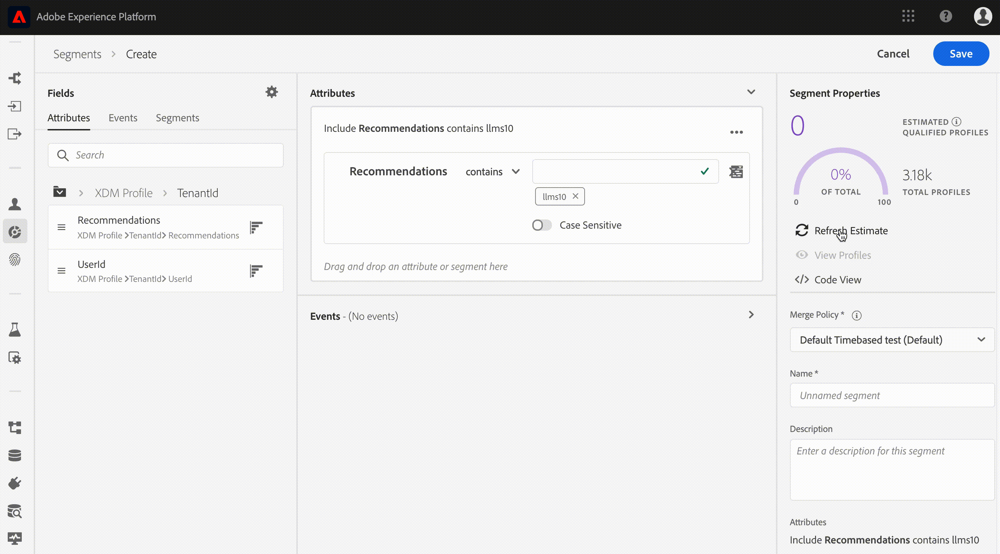

# 머신 러닝 인사이트를 통해 실시간 고객 프로파일 강화

Adobe Experience Platform Data Science Workspace는 머신 러닝 모델을 생성, 평가 및 활용하여 데이터 예측 및 통찰력을 생성하는 툴 및 리소스를 제공합니다. 머신 러닝 인사이트를 프로필 사용 가능한 데이터 세트에 인제스트하면 동일한 데이터를 프로필 레코드로 인제스트하여 Experience Platform 세그멘테이션 서비스를 사용하여 관련 요소의 하위 세트로 세그먼트화할 수 있습니다.

이 문서에서는 머신 러닝 인사이트를 통해 실시간 고객 프로파일을 강화하기 위한 단계별 자습서를 제공하며 다음 섹션으로 구성되어 있습니다.

1. [출력 스키마 및 데이터 집합 만들기](#create-an-output-schema-and-dataset)
2. [출력 스키마 및 데이터 집합 구성](#configure-an-output-schema-and-dataset)
3. [세그먼트 빌더를 사용하여 세그먼트 만들기](#create-segments-using-the-segment-builder)

## 시작하기

이 자습서에서는 프로필 데이터 인제스트 및 세그먼트 만들기와 관련된 Adobe Experience Platform의 다양한 측면을 파악해야 합니다. 이 자습서를 시작하기 전에 다음 서비스에 대한 설명서를 검토하십시오.

* [실시간 고객 프로필](../../rtcdp/overview.md):다양한 소스의 데이터를 집계하여 통합된 실시간 고객 프로파일을 제공합니다.
* [ID 서비스](../../identity-service/home.md):인제스트되는 다양한 데이터 소스의 ID를 플랫폼에 통합하여 실시간 고객 프로파일을 구축할 수 있습니다.
* [XDM(Experience Data Model)](../../xdm/home.md):플랫폼이 고객 경험 데이터를 구성하는 표준화된 프레임워크입니다.

위에 언급된 문서 외에도 스키마 및 스키마 편집기에 대한 다음 안내서도 검토하는 것이 좋습니다.

* [스키마 컴포지션의](../../xdm/schema/composition.md)기본 사항:Experience Platform에서 사용할 스키마를 작성하기 위한 XDM 스키마, 빌딩 블록, 원칙 및 모범 사례에 대해 설명합니다.
* [스키마 편집기 자습서](../../xdm/tutorials/create-schema-ui.md):경험 플랫폼 내에서 스키마 편집기를 사용하여 스키마를 생성하는 방법에 대한 자세한 지침을 제공합니다.

## 출력 스키마 및 데이터 집합 만들기

채점 인사이트를 통해 실시간 고객 프로파일을 강화하는 첫 번째 단계는 데이터가 정의하는 실제 개체(예: 사람)를 파악하는 것입니다. 데이터에 대한 이해를 통해 관계형 데이터베이스를 디자인하는 것과 같이 데이터에 의미가 있는 구조를 설명하고 설계할 수 있습니다.

스키마 구성은 클래스를 할당하는 것으로 시작됩니다. 클래스는 스키마에 포함할 데이터의 동작 측면(레코드 또는 시간 시리즈)을 정의합니다. 이 섹션에서는 스키마 빌더를 사용하여 스키마를 생성하는 기본 지침을 제공합니다. 자세한 자습서는 스키마 편집기를 사용하여 스키마 [만들기에 대한 자습서를 참조하십시오](../../xdm/tutorials/create-schema-ui.md).

1. Adobe Experience Platform에서 스키마 **탭을** 클릭하여 스키마 브라우저에 액세스합니다. 스키마 **생성** 을 *클릭하여 스키마*편집기에서대화식으로 스키마를 작성하고 생성할 수 있습니다.
   

2. [컴포지션] *창에서* [할당] **을 클릭하여** 사용 가능한 클래스를 검색합니다.
   * 기존 클래스를 할당하려면 원하는 클래스를 클릭하고 강조 표시한 다음 클래스 할당을 **클릭합니다**.
      

   * 사용자 정의 클래스를 만들려면 **브라우저 창의 가운데** 맨 위에 있는 새 클래스 만들기를 클릭합니다. 클래스 이름과 설명을 제공하고 클래스의 동작을 선택합니다. 완료되면 **클래스** 할당을 클릭합니다.
      
   이때 스키마의 구조에는 일부 클래스 필드가 포함되어 있어야 하며 믹서를 할당할 준비가 되었습니다. 혼합은 특정 개념을 설명하는 하나 이상의 필드 그룹입니다.

3. [ *컴포지션* ] 창 내에서 **[믹싱** ] *하위 섹션에서* [추가]를클릭합니다.
   * 기존 혼합을 할당하려면 원하는 믹스를 클릭하여 강조 표시한 다음 [믹서 추가] **를 클릭합니다**. 클래스와 달리, 여러 혼합을 하나의 스키마로 할당하는 것이 적절하면 됩니다.
      

   * 새 혼합을 만들려면 브라우저 **창의 가운데** 위쪽에 있는 [새 믹싱 만들기]를 클릭합니다. 믹스인의 이름과 설명을 입력한 다음 **[믹서 할당** ]을 클릭합니다.
      

   * 믹스인 필드를 추가하려면 [컴포지션] 창 내에서 믹스인의 이름을 *클릭합니다* . 그런 다음 구조 창 내에서 필드 추가를 클릭하여 혼합을 추가하는 **옵션이** *제공됩니다* . 적절하게 혼합 속성을 제공해야 합니다.
      

4. 스키마 빌드가 완료되면 구조 창에서 스키마의 최상위 수준 *필드를* 클릭하여 오른쪽 속성 창에 스키마의 속성을 표시합니다. 이름과 설명을 입력하고 저장을 클릭하여 **스키마를** 만듭니다.
   

5. 왼쪽 탐색 열에서 데이터 세트를 클릭하여 새로 만든 스키마를 사용하여 **출력** 데이터 세트를 만든 다음 데이터 세트 **만들기를 클릭합니다**. 다음 화면에서 스키마에서 **데이터 집합**만들기를 선택합니다.
   

6. 스키마 브라우저를 사용하여 새로 만든 스키마를 찾아 선택한 다음 다음을 **클릭합니다**.
   

7. 이름과 선택적 설명을 제공한 다음 마침을 클릭하여 **데이터** 세트를 만듭니다.
   

출력 스키마 데이터 세트를 만들었다면 다음 섹션을 계속 사용하여 프로파일 향상을 구성하고 활성화할 수 있습니다.

## 출력 스키마 및 데이터 집합 구성

프로필에 대한 데이터 집합을 사용하려면 먼저 데이터 집합의 스키마로 기본 ID 필드를 포함하도록 구성한 다음 프로필에 대한 스키마를 사용하도록 설정해야 합니다. 새 스키마를 만들고 활성화하려면 스키마 편집기를 사용하여 스키마 [만들기에 대한 자습서를 참조할 수 있습니다](../../xdm/tutorials/create-schema-ui.md). 그렇지 않은 경우 아래 지침에 따라 기존 스키마와 데이터 세트를 활성화합니다.

1. Adobe Experience Platform에서 스키마 브라우저를 사용하여 프로파일을 활성화할 출력 스키마를 찾은 다음 해당 이름을 클릭하여 해당 컴포지션을 확인합니다.
   

2. 스키마 구조를 확장하고 기본 식별자로 설정할 적절한 필드를 찾습니다. 원하는 필드를 클릭하여 속성을 표시합니다.
   

3. 필드의 ID 속성, 기본 ID **속성을** 활성화한 다음 해당 **ID** 네임스페이스를 선택하여 **필드를 기본 ID로**&#x200B;설정합니다. 변경한 **후** 적용을 클릭합니다.
   

4. 스키마 구조의 최상위 객체를 클릭하여 스키마 속성을 표시하고 프로파일 스위치를 전환하여 프로파일에 대한 스키마를 **활성화합니다** . 저장을 **클릭하여** 변경 내용을 완료하면 이제 이 스키마를 사용하여 만든 데이터 세트를 프로필에 사용할 수 있습니다.
   

5. 데이터 집합 브라우저를 사용하여 프로파일을 활성화할 데이터 집합을 찾고 이름을 클릭하여 세부 정보에 액세스합니다.
   

6. 올바른 정보 열에 있는 프로필 **스위치를** 전환하여 프로필에 대한 데이터 세트를 활성화합니다.
   

데이터를 프로파일이 활성화된 데이터 세트에 인제스트하면 동일한 데이터를 프로필 레코드와 인제스트됩니다. 스키마와 데이터 세트가 준비되었으므로 적절한 모델을 사용하여 점수 실행을 수행하여 데이터 세트에 일부 데이터를 생성하고 이 튜토리얼을 통해 세그먼트 빌더를 사용하여 인사이트 세그먼트를 만듭니다.

## 세그먼트 빌더를 사용하여 세그먼트 만들기

이제 프로필 사용 데이터 세트에 대한 인사이트를 생성하고 인사이트를 수집했으므로 세그먼트 빌더를 사용하여 관련 요소의 하위 세트를 식별하여 해당 데이터를 관리할 수 있습니다. 아래 절차에 따라 고유한 세그먼트를 만듭니다.

1. Adobe Experience Platform에서 세그먼트 **탭** 다음에 세그먼트 **만들기를** 클릭하여 세그먼트 빌더에 액세스합니다.
   

2. 세그먼트 빌더 내에서 왼쪽 레일은 세그먼트의 핵심 구성 요소에 대한 액세스를 제공합니다.속성, 이벤트 및 기존 세그먼트 각 빌딩 블록은 해당 탭에 표시됩니다. 프로필 사용 스키마가 확장되는 클래스를 선택한 다음 세그먼트에 대한 기본 블록을 찾아 찾습니다.
   

3. 비교 문을 제공하여 빌딩 블록을 규칙 빌더 캔버스로 드래그하여 놓고 완성합니다.
   

4. 세그먼트를 만드는 동안 세그먼트 속성 패널을 통해 예상 세그먼트 결과를 미리 볼 *수* 있습니다.
   

5. 적절한 병합 **정책을**&#x200B;선택하고 이름 및 선택적 설명을 제공한 다음 저장을 클릭하여 **새** 세그먼트를 완료합니다.
   

## 다음 단계

이 문서에서는 프로필에 대한 스키마와 데이터 세트를 활성화하는 데 필요한 단계를 안내하고 세그먼트 빌더를 사용하여 인사이트 세그먼트를 만드는 워크플로우를 간략히 설명했습니다. 세그먼트 및 세그먼트 빌더에 대한 자세한 내용은 세그멘테이션 [서비스 개요를](../../segmentation/home.md)참조하십시오.