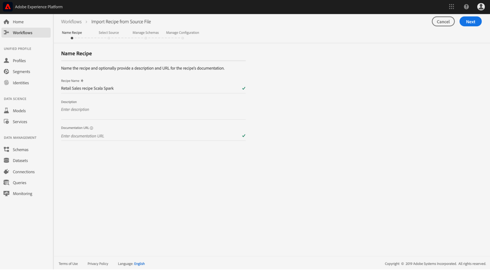

# 패키지된 레서피 가져오기(UI)

이 자습서에서는 제공된 소매 판매 예제를 사용하여 패키지된 레서피를 구성하고 가져오는 방법에 대한 통찰력을 제공합니다. 이 튜토리얼을 종료하면 Adobe Experience Platform 데이터 과학 작업 공간에서 모델을 만들고, 교육하고, 평가할 수 있습니다.

## 전제 조건

이 자습서에서는 Docker 이미지 URL 또는 바이너리 파일의 형태로 패키지된 레시피가 필요합니다. 자세한 내용은 소스 파일을 [레서피로 패키지하는 방법에](./package-source-files-recipe.md) 대한 자습서를 참조하십시오.

## UI 워크플로우

패키징된 레서피를 데이터 과학 작업 영역으로 가져오려면 단일 JSON(JavaScript Object Notation) 파일로 컴파일된 특정 레서피 구성이 필요합니다. 이 레서피 구성의 컴파일을 **구성 파일이라고**&#x200B;합니다. 특정 구성 세트가 있는 패키지 레시피를 **레서피 인스턴스로**&#x200B;부릅니다. 하나의 레시피는 데이터 과학 작업 공간에서 많은 레서피 인스턴스를 만드는 데 사용할 수 있습니다.

패키지 레서피를 가져오는 워크플로우는 다음 단계로 구성됩니다.
- [레서피 구성](#configure)
- [바이너리 기반의 레서피 가져오기 - PySpark](#pyspark)
- [바이너리 기반의 레서피 가져오기 - Scala Spark](#scala)
- [Docker 기반 레시피 가져오기 - Python](#python)
- [Docker 기반 레서피 가져오기 - R](#r)

### 레서피 구성 {#configure}

Data Science Workspace의 모든 레서피 인스턴스에는 특정 사용 사례에 맞게 레서피 인스턴스를 맞춤화하는 구성 세트가 포함되어 있습니다. 구성 파일은 이 레서피 인스턴스를 사용하여 생성된 모델의 기본 교육 및 점수 동작을 정의합니다.

>[!NOTE] 구성 파일은 레시피 및 대/소문자별로 다릅니다.

다음은 소매 영업 레서피에 대한 기본 트레이닝 및 점수 지정 동작을 보여주는 샘플 구성 파일입니다.

```json
[
    {
        "name": "train",
        "parameters": [
            {
                "key": "learning_rate",
                "value": "0.1"  
            },
            {
                "key": "n_estimators",
                "value": "100"
            },
            {
                "key": "max_depth",
                "value": "3"
            },
            {
                "key": "ACP_DSW_INPUT_FEATURES",
                "value": "date,store,storeType,storeSize,temperature,regionalFuelPrice,markdown,cpi,unemployment,isHoliday"
            },
            {
                "key": "ACP_DSW_TARGET_FEATURES",
                "value": "weeklySales"
            },
            {
                "key": "ACP_DSW_FEATURE_UPDATE_SUPPORT",
                "value": false
            },
            {
                "key": "tenantId",
                "value": "_{TENANT_ID}"
            },
            {
                "key": "ACP_DSW_TRAINING_XDM_SCHEMA",
                "value": "{SEE BELOW FOR DETAILS}"
            },
            {
                "key": "evaluation.labelColumn",
                "value": "weeklySalesAhead"
            },
            {
                "key": "evaluation.metrics",
                "value": "MAPE,MAE,RMSE,MASE"
            }
        ]
    },
    {
        "name": "score",
        "parameters": [
            {
                "key": "tenantId",
                "value": "_{TENANT_ID}"
            },
            {
                "key":"ACP_DSW_SCORING_RESULTS_XDM_SCHEMA",
                "value":"{SEE BELOW FOR DETAILS}"
            }
        ]
    }
]
```

| 매개 변수 키 | 유형 | 설명 |
| ----- | ----- | ----- |
| `learning_rate` | 숫자 | 그래디언트 곱셈을 위한 스칼라. |
| `n_estimators` | 숫자 | 임의 포리스트 분류자의 포리스트에 있는 트리 수입니다. |
| `max_depth` | 숫자 | 임의 포리스트 분류기의 트리 최대 깊이입니다. |
| `ACP_DSW_INPUT_FEATURES` | 문자열 | 쉼표로 구분된 입력 스키마 속성 목록입니다. |
| `ACP_DSW_TARGET_FEATURES` | 문자열 | 쉼표로 구분된 출력 스키마 속성 목록입니다. |
| `ACP_DSW_FEATURE_UPDATE_SUPPORT` | 부울 | 입력 및 출력 기능을 수정할 수 있는지 여부를 결정합니다. |
| `tenantId` | 문자열 | 이 ID를 사용하면 만든 리소스가 적절하게 지정되어 IMS 조직 내에 포함됩니다. [테넌트 ID를 찾으려면 다음](../../xdm/api/getting-started.md#know-your-tenant_id) 단계를 따르십시오. |
| `ACP_DSW_TRAINING_XDM_SCHEMA` | 문자열 | 모델 교육에 사용되는 입력 스키마입니다. UI에서 가져올 때는 이 값을 비워 두고, API를 사용하여 가져올 때 교육 스키마 ID로 바꿉니다. |
| `evaluation.labelColumn` | 문자열 | 평가 시각화를 위한 열 레이블입니다. |
| `evaluation.metrics` | 문자열 | 모델을 평가하는 데 사용할 평가 지표의 쉼표로 구분된 목록입니다. |
| `ACP_DSW_SCORING_RESULTS_XDM_SCHEMA` | 문자열 | 모델 점수 지정에 사용되는 출력 스키마입니다. UI에서 가져올 때는 이 값을 비워 두고, API를 사용하여 가져올 때 점수 SchemaID로 바꿉니다. |

이 자습서를 위해 데이터 과학 작업 공간 참조에서 소매 영업 레서피에 대한 기본 구성 파일을 있는 그대로 둘 수 있습니다.

### 바이너리 기반의 레서피 가져오기 - PySpark {#pyspark}

소스 파일을 [Recipe 튜토리얼로 패키징하면](./package-source-files-recipe.md) Retail Sales PySpark 소스 파일을 사용하여 EGG **** 바이너리 파일이 제작되었습니다.

1. Adobe [Experience Platform](https://platform.adobe.com/)에서 왼쪽 탐색 패널을 찾아 워크플로우를 **클릭합니다**. 워크플로우 인터페이스에서 소스 **파일에서** 새 **레서피 가져오기** 프로세스를 시작합니다.
   
2. 소매 영업 레서피에 적절한 이름을 입력합니다. 예: &quot;Retail Sales recipe PySpark&quot; 선택적으로 레서피 설명과 설명서 URL을 포함합니다. 완료되면 **[다음** ]을 클릭합니다.
   
3. 패키지 소스 파일에서 만든 PySpark Retail [Sales 레서피를 드래그하여 놓거나](./package-source-files-recipe.md) 파일 시스템 브라우저를 사용하여 Recipe 자습서로 **가져옵니다**. 포장된 조리법은 에 위치해야 한다 `experience-platform-dsw-reference/recipes/pyspark/dist`.
마찬가지로, 드래그 앤 드롭하여 제공된 구성 파일을 가져오거나 파일 시스템 브라우저를 사용할 수 **있습니다**. 제공된 구성 파일은 에서 찾을 수 `experience-platform-dsw-reference/recipes/pyspark/pipeline.json`있습니다. 두 **파일이 모두** 제공되면 [다음]을 클릭합니다.
   
4. 이 시점에서 오류가 발생할 수 있습니다. 이것은 정상적인 행동이며 예상될 것입니다. 스키마 관리 섹션에서 소매 판매 입력 및 출력 스키마를 **선택합니다**. 이 스키마는 소매 판매 스키마 [만들기 및 데이터 세트](../models-recipes/create-retails-sales-dataset.md) 자습서에서 제공된 부트스트랩 스크립트를 사용하여 만들어졌습니다.
   
기능 **관리** 섹션에서 스키마 뷰어에서 임차인 ID를 클릭하여 소매 판매 입력 스키마를 확장합니다. 원하는 기능을 강조 표시하고 오른쪽 필드 속성 **창에서 입력 기능** 또는 **대상** 기능을 선택하여 **입력 및 출력** 기능을선택합니다. 이 자습서를 위해 weeklySales **를** Target **기능으로** 설정하고 그 외의 모든 것을 **입력 기능으로**&#x200B;설정합니다. 다음을 **클릭하여** 새로 구성된 레서피를 검토합니다.
5. 필요에 따라 레시피를 검토하고 구성을 추가, 수정 또는 제거합니다. 마침을 **클릭하여** 레서피를 생성합니다.
   

축하합니다. 소매 영업 레서피를 만들었습니다. 새로 만든 소매 영업 레서피를 사용하여 데이터 과학 작업 공간에서 모델을 생성하는 방법을 [살펴보려면 다음 단계로](#next-steps) 이동합니다.


### 바이너리 기반의 레서피 가져오기 - Scala Spark {#scala}

소스 파일을 [Recipe 튜토리얼로 패키징](./package-source-files-recipe.md) 시 Retail Sales Spark 소스 파일을 사용하여 JAR **** 바이너리 파일이 제작되었습니다.

1. Adobe [Experience Platform](https://platform.adobe.com/)에서 왼쪽 탐색 패널을 찾아 워크플로우를 **클릭합니다**. 워크플로우 인터페이스에서 소스 **파일에서** 새 **레서피 가져오기** 프로세스를 시작합니다.
   
2. 소매 영업 레서피에 적절한 이름을 입력합니다. 예: &quot;Retail Sales recipe Scala Spark&quot; 선택적으로 레서피 설명과 설명서 URL을 포함합니다. 완료되면 **[다음** ]을 클릭합니다.
   
3. 패키지 소스 파일에서 만든 Scala Spark Retail [Sales 레서피를 드래그하여 놓거나](./package-source-files-recipe.md) 파일 시스템 브라우저를 사용하여 Recipe 자습서로 **가져옵니다**. 종속 **기능이** 있는 패키지 레시피는 에 있습니다 `experience-platform-dsw-reference/recipes/scala/target`. 마찬가지로, 드래그 앤 드롭하여 제공된 구성 파일을 가져오거나 파일 시스템 브라우저를 사용할 수 **있습니다**. 제공된 구성 파일은 에서 찾을 수 `experience-platform-dsw-reference/recipes/scala/src/main/resources/pipelineservice.json`있습니다. 두 **파일이 모두** 제공되면 [다음]을 클릭합니다.
   
4. 이 시점에서 오류가 발생할 수 있습니다. 이것은 정상적인 행동이며 예상될 것입니다. 스키마 관리 섹션에서 소매 판매 입력 및 출력 스키마를 **선택합니다**. 이 스키마는 소매 판매 스키마 [만들기 및 데이터 세트](../models-recipes/create-retails-sales-dataset.md) 자습서에서 제공된 부트스트랩 스크립트를 사용하여 만들어졌습니다.
   
기능 **관리** 섹션에서 스키마 뷰어에서 임차인 ID를 클릭하여 소매 판매 입력 스키마를 확장합니다. 원하는 기능을 강조 표시하고 오른쪽 필드 속성 **창에서 입력 기능** 또는 **대상** 기능을 선택하여 **입력 및 출력** 기능을선택합니다. 이 자습서를 위해 weeklySales **를** Target **기능으로** 설정하고 그 외의 모든 것을 **입력 기능으로**&#x200B;설정합니다. 다음을 **클릭하여** 새로 구성된 레서피를 검토합니다.
5. 필요에 따라 레시피를 검토하고 구성을 추가, 수정 또는 제거합니다. 마침을 **클릭하여** 레서피를 생성합니다.
   

축하합니다. 소매 영업 레서피를 만들었습니다. 새로 만든 소매 영업 레서피를 사용하여 데이터 과학 작업 공간에서 모델을 생성하는 방법을 [살펴보려면 다음 단계로](#next-steps) 이동합니다.

### Docker 기반 레시피 가져오기 - Python {#python}

Package [source files into a Recipe](./package-source-files-recipe.md) tutorial, a Docker URL was provided at the end of building the Retail Sales recipe using Python Python source files.

1. 소스 URL 필드에 Python 소스 파일을 사용하여 만든 패키지된 레시피에 해당하는 Docker **URL을** 붙여 넣습니다. 그런 다음 드래그 앤 드롭하여 제공된 구성 파일을 가져오거나 파일 시스템 브라우저를 **사용합니다**. 제공된 구성 파일은 에서 찾을 수 `experience-platform-dsw-reference/recipes/python/retail/retail.config.json`있습니다. 두 **항목이** 모두 제공되면 [다음]을 클릭합니다.
   
2. 스키마 관리 섹션에서 소매 판매 입력 및 출력 스키마를 **선택합니다**. 이 스키마는 소매 판매 스키마 [만들기 및 데이터 세트](../models-recipes/create-retails-sales-dataset.md) 자습서에서 제공된 부트스트랩 스크립트를 사용하여 만들어졌습니다.
   
기능 **관리** 섹션에서 스키마 뷰어에서 임차인 ID를 클릭하여 소매 판매 입력 스키마를 확장합니다. 원하는 기능을 강조 표시하고 오른쪽 필드 속성 **창에서 입력 기능** 또는 **대상** 기능을 선택하여 **입력 및 출력** 기능을선택합니다. 이 자습서를 위해 weeklySales **를** Target **기능으로** 설정하고 그 외의 모든 것을 **입력 기능으로**&#x200B;설정합니다. 다음을 **클릭하여** 새로 구성된 레서피를 검토합니다.
3. 필요에 따라 레시피를 검토하고 구성을 추가, 수정 또는 제거합니다. 마침을 **클릭하여** 레서피를 생성합니다.
   

축하합니다. 소매 영업 레서피를 만들었습니다. 새로 만든 소매 영업 레서피를 사용하여 데이터 과학 작업 공간에서 모델을 생성하는 방법을 [살펴보려면 다음 단계로](#next-steps) 이동합니다.

### Docker 기반 레서피 가져오기 - R {#r}

소스 파일을 [레서피](./package-source-files-recipe.md) 자습서로 패키징하면 R 소스 파일을 사용하여 소매 영업 레서피 작성 종료 시 Docker URL이 제공되었습니다.

1. 소스 URL 필드에 R 소스 파일을 사용하여 작성한 패키지된 레서피에 해당하는 Docker URL을 **붙여 넣습니다** . 그런 다음 드래그 앤 드롭하여 제공된 구성 파일을 가져오거나 파일 시스템 브라우저를 **사용합니다**. 제공된 구성 파일은 에서 찾을 수 `experience-platform-dsw-reference/recipes/R/Retail\ -\ GradientBoosting/retail.config.json`있습니다. 두 **항목이** 모두 제공되면 [다음]을 클릭합니다.
   
2. 스키마 관리 섹션에서 소매 판매 입력 및 출력 스키마를 **선택합니다**. 이 스키마는 소매 판매 스키마 [만들기 및 데이터 세트](../models-recipes/create-retails-sales-dataset.md) 자습서에서 제공된 부트스트랩 스크립트를 사용하여 만들어졌습니다.
   
기능 **관리** 섹션에서 스키마 뷰어에서 임차인 ID를 클릭하여 소매 판매 입력 스키마를 확장합니다. 원하는 기능을 강조 표시하고 오른쪽 필드 속성 **창에서 입력 기능** 또는 **대상** 기능을 선택하여 **입력 및 출력** 기능을선택합니다. 이 자습서를 위해 weeklySales **를** Target **기능으로** 설정하고 그 외의 모든 것을 **입력 기능으로**&#x200B;설정합니다. 다음을 **클릭하여** 새로 구성된 레서피를 검토합니다.
3. 필요에 따라 레시피를 검토하고 구성을 추가, 수정 또는 제거합니다. 마침을 **클릭하여** 레서피를 생성합니다.
   

축하합니다. 소매 영업 레서피를 만들었습니다. 새로 만든 소매 영업 레서피를 사용하여 데이터 과학 작업 공간에서 모델을 생성하는 방법을 [살펴보려면 다음 단계로](#next-steps) 이동합니다.

## 다음 단계

이 자습서에서는 레서피 구성 및 데이터 과학 작업 공간으로 레서피를 가져오는 방법에 대한 통찰력을 제공합니다. 이제 새로 만든 레시피를 사용하여 모델을 생성, 교육 및 평가할 수 있습니다.

- [UI에서 모델 트레이닝 및 평가](./train-evaluate-model-ui.md)
- [API를 사용하여 모델 트레이닝 및 평가](./train-evaluate-model-api.md)