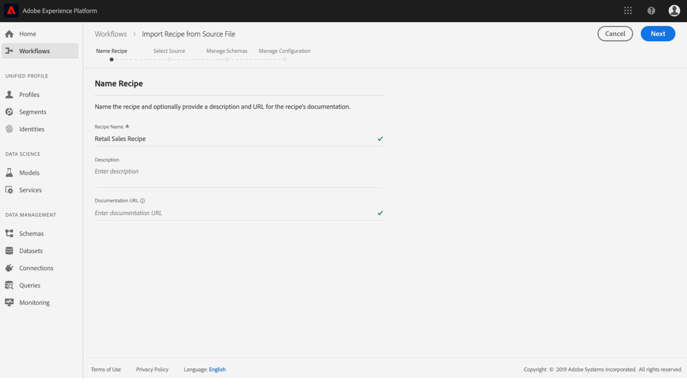

# 소스 파일을 레서피로 패키지화

이 자습서에서는 제공된 소매 판매 샘플 소스 파일을 보관 파일로 패키지하는 방법에 대한 지침을 제공합니다. 이 지침은 UI에서 또는 API를 사용하여 레서피 가져오기 워크플로우를 수행하여 Adobe Experience Platform 데이터 과학 작업 공간에서 레서피를 만드는 데 사용할 수 있습니다.

이해할 개념:

- **레서피**:레서피는 Adobe의 모델 사양 용어로, 특정 머신 러닝, 인공 지능 알고리즘 또는 알고리즘의 조합, 처리 로직 및 구성을 나타내는 최상위 컨테이너로, 숙련된 모델을 만들고 실행하는 데 필요한 구성 및 특정 비즈니스 문제를 해결하는 데 도움이 됩니다.
- **소스 파일**:레서피에 대한 논리가 포함된 프로젝트의 개별 파일

## 전제 조건

- [도커](https://docs.docker.com/install/#supported-platforms)
- [Python 3 및 pip](https://docs.conda.io/en/latest/miniconda.html)
- [Scala](https://www.scala-sbt.org/download.html?_ga=2.42231906.690987621.1558478883-2004067584.1558478883)
- [Maven](https://maven.apache.org/install.html)

## 레서피 제작

레서피 생성은 소스 파일을 패키징하여 아카이브 파일을 작성하는 것부터 시작합니다. 소스 파일은 특정 문제를 해결하는 데 사용되는 머신 러닝 로직과 알고리즘을 정의하며 Python, R, PySpark 또는 Scala Spark로 작성됩니다. 소스 파일이 작성되는 언어에 따라 작성된 아카이브 파일은 Docker 이미지 또는 바이너리 파일이 됩니다. 작성된 아카이브 파일을 데이터 과학 작업 영역으로 가져와 UI [에서 또는 API를](./import-packaged-recipe-ui.md) [사용하여 레서피를 만듭니다](./import-packaged-recipe-api.md).

### Docker 기반의 모델 제작

개발자는 Docker 이미지를 사용하여 라이브러리 및 기타 종속성 등 필요한 모든 부분으로 애플리케이션을 패키지하여 하나의 패키지로 전달할 수 있습니다.

레서피 만들기 작업 과정 동안 제공된 자격 증명을 사용하여 빌드된 Docker 이미지가 Azure 컨테이너 레지스트리에 푸시됩니다.

>[!NOTE] Python, R 및 **Tensorflow로**&#x200B;작성된 소스 **파일만** Azure **컨테이너 레지스트리** 자격 증명이 필요합니다.

Azure Container Registry 자격 증명을 받으려면 Adobe Experience <a href="https://platform.adobe.com" target="_blank">Platform에 로그인하십시오</a>. 왼쪽 탐색 열에서 워크플로우로 **이동합니다**. 소스 **파일에서 레서피 가져오기를 선택하고**&#x200B;새 **가져오기** 절차를 시작합니다. 자세한 내용은 아래 스크린샷을 참조하십시오.


적절한 **레서피 이름**(예: &quot;소매 영업 레서피&quot;를 제공하고 선택적으로 설명 또는 설명서 URL을 제공합니다. 완료되면 [다음]을 **클릭합니다**.



적절한 **런타임을**&#x200B;선택한 다음 **유형에 대한** 분류를 **선택합니다**. Azure 컨테이너 레지스트리 자격 증명이 생성됩니다.


Docker 호스트, 사용자 **이름**&#x200B;및 **암호에 대한**&#x200B;값을 **메모해 둡니다**. 나중에 Docker 이미지를 만들고 푸시하는 데 사용됩니다.

푸시되면 사용자와 다른 사용자는 URL을 통해 이미지에 액세스할 수 있습니다. 소스 **파일** 필드에는 이 URL이 입력으로 표시됩니다.

### 이진 기반 모델 작성

Scala 또는 PySpark로 작성된 소스 파일의 경우 이진 파일이 생성됩니다. 제공된 빌드 스크립트를 실행하는 것만큼 간단하게 이진 파일을 작성할 수 있습니다.
>[!NOTE] ScalaSpark 또는 PySpark로 작성된 소스 파일만 빌드 스크립트를 실행하면 바이너리 파일이 생성됩니다.

### 소스 파일 패키지

Experience Platform 데이터 과학 작업 공간 참조 <a href="https://github.com/adobe/experience-platform-dsw-reference" target="_blank">보관소에 있는 샘플 코드베이스를</a> 입수하여 시작합니다. 샘플 소스 파일이 작성되는 프로그래밍 언어에 따라 각 아카이브 파일을 작성하는 절차는 다릅니다.

- [Python Docker 이미지 만들기](#build-python-docker-image)
- [R Docker 이미지 작성](#build-r-docker-image)
- [PySpark 바이너리 제작](#build-pyspark-binaries)
- [Scala 이진 파일 작성](#build-scala-binaries)

#### Python Docker 이미지 만들기

이렇게 하지 않은 경우 다음 명령을 사용하여 github 저장소를 로컬 시스템에 복제합니다.

```shell
git clone https://github.com/adobe/experience-platform-dsw-reference.git
```

Navigate to the directory `experience-platform-dsw-reference/recipes/python/retail`. 여기에서 스크립트를 `login.sh` 찾아 Docker에 로그인하고 Python Docker 이미지를 만드는 데 사용할 `build.sh` 수 있습니다. Docker 자격 [증명을](#docker-based-model-authoring) 준비했다면 다음 명령을 순서대로 입력하십시오.

```BASH
# for logging in to Docker
./login.sh
 
# for building Docker image
./build.sh
```

로그인 스크립트를 실행할 때 Docker 호스트, 사용자 이름 및 암호를 제공해야 합니다. 빌드 시 Docker 호스트 및 빌드에 대한 버전 태그를 제공해야 합니다.

빌드 스크립트가 완료되면 콘솔 출력에 Docker 소스 파일 URL이 제공됩니다. 이 특정 예에서는 다음과 같이 표시됩니다.

```BASH
# URL format: 
{DOCKER_HOST}/ml-retailsales-python:{VERSION_TAG}
```

이 URL을 복사하고 [다음 단계로](#next-steps)이동합니다.

#### R Docker 이미지 작성

이렇게 하지 않은 경우 다음 명령을 사용하여 github 저장소를 로컬 시스템에 복제합니다.

```BASH
git clone https://github.com/adobe/experience-platform-dsw-reference.git
```

복제된 저장소 `experience-platform-dsw-reference/recipes/R/Retail - GradientBoosting` 내의 디렉토리로 이동합니다. 여기에서 Docker에 로그인하고 R Docker 이미지를 작성하는 데 사용할 파일을 `login.sh` 찾을 `build.sh` 수 있습니다. Docker 자격 [증명을](#docker-based-model-authoring) 준비했다면 다음 명령을 순서대로 입력하십시오.

```BASH
# for logging in to Docker
./login.sh
 
# for build Docker image
./build.sh
```

로그인 스크립트를 실행할 때 Docker 호스트, 사용자 이름 및 암호를 제공해야 합니다. 빌드 시 Docker 호스트 및 빌드에 대한 버전 태그를 제공해야 합니다.

빌드 스크립트가 완료되면 콘솔 출력에 Docker 소스 파일 URL이 제공됩니다. 이 특정 예에서는 다음과 같이 표시됩니다.

```BASH
# URL format: 
{DOCKER_HOST}/ml-retail-r:{VERSION_TAG}
```

이 URL을 복사하고 [다음 단계로](#next-steps)이동합니다.

#### PySpark 바이너리 제작

이렇게 하지 않은 경우 다음 명령을 사용하여 github 저장소를 로컬 시스템에 복제합니다.

```BASH
git clone https://github.com/adobe/experience-platform-dsw-reference.git
```

로컬 시스템에서 복제된 보관소로 이동하여 다음 명령을 실행하여 PySpark 레서피를 가져오는 데 필요한 `.egg` 파일을 작성합니다.

```BASH
cd recipes/pyspark
./build.sh
```

이 `.egg` 파일은 `dist` 폴더에 생성됩니다.

이제 [다음 단계로](#next-steps)이동할 수 있습니다.

#### Scala 이진 파일 작성

아직 수행하지 않은 경우 다음 명령을 실행하여 Github 저장소를 로컬 시스템으로 복제합니다.

```BASH
git clone https://github.com/adobe/experience-platform-dsw-reference.git
```

Scala 레서피를 가져오는 데 사용되는 `.jar` 객체를 만들려면 복제된 저장소로 이동하여 아래 단계를 수행합니다.

```BASH
cd recipes/scala/
./build.sh
```

종속성이 있는 생성된 `.jar` 아티팩트가 `/target` 디렉토리에 있습니다.

이제 [다음 단계로](#next-steps)이동할 수 있습니다.

## 다음 단계

이 자습서에서는 소스 파일을 Recipe로 패키징, Recipe를 Data Science Workspace로 가져오기 위한 필수 단계인 Recipe로 변경했습니다. 이제 Azure 컨테이너 레지스트리에 해당 이미지 URL 또는 파일 시스템에 로컬로 저장된 이진 파일과 함께 Docker 이미지가 있어야 합니다. 이제 패키징된 레서피를 데이터 과학 작업 **영역으로 가져오기에 대한 자습서를 시작할 준비가 되었습니다**. 시작하려면 아래 자습서 링크 중 하나를 선택하십시오.

- [UI에서 패키지된 레서피 가져오기](./import-packaged-recipe-ui.md)
- [API를 사용하여 패키지된 레서피 가져오기](./import-packaged-recipe-api.md)