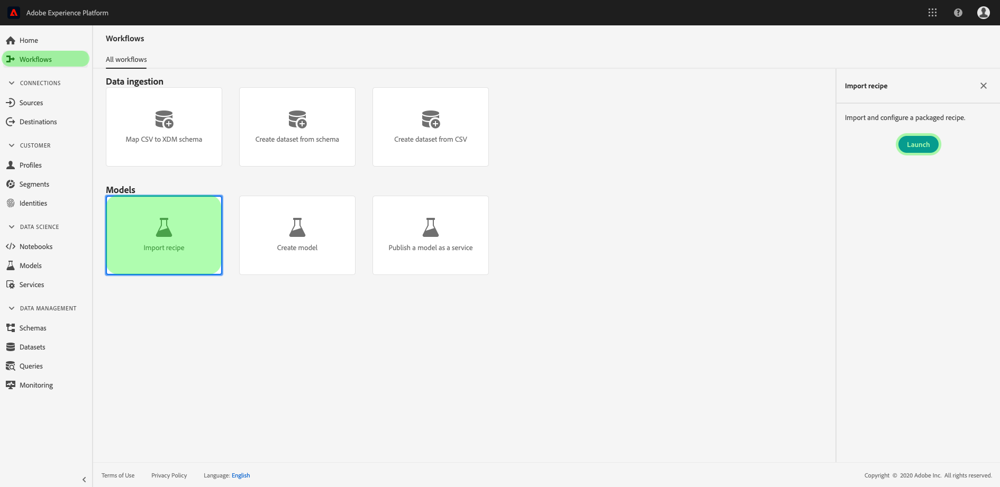

# 소스 파일을 레서피로 패키지

이 자습서에서는 제공된 소매 판매 샘플 소스 파일을 아카이브 파일로 패키지하는 방법에 대한 지침을 제공합니다. 이 지침은 레서피 가져오기 작업 과정을 UI나 API를 사용하여 Adobe Experience Platform에서 레서피 [!DNL Data Science Workspace] 를 만드는 데 사용할 수 있습니다.

이해할 개념:

- **레서피**:레시피는 모델 사양에 대한 Adobe의 용어로, 특정 기계 학습, 인공 지능 알고리즘 또는 숙련된 모델을 만들고 실행하는 데 필요한 알고리즘, 처리 논리 및 구성 조합을 나타내는 최상위 컨테이너로, 특정 비즈니스 문제를 해결하는 데 도움이 됩니다.
- **소스 파일**:레서피 논리를 포함하는 프로젝트의 개별 파일

## 전제 조건

- [[!DNL Docker]](https://docs.docker.com/install/#supported-platforms)
- [[!DNL Python 3 and pip]](https://docs.conda.io/en/latest/miniconda.html)
- [[!DNL Scala]](https://www.scala-sbt.org/download.html?_ga=2.42231906.690987621.1558478883-2004067584.1558478883)
- [[!DNL Maven]](https://maven.apache.org/install.html)

## 레서피 제작

레서피 생성은 소스 파일을 패키징하여 아카이브 파일을 작성하는 것부터 시작합니다. 소스 파일은 특정 문제를 해결하는 데 사용되는 기계 학습 논리 및 알고리즘을 정의하며, R, PySpark 또는 Scala로 [!DNL Python]작성됩니다. 작성된 아카이브 파일은 Docker 이미지 형식을 취합니다. 일단 빌드되면 패키지된 아카이브 파일을 로 가져와 UI [!DNL Data Science Workspace][에서 레서피](./import-packaged-recipe-ui.md) 를 생성하거나 API를 [사용합니다](./import-packaged-recipe-api.md).

### Docker 기반의 모델 저작 {#docker-based-model-authoring}

개발자는 Docker 이미지를 사용하여 라이브러리 및 기타 종속성 등 필요한 모든 부분으로 애플리케이션을 패키지하여 하나의 패키지로 전달할 수 있습니다.

레서피 만들기 작업 과정 중에 제공된 자격 증명을 사용하여 빌드된 Docker 이미지가 Azure 컨테이너 레지스트리로 푸시됩니다.

Azure 컨테이너 레지스트리 자격 증명을 받으려면 [Adobe Experience Platform에 로그인합니다](https://platform.adobe.com). 왼쪽 탐색 열에서 워크플로우로 **[!UICONTROL 이동합니다]**. 레서피 **[!UICONTROL 가져오기]** 후 론치를 **[!UICONTROL 선택합니다]**. 자세한 내용은 아래 스크린샷을 참조하십시오.



구성 **[!UICONTROL 페이지가]** 열립니다. 적절한 **[!UICONTROL 레서피 이름]**(예: &quot;소매 영업 레서피&quot;)을 제공하고 선택적으로 설명 또는 설명서 URL을 제공합니다. 완료되면 [다음]을 **[!UICONTROL 클릭합니다]**.


적절한 *런타임*&#x200B;을 선택한 다음 **[!UICONTROL 유형에]** 대한 *분류를*&#x200B;선택합니다. Azure 컨테이너 레지스트리 자격 증명이 완료되면 생성됩니다.

>[!NOTE]
>
>*유형은* 레서피가 설계된 기계 학습 문제의 클래스로, 교육 실행 평가를 위한 교육 후에 사용됩니다.

>[!TIP]
>
>- 레시피 [!DNL Python] 의 경우 Python **[!UICONTROL 런타임을]** 선택합니다.
>- R 레서피의 경우 **[!UICONTROL R 런타임을]** 선택합니다.
>- PySpark 레서피의 경우 **[!UICONTROL PySpark 런타임을]** 선택합니다. 객체 유형이 자동으로 채워집니다.
>- Scala 레시피의 경우 **[!UICONTROL Spark]** 런타임을 선택합니다. 객체 유형이 자동으로 채워집니다.


Docker 호스트, 사용자 이름 및 암호에 대한 값을 확인합니다. 이러한 이미지는 아래 나와 있는 워크플로우에서 [!DNL Docker] 이미지를 만들고 푸시하는 데 사용됩니다.

>[!NOTE]
>
>소스 URL은 아래 설명된 단계를 완료한 후 제공됩니다. 구성 파일은 [다음 단계에 있는 다음 자습서에서 설명합니다](#next-steps).

### 소스 파일 패키지

먼저 <a href="https://github.com/adobe/experience-platform-dsw-reference" target="_blank">Experience Platform 데이터 과학 작업 공간 참조 보관소에 있는 샘플 코드 베이스를</a> 입수합니다.

- [Python Docker 이미지 제작](#python-docker)
- [R Docker 이미지 제작](#r-docker)
- [PySpark Docker 이미지 제작](#pyspark-docker)
- [Build Scala (Spark) Docker 이미지](#scala-docker)

### 문서 작성 [!DNL Python] 이미지 {#python-docker}

그렇지 않은 경우 다음 명령을 사용하여 로컬 시스템에 [!DNL GitHub] 저장소를 복제합니다.

```shell
git clone https://github.com/adobe/experience-platform-dsw-reference.git
```

Navigate to the directory `experience-platform-dsw-reference/recipes/python/retail`. 여기에서 스크립트 `login.sh` 를 찾아 Docker에 `build.sh` 로그인하고 [!DNL Python Docker] 이미지를 만드는 데 사용됩니다. Docker 자격 증명을 [사용할](#docker-based-model-authoring) 준비가 되었으면 다음 명령을 순서대로 입력합니다.

```BASH
# for logging in to Docker
./login.sh
 
# for building Docker image
./build.sh
```

로그인 스크립트를 실행할 때는 Docker 호스트, 사용자 이름 및 암호를 제공해야 합니다. 빌드할 때 빌드에 대한 Docker 호스트 및 버전 태그를 제공해야 합니다.

빌드 스크립트가 완료되면 콘솔 출력에서 Docker 소스 파일 URL이 제공됩니다. 이 특정 예에서는 다음과 같이 표시됩니다.

```BASH
# URL format: 
{DOCKER_HOST}/ml-retailsales-python:{VERSION_TAG}
```

이 URL을 복사하고 [다음 단계로 이동합니다](#next-steps).

### 빌드 R [!DNL Docker] 이미지 {#r-docker}

그렇지 않은 경우 다음 명령을 사용하여 로컬 시스템에 [!DNL GitHub] 저장소를 복제합니다.

```BASH
git clone https://github.com/adobe/experience-platform-dsw-reference.git
```

복제된 저장소 `experience-platform-dsw-reference/recipes/R/Retail - GradientBoosting` 내의 디렉토리로 이동합니다. 여기에서 Docker에 로그인하고 R Docker 이미지를 만드는 데 사용할 파일 `login.sh` 과 파일 `build.sh` 을 찾을 수 있습니다. Docker 자격 증명을 [사용할](#docker-based-model-authoring) 준비가 되었으면 다음 명령을 순서대로 입력합니다.

```BASH
# for logging in to Docker
./login.sh
 
# for build Docker image
./build.sh
```

로그인 스크립트를 실행할 때는 Docker 호스트, 사용자 이름 및 암호를 제공해야 합니다. 빌드할 때 빌드에 대한 Docker 호스트 및 버전 태그를 제공해야 합니다.

빌드 스크립트가 완료되면 콘솔 출력에서 Docker 소스 파일 URL이 제공됩니다. 이 특정 예에서는 다음과 같이 표시됩니다.

```BASH
# URL format: 
{DOCKER_HOST}/ml-retail-r:{VERSION_TAG}
```

이 URL을 복사하고 [다음 단계로 이동합니다](#next-steps).

### PySpark Docker 이미지 제작 {#pyspark-docker}

다음 명령을 사용하여 로컬 시스템에 [!DNL GitHub] 저장소를 복제하여 시작합니다.

```shell
git clone https://github.com/adobe/experience-platform-dsw-reference.git
```

Navigate to the directory `experience-platform-dsw-reference/recipes/pyspark/retail`. 스크립트 `login.sh` 와 `build.sh` 는 여기에 있으며 Docker에 로그인하고 Docker 이미지를 만드는 데 사용됩니다. Docker 자격 증명을 [사용할](#docker-based-model-authoring) 준비가 되었으면 다음 명령을 순서대로 입력합니다.

```BASH
# for logging in to Docker
./login.sh
 
# for building Docker image
./build.sh
```

로그인 스크립트를 실행할 때는 Docker 호스트, 사용자 이름 및 암호를 제공해야 합니다. 빌드할 때 빌드에 대한 Docker 호스트 및 버전 태그를 제공해야 합니다.

빌드 스크립트가 완료되면 콘솔 출력에서 Docker 소스 파일 URL이 제공됩니다. 이 특정 예에서는 다음과 같이 표시됩니다.

```BASH
# URL format: 
{DOCKER_HOST}/ml-retailsales-pyspark:{VERSION_TAG}
```

이 URL을 복사하고 [다음 단계로 이동합니다](#next-steps).

### Scala Docker 이미지 만들기 {#scala-docker}

터미널에서 다음 명령을 사용하여 로컬 시스템에 [!DNL GitHub] 저장소를 복제하여 시작합니다.

```shell
git clone https://github.com/adobe/experience-platform-dsw-reference.git
```

그런 다음 스크립트와 스크립트를 `experience-platform-dsw-reference/recipes/scala` 찾을 수 있는 디렉토리로 `login.sh` 이동합니다 `build.sh`. 이러한 스크립트는 Docker에 로그인하고 Docker 이미지를 만드는 데 사용됩니다. Docker 자격 [증명을](#docker-based-model-authoring) 준비했다면 터미널에 다음 명령을 입력합니다.

```BASH
# for logging in to Docker
./login.sh
 
# for building Docker image
./build.sh
```

>[!TIP]
>
>스크립트를 사용하여 Docker에 로그인하려고 할 때 권한 오류가 발생하는 경우 `login.sh` 명령을 사용해 보십시오 `bash login.sh`.

로그인 스크립트를 실행할 때 Docker 호스트, 사용자 이름 및 암호를 제공해야 합니다. 빌드할 때 빌드에 대한 Docker 호스트 및 버전 태그를 제공해야 합니다.

빌드 스크립트가 완료되면 콘솔 출력에서 Docker 소스 파일 URL이 제공됩니다. 이 특정 예에서는 다음과 같이 표시됩니다.

```BASH
# URL format: 
{DOCKER_HOST}/ml-retailsales-spark:{VERSION_TAG}
```

이 URL을 복사하고 [다음 단계로 이동합니다](#next-steps).

## 다음 단계 {#next-steps}

이 자습서에서는 소스 파일을 레서피로 가져오기 위한 사전 요구 단계인 레서피로 패키징했습니다 [!DNL Data Science Workspace]. 이제 Azure 컨테이너 레지스트리에서 해당 이미지 URL과 함께 Docker 이미지가 있어야 합니다. 이제 패키지된 레시피를 로 가져오는 방법에 대한 자습서를 시작할 준비가 되었습니다 [!DNL Data Science Workspace]. 시작하려면 아래 자습서 링크 중 하나를 선택하십시오.

- [UI에서 패키지된 레서피 가져오기](./import-packaged-recipe-ui.md)
- [API를 사용하여 패키지된 레서피 가져오기](./import-packaged-recipe-api.md)