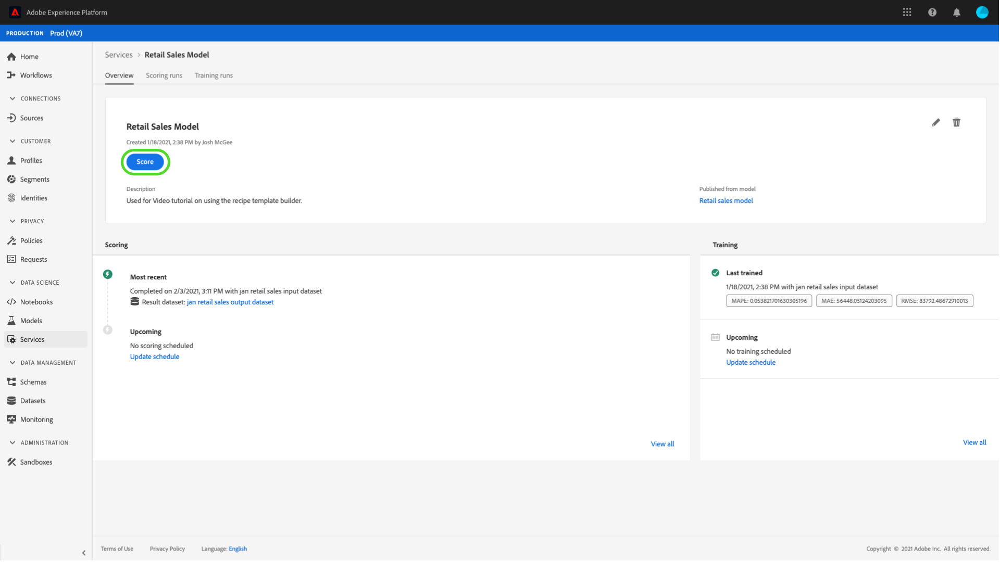

# 데이터 과학 작업 공간 UI에서 서비스로 모델 게시

Adobe Experience Platform Data Science Workspace를 사용하면 교육 및 평가 모델을 서비스로 게시하여 IMS 조직 내의 사용자가 모델을 직접 작성하지 않고도 데이터를 기록할 수 있습니다.

## 시작하기

이 자습서를 완료하려면 [!DNL Experience Platform]에 대한 액세스 권한이 있어야 합니다. [!DNL Experience Platform]에서 IMS 조직에 액세스할 수 없는 경우 계속하기 전에 시스템 관리자에게 문의하십시오.

이 자습서에서는 성공적인 트레이닝 실행을 가진 기존 모델이 필요합니다. 게시 가능한 모델이 없는 경우 계속하기 전에 [UI](./train-evaluate-model-ui.md) 튜토리얼에서 모델 트레이닝을 수행하고 평가하십시오.

Sensei 기계 학습 API를 사용하여 모델을 게시하려면 [API 자습서](./publish-model-service-api.md)를 참조하십시오.

## 모델 {#publish-a-model} 게시

Adobe Experience Platform에서 왼쪽 탐색 열에 있는 **[!UICONTROL Models]**&#x200B;을 선택한 다음 **[!UICONTROL Browse]** 탭을 선택하여 모든 기존 모델을 나열합니다. 서비스로 게시할 모델의 이름을 선택합니다.

모델 개요 페이지의 오른쪽 상단에 있는 **[!UICONTROL Publish]**&#x200B;을 선택하여 서비스 생성 프로세스를 시작합니다.

원하는 서비스 이름을 입력하고 선택적으로 서비스 설명을 입력하고 완료되면 **[!UICONTROL Next]**&#x200B;을 선택합니다.

모델에 대한 모든 성공적인 교육 실행이 나열됩니다. 새 서비스는 선택한 교육 실행의 교육 및 채점 구성을 상속합니다.

**[!UICONTROL Finish]**&#x200B;을 선택하여 서비스를 만들고 **[!UICONTROL Service Gallery]**&#x200B;로 리디렉션하여 새로 만든 서비스를 포함하여 사용 가능한 모든 서비스를 표시합니다.

## 서비스 {#access-a-service}를 사용한 점수

Adobe Experience Platform에서 왼쪽 탐색 열에 있는 **[!UICONTROL Services]** 탭을 선택하여 **[!UICONTROL Service Gallery]**&#x200B;에 액세스합니다. 사용할 서비스를 찾고 **[!UICONTROL Open]**&#x200B;을 선택합니다.

서비스 개요 페이지에서 **[!UICONTROL Score]**&#x200B;을 선택합니다.

점수 실행을 위한 적절한 입력 데이터 세트를 선택한 다음 **[!UICONTROL Next]**&#x200B;을 선택합니다. 점수 데이터 세트에 대해 동일한 단계를 수행해야 합니다. 입력 및 출력 데이터 세트를 선택하고 나면 구성을 업데이트할 수 있습니다.

서비스가 생성되면 기본 점수 지정 구성이 상속됩니다. 값을 두 번 클릭하여 이러한 구성을 검토하고 필요에 따라 조정할 수 있습니다. 구성이 만족스러우면 **[!UICONTROL Finish]**&#x200B;을 선택하여 점수부여 실행을 시작합니다.

서비스의 **개요** 페이지에서 새 채점 작업과 진행 상태에 대한 세부 정보가 표시됩니다. 작업이 완료되면 **[!UICONTROL Scoring]** 컨테이너 내의 **[!UICONTROL Most Recent]** 헤더가 업데이트됩니다.

## 다음 단계 {#next-steps}

이 튜토리얼을 따라 액세스 가능한 서비스로 모델을 게시하고 [!UICONTROL Service Gallery]을 통해 새 서비스를 사용하여 데이터를 집계했습니다. 서비스](./schedule-models-ui.md)에서 자동 트레이닝 및 점수 지정 실행을 [예약할 수 있는 방법에 대해 알아보려면 다음 자습서를 계속 참조하십시오.
