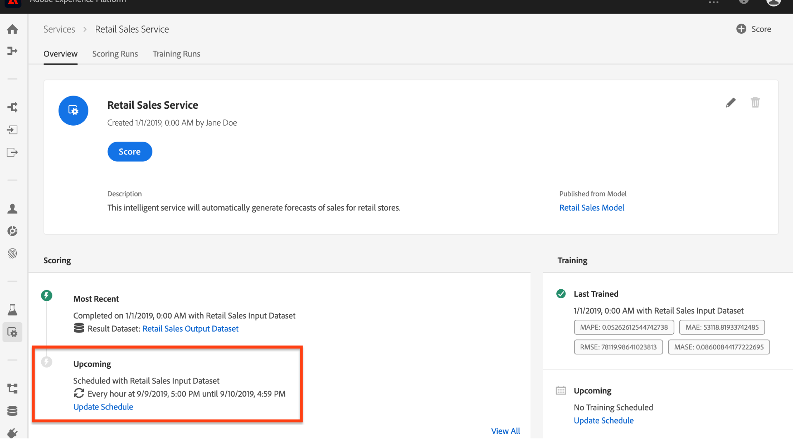

# 모델 예약(UI)

Adobe Experience Platform [!DNL Data Science Workspace] 는 기계 학습 서비스에서 예약된 점수 지정 및 교육 실행을 설정할 수 있도록 해줍니다. 트레이닝 및 점수 지정 프로세스를 자동화하면 데이터 내의 패턴을 유지하여 시간의 경과에 따라 서비스의 효율성을 유지 관리하고 개선하는 데 도움이 됩니다.

이 자습서는 서비스 갤러리를 통해 기존 서비스에 대한 교육 및 점수 지정 일정을 구성하는 단계를 **[!UICONTROL 단계별로 안내합니다]**. 다음과 같은 주 섹션으로 구분됩니다.

- [예약된 점수 구성](#configure-scheduled-scoring)
- [예약된 교육 구성](#configure-scheduled-training)

## 시작하기

이 자습서를 완료하려면 액세스 권한이 있어야 합니다 [!DNL Experience Platform]. 에서 IMS 조직에 액세스할 수 없는 경우 시스템 관리자 [!DNL Experience Platform]에게 연락하여 진행하십시오.

이 자습서에는 기존 서비스가 필요합니다. 액세스 가능한 서비스가 함께 작동하지 않는 경우, UI [자습서에서 서비스로 모델](./publish-model-service-ui.md) 게시 를 따라 만들 수 있습니다.

## 예약된 점수 구성 {#configure-scheduled-scoring}

모델 점수 지정 기능은 일정에 따라 자동화된 프로세스로 구성할 수 있습니다. 서비스가 생성되면 아래 절차에 따라 점수 지정 일정을 구성하고 적용할 수 있습니다.

1. Adobe Experience Platform에서 왼쪽 탐색 열에 있는 **[!UICONTROL 서비스]** 탭을 클릭하여 에 액세스합니다 *[!DNL Service Gallery]*. 점수 지정 실행을 예약하려는 서비스를 찾고 **[!UICONTROL 열기를]** 클릭하여 *개요* 페이지를확인합니다.
   

2. 개요 페이지에는 서비스의 점수 정보가 표시됩니다. 점수 지정 **[!UICONTROL 일정을]** 구성하려면 예약 업데이트 링크를 클릭합니다.
   

3. 점수 지정 일정에 대한 빈도, 시작 날짜, 종료 날짜, 입력 데이터 세트 및 출력 데이터 세트를 구성합니다. 구성에 만족하면 **[!UICONTROL 만들기를]** 클릭하여 서비스의 점수 지정 일정을 업데이트합니다.
   

4. 업데이트된 점수 지정 일정은 서비스의 *개요* 페이지에 표시됩니다.
   

## 예약된 교육 구성 {#configure-scheduled-training}

서비스에 대해 예약된 교육 실행을 구성하면 기계 학습 모델이 최신 데이터 패턴으로 업데이트됩니다. 예정된 트레이닝 실행이 완료될 때마다, 다음 예정된 트레이닝이 실행될 때까지 서비스 전원을 공급받는 데 지정된 모델이 사용됩니다.

서비스가 만들어지면 아래 절차에 따라 교육 일정을 구성하고 적용할 수 있습니다.

1. Adobe Experience Platform에서 왼쪽 탐색 열에 있는 **[!UICONTROL 서비스]** 탭을 클릭하여 **[!UICONTROL 서비스 갤러리에 액세스합니다]**. 교육 실행을 예약할 서비스를 찾고 **[!UICONTROL 열기를]** 클릭하여 *개요* 페이지를확인합니다.
   

2. 개요 페이지에는 서비스의 교육 정보가 표시됩니다. [예약 **[!UICONTROL 업데이트]** ] 링크를 클릭하여 교육 일정을 구성합니다.
   

3. 교육 일정에 사용되는 빈도, 시작 날짜, 종료 날짜 및 입력 데이터 세트를 구성합니다. 구성에 만족하면 **[!UICONTROL 만들기를]** 클릭하여 서비스의 교육 일정을 업데이트합니다.
   

4. 업데이트된 교육 일정은 서비스의 *개요* 페이지에 나와 있습니다.
   

## 다음 단계

이 튜토리얼을 따라 서비스의 자동 교육 및 점수 지정 작업을 성공적으로 예약하고 자습서 UI 작업 과정을 [!DNL Data Science Workspace] 완료했습니다. 아직 [시작하지 않은 경우 튜토리얼을](./create-retails-sales-dataset.md) 다시 시작하고 API 워크플로우에 따라 모델을 생성, 교육, 점수 및 퍼블리싱할 수 있습니다.
