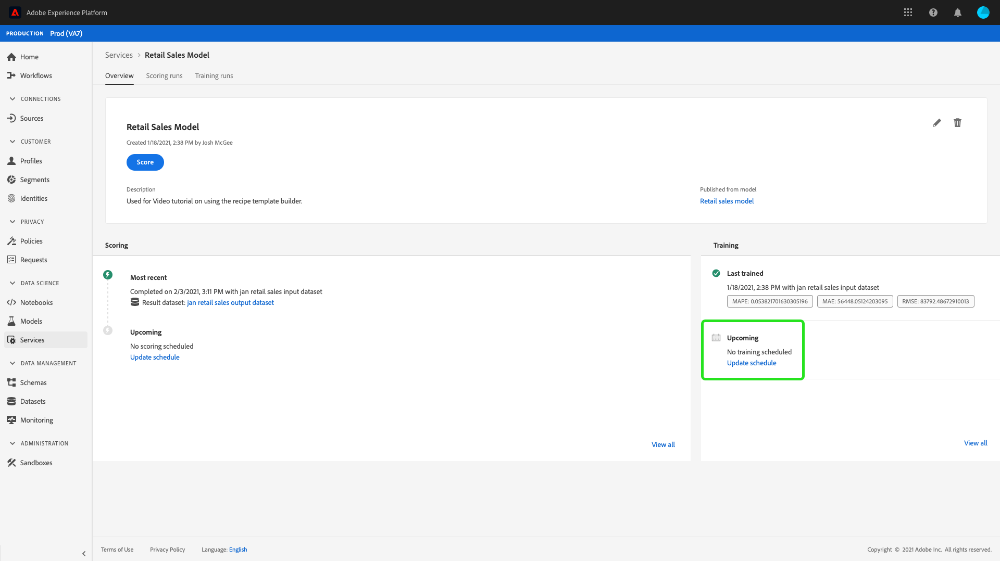

# Data Science Workspace UI에서 모델 예약

Adobe Experience Platform [!DNL Data Science Workspace] 기계 학습 서비스에서 예약된 점수 및 교육 실행을 설정할 수 있습니다. 교육 및 점수 책정 프로세스를 자동화하면 데이터 내의 패턴을 유지하여 시간 경과에 따른 서비스 효율성을 유지 관리하고 향상시키는 데 도움이 됩니다.

이 자습서에서는 다음을 통해 기존 서비스에 대한 교육 및 점수 책정 일정을 구성하는 단계를 안내합니다. [!UICONTROL 서비스 갤러리]. 이 목록은 다음 주요 섹션으로 분류됩니다.

- [예약된 점수 구성](#configure-scheduled-scoring)
- [예약된 교육 구성](#configure-scheduled-training)

## 시작하기

이 자습서를 완료하려면 [!DNL Experience Platform]. 의 조직에 액세스할 수 없는 경우 [!DNL Experience Platform]을(를) 계속하기 전에 시스템 관리자에게 문의하십시오.

이 자습서에는 기존 서비스가 필요합니다. 사용할 수 있는 액세스 가능한 서비스가 없는 경우에 대한 자습서에 따라 서비스를 만들 수 있습니다 [모델을 서비스로 게시](./publish-model-service-ui.md).

## 예약된 점수 구성 {#configure-scheduled-scoring}

모델 점수는 예약된 기준으로 자동화된 프로세스로 구성할 수 있습니다. 서비스를 만들고 나면 아래 단계에 따라 점수 책정 일정을 구성하고 적용할 수 있습니다.

Adobe Experience Platform에서 **[!UICONTROL 서비스]** 왼쪽 탐색 열에 있는 탭을 사용하여 **[!DNL Service Gallery]**. 점수부여 실행을 예약하려는 서비스를 찾아 선택합니다 **[!UICONTROL 열기]** 보기 **[!UICONTROL 개요]** 페이지.

개요 페이지에는 서비스의 점수 정보가 표시됩니다. 을(를) 선택합니다 **[!UICONTROL 예약 업데이트]** 링크 를 사용하여 점수 책정 일정을 구성합니다.

점수 책정 스케줄에 대한 빈도, 시작 날짜, 종료 날짜, 입력 데이터 세트 및 출력 데이터 세트를 구성합니다. 구성에 만족하면 을 선택합니다 **[!UICONTROL 만들기]** 서비스의 점수 책정 일정을 갱신하려면

업데이트된 점수 책정 일정이 서비스의 **[!UICONTROL 개요]** 페이지.

## 예약된 교육 구성 {#configure-scheduled-training}

서비스에서 예약된 교육 실행을 구성하면 기계 학습 모델이 최신 데이터 패턴으로 업데이트됩니다. 스케줄링된 교육 실행이 완료될 때마다, 다음 스케줄링된 교육이 실행될 때까지 서비스 전원을 공급하는 데 결과 훈련 모델이 사용됩니다.

서비스를 만들고 나면 아래 단계에 따라 교육 일정을 구성하고 적용할 수 있습니다.

Adobe Experience Platform에서 **[!UICONTROL 서비스]** 왼쪽 탐색 열에 있는 탭을 사용하여 **[!UICONTROL 서비스 갤러리]**. 교육 실행을 예약하려는 서비스를 찾아 선택합니다. **[!UICONTROL 열기]** 보기 **[!UICONTROL 개요]** 페이지.

개요 페이지에는 서비스의 교육 정보가 표시됩니다. 을(를) 선택합니다 **[!UICONTROL 예약 업데이트]** 교육 일정을 구성하는 링크를 클릭합니다.

교육 일정에 사용되는 빈도, 시작 날짜, 종료 날짜 및 입력 데이터 세트를 구성합니다. 구성에 만족하면 을 선택합니다 **[!UICONTROL 만들기]** 서비스의 교육 일정을 갱신하려면

업데이트된 교육 일정이 해당 서비스의 **[!UICONTROL 개요]** 페이지.

## 다음 단계

이 자습서를 따라 서비스에서 자동 교육 및 점수 책정 실행을 예약하고 다음을 완료했습니다 [!DNL Data Science Workspace] 자습서 UI 워크플로우입니다. 아직 하지 않았다면 다음 사항을 고려하십시오. [자습서 다시 시작](./create-retails-sales-dataset.md) api 워크플로우에 따라 모델을 생성, 교육, 점수 및 게시합니다.
