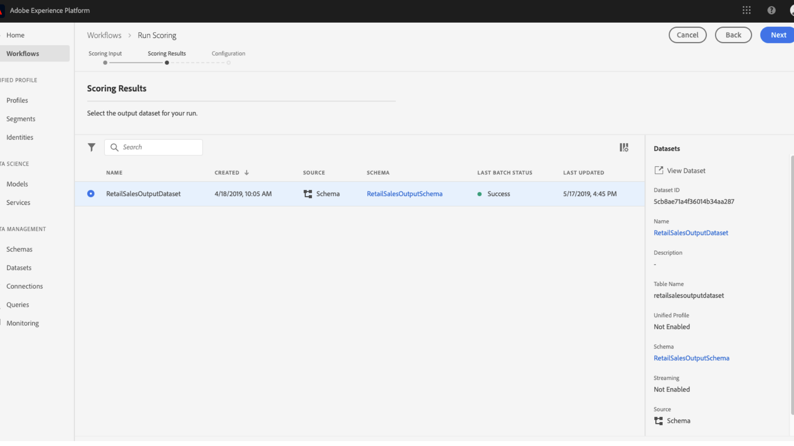

# 데이터 과학 작업 공간 UI에서 모델 점수 책정

Adobe Experience Platform 점수 책정 [!DNL Data Science Workspace] 입력 데이터를 기존 교육된 모델에 공급하여 구현할 수 있습니다. 그러면 점수 결과가 저장되고 지정된 출력 데이터 세트에 새 배치로 표시됩니다.

이 자습서에서는 [!DNL Data Science Workspace] 사용자 인터페이스.

## 시작하기

이 자습서를 완료하려면 [!DNL Experience Platform]. 의 조직에 액세스할 수 없는 경우 [!DNL Experience Platform]을(를) 계속하기 전에 시스템 관리자에게 문의하십시오.

이 자습서에서는 숙련된 모델이 필요합니다. 훈련된 모델이 없는 경우 [UI에서 모델 교육 및 평가](./train-evaluate-model-ui.md) 계속하기 전에 자습서를 참조하십시오.

## 새 점수 실행 만들기

점수부여 실행은 이전에 완료되고 평가된 교육 실행에서 최적화된 구성을 사용하여 만들어집니다. 모델에 대한 최적 구성 집합은 일반적으로 교육 실행 평가 지표를 검토하여 결정됩니다.

점수를 매기는 데 해당 구성을 사용하려면 가장 적합한 교육 실행을 찾으십시오. 그런 다음 이름에 첨부된 하이퍼링크를 선택하여 원하는 교육 실행을 엽니다.

교육 실행 **[!UICONTROL 평가]** 탭, 선택 **[!UICONTROL 점수]** 화면 오른쪽 상단에 있습니다. 새로운 점수 책정 워크플로우가 시작됩니다.

입력 점수 데이터 세트를 선택하고 을 선택합니다 **[!UICONTROL 다음]**.

출력 점수 데이터 세트를 선택합니다. 이것은 점수 결과가 저장되는 전용 출력 데이터 세트입니다. 선택 내용을 확인하고 을(를) 선택합니다 **[!UICONTROL 다음]**.

워크플로우의 마지막 단계에서 점수부여 실행을 구성하라는 메시지가 표시됩니다. 이러한 구성은 점수부여 실행에 대해 모델에서 사용됩니다.
모델을 생성하는 동안 설정된 상속된 매개 변수는 제거할 수 없습니다. 항목을 두 번 클릭하거나 항목 위로 마우스를 가져가면 되돌리기 아이콘을 선택하여 상속되지 않은 매개 변수를 편집하거나 되돌릴 수 있습니다.

점수부여 구성을 검토 및 확인하고 선택합니다. **[!UICONTROL 완료]**  점수부여 실행을 생성하고 실행하려면 당신은 .. **[!UICONTROL 점수 책정 실행]** 탭 및 새 점수부여 실행 **[!UICONTROL 보류 중]** 상태가 표시됩니다.

다음 상태 중 하나로 점수부여 실행을 표시할 수 있습니다.
- 보류 중
- 완료
- 실패
- 실행 중

상태는 자동으로 업데이트됩니다. 상태가 다음과 같은 경우 다음 단계로 진행합니다 **[!UICONTROL 완료]** 또는 **[!UICONTROL 실패]**.

## 점수 결과 보기

점수부여 결과를 보려면 먼저 훈련 실행을 선택합니다.

교육 실행으로 리디렉션됩니다 **[!UICONTROL 평가]** 페이지. 교육 실행 평가 페이지의 맨 위에서 **[!UICONTROL 점수 책정 실행]** 탭하여 기존 점수부여 실행 목록을 확인합니다.

다음으로, 실행 상세내역을 조회하려면 점수부여 실행을 선택합니다.

선택한 점수부여 실행의 상태가 &quot;완료&quot; 또는 &quot;실패&quot;인 경우 **[!UICONTROL 활동 로그 보기]** 링크를 사용할 수 있습니다. 점수 실행이 실패할 경우 실행 로그는 실패 이유를 확인하는 데 유용한 정보를 제공할 수 있습니다. 실행 로그를 다운로드하려면 다음을 선택합니다 **[!UICONTROL 활동 로그 보기]**.

다음 **[!UICONTROL 활동 로그 보기]** 팝오버가 나타납니다. 연결된 로그를 자동으로 다운로드할 URL을 선택합니다.

또한 을(를) 선택하여 점수 결과를 보는 옵션이 있습니다  **[!UICONTROL 점수 결과 데이터 집합 미리 보기]**.

출력 데이터 세트의 미리 보기가 제공됩니다.

전체 점수부여 결과 세트에 대해 **[!UICONTROL 점수 결과 데이터 세트]** 링크가 오른쪽 열에 있습니다.

## 다음 단계

이 자습서에서는 의 숙련된 모델을 사용하여 데이터를 점수를 매기는 단계를 안내합니다 [!DNL Data Science Workspace]. 다음의 자습서를 따르십시오 [UI에서 모델을 서비스로 게시](./publish-model-service-ui.md) ( 시스템 학습 서비스에 쉽게 액세스할 수 있도록 하여 조직 내 사용자가 데이터를 평가할 수 있도록 해줍니다.)
