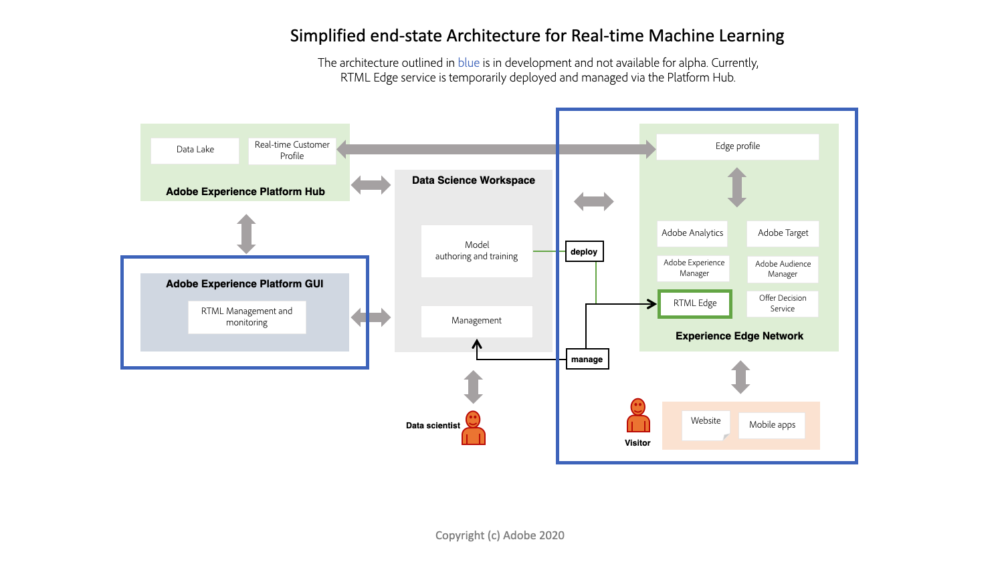

# 실시간 머신 러닝 개요(알파)

>[!IMPORTANT]
>
>아직 모든 사용자가 실시간 기계 학습을 사용할 수 없습니다. 이 기능은 알파 상태이며 아직 테스트되고 있습니다. 이 문서는 변경될 수 있습니다.

실시간 머신 러닝을 통해 최종 사용자에게 디지털 경험 컨텐츠의 관련성을 획기적으로 향상시킬 수 있습니다. 이에 대한 실시간 통찰력과 지속적인 학습을 활용하여 가능한 것입니다 [!DNL Experience Edge].

허브와 Hub 모두에서 끊김 없는 계산의 조합 [!DNL Edge] 적절한 경험과 응답성을 모두 갖춘 고도로 개인화된 경험을 제공하는 데 전통적으로 관련된 지연을 크게 줄입니다. 따라서 실시간 머신 러닝 기능은 동기 의사 결정을 위한 지연 시간이 매우 짧습니다. 이러한 예로는 개인화된 웹 페이지 컨텐츠를 렌더링하거나 오퍼나 할인 표시를 통해 이탈을 줄이고 웹 스토어의 전환을 늘리는 작업이 있습니다.

## 실시간 머신 러닝 아키텍처 {#architecture}

다음 다이어그램은 실시간 머신 러닝 아키텍처에 대한 개요를 제공합니다. 현재 알파 버전에는 보다 간소화된 버전이 있습니다.

## 실시간 기계 학습 워크플로우

다음 워크플로우에서는 실시간 기계 학습 모델을 만들고 활용하는 데 관련된 일반적인 단계 및 결과를 간략하게 설명합니다.

### 데이터 수집 및 준비

데이터를 수집하여 [!DNL Experience Data Model] Adobe Experience Platform의 (XDM). 이 데이터는 모델 교육에 사용됩니다. XDM에 대해 자세히 알아보려면 [XDM 개요](../../xdm/home.md).

### 작성

실시간 머신 러닝 모델을 처음부터 제작하거나 Adobe Experience Platform Jupiter Notebook에서 사전 교육을 받은 ONNX 모델로 가져와 만듭니다.

### 배포

모델 배포 대상 [!DNL Experience Edge] 에서 실시간 기계 학습 서비스를 만들려면 [!UICONTROL 서비스 갤러리] 예측 API 엔드포인트 사용.

### 추론

예측 REST API 엔드포인트를 사용하여 실시간으로 기계 학습 인사이트를 생성합니다.

### 게재

그런 다음 마케터는 Adobe Target을 사용하여 실시간 기계 학습 점수를 경험에 매핑하는 세그먼트와 규칙을 정의할 수 있습니다. 이를 통해 브랜드 웹 사이트 방문자에게 동일한 페이지 또는 다음 하이퍼개인화된 경험을 실시간으로 표시할 수 있습니다.

## 현재 기능

실시간 기계 학습은 현재 알파 상태입니다. 아래 요약된 기능은 더 많은 기능과 노드를 사용할 수 있게 되면 변경될 수 있습니다.

>[!NOTE]
>
> 알파 제한:
> - 현재 ONNX 기반 모델만 지원됩니다.
> - 노드에 사용된 함수를 직렬화할 수 없습니다. 예를 들어, Penders 노드에서 사용되는 람다 함수입니다.
> - 20초간 잠은 후에 있다 [!DNL Edge] 배포는 수동으로 수행됩니다.
> - 심층적인 학습의 경우 `df.values` 이 호출되면 DL 모델에서 허용할 수 있는 배열을 반환합니다. 이것은 ONNX 모델 점수 책정 노드에서 `df.values` 및 은(는) 결과를 모델에 대해 점수로 보냅니다.

### 기능:

|  | 알파(5월) |
| --- | --- |
| **기능** | - RTML 노트북 템플릿을 사용하여 사용자 정의 기계 학습 모델을 작성, 테스트 및 배포할 수 있습니다.   - 미리 훈련된 기계 학습 모델 가져오기를 지원합니다.   - 실시간 머신 러닝 SDK.   - 작성 노드의 시작 세트입니다.   - Adobe Experience Platform Hub에 배포됩니다. |
| **가용성** | 북미 |
| **작성 노드** | 팬더   - ScikitLearn   - ONNXNode   - 분할   - ModelUpload   - OneHotEncoder |
| **점수 책정 실행 시간** | ONNX |

## 다음 단계

다음을 수행하여 시작할 수 있습니다. [시작하기](./getting-started.md) 안내서. 이 안내서에서는 실시간 머신 러닝 모델을 만드는 데 필요한 모든 사전 요구 사항을 안내합니다.
