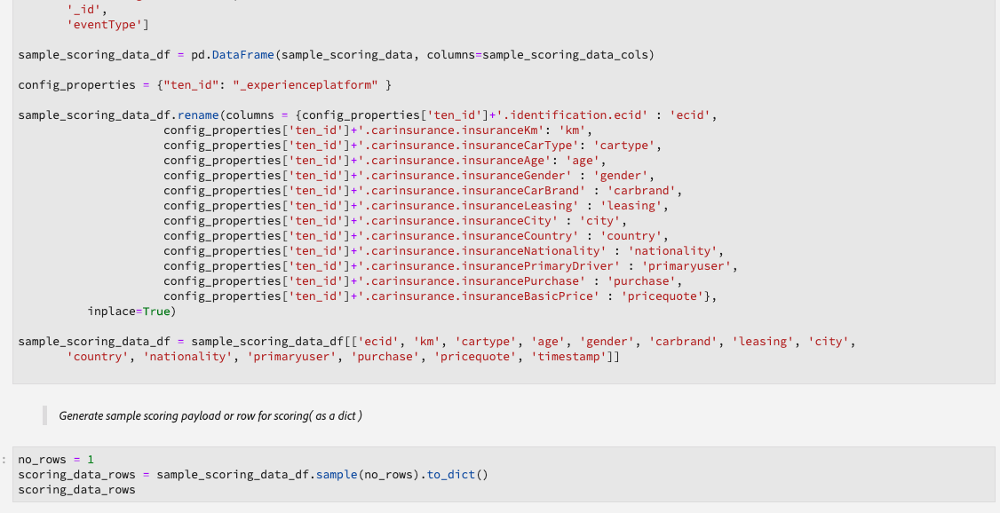

# 실시간 머신 러닝 노트북 관리(알파)

>[!IMPORTANT]
>
>아직 모든 사용자가 실시간 머신 러닝을 사용할 수 있는 것은 아닙니다. 이 기능은 알파에 있으며 아직 테스트 중입니다. 이 문서는 변경될 수 있습니다.

다음 안내서에서는 실시간 머신 러닝 애플리케이션을 빌드하는 데 필요한 단계를 설명합니다. 제공된 Adobe 사용 **[!UICONTROL 실시간 ML]** Python 노트북 템플릿은 모델 교육, DSL 만들기, DSL을 Edge에 게시 및 요청 점수에 대해 다룹니다. 실시간 머신 러닝 모델 구현을 진행하면 데이터 세트의 요구 사항에 맞게 템플릿을 수정할 수 있습니다.

## Real-time Machine Learning 전자 필기장 만들기

Adobe Experience Platform UI에서 **[!UICONTROL 노트북]** 다음 범위 내에서 **데이터 과학**. 그런 다음 을 선택합니다. **[!UICONTROL Jupyterlab]** 을(를) 통해 환경을 로드할 수 있습니다.


다음 [!DNL JupyterLab] 런처가 나타납니다. 아래로 스크롤하여 *실시간 머신 러닝* 및 선택 **[!UICONTROL 실시간 ML]** 전자 필기장. 예제 데이터 세트가 있는 예제 노트북 셀이 포함된 템플릿이 열립니다.


## 노드 가져오기 및 검색

먼저 모델에 필요한 모든 패키지를 가져옵니다. 노드 작성에 사용할 패키지를 가져와야 합니다.

>[!NOTE]
>
>가져오기 목록은 만들려는 모델에 따라 다를 수 있습니다. 시간이 지남에 따라 새 노드가 추가되므로 이 목록이 변경됩니다. 다음을 참조하십시오. [노드 참조 안내서](./node-reference.md) 사용 가능한 노드의 전체 목록입니다.

```python
from pprint import pprint
import pandas as pd
import numpy as np
import json
import uuid
from shutil import copyfile
from pathlib import Path
from datetime import date, datetime, timedelta
from platform_sdk.dataset_reader import DatasetReader

from rtml_nodelibs.nodes.standard.preprocessing.json_to_df import JsonToDataframe
from rtml_sdk.edge.utils import EdgeUtils
from rtml_sdk.graph.utils import GraphBuilder
from rtml_nodelibs.nodes.standard.ml.onnx import ONNXNode
from rtml_nodelibs.core.nodefactory import NodeFactory as nf
from rtml_nodelibs.nodes.standard.preprocessing.pandasnode import Pandas
from rtml_nodelibs.nodes.standard.preprocessing.one_hot_encoder import OneHotEncoder
from rtml_nodelibs.nodes.standard.ml.artifact_utils import ModelUpload
from rtml_nodelibs.core.nodefactory import NodeFactory as nf
from rtml_nodelibs.core.datamsg import DataMsg
```

다음 코드 셀은 사용 가능한 노드 목록을 인쇄합니다.

```python
# Discover Nodes
pprint(nf.discover_nodes())
```


## 실시간 머신 러닝 모델 교육

다음 옵션 중 하나를 사용하여 [!DNL Python] 데이터를 읽고, 전처리하고, 분석하는 코드. 그런 다음 자체 ML 모델을 교육하고 ONNX 형식으로 직렬화한 다음 실시간 머신 러닝 모델 스토어에 업로드해야 합니다.

- [JupyterLab 노트북에서 나만의 모델 교육](#training-your-own-model)
- [사전 교육을 받은 ONNX 모델을 JupyterLab 노트북에 업로드](#pre-trained-model-upload)

### 자체 모델 교육 {#training-your-own-model}

교육 데이터를 로드하여 시작합니다.

>[!NOTE]
>
>다음에서 **실시간 ML** 템플릿, [자동차 보험 CSV 데이터 세트](https://github.com/adobe/experience-platform-dsw-reference/tree/master/datasets/insurance) 이(가)에서 가져옴 [!DNL Github].


Adobe Experience Platform 내에서 데이터 세트를 사용하려면 아래 셀의 주석 처리를 제거하십시오. 다음으로, 다음을 교체해야 합니다. `DATASET_ID` 적절한 값으로.


의 데이터 세트에 액세스하려면 [!DNL JupyterLab] notebook에서 **데이터** 의 왼쪽 탐색 영역에 있는 탭 [!DNL JupyterLab]. 다음 **[!UICONTROL 데이터 세트]** 및 **[!UICONTROL 스키마]** 디렉토리가 나타납니다. 선택 **[!UICONTROL 데이터 세트]** 을(를) 마우스 오른쪽 단추로 클릭하고 **[!UICONTROL Notebook의 데이터 탐색]** 옵션을 선택합니다. 전자 필기장 맨 아래에 실행 가능한 코드 항목이 나타납니다. 이 셀에는 `dataset_id`.


완료되면 마우스 오른쪽 단추를 클릭하고 수첩 하단에 생성한 셀을 삭제합니다.

### 교육 속성

제공된 템플릿을 사용하여 내에서 교육 속성 수정 `config_properties`.

```python
config_properties = {
    "train_records_limit":1000000,
    "n_estimators": "80",
    "max_depth": "5",
    "ten_id": "_experienceplatform"  
}
```

### 모델 준비

사용 **[!UICONTROL 실시간 ML]** 템플릿 - ML 모델을 분석, 사전 처리, 교육 및 평가해야 합니다. 이는 데이터 변환을 적용하고 교육 파이프라인을 구축하여 수행됩니다.

**데이터 변환**

다음 **[!UICONTROL 실시간 ML]** 템플릿 **데이터 변환** 고유한 데이터 세트로 작동하려면 셀을 수정해야 합니다. 일반적으로 열 이름 변경, 데이터 롤업 및 데이터 준비/기능 엔지니어링이 포함됩니다.

>[!NOTE]
>
>다음 예제는 을 사용하여 가독성을 위해 축약되었습니다. `[ ... ]`. 을(를) 보고 확장하십시오. *실시간 ML* 전체 코드 셀에 대한 템플릿 데이터 변환 섹션.

```python
df1.rename(columns = {config_properties['ten_id']+'.identification.ecid': 'ecid',
                     [ ... ]}, inplace=True)
df1 = df1[['ecid', 'km', 'cartype', 'age', 'gender', 'carbrand', 'leasing', 'city', 
       'country', 'nationality', 'primaryuser', 'purchase', 'pricequote', 'timestamp']]
print("df1 shape 1", df1.shape)
#########################################
# Data Rollup
######################################### 
df1['timestamp'] = pd.to_datetime(df1.timestamp)
df1['hour'] = df1['timestamp'].dt.hour.astype(int)
df1['dayofweek'] = df1['timestamp'].dt.dayofweek

df1.loc[(df1['purchase'] == 'yes'), 'purchase'] = 1
df1.purchase.fillna(0, inplace=True)
df1['purchase'] = df1['purchase'].astype(int)

[ ... ]

print("df1 shape 2", df1.shape)

#########################################
# Data Preparation/Feature Engineering
#########################################      

df1['carbrand'] = df1['carbrand'].str.lower()
df1['country'] = df1['country'].str.lower()
df1.loc[(df1['carbrand'] == 'vw'), 'carbrand'] = 'volkswagen'

[ ... ]

df1['age'].fillna(df1['age'].median(), inplace=True)
df1['gender'].fillna('notgiven', inplace=True)

[ ... ]

df1['city'] = df1.groupby('country')['city'].transform(lambda x: x.fillna(x.mode()))
df1.dropna(subset = ['pricequote'], inplace=True)
print("df1 shape 3", df1.shape)
print(df1)

#grouping
grouping_cols = ['carbrand', 'cartype', 'city', 'country']

for col in grouping_cols:
    df_idx = pd.DataFrame(df1[col].value_counts().head(6))

    def grouping(x):
        if x in df_idx.index:
            return x
        else:
            return "Others"
    df1[col] = df1[col].apply(lambda x: grouping(x))

def age(x):
    if x < 20:
        return "u20"
    elif x > 19 and x < 29:
    [ ... ]
    else: 
        return "Others"

df1['age'] = df1['age'].astype(int)
df1['age_bucket'] = df1['age'].apply(lambda x: age(x))

df_final = df1[['hour', 'dayofweek','age_bucket', 'gender', 'city',  
   'country', 'carbrand', 'cartype', 'leasing', 'pricequote', 'purchase']]
print("df final", df_final.shape)

cat_cols = ['age_bucket', 'gender', 'city', 'dayofweek', 'country', 'carbrand', 'cartype', 'leasing']
df_final = pd.get_dummies(df_final, columns = cat_cols)
```

제공된 셀을 실행하여 예제 결과를 확인합니다. 에서 반환된 출력 테이블 `carinsurancedataset.csv` dataset은 정의한 수정 사항을 반환합니다.


**교육 파이프라인**

다음으로 교육 파이프라인을 생성해야 합니다. ONNX 파일을 변환하고 생성해야 하는 경우를 제외하면 다른 교육 파이프라인 파일과 유사합니다.

이전 셀에 정의된 데이터 변환을 사용하여 템플릿을 수정합니다. 아래에 강조 표시된 다음 코드는 기능 파이프라인에서 ONNX 파일을 생성하는 데 사용됩니다. 다음을 확인하십시오. *실시간 ML* 전체 파이프라인 코드 셀에 대한 템플릿입니다.

```python
#for generating onnx
def generate_onnx_resources(self):        
    install_dir = os.path.expanduser('~/my-workspace')
    print("Generating Onnx")
        
    from skl2onnx import convert_sklearn
    from skl2onnx.common.data_types import FloatTensorType
        
    # ONNX-ification
    initial_type = [('float_input', FloatTensorType([None, self.feature_len]))]

    print("Converting Model to Onnx")
    onx = convert_sklearn(self.model, initial_types=initial_type)
             
    with open("model.onnx", "wb") as f:
        f.write(onx.SerializeToString())
            
    print("Model onnx created")
```

교육 파이프라인을 완료하고 데이터 변환을 통해 데이터를 수정했으면 다음 셀을 사용하여 교육을 실행합니다.

```python
model = train(config_properties, df_final)
```

### ONNX 모델 생성 및 업로드

성공적인 교육 실행이 완료되면 ONNX 모델을 생성하고 학습된 모델을 Real-time Machine Learning 모델 저장소에 업로드해야 합니다. 다음 셀을 실행하면 ONNX 모델이 다른 모든 노트북과 함께 왼쪽 레일에 나타납니다.

```python
import os
import skl2onnx, subprocess

model.generate_onnx_resources()
```

>[!NOTE]
>
>변경 `model_path` 문자열 값 (`model.onnx`)을 클릭하여 모델의 이름을 변경합니다.

```python
model_path = "model.onnx"
```

>[!NOTE]
>
>다음 셀은 편집하거나 삭제할 수 없으며 실시간 머신 러닝 애플리케이션이 작동하는 데 필요합니다.

```python
model = ModelUpload(params={'model_path': model_path})
msg_model = model.process(None, 1)
model_id = msg_model.model['model_id']
 
print("Model ID: ", model_id)
```


### 사전 교육을 받은 자체 ONNX 모델 업로드 {#pre-trained-model-upload}

에 있는 업로드 버튼 사용 [!DNL JupyterLab] 노트북, 사전 교육을 받은 ONNX 모델을 [!DNL Data Science Workspace] notebooks 환경.


그런 다음 을(를) 변경합니다. `model_path` 의 문자열 값 *실시간 ML* ONNX 모델 이름과 일치하는 전자 필기장입니다. 완료되면 다음을 실행합니다 *모델 경로 설정* 셀을 선택한 다음 *모델을 RTML Model Store에 업로드* 셀. 모델 위치와 모델 ID는 모두 성공 시 응답에서 반환됩니다.


## DSL(도메인별 언어) 생성

이 섹션에서는 DSL 만들기에 대해 간략하게 설명합니다. ONNX 노드와 함께 데이터의 사전 처리가 포함된 노드를 작성할 것입니다. 그런 다음 노드와 엣지를 사용하여 DSL 그래프가 만들어집니다. 간선은 튜플 기반 형식(node_1, node_2)을 사용하여 노드를 연결합니다. 그래프에는 사이클이 없어야 합니다.

>[!IMPORTANT]
>
>ONNX 노드는 필수입니다. ONNX 노드가 없으면 응용 프로그램이 실패합니다.

### 노드 작성

>[!NOTE]
>
> 사용 중인 데이터 유형에 따라 노드가 여러 개 있을 수 있습니다. 다음 예에서는 의 단일 노드만 간략하게 설명합니다. *실시간 ML* 템플릿. 다음을 확인하십시오. *실시간 ML* 템플릿 *노드 작성* 전체 코드 셀에 대한 섹션입니다.

아래의 Pandas 노드는 `"import": "map"` 메서드 이름을 매개 변수에서 문자열로 가져온 다음 매개 변수를 맵 함수로 입력합니다. 아래 예는 를 사용하여 이 작업을 수행합니다. `{'arg': {'dataLayerNull': 'notgiven', 'no': 'no', 'yes': 'yes', 'notgiven': 'notgiven'}}`. 맵을 준비한 후에는 다음을 설정할 수 있습니다 `inplace` 다음으로: `True` 또는 `False`. 설정 `inplace` 다음으로: `True` 또는 `False` 변환을 즉석에서 적용할지 여부를 기반으로 합니다. 기본적으로 `"inplace": False` 새 열을 만듭니다. 새 열 이름을 제공하기 위한 지원이 후속 릴리스에서 추가되도록 설정되었습니다. 마지막 줄 `cols` 는 단일 열 이름 또는 열 목록일 수 있습니다. 변형을 적용할 열을 지정합니다. 이 예에서는 `leasing` 이(가) 지정되었습니다. 사용 가능한 노드 및 사용 방법에 대한 자세한 내용은 [노드 참조 안내서](./node-reference.md).

```python
# Renaming leasing column using Pandas Node
leasing_mapper_node = Pandas(params={'import': 'map',
                                'kwargs': {'arg': {
                                    'dataLayerNull': 'notgiven', 
                                    'no': 'no', 
                                    'yes': 'yes', 
                                    'notgiven': 'notgiven'}},
                                'inplace': True,
                                'cols': 'leasing'})
```

### DSL 그래프 작성

노드를 만든 후 다음 단계는 그래프를 만들기 위해 노드를 함께 체인으로 연결하는 것입니다.

먼저 배열을 작성하여 그래프의 일부인 모든 노드를 나열합니다.

```python
nodes = [json_df_node, 
        to_datetime_node,
        hour_node,
        dayofweek_node,
        age_fillna_node,
        carbrand_fillna_node,
        country_fillna_node,
        cartype_primary_nationality_km_fillna_node,
        carbrand_mapper_node,
        cartype_mapper_node,
        country_mapper_node,
        gender_mapper_node,
        leasing_mapper_node,
        age_to_int_node,
        age_bins_node,
        dummies_node, 
        onnx_node]
```

그런 다음, 노드를 모서리와 연결합니다. 각 튜플은 [!DNL Edge] 연결.

>[!TIP]
>
> 노드가 서로 선형적으로 종속되므로(각 노드는 이전 노드의 출력에 의존함) 간단한 파이썬 목록 이해를 사용하여 링크를 만들 수 있습니다. 노드가 여러 입력에 의존하는 경우 자체 연결을 추가하십시오.

```python
edges = [(nodes[i], nodes[i+1]) for i in range(len(nodes)-1)]
```

노드가 연결되면 그래프를 작성합니다. 아래 셀은 필수입니다. 편집하거나 삭제할 수 없습니다.

```python
dsl = GraphBuilder.generate_dsl(nodes=nodes, edges=edges)
pprint(json.loads(dsl))
```

완료되면 `edge` 각 노드 및 해당 노드에 매핑된 매개 변수를 포함하는 개체가 반환됩니다.


## Edge에 게시(허브)

>[!NOTE]
>
>실시간 머신 러닝이 Adobe Experience Platform 허브에 임시로 배포되고 관리됩니다. 자세한 내용은 의 개요 섹션을 참조하십시오 [실시간 머신 러닝 아키텍처](./home.md#architecture).

DSL 그래프를 만들었으므로 이제 그래프를 [!DNL Edge].

>[!IMPORTANT]
>
>에 게시하지 않음 [!DNL Edge] 종종 이 경우 [!DNL Edge] 노드. 동일한 모델을 여러 번 게시하는 것은 권장되지 않습니다.

```python
edge_utils = EdgeUtils()
(edge_location, service_id) = edge_utils.publish_to_edge(dsl=dsl)
print(f'Edge Location: {edge_location}')
print(f'Service ID: {service_id}')
```

### DSL 업데이트 및 Edge로 다시 게시(선택 사항)

DSL을 업데이트할 필요가 없는 경우 다음으로 건너뛸 수 있습니다. [채점](#scoring).

>[!NOTE]
>
>다음 셀은 Edge에 게시된 기존 DSL을 업데이트하려는 경우에만 필요합니다.

당신의 모델은 계속 발전할 것 같아요. 완전히 새로운 서비스를 만드는 대신, 새로운 모델로 기존 서비스를 업데이트할 수 있습니다. 업데이트하려는 노드를 정의하고 새 ID를 지정한 다음 새 DSL을 [!DNL Edge].

아래 예에서 노드 0은 새 ID로 업데이트됩니다.

```python
# Update the id of Node 0 with a random uuid.

dsl_dict = json.loads(dsl)
print(f"ID of Node 0 in current DSL: {dsl_dict['edge']['applicationDsl']['nodes'][0]['id']}")

new_node_id = str(uuid.uuid4())
print(f'Updated Node ID: {new_node_id}')

dsl_dict['edge']['applicationDsl']['nodes'][0]['id'] = new_node_id
```


노드 ID를 업데이트한 후 업데이트된 DSL을 Edge에 다시 게시할 수 있습니다.

```python
# Republish the updated DSL to Edge
(edge_location_ret, service_id, updated_dsl) = edge_utils.update_deployment(dsl=json.dumps(dsl_dict), service_id=service_id)
print(f'Updated dsl: {updated_dsl}')
```

업데이트된 DSL이 반환됩니다.


## 채점 {#scoring}

게시 후 [!DNL Edge]: 점수는 클라이언트의 POST 요청에 의해 수행됩니다. 일반적으로 ML 점수가 필요한 클라이언트 애플리케이션에서 이 작업을 수행할 수 있습니다. Postman에서도 이 작업을 수행할 수 있습니다. 다음 **[!UICONTROL 실시간 ML]** 템플릿은 EdgeUtils를 사용하여 이 프로세스를 보여 줍니다.

>[!NOTE]
>
>채점이 시작되기 전에 작은 처리 시간이 필요합니다.

```python
# Wait for the app to come up
import time
time.sleep(20)
```

교육에 사용된 것과 동일한 스키마를 사용하여 샘플 채점 데이터가 생성됩니다. 이 데이터를 사용하여 채점 데이터 프레임을 작성한 후 채점 사전으로 변환합니다. 다음을 확인하십시오. *실시간 ML* 전체 코드 셀에 대한 템플릿.



### Edge 엔드포인트에 대한 점수

에서 다음 셀 사용 *실시간 ML* 에 대해 점수를 매길 템플릿 [!DNL Edge] 서비스.


채점이 완료되면 [!DNL Edge] URL, 페이로드 및 의 채점 출력 [!DNL Edge] 반환됩니다.

## 에서 배포된 앱 나열 [!DNL Edge]

에 현재 배포된 앱 목록을 생성하려면 [!DNL Edge]를 클릭하고 다음 코드 셀을 실행합니다. 이 셀은 편집하거나 삭제할 수 없습니다.

```python
services = edge_utils.list_deployed_services()
print(services)
```

반환된 응답은 배포된 서비스의 배열입니다.

```json
[
    {
        "created": "2020-05-25T19:18:52.731Z",
        "deprecated": false,
        "id": "40eq76c0-1c6f-427a-8f8f-54y9cdf041b7",
        "type": "edge",
        "updated": "2020-05-25T19:18:52.731Z"
    }
]
```

## 에서 배포된 앱 또는 서비스 ID 삭제 [!DNL Edge] (선택 사항)

>[!CAUTION]
>
>이 셀은 배포된 Edge 애플리케이션을 삭제하는 데 사용됩니다. 배포된 를 삭제해야 하는 경우가 아니면 다음 셀을 사용하지 마십시오 [!DNL Edge] 응용 프로그램.

```python
if edge_utils.delete_from_edge(service_id=service_id):
    print(f"Deleted service id {service_id} successfully")
else:
    print(f"Failed to delete service id {service_id}")
```

## 다음 단계

위의 자습서에 따라 ONNX 모델을 교육하고 실시간 머신 러닝 모델 저장소에 업로드했습니다. 또한 실시간 머신 러닝 모델에 점수를 매기고 배포했습니다. 모델 작성에 사용할 수 있는 노드에 대해 자세히 알아보려면 [노드 참조 안내서](./node-reference.md).
