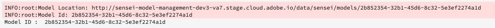
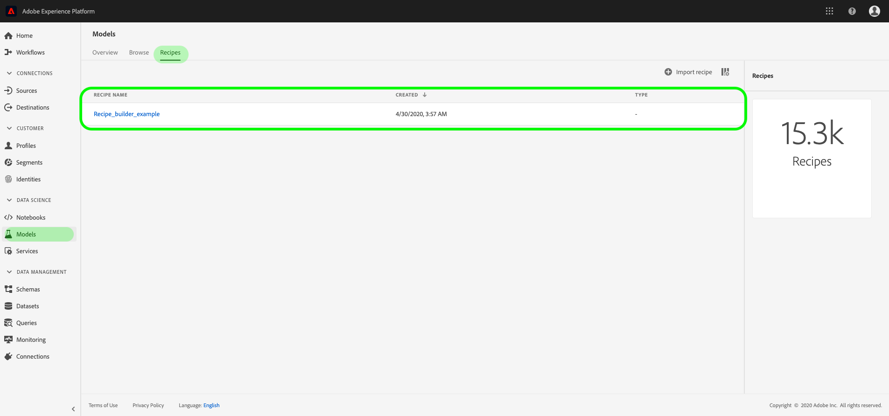
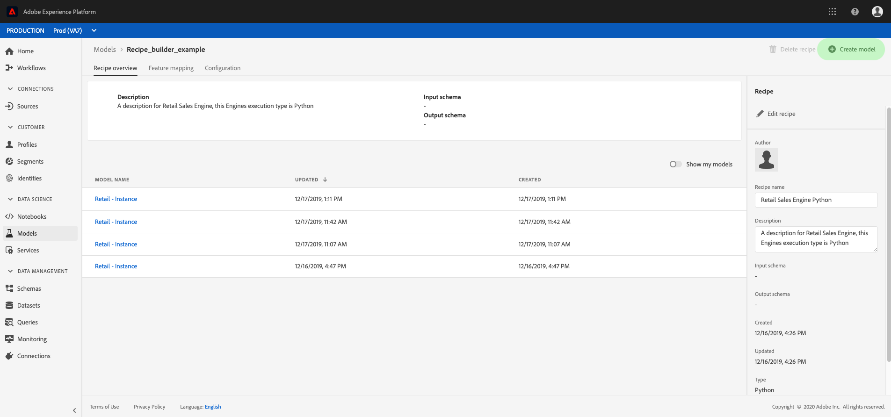
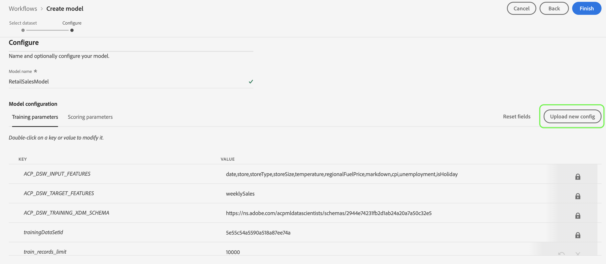

# 실시간 머신 러닝 모델 트레이닝

>[!IMPORTANT]
>모든 사용자는 아직 실시간 머신 러닝을 사용할 수 없습니다. 이 기능은 알파에 있으며 여전히 테스트되고 있습니다. 이 문서는 변경될 수 있습니다.

이 문서에서는 ONNX 모델을 실시간 머신 러닝 모델 스토어에 업로드하기 위한 자습서를 제공합니다.

다음 옵션 중 하나를 사용하여 데이터를 읽고, 미리 처리하고, 분석하기 위해 Python 코드를 작성하게 됩니다. 그런 다음 자신만의 ML 모델을 교육하고 ONNX 포맷으로 시리얼 번호를 지정한 다음 실시간 머신 러닝 모델 스토어에 업로드해야 합니다. 또한 튜토리얼이 끝날 때까지 [점수 지정 자습서에서 사용할 수 있도록 훈련된 모델을 식별하는 모델 ID가 제공됩니다](./scoring-ml-model.md).

* [Python 노트북을 사용하여 모델 훈련](#training-model-python-notebook)
* [고유한 ONNX 모델을 사용하여 모델 트레이닝](#train-using-own-onnx-model)
* [recipe-builder 템플릿을 사용하여 모델 트레이닝](#train-using-recipe-builder)
* [데이터 과학 작업장 레서피 워크플로우를 사용하여 모델 트레이닝](#recipe-workflow-train-model)


## Python 노트북을 사용하여 모델 트레이닝 {#training-model-python-notebook}

Adobe Experience Platform UI의 **[!UICONTROL 데이터 과학]** 내에서 *노트북을 선택합니다*. 그런 다음 **[!UICONTROL JupiterLab을]** 선택하고 환경을 로드하는 데 시간을 허용합니다.


JupiterLab launcher 내에서 **빈 Python 3 노트북을** 선택하여 시작합니다.


### 데이터 액세스 {#access-data}

다음으로 사용할 데이터 세트를 선택합니다. JupiterLab 전자 필기장의 데이터 세트에 액세스하려면 JupiterLab의 왼쪽 탐색 **에서 데이터** 탭을 선택합니다. 데이터 *집합* 및 *스키마* 디렉토리가나타납니다. 데이터 집합 **[!UICONTROL 을]** 선택하고 마우스 오른쪽 단추를 클릭한 다음 사용할 데이터 **[!UICONTROL 의 드롭다운 메뉴에서]** 데이터 탐색 옵션을 선택합니다. 전자 필기장에 실행 가능한 코드 항목이 나타납니다.


### 모델 준비

다음 템플릿을 사용하여 ML 모델을 분석, 사전 처리, 트레이닝 및 평가할 수 있습니다. 전체 예를 보려면 이 템플릿 아래에 제공된 스크린샷을 사용하십시오.

```python
from sklearn import svm, metrics
from sklearn.model_selection import train_test_split


data = df[input_columns]
target = df[target_column]
# Create a classifier: a support vector classifier
classifier = svm.SVC(gamma=0.001)

# Split data into train and test subsets
X_train, X_test, y_train, y_test = train_test_split(
    data, target, test_size=0.5, shuffle=False)

# We train the classifier
classifier.fit(X_train, y_train)

# Now do predictions
predicted = classifier.predict(X_test)


print("Classification report for classifier %s:\n%s\n"
      % (classifier, metrics.classification_report(y_test, predicted)))
disp = metrics.plot_confusion_matrix(classifier, X_test, y_test)
disp.figure_.suptitle("Confusion Matrix")
print("Confusion matrix:\n%s" % disp.confusion_matrix)
```

>[!NOTE]
>아래 예제는 인제스트된 Adobe Experience Platform 데이터 세트에서 데이터를 로드하는 대신 sckit 학습 라이브러리를 사용합니다.


**출력**


### 모델 업로드

이전 단계를 완료하면 모델을 ONNX 포맷으로 정리하여 실시간 기계 학습 스토어에 업로드해야 합니다. 그러면 `model_id` 다음 튜토리얼 [에 사용된 해당 내용이 반환됩니다](#next-steps).

다음 템플릿을 사용하여 ONNX로 변환하고 데이터 세트를 업로드합니다.

```python
from rtml_nodelibs.nodes.standard.ml.artifact_utils
import ModelUpload
from rtml_nodelibs.core.nodefactory
import NodeFactory as nf
from skl2onnx.common.data_types
import FloatTensorType
from skl2onnx
import convert_sklearn

########## Save sklearn model in ONNX format at model_path ##########
inputs = [('features', FloatTensorType([None, X_train.shape[1]]))]
model_onnx = convert_sklearn(classifier, 'ScikitLearnModel', inputs)

model_path = "model.onnx"
os.environ["ONNX_MODEL_PATH"] = model_path

with open(model_path, "wb") as f:
  f.write(model_onnx.SerializeToString())

  ########## Upload the model from model_path to RTML model store ##########
  model = ModelUpload(params = {
    'model_path': model_path
  })

msg_model = model.process(None, 1)

model_id = msg_model.model['model_id']

print("Model ID : ", model_id)
```

**응답**



수신한 후 `model_id`복사한 다음 [다음 단계로 진행합니다](#next-steps).


## 고유한 ONNX 모델을 사용하여 모델 트레이닝 {#train-using-own-onnx-model}

Adobe Experience Platform UI의 **[!UICONTROL 데이터 과학]** 내에서 *노트북을 선택합니다*. 그런 다음 **[!UICONTROL JupiterLab을]** 선택하고 환경을 로드하는 데 시간을 허용합니다.


JupiterLab 노트북에 있는 업로드 단추를 사용하여 ONNX 모델을 데이터 과학 작업 공간 노트북 환경에 업로드합니다.


그런 다음 JupiterLab launcher에서 Python 3 아래에 있는 빈 노트북 아이콘을 선택하여 빈 공책을 새로 만듭니다.


빈 노트북 내에서 다음을 복사하여 붙여 넣습니다.

>[!NOTE]
> 업로드한 ONNX 모델 `model_path` 을 제공해야 합니다.

```python
from rtml_nodelibs.nodes.standard.ml.artifact_utils import ModelUpload
from rtml_nodelibs.core.nodefactory import NodeFactory as nf
 
model_path = <path/to/onnx_model>
########## Upload the model from model_path to RTML model store ##########
model = ModelUpload(params={'model_path': model_path})
 
msg_model = model.process(None, 1)
 
model_id = msg_model.model['model_id']
 
print("Model ID : ", model_id)
```

위의 셀을 실행한 후 `model_id` 가 반환됩니다. 다음 자습서에서 사용할 모델 ID를 [복사합니다](#next-steps).

## 미리 만들어진 레서피 템플릿을 사용하여 모델 트레이닝 {#train-using-recipe-builder}

Adobe Experience Platform UI의 **[!UICONTROL 데이터 과학]** 내에서 *노트북을 선택합니다*. 그런 다음 **[!UICONTROL JupiterLab을]** 선택하고 환경을 로드하는 데 시간을 허용합니다.


그런 다음 Jupiter 노트북 [을 사용하여 레서피 만들기 자습서를](../jupyterlab/create-a-recipe.md) 따릅니다. 완료되면 pipeline.py 파일을 수정하여 실시간으로 참조하도록 해야 합니다.

>[!NOTE]
>데이터 과학 작업 공간에서 제공하는 템플릿을 데이터 세트에 맞게 수정해야 합니다.

모델을 ONNX 형식으로 저장하고 환경 변수를 로 설정해야 합니다 `ONNX_MODEL_PATH`. 아래 예는 recipe-builder 템플릿을 사용하여 파이프라인 파일을 수정하는 방법을 보여줍니다.

```python
def train(configProperties, data):

  print("Train Start")

########## Extract fields from configProperties ##########
learning_rate = float(configProperties['learning_rate'])
n_estimators = int(configProperties['n_estimators'])
max_depth = int(configProperties['max_depth'])

########## Fit model ##########
X_train = data.drop('weeklySalesAhead', axis = 1).values
y_train = data['weeklySalesAhead'].values

seed = 1234
model = GradientBoostingRegressor(learning_rate = learning_rate,
  n_estimators = n_estimators,
  max_depth = max_depth,
  random_state = seed)

model.fit(X_train, y_train)

########## Save sklearn model in ONNX format at model_path ##########
inputs = [('features', FloatTensorType([None, X_train.shape[1]]))]
model_onnx = convert_sklearn(model, 'ScikitLearnModel', inputs)

model_path = "retail_sales_model.onnx"
os.environ["ONNX_MODEL_PATH"] = model_path

with open(model_path, "wb") as f:
  f.write(model_onnx.SerializeToString())

print("Train Complete")

return model
```

pipeline.py 파일을 수정한 후 **[!UICONTROL 트레이닝]** 및 점수 **[!UICONTROL 지정을 실행합니다]**. 완료되면 레서피 만들기 **[!UICONTROL 버튼을]** 선택합니다.


이름 지정 대화 상자가 나타납니다. 레서피 이름을 입력하고 **[!UICONTROL 확인을 선택합니다]**. 레서피 작성을 시작했음을 알리는 새 대화 상자가 나타납니다. 레시피가 만들어질 때까지 약간의 시간을 허용합니다.


레서피가 생성되면 제공된 대화 상자에서 레서피 **[!UICONTROL 보기]** 를 선택하거나 **[!UICONTROL 모델로 이동한]** 다음 왼쪽 상단 탐색에서 레서피 **[!UICONTROL 를 선택하여]** 레서피를 볼 수 있습니다. 작성 날짜별로 정렬된 레시피 목록이 나타납니다. 새로운 조리법이 맨 위에 있는지 확인합니다.



레서피 선택 레서피 개요 페이지가 나타납니다. 오른쪽 상단 탐색에서 모델 **[!UICONTROL 만들기를 선택합니다]**.



그런 다음 적절한 데이터 세트를 선택합니다. 그런 다음 **[!UICONTROL 오른쪽]** 탐색 메뉴에서 다음을 클릭합니다.


구성 페이지가 열립니다. 모델의 이름을 입력하고 기본 모델 구성을 검토하십시오. 기본 구성은 레서피 생성 중에 적용됩니다. 값을 두 번 클릭하여 구성 값을 검토하고 수정합니다. 새 구성 세트를 제공하려면 새 구성 **[!UICONTROL 업로드]** 를 클릭하고 모델 구성이 포함된 JSON 파일을 브라우저 창으로 드래그합니다. 마침 **[!UICONTROL 을]** 선택하여 모델을 생성합니다.



모델이 만들어지면 교육 실행이 완료될 때까지 기다려야 합니다. 성공적인 교육 실행이 완료되면 교육 실행을 선택하여 세부 사항을 볼 수 있습니다.

교육 실행을 선택합니다. 선택하면 오른쪽에 속성 대화 상자가 나타납니다. 이 대화 상자 내에서 활동 **[!UICONTROL 로그 보기를 선택합니다]**.


[ *활동 로그* 보기] 대화 상자가 나타납니다. 로그 *를* 다운로드하고 실행에 대한 세부 사항을 보려면 문자열 로그의 URL을 선택합니다.


로그는 실패한 실행에 대해 잘못된 내용을 확인하는 데 특히 유용합니다. 그러나 이 경우 ONNX 모델에 `model-id` 해당하는 모델을 찾고 있습니다. 모델 ID를 복사합니다.

>[!NOTE]
>점수 매기는 일을 할 필요가 없다. 실시간 머신 러닝 이점도 [다음 단계로](#next-steps)제공됩니다.


## 데이터 과학 작업장 레서피 워크플로우를 사용하여 모델 트레이닝 {#recipe-workflow-train-model}

Docker, git 및 패키징 Python 코드에 익숙한 경우 가장 좋은 방법입니다. 데이터 과학 작업 공간 워크플로우를 사용하면 조리법을 만드는 데 있어 가장 많은 유연성과 자유를 얻을 수 있습니다. 기본 도커 이미지를 가져와서 고유한 문서 환경을 만들고 보다 손쉽게 레서피 디버그를 수행하고 사전 작성된 레서피를 복제하여 모든 데이터 과학 작업 공간 서비스를 사용하여 재생할 수 있으며 레서피 실행 일정을 지정하는 등 다양한 작업을 할 수 있습니다.

### 스키마 만들기

첫 번째 단계에서는 데이터 세트에 대한 데이터 스키마가 있어야 합니다. 스키마는 Adobe Experience Platform UI 또는 플랫폼 API를 통해 생성할 수 있습니다.

>[!NOTE]
>Adobe Experience Platform으로 인제스트한 데이터를 이미 보유하고 있는 경우 Python 레시피 [를 만들지 않아도 됩니다](#create-a-python-recipe).

* [스키마 편집기 UI 자습서를 사용하여 스키마 만들기](../../xdm/tutorials/create-schema-ui.md)
* [스키마 편집기 API 자습서를 사용하여 스키마 만들기](../../xdm/tutorials/create-schema-api.md)

### 데이터 인제스트

그런 다음 방금 만든 스키마를 사용하여 데이터를 인제스트해야 합니다. API 또는 플랫폼 UI를 사용하여 수행할 수 있습니다.

>[!NOTE]
>Adobe Experience Platform으로 인제스트한 데이터를 이미 보유하고 있는 경우 Python 레시피 [를 만들지 않아도 됩니다](#create-a-python-recipe).

* [Adobe Experience Platform UI로 데이터 인제스트 자습서](../../ingestion/tutorials/ingest-batch-data.md)
* [Adobe Experience Platform API로 데이터 인제스트 자습서](../../ingestion/batch-ingestion/api-overview.md)

### 비단뱀 조리법 만들기 {#create-a-python-recipe}

레서피 생성은 소스 파일을 패키징하여 아카이브 파일을 작성하는 것부터 시작합니다. 소스 파일은 특정 문제를 해결하는 데 사용되는 기계 학습 논리와 알고리즘을 정의합니다. 다음 자습서를 사용하여 Python Docker 이미지를 만듭니다.

* [소스 파일을 레서피로 패키지](../models-recipes/package-source-files-recipe.md)

다음 단계를 완료하려면 해당 이미지 URL과 함께 Azure 컨테이너 레지스트리에 Docker 이미지가 있어야 합니다. 아래 자습서 링크 중 하나를 선택하여 Python 레시피 작성을 완료합니다.

* [UI에서 패키지된 레서피 가져오기](../models-recipes/import-packaged-recipe-ui.md)
* [API를 사용하여 패키지된 레서피 가져오기](../models-recipes/import-packaged-recipe-api.md)

### 교육 실행 만들기

Adobe Experience Platform 데이터 과학 작업 공간에서 기계 학습 모델은 모델의 의도에 적합한 기존 레서피를 통합하여 만들어집니다. 그런 다음 연관된 하이퍼매개 변수를 세밀하게 조정하여 모델의 운영 효율성과 효과를 최적화하기 위해 교육을 받고 평가합니다.

* [UI에서 모델 트레이닝 및 평가](../models-recipes/train-evaluate-model-ui.md)
* [API에서 모델 트레이닝 및 평가](../models-recipes/train-evaluate-model-api.md)

>[!IMPORTANT]
>레서피에 대한 pipeline.py 파일에서 모델을 ONNX 형식 `model_path` 으로 저장하고 환경 변수를 로 설정합니다 `ONNX_MODEL_PATH`. 런타임은 이 특정 환경 변수를 찾습니다.

```python
def train(configProperties, data):
 
    print("Train Start")
 
    ########## Extract fields from configProperties ##########

    learning_rate = float(configProperties['learning_rate'])
    n_estimators = int(configProperties['n_estimators'])
    max_depth = int(configProperties['max_depth'])
 
 
    
    ########## Fit model ##########
    
    X_train = data.drop('weeklySalesAhead', axis=1).values
    y_train = data['weeklySalesAhead'].values
 
    seed = 1234
    model = GradientBoostingRegressor(learning_rate=learning_rate,
                                      n_estimators=n_estimators,
                                      max_depth=max_depth,
                                      random_state=seed)
 
    model.fit(X_train, y_train)
     
    ########## Save sklearn model in ONNX format at model_path ##########
    inputs = [('features', FloatTensorType([None, X_train.shape[1]]))]
    model_onnx = convert_sklearn(model, 'ScikitLearnModel', inputs)
 
    model_path = "retail_sales_model.onnx"
    os.environ["ONNX_MODEL_PATH"] = model_path
 
    with open(model_path, "wb") as f:
        f.write(model_onnx.SerializeToString())
 
    print("Train Complete")
 
    return model
```

모델이 만들어지면 교육 실행이 완료될 때까지 기다려야 합니다. 성공적인 교육 실행이 완료되면 교육 실행을 선택하여 세부 사항을 볼 수 있습니다. 교육 실행을 선택합니다. 속성 대화 상자가 오른쪽에 나타나면 활동 로그 **[!UICONTROL 보기를 선택합니다]**.


[ *활동 로그* 보기] 대화 상자가 나타납니다. 로그 *를* 다운로드하고 실행에 대한 세부 사항을 보려면 문자열 로그의 URL을 선택합니다.


로그는 실패한 실행에 대해 잘못된 내용을 확인하는 데 특히 유용합니다. 그러나 이 경우 ONNX 모델에 `model-id` 해당하는 모델을 찾고 있습니다. 모델 ID를 복사합니다.


요리법에서 점수 지정 작업을 할 필요는 없습니다. 실시간 기계 학습 이점수에 대해서는 [다음 튜토리얼에서 다룹니다](#next-steps).

## 다음 단계 {#next-steps}

위의 튜토리얼 중 하나를 통해 ONNX 모델을 성공적으로 교육하고 ONNX 모델을 실시간 머신 러닝 모델 스토어에 업로드했으며, 이를 통해 모델을 식별할 수 `model_id` 있습니다. 다음 튜토리얼을 통해 실시간 머신 러닝 모델을 [점수 매기는 방법을 학습할 수 있습니다](./scoring-ml-model.md).