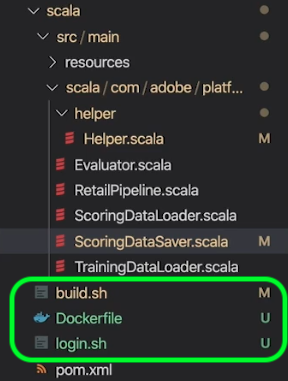
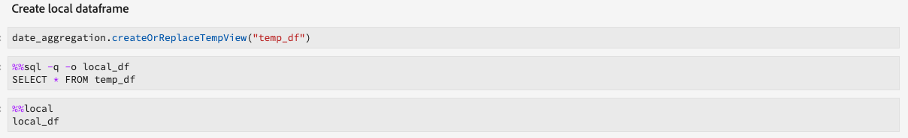

# 레서피 및 노트북 마이그레이션 가이드

>[!NOTE]
>Python/R을 사용한 노트북과 조리법은 영향을 받지 않습니다. 마이그레이션은 기존 PySpark/Spark 레서피 및 노트북에만 적용됩니다.

다음 안내서에서는 기존 레서피 및 전자 필기장을 마이그레이션하는 데 필요한 단계 및 정보에 대해 간략하게 설명합니다.

- [레서피 마이그레이션 가이드](#recipe-migration)
- [노트북 마이그레이션 가이드](#notebook-migration)

## 레서피 마이그레이션 가이드 {#recipe-migration}

Data Science Workspace의 최근 변경 사항은 기존 Spark 및 PySpark 레서피를 업데이트해야 합니다. 다음 워크플로우를 사용하여 레서피 전환을 지원합니다.

- [Spark 마이그레이션 가이드](#spark-migration-guide)
   - [데이터 세트를 읽고 쓰는 방법 수정](#read-write-recipe-spark)
   - [샘플 레서피 다운로드](#download-sample-spark)
   - [docker 파일 추가](#add-dockerfile-spark)
   - [종속성 확인](#change-dependencies-spark)
   - [도커 스크립트 준비](#prepare-docker-spark)
   - [doker로 레시피 만들기](#create-recipe-spark)
- [PySpark 마이그레이션 가이드](#pyspark-migration-guide)
   - [데이터 세트를 읽고 쓰는 방법 수정](#pyspark-read-write)
   - [샘플 레서피 다운로드](#pyspark-download-sample)
   - [docker 파일 추가](#pyspark-add-dockerfile)
   - [도커 스크립트 준비](#pyspark-prepare-docker)
   - [doker로 레시피 만들기](#pyspark-create-recipe)

## Spark 마이그레이션 가이드 {#spark-migration-guide}

빌드 단계에서 생성된 레서피 아티팩트는 이제 .jar 바이너리 파일이 포함된 Docker 이미지입니다. 또한 플랫폼 SDK를 사용하여 데이터 세트를 읽고 쓰는 데 사용되는 구문이 변경되었으며 레서피 코드를 수정해야 합니다.

다음 비디오는 Spark 레서피에 필요한 변경 사항을 이해하는 데 도움이 되도록 디자인되었습니다.

>[!VIDEO](https://video.tv.adobe.com/v/33243)

### 데이터 세트 읽기 및 쓰기(Spark) {#read-write-recipe-spark}

Docker 이미지를 만들기 전에 아래 섹션에 설명된 대로 플랫폼 SDK에서 데이터 세트를 읽고 쓰는 예제를 검토하십시오. 기존 레서피를 변환하는 경우 플랫폼 SDK 코드를 업데이트해야 합니다.

#### 데이터 세트 읽기

이 섹션에서는 데이터 세트를 읽는 데 필요한 변경 사항에 대해 간략히 설명하고 Adobe에서 제공하는 [helper.scala](https://github.com/adobe/experience-platform-dsw-reference/blob/master/recipes/scala/src/main/scala/com/adobe/platform/ml/helper/Helper.scala) 예제를 사용합니다.

Spark 레서피에 대한 업데이트를 통해 많은 값을 추가하고 변경해야 합니다. 첫째, `DataSetOptions` 더 이상 사용되지 않습니다. Replace `DataSetOptions` with `QSOption`. 또한 새 `option` 매개 변수가 필요합니다. 둘 `QSOption.mode` 다 `QSOption.datasetId` 필요하다. 마지막으로, `orgId` 그리고 `serviceApiKey` 로 변경되어야 `imsOrg` 합니다 `apiKey`. 데이터 집합 읽기에 대한 비교는 다음 표를 검토하십시오.

<table>
  <th>데이터 세트를 읽는 오래된 방법</th>
  <th>데이터 세트를 읽는 새로운 방법</th>
  <tr>
  <td>
  <pre class="JSON language-JSON hljs">
  var df = sparkSession.read.format("com.adobe.platform.dataset") .option(DataSetOptions.orgId, orgId) .option(DataSetOptions.serviceToken, serviceToken) .option(DataSetOptions.userToken, userToken) .option(DataSetOptions.serviceApiKey, apiKey) .load(dataSetId)
</pre>
  </td>
  <td>
<pre class="JSON language-JSON hljs">
import com.adobe.platform.query.QSOption

var df = sparkSession.read.format(&quot;com.adobe.platform.query&quot;).option(QSOption.userToken&quot;, {userToken}).option(QSOption.serviceToken, {serviceToken}).option(QSOption.imsOrg, {orgId}).option(QSOption.option apiKey, {apiKey}).option(QSOption.mode, &quot;interactive&quot;).option(QSOption.datasetId, {dataSetId}).load()
</pre>
</td>
  </tr>
</table>

>[!TIP]
> 쿼리가 10분 이상 실행되는 경우 대화형 모드가 시간 초과됩니다. 몇 GB 이상의 데이터를 수집하는 경우 &quot;일괄 처리&quot; 모드로 전환하는 것이 좋습니다. 일괄 처리 모드는 시작하는 데 시간이 오래 걸리지만 더 많은 데이터 세트를 처리할 수 있습니다.

#### 데이터 세트에 쓰기

이 섹션에서는 Adobe에서 제공하는 ScoringDataSaver.scala [예제를 사용하여](https://github.com/adobe/experience-platform-dsw-reference/blob/master/recipes/scala/src/main/scala/com/adobe/platform/ml/ScoringDataSaver.scala) 데이터 세트를 작성하는 데 필요한 변경 사항에 대해 간략하게 설명합니다.

Spark 레서피에 대한 업데이트를 통해 많은 값을 추가하고 변경해야 합니다. 첫째, `DataSetOptions` 더 이상 사용되지 않습니다. Replace `DataSetOptions` with `QSOption`. 또한 새 `option` 매개 변수가 필요합니다. `QSOption.datasetId` 가 필요하며 `{dataSetId}` 에서 을 로드할 필요성을 `.save()`대체합니다. 마지막으로, `orgId` 그리고 `serviceApiKey` 로 변경되어야 `imsOrg` 합니다 `apiKey`. 데이터 세트 작성에 대한 비교는 다음 표를 참조하십시오.

<table>
  <th>데이터 세트 작성 방법</th>
  <th>새로운 데이터 세트 작성 방법</th>
  <tr>
  <td>
  <pre class="JSON language-JSON hljs">
  df.write.format("com.adobe.platform.dataset") .option(DataSetOptions.orgId, orgId) .option(DataSetOptions.serviceToken, serviceToken) .option(DataSetOptions.userToken, userToken) .option(DataSetOptions.serviceApiApiOption key, apiKey) .save(scoringResultsDataSetId)
</pre>
  </td>
  <td>
<pre class="JSON language-JSON hljs">
import com.adobe.platform.query.QSOption

df.write.format(&quot;com.adobe.platform.query&quot;).option(QSOption.userToken&quot;, {userToken}).option(QSOption.serviceToken, {serviceToken}).option(QSOption.imsOrg, {orgId}).option(QSOption.api키, {QSOapiKey}).option(QSOption.datasetId, {dataSetId}).save()
</pre>
</td>
  </tr>
</table>

### Package Docker 기반 소스 파일(Spark) {#package-docker-spark}

먼저 레서피가 있는 디렉토리로 이동합니다.

다음 섹션에서는 Data Science Workspace 공용 Github 저장소에서 [](https://github.com/adobe/experience-platform-dsw-reference)찾을 수 있는 새로운 Scala Retail Sales 레서피를 사용합니다.

### 샘플 레서피 다운로드(Spark) {#download-sample-spark}

샘플 레서피에는 기존 레서피로 복사해야 하는 파일이 포함되어 있습니다. 모든 샘플 레서피가 포함된 공용 Github를 복제하려면 터미널에 다음을 입력합니다.

```BASH
git clone https://github.com/adobe/experience-platform-dsw-reference.git
```

Scala 레시피는 다음 디렉토리에 `experience-platform-dsw-reference/recipes/scala/retail`있습니다.

### Dockerfile(Spark) 추가 {#add-dockerfile-spark}

문서 분류기 기반 워크플로우를 사용하려면 레서피 폴더에 새 파일이 필요합니다. 의 레서피 폴더에서 Dockerfile을 복사하여 붙여 넣습니다 `experience-platform-dsw-reference/recipes/scala/Dockerfile`. 원하는 경우 아래 코드를 복사하여 새 파일인 에 붙여넣을 수도 `Dockerfile`있습니다.

>[!IMPORTANT]
> 아래 표시된 예제 jar 파일은 레서피 jar 파일의 이름으로 대체해야 `ml-retail-sample-spark-*-jar-with-dependencies.jar` 합니다.

```scala
FROM adobe/acp-dsw-ml-runtime-spark:0.0.1

COPY target/ml-retail-sample-spark-*-jar-with-dependencies.jar /application.jar
```

### 종속성 변경(Spark) {#change-dependencies-spark}

기존 레서피를 사용하는 경우, mum.xml 파일에서 종속성을 변경해야 합니다. model-authoring-sdk 종속성 버전을 1.0.0으로 변경합니다.그런 다음 파일 내의 Spark 버전을 2.4.3으로 업데이트하고 Scala 버전을 2.11.12로 업데이트합니다.

```json
<groupId>com.adobe.platform.ml</groupId>
<artifactId>authoring-sdk_2.11</artifactId>
<version>1.0.0</version>
<classifier>jar-with-dependencies</classifier>
```

### Docker 스크립트 준비(Spark) {#prepare-docker-spark}

Spark 레서피는 더 이상 바이너리 결함을 사용하지 않으며 대신 Docker 이미지를 만들어야 합니다. 아직 설치하지 않은 경우 Docker를 [다운로드하여 설치합니다](https://www.docker.com/products/docker-desktop).

제공된 Scala 샘플 레서피에서는 스크립트를 `login.sh` 찾아 에 `build.sh` 있습니다 `experience-platform-dsw-reference/recipes/scala/` . 이러한 파일을 복사하여 기존 레서피에 붙여넣을 수 있습니다.

이제 폴더 구조가 다음 예와 유사해야 합니다(새로 추가된 파일이 강조 표시됨).



다음 단계는 [패키지 소스 파일을 레서피](./models-recipes/package-source-files-recipe.md) 자습서로 따르는 것입니다. 이 자습서에서는 Scala(Spark) 레서피용 도커 이미지를 만드는 방법에 대해 간략하게 설명합니다. 완료되면 Azure 컨테이너 레지스트리에 해당 이미지 URL과 함께 Docker 이미지가 제공됩니다.

### 레서피 만들기(Spark) {#create-recipe-spark}

레서피를 만들려면 먼저 [패키지 소스 파일](./models-recipes/package-source-files-recipe.md) 자습서를 완료하고 문서 이미지 URL을 준비해야 합니다. UI 또는 API 파섹

UI를 사용하여 레서피를 만들려면 Scala용 패키지된 레서피(UI) [](./models-recipes/import-packaged-recipe-ui.md) 가져오기 자습서를 따릅니다.

API를 사용하여 레서피를 만들려면 Scala용 패키지 레서피(API) [](./models-recipes/import-packaged-recipe-api.md) 가져오기 자습서를 따릅니다.

## PySpark 마이그레이션 가이드 {#pyspark-migration-guide}

빌드 단계에서 생성된 레서피 아티팩트는 이제 .egg 바이너리 파일이 포함된 Docker 이미지입니다. 또한 플랫폼 SDK를 사용하여 데이터 세트를 읽고 쓰는 데 사용되는 구문이 변경되었으며 레서피 코드를 수정해야 합니다.

다음 비디오는 PySpark 레서피에 필요한 변경 사항을 이해하는 데 도움이 되도록 설계되었습니다.

>[!VIDEO](https://video.tv.adobe.com/v/33048?learn=on&quality=12)

### 데이터 세트 읽기 및 쓰기(PySpark) {#pyspark-read-write}

Docker 이미지를 만들기 전에 아래 섹션에 설명된 대로 플랫폼 SDK에서 데이터 세트를 읽고 쓰는 예제를 검토하십시오. 기존 레서피를 변환하는 경우 플랫폼 SDK 코드를 업데이트해야 합니다.

#### 데이터 세트 읽기

이 섹션에서는 Adobe에서 제공하는 [helper.py](https://github.com/adobe/experience-platform-dsw-reference/blob/master/recipes/pyspark/pysparkretailapp/helper.py) 예제를 사용하여 데이터 세트를 읽는 데 필요한 변경 사항에 대해 간략하게 설명합니다.

Spark 레서피에 대한 업데이트를 통해 많은 값을 추가하고 변경해야 합니다. 첫째, `DataSetOptions` 더 이상 사용되지 않습니다. Replace `DataSetOptions` with `qs_option`. 또한 새 `option` 매개 변수가 필요합니다. 둘 `qs_option.mode` 다 `qs_option.datasetId` 필요하다. 마지막으로, `orgId` 그리고 `serviceApiKey` 로 변경되어야 `imsOrg` 합니다 `apiKey`. 데이터 집합 읽기에 대한 비교는 다음 표를 검토하십시오.

<table>
  <th>데이터 세트를 읽는 오래된 방법</th>
  <th>데이터 세트를 읽는 새로운 방법</th>
  <tr>
  <td>
  <pre class="JSON language-JSON hljs">
dataset_options = get_dataset_options(spark.sparkContext)

pd = spark.read.format(&quot;com.adobe.platform.dataset&quot;).option(dataset_options.serviceToken(), service_token).option(dataset_options.userToken(), user_token).option(dataset_options.orgId(), org_id).option(dataset_options.serviceApiKey(), api_id)
</pre>
</td>
  <td>
<pre class="JSON language-JSON hljs">
qs_option = spark_context._jvm.com.adobe.platform.query.QSOption

pd = sparkSession.read.format(&quot;com.adobe.platform.query&quot;).option(qs_option.userToken, {userToken}).option(qs_option.serviceToken, {serviceToken}).option(qs_option.imsOrg, {orgId}).option(qs_option.apiKey, {apiKey}).option (qs_option.mode, &quot;interactive&quot;).option(qs_option.datasetId, {dataSetId}).load()
</pre>
</td>
  </tr>
</table>

>[!TIP]
> 쿼리가 10분 이상 실행되는 경우 대화형 모드가 시간 초과됩니다. 몇 GB 이상의 데이터를 수집하는 경우 &quot;일괄 처리&quot; 모드로 전환하는 것이 좋습니다. 일괄 처리 모드는 시작하는 데 시간이 오래 걸리지만 더 많은 데이터 세트를 처리할 수 있습니다.

#### 데이터 세트에 쓰기

이 섹션에서는 Adobe에서 제공하는 [data_saver.py](https://github.com/adobe/experience-platform-dsw-reference/blob/master/recipes/pyspark/pysparkretailapp/data_saver.py) 예제를 사용하여 데이터 세트를 작성하는 데 필요한 변경 사항에 대해 간략하게 설명합니다.

PySpark 레서피에 대한 업데이트를 통해 많은 값을 추가하고 변경해야 합니다. 첫째, `DataSetOptions` 더 이상 사용되지 않습니다. Replace `DataSetOptions` with `qs_option`. 또한 새 `option` 매개 변수가 필요합니다.  `qs_option.datasetId` 가 필요하며 `{dataSetId}` 에서 을 로드할 필요성을 `.save()` 대체합니다. 마지막으로, `orgId` 그리고 `serviceApiKey` 로 변경되어야 `imsOrg` 합니다 `apiKey`. 데이터 집합 읽기에 대한 비교는 다음 표를 검토하십시오.

<table>
  <th>데이터 세트 작성 방법</th>
  <th>새로운 데이터 세트 작성 방법</th>
  <tr>
  <td>
  <pre class="JSON language-JSON hljs">
df.write.format("com.adobe.platform.dataset") .option(DataSetOptions.orgId, orgId) .option(DataSetOptions.serviceToken, serviceToken) .option(DataSetOptions.userToken, userToken) .option(DataSetOptions.serviceApiApiOption key, apiKey) .save(scoringResultsDataSetId)
</pre>
  </td>
  <td>
<pre class="JSON language-JSON hljs">
qs_option = spark_context._jvm.com.adobe.platform.query.QSOption

scored_df.write.format(&quot;com.adobe.platform.query&quot;).option(qs_option.userToken, {userToken}).option(qs_option.serviceToken, {serviceToken}).option(qs_option.imsOrg, {orgId}).option(qs_option.apiKey, {apiKey}).option option.datasetId, {dataSetId}).save()
</pre>
</td>
  </tr>
</table>

### Package Docker 기반 소스 파일(PySpark) {#pyspark-package-docker}

먼저 레서피가 있는 디렉토리로 이동합니다.

이 예에서는 새로운 PySpark Retail 영업 레서피가 사용되며 Data Science Workspace [공용 Github 저장소에서](https://github.com/adobe/experience-platform-dsw-reference)찾을 수 있습니다.

### 샘플 레서피 다운로드(PySpark) {#pyspark-download-sample}

샘플 레서피에는 기존 레서피로 복사해야 하는 파일이 포함되어 있습니다. 모든 샘플 레서피가 포함된 공용 Github를 복제하려면 터미널에 다음을 입력합니다.

```BASH
git clone https://github.com/adobe/experience-platform-dsw-reference.git
```

PySpark 레서피는 다음 디렉토리에 `experience-platform-dsw-reference/recipes/pyspark`있습니다.

### Dockerfile(PySpark) 추가 {#pyspark-add-dockerfile}

문서 분류기 기반 워크플로우를 사용하려면 레서피 폴더에 새 파일이 필요합니다. 의 레서피 폴더에서 Dockerfile을 복사하여 붙여 넣습니다 `experience-platform-dsw-reference/recipes/pyspark/Dockerfile`. 선택적으로 아래 코드를 복사하여 붙여 넣고 새 파일을 `Dockerfile`만들 수도 있습니다.

>[!IMPORTANT]
> 아래 표시된 예제 egg 파일은 조리법의 egg 파일 이름으로 대체되어야 `pysparkretailapp-*.egg` 합니다.

```scala
FROM adobe/acp-dsw-ml-runtime-pyspark:0.0.1
RUN mkdir /recipe

COPY . /recipe

RUN cd /recipe && \
    ${PYTHON} setup.py clean install && \
    rm -rf /recipe

RUN cp /databricks/conda/envs/${DEFAULT_DATABRICKS_ROOT_CONDA_ENV}/lib/python3.6/site-packages/pysparkretailapp-*.egg /application.egg
```

### Docker 스크립트 준비(PySpark) {#pyspark-prepare-docker}

PySpark 레서피는 더 이상 바이너리 결함을 사용하지 않으며 대신 Docker 이미지를 만들어야 합니다. 아직 설치하지 않은 경우 Docker를 다운로드하고 [설치합니다](https://www.docker.com/products/docker-desktop).

제공된 PySpark 샘플 레서피에서는 스크립트를 `login.sh` 찾아 에 `build.sh` 있습니다 `experience-platform-dsw-reference/recipes/pyspark` . 이러한 파일을 복사하여 기존 레서피에 붙여넣을 수 있습니다.

이제 폴더 구조가 다음 예와 유사해야 합니다(새로 추가된 파일이 강조 표시됨).


이제 Docker 이미지를 사용하여 레서피를 만들 준비가 되었습니다. 다음 단계는 [패키지 소스 파일을 레서피](./models-recipes/package-source-files-recipe.md) 자습서로 따르는 것입니다. 이 자습서에서는 PySpark(Spark 2.4) 레서피용 도커 이미지를 만드는 방법에 대해 간략하게 설명합니다. 완료되면 Azure 컨테이너 레지스트리에 해당 이미지 URL과 함께 Docker 이미지가 제공됩니다.

### 레서피 만들기(PySpark) {#pyspark-create-recipe}

레서피를 만들려면 먼저 [패키지 소스 파일](./models-recipes/package-source-files-recipe.md) 자습서를 완료하고 문서 이미지 URL을 준비해야 합니다. UI 또는 API 파섹

UI를 사용하여 레서피를 만들려면 PySpark에 대한 패키지된 레서피(UI) [](./models-recipes/import-packaged-recipe-ui.md) 자습서 가져오기를 따릅니다.

API를 사용하여 레서피를 만들려면 PySpark에 대한 패키징 레서피(API) [](./models-recipes/import-packaged-recipe-api.md) 자습서 가져오기를 참조하십시오.

## 노트북 마이그레이션 가이드 {#notebook-migration}

JupiterLab 노트북의 최근 변경 사항은 기존 PySpark 및 Spark 2.3 노트북을 2.4로 업데이트해야 합니다.이러한 변경 사항으로 JupiterLab Launcher는 새로운 시작 노트북으로 업데이트되었습니다. 전자 필기장을 변환하는 방법에 대한 단계별 가이드를 보려면 다음 안내서 중 하나를 선택하십시오.

- [PySpark 2.3 - 2.4 마이그레이션 안내서](#pyspark-notebook-migration)
- [Spark 2.3에서 Spark 2.4(Scala) 마이그레이션 가이드](#spark-notebook-migration)

## PySpark 2.3-2.4 노트북 마이그레이션 안내서 {#pyspark-notebook-migration}

PySpark 2.4가 JupiterLab Notebook에 새롭게 소개되면서 PySpark 2.4가 탑재된 새로운 Python 노트북이 PySpark 3 커널 대신 Python 3 커널을 사용하고 있습니다. 즉, PySpark 2.3에서 실행되는 기존 코드는 PySpark 2.4에서 지원되지 않습니다.

>[!IMPORTANT] PySpark 2.3은 더 이상 사용되지 않으며 이후 릴리스에서 제거되도록 설정되어 있습니다. 모든 기존 예는 PySpark 2.4 예로 대체되도록 설정됩니다.

기존 PySpark 3(Spark 2.3) 노트북을 Spark 2.4로 변환하려면 아래 설명된 예를 따르십시오.

### 커널

PySpark 3(Spark 2.4) 노트북에서는 PySpark 3(Spark 2.3 - 더 이상 사용되지 않음) 노트북에서 사용되지 않는 PySpark 커널 대신 Python 3 커널을 사용합니다.

JupiterLab UI에서 커널을 확인하거나 변경하려면 전자 필기장의 오른쪽 상단 내비게이션 막대에 있는 커널 단추를 선택합니다. 사전 정의된 실행 노트북 중 하나를 사용하는 경우 커널이 미리 선택됩니다. 아래 예제는 PySpark 3(Spark 2.4) *집선* 노트북 스타터를 사용합니다.


드롭다운 메뉴를 선택하면 사용 가능한 커넬 목록이 열립니다.


PySpark 3(Spark 2.4) 노트북의 경우 Python 3 커널을 선택하고 선택 **버튼을 클릭하여** 확인합니다.


## SparkSession 초기화

모든 Spark 2.4 노트북에서는 새로운 상용구 코드로 세션을 초기화해야 합니다.

<table>
  <th>노트북</th>
  <th>PySpark 3(Spark 2.3 - 더 이상 사용되지 않음)</th>
  <th>PySpark 3(Spark 2.4)</th>
  <tr>
  <th>커널</th>
  <td align="center">PySpark 3</td>
  <td align="center">Python 3</td>
  </tr>
  <tr>
  <th>코드</th>
  <td>
  <pre class="JSON language-JSON hljs">
  spark
</pre>
  </td>
  <td>
  <pre class="JSON language-JSON hljs">
spark.sql 가져오기 Spark = SparkSession.builder.getOrCreate()
</pre>
  </td>
  </tr>
</table>

다음 이미지는 PySpark 2.3과 PySpark 2.4의 구성 차이점을 강조 표시한 것입니다.이 예에서는 *JupiterLab* Launcher에서 제공하는 집선 시작 전자 필기장을 사용합니다.

**2.3에 대한 구성 예(더 이상 사용되지 않음)**


**2.4에 대한 구성 예**


## %dataset 매직 사용 {#magic}

Spark 2.4가 도입됨에 따라 `%dataset` 새로운 PySpark 3(Spark 2.4) 노트북(Python 3 커널)에 사용자 정의 기능이 제공됩니다.

**사용**

`%dataset {action} --datasetId {id} --dataFrame {df}`

**설명**

Python 노트북(Python 3 커널)에서 데이터 세트를 읽거나 쓰는 사용자 정의 데이터 과학 작업 영역 매직 명령입니다.

- **{action}**:데이터 세트에 대해 수행할 작업 유형입니다. 두 가지 작업을 &quot;읽기&quot; 또는 &quot;쓰기&quot;로 사용할 수 있습니다.
- **—datasetId {id}**:데이터 집합의 ID를 읽고 쓰는 데 사용됩니다. 이것은 필수 인수입니다.
- **—dataFrame {df}**:팬더 데이터 프레임 이것은 필수 인수입니다.
   - 작업이 &quot;읽기&quot;인 경우 {df}은(는) 데이터 집합 읽기 작업의 결과를 사용할 수 있는 변수입니다.
   - 작업이 &quot;write&quot;이면 이 데이터 프레임 {df}이(가) 데이터 세트에 기록됩니다.
- **—mode(선택 사항)**:허용되는 매개 변수는 &quot;batch&quot; 및 &quot;interactive&quot;입니다. 기본적으로 모드는 &quot;interactive&quot;로 설정됩니다. 대량의 데이터를 읽을 때는 &quot;일괄 처리&quot; 모드를 사용하는 것이 좋습니다.

**예**

- **보기 예**: `%dataset read --datasetId 5e68141134492718af974841 --dataFrame pd0`
- **예제**&#x200B;작성: `%dataset write --datasetId 5e68141134492718af974842 --dataFrame pd0`

## LocalContext에서 데이터 프레임으로 로드

Spark 2.4가 도입됨에 따라 [`%dataset`](#magic) 사용자 정의 기능이 제공됩니다. 다음 표는 PySpark(Spark 2.3) 및 PySpark(Spark 2.4) 노트북에서 데이터 프레임을 로드하기 위한 주요 차이점을 강조 표시한 것입니다.

<table>
  <th>노트북</th>
  <th>PySpark 3(Spark 2.3 - 더 이상 사용되지 않음)</th>
  <th>PySpark 3(Spark 2.4)</th>
  <tr>
  <th>커널</th>
  <td align="center">PySpark 3</td>
  <td align="center">Python 3</td>
  </tr>
  <tr>
  <th>코드</th>
  <td>
  <pre class="JSON language-JSON hljs">
dataset_options = sc._jvm.com.adobe.platform.dataset.DataSetOptions

pd0 = spark.read.format(&quot;com.adobe.platform.dataset&quot;).option(dataset_options.orgId(), &quot;310C6D375BA5248F0A494212@AdobeOrg&quot;).load(&quot;5e68141134492718af974844&quot;)
</pre>
</td>
  <td>
  <pre class="JSON language-JSON hljs">
%dataset read —datasetId 5e6814134492718af97484 —dataFrame pd0
</pre>
  </td>
  </tr>
</table>

| 요소 | 설명 |
| ------- | ----------- |
| pd0 | 사용하거나 만들 판다의 데이터 프레임 개체의 이름입니다. |
| [%dataset](#magic) | Python3 커널의 데이터 액세스를 위한 사용자 정의 기능 |

다음 이미지는 PySpark 2.3 및 PySpark 2.4의 데이터 로드 시 주요 차이점을 강조 표시합니다.이 예에서는 *JupiterLab* Launcher에서 제공하는 집선 시작 전자 필기장을 사용합니다.

**PySpark 2.3에서 데이터 로드(루마 데이터 세트) - 더 이상 사용되지 않음**


**PySpark 2.4에서 데이터 로드(루마 데이터 세트)**

PySpark 3(Spark 2.4)을 사용하면 로딩에 `sc = spark.sparkContext` 정의할 수 있습니다.


**PySpark 2.3에서 경험 로드 시 플랫폼 데이터 - 가치 하락**


**PySpark 2.4에서 경험 로드 시 플랫폼 데이터 활용**

PySpark 3(Spark 2.4)을 사용하면 `org_id` 더 이상 정의할 `dataset_id` 필요가 없습니다. 또한 데이터 `df = spark.read.format` 세트를 손쉽게 읽고 쓸 수 [`%dataset`](#magic) 있도록 사용자 정의 마법으로 대체되었습니다.


| 요소 | description |
| ------- | ----------- |
| [%dataset](#magic) | Python3 커널의 데이터 액세스를 위한 사용자 정의 기능 |

>[!TIP] —mode can be set to `interactive` or `batch`. —mode의 기본값은 입니다 `interactive`. 대량의 데이터를 읽을 때는 `batch` 모드를 사용하는 것이 좋습니다.

## 로컬 데이터 프레임 만들기

PySpark 3(Spark 2.4) `%%` 스파크매직은 더 이상 지원되지 않습니다. 다음 작업은 더 이상 사용할 수 없습니다.

- `%%help`
- `%%info`
- `%%cleanup`
- `%%delete`
- `%%configure`
- `%%local`

다음 표에서는 스파크매직 쿼리를 변환하는 데 필요한 변경 사항에 대해 `%%sql` 설명합니다.

<table>
  <th>노트북</th>
  <th>PySpark 3(Spark 2.3 - 더 이상 사용되지 않음)</th>
  <th>PySpark 3(Spark 2.4)</th>
  <tr>
  <th>커널</th>
  <td align="center">PySpark 3</td>
  <td align="center">Python 3</td>
  </tr>
  <tr>
  <th>코드</th>
      <td>
         <pre class="JSON language-JSON hljs">%%sql -o dfselect * from sparkdf
</pre>
         <pre class="JSON language-JSON hljs"> %%sql -o df -n limiselect * from sparkdf
</pre>
         <pre class="JSON language-JSON hljs">%%sql -o df -qselect * from sparkdf
</pre>
         <pre class="JSON language-JSON hljs"> %%sql -o df -r fractionselect * from sparkdf
</pre>
      </td>
      <td>
         <pre class="JSON language-JSON hljs">
df = spark.sql(" SELECT * FROM sparkdf")
</pre>
         <pre class="JSON language-JSON hljs">
df = spark.sql(" SELECT * FROM sparkdf LIMIT limit")
</pre>
         <pre class="JSON language-JSON hljs">
df = spark.sql(" SELECT * FROM sparkdf LIMIT limit")
</pre>
         <pre class="JSON language-JSON hljs">
sample_df = df.sample(fraction)
</pre>
      </td>
   </tr>
</table>

>[!TIP] [바꾸기], [이중 분수] 또는 [긴 시드]가 있는 부울 값과 같은 선택적 시드 샘플도 지정할 수 있습니다.

다음 이미지는 PySpark 2.3 및 PySpark 2.4에서 로컬 데이터 프레임을 만드는 데 필요한 주요 차이점을 강조 표시합니다.이 예에서는 *JupiterLab* Launcher에서 제공하는 집선 시작 전자 필기장을 사용합니다.

**로컬 데이터 프레임 PySpark 2.3 만들기 - 더 이상 사용되지 않음**



**로컬 데이터 프레임 PySpark 2.4 만들기**

PySpark 3(Spark 2.4) `%%sql` 의 경우 Sparkmagic은 더 이상 지원되지 않으며 다음과 같이 대체되었습니다.


## 데이터 세트에 쓰기

Spark 2.4가 도입되면서 [`%dataset`](#magic) 데이터 세트 작성을 간소화할 수 있는 사용자 정의 기능이 제공됩니다. 데이터 세트에 쓰려면 다음 Spark 2.4 예를 사용합니다.

<table>
  <th>노트북</th>
  <th>PySpark 3(Spark 2.3 - 더 이상 사용되지 않음)</th>
  <th>PySpark 3(Spark 2.4)</th>
  <tr>
  <th>커널</th>
  <td align="center">PySpark 3</td>
  <td align="center">Python 3</td>
  </tr>
  <tr>
  <th>코드</th>
  <td>
  <pre class="JSON language-JSON hljs">
userToken = spark.sparkContext.getConf().get("spark.yarn.appMasterEnv.USER_TOKEN")serviceToken = spark.sparkContext.getConf().get("spark.yarn.appMasterEnv.SERVICE_TOKEN")serviceSparkApiKey =.sparkSparkSparkKey Context.getConf().get("spark.yarn.appMasterEnv.SERVICE_API_KEY")

dataset_options = sc._jvm.com.adobe.platform.dataset.DataSetOptions

pd0.write.format(&quot;com.adobe.platform.dataset&quot;).option(dataset_options.orgId(), &quot;310C6D375BA5248F0A494212@AdobeOrg&quot;).option(dataset_options.userToken(), userToken).option(dataset_options.serviceToken(), serviceApiKey(), serviceApiKey).save (&quot;5e68141134492718af974844&quot;)
</pre>
</td>
  <td>
  <pre class="JSON language-JSON hljs">
%dataset write —datasetId 5e6814134492718af97484 —dataFrame pd0

pd0.describe()pd0.show(10, False)
</pre>
</td>
  </tr>
</table>

| 요소 | description |
| ------- | ----------- |
| pd0 | 사용하거나 만들 판다의 데이터 프레임 개체의 이름입니다. |
| [%dataset](#magic) | Python3 커널의 데이터 액세스를 위한 사용자 정의 기능 |

>[!TIP] —mode can be set to `interactive` or `batch`. —mode의 기본값은 입니다 `interactive`. 대량의 데이터를 읽을 때는 `batch` 모드를 사용하는 것이 좋습니다.

다음 이미지는 PySpark 2.3 및 PySpark 2.4의 플랫폼으로 데이터를 다시 작성하는 데 필요한 주요 차이점을 강조 표시한 것입니다.이 예에서는 *JupiterLab* Launcher에서 제공하는 집선 시작 전자 필기장을 사용합니다.

**Platform PySpark 2.3으로 다시 데이터 쓰기 - 가치 하락**


**Platform PySpark 2.4로 다시 데이터 쓰기**

PySpark 3(Spark 2.4)의 `%dataset` 사용자 정의 기능을 사용하면 `userToken`, `serviceToken``serviceApiKey`, `.option`등과 같은 값을 정의할 필요가 없습니다. 또한 `orgId` 더 이상 정의할 필요가 없습니다.


## Spark 2.3에서 Spark 2.4(Scala) 노트북 마이그레이션 가이드 {#spark-notebook-migration}

Spark 2.4가 JupiterLab Notebook에 새롭게 도입되면서 기존 Spark 2.3(Spark 2.3) 노트북에서 Spark 커널 대신 Scala 커널을 사용하고 있습니다. 즉, Spark(Spark 2.3)에서 실행되는 기존 코드는 Scala(Spark 2.4)에서 지원되지 않습니다. 또한 모든 새로운 Spark 노트북은 JupiterLab launcher에서 Scala(Spark 2.4)를 사용해야 합니다.

>[!IMPORTANT] Spark(Spark 2.3)는 더 이상 사용되지 않으며 이후 릴리스에서 제거되도록 설정됩니다. 모든 기존 예는 Scala(Spark 2.4) 예로 대체되도록 설정됩니다.

기존 Spark(Spark 2.3) 노트북을 Scala(Spark 2.4)로 변환하려면 아래 나와 있는 예제를 따르십시오.

## 커널

Scala(Spark 2.4) 노트북에서는 Spark(Spark 2.3 - 더 이상 사용되지 않음) 노트북에서 사용되지 않는 Spark 커널 대신 Scala Kernel을 사용합니다.

JupiterLab UI에서 커널을 확인하거나 변경하려면 전자 필기장의 오른쪽 상단 내비게이션 막대에 있는 커널 단추를 선택합니다. 커널 *선택* 팝업이 나타납니다. 사전 정의된 실행 노트북 중 하나를 사용하는 경우 커널이 미리 선택됩니다. 아래 예에서는 JupiterLab Launcher *의* Scala Clustering 노트북을 사용합니다.


드롭다운 메뉴를 선택하면 사용 가능한 커넬 목록이 열립니다.


Scala(Spark 2.4) 노트북의 경우 Scala 커널을 선택하고 [선택] **단추를 클릭하여** 확인합니다.


## SparkSession 초기화 {#initialize-sparksession-scala}

모든 Scala(Spark 2.4) 노트북에서는 다음 상용구 코드로 세션을 초기화해야 합니다.

<table>
  <th>노트북</th>
  <th>Spark(Spark 2.3 - 더 이상 사용되지 않음)</th>
  <th>Scala(Spark 2.4)</th>
  <tr>
  <th>커널</th>
  <td align="center">Spark</td>
  <td align="center">Scala</td>
  </tr>
  <tr>
  <th>code</th>
  <td align="center">
  코드 필요 없음
  </td>
  <td>
  <pre class="JSON language-JSON hljs">
org.apache.spark.sql을 가져옵니다.{ SparkSession }val spark = SparkSession .builder() .master("local") .getOrCreate()
</pre>
  </td>
  </tr>
</table>

아래 Scala(Spark 2.4) 이미지는 Spark 2.3 Spark 커널 및 Spark 2.4 Scala 커널을 사용하여 sparkSession을 초기화하는 경우의 주요 차이점을 강조 표시합니다. 이 예에서는 *JupiterLab* Launcher에서 제공하는 클러스터링 시작 전자 필기장을 사용합니다.

**Spark(Spark 2.3 - 더 이상 사용되지 않음)**

Spark(Spark 2.3 - 더 이상 사용되지 않음)는 Spark 커널을 사용하므로 Spark를 정의할 필요가 없습니다.

**Scala(Spark 2.4)**

Scala 커널과 함께 Spark 2.4를 사용하려면 읽기 또는 쓰기를 위해 정의 `val spark` 및 가져오기가 `SparkSesson` 필요합니다.


## 쿼리 데이터

Scala(Spark 2.4) `%%` 스파크매직은 더 이상 지원되지 않습니다. 다음 작업은 더 이상 사용할 수 없습니다.

- `%%help`
- `%%info`
- `%%cleanup`
- `%%delete`
- `%%configure`
- `%%local`

다음 표에서는 스파크매직 쿼리를 변환하는 데 필요한 변경 사항에 대해 `%%sql` 설명합니다.

<table>
  <th>노트북</th>
  <th>Spark(Spark 2.3 - 더 이상 사용되지 않음)</th>
  <th>Scala(Spark 2.4)</th>
  <tr>
  <th>커널</th>
  <td align="center">Spark</td>
  <td align="center">Scala</td>
  </tr>
  <tr>
  <th>code</th>
    <td>
       <pre class="JSON language-JSON hljs">
%%sql -o dfselect * from sparkdf
</pre>
         <pre class="JSON language-JSON hljs">
%%sql -o df -n limiselect * from sparkdf
</pre>
         <pre class="JSON language-JSON hljs">
%%sql -o df -qselect * from sparkdf
</pre>
         <pre class="JSON language-JSON hljs">
%%sql -o df -r fractionselect * from sparkdf
</pre>
      </td>
      <td>
         <pre class="JSON language-JSON hljs">
val df = spark.sql(" SELECT * FROM sparkdf")
</pre>
         <pre class="JSON language-JSON hljs">
val df = spark.sql(" SELECT * FROM sparkdf LIMIT limit")
</pre>
         <pre class="JSON language-JSON hljs">
val df = spark.sql(" SELECT * FROM sparkdf LIMIT limit")
</pre>
         <pre class="JSON language-JSON hljs">
val sample_df = df.sample(fraction) </pre>
      </td>
   </tr>
</table>

아래 Scala(Spark 2.4) 이미지는 Spark 2.3 Spark Kernel 및 Spark 2.4 Scala 커널을 사용하여 쿼리를 만들 때 중요한 차이점을 강조 표시합니다. 이 예에서는 *JupiterLab* Launcher에서 제공하는 클러스터링 시작 전자 필기장을 사용합니다.

**Spark(Spark 2.3 - 더 이상 사용되지 않음)**

Spark(Spark 2.3 - 더 이상 사용되지 않음) 노트북은 Spark 커널을 사용합니다. Spark 커널은 스파크마스트를 지원하고 사용합니다. `%%sql`


**Scala(Spark 2.4)**

Scala 커널은 더 이상 스파크마직을 지원하지 않습니다. `%%sql` 기존 스파크매직 코드를 변환해야 합니다.


## 데이터 세트 읽기 {#notebook-read-dataset-spark}

Spark 2.3에서는 데이터를 읽거나 코드 셀에서 원시 값을 사용하는 데 사용되는 `option` 값에 대한 변수를 정의해야 했습니다. Scala에서 값을 선언하고 반환하는 `sys.env("PYDASDK_IMS_USER_TOKEN")` 데 사용할 수 있으므로 `var userToken`같은 변수를 정의할 필요가 없습니다. 아래 Scala(Spark 2.4) 예에서는 데이터 세트를 읽는 데 필요한 모든 값을 정의하고 반환하는 데 `sys.env` 사용됩니다.

<table>
  <th>노트북</th>
  <th>Spark(Spark 2.3 - 더 이상 사용되지 않음)</th>
  <th>Scala(Spark 2.4)</th>
  <tr>
  <th>커널</th>
  <td align="center">Spark</td>
  <td align="center">Scala</td>
  </tr>
  <tr>
  <th>code</th>
  <td>
  <pre class="JSON language-JSON hljs">

import com.adobe.platform.dataset.DataSetOptions

var df1 = spark.read.format(&quot;com.adobe.platform.dataset&quot;).option(DataSetOptions.orgId, &quot;310C6D375BA5248F0A494212@AdobeOrg&quot;).option(DataSetOptions.batchId, &quot;dbe154d3-197a-4e6c-80f8-9b7025eea2b9&quot;).load(&quot;5e68141134492718af974844&quot;)
</pre>
</td>
  <td>
  <pre class="JSON language-JSON hljs">

org.apache.spark.sql을 가져옵니다.{Dataset, SparkSession}val spark = SparkSession.builder().master(&quot;local&quot;).getOrCreate()

val1 = spark.read.format(&quot;com.adobe.platform.query&quot;).option(&quot;user-token&quot;, sys.env(&quot;PYDASDK_IMS_USER_TOKEN&quot;)).option(&quot;ims-org&quot;, sys.env(&quot;IMS_ORG_ID&quot;)).option(&quot;api-key&quot;, sys.env( &quot;PYDASDK_IMS_CLIENT_ID&quot;).option(&quot;service-token&quot;, sys.env(&quot;PYDASDK_IMS_SERVICE_TOKEN&quot;)).option(&quot;mode&quot;, &quot;interactive&quot;).option(&quot;dataset-id&quot;, &quot;5e68141344444 92718af974844&quot;).load()
</pre>
</td>
  </tr>
</table>

| 요소를 생성하지 않습니다 | description |
| ------- | ----------- |
| df1 | 데이터를 읽고 쓰는 데 사용되는 Fanders 데이터 프레임을 나타내는 변수입니다. |
| 사용자 토큰 | 를 사용하여 자동으로 반입되는 사용자 토큰입니다 `sys.env("PYDASDK_IMS_USER_TOKEN")`. |
| 서비스 토큰 | 를 사용하여 자동으로 반입되는 서비스 토큰입니다 `sys.env("PYDASDK_IMS_SERVICE_TOKEN")`. |
| ims-org | 를 사용하여 자동으로 가져오는 ims-org ID입니다 `sys.env("IMS_ORG_ID")`. |
| api-key | 를 사용하여 자동으로 가져오는 API 키 `sys.env("PYDASDK_IMS_CLIENT_ID")`. |

아래 이미지는 Spark 2.3 및 Spark 2.4를 사용하여 데이터를 로드할 때 중요한 차이점을 강조 표시한 것입니다.이 예에서는 *JupiterLab* Launcher에서 제공하는 클러스터링 시작 전자 필기장을 사용합니다.

**Spark(Spark 2.3 - 더 이상 사용되지 않음)**

Spark(Spark 2.3 - 더 이상 사용되지 않음) 노트북은 Spark 커널을 사용합니다. 다음 두 셀은 날짜 범위(2019-3-21, 2019-3-29)에서 지정된 데이터 집합 ID를 사용하여 데이터 집합을 로드하는 예를 보여줍니다.


**Scala(Spark 2.4)**

Scala(Spark 2.4) 노트북에서는 첫 번째 코드 셀에서 강조 표시된 대로 설정 시 더 많은 값이 필요한 Scala 커널을 사용합니다. 또한, `var mdata` 더 많은 `option` 값을 입력해야 합니다. 이 노트북에서는 이전에 언급한 SparkSession을 [초기화하는 코드가](#initialize-sparksession-scala) 코드 셀에 포함되어 `var mdata` 있습니다.


>[!TIP] Scala에서 를 사용하여 `sys.env()` 내에서 값을 선언하고 반환할 수 `option`있습니다. 이렇게 하면 변수가 한 번만 사용된다는 것을 알고 있으면 변수를 정의할 필요가 없습니다. 다음 예제에서는 `val userToken` 위의 예제를 가져와서 `option`인라인 선언합니다.
> 
```scala
> .option("user-token", sys.env("PYDASDK_IMS_USER_TOKEN"))
> ```

## 데이터 세트에 쓰기

데이터 세트를 [읽는](#notebook-read-dataset-spark)것과 유사하게 데이터 세트에 쓰는 것은 아래 표에 요약된 추가 `option` 값을 필요로 합니다. Scala에서 값을 선언하고 반환하는 `sys.env("PYDASDK_IMS_USER_TOKEN")` 데 사용할 수 있으므로 `var userToken`같은 변수를 정의할 필요가 없습니다. 아래의 Scala 예에서 `sys.env` 는 데이터 세트에 쓰는 데 필요한 모든 값을 정의하고 반환하는 데 사용됩니다.

<table>
  <th>노트북</th>
  <th>Spark(Spark 2.3 - 더 이상 사용되지 않음)</th>
  <th>Scala(Spark 2.4)</th>
  <tr>
  <th>커널</th>
  <td align="center">Spark</td>
  <td align="center">Scala</td>
  </tr>
  <tr>
  <th>code</th>
  <td>
  <pre class="JSON language-JSON hljs">

import com.adobe.platform.dataset.DataSetOptions

var userToken = spark.sparkContext.getConf.getOption(&quot;spark.yarn.appMasterEnv.USER_TOKEN&quot;).getvar serviceToken = spark.sparkContext.getConf.getOption(&quot;spark.yarn.appMasterEnv.SERVICE_TOKEN&quot;).getvar serviceserviceServiceServiceServiceOptionServiceEventServiceServiceEventEventOption apiKey = spark.sparkContext.getConf.getOption(&quot;spark.yarn.appMasterEnv.SERVICE_API_KEY&quot;).get

df1.write.format(&quot;com.adobe.platform.dataset&quot;).option(DataSetOptions.orgId, &quot;310C6D375BA5248F0A494212@AdobeOrg&quot;).option(DataSetOptions.userToken, userToken).option(DataSetOptions.serviceToken).option(DataSetOptions.serviceApiApi key, serviceApiKey).save(&quot;5e6814134492718af974844&quot;)
</pre>
</td>
  <td>
  <pre class="JSON language-JSON hljs">

org.apache.spark.sql을 가져옵니다.{Dataset, SparkSession}val spark = SparkSession.builder().master(&quot;local&quot;).getOrCreate()

df1.write.format(&quot;com.adobe.platform.query&quot;).option(&quot;user-token&quot;, sys.env(&quot;PYDASDK_IMS_USER_TOKEN&quot;)).option(&quot;service-token&quot;, sys.env(&quot;PYDASDK_IMS.SERVICE_TOKEN&quot;)).option(&quot;ims-org&quot;,.env(&quot;IMS_ORG_ID&quot;)).option(&quot;api-key&quot;, sys.env(&quot;PYDASDK_IMS_CLIENT_ID&quot;)).option(&quot;mode&quot;, &quot;interactive&quot;).option(&quot;dataset-id&quot;, &quot;5e6814113444999 2718af974844&quot;).save()
</pre>
</td>
  </tr>
</table>

| 요소를 생성하지 않습니다 | description |
| ------- | ----------- |
| df1 | 데이터를 읽고 쓰는 데 사용되는 Fanders 데이터 프레임을 나타내는 변수입니다. |
| 사용자 토큰 | 를 사용하여 자동으로 반입되는 사용자 토큰입니다 `sys.env("PYDASDK_IMS_USER_TOKEN")`. |
| 서비스 토큰 | 를 사용하여 자동으로 반입되는 서비스 토큰입니다 `sys.env("PYDASDK_IMS_SERVICE_TOKEN")`. |
| ims-org | 를 사용하여 자동으로 가져오는 ims-org ID입니다 `sys.env("IMS_ORG_ID")`. |
| api-key | 를 사용하여 자동으로 가져오는 API 키 `sys.env("PYDASDK_IMS_CLIENT_ID")`. |