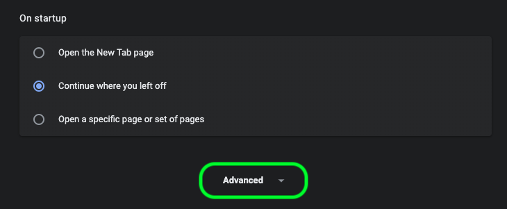

# 데이터 과학 작업 공간 문제 해결 가이드

이 문서에서는 Adobe Experience Platform 데이터 과학 작업 공간에 대한 FAQ에 대해 설명합니다. 플랫폼 API에 대한 일반적인 질문 및 문제 해결에 대해서는 [Adobe Experience Platform API 문제 해결 가이드를 참조하십시오](../landing/troubleshooting.md).

## Google Chrome에서 JupiterLab 환경이 로드되지 않음

>[!IMPORTANT] 이 문제는 해결되었지만 Google Chrome 80.x 브라우저에 여전히 존재할 수 있습니다. 크롬 브라우저가 최신 버전인지 확인하십시오.

Google Chrome 브라우저 버전 80.x에서는 기본적으로 모든 타사 쿠키가 차단됩니다. 이 정책을 사용하면 JupiterLab이 Adobe Experience Platform 내에서 로드되지 않을 수 있습니다.

이 문제를 해결하려면 다음 단계를 수행하십시오.

크롬 브라우저에서 오른쪽 상단으로 이동하고 **설정** (또는 주소 표시줄에 &quot;chrome://settings/&quot;을 복사하여 붙여 넣을 수 있음)을 선택합니다. 그런 다음 페이지 아래쪽으로 스크롤하고 **고급** 드롭다운을 클릭합니다.



개인 *정보 및 보안* 섹션이 나타납니다. 그런 다음 **사이트 설정을** 클릭한 다음 **쿠키 및 사이트 데이터를 클릭합니다**.


마지막으로 &quot;타사 쿠키 차단&quot;을 &quot;해제&quot;로 전환합니다.


>[!NOTE] 또는 타사 쿠키를 비활성화하고 [* 추가할 수도 있습니다.]ds.adobe.net을 허용 목록에 추가합니다.

주소 표시줄의 &quot;chrome://flags/&quot;으로 이동합니다. 오른쪽의 드롭다운 메뉴를 사용하여 *&quot;기본 쿠키로* SameSite&quot;라는 플래그를 검색하고 비활성화합니다.


2단계 후 브라우저를 다시 실행하라는 메시지가 표시됩니다. 다시 실행한 후에는 Jupiterlab에 액세스할 수 있어야 합니다.

## Safari에서 JupiterLab에 액세스할 수 없는 이유는 무엇입니까?

Safari는 Safari &lt; 12에서 기본적으로 타사 쿠키를 비활성화합니다. Jupiter 가상 시스템 인스턴스가 부모 프레임과 다른 도메인에 있으므로 Adobe Experience Platform에서는 현재 타사 쿠키를 활성화해야 합니다. 타사 쿠키를 활성화하거나 Google Chrome과 같은 다른 브라우저로 전환하십시오.

Safari 12의 경우 사용자 에이전트를 &#39;Chrome&#39; 또는 &#39;Firefox&#39;로 전환해야 합니다. 사용자 에이전트를 전환하려면 먼저 *Safari* 메뉴를 열고 기본 설정을 **선택합니다**. 기본 설정 창이 나타납니다.


Safari 환경 설정 창에서 **고급을 선택합니다**. 그런 다음 메뉴 모음 *에 현상 표시 메뉴를* 선택합니다. 이 단계가 완료된 후 기본 설정 창을 닫을 수 있습니다.


그런 다음 위쪽 탐색 모음에서 현상 **메뉴를** 선택합니다. 현상 드롭다운 *에서* 사용자 에이전트 *위로*&#x200B;마우스를 가져갑니다. 사용할 **Chrome** 또는 **Firefox** 사용자 에이전트 문자열을 선택할 수 있습니다.


## JupiterLab에서 파일을 업로드하거나 삭제할 때 &#39;403 금지&#39; 메시지가 표시되는 이유는 무엇입니까?

Ghostery 또는 AdBlock Plus와 같은 광고 차단 소프트웨어를 사용하는 브라우저가 활성화되어 있는 경우 JupiterLab이 정상적으로 작동하려면 각 광고 차단 소프트웨어에 &quot;\*.adobe.net&quot; 도메인이 허용되어야 합니다. 이는 JupiterLab 가상 컴퓨터가 경험 플랫폼 도메인과 다른 도메인에서 실행되기 때문입니다.

## 내 Jupiter Notebook의 일부 부분이 스크램블되거나 코드로 렌더링되지 않는 이유는 무엇입니까?

문제가 있는 셀이 실수로 &quot;코드&quot;에서 &quot;표시&quot;로 변경된 경우 이 문제가 발생할 수 있습니다. 코드 셀에 초점을 맞추는 동안 키 조합을 **ESC+M** 누르면 셀 유형이 마크다운으로 변경됩니다. 선택한 셀의 노트북 맨 위에 있는 드롭다운 표시기로 셀 유형을 변경할 수 있습니다. 셀 유형을 코드로 변경하려면 변경할 지정된 셀을 선택하여 시작합니다. 그런 다음 셀의 현재 유형을 나타내는 드롭다운을 클릭하고 &quot;코드&quot;를 선택합니다.


## 사용자 정의 Python 라이브러리를 어떻게 설치합니까?

Python 커널은 많은 인기 있는 기계 학습 라이브러리와 함께 미리 설치됩니다. 그러나 코드 셀 내에서 다음 명령을 실행하여 추가 사용자 정의 라이브러리를 설치할 수 있습니다.

```shell
!pip install {LIBRARY_NAME}
```

사전 설치된 Python 라이브러리의 전체 목록은 JupiterLab 사용 안내서의 [부록 섹션을 참조하십시오](./jupyterlab/overview.md#supported-libraries).

## 사용자 정의 PySpark 라이브러리를 설치할 수 있습니까?

PySpark 커널용 라이브러리를 추가로 설치할 수는 없습니다. 그러나 사용자 정의 PySpark 라이브러리를 설치하려면 Adobe 고객 서비스 담당자에게 문의하십시오.

사전 설치된 PySpark 라이브러리 목록은 JupiterLab 사용 안내서의 [부록 섹션을 참조하십시오](./jupyterlab/overview.md#supported-libraries).

## JupiterLab Spark 또는 PySpark 커널용 Spark 클러스터 리소스를 구성할 수 있습니까?

전자 필기장의 첫 번째 셀에 다음 블록을 추가하여 리소스를 구성할 수 있습니다.

```python
%%configure -f 
{
    "numExecutors": 10,
    "executorMemory": "8G",
    "executorCores":4,
    "driverMemory":"2G",
    "driverCores":2,
    "conf": {
        "spark.cores.max": "40"
    }
}
```

구성 가능한 속성의 전체 목록을 비롯하여 Spark 클러스터 리소스 구성에 대한 자세한 내용은 JupiterLab [사용 안내서를 참조하십시오](./jupyterlab/overview.md#kernels).